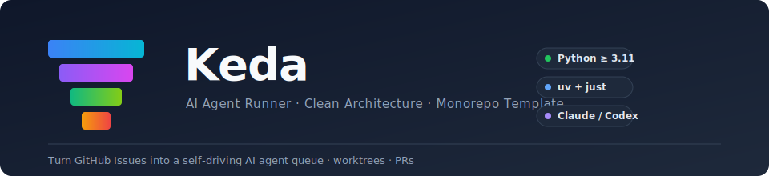
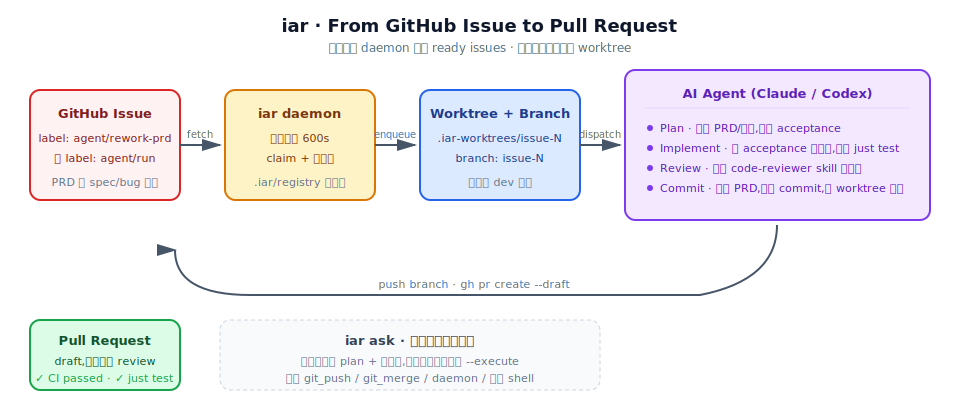
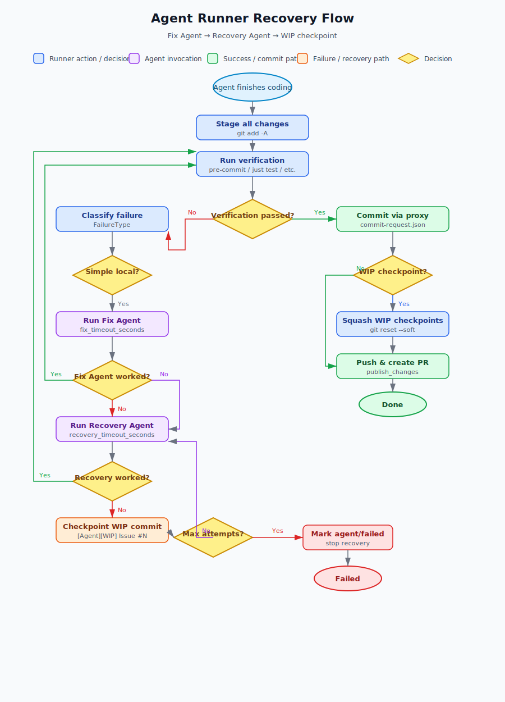
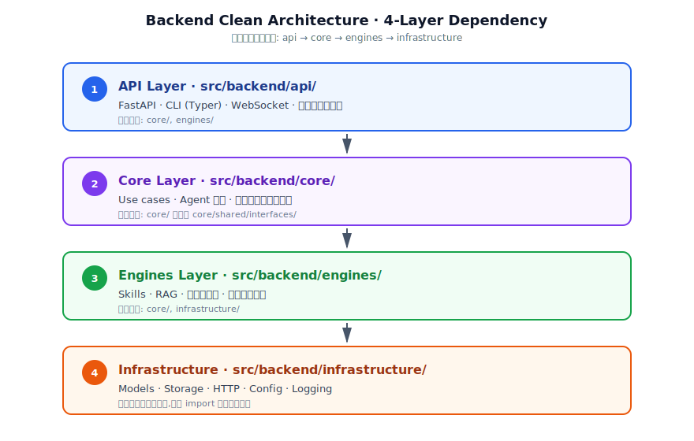

# Keda

<p align="center">
  
</p>

<p align="center">
  <a href="https://github.com/zata-zhangtao/keda/stargazers"></a>
  <a href="https://github.com/zata-zhangtao/keda/network/members"></a>
  <a href="https://github.com/zata-zhangtao/keda/issues"></a>
  <a href="https://github.com/zata-zhangtao/keda/pulls"></a>
  
  <a href="./LICENSE"></a>
  <a href="https://pypi.org/project/keda/"></a>
</p>

> 面向 AI Agent 与通用 Python 工程实践的模块化单体项目模板。基于 Clean Architecture 四层架构，内置 `iar`（issue-agent-runner）CLI，支持将 GitHub Issues 转为本地 AI Agent 队列并自动管理 Worktree 生命周期。

## 一键安装

无需克隆仓库，直接在新机器上安装 `iar` CLI。安装器会自动选择 `uv` / `pipx` / `pip --user` 中可用的那个，零 sudo，失败有明确提示。详见 `docs/getting-started/installation.md`。

**默认安装（从 GitHub release tarball）：**

```bash
curl -fsSL https://raw.githubusercontent.com/zata-zhangtao/keda/main/install.sh | bash
iar --version
iar init   # 在任意 Git 仓库内运行，会自动写入 .iar.toml 并复制 prd / code-reviewer 两个 Skill
```

**从 PyPI 安装（keda 已发布到 PyPI 后可用）：**

```bash
curl -fsSL https://raw.githubusercontent.com/zata-zhangtao/keda/main/install.sh | bash -s -- --source pypi
iar --version
```

也可以绕过 install.sh，直接用包管理器安装：

```bash
uv tool install keda          # 推荐：uv 隔离环境
# 或
pip install --user keda       # 兜底：用户级安装
```

**安装参数速查：**

| 选项 | 说明 |
|------|------|
| `--version <tag>` | 安装指定 release tag（默认: latest） |
| `--method uv\|pipx\|pip` | 强制使用指定安装器（默认自动选择） |
| `--source auto\|pypi\|tarball` | 安装源（默认: `auto` = GitHub tarball） |
| `--check` | dry-run，只打印计划 |
| `--uninstall` | 卸载 keda 工具环境与 iar binary |

环境变量等价：`KEDA_VERSION`、`KEDA_INSTALL_METHOD`、`KEDA_SOURCE`、`KEDA_PYPI=1`（legacy，等价于 `--source pypi`）。

## 前置要求

- Python >= 3.11
- [uv](https://docs.astral.sh/uv/) — Python 包管理器（安装器会自动 bootstrap）
- [just](https://github.com/casey/just) — 命令运行器
- Node.js（如需运行前端）

## 快速开始

```bash
# 1. 克隆仓库并进入目录
git clone <repository-url>
cd keda

# 2. 初始化开发环境（安装依赖 + pre-commit hooks）
uv sync --all-extras
uv run pre-commit install

# 3. 启动服务（后端 + 前端，分别开两个终端）
uv run python -m backend.main          # 后端（默认 8000 端口）
cd frontend && npm run dev             # 前端（默认 5173 端口）
```

> 项目提供了 `justfile` 作为便捷封装（如 `just dev`、`just run`、`just test`），如果你使用 [just](https://github.com/casey/just)，可以直接调用。下文只列出底层命令。

## `iar` CLI 使用说明

<p align="center">
  
</p>

`iar`（issue-agent-runner）是本项目的核心工具，用于将 GitHub Issues 转为本地 AI Agent 任务队列，自动创建 Git Worktree 并驱动 Agent 执行。

### Recovery Flow

当 Agent 提交遇到 pre-commit、测试或 verification 失败时，`iar` 不会直接失败退出，而是按下面两层 escalator 逐步修复，最大限度减少人工干预和 API 浪费：

1. **Fix Agent**：对简单局部问题（如 lint 逻辑错误、单测失败、遗漏 import），启动一个只聚焦当前 verification 失败的轻量 agent，使用更短的 `fix_timeout_seconds`。
2. **Recovery Agent**：对复杂或全局失败（evidence、PRD checklist、commit request 等），启动完整 recovery agent，使用独立的 `recovery_timeout_seconds`。

为了降低重复犯错和重复摸索的概率，runner 会在各阶段 prompt 中透传 verification 上下文：

- 首次实现 prompt 会列出 runner 将要执行的完整 `verification_commands`。
- Fix Agent / Recovery Agent 的 prompt 会附带具体失败的命令、exit code、stdout/stderr。
- 跨 claim 续作 prompt 会继承上一次失败的 verification 输出。

如果某轮修复仍未通过，runner 会先创建一个 `[Agent][WIP] Issue #N checkpoint` commit 保存进度，使其能跨 claim 续作；这些 checkpoint 在最终合并时由 GitHub/GitLab squash 收敛为干净历史，不再由 runner 内部压平。

<p align="center">
  
</p>

### 安装 `iar` 全局命令

本项目通过 `pyproject.toml` 的 `[project.scripts]` 注册了 `iar` CLI。开发本仓库时推荐以可编辑模式安装为全局命令，这样源码改动可直接反映到 `iar`，无需每次重新构建安装：

```bash
# 在仓库根目录安装（推荐）
uv tool install --reinstall --editable .

# 或从任意目录指定项目路径
uv tool install --reinstall --editable /path/to/keda
```

`uv tool install` 的参数应是项目目录或包名，不要传入 `README.md` 等普通文件路径。当 `pyproject.toml` 的依赖或 CLI 入口变更后，需要重新执行可编辑安装命令：

```bash
uv tool install --reinstall --editable .
```

安装后可直接使用 `iar <command>`；未安装时可用 `uv run iar <command>` 代替。CLI 基于 Typer/Rich，`iar --help` 会展示分组命令、参数和别名。

### 安装 shell 自动补全

安装补全后，zsh 中输入 `iar is<Tab>` 可补全到 `issue`：

```bash
# zsh（推荐）
iar completion install --shell zsh
source ~/.zshrc

# 仅查看补全脚本，不写入 shell 配置
iar completion show --shell zsh
```

也支持 `--shell bash` 和 `--shell fish`。

### 初始化与配置

**前置步骤：所有 `iar` 子命令（除 `iar init` 本身外）都要求目标仓库已经执行过 `iar init`**。未初始化时命令会立即失败并提示运行 `iar init`。

```bash
# 在目标仓库初始化本地配置
iar init
# 或未安装全局命令时
uv run iar init

# 把 preview workflow 模板（GitHub Actions + deploy/vps-traefik + scripts/）复制到当前仓库
iar workflow install preview

# 同步当前仓库的 GitHub Labels
iar labels sync

# 同步指定仓库 Labels
iar labels sync --repo-id keda
```

### 从 PRD 创建 Issue

```bash
# 从 PRD 创建 GitHub Issue，标记为 ready（默认发布 PRD）
iar issue create tasks/pending/example.md --repo-id keda --agent codex --ready
```

### 运行 Agent

```bash
# 单次执行（dry-run 预览，不实际执行）
iar run --dry-run

# 单次执行（当前仓库）
iar run

# 处理 registry 中所有启用的仓库
iar run --all

# Daemon 模式轮询（默认每 120 秒，监控所有已注册仓库）
iar daemon

# Review daemon 模式轮询（默认每 120 秒，监控所有已注册仓库）
iar review-daemon

# 只监控单个仓库
iar daemon --repo-id keda
```

### 自然语言决策入口（`iar ask`）

`iar ask` 是一个受限自然语言决策入口。默认只生成计划并写入审计文件，不执行任何副作用：

```bash
# 默认只输出计划
uv run iar ask "帮我判断现在应该创建 issue 还是启动任务"

# 显式指定 planner agent（默认 codex）
uv run iar ask "从 pending PRD 中挑一个最适合创建 issue 的任务" --agent codex

# 只打印计划，适合 CI 验证
uv run iar ask "现在可以跑一个 ready issue 吗" --plan-only

# 进入确认执行流程（TTY 中要求输入 decision_id）
uv run iar ask "从 tasks/pending/example.md 创建 issue" --execute

# 非交互执行（仅允许 low/medium 风险动作）
uv run iar ask "运行一次 dry-run 看看 ready 队列" --execute --yes
```

白名单动作包括：`show_status`、`run_deliberation`、`create_issue_from_prd`、`mark_issue_ready`、`run_once_dry_run`、`run_once`、`review_once_dry_run`、`review_once`、`needs_clarification`、`no_op`。禁止动作包括 `git_push`、`git_merge`、`daemon`、任意 shell 命令等。Planner agent 必须通过可验证只读命令运行；目前仅 `codex` 被验证为安全。

### 清理已关闭 Issue 的本地分支

`iar worktree cleanup` 用于清理本地遗留的 `issue-<number>` 分支及
`.iar-worktrees/issue-<number>` worktree。默认只预览；只有传入 `--yes` 才会删除。
清理前会执行 `git fetch <remote> --prune`，并且默认只删除同时满足“GitHub Issue
已关闭、远端同名分支已不存在、worktree 干净、分支已合入远端 base branch”的分支。
历史 `<repo>-worktrees/tasks/issue-<number>` worktree 不会被该命令自动删除，应按需
手动清理。

```bash
# 预览将会清理哪些本地 issue 分支
iar worktree cleanup --dry-run

# 执行安全清理
iar worktree cleanup --yes

# 同时删除脏 worktree 或未合入分支（谨慎）
iar worktree cleanup --yes --force
```

### 多仓库配置

在 `config.toml` 中配置多个仓库：

```toml
[agent_runner.repositories.keda]
path = "/Users/zata/code/keda"
enabled = true

[agent_runner.repositories.backend_service]
path = "/Users/zata/code/backend-service"
enabled = true
```

每个仓库根目录应有自己的 `.iar.toml` 文件，用于覆盖 runner、git、labels 等配置。

## Git Worktree 工作流

本项目内置 Git Worktree 脚本，用于隔离开发环境：

```bash
# 创建并进入新 worktree（自动同步远程 base branch）
./scripts/shared/worktree/create.sh feature-branch

# 基于远程分支创建 worktree
./scripts/shared/worktree/create.sh feature-login --checkout origin/feature-login

# 指定来源分支
./scripts/shared/worktree/create.sh issue-15 --checkout zata/issue-15

# 强制新建本地分支（忽略同名远程分支）
./scripts/shared/worktree/create.sh feature-x --new

# 打开已有 worktree
./scripts/shared/worktree/open.sh feature-branch

# 合并 worktree 并清理
./scripts/shared/worktree/merge.sh feature-branch

# 删除 worktree
./scripts/shared/worktree/merge.sh feature-branch -d

# 诊断 worktree 状态
./scripts/shared/worktree/merge.sh --doctor
```

创建 worktree 后会自动安装 Python 和前端依赖。

## PRD 驱动开发

```bash
# 从 PRD 自动创建 worktree 并启动 AI 工具
./scripts/shared/worktree/create.sh feature-x --subdir tasks
cp tasks/pending/feature-x.md ../tasks/feature-x/tasks/pending/feature-x.md
# 然后在 worktree 中启动 AI 工具执行 PRD
```

> 更完整的 PRD → worktree → AI 实现流程可参考 `justfile.shared` 中的 `implement` recipe。

## 测试

```bash
# 运行本地测试（无需 API Key）
# 第一次会完整执行并生成 .testmondata；后续仅运行与当前变更相关的测试
just test

# 强制运行全部测试，忽略 .testmondata
just test all

# 强制运行需要真实 API 的测试，忽略 .testmondata
just test real

# 直接调用 pytest（同样默认启用 --testmon）
uv run pytest tests/ -v

# 运行 Playwright E2E 测试（需先安装）
cd tests/playwright-e2e && npm install && npx playwright install chromium
cd tests/playwright-e2e && npm test
cd tests/playwright-e2e && npm run test:smoke      # 仅冒烟测试
cd tests/playwright-e2e && npm run test:no-auth    # 无需登录的公开页面测试
cd tests/playwright-e2e && npm run report          # 打开测试报告
```

## 文档

```bash
# 本地预览（带热重载，默认 8000 端口）
WATCHDOG_USE_POLLING=1 uv run mkdocs serve -a 127.0.0.1:8000

# 构建静态文档
uv run mkdocs build --strict
```

## 配置说明

- **全局配置**：`config.toml` — 应用、数据库、模型、Agent Runner 等全局设置
- **仓库级配置**：`.iar.toml` — 每个目标仓库根目录的 runner 覆盖配置
- **敏感信息**：`.env` — 密码、API Key 等（已加入 .gitignore）

主要配置项：
- `app.name` / `app.log_level` — 应用名称与日志级别
- `database.*` — PostgreSQL 数据库配置
- `chat_model.*` — LLM 模型配置（provider、temperature 等）
- `agent_runner.*` — Agent Runner 完整配置（labels、git、worktree、runner、safety、prompts）

## 架构概览

<p align="center">
  
</p>

源码目录约定：

```
src/backend/
  api/           → 请求接入层（API、WebSocket、CLI）
  core/          → 核心编排层（用例、Agent 编排、领域契约）
  engines/       → 平台能力层（skills、RAG、可插拔能力）
  infrastructure/ → 基础设施层（模型、存储、HTTP、配置、日志）
```

依赖方向严格向下：`api → core → engines → infrastructure`，由 `hooks/check_architecture.py` 在 pre-commit 强制校验。

## Docker 部署

```bash
# Docker Compose 启动
docker compose up --build
```

详见 `docker-compose.yml` 和 `docker-compose.dokploy.yml`。

## 开发规范

- 公共 Python API 使用 [Google Style Docstrings](https://google.github.io/styleguide/pyguide.html)
- 变量命名需具有来源、类型或状态语义，避免 `data`、`item`、`res`
- Python 文本文件 I/O 必须显式写 `encoding="utf-8"`
- 新增代码前先搜索现有实现；参数超过 4 个时收敛到对象
- 单代码文件非空行不超过 1000 行
- 提交前会自动运行 pre-commit hooks

## 许可证

本项目基于 **Apache License 2.0** 开源发布 —— 你可以自由使用、修改、分发，也可以将其用于商业产品，但需保留版权声明并随分发物附带 `LICENSE` 文件。

```
Copyright 2026 zata
Licensed under the Apache License, Version 2.0
```

完整文本见 [`LICENSE`](./LICENSE)。Apache 2.0 的关键条款：

- ✅ 商用、私有 fork、修改、再分发
- ✅ 授予使用者**专利使用权**（patent grant）
- ⚠️ 必须保留版权、商标与归属声明
- ⚠️ 修改文件需显著标注
- 🚫 不得使用 `keda` / `iar` 商标暗示官方背书

## 致谢

- [FastAPI](https://github.com/tiangolo/fastapi) · [Typer](https://github.com/tiangolo/typer) · [Rich](https://github.com/Textualize/rich) — 后端 & CLI 栈
- [uv](https://github.com/astral-sh/uv) · [just](https://github.com/casey/just) — 工具链
- [MkDocs Material](https://github.com/squidfunk/mkdocs-material) — 文档站
- [Anthropic Claude](https://www.anthropic.com/) · [OpenAI Codex](https://openai.com/) — 驱动 `iar` 的 AI Agent
