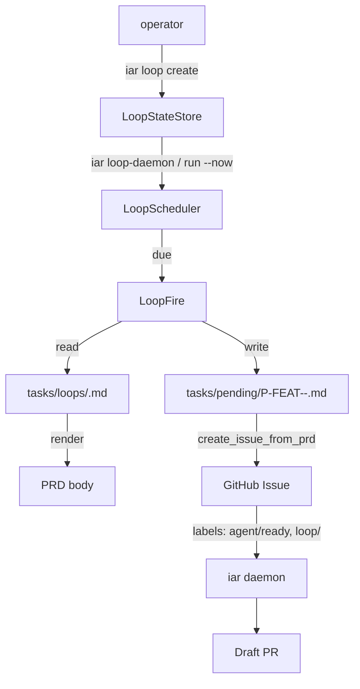

# IAR Loop — 定时循环任务

> Issue #110 交付物。`iar loop` 子系统让运维者把 GitHub Issue 的“造票”变成
> 定时任务，每天/每小时自动生成一份 PRD + Issue，交给现有 runner 流转到 PR。

## 为什么需要 Loop

`iar` 已经能把单条 Issue 跑成 PR，但运维场景里很多任务是**周期性的**：

- 每天早上 8 点抓取 GitHub Trending，写入知识库；
- 每周一汇总上周 PR 漏测项；
- 每月 1 日扫描依赖过期版本。

之前只能依赖外部 cron 调 `iar issue create`，既没有配方管理，也无法
复用 IAR 的 Acceptance Checklist / Worktree / Draft PR 闭环。`iar loop`
就是为了把这种“定时造票”正式接入 IAR 主流程。

## 与 Claude `/loop` 的差异：Persistent vs Session

Claude Code 的 `/loop` 是**会话级**的（随终端关闭而消失，最长 3 天，
最多 50 条）。IAR 是面向**无人值守**的 runner，loop 必须能在机器/会话
关闭后继续执行，所以本 PRD **只实现 persistent loop**：

| 维度 | Claude `/loop` | IAR Loop（persistent） |
|---|---|---|
| 生命周期 | 当前会话 | 持久化到 `~/.iar/loop-state.json` |
| 最大时长 | 3 天 | 任意（无过期） |
| 数量上限 | 50 / 会话 | 无硬上限 |
| 调度 | `5m`/`1h`/`1d` interval | cron (`0 8 * * *`) 或 interval (`10m`/`1h`)；`--every 1d` 隐式对齐到 `0 0 * * *` |
| 配方 | 自然语言 / 命令 | 仓库内 Markdown + YAML frontmatter |
| 执行 | Claude 在当前终端 | 现有 `iar daemon` / `iar run` |

后续可扩展 `iar loop --session`（会话级监控），但当前 PRD **不包含**。

## 配方格式（Recipe）

Loop 配方是仓库内的 Markdown 文件，建议存放在 `tasks/loops/<id>.md`。
配方由 **YAML frontmatter**（调度元数据）和 **Markdown body**（PRD 模板）组成。

### 完整 frontmatter 字段说明

| 字段 | 必填 | 类型 | 默认 | 说明 |
|---|---|---|---|---|
| `id` | ✅ | string | — | loop 唯一标识，kebab-case（如 `github-trending`）。必须与文件 `iar loop create <id>` 一致。 |
| `schedule` | ✅ | string | — | 5 字段 cron 表达式（本地时区），或 interval 简写 `10m` / `1h` / `1d`（`1d` 自动按 `0 0 * * *` 解析）。 |
| `repo_id` | ✅ | string | — | 目标仓库在 `config.toml` 中的注册 ID。 |
| `issue_type` |  | enum | `feature` | `feature` / `refactor` / `bug`，决定初始 `type/*` 标签。 |
| `agent` |  | enum | `auto` | `auto` / `claude` / `codex` / `kimi`，决定 agent 路由标签。 |
| `labels` |  | list | `[]` | 除默认 `loop/<id>` 外附加的 GitHub labels。 |
| `publish_prd` |  | bool | `true` | 创建 Issue 前是否 commit/push PRD。 |
| `queue_ready` |  | bool | `true` | 是否贴 `agent/ready` 标签让 runner 认领。 |
| `run_now` |  | bool | `false` | 造票后是否立即调用 `run_agent_repositories_once`。 |
| `pre_command` |  | string | `null` | 触发前执行的 shell 命令，stdout 中 `KEY=value` 行会被注入模板变量。 |
| `timezone` |  | string | 系统本地 | IANA 时区名（如 `Asia/Shanghai`），用于 cron 调度。 |
| `priority` |  | string | `P2` | 生成 PRD 文件名前缀（`P0`–`P3`）。 |
| `slug` |  | string | `<id>` | 生成 PRD 文件名中的 slug。 |

### 模板变量

Body 中支持 `{{name}}` 占位符，触发时渲染：

| 变量 | 渲染为 | 示例 |
|---|---|---|
| `{{date}}` | `YYYY-MM-DD` | `2026-06-23` |
| `{{timestamp}}` | `YYYYMMDD-HHMMSS` | `20260623-080000` |
| `{{datetime}}` | ISO-8601 本地时间 | `2026-06-23T08:00:00+08:00` |
| `{{loop_id}}` | recipe id | `github-trending` |
| `{{repo_id}}` | 目标仓库 id | `keda` |

`pre_command` 输出的 `KEY=value` 行会被合并到同一变量集合。

### 示例：`tasks/loops/github-trending.md`

```markdown
---
id: github-trending
schedule: "0 8 * * *"
repo_id: keda
priority: P2
issue_type: feature
agent: auto
labels:
  - area/discovery
publish_prd: true
queue_ready: true
run_now: false
timezone: Asia/Shanghai
slug: github-trending
---

# PRD: Daily GitHub Trending digest

Tracked implementation task for **Daily GitHub Trending digest**.

## Goal

Every morning, scan GitHub Trending, summarize top repos for {{date}}.

## Acceptance Checklist

- [ ] Fetch today's GitHub Trending list.
- [ ] Write digest to `docs/trending/{{date}}.md`.
- [ ] Open a draft PR linking this Issue.

## Reference data

- Loop id: {{loop_id}}
- Target repository: {{repo_id}}
```

## CLI 用法

`iar loop` 子命令模仿 Claude Code 的 `/loop` 词汇，但语义对齐 IAR 持久化需求。

### `iar loop create`

```bash
iar loop create github-trending \
    --recipe tasks/loops/github-trending.md \
    --cron "0 8 * * *"
```

- `--cron "<expr>"` 或 `--every <interval>` 二选一，缺省使用配方内 schedule。
- `--repo-id <id>` / `--repo <path>` 临时覆盖配方中的目标仓库。
- `--force` 覆盖已存在的同名 loop。
- 注册成功后写入 `~/.iar/loop-state.json`，并计算 `next_fire_at`。

### `iar loop list`

打印所有 loop 的 id / repo_id / schedule / enabled / next_fire 表格：

```
id                       repo_id                   schedule                     enabled     next_fire
---------------------------------------------------------------------------------------------------------
github-trending          keda                      cron:0 8 * * *               yes         2026-06-24T00:00:00+00:00
```

### `iar loop cancel <id>`

从 `~/.iar/loop-state.json` 删除条目；不影响已生成的 Issue / PRD / PR。

### `iar loop run --now <id>`

立即触发一次。常用于手动测试，触发后 `next_fire_at` 会重新计算。

### `iar loop run --now <id> --dry-run`

仅渲染 PRD、报告**将要**生成的文件路径和 Issue 标题，不写盘、不调 GitHub、
不更新状态。**建议每次配置新 loop 时先用 `--dry-run` 验证一次。**

### `iar loop-daemon [--interval <seconds>] [--dry-run]`

常驻调度进程，按 `--interval`（默认 60 秒，可通过 `IAR_LOOP_DAEMON_INTERVAL`
覆盖）轮询 `~/.iar/loop-state.json`：

- 到点的 loop 会调用 `fire_loop`，复用 `create_issue_from_prd` 创建 Issue。
- `loop/<id>` 标签 + recipe `labels` 会附加到 Issue。
- 异常被 `try/except` 捕获并记录，daemon 不退出。
- 同一天同一 loop 已有未关闭的 `loop/<id>` Issue 时，**跳过**重复创建。
- `--dry-run` 只跑一个 pass，打印 next fire 时间后退出，零副作用。

## 一次触发（fire）的完整流程



## 已知风险与限制

- **并发 daemon**：MVP 不加文件锁，请只跑一个 `iar loop-daemon` 进程。
- **时区**：cron 默认本地时区，`time-zone: Asia/Shanghai` 等显式设置更稳。
- **pre_command 失败**：失败时 loop 标记 `last_error` 但不中断 daemon。
- **同一天去重**：通过 `loop/<id>` 标签 + Issue 标题日期判断；手动改 Issue 标题可能绕过去重。

## 后续规划

- 自然语言 schedule（`every morning at 8am`）。
- 会话级 `iar loop --session`，对齐 Claude `/loop` 心智。
- 文件锁或迁移到 SQLite，避免多 daemon 并发写。

## Triage 决策树 Recipe 编写指南

> Issue #120 落地物。当 loop 每晚只发 1 个 Issue，但 Issue body 内置多类
> scope 的"今晚做哪个"决策树时，agent 在 worktree 内按 body 选 1 个最高
> ROI 的 scope 即可。本节给出这种 **triage decision tree recipe** 的
> 写作约定，示例见 `tasks/loops/nightly-cleanup-keda.md` 与
> `tasks/loops/nightly-cleanup-product.md`。

### 何时用 triage 决策树

当满足以下任一条件时，把多类 scope 写进同一份 recipe 的 body，比开多份
recipe / 多发 Issue 更划算：

- 多个 scope 彼此互斥或优先级固定（同一晚只做 1 个，强行并行 = 噪声）。
- 各 scope 每天的 ROI 波动大（某晚只 1 类有事、其他 3 类空跑）。
- 想给维护者每天 0–N 个 draft PR（N ≤ scope 数），按当日真实工作量浮动。

反例：scope 之间有依赖（必须按顺序做）→ 拆多份 recipe，每份强约束前一晚的
产物落地。

### Body 结构模板

recipe body 用以下骨架：

```text
# 任务总览 — {{date}}
（介绍 loop 频率 / 错峰策略 / 预期产出）

- 触发变量：last_ci_status={{last_ci_status}} 等
- 目标仓库：{{repo_id}}

## 1. <Scope A>（触发条件 / 行动指引 / 无事可做判定）
## 2. <Scope B>
## 3. <Scope C>
## 4. <Scope D>

## Triage 优先级
（明确当晚只做 1 个、CI > refactor > docs > deps 等优先级）
（明示 4 类都无事可做时：gh issue close <N> --comment "..." 收尾，不出 PR）
（明示 scope 标注命令：gh issue edit <N> --add-label scope/<x>）
```

每个 scope 段必须含三段式：

1. **触发条件** — 用 pre_command 注入变量 / 命令输出作为"今晚要不要做这件事"
   的判定输入（例：`last_ci_status != success`）。
2. **行动指引** — 给 agent 具体的文件路径 / 命令 / skill 引用（例：
   `uv run pylint --disable=all --enable=duplicate-code src/backend/`）。
3. **无事可做判定** — 显式给出"什么情况下跳过这个 scope"，避免 agent 强行
   找事出 PR。

### `scope/<x>` Label 约定

agent 选完 scope 后，用 `gh issue edit` 给 Issue 补标 `scope/<x>`，
其中 `x ∈ {ci, refactor, docs, deps}`。这 4 个 label 命名空间独立于
`loop/<id>`，可被非 nightly-cleanup 的其他 loop 复用。

**首次启用时**需要确保仓库里有这 4 个 label（`iar labels sync` 会自动创建
已知的 `agent/*` / `type/*` label，但 `scope/*` 命名空间是 Issue #120 新引入的，
可能需要手工 `gh label create` 或后续在 iar 内置 label 清单里加上）：

```bash
gh label create scope/ci       --color 5319E7 --description "Nightly cleanup: CI failure fix"
gh label create scope/refactor --color 1D76DB --description "Nightly cleanup: duplicate code merge"
gh label create scope/docs     --color 0E8A16 --description "Nightly cleanup: docs / mkdocs sync"
gh label create scope/deps     --color FBCA04 --description "Nightly cleanup: dependency upgrade"
```

PR 标题前缀对应 `cleanup(<scope>): <一句话描述>`，便于维护者用
`gh pr list --label scope/ci` 或 `gh pr list --search "cleanup(ci):"` 过滤。

### Frontmatter 必填项

triage 决策树 recipe 与普通 recipe 字段集完全一致（见上方"完整 frontmatter
字段说明"表），不引入新字段。本类 recipe 的典型设置：

```yaml
---
id: nightly-cleanup-<scope-coverage-name>
schedule: "0 2 * * *"   # 或 "30 2 * * *" 等错峰时间
repo_id: <registered-repo-id>
priority: P1            # P1 适合需要长期稳定运行的整理 loop
issue_type: feature
agent: auto
labels:
  - loop/cleanup        # 默认 loop/<id> 自动加，这里只加额外 label
publish_prd: true
queue_ready: true
run_now: true           # 当晚就让 agent runner 接管，不排队
timezone: Asia/Shanghai
slug: nightly-cleanup-<scope-coverage-name>
pre_command: "<单行 shell 命令，stdout 输出 KEY=value 行>"
---
```

`pre_command` 输出 `KEY=value` 行的变量集合必须与 body 内 `{{...}}` 占位符
一一对应（参考 `parse_pre_command_output` 的 `KEY=value` 解析规则）。注意
当前 frontmatter 用的是 MVP 版简单 YAML 解析器，**不支持** `|` / `>` 多行
block scalar，pre_command 必须写成单行 shell（用 `;` / `&&` 链接多步）。

### 错峰策略

多 recipe 同时跑时，建议错开 30 分钟（keda 02:00 / product 02:30 等）以
避免：

- GitHub API 配额短时间内集中消耗（`create_issue_from_prd` 一次 1+ 次 REST 调用）。
- `~/.iar/loop-state.json` 多个条目并发 upsert（虽然 iar-loop archive PRD 已有
  "only one daemon" 约定，但错峰是更进一步的防御）。

### 失败兜底

- `pre_command` 失败 → `fire_loop` 把 `last_error` 写入 loop-state.json，
  跳过本次 fire，daemon 不退出。下次 cron 到来再试。
- 当晚 4 类 scope 都无事可做 → agent 在 worktree 内执行
  `gh issue close <N> --comment "no actionable cleanup tonight"`，**不**出 PR。
- `scope/<x>` label 不存在 → `gh issue edit --add-label` 报错，agent 应
  停下来报告 reviewer，不要硬创 label（避免 label 命名空间失控）。

### 验收要点

新加一份 triage decision tree recipe 后，至少跑通以下命令：

```bash
# 1. 解析：recipe 通过 parse_loop_recipe
uv run pytest -o addopts="" tests/test_nightly_cleanup_recipe.py -v

# 2. 干跑：dry-run 不写文件、不建 Issue
uv run iar loop run --now nightly-cleanup-keda --dry-run
ls tasks/pending/                # 应无新文件
gh issue list --label loop/cleanup  # 应无新 Issue

# 3. 真实 fire：mock GitHub client 后跑（见 test_loop_fire.py 既有测试）
uv run pytest -o addopts="" tests/test_loop_fire.py -v
```

详见 `tests/test_nightly_cleanup_recipe.py`（覆盖 frontmatter 必填项、
4 类 scope 二级标题、pre_command 变量渲染、PR 标题前缀说明等）。
