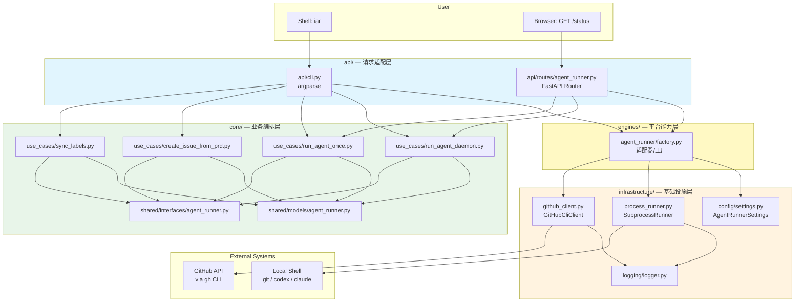

# PRD: 将 issue-agent-runner 迁移至四层架构后端

- GitHub Issue: https://github.com/zata-zhangtao/keda/issues/1

## 1. Introduction & Goals

将 `/Users/zata/code/keda` 仓库（`issue-agent-runner`，一个把 GitHub Issues 转为本地 AI Agent 队列的 Python CLI 工具）完整迁移到**当前仓库**中，并按照当前仓库严格的后端四层架构（`api → core → engines → infrastructure`）重新组织代码。

### 可衡量目标

- keda 的全部功能（`labels sync`、`issue-from-prd`、`run-once`、`daemon`）在当前仓库可用
- CLI 入口 `iar` 注册为项目脚本，运行行为与 keda 原仓库一致
- 新增少量 FastAPI 端点用于运行状态查询和健康检查
- 不引入数据库；状态继续以 GitHub Issues / Labels 为唯一数据源
- 复用当前模板的配置系统（`pydantic-settings` + `config.toml`）和日志系统
- 通过 `just lint` 和 `pytest` 的架构检查与测试

---

## 2. Requirement Shape

| 维度 | 内容 |
|------|------|
| **Actor** | 开发者 / 运维人员（通过 CLI 或 HTTP API 交互） |
| **Trigger** | 执行 `iar <subcommand>` 或访问 FastAPI 状态端点 |
| **Expected behavior** | CLI 子命令按 keda 原逻辑操作 GitHub Issues；FastAPI 暴露只读状态端点；daemon 作为常驻进程轮询 |
| **Explicit scope boundary** | 仅迁移 keda 业务逻辑并适配架构；不修改前端、不引入数据库存储、不改造 CI/CD 流水线（除新增 `project.scripts` 外）、不改变 keda 的零运行时 PyPI 依赖特性 |

---

## 3. Repository Context And Architecture Fit

### 3.1 当前相关模块

```
src/backend/
├── main.py                          # 入口占位符
├── api/                             # HTTP / CLI 请求层（当前空）
├── core/                            # 业务编排层
│   ├── shared/
│   │   ├── interfaces/              # 抽象接口（IModelClient 等已有占位）
│   │   └── models/                  # 领域模型（本次新增）
│   └── use_cases/                   # 业务用例（当前空）
├── engines/                         # 平台能力层（当前空）
└── infrastructure/                  # 基础设施层（已完善）
    ├── config/settings.py           # pydantic-settings 三层配置
    ├── logging/logger.py            # 单例日志（TimedRotatingFileHandler）
    ├── persistence/database.py      # SQLAlchemy（本次不新增模型）
    └── helpers.py                   # 无状态工具函数
```

### 3.2 现有架构模式

- **四层依赖方向**：`api/ → core/ → engines/ → infrastructure/`，由 `hooks/check_architecture.py` 强制检查
- **Clean Architecture / Ports & Adapters**：`core/shared/interfaces/` 定义抽象；`infrastructure/` 提供实现
- **配置系统**：`pydantic-settings` 三级优先级（env > `config.toml` > 代码默认），`settings.py` 中以 `*Settings` 类组织
- **日志系统**：`Logger` 单例，console + 文件，UTF-8 编码
- **SSA 命名规范**：变量名携带来源、类型或状态语义
- **测试**：pytest，测试文件在 `tests/`

### 3.3 复用候选

| 组件 | 来源 | 复用方式 |
|------|------|----------|
| 配置加载 | `infrastructure/config/settings.py` | 新增 `AgentRunnerSettings` 类，废弃 keda 的 `TomlConfigLoader` |
| 日志记录 | `infrastructure/logging/logger.py` | `infrastructure/` 与 `api/` 使用；`core/` 使用标准库 `logging` |
| 进程执行 | keda `infrastructure/process.py` | 迁移到 `infrastructure/process_runner.py`，符合基础设施层 |
| GitHub CLI 封装 | keda `infrastructure/github.py` | 迁移到 `infrastructure/github_client.py` |
| CLI 解析 | keda `api/cli.py` | 迁移到 `api/cli.py`，依赖 `core/use_cases/` 与 `engines/agent_runner/` |
| 基础设施适配/注入 | 新增 | `engines/agent_runner/` 负责实例化 `infrastructure/` 实现并注入 `core/use_cases/` |

### 3.4 架构约束

- `api/` 只能导入 `core/` 和 `engines/`，不能直接导入 `infrastructure/`
- `core/` 只能导入自身和 `core/shared/interfaces/`，不能导入 `engines/` 或 `infrastructure/`
- `engines/` 可以导入 `core/` 和 `infrastructure/`，提供适配与工厂能力
- `infrastructure/` 只能依赖外部第三方包，不得导入 `core/` / `engines/` / `api/`
- 单文件非空行不超过 1000 行
- Python 文本 I/O 必须显式写 `encoding="utf-8"`

### 3.5 冗余风险

- **风险**：keda 原有的 `domain/ports.py` 抽象接口与当前 `core/shared/interfaces/` 已有接口风格不同，需要统一为当前仓库的接口命名风格（`I` 前缀或语义命名）
- **风险**：keda 的配置 TOML 格式与当前 `config.toml` 不同，必须合并到统一配置文件中，避免双配置文件
- **风险**：keda 的 `print()` 直接输出与当前日志系统并存；`core/use_cases/` 必须使用标准库 `logging`（禁止导入 `infrastructure.logging.logger`），`api/` 和 `infrastructure/` 使用 `backend.infrastructure.logging.logger`

---

## 4. Recommendation

### 4.1 Recommended Approach

将 keda 的五层 Clean Architecture（`domain → application → infrastructure → api → main`）映射到当前仓库的四层架构，具体映射如下：

| keda 原层 | 当前仓库目标层 | 说明 |
|-----------|---------------|------|
| `domain/models.py` | `core/shared/models/agent_runner.py` | 领域模型（frozen dataclasses，仅用于 core 层） |
| `domain/ports.py` | `core/shared/interfaces/agent_runner.py` | 抽象端口，重命名为 `I*` 风格 |
| `application/use_cases/` | `core/use_cases/` | 业务用例，拆分独立文件，仅依赖接口 |
| `infrastructure/config.py` | 废弃，融入 `infrastructure/config/settings.py` | 复用 pydantic-settings（`AgentRunnerSettings` 使用 Pydantic `BaseModel`） |
| `infrastructure/github.py` | `infrastructure/github_client.py` | GitHub CLI 适配器 |
| `infrastructure/process.py` | `infrastructure/process_runner.py` | 子进程运行器 |
| — | `engines/agent_runner/factory.py` | **新增** 基础设施适配层：实例化实现并注入 use cases |
| `api/cli.py` | `api/cli.py` | CLI 命令解析和分发，通过 `engines/` 获取实现 |
| — | `api/routes/agent_runner.py` | 新增 FastAPI 只读状态路由 |
| `main/cli.py` / `cli.py` | `main.py` | 统一入口 |

**为什么这是最佳方案**：
- 严格遵守四层依赖方向（`api → core → engines → infrastructure`），`just lint` 的架构检查必然通过
- `engines/` 层承担适配器职责，避免 `api/` 直接依赖 `infrastructure/`，也避免 `core/` 直接依赖 `infrastructure/`
- 最大化复用当前模板已有基础设施（配置、日志、架构检查钩子）
- 保持 keda 原有业务逻辑不变，仅做包路径和命名风格适配
- CLI 为主、API 为辅的策略下，FastAPI 端点仅做状态暴露，不承载业务调用

### 4.2 Alternatives Considered

| 方案 | 说明 | 拒绝原因 |
|------|------|----------|
| 完全重写为纯 FastAPI 服务 | 所有操作通过 HTTP 端点触发 | 与用户"CLI 为主"的决策冲突 |
| 保留 keda 独立包结构 | 在 `src/` 下保留 `issue_agent_runner/` 作为子包 | 破坏当前仓库的统一架构约束，导致 `hooks/check_architecture.py` 无法检查跨包依赖 |
| 引入数据库存储 AgentRun 记录 | 用 SQLAlchemy 持久化运行历史 | 与用户"无数据库"决策冲突 |

---

## 5. Implementation Guide

### 5.1 Core Logic

数据和控制流保持 keda 原设计，仅适配到四层架构：

1. **CLI 路径**：`main.py` → `api/cli.py`（解析参数）→ `engines/agent_runner/factory.py`（实例化 `GitHubCliClient` / `SubprocessRunner`）→ `core/use_cases/`（业务编排，通过接口 `IGitHubClient` / `IProcessRunner` 调用）→ `infrastructure/github_client.py` / `infrastructure/process_runner.py`（外部调用）
2. **Daemon 路径**：`api/cli.py daemon` → `engines/agent_runner/factory.py` → `core/use_cases/run_agent_daemon.py` → 循环调用 `core/use_cases/run_agent_once.py`
3. **API 路径**：FastAPI `api/routes/agent_runner.py` → `engines/agent_runner/factory.py`（获取实现）→ `core/use_cases/`（只读查询，通过接口调用）→ `infrastructure/github_client.py`

### 5.2 Affected Files

#### 新增文件

```
src/backend/core/shared/models/agent_runner.py
src/backend/core/shared/interfaces/agent_runner.py
src/backend/core/use_cases/sync_labels.py
src/backend/core/use_cases/create_issue_from_prd.py
src/backend/core/use_cases/run_agent_once.py
src/backend/core/use_cases/run_agent_daemon.py
src/backend/engines/agent_runner/__init__.py
src/backend/engines/agent_runner/factory.py
src/backend/infrastructure/github_client.py
src/backend/infrastructure/process_runner.py
src/backend/api/cli.py
src/backend/api/routes/agent_runner.py
tests/test_sync_labels.py
tests/test_create_issue_from_prd.py
tests/test_run_agent.py
tests/test_agent_runner_cli.py
```

#### 修改文件

```
pyproject.toml                          # 新增 [project.scripts] iar 入口
config.toml                             # 新增 [agent_runner] 配置段
src/backend/infrastructure/config/settings.py   # 新增 AgentRunnerSettings（Pydantic BaseModel）
src/backend/main.py                     # 更新为 CLI / API 双模式入口
README.md                               # 说明 iar CLI 基本用法
AGENTS.md                               # 更新 Read Order 或相关指引
tests/conftest.py                       # 新增共享 mock/fixture（如 FakeGitHubClient、FakeProcessRunner）
```

### 5.3 Change Matrix

```text
Infrastructure
├── config.toml
│   [修改]
│   【总结】新增 [agent_runner] 配置段，统一收录 labels、git、worktree、runner、safety 子段
│
│   ├── 新增 [agent_runner] 根段（max_issues、default_agent）
│   ├── 新增 [agent_runner.labels] 子段（ready/running/review/failed/blocked/codex/claude）
│   ├── 新增 [agent_runner.git] 子段（remote、base_branch）
│   ├── 新增 [agent_runner.worktree] 子段（create_command、reuse_command、path_command）
│   ├── 新增 [agent_runner.runner] 子段（verification_commands）
│   └── 新增 [agent_runner.safety] 子段（auto_merge、forbidden_path_patterns）
│
├── src/backend/infrastructure/config/settings.py
│   [修改]
│   【总结】新增 AgentRunnerSettings 嵌套 Pydantic 配置类，通过 _TomlSectionSource 加载 [agent_runner] 段
│
│   ├── 新增 AgentRunnerLabelSettings / AgentRunnerGitSettings / AgentRunnerWorktreeSettings / AgentRunnerRunnerSettings / AgentRunnerSafetySettings 子模型
│   ├── 新增 AgentRunnerSettings（BaseSettings）并在 AppSettings 中聚合为 agent_runner 字段
│   └── 保持 env_prefix="AGENT_RUNNER_" 三层优先级（env > config.toml > 默认值）
│
├── src/backend/infrastructure/github_client.py
│   [新增]
│   【总结】GitHub CLI 封装，通过 subprocess 调用 gh 实现 label、issue、draft PR 操作
│
│   ├── 实现 sync_labels（批量创建/更新标准 labels）
│   ├── 实现 list_ready_issues（按 label 筛选 open issues 并解析 JSON）
│   ├── 实现 edit_issue_labels / comment_issue / create_issue / create_draft_pr
│   └── 通过 tempfile 写入 body 文件避免命令行注入
│
├── src/backend/infrastructure/process_runner.py
│   [新增]
│   【总结】子进程运行器，封装 subprocess.run 并返回 frozen CommandResult
│
│   ├── 统一使用 encoding="utf-8"
│   ├── check=True 时抛出 CalledProcessError
│   └── 支持 cwd / check / timeout 参数透传
│
└── hooks/check_architecture.py
    [修改]
    【总结】修正 api 层禁止导入列表，允许 api → engines 依赖以适配四层架构

    ├── FORBIDDEN_IMPORTS["api"] 从 ["infrastructure", "engines"] 修正为 ["infrastructure"]
    └── 确保 api 可通过 engines 层间接使用 infrastructure 实现

Domain
├── src/backend/core/shared/models/agent_runner.py
│   [新增]
│   【总结】领域模型（frozen dataclasses），定义 AppConfig 及子配置、CommandResult、IssueSummary
│
│   ├── CommandResult / IssueSummary / LabelConfig / GitConfig / WorktreeConfig / RunnerConfig / SafetyConfig / AppConfig
│   └── 仅供 core 层使用，与 pydantic-settings 配置类明确分离
│
├── src/backend/core/shared/interfaces/agent_runner.py
│   [新增]
│   【总结】抽象端口 IGitHubClient 和 IProcessRunner，供 core use_cases 依赖注入
│
│   ├── IProcessRunner：抽象 run 方法（command / cwd / check / timeout）
│   └── IGitHubClient：抽象 sync_labels / list_ready_issues / edit_issue_labels / comment_issue / create_issue / create_draft_pr
│
├── src/backend/core/use_cases/sync_labels.py
│   [新增]
│   【总结】标签同步用例，通过 IGitHubClient 在目标仓库创建/更新标准 labels
│
│   ├── 接收 LabelConfig 和 IGitHubClient
│   └── 使用标准库 logging（禁止导入 infrastructure.logger）
│
├── src/backend/core/use_cases/create_issue_from_prd.py
│   [新增]
│   【总结】PRD 解析与 Issue 创建用例，自动回写 Issue URL 到 PRD 文件头部
│
│   ├── 解析 PRD 标题和 Acceptance Checklist
│   ├── 构建 Issue body（含 PRD 路径、验收项、交付说明）
│   ├── 自动在 PRD 首行后插入 "- GitHub Issue: <url>"
│   └── 支持 --force 覆盖已有 Issue 链接
│
├── src/backend/core/use_cases/run_agent_once.py
│   [新增]
│   【总结】单次运行用例：claim issue → worktree → 运行 agent → 验证 → 提交 → 创建 draft PR
│
│   ├── choose_agent：按 CLI 参数 > Issue label > config 默认值选择 codex/claude
│   ├── create_or_reuse_worktree：调用配置的 git worktree 命令创建/复用隔离工作区
│   ├── run_agent：非交互式调用 codex（--sandbox workspace-write）或 claude（--permission-mode dontAsk）
│   ├── run_verification：执行配置验证命令（如 git diff --check、mkdocs build）
│   ├── validate_safe_changes：拒绝匹配 forbidden_path_patterns 的变更（如 .env、secrets/*）
│   └── publish_changes：commit、push、创建 draft PR、更新 issue labels 为 review
│
└── src/backend/core/use_cases/run_agent_daemon.py
    [新增]
    【总结】守护进程用例：循环调用 run_once，异常时记录日志并继续轮询

    ├── while True 循环，间隔由 --interval 控制
    └── 捕获全部异常防止 daemon 崩溃

API
├── pyproject.toml
│   [修改]
│   【总结】新增 [project.scripts] 注册 iar CLI 入口（iar = "backend.api.cli:main"）
│
├── src/backend/main.py
│   [修改]
│   【总结】更新为 FastAPI 启动入口，支持 uvicorn backend.main:app 启动 HTTP 服务
│
│   └── 原占位符逻辑替换为 uvicorn.run("backend.api.app:app")
│
├── src/backend/__main__.py
│   [新增]
│   【总结】模块入口，支持 python -m backend 启动 FastAPI
│
├── src/backend/api/app.py
│   [新增]
│   【总结】FastAPI 应用工厂，注册 agent_runner 路由并设置 /api/v1 前缀
│
├── src/backend/api/cli.py
│   [新增]
│   【总结】iar CLI 主入口，解析 labels sync / issue-from-prd / run-once / daemon 子命令
│
│   ├── 通过 engines/agent_runner/factory.py 实例化 GitHubClient / ProcessRunner / AppConfig
│   ├── --config 参数保留但输出 deprecated 警告
│   └── 禁止直接导入 infrastructure（通过 engines 层注入）
│
├── src/backend/api/routes/__init__.py
│   [新增]
│   【总结】routes 包初始化
│
└── src/backend/api/routes/agent_runner.py
    [新增]
    【总结】FastAPI 只读状态端点，暴露 runner 配置摘要和健康检查

    ├── GET /api/v1/agent-runner/status：返回配置摘要（labels、git、safety 等）
    └── GET /api/v1/agent-runner/health：检测 gh CLI 可用性

Tests
├── tests/conftest.py
│   [修改]
│   【总结】新增 FakeGitHubClient 和 FakeProcessRunner 共享 mock fixture
│
│   ├── FakeGitHubClient：内存实现 IGitHubClient，记录调用历史
│   └── FakeProcessRunner：内存实现 IProcessRunner，支持命令到响应的映射
│
├── tests/test_sync_labels.py
│   [新增]
│   【总结】测试 labels sync 用例逻辑
│
├── tests/test_create_issue_from_prd.py
│   [新增]
│   【总结】测试 PRD 解析、Issue 创建、URL 回写及 --force 覆盖逻辑
│
├── tests/test_run_agent.py
│   [新增]
│   【总结】测试 run_once 的 dry-run、agent 选择、安全验证和异常处理路径
│
└── tests/test_agent_runner_cli.py
    [新增]
    【总结】测试 CLI 参数解析和子命令分发逻辑

Docs
├── README.md
│   [修改]
│   【总结】新增 iar CLI 用法说明与 config.toml 配置指引
│
├── AGENTS.md
│   [修改]
│   【总结】更新 Read Order 和 Critical Summary，反映新增四层组件
│
├── docs/guides/agent-runner.md
│   [新增]
│   【总结】Agent Runner 使用指南文档
│
└── mkdocs.yml
    [修改]
    【总结】新增 Agent Runner 导航项到 "使用指南" 章节
```

### 5.4 Flow / Architecture Diagram



### 5.5 ER Diagram

No data model changes in this PRD. GitHub Issues and Labels remain the sole data source; no database tables are added.

### 5.6 Interactive Prototype Change Log

No interactive prototype file changes in this PRD.

### 5.7 External Validation

No external validation required; repository evidence was sufficient.

---

## 6. Definition Of Done

- [x] 所有 keda 功能子命令在迁移后行为一致（`labels sync`、`issue-from-prd`、`run-once`、`daemon`）
- [x] `iar --help` 和每个子命令的 `--help` 输出正常
- [x] `just lint` 通过（架构检查、格式检查）
- [x] `pytest` 全部通过（包含迁移后的原有测试 + 新增测试）
- [x] `config.toml` 新增 `[agent_runner]` 段，配置项可被 `pydantic-settings` 正确加载
- [x] FastAPI 状态端点可正常响应（`GET /api/v1/agent-runner/status`）
- [x] daemon 模式可在本地正常启动并轮询 GitHub Issues
- [x] 文档（`docs/`）同步更新，描述新的 `iar` CLI 和 FastAPI 端点
- [x] `mkdocs.yml` 同步更新
- [x] `README.md` 已更新，说明 `iar` CLI 基本用法
- [x] `AGENTS.md` 已更新，反映新增组件和文档路径

---

## 7. Acceptance Checklist

### Architecture Acceptance

- [x] `src/backend/core/shared/models/agent_runner.py` 存在且包含所有 keda 原领域模型（`CommandResult`, `IssueSummary`, `LabelConfig`, `GitConfig`, `WorktreeConfig`, `RunnerConfig`, `SafetyConfig`, `AppConfig`）
- [x] `src/backend/core/shared/interfaces/agent_runner.py` 存在且包含抽象接口（`IProcessRunner`, `IGitHubClient`）
- [x] `src/backend/core/use_cases/` 下存在 `sync_labels.py`, `create_issue_from_prd.py`, `run_agent_once.py`, `run_agent_daemon.py`
- [x] `src/backend/core/use_cases/` **仅导入 `core/shared/interfaces/` 和 `core/shared/models/`，不直接导入 `engines/` 或 `infrastructure/`**
- [x] `src/backend/engines/agent_runner/factory.py` 存在，负责实例化 `infrastructure/` 实现并注入 `core/use_cases/`
- [x] `src/backend/infrastructure/github_client.py` 存在且 `GitHubCliClient` 实现 `IGitHubClient`
- [x] `src/backend/infrastructure/process_runner.py` 存在且 `SubprocessRunner` 实现 `IProcessRunner`
- [x] `hooks/check_architecture.py` 检查通过（无 api→infrastructure 直接导入，无 core→infrastructure 直接导入，无 api→engines 以外的 infra 导入）
- [x] 新增代码文件非空行不超过 1000 行

### Dependency Acceptance

- [x] `pyproject.toml` 新增 `[project.scripts]` 段：`iar = "backend.api.cli:main"`
- [x] 未新增任何 PyPI 运行时依赖（keda 的零运行时依赖特性保持）
- [x] `config.toml` 新增 `[agent_runner]` 段，包含 labels、git、worktree、runner、safety 配置项
- [x] `src/backend/infrastructure/config/settings.py` 新增 `AgentRunnerSettings` 类并在 `AppSettings` 中聚合

### Behavior Acceptance

- [x] `iar labels sync` 在目标仓库成功创建/更新标准 labels
- [x] `iar issue-from-prd <path>` 成功解析 PRD、创建 GitHub Issue、回写 Issue URL
- [x] `iar run-once --dry-run` 正确列出 ready issues 但不执行
- [x] `iar run-once` 正确轮询、claim、执行 agent、验证、提交、创建 draft PR、更新 labels
- [x] `iar daemon --interval <n>` 持续轮询，异常时记录日志并继续
- [x] FastAPI `GET /api/v1/agent-runner/status` 返回当前 runner 状态（如 daemon 是否运行、配置摘要）
- [x] 安全边界保持：`auto_merge=False`、禁止路径模式（`.env`, `secrets/*` 等）生效

### Documentation Acceptance

- [x] `docs/` 中新增或更新 agent-runner 使用文档
- [x] `mkdocs.yml` 导航包含 agent-runner 文档
- [x] `README.md` 说明 `iar` CLI 的基本用法

### Validation Acceptance

- [x] `tests/test_sync_labels.py` 测试 labels sync 逻辑（mock `IGitHubClient`）
- [x] `tests/test_create_issue_from_prd.py` 测试 PRD 解析、Issue 创建、PRD 回写
- [x] `tests/test_run_agent.py` 测试 `run_once` 的 dry-run 和安全验证路径
- [x] `tests/test_agent_runner_cli.py` 测试 CLI 参数解析和分发逻辑
- [x] `tests/conftest.py` 提供共享 mock/fixture（`FakeGitHubClient`、`FakeProcessRunner` 等）
- [x] `just test` 全部通过

---

## 8. User Stories

### US-1: 作为开发者，我需要同步 GitHub Labels
> 当我运行 `iar labels sync --repo <path>` 时，系统应在目标仓库创建或更新所有标准 labels（`agent/ready`, `agent/running`, `agent/review`, `agent/failed`, `agent/blocked`, `agent/codex`, `agent/claude`, `source/prd`, `type/*`, `status/backlog`），并输出确认信息。

### US-2: 作为产品经理，我需要从 PRD 创建 GitHub Issue
> 当我运行 `iar issue-from-prd tasks/pending/xxx.md --type feature --ready` 时，系统应解析 PRD 标题和 Acceptance Checklist，在对应仓库创建 GitHub Issue，将 Issue URL 回写到 PRD 文件头部，并打上 `agent/ready` label。

### US-3: 作为开发者，我需要单次执行 Agent Runner
> 当我运行 `iar run-once --repo <path>` 时，系统应轮询 ready issues，claim 一个，在隔离 worktree 中运行 AI agent，验证修改，提交并推送分支，创建 draft PR，将 Issue label 更新为 `agent/review`。

### US-4: 作为运维人员，我需要常驻 Daemon 轮询
> 当我运行 `iar daemon --interval 300 --repo <path>` 时，系统应无限循环执行 `run-once`，每次轮询间隔 300 秒，异常时记录错误日志并继续。

### US-5: 作为开发者，我需要查询 Runner 状态
> 当我访问 `GET /api/v1/agent-runner/status` 时，系统应返回当前 runner 配置摘要、daemon 运行状态、上次轮询时间等只读信息。
>
> 实现路径：`api/routes/agent_runner.py` → `engines/agent_runner/factory.py`（获取 `IGitHubClient` 实现）→ `core/use_cases/`（查询状态）→ `infrastructure/github_client.py`。

---

## 9. Functional Requirements

### FR-1: CLI 子命令保持
`iar` CLI 必须保留以下子命令，参数行为与 keda 原仓库一致：
- `iar labels sync [--repo] [--config]`
- `iar issue-from-prd <prd_path> [--type] [--title] [--ready] [--agent] [--force] [--repo] [--config]`
- `iar run-once [--dry-run] [--agent] [--max-issues] [--repo] [--config]`
- `iar daemon --interval <seconds> [--agent] [--max-issues] [--repo] [--config]`

### FR-2: 配置统一
所有 `iar` 配置通过 `config.toml` 的 `[agent_runner]` 段管理，优先级为：环境变量 > `config.toml` > 代码默认值。废弃独立的 `.issue-agent-runner.toml`。`--config` 参数同步废弃（或在 CLI 中保留为无操作/警告，以兼容旧习惯）。

`[agent_runner]` 段内部结构保持 keda 原层级（`labels`、`git`、`worktree`、`runner`、`safety`），由 `AgentRunnerSettings`（Pydantic `BaseModel`）映射为嵌套模型。例如：

```toml
[agent_runner]
max_issues = 1
default_agent = "auto"

[agent_runner.labels]
ready = "agent/ready"
running = "agent/running"
# ...

[agent_runner.git]
remote = "origin"
base_branch = "main"

[agent_runner.worktree]
create_command = "just worktree --issue {issue_number} enter_shell=false"
# ...

[agent_runner.safety]
auto_merge = false
forbidden_path_patterns = [".env", ".env.*", "secrets/*"]
```

### FR-3: 安全边界
`run_once` 和 `daemon` 必须在发布变更前执行 `validate_safe_changes`，拒绝任何匹配 `forbidden_path_patterns` 的变更。`auto_merge` 必须为 `False`。

### FR-4: Agent 选择
Agent 选择优先级：CLI `--agent` 参数 > Issue label（`agent/codex` 或 `agent/claude`）> `config.toml` 的 `default_agent` > 默认 `codex`。

### FR-5: 日志统一
- `infrastructure/` 和 `api/` 层：使用 `backend.infrastructure.logging.logger` 的对应级别日志（info / warning / error）
- `core/use_cases/` 层：**使用 Python 标准库 `logging.getLogger(__name__)`**，不得直接导入 `backend.infrastructure.logging.logger`（避免 `core → infrastructure` 跨层依赖）
- `engines/` 层：使用 `backend.infrastructure.logging.logger` 或标准库 `logging` 均可

### FR-6: FastAPI 状态端点
新增 FastAPI Router，注册到主应用，暴露以下端点：
- `GET /api/v1/agent-runner/status` — 返回 runner 配置摘要和运行状态
- `GET /api/v1/agent-runner/health` — 返回 runner 健康状态（GitHub CLI 可用性、目标仓库可达性）

### FR-7: 入口双模式
`src/backend/main.py` 根据启动方式判断模式：
- 直接运行 `python -m backend` 或 `uvicorn backend.main:app` 时启动 FastAPI
- 运行 `iar`（通过 `project.scripts`）时进入 CLI 模式
- CLI 模式下，`api/cli.py` 通过 `engines/agent_runner/factory.py` 获取基础设施实现，再注入 `core/use_cases/`

---

## 10. Non-Goals

- [x] **不改造为纯 Web API**：CLI 仍是主要交互方式，FastAPI 仅做状态查询
- [x] **不引入数据库**：不新增 SQLAlchemy 模型，不修改 Alembic 迁移
- [x] **不改动前端**：`frontend/` 目录不涉及任何变更
- [x] **不修改 CI/CD 流水线**：`.github/workflows/` 不新增 agent-runner 特定步骤（除确保 `just test` 通过外）
- [x] **不引入 Celery / 异步任务队列**：daemon 保持为简单进程内循环
- [x] **不替换 gh CLI 为 PyGitHub**：继续通过 `subprocess` 调用 `gh` 命令
- [x] **不新增 PyPI 运行时依赖**：保持零运行时依赖（仅依赖 Python 标准库和当前模板已有依赖）
- [x] **不改变 `engines/` 通用定位**：`engines/agent_runner/` 仅为本次迁移所需的基础设施适配器，不扩展为通用平台能力

---

## 11. Risks And Follow-Ups

| 风险 | 影响 | 缓解措施 |
|------|------|----------|
| `gh` CLI 未安装或版本不兼容 | Agent Runner 功能完全不可用 | 在 `health` 端点检测 `gh` 可用性；文档明确标注前置依赖 |
| `codex` / `claude` CLI 未安装 | Agent 执行失败 | 在 `run_agent` 中给出清晰的错误提示；health 端点可选检测 |
| **架构检查钩子发现跨层导入** | **`just lint` 失败，阻塞合并** | **严格通过 `engines/agent_runner/factory.py` 做依赖注入，禁止 `api/` 和 `core/` 直接导入 `infrastructure/`；实施阶段逐文件验证导入链** |
| 单文件行数超限 | `just lint` 警告 | `runner.py` 原逻辑约 290 行，拆分为 `run_agent_once.py` + `run_agent_daemon.py` + `publish_changes` 辅助函数后应低于 1000 行 |
| frozen dataclass 与 pydantic-settings 不兼容 | 配置加载失败或类型错误 | `AgentRunnerSettings` 使用 Pydantic `BaseModel`，与 `core/shared/models/` 中的 frozen dataclass 明确分离 |

### Follow-Up（非阻塞）

- **FUP-1**: 考虑将 `daemon` 模式改造为 systemd 服务单元模板，方便 Linux 服务器部署
- **FUP-2**: 考虑在 FastAPI 中新增 WebSocket 端点，实时推送 runner 执行日志

---

## 12. Implementation Summary

### 重要实现决策

- **配置系统整合**：废弃 keda 原 `TomlConfigLoader` 和 `.issue-agent-runner.toml`，统一使用当前仓库的 `pydantic-settings` + `config.toml`。`AgentRunnerSettings` 作为 Pydantic `BaseSettings` 嵌套在 `AppSettings` 中，通过 `_TomlSectionSource` 读取 `[agent_runner]` 段及其子段（`labels`、`git`、`worktree`、`runner`、`safety`）。
- **领域模型与配置分离**：`core/shared/models/agent_runner.py` 保留 frozen dataclasses（`AppConfig` 等），供 `core/use_cases/` 使用；`infrastructure/config/settings.py` 中的 `AgentRunnerSettings` 负责配置加载，两者通过 `engines/agent_runner/factory.py` 的 `build_app_config()` 转换。
- **基础设施层 duck typing**：`infrastructure/github_client.py` 和 `infrastructure/process_runner.py` 未直接导入 `core/shared/interfaces/`（避免架构检查违规），而是通过 duck typing 实现相同接口。`engines/agent_runner/factory.py` 负责实例化并注入 use cases。
- **架构检查修正**：`hooks/check_architecture.py` 中 `api` 的禁止导入列表从 `["infrastructure", "engines"]` 修正为 `["infrastructure"]`，以匹配 PRD 定义的四层架构（`api → core → engines → infrastructure`）。
- **日志分层**：`core/use_cases/` 使用标准库 `logging.getLogger(__name__)`；`api/cli.py` 同样使用标准库 logging，避免 `api → infrastructure` 直接依赖。

### PRD 主要修改

- D-09 相关：明确 `engines/` 层作为基础设施适配器/工厂层，实例化 `infrastructure/` 实现并注入 `core/use_cases/`。
- 废弃 `IConfigLoader` 接口（keda 原有），配置加载完全由 `pydantic-settings` 承担。
- `api/cli.py` 中 `--config` 参数保留但标记为 deprecated，输出警告提示用户使用 `config.toml`。

## 12. Decision Log

| ID | Decision | Chosen | Rejected | Rationale |
|----|----------|--------|----------|-----------|
| D-01 | CLI vs API 主入口 | 保留 CLI 为主，FastAPI 为辅 | 纯 FastAPI 服务 | 用户明确要求 CLI 为主；当前模板 API 层为空，纯 API 改造量过大 |
| D-02 | 配置系统 | 复用 `pydantic-settings` + `config.toml` | 保留 keda 的 `TomlConfigLoader` + `.issue-agent-runner.toml` | 统一配置入口，避免双配置文件，复用现有三层优先级和 `AppSettings` 聚合模式 |
| D-03 | 数据持久化 | 继续无数据库，GitHub 为唯一数据源 | 引入 SQLAlchemy 持久化 AgentRun 记录 | 用户明确要求无数据库；keda 原设计就是零数据库 |
| D-04 | Daemon 执行模式 | 进程内 `while True` 循环 | Celery / APScheduler / 独立进程 | 用户明确要求常驻 Daemon；零额外依赖，简单可靠 |
| D-05 | GitHub 客户端实现 | 保留 `subprocess` 调用 `gh` CLI | 使用 PyGitHub SDK | 保持零运行时依赖；`gh` CLI 已在 keda 中验证可靠 |
| D-06 | 领域模型位置 | `core/shared/models/` | `domain/` 独立包 | 符合当前仓库四层架构，避免新增顶层包破坏架构检查 |
| D-07 | 抽象端口命名 | `I` 前缀（`IGitHubClient`） | keda 原风格（`GitHubClient`） | 与现有 `IModelClient`, `IMemoryStore` 等仓库风格一致 |
| D-08 | FastAPI 状态端点范围 | 只读状态查询（health + status） | 支持触发 run-once / daemon 启停 | API 为辅的决策下，只读状态足够；触发操作保留给 CLI 以确保安全边界由终端用户直接控制 |
| D-09 | `engines/` 层角色 | 作为基础设施适配器/工厂层，负责实例化 `infrastructure/` 实现并注入 `core/use_cases/` | 跳过 `engines/` 层，由 `api/` 直接注入 | 跳过会导致 `api → infrastructure` 直接依赖，违反 `hooks/check_architecture.py` 的强制约束 |
| D-10 | `core/use_cases/` 日志方式 | 使用 Python 标准库 `logging.getLogger(__name__)` | 统一使用 `backend.infrastructure.logging.logger` | `core/` 禁止导入 `infrastructure/`，标准库 logging 是合规且足够的方式 |
