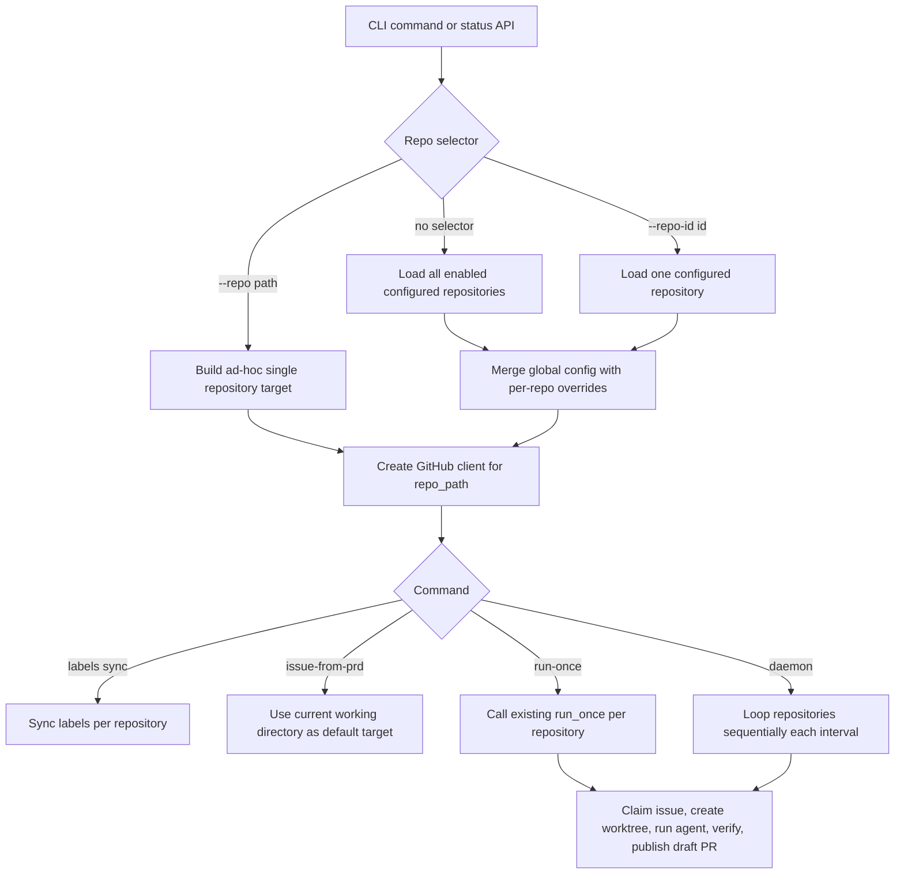

# PRD: Agent Runner 支持多个目标仓库

- GitHub Issue: https://github.com/zata-zhangtao/keda/issues/2

## 1. Introduction & Goals

当前 `iar` 已支持通过 `--repo` 临时指定一个目标仓库路径，但运行模型仍是“单进程、单仓库、单套全局 agent_runner 配置”。当同一台执行机需要同时维护多个目标代码仓库时，操作者必须为每个仓库手动启动独立命令或独立 daemon，配置、状态查询和文档也无法表达“仓库列表”这一目标态。

本 PRD 目标是让 keda 的 Agent Runner 能以一套配置管理多个本地目标仓库，并在 CLI / daemon / 状态 API 中以一致方式选择或轮询这些仓库。

### 可衡量目标

- `config.toml` 能声明多个目标仓库，每个仓库有稳定 `repo_id`、本地路径、启用状态和可选配置覆盖项。
- `iar labels sync`、`iar run-once`、`iar daemon` 能在未指定单一仓库时处理所有启用仓库。
- `iar issue-from-prd` 在多仓库配置存在时必须明确解析到唯一仓库，避免把 PRD 写入或 Issue 创建到错误目标仓库。
- 现有 `--repo /path/to/repo` 单仓库用法继续可用，作为 ad-hoc 兼容路径。
- FastAPI 只读状态端点能返回多仓库配置摘要和基础健康信息。
- 不引入数据库；目标仓库清单由配置文件和环境变量驱动，任务状态仍以 GitHub Issues / Labels 为准。
- 后端依赖方向继续遵守 `api -> core/engines -> infrastructure` 的既有项目实践，`core/` 不直接依赖 `infrastructure/`。

---

## 2. Requirement Shape

| 维度 | 内容 |
|------|------|
| Actor | 本地 Agent Runner 操作者 / 运维人员 |
| Trigger | 配置多个目标仓库后执行 `iar labels sync`、`iar issue-from-prd`、`iar run-once`、`iar daemon`，或访问 agent-runner 状态 API |
| Expected behavior | 系统能按仓库 ID 选择单个目标仓库，或按所有启用仓库顺序轮询；每个仓库使用独立本地路径、GitHub 上下文、worktree 路径和可选覆盖配置 |
| Explicit scope boundary | 仅支持本地已 clone 的目标仓库；不自动 clone 仓库、不提供前端仓库 CRUD、不引入数据库、不改变 GitHub Issue/Label 作为队列状态源的设计 |

### Requirement Assumptions To Confirm

- 默认推荐：目标仓库必须已存在于执行机本地，配置只保存本地路径，不负责 clone / pull / credential 管理。
- 默认推荐：多仓库 daemon 采用顺序轮询，不并发执行多个仓库，避免多 Agent 同时抢占 CPU、API quota 和本地密钥上下文。
- 默认推荐：前端只读展示不进入本 PRD；仓库新增、禁用、路径修改通过 `config.toml` 完成。
- 默认推荐：每个仓库可覆盖 `labels`、`git`、`worktree`、`runner`、`safety` 子配置；未覆盖字段继承全局 `[agent_runner]`。

如果以上任一假设不成立，应先修订本 PRD 再进入实现。

---

## 3. Repository Context And Architecture Fit

### 3.1 Existing Path

当前最接近的实现路径已经存在：

- `src/backend/api/cli.py`
  - 全局 `--repo` 默认值为 `"."`。
  - 每个命令通过 `Path(parsed.repo).resolve()` 得到单一 `repo_path`。
  - `run-once` / `daemon` 只创建一个 `GitHubCliClient`，只传入一个 `repo_path`。
- `config.toml`
  - 只有一套 `[agent_runner]`、`[agent_runner.labels]`、`[agent_runner.git]`、`[agent_runner.worktree]`、`[agent_runner.runner]`、`[agent_runner.safety]`。
- `src/backend/infrastructure/config/settings.py`
  - `AgentRunnerSettings` 是单实例配置，没有仓库列表模型。
- `src/backend/engines/agent_runner/factory.py`
  - `build_app_config()` 将全局 `AgentRunnerSettings` 转成 core 层 `AppConfig`。
  - `create_github_client(repo_path, process_runner)` 已支持按仓库路径创建 GitHub client。
- `src/backend/core/use_cases/run_agent_once.py`
  - `run_once(...)` 已以 `repo_path`、`AppConfig`、`IGitHubClient` 和 `IProcessRunner` 为参数，天然可以被多仓库外层循环复用。
- `src/backend/core/use_cases/run_agent_daemon.py`
  - 当前无限循环只调用单仓库 `run_once(...)`。
- `src/backend/api/routes/agent_runner.py`
  - 当前只返回单套 runner 配置摘要和 `gh --version` 健康状态。
- `docs/guides/agent-runner.md`
  - 文档把 `--repo` 作为目标仓库选择方式，没有配置化多仓库说明。

### 3.2 Reuse Candidates

- 继续复用 `run_once(...)` 作为单仓库执行原子能力。
- 继续复用 `create_issue_from_prd(...)`，但在 API/CLI 入口前必须先解析出唯一目标仓库。
- 继续复用 `GitHubCliClient(repo_path, process_runner)`，每个仓库创建独立 client。
- 扩展 `AgentRunnerSettings`，不要新增第二套 TOML loader。
- 扩展 `factory.py` 做配置合并和目标仓库解析，避免 `api/cli.py` 直接接触 `infrastructure.config.settings`。
- 扩展现有 `docs/guides/agent-runner.md`，不新增并行指南页。

### 3.3 Architecture Constraints

- `core/use_cases/` 保持业务编排和规则，不读取 `config.toml`，不导入 `backend.infrastructure.*`。
- `infrastructure/config/settings.py` 只负责配置结构和加载，不承载“哪些命令默认跑所有仓库”等业务规则。
- `engines/agent_runner/factory.py` 作为现有 composition adapter，负责把 settings 转为 core dataclass，并创建 repository run contexts。
- `api/cli.py` 负责参数校验和命令分发，不直接构造基础设施实现。
- `api/routes/agent_runner.py` 保持只读，不触发 agent 执行。
- 新增/修改 Python 文本 I/O 必须显式 `encoding="utf-8"`。
- 文档变更需要同步 `docs/`；如不新增页面，则无需修改 `mkdocs.yml` 导航。

### 3.4 Potential Redundancy Risks

- 不应新增独立 `repositories.toml`，否则会复制当前配置系统职责。
- 不应把多仓库循环复制进每个 CLI 分支；应提取为可测试的解析/执行路径。
- 不应引入数据库表记录仓库列表；当前需求可以由静态配置满足，引入持久化会扩大迁移和运维面。
- 不应新增前端管理页；当前前端 Dashboard 仍是占位页面，仓库 CRUD 会引入权限、校验和持久化问题。

---

## 4. Recommendation

### 4.1 Recommended Approach

推荐采用“配置化仓库注册表 + 单仓库 use case 复用 + 多仓库外层编排”的目标态：

1. 在 `config.toml` 的 `[agent_runner.repositories.<repo_id>]` 下声明目标仓库。
2. 在 `AgentRunnerSettings` 中新增 `repositories: dict[str, AgentRunnerRepositorySettings]`。
3. 在 `engines/agent_runner/factory.py` 中新增仓库目标解析与配置合并函数：
   - 全局 `[agent_runner]` 仍是默认配置。
   - 每个仓库可覆盖 `labels`、`git`、`worktree`、`runner`、`safety`。
   - `--repo-id` 选择配置仓库，`--repo` 保持 ad-hoc 路径兼容。
4. 在 core 层新增轻量多仓库运行上下文和循环用例，复用现有 `run_once(...)`：
   - 单个仓库失败不阻断后续仓库。
   - 汇总每个仓库的 exit code 和错误日志。
   - daemon 每轮顺序处理所有启用仓库后再 sleep。
5. CLI 行为收敛为：
   - `labels sync`：无选择器时处理所有启用配置仓库；有 `--repo-id` 或 `--repo` 时只处理一个仓库。
   - `run-once`：无选择器时处理所有启用配置仓库；有选择器时只处理一个仓库。
   - `daemon`：无选择器时循环所有启用配置仓库；有选择器时循环一个仓库。
   - `issue-from-prd`：默认使用当前工作目录作为目标仓库，行为与旧版 `--repo "."` 一致；若当前目录匹配某个已配置仓库路径，则应用该仓库的覆盖配置。仅在显式指定 `--repo-id` 或 `--repo` 时才切换目标。
6. FastAPI 状态端点返回仓库列表摘要，不负责启动 runner。

示例配置：

```toml
[agent_runner]
max_issues = 1
default_agent = "auto"

[agent_runner.repositories.keda]
path = "/Users/zata/code/keda"
enabled = true
display_name = "Keda"

[agent_runner.repositories.keda.git]
remote = "origin"
base_branch = "main"

[agent_runner.repositories.backend_service]
path = "/Users/zata/code/backend-service"
enabled = true
display_name = "Backend Service"

[agent_runner.repositories.backend_service.runner]
verification_commands = [
  "git diff --check",
  "uv run pytest",
]
```

### 4.2 Why This Fits The Current Architecture

- 现有 `run_once(...)` 已经按 `repo_path + config + client` 参数化，最小变更即可复用。
- 多仓库配置合并属于 composition concern，放在 `engines/agent_runner/factory.py` 能避免 `api/` 直接依赖 `infrastructure/`。
- 核心业务规则只需要知道“一组可运行仓库上下文”，不需要知道配置文件来源。
- 静态配置足以覆盖当前目标，不需要新增 SQLAlchemy 模型、Alembic migration 或后台管理 UI。
- 继续保留 `--repo` 能让现有脚本不被破坏。

### 4.3 Alternatives Considered

| 方案 | 说明 | 拒绝原因 |
|------|------|----------|
| 为每个仓库启动独立 daemon | 用户自行运行多个 `iar daemon --repo ...` | 没有解决集中配置、状态 API 和运维可见性问题，且容易遗漏某个仓库进程 |
| 引入数据库管理仓库列表 | 新增 repository 表和 CRUD API | 当前需求只需要本地执行机静态配置，引入数据库会扩大权限、迁移和备份责任 |
| 前端管理仓库 | Dashboard 提供新增/编辑/禁用仓库 UI | 当前前端仍是占位系统，做 CRUD 必须先解决认证、权限、持久化和路径安全边界，超出本次目标 |
| 复制一套 multi-repo runner 逻辑 | 新增独立实现，不复用 `run_once(...)` | 会重复 claim、worktree、verification、publish、failure label 等高风险逻辑 |

---

## 5. Implementation Guide

本节是实现时的活文档。实现中如发现更好的路径、隐藏依赖或额外文件，需要先更新本 PRD 再继续。

### 5.1 Core Logic

控制流目标态：

1. CLI/API 接收选择器：`--repo-id`、`--repo` 或空选择器。
2. `engines/agent_runner/factory.py` 根据 settings 和命令类型解析目标仓库：
   - `--repo` 存在时构造 ad-hoc 单仓库上下文。
   - `--repo-id` 存在时从 `repositories` 中查找单仓库。
   - 消费者命令（`labels sync`、`run-once`、`daemon`）无选择器时返回所有 `enabled = true` 的配置仓库；若没有配置仓库，回退到当前目录 `"."` 的单仓库兼容行为。
   - `issue-from-prd` 无选择器时回退到当前目录 `"."` 的单仓库行为；若当前目录匹配某个已配置仓库路径，则应用该仓库的覆盖配置。
3. 每个仓库上下文包含：
   - `repository_id`
   - `display_name`
   - `repo_path`
   - 合并后的 `AppConfig`
   - 对应 `IGitHubClient`
4. `run-once` 逐个调用现有 `run_once(...)`。
5. `daemon` 每轮遍历所有目标仓库，完成后统一 sleep。
6. 每个仓库的 worktree 命令都以该仓库 `repo_path` 作为 `cwd`。

### 5.2 Change Impact Tree

```text
Infrastructure
├── config.toml
│   [修改]
│   【总结】新增多仓库配置示例，保留现有单仓库全局默认配置。
│
│   ├── 新增 [agent_runner.repositories.<repo_id>] 示例
│   ├── 展示 path / enabled / display_name 字段
│   └── 展示仓库级 git / runner 覆盖配置
│
├── src/backend/infrastructure/config/settings.py
│   [修改]
│   【总结】扩展 AgentRunnerSettings，使其能加载多仓库注册表和仓库级覆盖项。
│
│   ├── 新增 AgentRunnerRepositorySettings
│   ├── 为仓库级 labels/git/worktree/runner/safety 覆盖字段提供 Optional 模型
│   ├── 新增 repositories: dict[str, AgentRunnerRepositorySettings]
│   └── 如需要，增加 env_nested_delimiter 以保持环境变量覆盖能力

Core
├── src/backend/core/shared/models/agent_runner.py
│   [修改]
│   【总结】新增仓库运行目标模型，表达 repo_id、显示名、路径和合并后的 AppConfig。
│
│   ├── 新增 RepositoryTarget 或 RepositoryRunContext
│   ├── 保持 AppConfig / LabelConfig / GitConfig 等既有模型向后兼容
│   └── 不引入配置文件加载逻辑
│
├── src/backend/core/use_cases/run_agent_once.py
│   [修改]
│   【总结】保持单仓库执行语义，必要时补充 repository_id 日志上下文。
│
│   ├── 不复制现有 claim / worktree / verification / publish 逻辑
│   └── 保持现有函数签名兼容，除非测试证明必须扩展
│
├── src/backend/core/use_cases/run_agent_daemon.py
│   [修改]
│   【总结】支持接收多个仓库运行上下文，并在每轮 daemon 中顺序处理。
│
│   ├── 单仓库路径继续支持
│   ├── 多仓库模式下单个仓库失败不阻断后续仓库
│   └── 每轮全部仓库完成后再 sleep
│
└── src/backend/core/use_cases/run_agent_repositories_once.py
    [新增]
    【总结】封装多仓库 run-once 循环，集中处理 per-repo exit code 和错误隔离。

    ├── 遍历 RepositoryRunContext 列表
    ├── 调用现有 run_once(...)
    └── 返回聚合 exit code

Engines
├── src/backend/engines/agent_runner/factory.py
│   [修改]
│   【总结】新增仓库选择、配置合并和运行上下文构造能力。
│
│   ├── 新增 build_app_config_from_settings(...)
│   ├── 新增 merge_repository_config(...)
│   ├── 新增 resolve_repository_targets(...)
│   ├── 新增 create_repository_run_contexts(...)
│   └── 保持 create_github_client(...) 作为单仓库 client 工厂

API
├── src/backend/api/cli.py
│   [修改]
│   【总结】新增 --repo-id 选择器，并让各子命令按单仓库或多仓库目标分发。
│
│   ├── add_common_options 增加 --repo-id
│   ├── 校验 --repo 和 --repo-id 不能同时使用
│   ├── labels sync / run-once / daemon 支持默认所有启用仓库
│   └── issue-from-prd 在多仓库场景要求唯一目标
│
├── src/backend/api/routes/agent_runner.py
│   [修改]
│   【总结】状态 API 返回多仓库配置摘要和基础健康检查结果。
│
│   ├── /agent-runner/status 增加 repositories 列表
│   ├── 隐藏敏感配置和绝对路径的可选展示策略需明确
│   └── /agent-runner/health 可按仓库路径检查 gh/git 基础可用性

Tests
├── tests/test_agent_runner_cli.py
│   [修改]
│   【总结】覆盖 --repo-id、--repo 兼容和多仓库命令分发规则。
│
│   ├── 校验 --repo 与 --repo-id 互斥
│   ├── 校验 issue-from-prd 多仓库未指定目标时报错
│   └── 校验旧 --repo 用法仍可运行
│
├── tests/test_run_agent.py
│   [修改]
│   【总结】补充多仓库 run-once 聚合执行和失败隔离测试。
│
│   ├── 一个仓库失败不影响后续仓库
│   ├── 聚合 exit code 能反映失败
│   └── 每个仓库使用自己的 repo_path
│
├── tests/test_agent_runner_config.py
│   [新增]
│   【总结】验证 config.toml 多仓库结构加载、默认继承和仓库级覆盖。
│
│   ├── 读取 repositories 字典
│   ├── 验证全局配置继承
│   └── 验证仓库级覆盖只影响目标仓库
│
└── tests/test_agent_runner_api.py
    [新增]
    【总结】验证状态端点能输出多仓库摘要且不泄露敏感值。

    ├── /agent-runner/status 包含 repositories
    └── /agent-runner/health 保持只读

Docs
├── docs/guides/agent-runner.md
│   [修改]
│   【总结】更新 CLI 使用指南，说明多仓库配置、选择器和 daemon 行为。
│
│   ├── 新增多仓库 config.toml 示例
│   ├── 更新 labels sync / issue-from-prd / run-once / daemon 示例
│   └── 说明 issue-from-prd 的唯一仓库要求
│
├── docs/guides/configuration.md
│   [修改]
│   【总结】补充 agent_runner.repositories 配置字段说明。
│
│   ├── 说明全局默认与仓库级覆盖关系
│   └── 说明本地路径要求和 enabled 语义
│
├── docs/api/references.md
│   [修改]
│   【总结】更新 agent-runner 状态端点响应结构。
│
│   ├── 增加 repositories 响应字段示例
│   └── 标注状态端点只读
│
└── README.md
    [修改]
    【总结】补充多仓库 runner 的最短使用示例。

    ├── 展示配置多个仓库
    └── 展示启动多仓库 daemon
```

### 5.3 Flow Diagram



### 5.4 Data Model / ER Diagram

No database model changes in this PRD.

No ER diagram is required because the recommended approach does not add SQLAlchemy models, Alembic migrations, or persistent database state. The only state structure change is configuration under `config.toml`.

### 5.5 Low-Fidelity Prototype

No low-fidelity prototype required for this PRD.

The recommended scope does not introduce a new user-facing screen or multi-step UI interaction.

### 5.6 Interactive Prototype Change Log

No interactive prototype file changes in this PRD.

### 5.7 External Validation

No external validation required; repository evidence was sufficient.

---

## 6. Definition Of Done

- 多仓库配置可以被加载、合并，并以 `repo_id` 稳定选择。
- 所有原有单仓库 CLI 行为保持兼容，尤其是 `--repo` ad-hoc 路径。
- 多仓库 `run-once` 和 `daemon` 复用现有单仓库执行逻辑，不复制高风险发布流程。
- `issue-from-prd` 在多仓库场景不会静默选择错误仓库。
- 状态 API 更新为多仓库摘要且保持只读。
- 文档覆盖配置、命令行为、兼容路径和限制。
- 相关单元测试、文档构建和 `just test` 通过。

---

## 7. Acceptance Checklist

### Architecture Acceptance

- [x] `src/backend/core/` 不导入 `backend.infrastructure`、`backend.engines` 或 `backend.api`。
- [x] 多仓库配置读取只发生在 `src/backend/infrastructure/config/settings.py` 和 `src/backend/engines/agent_runner/factory.py` 的组合路径中。
- [x] `src/backend/core/use_cases/run_agent_once.py` 的 claim / worktree / verification / publish 主流程没有被复制到新的多仓库实现中。
- [x] 没有新增 SQLAlchemy model、Alembic migration 或仓库 CRUD API。

### Behavior Acceptance

- [x] `iar labels sync --repo-id <id>` 只同步指定配置仓库的 labels。
- [x] `iar labels sync --repo /path/to/repo` 继续按旧 ad-hoc 路径工作。
- [x] `iar labels sync` 在配置了多个启用仓库时会遍历所有启用仓库。
- [x] `iar run-once` 在配置了多个启用仓库时会按仓库逐个执行，且单个仓库失败不会阻断后续仓库。
- [x] `iar daemon` 每轮会顺序处理所有启用仓库，并在整轮结束后 sleep。
- [x] `iar issue-from-prd <path>` 默认使用当前工作目录，行为与旧版 `--repo "."` 一致；若当前目录匹配某个已配置仓库路径，则应用该仓库的覆盖配置。
- [x] `iar issue-from-prd <path> --repo-id <id>` 只在指定仓库内解析 PRD 相对路径并创建 Issue。
- [x] `--repo` 和 `--repo-id` 同时出现时 CLI 返回参数错误。
- [x] 未配置 `agent_runner.repositories` 时，现有默认 `--repo "."` 行为保持可用。

### Configuration Acceptance

- [x] `config.toml` 支持 `[agent_runner.repositories.<repo_id>]`。
- [x] 每个 repository 至少支持 `path`、`enabled`、`display_name` 字段。
- [x] 仓库级 `git.base_branch` 覆盖不会影响其他仓库。
- [x] 仓库级 `runner.verification_commands` 覆盖不会影响其他仓库。
- [x] 未覆盖字段继承全局 `[agent_runner]` 默认值。

### API Acceptance

- [x] `GET /api/v1/agent-runner/status` 返回 `repositories` 列表。
- [x] 状态端点返回每个仓库的 `repo_id`、`display_name`、`enabled`、`base_branch`、`remote` 和 runner 摘要。
- [x] 状态端点不触发 label sync、agent execution、git commit、git push 或 PR 创建。
- [x] `GET /api/v1/agent-runner/health` 保持只读，并能表达 GitHub CLI 可用性。

### Documentation Acceptance

- [x] `docs/guides/agent-runner.md` 包含多仓库配置示例和命令示例。
- [x] `docs/guides/configuration.md` 说明 `agent_runner.repositories` 字段和继承规则。
- [x] `docs/api/references.md` 更新 agent-runner 状态端点响应示例。
- [x] `README.md` 包含启动多仓库 daemon 的最短示例。
- [x] 未新增 MkDocs 页面时，不需要修改 `mkdocs.yml`；如实现中新增页面，必须同步更新 `mkdocs.yml`。

### Validation Acceptance

- [x] `uv run pytest tests/test_agent_runner_config.py -q` 通过。
- [x] `uv run pytest tests/test_agent_runner_cli.py tests/test_run_agent.py -q` 通过。
- [x] `uv run pytest tests/test_agent_runner_api.py -q` 通过。
- [x] `uv run python hooks/check_architecture.py` 通过。
- [x] `uv run mkdocs build` 通过。
- [x] `just test` 通过。

---

## 8. Functional Requirements

- FR-1: 系统必须支持在 `config.toml` 中声明多个目标仓库，并以 `repo_id` 唯一标识。
- FR-2: 每个目标仓库必须声明本地 `path`；系统不负责 clone 不存在的仓库。
- FR-3: 每个目标仓库必须支持 `enabled` 开关；默认值为 `true`。
- FR-4: 每个目标仓库可以覆盖全局 `labels`、`git`、`worktree`、`runner`、`safety` 配置。
- FR-5: 未配置仓库级覆盖时，仓库必须继承全局 `[agent_runner]` 配置。
- FR-6: CLI 必须新增 `--repo-id`，并保持现有 `--repo` 参数兼容。
- FR-7: CLI 必须禁止 `--repo-id` 和 `--repo` 同时使用。
- FR-8: `labels sync`、`run-once`、`daemon` 在无选择器时必须处理所有启用配置仓库。
- FR-9: `issue-from-prd` 默认使用当前工作目录作为目标仓库；若当前目录匹配某个已配置仓库路径，则应用该仓库的覆盖配置。仅在显式指定 `--repo-id` 或 `--repo` 时切换目标。
- FR-10: 多仓库执行必须隔离每个仓库的 `repo_path`、GitHub client、worktree 命令 cwd 和合并配置。
- FR-11: 多仓库 `run-once` 中一个仓库失败时，系统必须继续尝试后续仓库，并最终返回非零 exit code。
- FR-12: 多仓库 daemon 必须在每轮处理完全部目标仓库后再进入 sleep。
- FR-13: 状态 API 必须返回多仓库配置摘要，并保持只读。
- FR-14: 文档必须说明多仓库配置、命令选择器、默认行为和限制。

---

## 9. Non-Goals

- 不自动 clone、pull、初始化或修复目标仓库。
- 不提供 Web UI 仓库新增、编辑、删除或启停。
- 不引入数据库保存仓库列表、运行历史或调度状态。
- 不实现多仓库并发执行。
- 不实现跨仓库任务依赖、批量 PR 合并或自动 merge。
- 不改变 GitHub Issues / Labels 作为队列状态源的设计。
- 不改变 Codex / Claude 的具体执行协议，除非现有单仓库 runner 已需要修复。

---

## 10. Risks And Follow-Ups

- 路径安全风险：配置中的仓库路径是本地绝对路径，状态 API 是否展示完整路径需要在实现时谨慎处理。默认建议 API 返回路径存在性和 repo_id，避免暴露完整绝对路径给前端。
- 配置复杂度风险：仓库级覆盖会增加 settings 合并复杂度，需要用单元测试覆盖继承和覆盖边界。
- 运行资源风险：顺序轮询虽然安全，但多个仓库都存在 ready issue 时总耗时会增加；并发执行明确不在本 PRD 范围内。
- 文档一致性风险：当前文档大量示例使用 `[--repo]` 占位，需要统一改成真实示例，避免用户误解。

---

## 11. Decision Log

| # | 决策问题 | 选择 | 放弃的方案 | 理由 |
|---|---|---|---|---|
| D-01 | 多仓库来源 | 使用 `config.toml` 的 `agent_runner.repositories` | 新增 `repositories.toml` | 现有配置系统已提供 TOML 与 env 优先级，再加文件会复制配置职责。 |
| D-02 | 仓库状态存储 | 不引入数据库 | 新增 repository 表和 CRUD API | 当前需求只需要本地执行机静态配置，数据库会引入迁移、权限和备份责任。 |
| D-03 | 执行模型 | daemon 顺序轮询所有启用仓库 | 多仓库并发执行 | 顺序轮询能复用现有单仓库 runner，且避免本地资源和密钥上下文竞争。 |
| D-04 | 单仓库兼容 | 保留 `--repo` ad-hoc 路径 | 强制所有仓库必须预先配置 repo_id | 现有文档和测试已围绕 `--repo`，删除会破坏当前使用方式。 |
| D-05 | 前端范围 | 本 PRD 不做 Web 仓库 CRUD | 在 Dashboard 中管理仓库 | 前端 CRUD 需要权限、持久化和路径安全设计，超出配置化多仓库 runner 的最小目标。 |
| D-06 | 业务逻辑复用 | 复用现有 `run_once(...)` | 新增独立 multi-repo runner 主流程 | `run_once(...)` 已封装高风险发布流程，复制会增加标签流转和 PR 创建不一致风险。 |
