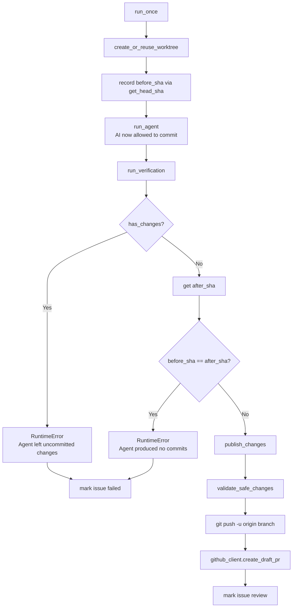

# PRD: Agent Commit Handoff

## 1. Introduction & Goals

当前 `run_agent_once.py` 存在责任边界矛盾：`build_prompt` 明确禁止 AI 执行 `git commit`，但 `publish_changes` 却又由 runner 自动代为 commit。这导致：

- **pre-commit hook 冲突**：runner 自动提交时触发 pre-commit，若失败则整个 Issue 处理失败。
- **责任模糊**：AI 无法自主决定何时提交、如何组织 commit message， runner 却承担了本应由 AI 完成的代码提交决策。
- **prompt 与行为不一致**：prompt 说 "Do not ... commit"，但系统行为却是自动 commit。

本 PRD 的目标是将 **git commit 职责从 runner 移交给 AI agent**，使 runner 仅负责：

1. 验证 AI 已正确完成 commit（无未提交变更、至少产生了一个新 commit）。
2. 执行 `git push` 和创建 Draft PR。

## 2. Requirement Shape

- **Actor**：Agent Runner（`run_once` 编排器）和本地 AI Agent（Codex / Claude / Kimi）。
- **Trigger**：runner 成功在 worktree 中启动 AI agent 并完成执行。
- **Expected Behavior**：
  - AI agent 在 worktree 内自主执行 `git add` 和 `git commit`。
  - Runner 在 AI 退出后检查是否有未提交变更；若有，报错并将 Issue 标记为 failed。
  - Runner 检查 AI 是否至少产生了一个新 commit；若无，报错并将 Issue 标记为 failed。
  - Runner 继续执行 `validate_safe_changes`、`git push` 和 `create_draft_pr`。
- **Scope Boundary**：不涉及更改 agent 调用方式（`run_agent` 的 CLI 命令不变），不改动 GitHub Issue/PR 创建逻辑，不引入新的配置项或外部依赖。

## 3. Repository Context And Architecture Fit

### 相关模块

| 文件 | 职责 | 改动类型 |
|---|---|---|
| `src/backend/core/use_cases/run_agent_once.py` | Runner 核心编排：prompt 构建、worktree 管理、agent 调用、发布流程 | 修改 |
| `tests/test_run_agent.py` | Runner 行为单元测试 | 修改 |
| `src/backend/core/use_cases/run_agent_daemon.py` | Daemon 循环，直接复用 `run_once` | 无需修改 |
| `src/backend/api/cli.py` | CLI 入口，参数透传 | 无需修改 |

### 架构约束

- 本改动位于 **core 层**（`src/backend/core/use_cases/`），必须保持向内依赖（仅依赖 `shared/interfaces/` 和 `shared/models/`）。
- `IGitHubClient` 和 `IProcessRunner` 抽象接口不变，不破坏现有依赖方向。
- `AppConfig` 不新增字段，保持现有配置契约。
- 遵循 Google Style Docstrings 和 Fully Qualified Naming 规范。

### 复用与扩展点

- `has_changes` 函数已存在，可直接复用于检测未提交变更。
- `FakeProcessRunner` 和 `FakeGitHubClient` 测试桩无需结构性改动，仅补充测试用例的 response mapping。

## 4. Recommendation

### Recommended Approach：最小改动路径

直接修改 `run_agent_once.py` 中三个关键函数，并在 `run_once` 编排中插入 HEAD SHA 检查：

1. **`build_prompt`**：移除 "Do not ... commit" 禁令，补充 commit 规范说明。
2. **新增 `get_head_sha`**：获取当前 HEAD SHA，用于 run_agent 前后对比。
3. **`run_once`**：在 `run_agent` 前记录 `before_sha`；在 `run_agent` 和 `run_verification` 后，依次检查：
   - 是否有未提交变更（`has_changes`）→ 报错
   - `before_sha` 是否等于当前 SHA → 报错
4. **`publish_changes`**：移除 `git add -A` 和 `git commit`，保留 `validate_safe_changes`、`git push`、`create_draft_pr`。

### 为什么这是最佳方案

- **零新增模块/配置**：完全在现有 `run_agent_once.py` 内完成，不引入新文件或配置复杂度。
- **责任清晰**：AI 负责代码修改和本地版本控制；runner 负责边界验证和远程发布。
- **向后兼容**：CLI 参数、配置结构、`IGitHubClient` / `IProcessRunner` 接口均无变化。
- **pre-commit hook 友好**：AI 自行 commit 时若触发 pre-commit 失败，AI 可以在同一会话中修复问题再次提交，而不是像 runner 自动提交那样一次性失败。

### Alternatives Considered

| 方案 | 说明 | 拒绝原因 |
|---|---|---|
| runner 自动 commit 加 `--no-verify` | 绕过 pre-commit hook | 未解决责任边界矛盾，且可能提交不符合质量门控的代码 |
| 新增 `CommitStrategy` 配置枚举 | 让用户选择 "auto" / "agent" / "none" | 过度设计，当前问题明确需要统一为 agent commit，无需策略切换 |
| AI 也负责 `git push` 和 PR 创建 | 将 publish 职责完全移交 AI | 超出范围，push/PR 涉及远程状态和权限，由 runner 集中控制更安全 |

## 5. Implementation Guide

### Core Logic

```
run_once 流程变更：

BEFORE:
  create_or_reuse_worktree
  run_agent
  run_verification
  has_changes? → Error("no git changes")
  publish_changes:
    git add -A
    git commit -m "agent: complete issue #N"
    git push
    create_draft_pr

AFTER:
  create_or_reuse_worktree
  before_sha = get_head_sha
  run_agent
  run_verification
  has_changes? → Error("Agent left uncommitted changes.")
  after_sha = get_head_sha
  before_sha == after_sha? → Error("Agent produced no git commits.")
  publish_changes:
    validate_safe_changes
    git push
    create_draft_pr
```

### Change Impact Tree

```text
.
src/backend/core/use_cases/
└── run_agent_once.py
    [修改] 【总结】将 commit 职责从 runner 移交给 AI，runner 改为验证并推送
    ├── build_prompt()
    │   └── 移除 "Do not ... or commit" 禁令
    │   └── 添加 "Commit your changes with a descriptive message" 指引
    ├── 新增 get_head_sha()
    │   └── 封装 git rev-parse HEAD，获取当前 commit SHA
    ├── run_once()
    │   └── 在 run_agent 前调用 get_head_sha() 记录 before_sha
    │   └── 在 run_verification 后检查 has_changes()，有则报错
    │   └── 再次调用 get_head_sha() 获取 after_sha，对比 before_sha
    │   └── before_sha == after_sha 则报错
    └── publish_changes()
        └── 删除 git add -A 调用
        └── 删除 git commit 调用
        └── 保留 validate_safe_changes、git push、create_draft_pr

tests/
├── test_run_agent.py
│   [修改] 【总结】同步测试以适配 AI 负责 commit 的新验证逻辑
│   └── test_run_once_dry_run: 无需改动（dry-run 不进入 publish 路径）
│   └── 更新/新增 publish_changes 测试：验证 runner 不再调用 git commit
│   └── 新增 run_once 流程测试：验证未提交变更和空提交均报错
└── conftest.py
    [无需修改] FakeProcessRunner 已支持自定义 response mapping
```

### Flow or Architecture Diagram



### ER Diagram

No data model changes in this PRD.

### Interactive Prototype Change Log

No interactive prototype file changes in this PRD.

### External Validation

No external validation required; repository evidence was sufficient.

## 6. Definition Of Done

- [x] `run_agent_once.py` 中 `publish_changes` 不再自动执行 `git add` 和 `git commit`。
- [x] `build_prompt` 允许并引导 AI 自行 commit。
- [x] `run_once` 在 AI 执行前后检查 HEAD SHA，确保至少产生了一个新 commit。
- [x] `run_once` 在 AI 执行后检查未提交变更，如有则报错。
- [x] 测试用例同步更新，覆盖新验证逻辑。
- [x] 现有 CLI、配置、接口契约无破坏性变更。
- [x] `just lint` 和 `just test` 通过。

## 7. Acceptance Checklist

### Architecture Acceptance

- [x] `src/backend/core/use_cases/run_agent_once.py` 中 `publish_changes` 不再包含 `git add` 或 `git commit` 调用。
- [x] `src/backend/core/use_cases/run_agent_once.py` 中新增 `get_head_sha` 函数，返回类型为 `str`，且使用 `process_runner.run(["git", "rev-parse", "HEAD"], ...)` 实现。
- [x] `build_prompt` 返回的字符串中不再包含 "Do not ... commit" 子串。
- [x] `run_once` 在调用 `run_agent` 之前记录 `before_sha`，在 `run_verification` 之后检查 `has_changes` 和 `before_sha == after_sha`。
- [x] 依赖方向未被破坏：`run_agent_once.py` 不导入 `engines/` 或 `infrastructure/` 层。

### Behavior Acceptance

- [x] 当 AI 退出后 worktree 中仍有未提交变更时，`run_once` 抛出 `RuntimeError`，消息包含 "uncommitted"。
- [x] 当 AI 退出后 HEAD SHA 与运行前一致时，`run_once` 抛出 `RuntimeError`，消息包含 "no git commits"。
- [x] 当 AI 成功 commit 后，`publish_changes` 正常执行 `git push` 和 `create_draft_pr`。
- [x] `validate_safe_changes` 仍在 `publish_changes` 中被调用，且位置在 `git push` 之前。

### Documentation Acceptance

- [x] 若 `docs/` 中有描述 runner 行为的内容，同步更新以反映 AI 负责 commit。（经检查，`docs/guides/agent-runner.md` 中未明确描述 runner 自动 commit 行为，无需修改。）
- [x] PRD 自身包含完整的 Acceptance Checklist 且所有项在归档前完成。

### Validation Acceptance

- [x] `uv run pytest tests/test_run_agent.py -v` 全部通过。
- [x] `uv run pytest tests/ -v` 无回归失败。
- [x] `just lint` 通过。

## 8. Functional Requirements

**FR-1**: `build_prompt` 必须在 Execution rules 中移除对 AI commit 的禁令，并明确告知 AI 需要自行 `git add` 和 `git commit`，建议使用描述性 commit message。

**FR-2**: `run_agent_once.py` 必须新增 `get_head_sha` 函数，用于获取 worktree 当前 HEAD 的完整 SHA。

**FR-3**: `run_once` 必须在调用 `run_agent` 之前，通过 `get_head_sha` 记录 `before_sha`。

**FR-4**: `run_once` 必须在 `run_verification` 之后调用 `has_changes`；若返回 `True`，必须抛出 `RuntimeError` 并将 Issue 标记为 failed。

**FR-5**: `run_once` 必须在 `has_changes` 检查通过后，再次调用 `get_head_sha` 获取 `after_sha`；若 `before_sha == after_sha`，必须抛出 `RuntimeError` 并将 Issue 标记为 failed。

**FR-6**: `publish_changes` 必须移除 `git add -A` 和 `git commit` 调用，保留 `validate_safe_changes`、`git push` 和 `create_draft_pr`。

**FR-7**: 当 `publish_changes` 被调用时，必须假定 AI 已完成 commit，直接执行 `validate_safe_changes`，然后 `git push`，最后 `create_draft_pr`。

**FR-8**: 所有现有 CLI 参数、配置模型、抽象接口（`IGitHubClient`、`IProcessRunner`）不得发生破坏性变更。

## 9. Non-Goals

- **不改动 agent 调用命令**：`run_agent` 中构建的 `claude` / `kimi` / `codex` CLI 命令保持不变。
- **不让 AI 负责 push 或 PR 创建**：远程发布仍由 runner 集中控制。
- **不引入新的配置项**：`AppConfig` 不增加 `commit_strategy` 等字段。
- **不改动 Issue/PR 元数据格式**：Issue body 中的 PRD path、label 管理逻辑不变。
- **不处理 pre-commit hook 自动修复**：若 AI commit 触发 pre-commit 失败，由 AI 在会话内自行处理，runner 不做额外逻辑。

## 10. Risks And Follow-Ups

| 风险 | 缓解措施 |
|---|---|
| AI 可能不理解新的 commit 要求，导致反复失败 | `build_prompt` 中给出明确的 commit 指令和示例；监控 failed label 频率 |
| AI 可能生成不规范的 commit message | 当前阶段不做强制校验，后续可根据需要补充 message 格式检查 |
| 现有 archive PRD 或文档中描述了 runner 自动 commit 的行为 | 在文档验收中检查并同步更新 |

## 11. Decision Log

| ID | Decision | Chosen | Rejected | Rationale |
|---|---|---|---|---|
| D-01 | 谁负责执行 `git commit` | AI agent | Runner 自动 commit | Runner 自动 commit 与 prompt 禁令矛盾，且 pre-commit hook 冲突无法避免；AI 自行 commit 可让 AI 在失败时现场修复 |
| D-02 | 如何验证 AI 已 commit | 检查 `has_changes` + `before_sha == after_sha` | 仅检查 `has_changes` | 仅检查未提交变更无法发现 AI 完全没有做任何修改的情况；SHA 对比可确保至少有一个新 commit |
| D-03 | Runner 是否继续负责 push/PR | 是，runner 负责 | 完全移交给 AI | Push 和 PR 创建涉及远程状态和权限，由 runner 集中控制更安全，且符合现有架构 |
| D-04 | 是否新增配置项控制 commit 行为 | 否 | 新增 `commit_strategy` 枚举 | 当前需求明确且单一，无需策略切换；减少配置复杂度 |
