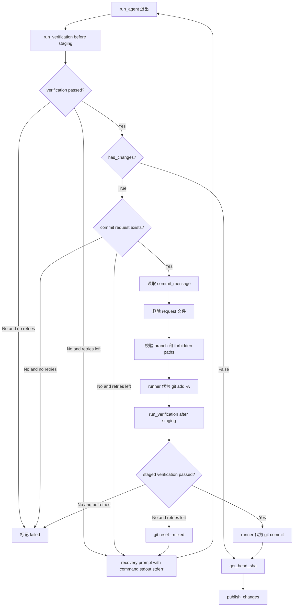

# PRD: Runner Auto-Commit Fallback for Sandbox-Blocked Commits

- GitHub Issue: https://github.com/zata-zhangtao/keda/issues/4

## 1. Introduction & Goals

当前 Agent Runner 使用 Codex agent 处理 Issue 时，Codex 运行在 `--sandbox workspace-write` 模式下。该 sandbox 只允许 agent 写入当前 worktree 目录，但 Git worktree 的 `.git` 是一个 gitfile，指向主仓库的 `.git/worktrees/<branch>/` 目录。当 agent 执行 `git commit` 时，Git 需要在该目录创建 `index.lock`，sandbox 阻止了这一操作，导致 commit 失败。

结果：agent 成功修改了文件，但无法提交。Runner 最终检查到未提交变更，抛出 `RuntimeError("Agent left uncommitted changes.")`，将 Issue 标为 `failed`。

本 PRD 的目标是在 runner 层引入一个**受限 commit request 代理机制**：agent 完成修改后不直接执行 `git add` / `git commit`，而是在当前 worktree 写入 `.agent-runner/commit-request.json`。runner（host 侧，不受 sandbox 限制）读取请求、校验当前分支和安全路径，执行提交前验证；随后执行 `git add -A`，再次运行同一组验证命令覆盖 staged 状态相关检查，最后执行 `git commit` 并继续正常发布流程。

如果任一验证失败，runner 不立即把 Issue 标为 failed，而是把失败命令、exit code、stdout、stderr 写入 recovery prompt，重新调用同一个 agent 修复。agent 修复后仍只能更新业务文件和 commit request，由 runner 再次验证和提交。

## 2. Requirement Shape

- **Actor**：Agent Runner 编排器（`run_once`）。
- **Trigger**：`run_agent` 退出后，`has_changes()` 返回 `True`。
- **Expected Behavior**：
  - agent 不直接执行 `git add` 或 `git commit`。
  - agent 完成修改后写入 `.agent-runner/commit-request.json`，字段为 `commit_message`。
  - runner 检测到未提交变更时，必须先读取 commit request；缺失请求时标 `failed`。
  - runner 校验当前分支仍是 Issue worktree 原分支，并检查 `forbidden_path_patterns`。
  - 校验通过后，runner 删除请求文件，再执行 `git add -A` 和 `git commit`。
  - commit message 使用 agent 请求中的 `commit_message`；空值或非法类型 fallback 到 `[Agent] Issue #{number}: {title}`。
  - runner 在 `git add -A` 前和 `git add -A` 后都运行仓库配置的 `verification_commands`。
  - 任一验证失败时，runner 将失败上下文交回同一个 agent 修复，最多重试 `max_recovery_attempts` 次。
  - 提交后继续正常流程：`get_head_sha`、`publish_changes`。
  - 写日志记录本次为 runner 兜底提交，方便排查。
- **Scope Boundary**：
  - 修改 `src/backend/core/use_cases/run_agent_once.py` 的 prompt、commit request 读取和 `run_once` 编排。
  - 修改 runner 配置模型，增加 `max_recovery_attempts`。
  - 不改 agent CLI 调用方式、不改 sandbox 设置；agent prompt 仅更新提交协议说明。
  - 不暴露任意 shell 能力给 agent；recovery 仍只允许文件修改和 commit request。

## 3. Repository Context And Architecture Fit

### 相关模块

| 文件 | 职责 | 改动类型 |
|---|---|---|
| `src/backend/core/use_cases/run_agent_once.py` | Runner 核心编排：agent 调用、变更检查、发布 | 修改（prompt 改为 commit request，`has_changes` 分支由 runner 代理提交） |

### 架构约束

- 兜底提交是 runner 的**编排职责**，放在 `run_once` 中合适。
- `process_runner` 在 host 环境执行，无 sandbox 限制，可以正常写入主仓库的 `.git/worktrees/<branch>/`。
- 依赖方向不变：不涉及 `engines/` 或 `infrastructure/` 层的新导入。

## 4. Recommendation

### Recommended Approach：Runner 受限 commit request 代理

在 `run_once` 的 agent 执行后进入受限提交循环：

```python
verification_results = run_verification(...)
ensure_verification_passed(verification_results)

if has_changes(worktree_path, process_runner):
    commit_message = read_commit_request(...)
    remove_commit_request(...)
    validate_safe_changes(...)
    process_runner.run(["git", "add", "-A"], cwd=worktree_path)
    staged_verification_results = run_verification(...)
    ensure_verification_passed(staged_verification_results)
    process_runner.run(["git", "commit", "-m", commit_message], cwd=worktree_path)
```

验证命令不写死在 commit 代理中，而是继续使用仓库级 `verification_commands`。不同仓库可以配置 `just test`、`npm test`、`pnpm lint` 或 `make test`；runner 会在处理 commit request 前运行这些命令，并在 `git add -A` 后再次运行，避免 staged 状态变化导致 commit hook 或 test flag 失效。

### 为什么这是最佳方案

- **权限最小化**：agent 仍只能写 worktree 文件，Git 元数据写入由 runner 在 host 侧完成。
- **安全隔离保留**：codex 的 `workspace-write` sandbox 继续生效，runner 只在 host 侧做最后一步提交。
- **仓库验证配置化**：提交前验证复用 `verification_commands`，不假设所有仓库都有 `just test`。
- **staged 状态可验证**：`git add -A` 后重复验证，覆盖依赖 staged tree 的 pre-commit hook。
- **失败可回收**：验证失败时把命令输出交回 agent 修复，而不是直接 failed 或强行提交。
- **受限能力清晰**：commit request 只携带 commit message，不暴露任意 shell、push、merge、checkout、reset 能力。
- **向后兼容**：对 Claude / Kimi agent 同样适用（虽然它们通常不受此 sandbox 限制）。

### Alternatives Considered

| 方案 | 说明 | 拒绝原因 |
|---|---|---|
| 放宽 codex sandbox 到 `none` | 让 agent 自己 commit | 拆掉了文件系统隔离的第一道防线，agent 可写 `.git`、系统配置等，风险过高 |
| runner 无条件自动提交 | agent 只改文件，runner 发现未提交变更就直接提交 | 缺少显式提交意图，容易把 agent 临时文件或未完成修改提交掉 |
| 让 agent 在 recovery 中自己 commit | 启动第二轮 agent 专门执行 `git commit` | sandbox 仍会阻止 Codex 写 Git metadata；recovery 只能修业务文件并更新 commit request |

## 5. Implementation Guide

### Core Logic

```
BEFORE (run_once):
  run_agent(...)
  verification_results = run_verification(...)
  if has_changes(...):
      raise RuntimeError("Agent left uncommitted changes.")
  after_sha = get_head_sha(...)

AFTER (run_once):
  run_agent_until_committed(...)
    run_agent(...)
    verification_results = run_verification(...)
    if verification failed:
        build recovery prompt from command/stdout/stderr and retry agent
    if has_changes(...):
        read_commit_request(...)
        remove_commit_request(...)
        validate_safe_changes(...)
        process_runner.run(["git", "add", "-A"], cwd=worktree_path)
        staged_verification_results = run_verification(...)
        if staged verification failed:
            process_runner.run(["git", "reset", "--mixed"], cwd=worktree_path)
            build recovery prompt from command/stdout/stderr and retry agent
        process_runner.run(
            ["git", "commit", "-m", commit_message],
            cwd=worktree_path,
        )
    after_sha = get_head_sha(...)
```

### Change Impact Tree

```text
.
src/backend/core/use_cases/
└── run_agent_once.py
    [修改] prompt 改为 commit request 协议
    ├── 新增 read_commit_request()
    │   └── 读取 .agent-runner/commit-request.json 中的 commit_message
    ├── 新增 remove_commit_request()
    │   └── commit 前删除临时请求文件，避免进入提交
    ├── 新增 commit_requested_changes()
    │   ├── 校验当前 branch 未变化
    │   ├── 校验 forbidden_path_patterns
    │   ├── 执行 git add -A
    │   ├── git add 后再次执行 verification_commands
    │   └── 执行 git commit
    ├── 新增 build_recovery_prompt()
    │   └── 将失败命令、exit code、stdout、stderr 交回 agent 修复
    ├── 新增 run_agent_until_committed()
    │   └── 封装 initial attempt + recovery attempts
    └── run_once()
        └── 将 agent 执行、验证、commit request、recovery loop 委托给 run_agent_until_committed()
```

### Flow Diagram



### External Validation

无需外部网络验证；问题已在本地复现，解决方案基于 Git worktree + sandbox 的已知行为。实际烟测使用临时 git 仓库验证：agent 写入 `.agent-runner/commit-request.json`，runner helper 读取 message、删除 request、执行 `git add -A` 与 `git commit`，最终 commit 包含业务文件且 worktree 干净。

## 6. Definition Of Done

- [x] `run_once` 中 `has_changes` 为 `True` 时由 runner 代为提交，不再报错。
- [x] prompt 指示 agent 不执行 `git add` / `git commit`，而是写 `.agent-runner/commit-request.json`。
- [x] runner 读取 `commit_message`，删除 request 文件，再执行 `git add -A` 和 `git commit`。
- [x] commit request 缺失时不执行 `git add -A` 或 `git commit`。
- [x] commit message 来自 request；空值或非法类型 fallback 到 `[Agent] Issue #{number}: {title}`。
- [x] runner 在 `git add -A` 前运行配置化验证，失败时不 staging。
- [x] runner 在 `git add -A` 后再次运行配置化验证，失败时不 commit。
- [x] 验证失败会触发 bounded recovery loop，把失败命令/stdout/stderr 交回 agent。
- [x] 日志中记录 runner 兜底提交的 warning 信息。
- [x] 代为提交后正常进入 `get_head_sha` 和 `publish_changes`。
- [x] 已用临时 git 仓库实际跑通 commit request 代理提交路径。
- [x] 所有现有测试无回归失败。
- [x] `just test` 通过，并已覆盖 `SKIP=check-test-flag just lint --full`。

## 7. Acceptance Checklist

### Architecture Acceptance

- [x] `src/backend/core/use_cases/run_agent_once.py` 中 `run_once` 的 `has_changes` 分支不再抛出 `RuntimeError`。
- [x] `build_prompt` 明确禁止 agent 直接执行 `git add` / `git commit`，并要求写 commit request。
- [x] runner 代为提交时调用 `process_runner.run` 执行 `git add -A` 和 `git commit`。
- [x] commit message 从 `.agent-runner/commit-request.json` 的 `commit_message` 读取，并进行单行清洗。
- [x] `RunnerConfig` 和 `AgentRunnerRunnerSettings` 暴露 `max_recovery_attempts`，用于限制 recovery 次数。

### Behavior Acceptance

- [x] 当 Codex agent 因 sandbox 限制无法 commit 时，runner 能成功代为提交未提交的变更。
- [x] 当 agent 留下未提交变更但未写 commit request 时，runner 不执行 `git add -A` 或 `git commit`，Issue 标记为 failed。
- [x] runner 提交前删除 `.agent-runner/commit-request.json`，该临时请求文件不进入 commit。
- [x] runner 提交前校验当前 branch 未从 Issue worktree 原分支改变。
- [x] runner 提交前校验 `forbidden_path_patterns`。
- [x] runner 提交前先运行 `verification_commands`，失败时把失败上下文交回 agent 修复。
- [x] runner 执行 `git add -A` 后再次运行 `verification_commands`，失败时执行 `git reset --mixed` 清理 index 并交回 agent 修复。
- [x] recovery prompt 包含失败命令、exit code、stdout、stderr 和 commit request 约束。
- [x] recovery 重试耗尽后 Issue 标记为 failed，且不执行提交。
- [x] 代为提交后，`get_head_sha` 能获取到新 commit 的 SHA。
- [x] 代为提交后，`publish_changes` 正常执行（push + 创建 draft PR）。
- [x] 日志中出现 `Agent left uncommitted changes for Issue #%d; runner processing commit request.` 级别的 warning 信息。
- [x] 当 agent 完全未产生任何变更（`before_sha == after_sha`）时，runner 先按 recovery 次数重试，耗尽后报错。

### Commit Request Checklist

- [x] agent 只通过 `.agent-runner/commit-request.json` 请求提交。
- [x] request 文件只包含 `commit_message`，不承载任意 shell 命令。
- [x] `git add -A` 在删除 request 文件之后运行。
- [x] `git add -A` 在 staged verification 和 `git commit` 之前运行。
- [x] fallback commit 完成后 worktree 干净。
- [x] 已用临时 git 仓库实际执行一次完整 commit request 烟测。

### Recovery Checklist

- [x] pre-stage verification 失败时不执行 `git add -A`。
- [x] staged verification 失败时不执行 `git commit`。
- [x] staged verification 失败后 runner 执行 `git reset --mixed`，只清理 index，不丢弃工作区修复上下文。
- [x] recovery agent 仍使用同一个 sandbox 和同一个 commit request 协议。
- [x] recovery 成功后 runner 使用新的 commit request message 提交。

### Validation Acceptance

- [x] `uv run pytest tests/test_run_agent.py -v` 全部通过。
- [x] `uv run pytest tests/ -v` 无回归失败。
- [x] `just test` 内置的 `SKIP=check-test-flag just lint --full` 通过；单独 `just lint` 因当前 worktree 存在历史 staged/unstaged 分裂，`check-test-flag` 对 staged tree 报过期，未自动 staging。

## 8. Functional Requirements

**FR-1**: 当 `has_changes` 返回 `True` 时，`run_once` 不得抛出 `RuntimeError("Agent left uncommitted changes.")`。

**FR-2**: agent 不得直接执行 `git add` 或 `git commit`；prompt 必须要求 agent 写 `.agent-runner/commit-request.json`。

**FR-3**: commit request 必须是 JSON object，runner 只读取 `commit_message` 字段，不执行 request 中的任何命令。

**FR-4**: runner 提交前必须校验当前 branch 仍是 agent 执行前的 branch。

**FR-5**: runner 提交前必须删除 `.agent-runner/commit-request.json`，避免临时协议文件进入 commit。

**FR-6**: runner 提交前必须执行 `validate_safe_changes`，命中 forbidden path 时不得执行 `git add -A` 或 `git commit`。

**FR-7**: runner 必须执行 `git add -A` 和 `git commit -m <sanitized message>` 完成提交。

**FR-8**: 代为提交后，`run_once` 应继续执行 `get_head_sha` 和 `publish_changes`，不得中断流程。

**FR-9**: `before_sha == after_sha` 的检测必须在兜底提交之后执行，以正确判断 agent 是否实际产生了变更。

**FR-10**: runner 必须在 `git add -A` 前运行 `verification_commands`，失败时不得 staging 或 commit。

**FR-11**: runner 必须在 `git add -A` 后再次运行 `verification_commands`，失败时不得 commit。

**FR-12**: 验证失败必须触发 bounded recovery loop；runner 将失败命令、exit code、stdout、stderr 放入 recovery prompt，重新调用同一 agent 修复。

**FR-13**: staged verification 失败后，runner 应执行 `git reset --mixed` 清理 index，但不得丢弃 worktree 中的业务修改。

**FR-14**: recovery 次数必须由 `max_recovery_attempts` 限制，耗尽后 Issue 标记为 failed。

## 9. Non-Goals

- **不提供任意 shell 能力**：commit request 只表达提交意图和 commit message。
- **不改 codex sandbox 设置**：`--sandbox workspace-write` 保持不变。
- **不在 Issue comment 中特别标注兜底提交**：保持现有 comment 格式，不增加额外噪音；排查依赖日志。
- **不保证无限修复**：recovery 只按 `max_recovery_attempts` 有界重试，耗尽后仍按失败处理。
- **不处理 agent 进程崩溃**：agent CLI 自身失败仍按现有异常处理逻辑报错。

## 10. Risks And Follow-Ups

| 风险 | 缓解措施 |
|---|---|
| runner 代为提交可能包含 agent 本想排除的文件 | `git add -A` 会把所有变更一起提交；当前设计下 agent 在 sandbox 内无法精确控制暂存区，这是可接受的妥协 |
| 不同仓库验证脚本不同 | 继续使用仓库级 `verification_commands`，不在 commit 代理中写死 `just test` |
| `git add -A` 后 staged tree 与验证时 tree 不一致 | runner 在 `git add -A` 后再次运行同一组 `verification_commands` |
| staged verification 失败后 index 残留旧内容影响下一轮 agent | runner 执行 `git reset --mixed` 清理 index，保留 worktree 变更给 agent 修复 |
| commit request 文件被提交 | runner 读取后先删除 request 文件，再 `git add -A` |
| commit message 注入多行或异常内容 | runner 将 message 清洗为单行并限制长度；缺失时使用固定 fallback |
| agent 尝试切换 branch 后提交 | runner 记录执行前 branch，提交前再次校验 |
| 误报兜底（agent 故意不请求提交）| prompt 明确要求 commit request；缺失 request 时失败，避免 runner 擅自提交未声明变更 |

## 11. Decision Log

| ID | Decision | Chosen | Rejected | Rationale |
|---|---|---|---|---|
| D-01 | 谁来做兜底提交 | runner 在 host 侧代为提交 | 放宽 codex sandbox 到 `none` | 保持 sandbox 安全隔离，不拆第一道防线；host 侧的 `process_runner` 本身就有完整文件系统权限 |
| D-02 | commit message 来源 | agent 写 commit request | 尝试从 agent stdout 解析 | 结构化 JSON 比 stdout 解析可靠；缺失时仍有 fallback |
| D-03 | 是否写 Issue comment 说明 | 不写（保持现有 comment 格式） | 在 Issue comment 中追加兜底说明 | 改动最小化；runner 日志已包含 warning，足够排查 |
| D-04 | 是否把验证命令写死为 `just test` | 不写死，复用 `verification_commands` | commit 代理内部固定跑 `just test` | 多仓库 runner 需要支持 npm、pnpm、make 等不同验证命令 |
| D-05 | 是否保留 sandbox | 保留 `workspace-write` | `--sandbox none` | commit request 代理解决 Git metadata 写入问题，不需要放开宿主机写权限 |
| D-06 | 验证失败后怎么处理 | 有界 recovery loop 交回同一 agent 修复 | 直接 failed 或强行 commit | runner 负责确保提交前验证通过；AI 负责修复业务文件和测试失败 |
| D-07 | staged 验证失败后如何清理 | `git reset --mixed` 只清理 index | 丢弃 worktree 或保留 staged index | 保留修复上下文，同时避免下一轮验证受旧 index 干扰 |
