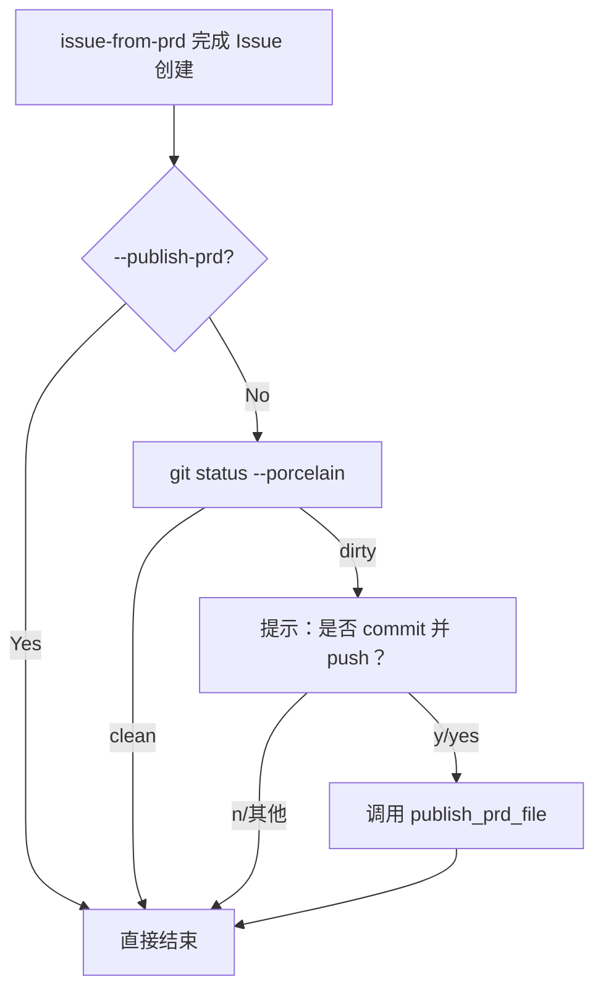

# PRD: issue-from-prd 交互式兜底 Push 提示

- GitHub Issue: https://github.com/zata-zhangtao/keda/issues/5

## 1. Introduction & Goals

当前 `iar issue-from-prd` 在不带 `--publish-prd` 时，会创建 GitHub Issue 并把 Issue URL 回写到本地 PRD 文件，但不会执行任何 Git 提交或推送。这导致 PRD 文件的修改（Issue URL 回写）留在工作区，用户需要手动 `git add`、`git commit`、`git push`。

本 PRD 的目标是在 CLI 层引入一个**轻量级交互式兜底**：当 `issue-from-prd` 完成 Issue 创建后，检测到 PRD 文件有未提交变更时，询问用户是否立即 commit 并 push，降低操作断档。

## 2. Requirement Shape

- **Actor**：使用 `iar issue-from-prd` 创建 Issue 的开发者。
- **Trigger**：`create_issue_from_prd(...)` 返回后，`git status --porcelain` 显示有未提交变更。
- **Expected Behavior**：
  - CLI 检测到未提交变更时，输出提示并等待用户输入。
  - 用户确认（`y`/`yes`）后，自动执行 `git add <prd>`、`git commit`、`git push`。
  - 若用户拒绝或直接回车，保持现状，不报错。
  - 如果用户显式传了 `--publish-prd`，则跳过交互式提示（因为 PRD 已经自动发布）。
  - `--ready` 参数默认值改为 `False`；只有用户显式传入 `--ready` 时，Issue 才会被打上 `agent/ready` label。
- **Scope Boundary**：
  - 只修改 `src/backend/api/cli.py` 的 `issue-from-prd` 分支。
  - 不改 `create_issue_from_prd(...)` 的核心逻辑。
  - 不改 `--publish-prd` 的现有语义。

## 3. Repository Context And Architecture Fit

### 相关模块

| 文件 | 职责 | 改动类型 |
|---|---|---|
| `src/backend/api/cli.py` | CLI 入口，负责参数解析、依赖组装和 use case 调用 | 修改（新增交互式提示分支） |

### 架构约束

- 交互式提示是 **CLI 层**的 UX 增强，放在 `main()` 中合适。
- 复用现有 `publish_prd_file(...)` 和 `PrdPublishContext`，不重复实现 Git 发布逻辑。
- `api/` 只做参数解析和调用，不直接操作 Git；实际的 Git 命令仍通过 `core/use_cases/create_issue_from_prd.py` 中的辅助函数执行。

## 4. Recommendation

### Recommended Approach：CLI 层后置交互式检测

在 `main()` 的 `issue-from-prd` 分支中，在 `create_issue_from_prd(...)` 返回后做最小改动：

```python
if not parsed.publish_prd:
    _prompt_and_publish_prd_if_needed(
        repo_path=repo_path,
        relative_prd_path=relative_prd_path,
        issue_url=issue_url,
        queue_ready=parsed.ready,
        git_remote=config.git.remote,
        labels_config=config.labels,
        github_client=github_client,
        process_runner=process_runner,
    )
```

### 为什么这是最佳方案

- **改动最小**：只改 CLI 层的后置检测，不动 core use case。
- **向后兼容**：`--publish-prd` 的行为完全不变；不带 flag 时多了一层友好提示。
- **复用现有逻辑**：确认 push 后直接调用 `publish_prd_file(...)`，不引入新的 Git 发布代码。

### Alternatives Considered

| 方案 | 说明 | 拒绝原因 |
|---|---|---|
| 让 `create_issue_from_prd` 内部做交互式提示 | use case 层包含 I/O | 破坏 core 层的纯净性；use case 不应依赖 stdin |
| 默认自动 push（无提示） | 不带 `--publish-prd` 也自动 commit/push | 和现有设计冲突，默认命令不应产生 Git 副作用 |

## 5. Implementation Guide

### Core Logic

```
BEFORE (main issue-from-prd 分支):
  issue_url = create_issue_from_prd(...)
  _logger.info("Created GitHub Issue: %s", issue_url)

AFTER (main issue-from-prd 分支):
  _, relative_prd_path = resolve_prd_paths(repo_path, Path(parsed.prd_path))
  issue_url = create_issue_from_prd(...)
  if not parsed.publish_prd:
      _prompt_and_publish_prd_if_needed(...)
  _logger.info("Created GitHub Issue: %s", issue_url)
```

### Change Impact Tree

```text
.
src/backend/api/cli.py
    [修改] 新增 _prompt_and_publish_prd_if_needed 辅助函数
    └── main()
        └── issue-from-prd 分支
            ├── BEFORE: create_issue_from_prd 后直接结束
            └── AFTER: 若未传 --publish-prd，检测未提交变更并交互式询问是否 push

tests/test_create_issue_from_prd.py
    [修改] 新增交互式提示的单元测试
    ├── test_prompt_publish_on_yes
    ├── test_prompt_publish_on_no
    └── test_prompt_publish_clean_worktree
```

### Flow Diagram



## 6. Definition Of Done

- [x] 不带 `--publish-prd` 时，`issue-from-prd` 在 Issue 创建后检测未提交变更。
- [x] 检测到未提交变更时，输出友好提示并等待用户输入。
- [x] 用户确认后，自动执行 PRD-only commit 和 push。
- [x] 用户拒绝后，命令正常结束，不报错。
- [x] `--publish-prd` 时跳过交互式提示。
- [x] `--ready` 默认值改为 `False`，不显式传入时 Issue 不含 `agent/ready` label。
- [x] 所有现有测试无回归失败。
- [x] `just lint` 和 `just test` 通过。

## 7. Acceptance Checklist

### Architecture Acceptance

- [x] `src/backend/api/cli.py` 中交互式提示逻辑只调用现有 `publish_prd_file(...)`，不引入新的 Git 命令拼接。
- [x] `create_issue_from_prd(...)` 的核心逻辑未被修改。

### Behavior Acceptance

- [x] 不带 `--publish-prd` 且 PRD 文件有未提交变更时，CLI 出现 `是否立即 commit 并 push 该变更？(y/N):` 提示。
- [x] 输入 `y` 后，执行 `git add <prd>`、`git commit`、`git push`。
- [x] 输入 `n` 或直接回车后，命令正常退出，不产生 commit。
- [x] 工作区干净时，不输出任何提示。
- [x] `--publish-prd` 时，不输出交互式提示。
- [x] 不带 `--ready` 时，创建的 Issue 不含 `agent/ready` label。
- [x] 显式传入 `--ready` 时，创建的 Issue 正常包含 `agent/ready` label。

### Validation Acceptance

- [x] `uv run pytest tests/test_create_issue_from_prd.py -v` 全部通过。
- [x] `uv run pytest tests/ -v` 无回归失败。
- [x] `just lint` 通过。

## 8. Functional Requirements

**FR-1**: 当 `--publish-prd` 未传入且工作区有未提交变更时，`main()` 必须输出交互式提示并等待用户输入。

**FR-2**: 用户输入 `y` 或 `yes`（不区分大小写）时，系统必须调用 `publish_prd_file(...)` 完成 PRD-only commit 和 push。

**FR-3**: 用户输入其他值或直接回车时，系统不得执行任何 Git 提交或推送操作。

**FR-4**: 当 `--publish-prd` 已传入时，系统不得输出交互式提示。

**FR-5**: 系统必须通过 `git status --porcelain` 检测工作区状态，而不是依赖其他 heuristics。

**FR-6**: `issue-from-prd` 的 `--ready` 参数默认值必须为 `False`；只有用户显式传入 `--ready` 时，系统才在创建 Issue 时附加 `agent/ready` label。

## 9. Non-Goals

- 不修改 `create_issue_from_prd(...)` 的内部逻辑。
- 不改变 `--publish-prd` 的现有语义和实现。
- 不处理非 PRD 文件的未提交变更提示。
- 不在 Issue comment 中记录交互式 push 事件。

## 10. Risks And Follow-Ups

| 风险 | 缓解措施 |
|---|---|
| 用户误以为是 `--publish-prd` 的等价功能 | 提示信息明确说明这是「未提交变更的兜底 push」，不是完整发布流程 |
| CI/脚本场景被 stdin 阻塞 | CI 场景应继续使用 `--publish-prd` 或 `--ready` 等 flag，跳过提示 |
| 用户忘记 `--ready` 导致 Issue 不被 runner 处理 | CLI 输出提示告知 Issue 已创建但不含 ready label，引导用户按需补充 |

## 11. Decision Log

| ID | Decision | Chosen | Rejected | Rationale |
|---|---|---|---|---|
| D-01 | 交互式提示放在哪一层 | CLI 层（`main()`） | core use case 层 | core 层不应依赖 stdin；CLI 层负责 UX |
| D-02 | 检测工作区状态的方式 | `git status --porcelain` | 检查文件 mtime 或 hash | `git status` 是 Git 的标准状态检测方式，最可靠 |
| D-03 | 是否复用 `publish_prd_file` | 复用 | 在 CLI 层重写 Git 命令 | 复用现有逻辑，避免代码重复 |
| D-04 | `--ready` 默认值 | `False`（显式开启） | `True`（默认开启） | 默认开启会导致 PRD 尚未入仓时 Issue 已被 runner 消费，造成状态分裂；显式开启更安全 |
