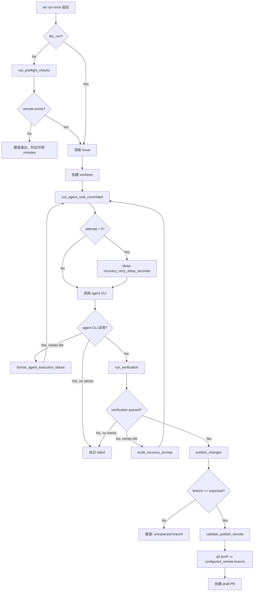

# PRD: Agent Runner 无人值守执行健壮性与可观测性增强

- GitHub Issue: https://github.com/zata-zhangtao/keda/issues/6

## 1. Introduction & Goals

当前 Agent Runner 在无人值守模式下调用 Claude Code 时存在几个运行时可观测性与健壮性缺口：

1. **原始 JSON 淹没终端**：Claude Code 以 `--output-format stream-json` 运行时，大量未经处理的 JSON 行直接喷到终端，无法快速判断 agent 正在做什么或卡在哪一步。
2. **Agent CLI 崩溃直接失败**：当 agent 进程自身因 API 错误、网络中断或参数问题异常退出时，runner 直接抛异常并将 Issue 标为 `failed`，没有利用已有的 recovery 机制让 agent 尝试修复。
3. **Recovery 密集重试**：验证失败或 agent 崩溃后立即重试，未给外部依赖（API 限流、网络抖动）留出冷却时间。
4. **Remote 配置漂移导致发布失败**：`config.toml` 中配置的 `git.remote` 可能不存在于当前环境（例如从 `origin` 改为 `zata`）， runner 在领取 Issue 并执行完全部工作后才在 `git push` 阶段失败，浪费计算资源。
5. **分支意外变更无防护**：agent 在执行过程中可能意外切回 `main` 分支，runner 继续从错误分支发布变更。

本 PRD 的目标是补齐上述缺口，使无人值守执行在**可观测性、容错性、配置安全性**三方面达到生产可用水准。

## 2. Requirement Shape

- **Actor**：Agent Runner 编排器（`run_once`）。
- **Trigger**：`iar run-once` 启动无人值守 Issue 处理流程。
- **Expected Behavior**：
  - Claude stream-json 输出被实时过滤为简洁摘要（工具调用、assistant 文本、错误），而非原始 JSON。
  - agent CLI 异常退出（`subprocess.CalledProcessError`、`RuntimeError`、`OSError`）时纳入 recovery loop，而非直接 failed。
  - 每次 recovery 前等待可配置的 `recovery_retry_delay_seconds` 秒，缓解 API 限流与瞬时故障。
  - `run_once` 在领取任何 Issue 之前执行 preflight checks，校验配置的 publish remote 是否存在于当前仓库。
  - `publish_changes` 校验当前分支仍为预期的 Issue worktree 分支，防止从意外分支 push。
  - `publish_changes` 再次校验 remote 存在性，并只推送到配置中指定的 remote。
- **Scope Boundary**：
  - 修改 `src/backend/infrastructure/process_runner.py` 增加 stream-json 过滤渲染器。
  - 修改 `src/backend/core/use_cases/run_agent_once.py` 增加 agent 崩溃 recovery、preflight checks、branch 校验、remote 校验。
  - 修改配置模型、factory、状态端点暴露新字段。
  - 不改 agent 调用方式或 sandbox 设置。

## 3. Repository Context And Architecture Fit

### 相关模块

| 文件 | 职责 | 改动类型 |
|---|---|---|
| `src/backend/infrastructure/process_runner.py` | 底层进程执行 | 新增 Claude stream-json 过滤渲染 |
| `src/backend/core/use_cases/run_agent_once.py` | Runner 核心编排 | 新增 agent 崩溃 recovery、preflight、branch/remote 校验 |
| `src/backend/core/shared/models/agent_runner.py` | 核心配置模型 | 新增 `recovery_retry_delay_seconds` |
| `src/backend/engines/agent_runner/factory.py` | 配置组装工厂 | 映射新配置字段 |
| `src/backend/infrastructure/config/settings.py` | TOML 配置解析 | 新增 `recovery_retry_delay_seconds` |
| `src/backend/api/routes/agent_runner.py` | FastAPI 状态端点 | 暴露 `recovery_retry_delay_seconds` |
| `docs/guides/agent-runner.md` | 用户文档 | 更新配置项与安全边界说明 |

### 架构约束

- `process_runner` 属于 `infrastructure/` 层，只负责进程执行，不感知上层业务语义；stream-json 过滤是对 stdout 的纯表现层处理，不改变进程退出码或结果。
- preflight checks、branch 校验、remote 校验属于 runner 编排职责，放在 `core/use_cases/run_agent_once.py` 中合适。
- 依赖方向不变：`api/` 暴露新配置字段；`core/` 增加业务逻辑；`engines/` 只做配置映射；`infrastructure/` 增加输出过滤。

## 4. Recommendation

### Recommended Approach：分层补齐

1. **表现层**：在 `SubprocessRunner.run()` 中检测命令是否包含 `--output-format stream-json`，若是则改用 `Popen` 逐行读取 stdout，通过 `_ClaudeStreamRenderer` 将 JSON 事件实时转译为简洁文本打印到终端。
2. **编排层**：将 `run_agent_until_committed` 中的 agent 调用包裹在 `try/except` 中，捕获 `RuntimeError`、`OSError`、`subprocess.CalledProcessError`，把异常信息格式化后纳入 recovery prompt。
3. **配置层**：在 `RunnerConfig` / `AgentRunnerRunnerSettings` 中增加 `recovery_retry_delay_seconds`，默认 30 秒；`run_agent_until_committed` 在每次非首次尝试前调用 `time.sleep()`。
4. **安全层**：新增 `run_preflight_checks()`，在 `run_once` 领取 Issue 前调用 `validate_publish_remote()`；`publish_changes` 增加 `expected_branch` 参数，在 push 前校验分支一致性。

### 为什么这是最佳方案

- **可观测性不侵入业务逻辑**：stream-json 过滤放在 `process_runner` 层，对 `core/` 完全透明；runner 逻辑不需要知道 agent 输出格式。
- **容错性最大化复用**：agent CLI 崩溃 recovery 直接复用已有的 `build_recovery_prompt` + `run_agent_with_prompt` 机制，不引入新代码路径。
- **失败左移**：preflight checks 在领取 Issue 前即暴露配置错误，避免 agent 执行数分钟后才发现 remote 不存在。
- **冷却时间可配置**：30 秒默认值覆盖大多数 API 限流场景，同时允许用户按仓库网络环境调整。

### Alternatives Considered

| 方案 | 说明 | 拒绝原因 |
|---|---|---|
| 在 agent 侧修改输出格式 | 去掉 `--output-format stream-json`，恢复默认终端输出 | 默认输出在无人值守场景下无结构化日志，且会丢失流式进度信息 |
| 使用第三方工具过滤 JSON | 引入 `jq` 或 `claude-code` 包装器 | 增加外部依赖，且无法智能区分 thinking_delta、text_delta、tool_use 等事件语义 |
| 无条件延迟 recovery | 每次 recovery 都固定等待 | 首次尝试不应延迟，只在真正重试时冷却；且固定值不够灵活 |
| 在 `git push` 失败后再检查 remote | 保持现有流程，push 失败再报错 | 浪费 agent 计算资源；问题应在领取工作前即发现 |

## 5. Implementation Guide

### Core Logic

```
process_runner.run():
  IF command starts with "claude" and contains "--output-format" + "stream-json":
      run via Popen with line-by-line stdout reading
      for each line: renderer.render_line(line) -> print if non-empty
      return CompletedProcess with empty stdout/stderr
  ELSE:
      existing subprocess.run() behavior

run_agent_until_committed():
  FOR attempt in 0..max_recovery_attempts:
      IF attempt > 0:
          sleep(recovery_retry_delay_seconds)
      TRY:
          run_agent(...) or run_agent_with_prompt(...)
      EXCEPT RuntimeError, OSError, CalledProcessError as exc:
          IF attempt >= max_recovery_attempts: RAISE
          recovery_failure_summary = format_agent_execution_failure(exc)
          CONTINUE
      verification_results = run_verification(...)
      ... existing recovery for verification failure ...

run_once():
  IF not dry_run:
      run_preflight_checks(repo_path, config, process_runner)
      # validates publish remote exists
  ... existing issue listing and processing ...
  publish_changes(..., expected_branch=expected_branch)

publish_changes(..., expected_branch=None):
  branch = get_current_branch(...)
  IF expected_branch is not None AND branch != expected_branch:
      RAISE RuntimeError("unexpected branch")
  validate_safe_changes(...)
  publish_remote = validate_publish_remote(...)
  git push -u publish_remote branch
```

### Change Impact Tree

```text
.
src/backend/infrastructure/process_runner.py
    [新增] _ClaudeStreamRenderer
    │   ├── render_line()
    │   ├── _render_stream_event()
    │   ├── _render_assistant_message()
    │   └── _render_result()
    [新增] _should_filter_claude_stream()
    [新增] _run_filtered_claude_stream()
    [新增] _format_tool_use()
    └── SubprocessRunner.run()
        └── 条件分支：stream-json 命令走 Popen 过滤路径

src/backend/core/use_cases/run_agent_once.py
    [新增] format_agent_execution_failure()
    [新增] _agent_command_name()
    [新增] wait_before_recovery_attempt()
    [新增] list_git_remotes()
    [新增] validate_publish_remote()
    [新增] run_preflight_checks()
    [修改] run_agent_until_committed()
    │   └── 包裹 agent 调用在 try/except 中，支持 CLI 崩溃 recovery
    [修改] publish_changes()
    │   └── 增加 expected_branch 参数和 remote 校验
    └── [修改] run_once()
        └── 增加 preflight checks

src/backend/core/shared/models/agent_runner.py
    [新增] RunnerConfig.recovery_retry_delay_seconds

src/backend/engines/agent_runner/factory.py
    [修改] build_app_config() 映射 recovery_retry_delay_seconds

src/backend/infrastructure/config/settings.py
    [新增] AgentRunnerRunnerSettings.recovery_retry_delay_seconds

src/backend/api/routes/agent_runner.py
    [修改] get_agent_runner_status() 暴露 recovery_retry_delay_seconds
```

### Flow Diagram



### External Validation

- stream-json 过滤已在本地实际运行 `claude -p --output-format stream-json "say hello"` 验证输出简洁性。
- preflight remote 校验已通过单元测试覆盖：配置 remote 不存在时 `run_once` 直接返回 exit code 1，不领取 Issue。
- agent CLI 崩溃 recovery 已通过单元测试覆盖：`RuntimeError` 被捕获、格式化进 recovery prompt、重试后成功提交。

## 6. Definition Of Done

- [x] `process_runner` 对 Claude stream-json 命令启用实时过滤，终端只显示工具调用摘要、assistant 文本和错误。
- [x] stream-json 过滤不改变进程退出码，非 stream-json 命令保持原有行为。
- [x] `run_agent_until_committed` 捕获 agent CLI 异常退出，纳入 recovery loop。
- [x] recovery 异常信息格式化后包含命令名、exit code、stdout、stderr 截断内容。
- [x] 每次 recovery 前等待 `recovery_retry_delay_seconds` 秒，该值可从配置读取。
- [x] `run_once` 在领取 Issue 前执行 preflight checks，校验 publish remote 存在性。
- [x] publish remote 不存在时直接失败，并列出当前可用 remotes。
- [x] `publish_changes` 校验当前分支与预期分支一致，不一致时报错。
- [x] `publish_changes` 校验 remote 存在性，并只推送到配置中指定的 remote。
- [x] 配置模型、工厂、API 状态端点均暴露 `recovery_retry_delay_seconds`。
- [x] `config.toml` 增加 `recovery_retry_delay_seconds = 30`。
- [x] 文档更新 stream-json 输出说明、新增配置项、安全边界。
- [x] 所有现有测试无回归失败。
- [x] `just test` 通过。

## 7. Acceptance Checklist

### Architecture Acceptance

- [x] `process_runner.py` 的 stream-json 过滤是纯表现层，不修改 `CommandResult` 返回语义。
- [x] `core/use_cases/run_agent_once.py` 的 recovery、preflight、校验逻辑不破坏四层依赖方向。
- [x] `RunnerConfig` / `AgentRunnerRunnerSettings` / 状态端点字段保持一致。

### Behavior Acceptance

- [x] Claude stream-json 运行时，终端不再显示原始 JSON 行。
- [x] 终端显示 `[agent tool] ToolName: file_path` 格式的工具调用摘要。
- [x] 终端显示 assistant 的 `text_delta` 内容。
- [x] 终端显示 `[agent error] ...` 或 `[agent result] ...` 格式的结果/错误。
- [x] thinking_delta、signature_delta、tool_result 等噪音事件被抑制。
- [x] agent CLI 以非零退出时，runner 进入 recovery，而非直接 failed。
- [x] agent CLI 抛出 `RuntimeError` 时，runner 进入 recovery。
- [x] recovery prompt 包含异常类型、exit code、stdout/stderr 截断内容。
- [x] recovery 重试前调用 `time.sleep(recovery_retry_delay_seconds)`。
- [x] `recovery_retry_delay_seconds <= 0` 时跳过等待。
- [x] `run_once` 在 `dry_run=False` 时先执行 `run_preflight_checks`。
- [x] preflight 发现配置 remote 不存在时返回 exit code 1，不领取 Issue。
- [x] preflight 错误日志包含可用 remote 列表。
- [x] `publish_changes` 在 `expected_branch` 传入时校验分支一致性。
- [x] 分支不一致时抛出 `RuntimeError`，不执行 push。
- [x] `publish_changes` 在 push 前再次校验 remote 存在性。
- [x] push 命令使用配置中指定的 remote 名，不 fallback 到其他 remote。

### Validation Acceptance

- [x] `uv run pytest tests/test_process_runner.py -v` 全部通过。
- [x] `uv run pytest tests/test_run_agent.py -v` 全部通过。
- [x] `uv run pytest tests/ -v` 无回归失败。
- [x] `just test` 通过。

## 8. Functional Requirements

**FR-1**: `SubprocessRunner.run()` 必须在检测到命令为 Claude stream-json 时，使用 `Popen` 逐行读取 stdout 并通过 `_ClaudeStreamRenderer` 实时过滤输出。

**FR-2**: `_ClaudeStreamRenderer.render_line()` 必须将 `stream_event` 的 `text_delta` 转译为纯文本；将 `assistant` 的 `tool_use` 转译为 `[agent tool] Name: details` 格式；将 `result` 的 error 转译为 `[agent error] ...`。

**FR-3**: `_ClaudeStreamRenderer` 必须抑制 `thinking_delta`、`signature_delta`、非 error 的 `result`（当已有 text 输出时）以及所有未识别事件类型。

**FR-4**: `run_agent_until_committed()` 必须在每次非首次 recovery 尝试前等待 `recovery_retry_delay_seconds` 秒。

**FR-5**: `run_agent_until_committed()` 必须在 agent CLI 调用抛出 `RuntimeError`、`OSError` 或 `subprocess.CalledProcessError` 时，若还有剩余重试次数，则格式化异常信息并继续 recovery loop。

**FR-6**: `format_agent_execution_failure()` 必须对 `CalledProcessError` 输出命令名、exit code、截断后的 stdout 和 stderr；对其他异常输出异常类型和截断后的字符串表示。

**FR-7**: `run_once()` 在 `dry_run=False` 时必须在领取 Issue 前调用 `run_preflight_checks()`。

**FR-8**: `run_preflight_checks()` 必须调用 `validate_publish_remote()`，确认 `config.git.remote` 存在于当前仓库的 remote 列表中。

**FR-9**: `validate_publish_remote()` 在配置 remote 不存在时必须抛出 `RuntimeError`，错误信息包含可用 remote 列表。

**FR-10**: `publish_changes()` 在传入 `expected_branch` 时，必须校验当前分支与其一致，不一致时抛出 `RuntimeError`。

**FR-11**: `publish_changes()` 必须在 `git push` 前再次调用 `validate_publish_remote()`，并使用校验通过的 remote 名执行 push。

**FR-12**: `config.toml`、`RunnerConfig`、`AgentRunnerRunnerSettings`、API 状态端点必须统一暴露 `recovery_retry_delay_seconds`，默认值为 30。

## 9. Non-Goals

- **不改其他 agent 输出格式**：本 PRD 只处理 Claude Code 的 `stream-json` 输出；其他 agent 或非 stream-json 模式保持原样。
- **不改 sandbox 设置**：Codex 的 `--sandbox workspace-write` 保持不变。
- **不提供通用 JSON 流过滤器**：`_ClaudeStreamRenderer` 只对 Claude Code 的 stream-json 事件类型做硬编码解析，不做通用 JSON 流抽象。
- **不在 preflight 中校验其他配置**：preflight 只检查 publish remote 存在性，不扩展为全量配置校验。
- **不处理 agent 无限挂起**：本 PRD 不增加 agent 执行超时机制；超时仍由调用方控制。

## 10. Risks And Follow-Ups

| 风险 | 缓解措施 |
|---|---|
| stream-json 过滤硬编码事件类型，Claude Code 未来变更格式后过滤失效 | 过滤器对未知事件返回空字符串（静默降级），不会崩溃；需关注 Claude Code 更新日志 |
| `Popen` 逐行读取在极端大输出时可能内存增长 | 逐行读取是流式处理，单行 JSON 大小可控；若遇异常大 line，可后续增加单行长度截断 |
| recovery delay 导致 Issue 处理总时长不可控 | 默认 30 秒、max 5 次，最坏情况增加 150 秒；用户可通过配置调低 |
| preflight 只检查 remote 名存在性，不检查 push 权限 | push 权限错误会在 `git push` 阶段暴露，属于正常 Git 错误处理路径 |
| branch 校验只比较字符串，不校验 branch 是否指向预期 commit | 当前设计下 agent 不会切分支后改文件再切回；若需更强校验，可后续比较 HEAD SHA |

## 11. Decision Log

| ID | Decision | Chosen | Rejected | Rationale |
|---|---|---|---|---|
| D-01 | stream-json 过滤放在哪一层 | `infrastructure/process_runner.py` | `core/use_cases` 层或 CLI 包装脚本 | 过滤是纯进程 I/O 行为，放在底层最透明；core 层不应感知输出格式 |
| D-02 | 过滤实现方式 | `Popen` + 逐行渲染 + `print` | `subprocess.run` + 事后过滤 | 需要实时终端反馈，事后过滤失去流式体验 |
| D-03 | agent CLI 崩溃是否纳入 recovery | 是，复用现有 recovery loop | 直接 failed 或单独重试逻辑 | 复用现有机制代码最少；agent 有能力修复自身触发的 API/参数错误 |
| D-04 | recovery delay 默认值 | 30 秒 | 0 秒或 60 秒 | 30 秒覆盖大多数 API 限流冷却窗口，同时不过度拖慢执行 |
| D-05 | preflight 检查范围 | 只校验 publish remote 存在性 | 全量配置校验（GitHub token、worktree 路径等） | 最小有效检查；remote 缺失是当前最频繁的配置漂移问题 |
| D-06 | publish remote 校验时机 | preflight + publish 双重校验 | 只在 publish 时校验 | preflight 左移失败点，避免浪费 agent 计算；publish 再次校验防止执行期间 remote 被删除 |
| D-07 | branch 校验范围 | `publish_changes` 入参校验 | 在 agent 执行全程监控 branch | 最小侵入；agent 正常不应切分支，只在发布前做最终防线 |
