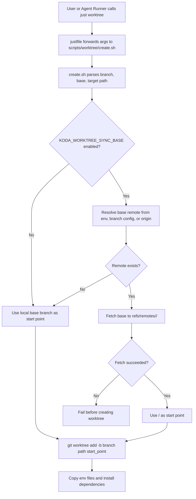

# PRD: Worktree 创建默认使用最新远程基线

- GitHub Issue: https://github.com/zata-zhangtao/keda/issues/7

## 1. Introduction & Goals

当前 `just worktree` 和 Agent Runner 的 `create_command` 最终都调用 `scripts/worktree/create.sh`。脚本现在从本地 `base_branch_name` 创建新 worktree：

```bash
git -C "$repo_root_path" worktree add -b "$branch_name" "$target_abs_path" "$base_branch_name"
```

如果本地 `main` 或 `develop` 落后于远程，新的 issue 分支会从过期提交开始。结果是 agent 或开发者在旧基线上完成修改，PR 阶段更容易遇到冲突、CI 回归或 reviewer 要求重新整理分支。

本 PRD 的目标：

- 新建 worktree 默认基于最新远程 base ref，而不是过期的本地 base branch。
- 不强行移动用户本地 `main`，避免破坏主工作区或其他 worktree。
- 手动 `just worktree` 与 Agent Runner 走同一套创建逻辑，避免两套行为漂移。
- 对无远程、离线、本地-only base branch 等场景给出明确降级或失败行为。

### 可衡量目标

- `scripts/worktree/create.sh` 在创建新 worktree 前默认同步 base branch 对应远程 ref。
- 当远程 base ref 可用时，新分支 HEAD 等于最新 `refs/remotes/<remote>/<base>`。
- 本地 `refs/heads/<base>` 不被自动 fast-forward、reset 或 checkout。
- fetch 失败且需要远程新鲜度时，脚本失败并给出可操作提示。
- 文档说明默认行为、环境变量开关、Agent Runner 影响和复用 worktree 的边界。

## 2. Requirement Shape

| 维度 | 内容 |
|------|------|
| Actor | 开发者执行 `just worktree <branch>`，或 Agent Runner 为 Issue 创建隔离 worktree |
| Trigger | 新建 worktree 分支时，本地 base branch 可能落后于远程 |
| Expected behavior | 默认先同步远程 base ref，再从最新远程 ref 创建新分支；不修改本地 base branch |
| Explicit scope boundary | 只处理新建 worktree 的起点选择；不自动 rebase 已存在 worktree；不改变 publish、PR 创建或 merge 流程 |

### Requirement Assumptions To Confirm

- 默认推荐：远程存在且 fetch 失败时直接失败，而不是静默回退到过期本地 branch。理由是静默回退会保留当前问题。
- 默认推荐：远程名优先从 `branch.<base>.remote` 推导，缺省为 `origin`，可用环境变量覆盖。
- 默认推荐：已存在 worktree 不自动 rebase。理由是复用 worktree 可能包含未提交修复上下文，自动 rebase 有丢失或扩大冲突的风险。

如果以上任一假设不符合实际使用方式，应先修订本 PRD 再实现。

## 3. Repository Context And Architecture Fit

### Existing Path

当前最接近的实现路径已经存在：

- `scripts/worktree/create.sh`
  - 解析 `--base` 和 `KODA_WORKTREE_BASE_BRANCH`。
  - 计算 `<repo>-worktrees/[tasks/]branch` 目标路径。
  - 检查本地 `refs/heads/$base_branch_name` 存在。
  - 使用 `git worktree add -b <branch> <path> <local-base>` 创建分支。
  - 创建后复制 `.env*`，并执行 Python / frontend 依赖准备。
- `justfile`
  - `just worktree` 只负责参数转发和进入 shell。
  - Agent Runner 默认配置 `create_command = "just worktree issue-{issue_number} enter_shell=false"`，因此 runner 也复用 `create.sh`。
- `config.toml`
  - `[agent_runner.git].remote = "origin"` 与 `base_branch = "main"` 是发布和 PR 的目标配置。
  - `[agent_runner.worktree].create_command` 没有直接注入 remote/base 以外的创建策略。
- `docs/guides/configuration.md`
  - 已记录 `KODA_WORKTREE_BASE_BRANCH`、`WORKTREE_FRONTEND_STRATEGY`、`WORKTREE_SKIP_FRONTEND_INSTALL`。
- `docs/getting-started.md`
  - 当前描述为“默认会从本地 `main` 分支创建 worktree”。
- `docs/guides/agent-runner.md`
  - 说明 runner 默认从 base branch 创建 worktree，以及 ready PRD 必须能被 base branch 读取。

### Historical PRD Review

已检查历史 PRD，没有发现完全覆盖“创建 worktree 前同步远程 base ref”的 PRD：

| PRD | 关系 | 结论 |
|---|---|---|
| `tasks/archive/20260520-193324-prd-simplify-worktree-commands.md` | 简化 Agent Runner worktree 命令 | 只改配置命令形态，不改创建基线选择 |
| `tasks/archive/20260521-145500-prd-issue-worktree-default-tasks-subdir.md` | 集中 worktree 路径并归类 issue 分支 | 只改路径布局，不改 base ref 新鲜度 |
| `tasks/archive/20260521-110127-prd-publish-prd-before-ready.md` | ready Issue 前发布 PRD | 说明 runner 从 base branch 创建 worktree，但未解决本地 base branch 落后远程 |
| `tasks/pending/20260521-104408-prd-multi-repository-agent-runner.md` | 多仓库 runner 配置 | 未来会增加仓库级 git 配置，本 PRD 的脚本级策略应保持可被仓库级命令复用 |

### Reuse Candidates

- 继续复用 `scripts/worktree/create.sh` 作为唯一新建 worktree 入口。
- 在 `create.sh` 内新增小型 helper，而不是在 `justfile` 或 runner core 中复制 Git 创建逻辑。
- 继续复用 `KODA_WORKTREE_BASE_BRANCH` 的命名风格，新增少量 `KODA_WORKTREE_*` 环境变量表达 remote 同步策略。
- 新增脚本级测试，复用仓库已有 pytest + subprocess 测试风格。

### Architecture Constraints

- 本需求主要落在 `scripts/worktree/` 和文档，不需要改变后端四层依赖方向。
- `src/backend/core/use_cases/run_agent_once.py` 通过配置命令创建 worktree，不应直接承担 shell 级 Git ref 同步逻辑。
- 不新增数据库、API、长期配置 loader 或前端页面。
- Python 测试文件如新增文本 I/O，必须显式使用 `encoding="utf-8"`。
- 文档变更需要同步 `docs/`；不新增长期文档页，因此不需要修改 `mkdocs.yml`。

### Potential Redundancy Risks

- 不应只修改 Agent Runner `create_command`，否则手动 `just worktree` 仍会从旧本地 branch 创建。
- 不应新增第二个 worktree 创建脚本，否则路径、依赖安装和 `.env` 复制逻辑会分叉。
- 不应在 runner core 里实现 `git fetch` + `git worktree add`，否则会绕过脚本已有的路径和依赖准备能力。
- 不应自动 fast-forward 本地 `main`，否则会修改用户主工作区状态。

## 4. Recommendation

### Recommended Approach

推荐在 `scripts/worktree/create.sh` 内扩展 start point 解析：

1. 保留现有 `--base <base_branch>` 和 `KODA_WORKTREE_BASE_BRANCH`。
2. 新增远程同步策略：
   - `KODA_WORKTREE_SYNC_BASE`：默认 `true`。设为 `false` 时保持旧行为，只使用本地 base branch。
   - `KODA_WORKTREE_BASE_REMOTE`：可选。未设置时优先读取 `branch.<base>.remote`，再回退到 `origin`。
3. 当同步开启且 remote 存在时：
   - fetch 指定 base branch 到 `refs/remotes/<remote>/<base>`。
   - 成功后以 `<remote>/<base>` 作为 `git worktree add -b` 的 start point。
   - 打印实际 start point 和 commit SHA，方便用户确认。
4. 当同步开启但 remote 不存在时：
   - 如果本地 `refs/heads/<base>` 存在，回退到本地 base branch，并提示这是 local-only 模式。
   - 如果本地 base branch 也不存在，失败。
5. 当同步开启、remote 存在但 fetch 指定 base branch 失败时：
   - 失败退出，不创建目标目录。
   - 提示用户检查网络、remote、branch 名称，或显式设置 `KODA_WORKTREE_SYNC_BASE=false` 使用本地-only 行为。
6. 已存在 worktree 的 reuse 流程不自动 rebase；文档说明需要用户手动 rebase 或删除后重建。

推荐的核心行为：

```bash
# Pseudocode
base_remote_name="${KODA_WORKTREE_BASE_REMOTE:-$(git config branch.${base_branch_name}.remote || true)}"
base_remote_name="${base_remote_name:-origin}"

if sync_enabled && remote_exists "$base_remote_name"; then
    git fetch --prune "$base_remote_name" \
        "+refs/heads/${base_branch_name}:refs/remotes/${base_remote_name}/${base_branch_name}"
    worktree_start_point="${base_remote_name}/${base_branch_name}"
else
    worktree_start_point="${base_branch_name}"
fi

git worktree add -b "$branch_name" "$target_abs_path" "$worktree_start_point"
```

### Why This Fits The Current Architecture

- `create.sh` 已经是手动和 runner 共享的新建入口，在这里改动能一次覆盖两类调用。
- 从 remote-tracking ref 创建新分支，不需要移动本地 `main`，风险比 `git pull` 或 fast-forward 本地 branch 更低。
- 环境变量延续现有脚本配置模式，不需要新增 TOML 字段或后端配置合并逻辑。
- Agent Runner 仍通过 `create_command` 解耦 worktree 创建细节，core 层无需知道 Git remote 同步规则。

### Brainstormed Options

| 方案 | 说明 | 取舍 |
|---|---|---|
| 在 `create.sh` fetch 并从 `origin/main` 创建 | 脚本统一处理手动和 runner 新建 worktree | 推荐。覆盖面最大，且不修改本地 base branch |
| 创建前 fast-forward 本地 `main` | `git fetch` 后移动 `refs/heads/main`，再沿用旧 `worktree add ... main` | 拒绝。会改用户本地主分支，在 base branch 被其他 worktree checkout 时也可能失败 |
| 只在 Agent Runner `create_command` 前加 `git fetch` | 修改配置命令或 runner 逻辑 | 拒绝。手动 `just worktree` 仍旧过期，而且命令模板会变复杂 |
| 每次复用已存在 worktree 时自动 rebase 到远程 base | 减少长期 worktree 过期 | 拒绝作为本 PRD目标态。复用 worktree 可能有未提交变更或恢复上下文，自动 rebase 风险高 |
| 发现本地 base 落后时只报错，要求用户手动 pull | 最保守 | 不推荐。能避免旧基线，但降低自动化价值，runner 无人值守场景会频繁卡住 |
| 新增完整 Git worktree Python 服务 | 用 Python 管理 fetch、路径和 Git 状态 | 拒绝。当前 shell 脚本已经是稳定入口，引入服务层会重复职责 |

## 5. Implementation Guide

本节是实现时的活文档。实现中如发现更好的路径、隐藏依赖或额外文件，需要先更新本 PRD 再继续。

### Core Logic

控制流目标态：

1. 用户或 runner 调用 `just worktree <branch>`。
2. `justfile` 继续转发到 `scripts/worktree/create.sh`。
3. `create.sh` 完成参数解析和目标路径计算。
4. `create.sh` 调用 helper 解析 `worktree_start_point`：
   - 同步关闭：返回本地 `base_branch_name`。
   - 同步开启且 remote 存在：fetch remote base，返回 `<remote>/<base>`。
   - 同步开启且 remote 不存在：回退本地 base。
   - 同步开启且 fetch 失败：返回失败，不创建 worktree。
5. `git worktree add -b "$branch_name" "$target_abs_path" "$worktree_start_point"` 创建分支。
6. 后续 `.env` 复制、依赖安装、编辑器打开逻辑保持不变。

### Change Impact Tree

```text
Scripts
└── scripts/worktree/create.sh
    [修改]
    【总结】在新建 worktree 前解析并同步远程 base ref，使新分支默认基于最新远程提交。

    ├── 新增 remote 推导 helper，优先使用 KODA_WORKTREE_BASE_REMOTE，其次 branch.<base>.remote，最后 origin
    ├── 新增 KODA_WORKTREE_SYNC_BASE 开关，默认开启远程同步
    ├── fetch 指定 base branch 到 refs/remotes/<remote>/<base>
    ├── 使用实际 start point 创建 worktree，并打印 start point / SHA
    └── fetch 失败时拒绝创建，避免静默使用过期本地 base

Tests
└── tests/test_worktree_create_script.py
    [新增]
    【总结】用临时 Git 仓库验证 create.sh 的远程同步、local-only fallback 和禁用同步行为。

    ├── 覆盖本地 main 落后远程时，新 worktree 从 origin/main 最新提交创建
    ├── 覆盖新建 worktree 不会移动本地 refs/heads/main
    ├── 覆盖 KODA_WORKTREE_SYNC_BASE=false 时保持本地 base 行为
    └── 覆盖无 remote 但本地 base 存在时仍可创建 worktree

Docs
├── docs/getting-started.md
│   [修改]
│   【总结】更新 just worktree 默认基线说明，避免继续描述为只从本地 main 创建。
│
│   ├── 说明默认会同步 base branch 的远程 tracking ref
│   └── 说明可用环境变量关闭同步或指定 remote
│
├── docs/guides/configuration.md
│   [修改]
│   【总结】补充 worktree 远程同步相关环境变量和使用建议。
│
│   ├── 新增 KODA_WORKTREE_SYNC_BASE
│   ├── 新增 KODA_WORKTREE_BASE_REMOTE
│   └── 说明 fetch 失败、无 remote、local-only base 的行为
│
└── docs/guides/agent-runner.md
    [修改]
    【总结】说明 Agent Runner 新建 issue worktree 默认基于最新远程 base，复用 worktree 不自动 rebase。

    ├── 更新 worktree 创建安全边界说明
    ├── 说明失败重跑复用既有 worktree 时不会自动重写分支
    └── 如发现配置示例路径仍是旧约定，同步修正为 <repo>-worktrees/tasks/issue-{issue_number}
```

### Flow Diagram



### Low-Fidelity Prototype

No low-fidelity prototype required for this PRD.

### ER Diagram

No data model changes in this PRD.

### Interactive Prototype Change Log

No interactive prototype file changes in this PRD.

### External Validation

No external validation required; repository evidence was sufficient.

## 6. Definition Of Done

- `scripts/worktree/create.sh` 新建 worktree 默认使用最新远程 base ref。
- 本地 base branch 不被自动移动。
- 远程同步失败时行为明确，不静默创建过期 worktree。
- 手动 `just worktree` 和 Agent Runner 默认 `create_command` 都受益于同一实现。
- 文档完整说明默认行为、开关、失败模式和已存在 worktree 的边界。
- 相关测试、`just test` 和文档构建验证通过。

## 7. Acceptance Checklist

### Architecture Acceptance

- [x] 远程同步逻辑位于 `scripts/worktree/create.sh`，没有在 `justfile` 或 `src/backend/core/use_cases/run_agent_once.py` 中复制 worktree 创建实现。
- [x] `src/backend/core/` 没有新增对 `infrastructure/`、shell 脚本细节或 Git remote 同步策略的依赖。
- [x] Agent Runner 默认 `create_command` 可以不改命令字符串就获得新的创建行为，除非实现中发现必须显式传入环境变量。

### Behavior Acceptance

- [x] 当本地 `main` 落后于 `origin/main` 时，执行 `just worktree issue-123 enter_shell=false` 创建的分支 HEAD 等于最新 `origin/main`。
- [x] 上述场景中，本地 `refs/heads/main` 保持在创建前的 commit，不被 fast-forward 或 reset。
- [x] 当 `KEDA_WORKTREE_SYNC_BASE=false` 时，新 worktree 继续从本地 `--base` 或 `KODA_WORKTREE_BASE_BRANCH` 指定的 branch 创建。
- [x] 当 remote 不存在但本地 base branch 存在时，新 worktree 可以创建，并输出 local-only fallback 提示。
- [x] 当 remote 存在但 fetch 指定 base branch 失败时，命令非零退出，目标 worktree 目录不应留下半成品。
- [x] 已存在 worktree 被 Agent Runner 复用时，不会自动 rebase 或 reset 该 worktree。

### Configuration Acceptance

- [x] `KEDA_WORKTREE_BASE_REMOTE` 可覆盖默认 remote。
- [x] 未设置 `KEDA_WORKTREE_BASE_REMOTE` 时，优先使用 `branch.<base>.remote`；如果不存在，则使用 `origin`。
- [x] `KODA_WORKTREE_BASE_BRANCH` 和 `--base <branch>` 的既有语义保持可用。

### Documentation Acceptance

- [x] `docs/getting-started.md` 不再声称默认只从本地 `main` 创建 worktree。
- [x] `docs/guides/configuration.md` 记录 `KEDA_WORKTREE_SYNC_BASE`、`KEDA_WORKTREE_BASE_REMOTE` 和失败/回退行为。
- [x] `docs/guides/agent-runner.md` 说明 runner 新建 worktree 的远程基线行为，以及复用 worktree 不自动 rebase。
- [x] 如 `docs/guides/agent-runner.md` 的 worktree 路径示例仍使用旧路径，需同步修正为当前 `<repo>-worktrees/tasks/issue-{issue_number}` 约定。

### Validation Acceptance

- [x] 新增或更新的 pytest 覆盖远程同步、禁用同步、无 remote fallback 和本地 base 不移动。
- [x] `just test` 通过。
- [x] `uv run mkdocs build --strict` 通过。

## 8. Functional Requirements

- FR-1: `create.sh` 默认必须在创建新 worktree 前尝试同步 base branch 对应的远程 tracking ref。
- FR-2: `create.sh` 必须使用远程 tracking ref 作为新分支 start point，前提是 remote 存在且 fetch 成功。
- FR-3: `create.sh` 不得自动移动、reset 或 checkout 本地 base branch。
- FR-4: `create.sh` 必须支持关闭远程同步，关闭后保持旧的本地 base 创建行为。
- FR-5: `create.sh` 必须支持通过环境变量覆盖 base remote。
- FR-6: `create.sh` 必须在 fetch 失败时拒绝创建新 worktree，避免静默落回过期本地 base。
- FR-7: `create.sh` 必须在无 remote 但本地 base branch 存在时继续支持 local-only 仓库。
- FR-8: 文档必须说明新建 worktree 和复用已存在 worktree 的不同行为。

## 9. Non-Goals

- 不自动 rebase、merge 或 reset 已存在 worktree。
- 不自动更新用户本地 `main`、`develop` 或其他 base branch。
- 不改变 Agent Runner 的 claim、verification、commit、publish 或 PR 创建流程。
- 不新增数据库、API、前端 UI 或长期配置页面。
- 不解决已创建分支的 PR 冲突；该类分支仍需作者手动 rebase 或删除后重建。

## 10. Risks And Follow-Ups

| 风险 | 影响 | 缓解 |
|---|---|---|
| 默认 fetch 让离线创建 worktree 失败 | 离线开发者需要显式选择 local-only 行为 | 提供 `KODA_WORKTREE_SYNC_BASE=false`，并在错误信息中说明 |
| remote 名不是 `origin` | 默认 remote 推导错误会 fetch 失败 | 优先读取 `branch.<base>.remote`，并允许 `KODA_WORKTREE_BASE_REMOTE` 覆盖 |
| base branch 是本地-only 临时分支 | 远程没有对应 branch | 用户可关闭同步；无 remote 时自动回退本地 |
| 已存在 worktree 仍可能过期 | runner 重试复用旧 worktree 时不自动更新基线 | 文档明确边界；后续如需要可单独设计 stale worktree doctor |

## 11. Decision Log

| ID | Decision | Chosen | Rejected | Rationale |
|---|---|---|---|---|
| D-01 | 新建 worktree 的新鲜度由哪里保证 | 在 `scripts/worktree/create.sh` 内同步远程 base ref | 只改 Agent Runner `create_command` | `create.sh` 是手动和 runner 的共享入口，在这里改能避免两套创建行为 |
| D-02 | 是否移动本地 base branch | 不移动本地 branch，直接从 remote-tracking ref 创建 | 自动 fast-forward 本地 `main` 后再创建 | 不移动本地 branch 可以避免影响用户主工作区和其他 worktree |
| D-03 | fetch 失败时如何处理 | remote 存在但 fetch 失败时拒绝创建 | 静默回退到本地 base branch | 静默回退会继续制造过期基线分支，违背本 PRD 的核心目标 |
| D-04 | 已存在 worktree 是否自动 rebase | 不自动 rebase 已存在 worktree | 复用前自动 rebase 到最新远程 base | 复用 worktree 可能有未提交恢复上下文，自动 rebase 风险超过收益 |
| D-05 | 是否新增后端配置项 | 使用脚本环境变量和 Git branch remote 配置 | 新增 TOML 字段和 settings 模型 | 当前需求是 shell 创建策略，环境变量足够表达且不会扩大后端配置面 |
