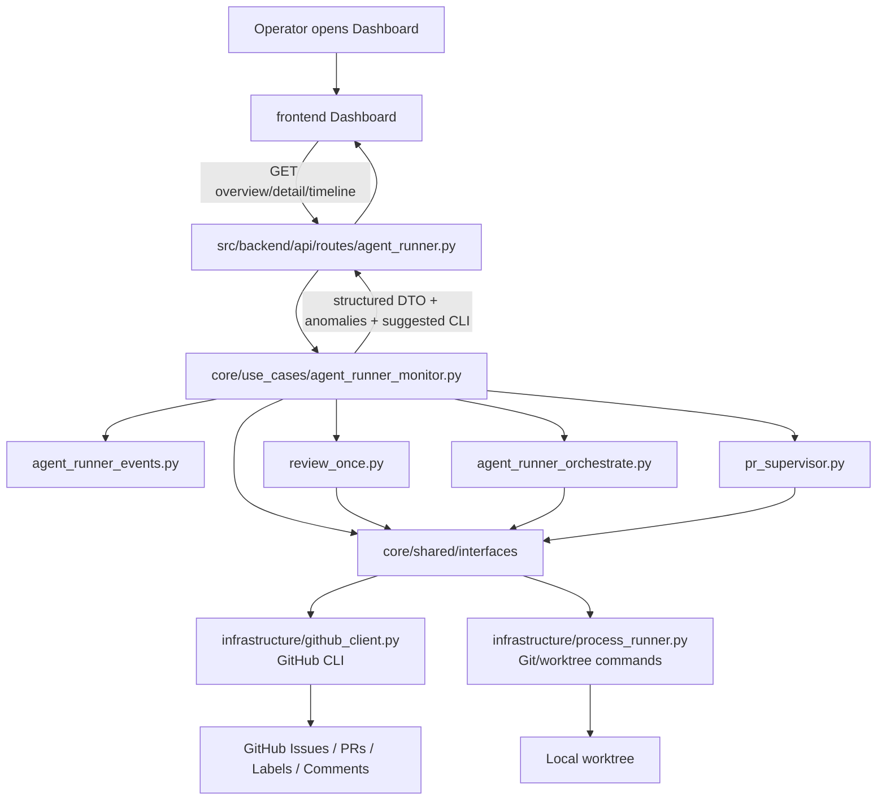
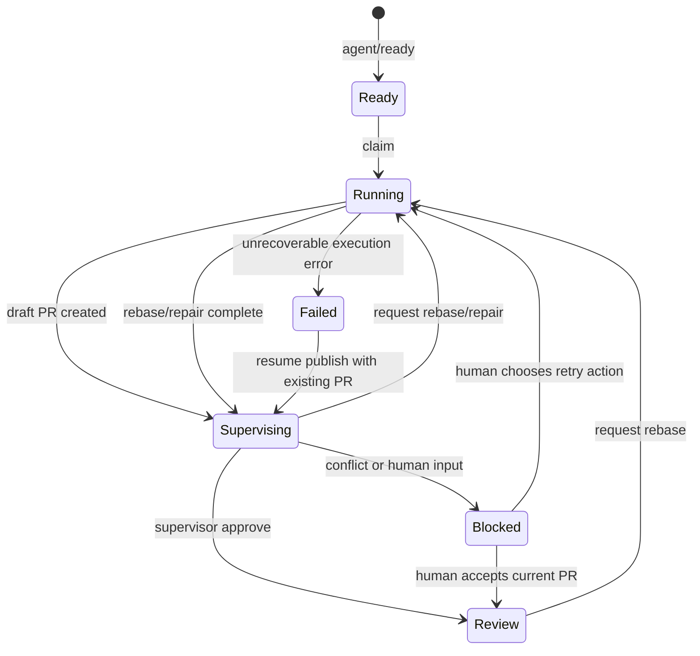

# PRD: Agent Runner Monitoring Dashboard

- GitHub Issue: https://github.com/zata-zhangtao/keda/issues/30

## 1. Introduction & Goals

Agent Runner 已经可以通过 GitHub Issue labels、Issue comments、PR 状态和本地 worktree 串起自动实现、pre-push review、Draft PR 创建、post-PR supervisor、rebase/repair 和失败收尾。但这些状态分散在 GitHub、CLI 输出和本地文件系统中，运维者需要反复执行 CLI 命令、查看 Issue comments、检查 worktree 才能知道当前发生了什么。

近期真实故障暴露了三个问题：

- PR 已创建、pre-push review 已通过，但缺少 `agent/supervising` label 导致 Issue 被错误标记为 `agent/failed`。如果有一个统一的监控面板，这种 label 与 PR 状态不一致的问题可以被一眼发现。
- `review-once` 和 Issue comment 读取存在边缘缺陷，导致 CLI 无法稳定识别 supervising Issue 和 latest `iar:event`。监控面板需要从底层修复这些读取缺陷，才能提供可信的状态展示。
- rebase 冲突包含 PRD 语义决策时，系统进入 `agent/blocked` 状态。运维者需要打开监控面板才能快速看到哪些 Issue 被阻塞、阻塞原因是什么、最近一次事件是什么。

2026-05-27 更新：核心 runner 已完成一部分底层修复，`review-once` 现在能通过当前 GitHub CLI 的 `statusCheckRollup` 获取 PR context，并在 PR 冲突或 failed checks 时阻止 `approve_for_human_review` 直接进入 `agent/review`。本监控面板 PRD 仍保留 `pr_dirty_in_review` 异常检测，因为它仍需要覆盖历史残留状态、人工改 label、外部 PR 状态变化以及后续回归。

本 PRD 的目标是新增一个**只读的 Agent Runner 监控面板**。运维者打开 Web Dashboard 就能看到当前队列状态、事件时间线、健康检查和最近异常。所有恢复操作仍然通过现有 CLI 完成，监控面板不替代 CLI，而是让状态"打开即见"。

可衡量目标：

- Dashboard 首页替换占位内容，展示 Agent Runner 队列状态和仓库健康概览。
- 运维者打开面板即可查看每个 Issue 的 label、关联 PR、merge state、checks、最新 `iar:event`、最近 runner comments 和本地 worktree 状态。
- 后端 API 只读，复用现有 Agent Runner core use cases 和 GitHub/process runner 端口，不新增数据库。
- 监控面板有真实可执行的测试覆盖，确保状态聚合和事件解析的正确性。

## 2. Requirement Shape

- **Actor**：本地 Agent Runner 运维者、任务管理者、需要确认 blocked/rebase 冲突的人类 reviewer。
- **Trigger**：
  - 用户打开 Web Dashboard 查看 Agent Runner 当前状态。
  - Issue 处于 `agent/failed`、`agent/blocked`、`agent/supervising`、`agent/review` 或 `agent/running`。
  - PR 存在 `DIRTY` / conflicted / stale / checks failed / missing supervisor event 等需要人工关注的状态。
- **Expected Behavior**：
  - 页面以仓库为单位展示队列统计、健康检查、最近异常和 Issue 列表。
  - Issue 详情抽屉或详情页展示事件时间线、PR context、worktree status、验证结果摘要和失败详情。
  - 后端只读取 GitHub 和本地 worktree 状态，不执行任何修改操作。
  - 状态不一致时（如 label 与 PR 状态不匹配、worktree dirty 但 label 不是 running），面板高亮显示异常。
  - rebase 冲突或 blocked Issue 在面板中以醒目方式展示，附带最新 event marker 和 comment 摘要。
- **Explicit Scope Boundary**：
  - **只读面板**：不暴露任何修改 GitHub label、comment、PR 或 worktree 的 API。
  - 不新增数据库、后台任务队列、实时 WebSocket 或跨机器 runner 调度。
  - 不改变 Agent Runner 的 durable state source；GitHub labels/comments、PR 状态和本地 worktree 仍是事实来源。
  - 不新增登录/权限系统；沿用现有受保护路由和当前后端部署信任边界。
  - 所有恢复操作（sync labels、run supervisor、request rebase、mark blocked）仍通过现有 CLI 执行。

## 3. Repository Context And Architecture Fit

### Current Relevant Modules And Files

| 路径 | 当前职责 | 与本 PRD 的关系 |
|---|---|---|
| `src/backend/api/routes/agent_runner.py` | 只读 `/agent-runner/status` 和 `/health` API | 扩展为 Agent Runner 监控 API 的入口；只做请求 DTO、调用 use case 和响应组装 |
| `src/backend/core/use_cases/run_agent_once.py` | Git/worktree helper、publish、verification、commit proxy | 复用 `get_current_branch`、`get_head_sha`、`has_changes` 等只读状态检查 |
| `src/backend/core/use_cases/agent_runner_orchestrate.py` | ready/running rework 编排、supervisor loop | 复用状态推导逻辑，用于识别 label 与 PR/worktree 不匹配等异常 |
| `src/backend/core/use_cases/review_once.py` | post-PR review candidate 扫描与 supervisor cycle | 需要修复 candidate 查询和 Issue comment 读取相关 bug，修复后用于监控面板的 Issue 列表和事件解析 |
| `src/backend/core/use_cases/pr_supervisor.py` | supervisor action、rebase、repair、blocked/failed 语义 | 复用 blocked/failed 语义，用于面板中展示异常原因 |
| `src/backend/core/use_cases/agent_runner_events.py` | `iar:event` marker parse/format | 监控面板时间线必须复用该 marker 解析，不手写重复 parser |
| `src/backend/core/shared/interfaces/agent_runner.py` | GitHub/process runner 抽象端口 | 需要扩展或修复 list comments、multi-label candidate query、Issue/PR context 查询接口 |
| `src/backend/infrastructure/github_client.py` | GitHub CLI adapter | 修复 `list_issue_comments` / `list_pr_comments` JSON fields；修复 OR label 查询；实现必要的 Issue/PR context adapter |
| `src/backend/engines/agent_runner/factory.py` | settings 到 core config 转换、client 装配 | 复用 repository target resolution 和 process/github client composition |
| `frontend/src/pages/dashboard-page.tsx` | 当前占位 Dashboard | 替换为 Agent Runner monitoring overview 页面 |
| `frontend/shared/api/client.ts` | 通用 HTTP client | 新增 Agent Runner API wrapper 复用此 client |
| `frontend/shared/api/types.ts` | 当前只有会话类型 TODO | 增加 Agent Runner monitoring DTO 类型 |
| `frontend/src/components/app-sidebar.tsx` | 应用侧边导航 | 更新导航文案，加入 Agent Runner 监控面板入口 |
| `docs/guides/agent-runner.md` | CLI 和状态流转文档 | 同步新增监控面板说明，强调面板只读、操作仍走 CLI |
| `tests/test_agent_runner_api.py` | 只读 API 测试 | 扩展覆盖 monitoring API DTO、事件解析和异常状态 |
| `tests/test_run_agent.py` / `tests/test_pr_supervisor.py` | runner 编排与 supervisor 测试 | 复用现有测试 fixtures 作为 monitoring 测试的 mock 数据来源 |
| `tests/playwright-e2e/` | 独立 Playwright e2e 包 | 增加监控面板 smoke，验证页面能展示 mocked API 数据 |

### Existing Architecture Pattern To Follow

后端遵循：

```text
src/backend/api/ -> src/backend/core/ -> src/backend/engines/ -> src/backend/infrastructure/
```

本功能应保持：

- `src/backend/api/routes/agent_runner.py` 只接收 HTTP 请求并调用 core use cases，不直接写 GitHub/Git 业务规则。
- `src/backend/core/use_cases/` 负责状态诊断、事件聚合、marker 解析和异常检测。
- `src/backend/core/shared/interfaces/` 定义需要的 GitHub/process 端口。
- `src/backend/infrastructure/github_client.py` 只实现 GitHub CLI 适配，不承担 workflow 决策。
- 前端只通过 `/api/v1/agent-runner/*` HTTP API 调用后端，不直接访问本地 Git 或 GitHub CLI。

前端遵循 `docs/architecture/frontend-architecture.md`：

- 页面层负责页面状态和用户交互。
- `frontend/shared/api/` 封装接口调用和类型。
- `src/components/ui/` 复用现有 shadcn 风格基础组件。

### Ownership And Dependency Boundaries

- UI 只显示 GitHub label/comment/PR/worktree 汇总，所有状态推导由后端完成。
- API 只读，不暴露任何修改接口。
- `request_rebase`、`run_supervisor`、`mark_blocked` 等恢复操作仍通过现有 CLI 执行，面板中可显示建议的 CLI 命令文本，但不直接调用执行。

### Runtime, Docs, Tests, And Workflow Constraints

- Python 文本 I/O 使用 `encoding="utf-8"`。
- 公共 Python API 使用 Google Style Docstrings。
- 变量命名避免 `data`、`item`、`res` 这类无语义名称。
- 新增或修改后端代码需要同步 docs 与 API tests。
- 前端新增页面要通过 `just frontend build`。
- 完成实现后必须运行 `just test`；涉及 UI 时补跑 Playwright smoke 或至少 `just frontend build`。
- 本 PRD 仅新增一份长期文档变更时需要检查 `mkdocs.yml`；若只更新现有 `docs/guides/agent-runner.md`，无需新增导航。

## 4. Recommendation

### Recommended Approach

推荐新增"Agent Runner Monitoring Dashboard"，采用最小可行的垂直切片：

1. 修复现有 Agent Runner 观察路径的两个底层缺陷：
   - `GitHubCliClient.list_issue_comments()` / `list_pr_comments()` 必须请求 `--json comments`。
   - review candidate 查询必须支持 "任一 workflow label" 语义，而不是错误地要求同时匹配多个 label。

2. 在 core 层新增 focused use case：
   - `agent_runner_monitor.py` 或等价模块，负责构建 monitoring overview、Issue detail、event timeline 和 anomaly detection。
   - 复用 `agent_runner_events.py` 解析 comments。
   - 复用 existing `review_once` / `agent_runner_orchestrate` / `pr_supervisor` helper 进行状态推导，不复制 workflow state machine。

3. 扩展只读 API：
   - `GET /api/v1/agent-runner/overview` — 仓库健康、队列统计、Issue 摘要、最近异常
   - `GET /api/v1/agent-runner/issues/{issue_number}` — Issue labels、事件时间线、PR context、worktree status、异常检测
   - `GET /api/v1/agent-runner/issues/{issue_number}/timeline` — 纯事件时间线（可选，用于抽屉懒加载）

4. 替换 Dashboard 占位页：
   - 顶部健康/队列统计。
   - Issue 列表按 `ready`、`running`、`supervising`、`review`、`failed`、`blocked` 分组。
   - 右侧或详情区显示事件时间线、PR 状态、worktree 状态、异常提示和建议的 CLI 命令。

5. 保留 CLI 为唯一运维入口：
   - 面板中每个 Issue 详情区域展示当前状态和建议的恢复 CLI 命令文本（如 `iar run-once --max-issues 1`、`iar review-once`），但按钮仅复制命令到剪贴板，不直接执行。

### Why This Fits

- 当前仓库已经有 FastAPI、React Dashboard、Agent Runner API 和 GitHub/process abstraction；扩展这些路径比新增独立监控服务更低风险。
- GitHub labels/comments/PR 状态已经是 durable workflow state，不需要新数据库。
- 只读面板降低了安全风险和测试复杂度，同时解决了"状态不可见"的核心痛点。
- 前端 Dashboard 当前是占位页，替换为真实监控页面符合现有产品方向。
- 运维者打开面板就能看到所有状态，恢复操作仍通过熟悉的 CLI 完成，不改变现有 workflow。

### Rationale For Rejecting Alternative Approaches

| 方案 | 说明 | 拒绝原因 |
|---|---|---|
| 只写 CLI 恢复命令 | 继续通过 `iar` 子命令操作 labels、markers 和 rebase | CLI 对熟悉内部 marker 的维护者可用，但不能解决状态不可见问题 |
| 新增数据库驱动的 dashboard | 把所有 Issue/PR/runner event 同步进本地 DB | 超出当前状态模型；会产生 GitHub 与 DB 双写一致性问题 |
| 暴露通用操作 API | UI 点击按钮，后端执行 action | 用户明确表示只需要监控面板，不需要操作面板；操作仍走 CLI |
| 只在 GitHub Issue 模板中补说明 | 文档化手动 label/comment 操作 | 仍要求人手写 marker，不解决可视化问题 |

## 5. Implementation Guide

This section is a living implementation guide based on current repository analysis. If implementation discovers additional affected files, hidden dependencies, edge cases, or a better path, update this PRD before proceeding.

### Core Logic

#### Monitoring Overview

1. API 调用 `build_agent_runner_overview(...)`。
2. use case 通过 repository target resolution 获取目标仓库列表。
3. 每个仓库收集：
   - config summary：labels、remote、base branch、runner settings。
   - health：`gh --version`、publish remote exists、repo path exists。
   - queue issues：按 workflow labels 查询 open Issues。
   - optional PR summary：从 latest marker 或 known branch 推导 PR branch，再调用 GitHub client 获取 PR context。
   - latest event：调用 `list_issue_comments()` 并用 `parse_latest_event_marker()`。
   - anomalies：检测 label 与 PR/worktree 不匹配的情况（如 PR 已创建但 label 不是 supervising，或 worktree dirty 但 label 不是 running）。
4. 返回前端可直接渲染的结构化 DTO，不返回原始 CLI stdout。

#### Issue Detail

1. 根据 issue number 查询 GitHub Issue summary、labels、comments。
2. 从 comments 生成 event timeline：
   - `claimed`
   - `implementation_complete`
   - `pre_push_review`
   - `draft_pr_created`
   - `post_pr_supervisor`
   - `post_pr_rework_requested`
   - `rebase_repair_complete`
   - failed / blocked comments
3. 从 latest event 或 PR URL 查找关联 PR context。
4. 根据 `config.worktree.path_command` 解析 worktree path，只读取状态：
   - exists / missing
   - current branch
   - head SHA
   - dirty / clean
5. 计算 `anomalies`：
   - PR 已创建但 label 不是 `agent/supervising` / `agent/review` — anomaly type `label_pr_mismatch`
   - worktree dirty 但 label 不是 `agent/running` — anomaly type `dirty_worktree_mismatch`
   - PR mergeable_state dirty/conflicted 但 label 是 `agent/review` — anomaly type `pr_dirty_in_review`
   - latest event phase 与 label 不一致 — anomaly type `event_label_mismatch`
6. 计算 `suggested_cli_commands`：根据当前状态给出建议的 CLI 恢复命令文本列表。

#### Anomaly Detection Rules

```python
ANOMALY_RULES = [
    {
        "type": "label_pr_mismatch",
        "condition": "pr_exists and label not in (supervising, review, blocked, failed)",
        "severity": "warning",
        "message": "PR exists but Issue label does not reflect post-PR state.",
        "suggested_cli": ["iar labels sync", "iar review-once --dry-run"],
    },
    {
        "type": "dirty_worktree_mismatch",
        "condition": "worktree_dirty and label != running",
        "severity": "warning",
        "message": "Worktree has uncommitted changes but Issue is not in running state.",
        "suggested_cli": ["iar run-once --dry-run", "cd {worktree_path} && git status"],
    },
    {
        "type": "pr_dirty_in_review",
        "condition": "pr_mergeable_state in (dirty, conflicted) and label == review",
        "severity": "error",
        "message": "PR is dirty/conflicted while Issue is in review state.",
        "suggested_cli": ["iar review-once", "iar run-once --max-issues 1"],
    },
    {
        "type": "event_label_mismatch",
        "condition": "latest_event.phase implies a different label than current",
        "severity": "warning",
        "message": "Latest event marker suggests a different state than current label.",
        "suggested_cli": ["iar labels sync"],
    },
]
```

### Change Impact Tree

```text
Agent Runner Monitoring Dashboard
├── Backend API
│   ├── routes/agent_runner.py
│   │   ├── overview endpoint
│   │   ├── issue detail endpoint
│   │   └── timeline endpoint (optional)
│   └── request/response DTOs
├── Core use cases
│   ├── agent_runner_monitor.py
│   │   ├── overview aggregation
│   │   ├── issue timeline parsing
│   │   ├── anomaly detection
│   │   └── suggested CLI derivation
│   ├── review_once.py
│   │   └── candidate query fix (OR labels)
│   ├── agent_runner_events.py
│   │   └── marker parse/format (reused)
│   └── pr_supervisor.py
│       └── blocked/failed semantics (reused for anomaly)
├── Infrastructure
│   └── github_client.py
│       ├── correct comment listing
│       ├── OR-label issue query
│       └── PR context lookup hardening
├── Frontend
│   ├── shared/api/agentRunner.ts
│   ├── shared/api/types.ts
│   ├── pages/dashboard-page.tsx
│   ├── components/agent-runner/*
│   └── sidebar navigation
├── Documentation
│   └── docs/guides/agent-runner.md
└── Tests
    ├── backend API/use case tests
    ├── GitHub client adapter tests
    ├── frontend build/typecheck
    └── Playwright smoke
```

### Flow Or Architecture Diagram



### State And Action Flow



### Low-Fidelity Prototype

```text
┌──────────────────────────────────────────────────────────────────────────────┐
│ Agent Runner Monitor                                                         │
├──────────────────────────────────────────────────────────────────────────────┤
│ Health: healthy   Remote: zata   Base: main   Labels: ready   GH: available │
│ Ready 2 | Running 1 | Supervising 3 | Review 4 | Failed 1 | Blocked 1       │
│ ⚠️ 2 anomalies detected                                                      │
├───────────────────────────────┬──────────────────────────────────────────────┤
│ Issue Queue                    │ Issue Detail                                 │
│ ┌ #19  blocked  PR #20 DIRTY ┐ │ #19 Configurable Generated Issue And PR...   │
│ │ latest: rebase_blocked     │ │ Labels: agent/blocked source/prd             │
│ │ ⚠️ pr_dirty_in_review      │ │ PR: #20 draft DIRTY checks passed            │
│ └────────────────────────────┘ │ Worktree: clean branch issue-19              │
│ ┌ #23  supervising PR #24    ┐ │                                              │
│ └────────────────────────────┘ │ Timeline                                     │
│                                │  ✓ implementation_complete                   │
│                                │  ✓ pre_push_review approved                  │
│                                │  ✓ draft_pr_created                          │
│                                │  ✓ post_pr_supervisor approve                │
│                                │  ! rebase_blocked conflict in tasks/...      │
│                                │                                              │
│                                │ Anomalies                                    │
│                                │ ⚠️ label_pr_mismatch: PR #20 exists but      │
│                                │    label is agent/blocked. Consider:         │
│                                │    `iar labels sync`                         │
│                                │                                              │
│                                │ Suggested CLI                                │
│                                │ `iar review-once`  [Copy]                    │
│                                │ `iar run-once --max-issues 1`  [Copy]        │
└───────────────────────────────┴──────────────────────────────────────────────┘
```

UI notes:

- 使用现有图标库，异常用橙色/红色高亮。
- 建议的 CLI 命令旁有复制按钮，不直接执行。
- 不要显示内部 shortcuts 的教学文字；展示可执行状态、异常原因和建议命令。
- 保持页面密集和运维导向，不做营销式 dashboard。

## 6. Realistic Validation Plan

### 6.1 Real Test Scenarios

以下为可独立执行的测试场景，每个场景包含 Given（前置状态）、When（操作）、Then（断言）。所有场景必须使用 Mock，不依赖真实 GitHub 凭证。

#### Scenario 1: Overview Returns Repository Health And Queue Counts

**Given**: Fake repository `zata/keda-test` with config labels `agent/ready`, `agent/running`, `agent/supervising`, `agent/review`, `agent/failed`, `agent/blocked`. Mock `IGitHubClient.list_issues()` returns 3 open Issues:
- #10 labels `["agent/ready", "source/prd"]`
- #11 labels `["agent/supervising", "source/bug"]`
- #12 labels `["agent/failed"]`

Mock `IGitHubClient.list_issue_comments()` for #11 returns two comments:
- `{"body": "<!-- iar:event phase=implementation_complete -->"}`
- `{"body": "<!-- iar:event phase=draft_pr_created pr_number=15 -->"}`

Mock `IProcessRunner.run()` for `gh --version` returns exit 0, for `git remote get-url origin` returns `https://github.com/zata/keda-test.git`.

**When**: `GET /api/v1/agent-runner/overview` is called.

**Then**:
- Response status is 200.
- `repositories[0].health.gh_available` is `true`.
- `repositories[0].queue_counts.ready` is 1.
- `repositories[0].queue_counts.supervising` is 1.
- `repositories[0].queue_counts.failed` is 1.
- `repositories[0].issues` contains #11 with `latest_event.phase` equal to `draft_pr_created` and `latest_event.pr_number` equal to 15.

#### Scenario 2: Issue Detail Parses Full Event Timeline

**Given**: Issue #19 with labels `["agent/blocked", "source/prd"]` and 6 comments in chronological order:
1. `<!-- iar:event phase=claimed -->`
2. `<!-- iar:event phase=implementation_complete -->`
3. `<!-- iar:event phase=pre_push_review status=approved -->`
4. `<!-- iar:event phase=draft_pr_created pr_number=20 -->`
5. `<!-- iar:event phase=post_pr_supervisor status=approve -->`
6. `<!-- iar:event phase=post_pr_rework_requested reason=rebase_conflicts -->`

Mock `IGitHubClient.get_pull_request(20)` returns:
```json
{
  "number": 20,
  "state": "open",
  "draft": true,
  "head": {"ref": "issue-19", "sha": "abc123"},
  "mergeable_state": "dirty"
}
```

Mock `IProcessRunner.run()` for worktree path command returns `/tmp/wt-issue-19`, and subsequent Git commands return:
- `git -C /tmp/wt-issue-19 rev-parse --abbrev-ref HEAD` -> `issue-19`
- `git -C /tmp/wt-issue-19 rev-parse HEAD` -> `abc123`
- `git -C /tmp/wt-issue-19 status --porcelain` -> empty

**When**: `GET /api/v1/agent-runner/issues/19` is called.

**Then**:
- Response status is 200.
- `timeline` has exactly 6 entries, ordered oldest to newest, with phases: `claimed`, `implementation_complete`, `pre_push_review`, `draft_pr_created`, `post_pr_supervisor`, `post_pr_rework_requested`.
- `pr.number` is 20, `pr.draft` is `true`, `pr.mergeable_state` is `dirty`.
- `worktree.exists` is `true`, `worktree.branch` is `issue-19`, `worktree.head_sha` is `abc123`, `worktree.is_clean` is `true`.

#### Scenario 3: Anomaly Detection — Label PR Mismatch

**Given**: Issue #21 with labels `["agent/failed"]` and open PR #22 head `issue-21`. The Issue has a `draft_pr_created` marker in comments.

Mock worktree exists, branch `issue-21`, clean.

**When**: `GET /api/v1/agent-runner/issues/21` is called.

**Then**:
- Response status is 200.
- `anomalies` contains exactly one entry with `type` equal to `label_pr_mismatch`.
- The anomaly `severity` is `warning`.
- The anomaly `message` contains "PR exists but Issue label does not reflect post-PR state".
- `suggested_cli_commands` contains `"iar labels sync"` and `"iar review-once --dry-run"`.

#### Scenario 4: Anomaly Detection — PR Dirty In Review

**Given**: Issue #25 with labels `["agent/review"]` and open PR #26 with `mergeable_state: dirty`.

Mock worktree exists, branch `issue-25`, clean. Latest event is `post_pr_supervisor status=approve`.

**When**: `GET /api/v1/agent-runner/issues/25` is called.

**Then**:
- Response status is 200.
- `anomalies` contains exactly one entry with `type` equal to `pr_dirty_in_review`.
- The anomaly `severity` is `error`.
- `suggested_cli_commands` contains `"iar review-once"`.

#### Scenario 5: Anomaly Detection — Dirty Worktree Mismatch

**Given**: Issue #27 with labels `["agent/supervising"]` and open PR #28. Worktree exists at `/tmp/wt-issue-27` but dirty: `git status --porcelain` returns `M tasks/pending/foo.md`.

**When**: `GET /api/v1/agent-runner/issues/27` is called.

**Then**:
- Response status is 200.
- `anomalies` contains exactly one entry with `type` equal to `dirty_worktree_mismatch`.
- The anomaly `severity` is `warning`.
- The anomaly message references uncommitted changes.

#### Scenario 6: Overview Aggregates Anomaly Count

**Given**: Fake repository with 4 Issues:
- #30 labels `["agent/failed"]`, PR exists -> anomaly `label_pr_mismatch`
- #31 labels `["agent/review"]`, PR dirty -> anomaly `pr_dirty_in_review`
- #32 labels `["agent/supervising"]`, worktree dirty -> anomaly `dirty_worktree_mismatch`
- #33 labels `["agent/running"]`, no PR, worktree clean -> no anomaly

**When**: `GET /api/v1/agent-runner/overview` is called.

**Then**:
- Response status is 200.
- `anomaly_count` is 3.
- `anomaly_summary` contains counts by severity: `warning: 2, error: 1`.
- Issues #30, #31, #32 are flagged with `has_anomaly: true` in the issue list.

#### Scenario 7: GitHub Client Comment Listing Returns Actual Comments

**Given**: A fake GitHub CLI output where `gh issue view 80 --json comments` returns:
```json
{
  "comments": [
    {"body": "First comment", "createdAt": "2026-05-01T00:00:00Z"},
    {"body": "<!-- iar:event phase=claimed -->", "createdAt": "2026-05-02T00:00:00Z"}
  ]
}
```

**When**: `GitHubCliClient.list_issue_comments("zata/keda-test", 80)` is called.

**Then**:
- Returns a list of 2 dicts with keys `body` and `createdAt`.
- The second dict `body` equals `"<!-- iar:event phase=claimed -->"`.
- This test must fail if the implementation still requests `--json body` instead of `--json comments`.

#### Scenario 8: Review Candidate Query Uses OR Label Semantics

**Given**: Fake repository with Issues:
- #90 labels `["agent/supervising", "source/prd"]`
- #91 labels `["agent/review", "source/bug"]`
- #92 labels `["agent/supervising", "agent/review"]` (has both)

Mock `IGitHubClient.list_issues()` with label filter `agent/supervising,agent/review` returns all three Issues when OR semantics are used, and only #92 when AND semantics are used.

**When**: The review candidate query is executed with intended OR semantics.

**Then**:
- The query returns #90, #91, and #92.
- The test explicitly asserts that #90 and #91 are included even though they do not have both labels.

#### Scenario 9: Dashboard Renders Mocked Overview And Highlights Anomalies

**Given**: Playwright intercepts `GET /api/v1/agent-runner/overview` and returns:
```json
{
  "repositories": [{
    "name": "zata/keda-test",
    "health": {"gh_available": true, "repo_path_exists": true},
    "queue_counts": {"ready": 0, "running": 0, "supervising": 1, "review": 0, "failed": 0, "blocked": 0},
    "anomaly_count": 1,
    "anomaly_summary": {"warning": 1, "error": 0},
    "issues": [
      {
        "number": 100,
        "title": "Test Issue",
        "labels": ["agent/supervising"],
        "latest_event": {"phase": "draft_pr_created", "pr_number": 101},
        "has_anomaly": true,
        "anomaly_types": ["dirty_worktree_mismatch"]
      }
    ]
  }]
}
```

**When**: User navigates to `/dashboard`.

**Then**:
- Page shows "Agent Runner Monitor" heading.
- Queue counts show "Supervising 1".
- Anomaly banner shows "1 anomaly" or similar warning indicator.
- Issue list contains "#100 Test Issue" with an anomaly icon/indicator.
- Clicking the Issue row opens detail view showing timeline, anomalies, and suggested CLI commands.

#### Scenario 10: Suggested CLI Commands Are Displayed And Copyable

**Given**: Playwright intercepts `GET /api/v1/agent-runner/issues/110` and returns:
```json
{
  "number": 110,
  "title": "Blocked Issue",
  "labels": ["agent/blocked"],
  "pr": {"number": 111, "draft": false, "mergeable_state": "clean"},
  "worktree": {"exists": true, "branch": "issue-110", "is_clean": true, "head_sha": "xyz"},
  "anomalies": [
    {
      "type": "label_pr_mismatch",
      "severity": "warning",
      "message": "PR exists but Issue label does not reflect post-PR state.",
      "suggested_cli": ["iar labels sync", "iar review-once --dry-run"]
    }
  ],
  "suggested_cli_commands": ["iar labels sync", "iar review-once --dry-run"]
}
```

**When**: User opens Issue #110 detail.

**Then**:
- Anomaly card shows "label_pr_mismatch" with warning severity.
- Suggested CLI commands list contains `"iar labels sync"` and `"iar review-once --dry-run"`.
- Each command旁边有复制按钮或可复制文本。

### 6.2 Test Layer Mapping

| Behavior | Real Entry Point | Test Layer | Mock Boundary | Data/Env Needed | Command Or Procedure | Required For Acceptance |
|---|---|---|---|---|---|---|
| Console overview loads runner status | `GET /api/v1/agent-runner/overview` | backend API test | Mock `IGitHubClient` and `IProcessRunner`; keep API route real | Fake repo context, Issues with labels/comments, PR context | `uv run pytest tests/test_agent_runner_api.py -q` | Yes |
| Issue detail parses event timeline | `GET /api/v1/agent-runner/issues/{issue_number}` | core + API test | Mock GitHub comments and worktree commands | Comments containing all supported `iar:event` phases | `uv run pytest tests/test_agent_runner_api.py tests/test_agent_runner_monitor.py -q` | Yes |
| Anomaly detection flags label/PR mismatch | `GET /api/v1/agent-runner/issues/{issue_number}` | use case/API test | Mock GitHub client; no live GitHub | Issue with PR but wrong label | `uv run pytest tests/test_agent_runner_monitor.py -q` | Yes |
| Anomaly detection flags PR dirty in review | `GET /api/v1/agent-runner/issues/{issue_number}` | use case/API test | Mock GitHub PR context | Issue in review with dirty PR | `uv run pytest tests/test_agent_runner_monitor.py -q` | Yes |
| Overview aggregates anomaly counts | `GET /api/v1/agent-runner/overview` | use case/API test | Mock GitHub client with multiple Issues | Mix of normal and anomalous Issues | `uv run pytest tests/test_agent_runner_monitor.py -q` | Yes |
| Dashboard renders status and anomalies | `frontend` app route `/dashboard` | frontend build + Playwright smoke | Mock API through Playwright route or fixture server; no live GitHub | Mock overview/detail JSON with anomalies | `just frontend build`; `just e2e smoke` when Playwright fixtures are updated | Yes |
| Existing CLI behavior not regressed | `iar labels sync`, `iar review-once`, `iar run-once --dry-run` | existing tests | Existing fake process/GitHub clients | Existing test fixtures | `just test` | Yes |
| Documentation reflects monitoring panel | MkDocs build | docs validation | No external deps | Updated `docs/guides/agent-runner.md` | `uv run mkdocs build --strict` | Yes |

### 6.3 Test Fixtures And Mock Data

#### GitHub Issue Fixture Template

```python
FAKE_ISSUE_10 = {
    "number": 10,
    "title": "Add configurable generated content for GitHub Issues and PRs",
    "body": "## Description\n...",
    "labels": [{"name": "agent/ready"}, {"name": "source/prd"}],
    "state": "open",
    "created_at": "2026-05-20T10:00:00Z",
    "updated_at": "2026-05-20T10:00:00Z",
}
```

#### Event Comment Fixture Template

```python
FAKE_EVENT_COMMENTS = [
    {"body": "<!-- iar:event phase=claimed -->", "createdAt": "2026-05-20T10:05:00Z"},
    {"body": "<!-- iar:event phase=implementation_complete -->", "createdAt": "2026-05-20T10:30:00Z"},
    {"body": "<!-- iar:event phase=pre_push_review status=approved -->", "createdAt": "2026-05-20T11:00:00Z"},
    {"body": "<!-- iar:event phase=draft_pr_created pr_number=15 -->", "createdAt": "2026-05-20T11:30:00Z"},
]
```

#### PR Context Fixture Template

```python
FAKE_PR_15 = {
    "number": 15,
    "title": "feat: add configurable generated content for GitHub Issues and PRs",
    "state": "open",
    "draft": True,
    "head": {"ref": "issue-10", "sha": "a1b2c3d"},
    "base": {"ref": "main"},
    "mergeable_state": "clean",
    "html_url": "https://github.com/zata/keda/pull/15",
}
```

#### Worktree Status Fixture Template

```python
FAKE_WORKTREE_CLEAN = {
    "exists": True,
    "path": "/tmp/wt-issue-10",
    "branch": "issue-10",
    "head_sha": "a1b2c3d",
    "is_clean": True,
    "ahead_behind": "+0 -0",
}

FAKE_WORKTREE_DIRTY = {
    "exists": True,
    "path": "/tmp/wt-issue-20",
    "branch": "issue-20",
    "head_sha": "d4e5f6g",
    "is_clean": False,
    "dirty_files": ["tasks/pending/some-prd.md"],
}
```

#### Anomaly Fixture Template

```python
FAKE_ANOMALY_LABEL_PR_MISMATCH = {
    "type": "label_pr_mismatch",
    "severity": "warning",
    "message": "PR exists but Issue label does not reflect post-PR state.",
    "suggested_cli": ["iar labels sync", "iar review-once --dry-run"],
}

FAKE_ANOMALY_PR_DIRTY_IN_REVIEW = {
    "type": "pr_dirty_in_review",
    "severity": "error",
    "message": "PR is dirty/conflicted while Issue is in review state.",
    "suggested_cli": ["iar review-once", "iar run-once --max-issues 1"],
}
```

### 6.4 Live GitHub Validation (Optional And Manually Gated)

If a maintainer chooses to validate against real GitHub:

1. Create a test Issue in a non-production repository.
2. Run `iar labels sync` to ensure labels exist.
3. Manually add `agent/ready` label to the test Issue.
4. Run `iar run-once --max-issues 1 --dry-run` to verify CLI still functions.
5. Use the UI Dashboard to verify the test Issue appears in the "Ready" queue.
6. Record exact Issue number, PR number, commands used, and cleanup steps in implementation notes.
7. After validation, close the test Issue/PR and remove labels.

Automated tests must never require live GitHub credentials.

### 6.5 Interactive Prototype Change Log

No prototype files are created by this PRD. If implementation later creates files under `docs/prototypes/`, update this section with exact paths and validation screenshots or commands.

### 6.6 External Validation

No web research was used. This PRD is based on repository code, local Agent Runner docs, and the observed GitHub workflow failure.

## 7. Definition Of Done

- Backend exposes structured Agent Runner overview, issue detail and timeline APIs.
- Existing comment listing and review candidate querying bugs are fixed and covered by tests.
- Dashboard displays real Agent Runner operational state instead of placeholder cards。
- 监控面板正确检测并展示异常状态（label/PR mismatch、dirty worktree、PR dirty in review 等）。
- Rebase conflict blocked Issue 在面板中展示冲突文件和最新事件。
- 文档描述监控面板是只读的，恢复操作仍通过 CLI 执行。
- `just frontend build`, affected backend pytest suites, `uv run mkdocs build --strict`, and final `just test` pass.
- No new database, arbitrary shell execution, automatic PR merge, or duplicate workflow state source is introduced.
- No write API endpoint is exposed from the monitoring panel.

## 8. Acceptance Checklist

### Architecture Acceptance

- [x] `src/backend/api/routes/agent_runner.py` remains a thin HTTP adapter and delegates workflow decisions to core use cases.
- [x] New core monitoring logic lives under `src/backend/core/use_cases/` and does not import `backend.infrastructure`.
- [x] Any new GitHub operations are added to `IGitHubClient` before implementation in `GitHubCliClient`.
- [x] Frontend calls only `/api/v1/agent-runner/*` and does not execute GitHub/Git logic directly.
- [x] No database table, migration, background queue, WebSocket service or command-shell endpoint is added.
- [x] No write/modify API endpoint is exposed from the monitoring panel.

### Backend Behavior Acceptance

- [x] `GitHubCliClient.list_issue_comments()` and `list_pr_comments()` request `--json comments` and return actual comment bodies.
- [x] Review candidate listing supports Issues that have any one of `agent/supervising` or `agent/review`, not only Issues that have both.
- [x] `GET /api/v1/agent-runner/overview` returns repository health, queue counts, Issue summaries, latest event markers and anomaly counts.
- [x] `GET /api/v1/agent-runner/issues/{issue_number}` returns labels, PR context, worktree status, event timeline and anomaly list.
- [x] Anomaly `label_pr_mismatch` is detected when PR exists but label is not `supervising`/`review`/`blocked`/`failed`.
- [x] Anomaly `pr_dirty_in_review` is detected when PR mergeable_state is dirty/conflicted and label is `review`.
- [x] Anomaly `dirty_worktree_mismatch` is detected when worktree has uncommitted changes but label is not `running`.
- [x] Anomaly `event_label_mismatch` is detected when latest event phase implies a different state than current label.
- [x] Each anomaly includes `severity` (`warning` or `error`), `message`, and `suggested_cli` list.
- [x] Overview aggregates `anomaly_count` and `anomaly_summary` by severity.

### Frontend Acceptance

- [x] `frontend/src/pages/dashboard-page.tsx` is replaced with an Agent Runner monitoring overview.
- [x] `frontend/shared/api/agentRunner.ts` or equivalent wrapper is added and reuses `frontend/shared/api/client.ts`.
- [x] `frontend/shared/api/types.ts` contains typed DTOs for overview, Issue detail, event timeline, anomaly and monitoring response.
- [x] Sidebar/navigation labels reflect the Agent Runner monitoring panel.
- [x] Issue rows show label state, PR state, checks state, latest event, anomaly indicator and whether worktree state is actionable.
- [x] Issue detail shows a chronological event timeline and recent failed/blocked details.
- [x] Anomalies are visually highlighted (color/icon) with severity distinction.
- [x] Suggested CLI commands are displayed as copyable text, not as executable buttons.
- [x] UI uses existing component conventions and avoids nested cards or marketing-style hero layout.

### Documentation Acceptance

- [x] `docs/guides/agent-runner.md` documents the monitoring panel and its read-only nature.
- [x] Docs explain that the monitoring panel does not execute actions; all recovery operations still use CLI.
- [x] Docs list the anomaly types the panel can detect and what they mean.
- [x] Docs describe why arbitrary shell commands and arbitrary label editing are intentionally out of scope for the panel.
- [x] `mkdocs.yml` is checked; if no new docs page is added, no nav change is required.

### Validation Acceptance

- [x] `uv run pytest tests/test_agent_runner_api.py -q` passes.
- [x] `uv run pytest tests/test_agent_runner_monitor.py -q` or equivalent new focused suite passes.
- [x] `uv run pytest tests/test_pr_supervisor.py tests/test_run_agent.py -q` passes (no regression).
- [x] `just frontend build` passes.
- [x] `uv run mkdocs build --strict` passes.
- [x] `just test` passes after all implementation changes.
- [x] Playwright smoke or equivalent frontend real-route validation covers dashboard rendering with mocked Agent Runner API data including anomalies.

## 9. Functional Requirements

- **FR-1**：系统必须提供 Agent Runner overview API，返回仓库健康、配置摘要、队列统计、Issue 摘要和异常计数。
- **FR-2**：系统必须提供 Issue detail API，返回 labels、latest event、event timeline、PR context、worktree status 和异常列表。
- **FR-3**：系统必须修复 GitHub Issue/PR comment listing，使 event marker 解析基于真实 comments。
- **FR-4**：系统必须修复 review candidate 查询，使 supervising/review label 使用 OR 语义。
- **FR-5**：系统必须检测 `label_pr_mismatch` 异常：PR 已存在但 label 不是 `supervising`/`review`/`blocked`/`failed`。
- **FR-6**：系统必须检测 `pr_dirty_in_review` 异常：PR mergeable_state 为 dirty/conflicted 但 label 是 `review`。
- **FR-7**：系统必须检测 `dirty_worktree_mismatch` 异常：worktree 有未提交更改但 label 不是 `running`。
- **FR-8**：系统必须检测 `event_label_mismatch` 异常：latest event phase 暗示的状态与当前 label 不一致。
- **FR-9**：每个异常必须包含 severity、message 和 suggested_cli 命令列表。
- **FR-10**：前端必须展示 queue overview、Issue list、Issue detail timeline、PR/check/worktree 状态和异常高亮。
- **FR-11**：前端必须根据 backend `anomalies` 展示异常卡片和 severity 颜色区分。
- **FR-12**：建议的 CLI 命令必须以可复制文本形式展示，不得通过按钮直接执行。
- **FR-13**：系统不得暴露任何修改 GitHub label、comment、PR 或 worktree 的 API。
- **FR-14**：文档必须说明监控面板是只读的，恢复操作仍通过 CLI 执行。

## 10. Non-Goals

- 不实现自动解决 rebase conflict 的 AI repair。
- 不新增数据库、持久化事件表或 workflow state mirror。
- 不实现跨机器 runner 调度、任务锁或实时 worker 管理。
- 不实现 WebSocket/SSE 实时日志流。
- 不支持从 UI 执行任意 shell 命令或自定义 GitHub CLI 命令。
- 不支持从 UI 直接修改 label、comment、PR 状态。
- 不支持任意 label 编辑器。
- 不支持自动 merge PR。
- 不重新设计登录权限系统。
- 不要求自动化测试使用真实 GitHub 凭证。

## 11. Risks And Follow-Ups

- **State consistency risk**：GitHub labels/comments 和本地 worktree 可能短暂不一致。监控面板应显示最近读取时间，帮助运维者判断数据新鲜度。
- **Read performance risk**：overview 需要查询所有 queue Issues 的 comments 和 PR context，可能较慢。首版可以同步读取；若实际超时，再考虑缓存或分页。
- **Existing CLI bug risk**：如果 comment/list query 修复不完整，监控面板会展示错误状态。必须先以 tests 固化这两个 bug 的修复。
- **Conflict semantics risk**：PRD 或业务文件冲突可能不能自动判断。监控面板应保守标记为 blocked，并在异常中说明原因。

## 12. Decision Log

| 日期 | 决策 | 理由 | 状态 |
|---|---|---|---|
| 2026-05-24 | 在现有 Dashboard 中建设 Agent Runner Monitoring Dashboard | 前端 Dashboard 目前是占位页，复用现有 FastAPI + React 路径最小化新增复杂度 | Accepted |
| 2026-05-24 | 不新增数据库，继续以 GitHub labels/comments/PR 和本地 worktree 为事实来源 | 避免双写一致性问题，符合现有 Agent Runner 状态模型 | Accepted |
| 2026-05-24 | 监控面板只读，所有恢复操作仍通过现有 CLI 执行 | 用户明确表示需要监控面板而非操作面板；只读设计降低安全风险和实现复杂度 | Accepted |
| 2026-05-24 | rebase conflict 默认进入 blocked 并要求人类确认 | 冲突可能包含 PRD/业务语义，自动选择一边会丢失需求或交付证据 | Accepted |
| 2026-05-24 | 先修复 comment listing 与 OR-label candidate query，再建设 UI | 监控面板的可信度依赖底层状态读取正确性 | Accepted |
| 2026-05-24 | 面板中展示建议 CLI 命令文本（可复制），但不直接执行 | 帮助运维者快速找到恢复命令，同时保持操作审计在 CLI 层 | Accepted |
