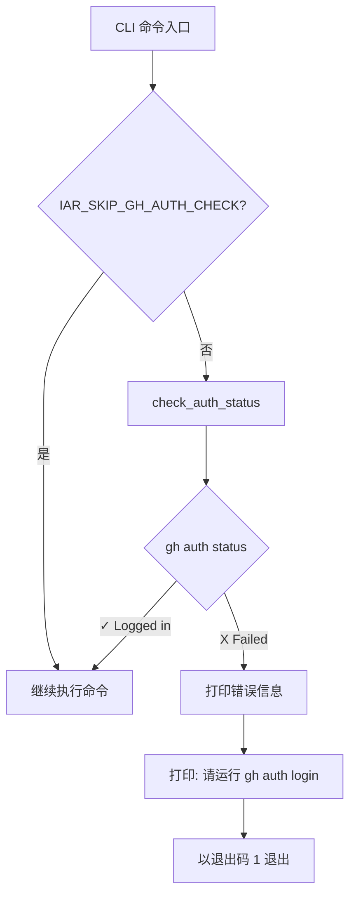

# PRD: GitHub CLI 认证自动检测与用户提示

- GitHub Issue: https://github.com/zata-zhangtao/keda/issues/40

## 1. 引言与目标

**问题：** 当 `gh` CLI 的 token 过期或不存在时，`iar` 命令会抛出原始的 `CalledProcessError` 异常，暴露内部 subprocess 细节，而不是引导用户修复问题。

**目标：** 在执行 GitHub 操作前自动检测 `gh` 认证状态，如果失效则提示用户运行 `gh auth login`，给出清晰指引。

**可衡量目标：**
- 消除 `gh` 认证失败时的原始异常暴露
- 提供可操作的修复指引（具体命令）
- 保持脚本/CI 场景的非交互行为（环境变量覆盖）

---

## 2. 需求形态

| 方面 | 值 |
|------|------|
| **参与者** | 运行 `iar` CLI 命令的开发者 |
| **触发条件** | 任何需要 `gh` CLI 的 `iar` 命令（labels sync、issue 创建、daemon 等） |
| **前置条件** | `gh` CLI 已安装但 token 缺失、过期或无效 |
| **预期行为** | 检测认证失败，打印友好错误信息，提示运行 `gh auth login`，以退出码 1 退出 |
| **范围边界** | 仅处理 `gh` CLI 认证；不涉及 `git` SSH/HTTPS 认证或其他 CLI 工具 |

---

## 3. 仓库上下文与架构适配

### 当前相关模块/文件

| 文件 | 角色 |
|------|------|
| `src/backend/infrastructure/github_client.py` | 封装所有 `gh` CLI 命令；无认证检查 |
| `src/backend/infrastructure/process_runner.py` | `SubprocessRunner.run()` 执行命令并抛出 `CalledProcessError` |
| `src/backend/api/cli.py` | CLI 入口点；已有交互式提示模式 |
| `src/backend/engines/agent_runner/factory.py` | `create_github_client()` 创建 `GitHubCliClient` 实例 |

### 需遵循的现有架构模式

1. **基础设施层：** 在 `GitHubCliClient` 新增 `check_auth_status()` 方法
2. **API 层：** 在 `cli.py` 中调用认证检查
3. **交互提示：** 遵循现有 `_prompt_and_publish_prd_if_needed()` 模式，使用 `print()` + `input()`

### 所有权与依赖边界

```
api/cli.py (调用) → infrastructure/github_client.py (实现 gh 封装)
```

- `cli.py` 负责用户交互和错误展示
- `github_client.py` 负责 `gh` 命令执行和认证状态检测
- 不修改 `core/` 层（这是基础设施/CLI 层的关注点）

### 约束条件

- 必须遵循四层依赖方向：`api/ → core/ → engines/ → infrastructure/`
- 不能添加新依赖
- 必须保留现有 `check=False` 行为用于可选操作
- 必须支持非交互模式用于 CI/脚本（环境变量）

---

## 4. 推荐方案

### 推荐方案

**在 CLI 入口点、GitHub 客户端使用前添加认证检查。**

1. 在 `GitHubCliClient` 新增 `check_auth_status()` 方法，运行 `gh auth status` 并解析结果
2. 在 `cli.py` 新增 `ensure_gh_auth_or_prompt()` 辅助函数：
   - 调用 `check_auth_status()`
   - 失败时：打印友好错误信息，提示运行 `gh auth login`，以退出码 1 退出
3. 在每个使用 `gh` 的 CLI 命令开始处调用 `ensure_gh_auth_or_prompt()`
4. 支持 `IAR_SKIP_GH_AUTH_CHECK=1` 环境变量用于非交互/CI 场景

### 为何是最佳适配

- **最小改动：** 扩展现有 `GitHubCliClient` 和 `cli.py` 模式
- **无新抽象：** 复用现有 subprocess runner 和提示模式
- **单一职责：** 认证检查隔离在一个方法中
- **向后兼容：** 认证有效时现有行为不变

### 已考虑的替代方案

| 替代方案 | 拒绝原因 |
|----------|----------|
| 在每个 `gh` 命令外包裹 try/except 并检测认证错误 | 脆弱；错误信息可能变化；每个方法都增加复杂度 |
| 在 `SubprocessRunner` 添加认证检查 | 错误层级；并非所有 subprocess 命令都需要 `gh` 认证 |
| 创建新的 `GhAuthChecker` 类 | 过度工程化；单一方法已足够 |

---

## 5. 实现指南

本节是基于当前仓库分析的实时实现指南。如果实现过程中发现额外受影响文件、隐藏依赖、边界情况或更优路径，请在继续前更新本 PRD。

### 核心逻辑

```
CLI 命令入口
    ↓
ensure_gh_auth_or_prompt()
    ↓
GitHubCliClient.check_auth_status()
    ↓ (执行: gh auth status 2>&1)
    ↓
解析输出：
  - "✓ Logged in" → 返回 True
  - "X Failed to log in" / "token...invalid" → 返回 False 及原因
    ↓
若未认证：
  - 打印错误信息及原因
  - 打印："请运行: gh auth login -h github.com"
  - 以退出码 1 退出
```

### 变更影响树

```text
.
├── src/backend/infrastructure/
│   └── github_client.py
│       [修改]
│       【总结】新增 check_auth_status() 方法检测 gh 认证状态
│
│       ├── 新增 GhAuthStatus 数据类（authenticated, account, failure_reason）
│       └── 新增 check_auth_status() 方法，运行 gh auth status 并解析输出
│
├── src/backend/api/
│   └── cli.py
│       [修改]
│       【总结】在执行 gh 命令前调用认证检查，失败时提示用户登录
│
│       ├── 新增 _ensure_gh_auth_or_prompt() 辅助函数
│       ├── 在 labels、issue-from-prd、run-once、daemon、review-* 命令入口调用检查
│       └── 支持 IAR_SKIP_GH_AUTH_CHECK 环境变量跳过检查
│
├── tests/
│   └── test_gh_auth_check.py
│       [新增]
│       【总结】测试认证状态检测和用户提示逻辑
│
│       ├── test_check_auth_status_authenticated()
│       ├── test_check_auth_status_token_invalid()
│       ├── test_check_auth_status_not_logged_in()
│       └── test_ensure_gh_auth_or_prompt_exits_on_failure()
```

### 流程图



### 真实验证计划

| 行为 | 真实入口点 | 测试层级 | Mock 边界 | 数据/环境需求 | 命令或过程 | 验收必需 |
|------|------------|----------|-----------|---------------|------------|----------|
| gh 已认证时检查通过 | `iar labels sync` | 集成测试 | 无 | 有效 gh 认证 | `uv run iar labels sync --repo /path/to/repo` | 是 |
| token 无效时检查失败并提示 | `iar labels sync` | 单元测试 | `SubprocessRunner` 返回认证失败输出 | 无 | `pytest tests/test_gh_auth_check.py` | 是 |
| 环境变量设置时跳过检查 | `IAR_SKIP_GH_AUTH_CHECK=1 iar labels sync` | 集成测试 | 无 | 无效 gh 认证 + 环境变量 | `IAR_SKIP_GH_AUTH_CHECK=1 uv run iar labels sync` | 是 |
| 所有使用 gh 的命令集成认证检查 | `iar run-once`, `iar daemon` 等 | 单元测试 | `FakeGitHubClient` | 无 | `pytest tests/test_gh_auth_check.py` | 是 |

### ER 图

本 PRD 无数据模型变更。

### 交互原型变更日志

本 PRD 无交互原型文件变更。

### 外部验证

无需外部验证；仓库证据已充分。

---

## 6. 完成定义

- [x] 实现通过所有单元和集成测试
- [x] `just test` 通过，无回归
- [x] 通过 `iar labels sync` 真实验证：无效认证时显示友好提示
- [x] 若 CLI 行为变更，更新 `docs/` 文档
- [x] 未引入新依赖
- [x] 架构边界受尊重（api → infrastructure，无 core 变更）

---

## 7. 验收清单

### 架构验收

- [x] `check_auth_status()` 方法添加到 `src/backend/infrastructure/github_client.py` 的 `GitHubCliClient`
- [x] `_ensure_gh_auth_or_prompt()` 辅助函数添加到 `src/backend/api/cli.py`
- [x] 无 `src/backend/core/` 层变更
- [x] `pyproject.toml` 无新依赖

### 依赖验收

- [x] `GhAuthStatus` 数据类定义在 `github_client.py`（非新文件）
- [x] 认证检查使用现有 `SubprocessRunner` 基础设施

### 行为验收

- [x] 当 `gh auth status` 显示 "✓ Logged in" 时，命令正常继续
- [x] 当 `gh auth status` 显示 "X Failed to log in" 时，CLI 打印错误并提示用户
- [x] 错误信息包含："请运行: gh auth login -h github.com"
- [x] 认证失败时 CLI 以退出码 1 退出
- [x] `IAR_SKIP_GH_AUTH_CHECK=1` 环境变量跳过认证检查
- [x] 认证检查在以下命令前执行：`labels sync`、`issue-from-prd`、`run-once`、`daemon`、`review-once`、`review-daemon`

### 文档验收

- [x] 若 CLI 使用方式变更，更新 `docs/`（可选，仅当存在面向用户的文档时）

### 验证验收

- [x] `tests/test_gh_auth_check.py` 单元测试覆盖认证状态解析
- [x] 集成测试验证 `iar labels sync` 在 mock 认证失败时的行为
- [x] `just test` 通过，无回归

---

## 8. 功能需求

### FR-1: 认证状态检测

系统应提供方法检测 GitHub CLI 认证状态，通过执行 `gh auth status` 并解析其输出。

### FR-2: 认证失败时友好错误

认证失败时，系统应打印清晰错误信息，包括：
- 失败原因（从 `gh auth status` 输出解析）
- 修复命令：`gh auth login -h github.com`

### FR-3: 非交互模式支持

系统应支持环境变量 `IAR_SKIP_GH_AUTH_CHECK=1` 以跳过认证检查，用于非交互/CI 环境。

### FR-4: 认证失败退出码

交互模式下认证失败时，系统应在打印错误信息后以退出码 1 退出。

### FR-5: 命令前置认证检查

系统应在执行任何需要 GitHub API 的 CLI 命令前检查认证：`labels sync`、`issue-from-prd`、`run-once`、`daemon`、`review-once`、`review-daemon`。

---

## 9. 非目标

- **不**处理 `git` 认证（SSH 密钥、HTTPS 凭证）
- **不**处理其他 CLI 工具认证（如 `codex`、`claude`、`kimi`）
- **不**自动运行 `gh auth login`（用户需手动执行）
- **不**在命令间缓存认证状态（每次检查）
- **不**在 `deliberate` 命令添加认证检查（不使用 `gh`）

---

## 10. 风险与后续

| 风险 | 缓解措施 |
|------|----------|
| `gh auth status` 输出格式可能在未来 gh 版本中变化 | 健壮解析输出；解析失败时回退到通用错误信息 |
| 用户可能认证了多个 gh 主机 | 默认仅检查 `github.com`；后续可扩展支持多主机 |

---

## 11. 决策日志

| ID | 问题 | 选择 | 拒绝 | 理由 |
|----|------|------|------|------|
| D-01 | 认证检查实现位置？ | `GitHubCliClient.check_auth_status()` + `cli.py` 辅助函数 | 在每个 gh 命令外包裹 try/except | 单一检查点更清晰；避免在每个方法中脆弱地检测错误信息 |
| D-02 | 如何处理非交互模式？ | 环境变量 `IAR_SKIP_GH_AUTH_CHECK=1` | 命令行参数 `--skip-auth-check` | 环境变量更适合 CI 脚本，与现有模式一致 |
| D-03 | 是否自动运行 `gh auth login`？ | 否，仅打印指引 | 是，派生交互式子进程 | 自动运行会在非 TTY 环境挂起；用户控制更安全 |
