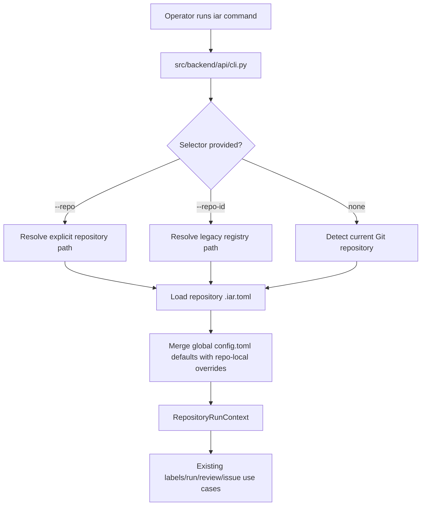

# PRD: IAR 仓库本地初始化与配置

## 1. 背景与目标

当前 `iar run-once` 在没有传入 `--repo` 或 `--repo-id` 时，会从 `keda/config.toml` 解析目标仓库。这样会让命令表现成多仓库 runner：即使操作者当前站在某一个仓库目录下，也可能因为 keda 的集中配置而执行另一个仓库，例如 TransMaster。

本需求目标是让目标仓库的归属关系变得明确，并把仓库自身配置放回仓库本地：

- 新增 `iar init`，用于在目标仓库中创建 `.iar.toml`。
- 让 `iar run-once`、`iar labels sync`、`iar review-once` 和 `iar issue-from-prd` 优先使用当前仓库或显式指定仓库中的本地配置。
- 不再要求 `keda/config.toml` 保存每个目标仓库的详细 runner 配置。
- 保留多仓库 daemon 或批量操作能力，但该能力必须通过显式 selector 或轻量本机 registry 触发，而不是由 keda 的集中仓库配置隐式触发。

### 真实测试 Checklist

本 PRD 的实现不能只依赖 mock 层单元测试，必须至少覆盖以下真实入口或真实运行边界：

- [x] 通过 `uv run iar init --dry-run` 验证 CLI 真实入口能生成 `.iar.toml` 内容，且不写文件。
- [x] 通过临时 Git 仓库验证 `uv run iar init` 的真实文件写入、已有文件保护和 `--force` 覆盖行为。
- [x] 通过 `uv run iar run-once --dry-run` 验证 no-selector 命令会选择当前仓库本地配置，而不是 `keda/config.toml` 中的其他 enabled repositories。
- [x] 通过 `uv run iar run-once --repo <path> --dry-run` 验证显式仓库路径会加载目标仓库的 `.iar.toml`。
- [x] 通过 `uv run mkdocs build` 验证文档变更可以被真实文档构建入口消费。
- [x] 实现完成后必须运行 `just test`，作为本 PRD 完成前的最终回归门禁。

## 2. 需求形态

- **Actor**: 在目标仓库或 keda 仓库中运行 `iar` CLI 的开发者或 operator。
- **Trigger**: operator 执行 `iar init`、`iar run-once`、`iar labels sync`、`iar review-once`、`iar review-daemon`、`iar daemon` 或 `iar issue-from-prd`。
- **Expected behavior**:
  - `iar init` 在当前 Git 仓库中创建非敏感的 `.iar.toml`。
  - 单仓库命令在没有 `--repo` 或 `--repo-id` 时，解析当前 Git 仓库并加载它的 `.iar.toml`。
  - 单仓库命令在传入 `--repo /path/to/repo` 时，加载该仓库中的 `.iar.toml`。
  - `--repo-id` 只解析已配置 registry entry，再加载解析后仓库路径中的本地配置。
  - 多仓库行为必须显式触发，不应该因为无关目标仓库被写在 `keda/config.toml` 中就静默处理所有 enabled 仓库。
- **Explicit scope boundary**:
  - 本 PRD 只覆盖本地 CLI 配置行为。
  - 本 PRD 不改变 GitHub Issue 状态流转、Agent 执行、PR 发布或 supervisor 逻辑；唯一变化是这些流程如何解析目标仓库配置。

## 3. 仓库上下文与架构适配

当前相关模块和文件：

- `src/backend/api/cli.py` 负责解析 CLI 命令并分发 use case。
- `src/backend/engines/agent_runner/factory.py` 负责把 `AgentRunnerSettings` 转换为 core `AppConfig`，合并仓库级 overrides，并解析 repository targets。
- `src/backend/infrastructure/config/settings.py` 负责从环境变量和 `config.toml` 加载全局配置。
- `src/backend/core/shared/models/agent_runner.py` 持有不可变 core config dataclasses 和 `RepositoryRunContext`。
- `tests/test_agent_runner_cli.py` 覆盖 CLI 解析和 dispatch 行为。
- `tests/test_agent_runner_config.py` 覆盖仓库目标解析和配置合并。
- `docs/guides/agent-runner.md` 记录 operator 行为和多仓库用法。
- `README.md` 包含 `iar` CLI 快速开始。

需要遵循的既有架构模式：

- CLI 参数解析留在 `src/backend/api/cli.py`。
- 配置解析和物理文件读取不进入 `core/`；仓库本地 TOML 属于 infrastructure/config 关注点。
- 转换和解析逻辑可以继续放在 `src/backend/engines/agent_runner/factory.py`，该模块已经承担把 infrastructure settings 转换为 core run contexts 的桥接职责。
- use case 继续接收 `RepositoryRunContext` 和 `AppConfig`；use case 不应该感知 `.iar.toml` 文件路径。

所有权与依赖边界：

- `api/` 可以调用既有 factory 函数，但不直接解析 TOML。
- `core/` 必须继续独立于 TOML、文件系统发现、Git 探测和 pydantic settings。
- `engines/agent_runner/factory.py` 可以协调 infrastructure config objects 与 process runner helpers，产出 core models。
- `infrastructure/config/settings.py` 可以使用 `tomllib` 和文件系统读取；写入文本文件时必须显式使用 `encoding="utf-8"`。

运行时、文档、测试和工作流约束：

- Python 项目优先使用 `uv` 和 `just`。
- 实现完成后必须运行 `just test`。
- 公共 Python API 需要 Google Style docstrings。
- CLI 行为或配置变化必须同步更新文档。
- 既有 `config.toml` 仓库配置不应无迁移路径地直接破坏；但它的角色应降级为兼容或显式 registry 行为。

## 4. 推荐方案

### Recommended Approach

新增仓库本地 IAR 配置，并把 `.iar.toml` 作为默认文件名和目标仓库配置主来源。

推荐目标格式：

```toml
# .iar.toml
[agent_runner.repository]
id = "transmaster"
enabled = true
display_name = "TransMaster"

[agent_runner.git]
remote = "origin"
base_branch = "main"

[agent_runner.runner]
verification_commands = [
  "git diff --check",
]
```

把 `iar init` 实现为 CLI 子命令，用于在当前 Git 仓库中写入该文件。该命令应：

- 探测当前 Git 仓库根目录；
- 默认从 GitHub remote 仓库名或目录名推导 repository id；
- 默认从目录名推导 display name；
- 默认 remote 优先取当前 upstream remote，其次取 `origin`，最后取第一个已配置 remote；
- 默认 base branch 优先取 `origin/HEAD`，其次取 `main`、`master`，最后回退到当前分支；
- 当 `.iar.toml` 已存在时拒绝覆盖，除非传入 `--force`；
- 支持 `--dry-run`，只打印生成的 TOML，不写文件；
- 支持 `--id`、`--display-name`、`--remote`、`--base-branch` 覆盖默认探测结果。

调整仓库目标解析逻辑：

- `--repo /path` 返回该路径的单个 context，并合并全局默认值和 `/path/.iar.toml`。
- 单仓库命令无 selector 时解析当前 Git 仓库，并合并它的 `.iar.toml`。
- `--repo-id` 解析已配置 registry entry，然后合并目标路径中的 `.iar.toml`。
- 保留 legacy `[agent_runner.repositories.<id>]` 作为显式 registry 兼容路径，但 no-selector 命令应优先使用当前仓库行为，而不是默认处理“所有 enabled 配置仓库”。
- 多仓库 daemon 或批量行为应要求显式多仓库 selector，例如 `--all`，或显式使用 registry。

为什么该方案最适合当前架构：

- 扩展既有 config 和 target resolution 路径，不新增平行 runner。
- 保持物理配置加载不进入 `core/`。
- 保持 `RepositoryRunContext` 作为 use-case 边界，因此 Agent 编排和发布路径不需要变化。
- 让默认 CLI 行为符合 operator 的位置直觉：当前 Git 仓库就是默认目标。

拒绝重复抽象的原因：

- 不需要新增持久化数据库、服务或 registry daemon，因为所需状态只是非敏感静态本地配置。
- 不需要复杂中央 registry 格式；单仓库操作不需要它，而且它会保留本需求要解决的误跑问题。
- 继续把 `keda/config.toml` 中的 target repositories 作为主配置源，会让目标仓库行为继续耦合到 keda 工作树。

### Alternatives Considered

| 备选方案 | 拒绝原因 |
|---|---|
| 继续只使用 `keda/config.toml` 的 `[agent_runner.repositories.*]`，并加强 `--repo-id` 文档 | 仅靠文档无法修复不安全默认行为：当前目录可能和实际执行目标仓库不一致。 |
| 在每个目标仓库中复用 `config.toml` | 很多项目已有自己的 `config.toml`，`.iar.toml` 可以避免污染目标项目应用配置。 |
| 要求每次命令都必须传 `--repo` | 足够显式但太繁琐；`iar init` 加当前仓库默认行为更安全也更顺手。 |
| 新增全局数据库或 registry 服务 | 状态只是静态本地配置，服务会增加运维复杂度，收益不足。 |

## 5. 实现指南

This section is a living implementation guide based on current repository analysis. If implementation discovers additional affected files, hidden dependencies, edge cases, or a better path, update this PRD before proceeding.

### Core Logic

1. 新增仓库本地 settings model，支持从 `.iar.toml` 读取 `[agent_runner.repository]`、`[agent_runner.git]`、`[agent_runner.runner]`、`[agent_runner.labels]`、`[agent_runner.worktree]`、`[agent_runner.safety]`、`[agent_runner.prompts]`、`[agent_runner.pre_push_review]`、`[agent_runner.post_pr_supervisor]` 和 `[agent_runner.generated_content]`。
2. 新增 infrastructure helper，用于从仓库根目录查找并加载 `.iar.toml`。
3. 新增仓库根目录探测 helper，通过 `SubprocessRunner` 或聚焦的本地 helper 调用 Git 命令。
4. 在 `api/cli.py` 中新增 `iar init` parser 和 dispatch。
5. 新增 init use case 或 factory helper，根据探测到的 repository metadata 和用户 overrides 生成 `.iar.toml` 内容。
6. 更新 repository target resolution：
   - 当前目录和 `--repo` 路径加载本地 `.iar.toml`；
   - 配置仓库 entry 被视为 registry/path selector，并可以和本地 `.iar.toml` 合并；
   - `run-once`、`labels sync`、`review-once` 和 `issue-from-prd` 的 no-selector 默认行为优先使用当前仓库。
7. 更新 daemon 和多仓库命令，使多目标行为必须显式触发。若为兼容保留现有默认行为，必须输出清晰 warning，说明 implicit all-enabled 行为已废弃，并记录新的 selector。
8. 更新文档和测试，把 `.iar.toml` 作为目标仓库配置主路径。

### Change Impact Tree

```text
.
├── src/backend/infrastructure/config/
│   └── settings.py
│       [修改]
│       【总结】新增 repository-local IAR TOML 模型与加载入口，保留全局 runner 设置加载职责
│
│       ├── 新增 `.iar.toml` section 解析能力
│       ├── 新增 repository metadata settings，例如 id/display_name/enabled
│       └── 保持现有 `config.toml` 全局设置兼容
│
├── src/backend/engines/agent_runner/
│   └── factory.py
│       [修改]
│       【总结】让仓库目标解析合并当前或指定仓库的 `.iar.toml`，并生成 init 默认配置
│
│       ├── 新增 repo-local config merge path
│       ├── 调整 no-selector 解析为当前 Git repository
│       ├── 将 legacy configured repositories 降级为 registry/compat selector
│       └── 暴露 `iar init` 所需的检测与生成辅助函数
│
├── src/backend/api/
│   └── cli.py
│       [修改]
│       【总结】新增 `iar init` 子命令并调整单仓库命令的目标解析调用
│
│       ├── 新增 `init` parser
│       ├── 支持 `--dry-run`、`--force`、`--id`、`--display-name`、`--remote`、`--base-branch`
│       └── 为 multi-repo 命令增加显式 selector 或兼容提示
│
├── tests/
│   ├── test_agent_runner_cli.py
│   │   [修改]
│   │   【总结】覆盖 `iar init` 参数解析、已有 selector 兼容和冲突校验
│   │
│   ├── test_agent_runner_config.py
│   │   [修改]
│   │   【总结】覆盖 `.iar.toml` 加载、合并优先级、当前仓库默认解析和 legacy registry 兼容
│   │
│   └── test_agent_runner_init.py
│       [新增]
│       【总结】验证 init 生成内容、dry-run、force 保护和 Git metadata fallback
│
├── docs/
│   └── guides/agent-runner.md
│       [修改]
│       【总结】把 `.iar.toml` 和 `iar init` 作为目标仓库配置主路径，并记录迁移方式
│
└── README.md
    [修改]
    【总结】更新 `iar` 快速开始，避免暗示默认命令会处理所有启用仓库
```

### Flow Or Architecture Diagram



### Realistic Validation Plan

| 行为 | 真实入口 | 测试层级 | Mock 边界 | 数据/环境要求 | 命令或流程 | 是否验收必需 |
|---|---|---|---|---|---|---|
| `iar init` 在当前仓库写入 `.iar.toml` | `uv run iar init` | CLI smoke/integration | 可 mock 或使用 sandbox Git remotes；真实临时 Git 仓库文件系统 | 带本地 remote metadata 的临时 Git 仓库 | `uv run pytest tests/test_agent_runner_init.py -q`，必要时手动执行 `tmpdir && git init && uv run iar init --dry-run` | 是 |
| `.iar.toml` 已存在时受保护，除非传 `--force` | `uv run iar init` | Integration | 真实临时文件系统，Git metadata 可 mock | 已存在 `.iar.toml` 的临时 Git 仓库 | `uv run pytest tests/test_agent_runner_init.py -q` | 是 |
| `run-once` 无 selector 时使用当前仓库本地配置 | `uv run iar run-once --dry-run` | Integration-style CLI/use-case test | Mock GitHub client 和 Agent 执行；真实 target resolution 与 TOML parsing | 带 `.iar.toml` 和 fake issue client 的临时 Git 仓库 | `uv run pytest tests/test_agent_runner_config.py tests/test_agent_runner_cli.py -q` | 是 |
| `--repo /path` 加载指定仓库的 `.iar.toml` | `uv run iar run-once --repo <path> --dry-run` | Integration-style CLI/use-case test | Mock GitHub client 和 Agent 执行；真实文件系统配置 | 多个 remote/base branch 不同的临时 Git 仓库 | `uv run pytest tests/test_agent_runner_config.py -q` | 是 |
| legacy `[agent_runner.repositories.*]` 仍可作为显式 registry selection 使用 | `uv run iar run-once --repo-id <id> --dry-run` | Unit/integration | Mock 外部 GitHub 和 Agent 调用 | 带 legacy repository entry 和可选目标 `.iar.toml` 的 settings fixture | `uv run pytest tests/test_agent_runner_config.py tests/test_agent_runner_cli.py -q` | 是 |
| 文档能随新 CLI 行为构建 | MkDocs build | Docs validation | 无 | 更新后的 `docs/guides/agent-runner.md` 和 README | `uv run mkdocs build` | 是 |
| 全量回归门禁通过 | Project test command | Full test | 使用项目既有 mocks | 正常本地开发环境 | `just test` | 是 |

### Low-Fidelity Prototype

不需要 UI 原型；本变更只涉及 CLI 与配置行为。

### ER Diagram

本 PRD 不涉及数据模型变化。

### Interactive Prototype Change Log

本 PRD 不涉及 interactive prototype 文件变化。

### External Validation

不需要外部验证；仓库内证据足够支撑本 PRD。

### Implementation Validation Log

| 命令或流程 | 结果 |
|---|---|
| `just lint --reuse` | Passed：复制检测、架构检查、规范一致性和文件长度检查通过。 |
| `SKIP=check-test-flag just lint --full` | Passed：pre-commit full lint 通过。 |
| `uv run pytest tests/test_agent_runner_config.py tests/test_agent_runner_cli.py tests/test_agent_runner_init.py -q` | Passed：39 tests。 |
| `uv run iar init --dry-run` | Passed：打印 `.iar.toml` 内容，未写入 keda 根目录。 |
| 临时 Git 仓库内执行 `uv run --project /Users/zata/code/keda iar init` / 再次执行 / `--force` | Passed：首次写入成功，已有文件保护返回非零且文件未变，`--force` 覆盖成功。 |
| 临时 Git 仓库内配 fake `gh` 执行 `uv run --project /Users/zata/code/keda iar run-once --dry-run` | Passed：fake `gh` 日志显示 cwd 为当前仓库，label 来自当前仓库 `.iar.toml`。 |
| 从 keda cwd 配 fake `gh` 执行 `uv run --project /Users/zata/code/keda iar run-once --repo <temp-repo> --dry-run` | Passed：fake `gh` 日志显示 cwd 为显式仓库，label 来自显式仓库 `.iar.toml`。 |
| `uv run mkdocs build` | Passed：文档站点构建成功。 |
| `just test` | Passed：最终回归门禁通过。 |

## 6. 完成定义

- `iar init` 已实现并完成文档化。
- `.iar.toml` 可以被生成，能防止误覆盖，并能被解析回仓库本地 settings。
- 单仓库命令在无 selector 时默认使用当前仓库本地配置。
- `--repo` 和 `--repo-id` 行为确定，并有测试覆盖。
- legacy central repository entries 有明确兼容路径，且不再作为当前目录单仓库操作的意外默认目标。
- 文档和 README 示例与实际 CLI 行为一致。
- 实现完成后 `just test` 通过。

## 7. Acceptance Checklist

### Architecture Acceptance

- [x] `.iar.toml` 文件读取逻辑实现在 `src/backend/core/` 之外。
- [x] `src/backend/core/` 继续只接收 `RepositoryRunContext` 和 `AppConfig`，不依赖 TOML、文件系统或 pydantic-settings。
- [x] `src/backend/api/cli.py` 只解析 CLI options，并把配置解析和 init 生成委托给既有 factory 或 use-case helpers。
- [x] 不为静态本地配置引入新的长期运行服务、数据库或后台 registry。

### Behavior Acceptance

- [x] 在 Git 仓库中运行 `uv run iar init --dry-run` 会打印合法 `.iar.toml` 内容，且不会创建文件。
- [x] 在 Git 仓库中运行 `uv run iar init` 会创建包含 `[agent_runner.repository]`、`[agent_runner.git]` 和 `[agent_runner.runner]` 的 `.iar.toml`。
- [x] 当 `.iar.toml` 已存在时运行 `uv run iar init` 会非零退出，并保持文件不变。
- [x] `uv run iar init --force` 可以替换已有 `.iar.toml`。
- [x] 在带 `.iar.toml` 的仓库中运行 `uv run iar run-once --dry-run` 会使用该仓库作为目标。
- [x] 运行 `uv run iar run-once --repo /path/to/repo --dry-run` 会使用 `/path/to/repo/.iar.toml`。
- [x] 运行 `uv run iar run-once --repo-id <id> --dry-run` 仍支持 configured registry entries，并在存在目标 `.iar.toml` 时合并该配置。
- [x] no-selector `run-once` 不再因为 `keda/config.toml` 中存在 enabled repositories 而静默优先处理它们。

### Dependency Acceptance

- [x] 复用或扩展既有 `merge_repository_config(...)` 行为，而不是复制每个配置 section 的合并逻辑。
- [x] repository-local settings 尽量复用既有 `AgentRunner*Settings` models。
- [x] 新增文本文件写入时显式使用 `encoding="utf-8"`。
- [x] `.iar.toml` 不写入 secrets、tokens 或账号凭据。

### Documentation Acceptance

- [x] `docs/guides/agent-runner.md` 记录 `iar init`、`.iar.toml`、当前仓库默认行为和 legacy registry 兼容路径。
- [x] `README.md` quickstart 在 `run-once` 前展示 `iar init`。
- [x] 若长期配置指导发生变化，已同步更新 `docs/`；若新增导航页面，已更新 `mkdocs.yml`。

### Validation Acceptance

- [x] `uv run pytest tests/test_agent_runner_config.py tests/test_agent_runner_cli.py tests/test_agent_runner_init.py -q` 通过。
- [x] `uv run mkdocs build` 通过。
- [x] 在本 PRD 标记完成前，`just test` 通过。

## 8. 功能需求

**FR-1**: CLI 必须支持 `iar init`。

**FR-2**: `iar init` 默认必须把 `.iar.toml` 写入当前 Git 仓库根目录。

**FR-3**: `iar init --dry-run` 必须打印生成的 TOML，且不写入文件。

**FR-4**: 当 `.iar.toml` 已存在时，`iar init` 必须拒绝覆盖，除非传入 `--force`。

**FR-5**: `iar init` 必须支持 `--id`、`--display-name`、`--remote` 和 `--base-branch` overrides。

**FR-6**: 生成的 `.iar.toml` 必须只包含非敏感 repository runner settings。

**FR-7**: repository-local config 必须支持 git、runner、labels、worktree、safety、prompts、pre-push review、post-PR supervisor 和 generated-content overrides，并尽量使用既有 config model shape。

**FR-8**: `run-once` 在没有 `--repo` 或 `--repo-id` 时必须优先使用当前 Git 仓库，并在存在 `.iar.toml` 时加载它。

**FR-9**: `labels sync`、`review-once` 和 `issue-from-prd` 在无 selector 时必须和 `run-once` 使用相同的当前仓库默认行为。

**FR-10**: `--repo /path/to/repo` 必须从指定路径加载 repository-local config。

**FR-11**: `--repo-id <id>` 必须继续支持 configured registry entries，并在解析后的仓库存在 `.iar.toml` 时合并该配置。

**FR-12**: legacy `[agent_runner.repositories.*]` central config 必须继续作为显式选择或显式多仓库模式的兼容路径。

**FR-13**: no-selector 单仓库命令不得因为某个仓库列在 `keda/config.toml` 中且 enabled，就意外处理不同于当前仓库的目标。

**FR-14**: 缺失 Git 仓库、无效 `.iar.toml`、repository-local config disabled、selector 冲突等错误必须可操作，并包含受影响路径或 selector。

**FR-15**: 文档必须包含从 central repository config 迁移到 `.iar.toml` 的示例。

## 9. 非目标

- 不改变 GitHub label 名称、Issue lifecycle states、PR publishing 行为或 supervisor review 语义。
- 不把 secrets 写入 `.iar.toml`。
- 不为了仓库发现引入数据库、daemon registry service 或网络发现机制。
- 不移除 `--repo` 或 `--repo-id`。
- 不要求每个目标仓库都使用 Python、`uv` 或 `just`；验证命令仍由仓库自行配置。
- 不实现仓库配置 UI。

## 10. 风险与后续事项

- 现有 operator 可能依赖 no-selector 命令处理所有 enabled repositories。应通过文档、清晰兼容路径，以及可选的 deprecation warning 或显式 `--all` selector 缓解。
- 目标仓库可能已经存在无关 `.iar.toml`。init 命令必须保护已有文件并给出清晰错误。
- Git metadata 探测在无 remote、detached HEAD 或非 `origin` remote 的仓库中可能不同。init 命令必须有确定性 fallback，并允许显式 overrides。
- 如果多仓库 registry 后续迁移到用户级文件，例如 `~/.config/iar/repositories.toml`，实现前应先在本 PRD 中补充该文件格式。

## 11. 决策记录

| ID | 决策 | 选择 | 拒绝 | 理由 |
|---|---|---|---|---|
| D-01 | repository-local config 文件名 | `.iar.toml` | 目标仓库 `config.toml` | `.iar.toml` 避免和目标项目自己的应用配置冲突。 |
| D-02 | 初始化入口 | `iar init` 子命令 | 把 init 做成 `run-once` 的 flag | 初始化是带文件写入和覆盖策略的独立 setup 行为，应使用显式命令。 |
| D-03 | 单仓库默认目标 | 当前 Git 仓库及其本地配置 | `keda/config.toml` 中所有 enabled repositories | 当前仓库默认行为符合 operator 位置直觉，并能避免误跑无关仓库。 |
| D-04 | central repository config 角色 | 显式选择或显式多仓库模式的兼容 registry | 继续作为目标仓库细节主来源 | 目标仓库行为应随目标仓库一起 review 和变更。 |
| D-05 | 存储机制 | 静态本地 TOML 文件 | 数据库或 registry daemon | 所需状态只是非敏感本地配置，不需要 runtime persistence infrastructure。 |
