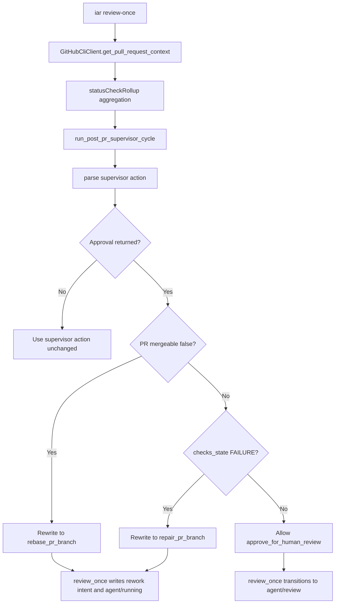

# PRD: Agent Runner PR Context Approval Gate

## 1. Introduction & Goals

`iar review-once` 在 post-PR 阶段依赖 GitHub PR context 判断是否需要 rebase、repair 或进入人工 review。真实 keda Issue #28 / PR #32 暴露了一个安全缺口：本机 GitHub CLI 不支持 `statusCheckRollupState` 字段，导致 `GitHubCliClient.get_pull_request_context(...)` 返回 `None`，`review-once` fallback 只保留 PR URL，丢失 `mergeable=CONFLICTING`。随后 supervisor 返回 `approve_for_human_review`，Issue 被放回 `agent/review`，而不是进入 rebase/conflict-resolution 流程。

本 PRD 记录并约束一个已完成的最小修复切片：

1. 使用当前 GitHub CLI 支持的 `statusCheckRollup` 读取 PR checks。
2. 将 GitHub PR `mergeable` enum 归一为 core 可判断的 `bool | None`。
3. 聚合 PR checks 为稳定的 `SUCCESS`、`PENDING`、`FAILURE` 或 `None`，并携带 failed/pending checks 摘要。
4. 在 supervisor action 后增加 deterministic approval gate：冲突 PR 不得进入 `agent/review`，failed checks PR 不得进入 `agent/review`。
5. 同步测试、文档和相关 pending PRD 进度说明。

### Realistic Validation

除单元测试和集成测试外，本 PRD 要求通过**真实项目入口点或真实外部边界**验证关键行为，确保真实使用路径生效，而非仅在隔离 fixture 中通过。

- [x] **真实 GitHub CLI adapter 验证**：通过 `uv run python - <<'PY' ... GitHubCliClient(Path('.')).get_pull_request_context('issue-28') ... PY` 验证当前本机 `gh` 可读取 PR #32，并返回 `mergeable=False`。
- [x] **review-once gate 单元/用例验证**：通过 `uv run pytest tests/test_github_client.py tests/test_pr_supervisor.py tests/test_review_once.py tests/test_run_agent.py -q` 验证 unsupported field 不再出现，failed checks 和 conflict approval 不会进入 `agent/review`。
- [x] **全仓回归验证**：通过 `just test` 验证 lint、架构检查、PRD checklist 检查和 335 个测试全部通过。
- [x] **为什么不直接运行 live `iar review-once`**：真实 `iar review-once` 会修改 GitHub Issue labels/comments 并可能调用 agent；本切片用真实 `gh` adapter 验证外部字段兼容，用 mocked core tests 验证状态机 gate，避免对 live Issue 产生额外副作用。

## 2. Requirement Shape

**Actor**：运行 `iar review-once` / `iar review-daemon` 监督 post-PR 工作流的本地 operator。

**Trigger**：

- Issue 处于 `agent/supervising` 或 `agent/review`。
- 关联 PR 存在 open branch。
- PR 当前 `mergeable` 为 `CONFLICTING`，或 PR checks rollup 包含失败项。
- supervisor 仍返回 `approve_for_human_review`。

**Expected Behavior**：

- GitHub CLI adapter 能在当前本机 `gh` 版本下成功读取 PR context。
- PR 冲突时，approval 被改写为 `rebase_pr_branch`，后续 `run-once` 消费 rework marker 并走现有 `execute_rebase(...)`，冲突时进入已有 conflict-resolution loop。
- PR checks failure 时，approval 被改写为 `repair_pr_branch`，后续 `run-once` 走 existing PR branch repair。
- 无 CI/check rollup 的仓库仍允许 approval，不被误阻断。
- 文档和 pending PRD 状态反映本切片已落地，但更大的 workflow label exclusivity / marker-history 工作仍留在原 pending PRD 中。

**Explicit Scope Boundary**：

- 不新增 GitHub API 客户端、数据库、队列、webhook 或后台服务。
- 不实现完整 workflow label transition helper。
- 不实现 pending rework marker history scanner。
- 不运行 live `iar review-once` 修改真实 GitHub Issue。
- 不归档 `tasks/pending/20260527-093356-prd-agent-runner-ci-rework-state-recovery.md`，因为该 PRD 仍有未完成范围。

## 3. Repository Context And Architecture Fit

### Current Relevant Modules And Files

| Path | Current Role | Change Relationship |
|---|---|---|
| `src/backend/infrastructure/github_client.py` | GitHub CLI adapter | 修复 PR context JSON fields、mergeable enum 归一和 checks rollup 聚合 |
| `src/backend/core/shared/models/agent_runner.py` | Core dataclasses | 扩展 `PullRequestContext` 增加 `checks_summary` |
| `src/backend/core/use_cases/pr_supervisor.py` | post-PR supervisor prompt、action parse、repair/rebase 执行 | 增加 approval gate，并将 checks summary 放进 prompt/comment 语义 |
| `src/backend/core/use_cases/review_once.py` | review polling 单次处理 | 复用 approval gate，防止 polling 路径绕过 core supervisor gate |
| `docs/guides/agent-runner.md` | Agent Runner operator 文档 | 记录 checks 聚合和 approval gate |
| `tests/test_github_client.py` | GitHub CLI adapter tests | 覆盖 `statusCheckRollup` 字段、empty rollup、conflicting mergeable |
| `tests/test_pr_supervisor.py` | supervisor action tests | 覆盖 conflict / failed checks approval gate |
| `tests/test_review_once.py` | review-once tests | 覆盖 conflicting PR approval 不进入 `agent/review` |
| `tasks/pending/20260527-093356-prd-agent-runner-ci-rework-state-recovery.md` | 更大范围 pending PRD | 更新 Implementation Progress 和已完成 acceptance items |
| `tasks/pending/20260524-162356-prd-agent-runner-operations-console.md` | 监控面板 pending PRD | 记录底层 runner 已降低 `pr_dirty_in_review` 新增概率 |

### Existing Path

最接近本需求的现有路径是：

```text
GitHubCliClient.get_pull_request_context(...)
  -> review_once._process_review_candidate(...)
  -> pr_supervisor.run_post_pr_supervisor_cycle(...)
  -> SupervisorActionResult
  -> review_once label/comment transition
  -> run-once existing rework path
```

### Reuse Candidates

- 复用 `IGitHubClient.get_pull_request_context(...)` 作为唯一 PR context boundary。
- 复用 `PullRequestContext`，只增加 `checks_summary` 字段，不新增 parallel DTO。
- 复用 `SupervisorActionResult`，不新增 public action 名称。
- 复用现有 `repair_pr_branch` / `rebase_pr_branch` actions，让后续 `run-once` 继续走已有 repair/rebase/conflict-resolution executor。
- 复用现有 tests fixture `FakeGitHubClient` / `FakeProcessRunner`。

### Architecture Constraints

- `src/backend/core/` 不得导入 `src/backend/infrastructure/`、`src/backend/engines/` 或 `src/backend/api/`。
- GitHub CLI JSON shape 适配只能留在 `src/backend/infrastructure/github_client.py`。
- workflow 决策和 deterministic gate 必须在 `src/backend/core/use_cases/`。
- CLI/API 层不承担 PR context 字段解析或 supervisor action 改写。

### Potential Redundancy Risks

- 若新增独立 PR analyzer，会复制 `GitHubCliClient.get_pull_request_context(...)` 的职责。
- 若只修改 supervisor prompt，不增加 core gate，仍会受 agent 非确定性输出影响。
- 若把 conflict handling 直接塞进 `review_once`，会绕过已有 `run-once` rework 和 `execute_rebase(...)` 安全校验。

## 4. Recommendation

### Recommended Approach

采用最小修复路径：

1. 在 `GitHubCliClient.get_pull_request_context(...)` 中将查询字段从 `statusCheckRollupState` 改为 `statusCheckRollup`。
2. 在 infrastructure adapter 内聚合 rollup entries，输出稳定 `checks_state` 和 `checks_summary`。
3. 在 `PullRequestContext` 中增加 `checks_summary: tuple[str, ...] = ()`。
4. 在 `pr_supervisor.py` 新增 `guard_supervisor_action_for_pr_state(...)`：
   - `mergeable is False` 且 action 为 approval 时，改写为 `rebase_pr_branch`。
   - `checks_state == "FAILURE"` 且 action 为 approval 时，改写为 `repair_pr_branch`。
5. 在 `run_post_pr_supervisor_cycle(...)` 和 `review_once._process_review_candidate(...)` 后应用同一个 gate。
6. 补充测试和 operator 文档。

### Why This Is The Best Fit

- 只扩展现有 PR context path，不新增外部集成边界。
- deterministic gate 放在 core use case，能覆盖所有 agent 输出，不依赖 prompt 自律。
- action 改写使用已有 `repair_pr_branch` / `rebase_pr_branch`，后续执行仍由已有安全路径负责。
- 变更范围小，适合在更大的 `Agent Runner CI Rework State Recovery` PRD 完成前先封住 live 风险。

### Rationale For Rejecting Redundant Abstractions

- 拒绝新增 `PullRequestCheck` domain model：当前只需要 summary 和聚合状态，字段级 domain object 会增加维护成本。
- 拒绝新增 `resolve_conflict` direct path：冲突处理已经在 `execute_rebase(...)` 中通过 rebase failure 进入 agent conflict-resolution loop。
- 拒绝新增 live `review-once` fixture 作为本切片阻塞项：真实命令会修改 GitHub Issue；更完整 CLI smoke 已由 pending PRD 继续跟踪。

### Alternatives Considered

| Alternative | Why Rejected |
|---|---|
| 只改 prompt，要求 supervisor 不 approve conflicting/failed PR | agent 输出不可预测，真实事故已经证明 prompt-only 不可靠 |
| 在 `review_once` 里直接运行 rebase/conflict resolution | 会绕过 `run-once` rework guard、branch/HEAD 校验和 commit proxy 边界 |
| 等完整 workflow label helper 一起实现 | live PR 已经处于 `CONFLICTING + agent/review`，需要先用最小 gate 阻止继续误批准 |

## 5. Implementation Guide

This section is a living implementation guide based on current repository analysis. If implementation discovers additional affected files, hidden dependencies, edge cases, or a better path, update this PRD before proceeding.

### Core Logic

#### GitHub CLI PR Context Adapter

Search anchors:

```bash
rg -n "statusCheckRollupState|statusCheckRollup|get_pull_request_context|PullRequestContext" src tests
```

Required behavior:

- `get_pull_request_context(...)` requests `url,headRefName,headRefOid,baseRefOid,mergeable,statusCheckRollup`.
- `mergeable` supports current GitHub CLI enum strings such as `MERGEABLE` and `CONFLICTING`.
- `statusCheckRollup` supports list-style CheckRun and StatusContext entries.
- Empty rollup returns `checks_state is None`.
- Any failed conclusion/state returns `checks_state == "FAILURE"` and includes check name in `checks_summary`.
- Pending statuses return `checks_state == "PENDING"`.

#### Supervisor Approval Gate

Search anchors:

```bash
rg -n "approve_for_human_review|run_post_pr_supervisor_cycle|_process_review_candidate|guard_supervisor_action_for_pr_state" src tests
```

Required behavior:

- `guard_supervisor_action_for_pr_state(...)` leaves non-approval actions unchanged.
- `mergeable is False` approval becomes `rebase_pr_branch`.
- `checks_state == "FAILURE"` approval becomes `repair_pr_branch`.
- `review_once` applies the same gate after calling `run_post_pr_supervisor_cycle(...)`, so tests or future refactors cannot bypass it accidentally.

### Change Impact Tree

```text
.
├── Infrastructure
│   └── src/backend/infrastructure/github_client.py
│       [修改]
│       【总结】适配当前 GitHub CLI 的 PR context JSON shape，并聚合 checks / mergeable 状态。
│
│       ├── statusCheckRollupState -> statusCheckRollup
│       ├── normalize mergeable enum strings into bool | None
│       ├── aggregate CheckRun / StatusContext rollup entries
│       └── populate PullRequestContext.checks_summary
│
├── Domain
│   ├── src/backend/core/shared/models/agent_runner.py
│   │   [修改]
│   │   【总结】为 PR context 增加 failed/pending checks 摘要字段。
│   │
│   │   └── add checks_summary default tuple field
│   │
│   └── src/backend/core/use_cases/pr_supervisor.py
│       [修改]
│       【总结】增加 deterministic approval gate，阻止冲突或 failed-check PR 进入人工 review。
│
│       ├── include checks summary in supervisor prompt
│       ├── add guard_supervisor_action_for_pr_state
│       └── apply gate after parsing supervisor action
│
├── Domain
│   └── src/backend/core/use_cases/review_once.py
│       [修改]
│       【总结】在 review polling 路径复用 supervisor approval gate。
│
│       └── apply guard before label/comment transition
│
├── Tests
│   ├── tests/test_github_client.py
│   │   [修改]
│   │   【总结】覆盖当前 GitHub CLI rollup 字段、conflicting mergeable 和 empty rollup。
│   │
│   ├── tests/test_pr_supervisor.py
│   │   [修改]
│   │   【总结】覆盖 conflict 与 failed-check approval action rewrite。
│   │
│   └── tests/test_review_once.py
│       [修改]
│       【总结】覆盖 review-once 遇到 conflicting PR approval 时进入 rework 而非 review。
│
├── Docs
│   └── docs/guides/agent-runner.md
│       [修改]
│       【总结】记录 checks 聚合和 approval gate operator 语义。
│
└── Tasks
    ├── tasks/pending/20260527-093356-prd-agent-runner-ci-rework-state-recovery.md
    │   [修改]
    │   【总结】记录本切片已完成范围并保留未完成大范围任务。
    │
    └── tasks/pending/20260524-162356-prd-agent-runner-operations-console.md
        [修改]
        【总结】说明底层 runner 修复已降低但未消除 pr_dirty_in_review 监控需求。
```

### Executor Drift Guard

- Run `rg -n "statusCheckRollupState" .` and confirm no runtime query path still uses the unsupported field.
- Run `rg -n "approve_for_human_review" src/backend/core/use_cases tests` and inspect any newly added approval transition path for gate coverage.
- If future code introduces a different PR context model, ensure `checks_summary` or equivalent check detail still reaches supervisor prompt and gate summary.
- If `gh` changes rollup JSON shape again, update `_extract_rollup_entries(...)` with fixture tests before changing core logic.

### Flow Diagram



### Realistic Validation Plan

| Behavior | Real Entry Point | Test Layer | Mock Boundary | Data/Env Needed | Command Or Procedure | Required For Acceptance |
|---|---|---|---|---|---|---|
| Current `gh` PR context field compatibility | Python entry using real `GitHubCliClient` and real `gh` process | live adapter sanity | No mock; real GitHub CLI and current repository auth | Open PR branch `issue-28` in keda | `uv run python - <<'PY'\nfrom pathlib import Path\nfrom backend.infrastructure.github_client import GitHubCliClient\nctx = GitHubCliClient(Path('.')).get_pull_request_context('issue-28')\nprint(ctx)\nassert ctx is not None\nassert ctx.mergeable is False\nPY` | Yes |
| Rollup aggregation and approval gate | pytest through core and infrastructure test suites | unit/integration | GitHub CLI stdout and agent output mocked at repository boundary | JSON fixtures for CheckRun, StatusContext, empty rollup; fake supervisor approval | `uv run pytest tests/test_github_client.py tests/test_pr_supervisor.py tests/test_review_once.py tests/test_run_agent.py -q` | Yes |
| Full repository regression | Repository test entry | full local regression | Existing test fakes only; no live external writes | Local Python/uv/just environment | `just test` | Yes |
| Operator docs build | MkDocs build | docs build | No external dependencies beyond local docs toolchain | Local docs tree | `uv run mkdocs build` | Yes |
| Optional live `iar review-once` mutation check | CLI command against live GitHub Issue | manual/sandbox | No mock; writes live labels/comments and may invoke agent | Disposable Issue/PR only; operator opt-in | `IAR_LIVE_GITHUB_VALIDATION=1 uv run iar review-once --max-issues 1` against disposable repo | No |

Failure triage:

- If the live adapter sanity fails with `Unknown JSON field`, inspect `GitHubCliClient.get_pull_request_context(...)` and `gh pr list --json` available fields.
- If approval gate tests fail, inspect `guard_supervisor_action_for_pr_state(...)` before changing label transitions.
- If `just test` fails in PRD checks, inspect changed files under `tasks/pending/` and `tasks/archive/` before touching runtime code.

### Low-Fidelity Prototype

No UI or multi-step human interaction changes in this PRD.

### ER Diagram

No data model changes in this PRD.

### Interactive Prototype Change Log

No interactive prototype file changes in this PRD.

### External Validation

No external validation required; repository evidence and local GitHub CLI behavior were sufficient.

## 6. Definition Of Done

- Runtime code uses `statusCheckRollup`, not `statusCheckRollupState`.
- `PullRequestContext` carries checks summary without introducing a new parallel model.
- Conflicting PR approval is deterministically rewritten to `rebase_pr_branch`.
- Failed-check approval is deterministically rewritten to `repair_pr_branch`.
- `review_once` uses the same gate as `run_post_pr_supervisor_cycle`.
- Targeted pytest, `uv run mkdocs build`, and `just test` pass.
- Related pending PRDs clearly distinguish this completed slice from their remaining scope.

## 7. Acceptance Checklist

### Architecture Acceptance

- [x] `src/backend/api/cli.py` remains unchanged and does not gain workflow decision logic.
- [x] GitHub CLI JSON shape handling stays in `src/backend/infrastructure/github_client.py`.
- [x] Deterministic approval gate logic lives in `src/backend/core/use_cases/pr_supervisor.py`.
- [x] No new database, queue, webhook, service, API route, or background worker is introduced.

### Dependency Acceptance

- [x] `src/backend/core/` does not import `backend.infrastructure`, `backend.engines`, or `backend.api`.
- [x] `GitHubCliClient` continues to satisfy the existing `IGitHubClient.get_pull_request_context(...)` boundary by duck typing.
- [x] Tests use existing fake clients/runners rather than adding new integration infrastructure.

### Behavior Acceptance

- [x] `GitHubCliClient.get_pull_request_context(...)` queries `statusCheckRollup`, not `statusCheckRollupState`.
- [x] `mergeable="CONFLICTING"` produces `PullRequestContext.mergeable is False`.
- [x] A failed CheckRun rollup produces `checks_state == "FAILURE"` and includes the failed check name in `checks_summary`.
- [x] Empty `statusCheckRollup` produces `checks_state is None` and does not block approval.
- [x] `approve_for_human_review` is rewritten to `rebase_pr_branch` when `pr_context.mergeable is False`.
- [x] `approve_for_human_review` is rewritten to `repair_pr_branch` when `pr_context.checks_state == "FAILURE"`.
- [x] `review_once` does not transition a conflicting PR approval into `agent/review`.

### Documentation Acceptance

- [x] `docs/guides/agent-runner.md` documents `statusCheckRollup` aggregation.
- [x] `docs/guides/agent-runner.md` documents conflict and failed-check approval gates.
- [x] `tasks/pending/20260527-093356-prd-agent-runner-ci-rework-state-recovery.md` records this completed slice while leaving broader unchecked scope pending.
- [x] `tasks/pending/20260524-162356-prd-agent-runner-operations-console.md` explains why `pr_dirty_in_review` monitoring remains relevant.

### Validation Acceptance

- [x] `uv run pytest tests/test_github_client.py tests/test_pr_supervisor.py tests/test_review_once.py tests/test_run_agent.py -q` passes.
- [x] `uv run mkdocs build` passes.
- [x] `just test` passes.
- [x] Real GitHub CLI adapter sanity confirms `issue-28` PR context returns `mergeable=False`.

## 8. Functional Requirements

**FR-1**: `GitHubCliClient.get_pull_request_context(...)` must query `statusCheckRollup`, not `statusCheckRollupState`.

**FR-2**: `GitHubCliClient.get_pull_request_context(...)` must return `None` only when PR lookup fails or no open PR exists, not because an unsupported optional JSON field was requested.

**FR-3**: PR `mergeable` enum values from GitHub CLI must be normalized into `True`, `False`, or `None`.

**FR-4**: PR checks rollup must aggregate failed entries into `checks_state == "FAILURE"`.

**FR-5**: PR checks rollup must aggregate active queued/in-progress/pending entries into `checks_state == "PENDING"`.

**FR-6**: Empty or missing checks rollup must produce `checks_state is None`.

**FR-7**: Failed or pending checks must be summarized in `PullRequestContext.checks_summary`.

**FR-8**: Supervisor prompt must include `checks_summary` when available.

**FR-9**: A supervisor approval for `mergeable is False` must be rewritten to `rebase_pr_branch`.

**FR-10**: A supervisor approval for `checks_state == "FAILURE"` must be rewritten to `repair_pr_branch`.

**FR-11**: Non-approval supervisor actions must pass through unchanged.

**FR-12**: `review_once` must apply the same deterministic gate before label/comment transitions.

**FR-13**: The implementation must reuse existing rework actions and must not introduce a new conflict action protocol.

## 9. Non-Goals

- Do not implement workflow label exclusivity helper in this PRD.
- Do not implement marker-history scanning for stale approval comments in this PRD.
- Do not implement monitoring dashboard APIs or UI in this PRD.
- Do not modify live GitHub Issue state as part of required validation.
- Do not add a GitHub SDK dependency or replace GitHub CLI usage.
- Do not change `execute_rebase(...)` conflict-resolution loop semantics.

## 10. Risks And Follow-Ups

- `statusCheckRollup` JSON shape may vary across GitHub CLI versions; fixture tests cover known CheckRun and StatusContext forms, but future changes should update adapter tests first.
- Pending checks are currently documented as aggregation output, but this slice does not introduce a separate waiting state; broader pending-check behavior remains in `tasks/pending/20260527-093356-prd-agent-runner-ci-rework-state-recovery.md`.
- Workflow label exclusivity is still incomplete in the broader runner; mixed historical labels can still require the pending helper work.
- Live `iar review-once` validation remains opt-in because it writes GitHub state and may invoke agents.

## 11. Decision Log

| ID | Decision | Chosen | Rejected | Rationale |
|---|---|---|---|---|
| D-01 | GitHub checks source | Use `statusCheckRollup` in `GitHubCliClient` | Keep `statusCheckRollupState` | The local GitHub CLI exposes `statusCheckRollup` and rejects `statusCheckRollupState`, which caused PR context loss. |
| D-02 | Approval enforcement location | Add deterministic core gate in `pr_supervisor.py` | Prompt-only supervisor instruction | Agent output can approve unsafe PRs, so core must enforce non-reviewable PR state. |
| D-03 | Conflict action mapping | Rewrite conflicting approval to `rebase_pr_branch` | Directly run conflict resolution from `review_once` | Existing conflict resolution is intentionally inside `execute_rebase(...)` after safe branch and HEAD checks. |
| D-04 | Checks failure action mapping | Rewrite failed-check approval to `repair_pr_branch` | Mark failed checks as human review follow-up | Failed checks are actionable runner repair work and should not be hidden behind `agent/review`. |
| D-05 | PRD placement | Archive this completed slice PRD | Add a completed PRD under `tasks/pending/` | Repository rules require completed PRD tasks to be checked off and archived. |
