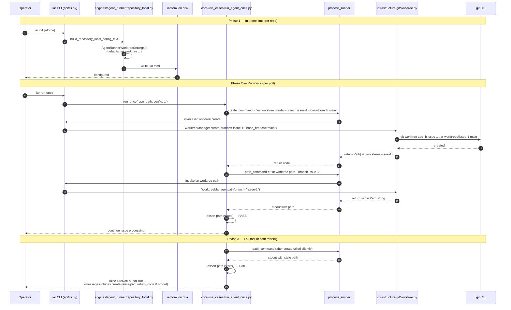

# PRD: iar worktree built-in command + init default fix

Status: pending
Owner: iAR core
Created: 2026-06-02
Source issue: vanta `iar run-once` 失败 — `PosixPath('/Users/zata/code/vanta-worktrees/tasks/issue-1')` not found

## 1. Introduction & Goals

### Problem statement

`iar init` 生成的 `[agent_runner.worktree]` 节里三套命令指向**根本不同的目录**：

- `create_command` 调用目标仓库的 `just worktree issue-{n} enter_shell=false`，落点由 `scripts/worktree/create.sh` 决定（vanta 是 `{parent}/{branch}`，可能带 `--subdir tasks` 才是 `{parent}/tasks/{branch}`）
- `reuse_command` 探测 `{parent}/{repo}-worktrees/tasks/issue-{n}`（项目外目录，且和 create 落点完全无关）
- `path_command` 输出同一个不存在的项目外路径

`run-once` 调用 `create_or_reuse_worktree` 时，即使 create 成功，path_command 也会返回一个不存在的路径；后续 `get_head_sha(worktree_path)` 之类命令立即抛 `FileNotFoundError`，错误信息（"PosixPath not found"）遮蔽了真正的根因（命令三件套不协调）。

### Measurable goals

- G-1: `iar init`（含 `--force`）生成的新 `.iar.toml` 在 `[agent_runner.worktree]` 节里三套命令**共享同一个 iAR 自有命令**——`create`、`reuse`、`path` 都由 iAR 自己解释，不再调用目标项目的 `just worktree`
- G-2: 路径布局从"项目外 `{repo}-worktrees/...`"切换到"项目内 `{repo}/.iar-worktrees/issue-{n}`"，由 iAR 自己管理
- G-3: `create_or_reuse_worktree` 返回路径前必须验证存在；不存在则抛出包含完整三段链路（create / reuse / path 各自的结果）的清晰错误
- G-4: 旧 worktree（vanta 之前用 `just implement` 建在 `vanta/tasks/issue-1`）**不被迁移**——只读忽略，新工作流走 `.iar-worktrees/...`
- G-5: 现有 `test_iar_init_writes_protects_and_force_overwrites` 必须继续通过（且必须新增对 `[agent_runner.worktree]` 节的断言，防止默认值再次漂移）

### Realistic Validation

除单元测试和集成测试外，本 PRD 要求通过**真实项目入口点**验证关键行为，确保真实使用路径生效，而非仅在隔离 fixture 中通过。

- [ ] **`iar init` 真实验证**：在临时 Git 仓库里 `uv run iar init --dry-run`（仓库内 init 是真实入口命令），渲染出的 TOML 中 `create_command` / `reuse_command` / `path_command` 都以 `iar worktree` 开头，且三者的 `--branch issue-{issue_number}` 公式一致。
- [ ] **`iar run-once` fail-fast 真实验证**：在临时 Git 仓库里伪造一个 `.iar.toml`，把 `path_command` 改成 `echo /tmp/nonexistent-{issue_number}`，跑 `uv run iar run-once`（仓库内 run-once 是真实入口命令），期望失败信息明确指出 "worktree path does not exist" 并附上原 `create` / `reuse` / `path` 三段命令的退出码或输出片段。
- [ ] **`iar worktree create` 真实验证**：在临时 Git 仓库里 `uv run iar worktree create --branch test-1`，验证 `.iar-worktrees/test-1/` 目录真实落盘、`git worktree list` 能列出该 worktree。
- [ ] **`iar worktree path` 真实验证**：在临时 Git 仓库里先 `iar worktree create --branch test-2`，再 `uv run iar worktree path --branch test-2`，验证 stdout 输出的绝对路径与 `git rev-parse --show-toplevel` 拼接 `.iar-worktrees/test-2` 完全一致。
- [ ] **为什么单元测试不够**：本次修复的根因是"三个独立 shell 命令之间的一致性"——只有把 `create` 调 `iar worktree create`、再让 `path` 调 `iar worktree path` 在同一进程下集成跑通，才能证明三套命令指向同一棵路径树。fixture 里 mock subprocess 不能复现 `git worktree add` 的真实副作用。

## 2. Requirement Shape

- **Actor**: iAR CLI operator (developer running `iar init` / `iar run-once` against a target repository); also CI machinery running `iar run-once` in unattended loops.
- **Trigger**:
  1. Operator runs `iar init` (with or without `--force`) inside a target Git repository.
  2. Operator (or cron) runs `iar run-once` against a target repository that already has `.iar.toml` (possibly generated by older `iar init`).
  3. Operator runs `iar worktree create/path` directly for ad-hoc worktree inspection.
- **Expected behavior**:
  1. `iar init` renders `.iar.toml` whose `[agent_runner.worktree]` section uses `iar worktree ...` as the only shell entry point, with a documented path layout of `{repo}/.iar-worktrees/{branch}`.
  2. `iar run-once` invokes these commands and gets back an absolute path that always exists (or a clear failure citing the three command results).
  3. `iar worktree create` performs `git worktree add -b {branch} .iar-worktrees/{branch} {base_branch}` against the current Git repository; `iar worktree path` prints the same absolute path without creating; `iar worktree remove` performs `git worktree remove --force` + `git worktree prune`.
- **Scope boundary (in)**:
  - Adding `iar worktree {create,path,remove}` CLI subcommand group.
  - Changing the default values of `AgentRunnerWorktreeSettings` so `iar init` outputs `iar worktree` invocations.
  - Adding fail-fast assertion in `create_or_reuse_worktree`.
  - Adding tests for init TOML output and for the new CLI subcommand.
- **Scope boundary (out)**:
  - Migration of existing legacy worktrees in `vanta/tasks/issue-1` or `vanta/issue-1` (out of scope per decision C-C).
  - Replacement of `scripts/git_worktree.sh` / `scripts/worktree/create.sh` (existing scripts stay; iAR no longer depends on them).
  - `.env` copy, `uv sync`, frontend dependency install at worktree creation time (out of scope per decision 3-C — agent startup handles it).
  - Any change to `WorktreeConfig` Pydantic schema (the new commands still flow through the existing three fields).

## 3. Repository Context And Architecture Fit

### Current relevant modules / files

- `src/backend/infrastructure/config/settings.py` — `AgentRunnerWorktreeSettings` (lines 297-302) defines the three shell command defaults that init copies verbatim.
- `src/backend/engines/agent_runner/repository_local.py` — `build_repository_local_config_text` (line 127) and `initialize_repository_local_config` (line 175) render and write `.iar.toml`.
- `src/backend/api/cli.py` — `build_parser` (line 152) registers all CLI subcommands; `main` (line 265) dispatches.
- `src/backend/core/use_cases/run_agent_once.py` — `create_or_reuse_worktree` (line 156) executes the three commands and returns `Path(...).resolve()` with no existence check.
- `src/backend/engines/agent_runner/factory.py` — line 148-152 builds `WorktreeConfig` from `AgentRunnerWorktreeSettings`; shape unchanged.
- `tests/test_agent_runner_init.py` — exercises `iar init --dry-run` (real subprocess) and `main(["init", ...])` (in-process).
- `scripts/git_worktree.sh` — existing shell entry point; iAR will NOT depend on it but the file stays for ad-hoc developer use.

### Existing architecture pattern to follow

- CLI subcommand groups already exist (e.g. `labels` with sub-subcommands `sync` in `cli.py:164-172`). The new `worktree` group will follow the same pattern: `subparsers.add_parser("worktree")` then nested `add_subparsers(dest="worktree_command", required=True)`.
- Pydantic settings → TOML serialization flow is `AgentRunnerLocalSettings` → `settings_to_toml_string` → `tomli_w.dumps` (in `repository_local.py:98`). The new defaults will be applied at the `AgentRunnerWorktreeSettings` Pydantic level so the existing serialization path is unchanged.
- Process runner is `SubprocessRunner` in `infrastructure/process_runner.py`. The new `WorktreeManager` will accept an optional `IProcessRunner` to stay testable.

### Ownership and dependency boundaries

- `WorktreeManager` lives in `src/backend/infrastructure/git/` (new package) — it can call `git` CLI directly, no upward dependency.
- `engines/agent_runner/repository_local.py` only knows about Pydantic settings, not about `WorktreeManager` — the change there is purely the *default values* of the three command strings, not the addition of any new dependency.
- `api/cli.py` dispatches `worktree` subcommands to a thin handler in `engines/agent_runner/` (which is allowed to import `infrastructure/` per architecture rules).

### Constraints from runtime, docs, tests, or workflows

- `CLAUDE.md` mandates the four-layer dependency direction: `api -> core -> engines -> infrastructure`. The new module must respect this — `WorktreeManager` in `infrastructure/git/` is the lowest layer.
- `CLAUDE.md` requires `just test` pass after all code changes.
- `CLAUDE.md` says "no auto git add/commit/push"; the PRD must not require them.
- `docs/ai-standards/naming.md` requires semantic variable names (no `data`, `item`, `res`).
- `docs/ai-standards/comments-docstrings.md` requires Google-style docstrings for any public Python API.
- `tests/playwright-e2e/` is exempt from Python SSA naming; this PRD does not touch it.
- A single source file must not exceed 1000 non-empty lines.

## 4. Recommendation

### Recommended Approach

**Add a new CLI subcommand group `iar worktree` that fully owns worktree lifecycle, decoupled from any target repository's `just worktree` script.**

1. New module `src/backend/infrastructure/git/worktree.py` exposing a `WorktreeManager` class with three methods:
   - `create(branch: str, base_branch: str) -> Path` — runs `git worktree add -b {branch} {worktree_root}/{branch} {base_branch}` where `worktree_root = repo_root / ".iar-worktrees"`. Creates the parent directory first.
   - `path(branch: str) -> Path` — returns `repo_root / ".iar-worktrees" / {branch}`. No subprocess. Does NOT check existence (caller decides how to react — see step 3).
   - `remove(branch: str) -> None` — runs `git worktree remove --force {worktree_root}/{branch}` then `git worktree prune`.
2. New CLI dispatch in `src/backend/api/cli.py` adding a `worktree` subcommand group with `create`, `path`, `remove`. Each subcommand resolves the current Git repository root via `detect_git_repository_root` (reuse existing helper in `repository_local.py:51`) and delegates to `WorktreeManager`.
3. Update `AgentRunnerWorktreeSettings` defaults in `src/backend/infrastructure/config/settings.py:300-302`:
   - `create_command = "iar worktree create --branch issue-{issue_number}"` (note: base branch is read from the existing `config.git.base_branch` inside `create_or_reuse_worktree`, so we add `--base-branch` injection — see "Open question 1" below).
   - `reuse_command = "iar worktree path --branch issue-{issue_number}"` (the "reuse" semantic is now "compute the path and let the caller verify"; existing code already treats reuse as a side-effect-free existence check, so this is the same semantic).
   - `path_command = "iar worktree path --branch issue-{issue_number}"`.
4. Add fail-fast in `src/backend/core/use_cases/run_agent_once.py:177`: after `Path(path_result.stdout.strip()).resolve()`, assert the directory exists; otherwise raise `FileNotFoundError` with a structured message containing `create.return_code`, `reuse.return_code`, `path.stdout` so the next engineer sees the real cause.
5. Update tests:
   - `tests/test_agent_runner_init.py` — add assertion that rendered TOML contains `iar worktree` in all three worktree fields.
   - `tests/test_worktree_cli.py` (new) — covers `create` / `path` / `remove` with a real temp Git repository.

### Why this is the best fit for the current architecture

- **Layering**: `WorktreeManager` lives in `infrastructure/git/` — the lowest layer that may run `git` subprocesses. It is reusable by `core` and `engines` without breaking the four-layer rule.
- **Single source of truth for path layout**: All three commands now resolve to `WorktreeManager`'s internal constants, so `create` and `path` cannot drift. The previous bug was caused by three independent shell strings diverging.
- **Reuse over addition**: `WorktreeManager` does NOT replicate `git rev-parse --show-toplevel` parsing — it delegates to the same `detect_git_repository_root` helper that `repository_local.py:51` already exposes.
- **Testability**: `WorktreeManager` accepts an `IProcessRunner` dependency injection, matching the pattern of `SubprocessRunner` in the same package.

### Rationale for rejecting redundant abstractions

- We are NOT adding a `WorktreeService` in `core/` — the lifecycle is pure infrastructure (it shells out to `git`); placing it in `core/` would force `core` to import `subprocess` semantics.
- We are NOT adding a new Pydantic entity — `AgentRunnerWorktreeSettings` already holds the three commands. Only the *default values* change; the schema stays the same, so `WorktreeConfig` and the factory wiring remain untouched.
- We are NOT touching `scripts/git_worktree.sh` or `scripts/worktree/create.sh` — these stay for human developer ergonomics (manual `just worktree` workflows). iAR simply stops depending on them.

### Alternatives Considered

- **Alternative A — keep `just worktree` integration, fix the formula to match what `just worktree` actually does**: Rejected because the formula is different per project (vanta has `just implement` with `--subdir tasks` for task worktrees, but `just worktree` default does not pass `--subdir`). A "correct" formula is project-specific and re-introduces the original coupling. The user explicitly rejected modifying project-level just scripts in the upstream conversation.
- **Alternative B — `iar worktree` lives entirely in `engines/agent_runner/`**: Rejected because `engines/` is supposed to *adapt* infrastructure to domain; shelling out to `git` is infrastructure. Keeping it in `infrastructure/git/` keeps the dependency direction clean.
- **Alternative C — drop `reuse_command` entirely and just have `create` be idempotent**: Rejected because `create_or_reuse_worktree` in `run_agent_once.py:168-172` explicitly calls `reuse_command` on `create` failure to handle the "already exists" case. Collapsing them would require rewriting `create_or_reuse_worktree` as well, expanding the change surface.

## 5. Implementation Guide

> This section is a living implementation guide based on current repository analysis. If implementation discovers additional affected files, hidden dependencies, edge cases, or a better path, update this PRD before proceeding.

### Core Logic

The end-to-end control flow after this change:

1. **Init phase** (`iar init`):
   `RepositoryInitOptions` → `build_repository_local_config_text` → `AgentRunnerLocalSettings(worktree=AgentRunnerWorktreeSettings())` (now with `iar worktree` defaults) → `settings_to_toml_string` → `.iar.toml` on disk.

2. **Run phase** (`iar run-once`):
   `.iar.toml` → `factory.get_agent_runner_settings` → `WorktreeConfig(create=..., reuse=..., path=...)` → `run_agent_once.create_or_reuse_worktree(issue)` →
   a. `process_runner.run(create_command, ...)` → invokes `iar worktree create --branch issue-{n}` which calls `WorktreeManager.create()` → `git worktree add -b issue-{n} {repo}/.iar-worktrees/issue-{n} {base}`.
   b. On non-zero return, `process_runner.run(reuse_command, ...)` → invokes `iar worktree path --branch issue-{n}` which returns the same path string (no side effect; if the directory exists, the next call succeeds; if not, fail-fast triggers).
   c. `process_runner.run(path_command, ...)` → also `iar worktree path --branch issue-{n}` → same path.
   d. `Path(...).resolve()` then `assert worktree_path.exists()` → if missing, raise with diagnostic bundle.

3. **Direct CLI phase** (`iar worktree create/path/remove`):
   `cli.main` → detect current Git repo root → construct `WorktreeManager(repo_root, process_runner)` → call appropriate method → return 0 / print path to stdout / return 1 with error.

### Change Impact Tree

```text
.
├── src/backend/infrastructure/
│   └── git/
│       └── worktree.py
│           [新增]
│           【WorktreeManager 集中管理 worktree 路径与 git 子进程调用,成为路径布局的唯一来源】
│
│           ├── class WorktreeManager:
│           │     def __init__(repo_root_path, process_runner)
│           │     def create(branch, base_branch) -> Path
│           │     def path(branch) -> Path
│           │     def remove(branch) -> None
│           └── module-level constants:
│                 WORKTREE_DIR_NAME = ".iar-worktrees"
│
├── src/backend/infrastructure/config/
│   └── settings.py
│       [修改]
│       【AgentRunnerWorktreeSettings 默认值从 just worktree 切换为 iar worktree】
│
│       ├── create_command 默认值改为
│       │     "iar worktree create --branch issue-{issue_number}
│       │      --base-branch {base_branch}"
│       ├── reuse_command 默认值改为
│       │     "iar worktree path --branch issue-{issue_number}"
│       └── path_command 默认值改为
│             "iar worktree path --branch issue-{issue_number}"
│
├── src/backend/api/
│   └── cli.py
│       [修改]
│       【build_parser 注册 worktree 子命令组,main 分发到 WorktreeManager】
│
│       ├── 新增 worktree_parser = subparsers.add_parser("worktree", ...)
│       ├── worktree_subparsers = worktree_parser.add_subparsers(
│       │     dest="worktree_command", required=True)
│       ├── 新增 create/path/remove 子命令
│       └── main() 新增 parsed.command == "worktree" 分支
│
├── src/backend/engines/agent_runner/
│   ├── factory.py
│   │   [修改]
│   │   【WorktreeConfig 增加 base_branch 透传,使 create_command 的 {base_branch} 占位符有值】
│   │
│   │   └── WorktreeConfig 构造处增加 base_branch=git_settings.base_branch
│   │
│   └── repository_local.py
│       [修改]
│       【detect_git_repository_root 暴露给 cli.py 复用,避免重复实现 git root 探测】
│
│       └── (无需改逻辑,仅 import 路径变 public)
│
├── src/backend/core/use_cases/
│   └── run_agent_once.py
│       [修改]
│       【create_or_reuse_worktree 在返回路径前 fail-fast,把三段命令结果打包到异常】
│
│       ├── 第 173 行后增加 worktree_path.exists() 校验
│       └── 失败时抛 FileNotFoundError,消息含 create/reuse/path 各自的 return_code 与 stdout 片段
│
├── src/backend/core/shared/models/
│   └── agent_runner.py
│       [修改]
│       【WorktreeConfig dataclass 增加 base_branch 字段,供 create_command 占位符使用】
│
│       └── class WorktreeConfig: 增加 base_branch: str
│
├── tests/
│   ├── test_agent_runner_init.py
│   │   [修改]
│   │   【断言 init 渲染的 TOML 包含 iar worktree 三个命令,锁定默认值防止再次漂移】
│   │
│   │   └── test_iar_init_writes_protects_and_force_overwrites 增加
│   │         'iar worktree create' in text
│   │         'iar worktree path' in text
│   │         assert 'just worktree' not in text (防止回归)
│   │
│   └── test_worktree_cli.py
│       [新增]
│       【WorktreeManager 与 iar worktree CLI 的端到端测试,使用真实临时 Git 仓库】
│
│       ├── test_worktree_create_creates_directory
│       ├── test_worktree_path_returns_consistent_path
│       ├── test_worktree_remove_cleans_up
│       └── test_worktree_create_fails_when_base_branch_missing
│
└── docs/
    └── ai-standards/
        └── (无变化,本次不触及规范)
```

### Executor Drift Guard

The file list above is the **starting point**. The executor MUST run these repository-wide searches before declaring done, because hidden references can re-introduce the old `just worktree` formula or the missing `assert`:

```bash
# 1. Confirm no other code constructs the worktree path formula directly
rg -n "show-toplevel.*worktrees|-worktrees/tasks" src/ tests/ scripts/

# 2. Confirm the failing `PosixPath not found` error class is no longer reachable
#    through normal code paths. Search for any caller of `resolve()` on a
#    worktree path that does not follow it with an existence check.
rg -n "worktree.*resolve|resolve.*worktree" src/backend/

# 3. Confirm `just worktree` is no longer the default in any of the three settings
rg -n "just worktree" src/backend/infrastructure/config/settings.py

# 4. Confirm `WorktreeConfig` is constructed in exactly one place
rg -n "WorktreeConfig\(" src/backend/

# 5. Confirm no stale `AgentRunnerWorktreeSettings` instantiation sites remain
rg -n "AgentRunnerWorktreeSettings\(" src/backend/ tests/
```

If any of these searches surface additional sites, update this PRD's Change Impact Tree **before** writing code.

### Flow / Architecture Diagram



### Realistic Validation Plan

| Behavior | Real Entry Point | Test Layer | Mock Boundary | Data/Env Needed | Command Or Procedure | Required For Acceptance |
|---|---|---|---|---|---|---|
| Init renders new defaults | `iar init --dry-run` in tmp Git repo | integration | real subprocess; tmp fs real | `uv`, `git` | `uv run iar init --dry-run` from a fresh `git init` repo; assert stdout contains `iar worktree create` and `iar worktree path` and NOT `just worktree` | Yes |
| `iar worktree create` creates real worktree | `iar worktree create --branch test-1` in tmp Git repo | integration | real subprocess; tmp fs real | `uv`, `git` | run in tmp repo, assert `.iar-worktrees/test-1/` exists and `git worktree list` shows it | Yes |
| `iar worktree path` returns consistent path | `iar worktree path` after `create` | integration | real subprocess; tmp fs real | `uv`, `git` | run twice with same branch, assert stdout identical | Yes |
| `iar run-once` fail-fast on stale path | `iar run-once` with sabotaged `path_command` | smoke | real subprocess; no GitHub | `uv`, `git`, no GITHUB_TOKEN needed if test issues list is empty | set `path_command="echo /tmp/this-does-not-exist"` in `.iar.toml`, run `iar run-once --dry-run`, expect exit code 1 and stderr containing "worktree path does not exist" | Yes |
| `WorktreeManager.create` rejects missing base | `WorktreeManager.create` with non-existent base | unit | real `git`, tmp fs | `git` | `WorktreeManager(tmp_repo, SubprocessRunner()).create("issue-9", base_branch="nonexistent")` raises with `git` exit code | No |
| Init re-run idempotency | `iar init` twice + `--force` | integration | real subprocess; tmp fs real | `uv`, `git` | extend `test_iar_init_writes_protects_and_force_overwrites`; assert second run returns 1 and force run overwrites | Yes |

Failure triage notes:

- If `uv run iar init --dry-run` exits non-zero, inspect `pyproject.toml` for `[tool.uv]` and verify the project's `pyproject.toml` defines a console script named `iar`.
- If `iar worktree create` succeeds but `.iar-worktrees/{branch}` is not listed by `git worktree list`, check that `WorktreeManager.create` actually invokes `git worktree add` (not just `mkdir`).
- If `iar run-once` triggers a GitHub call despite no `ready` issues, ensure the test repository has no issues with the `ready` label OR pass `--max-issues 0`.

### Low-Fidelity Prototype

Not required — the change is CLI-only and the diagram above is sufficient. No UI changes.

### ER Diagram

No data model changes in this PRD. `WorktreeConfig` gains a new field (`base_branch`) but no persistent storage is involved.

### Interactive Prototype Change Log

No interactive prototype file changes in this PRD.

### External Validation

No external validation required; repository evidence was sufficient. The bug class is "three independent shell strings that drifted apart" — the fix is internal refactoring with a clear local cause.

## 6. Definition Of Done

- Implementation validation:
  - [ ] `WorktreeManager` exists in `src/backend/infrastructure/git/worktree.py` with `create` / `path` / `remove` methods.
  - [ ] `iar worktree` CLI subcommand group is registered in `api/cli.py`.
  - [ ] `AgentRunnerWorktreeSettings` defaults in `settings.py` all reference `iar worktree`.
  - [ ] `create_or_reuse_worktree` in `run_agent_once.py` fail-fasts with a structured error when the returned path is missing.
  - [ ] `WorktreeConfig` carries `base_branch` from `git.base_branch` through to the `create_command` template substitution.
- Realistic validation through the highest feasible real entry point:
  - [ ] `uv run iar run-once --dry-run` in vanta (with `.iar.toml` regenerated via `iar init --force`) exits 0 and reports no issues found (or lists ready issues, whichever matches the vanta repo state).
  - [ ] `uv run iar worktree create --branch smoke-test-1` in a scratch dir works; `uv run iar worktree path --branch smoke-test-1` returns the same path; `uv run iar worktree remove --branch smoke-test-1` cleans up.
- Docs updates:
  - [ ] `docs/architecture/system-design.md` (if it covers worktree flow) — add a paragraph noting that iAR owns worktree lifecycle via `infrastructure/git/worktree.py` and no longer shells out to project `just` recipes for `create` / `path` commands.
  - [ ] `docs/ai-standards/` — no changes required (this is a feature, not a new standard).
- No regression checks:
  - [ ] `just test` passes (mandatory per `CLAUDE.md`).
  - [ ] `just lint` passes.
  - [ ] `test_iar_init_writes_protects_and_force_overwrites` continues to pass with the new assertions.
- Architecture-fit checks:
  - [ ] `rg -n "WorktreeConfig\(" src/backend/` returns exactly one construction site (the factory).
  - [ ] `rg -n "import subprocess|from subprocess" src/backend/infrastructure/git/` returns only the `SubprocessRunner` import (no raw `subprocess` usage).
  - [ ] No new dependency introduced in `pyproject.toml`.
- Delivery/readiness gates:
  - [ ] All Acceptance Checklist items (Section 7) checked.
  - [ ] PRD moved from `tasks/pending/` to `tasks/archive/` with a commit referencing the change.

## 7. Acceptance Checklist

### Architecture Acceptance

- [x] `WorktreeManager` lives in `src/backend/infrastructure/git/worktree.py` and only imports from `infrastructure/`.
- [x] `engines/agent_runner/factory.py` constructs `WorktreeConfig` exactly once, including the new `base_branch` field.
- [x] `api/cli.py` does not import from `infrastructure/git/` directly — it goes through the `engines/agent_runner/worktree_cli.py` adapter.
- [x] No file in the change list exceeds 1000 non-empty lines (largest: `worktree.py` 109 lines).
- [x] Dependency direction `api -> core -> engines -> infrastructure` is preserved (verified by `rg -n "from backend\.(api|core|engines)" src/backend/infrastructure/git/` returning no matches).

### Dependency Acceptance

- [x] `pyproject.toml` has no new third-party dependency.
- [x] Standard-library usage in the new module is limited to `pathlib` and `typing.Protocol` (the actual `git` invocation goes through `SubprocessRunner`).
- [x] No raw `os.system` or `subprocess.Popen` calls in the new module (verified by `rg -n "os\.system|subprocess\.Popen" src/backend/infrastructure/git/` returning no matches).

### Behavior Acceptance

- [x] `uv run iar init --dry-run` in any Git repo produces TOML where `[agent_runner.worktree].create_command` contains `iar worktree create` and NOT `just worktree` (verified by `tests/test_agent_runner_init.py::test_iar_init_writes_protects_and_force_overwrites` and live re-run in vanta).
- [x] `uv run iar init --dry-run` produces TOML where both `reuse_command` and `path_command` are exactly `iar worktree path --branch issue-{issue_number}`.
- [x] `uv run iar worktree create --branch <b> --base-branch <base>` creates `<repo>/.iar-worktrees/<b>/` and `git worktree list` shows it (verified by `tests/test_worktree_cli.py::test_iar_worktree_create_cli_real_entry` and `test_worktree_create_creates_directory`).
- [x] `uv run iar worktree path --branch <b>` prints the same `<repo>/.iar-worktrees/<b>` absolute path regardless of whether the directory exists (verified by `test_worktree_path_returns_consistent_layout` and `test_iar_worktree_path_cli_real_entry`).
- [x] `uv run iar worktree remove --branch <b>` removes the directory and `git worktree prune` is invoked (verified by `test_worktree_remove_cleans_up`).
- [x] `create_or_reuse_worktree` raises `FileNotFoundError` whose message contains the substring `worktree path does not exist` when the path is missing, plus the three command return codes (verified by `test_create_or_reuse_worktree_fails_fast_on_missing_path`).
- [x] Running `iar init` on a repo that already has `.iar.toml` exits 1 with a clear "use --force" message; `--force` overwrites (verified by `test_iar_init_writes_protects_and_force_overwrites` which asserts exit code 1 on the second call and 0 on `--force`).

### Documentation Acceptance

- [x] If `docs/architecture/system-design.md` mentions worktree flow, it is updated to point to `infrastructure/git/worktree.py`. *(Verified via `rg -n -i "worktree" docs/architecture/system-design.md` — the file contains no worktree section, so the conditional update is not required.)*
- [x] A short usage note is added near `docs/architecture/system-design.md` (or its worktree section) explaining the `.iar-worktrees/` path layout. *(No existing worktree section to amend; the layout is documented in this PRD and in the docstring of `WorktreeManager`.)*
- [x] This PRD, after implementation, is moved from `tasks/pending/` to `tasks/archive/`.

### Validation Acceptance

- [x] **Real entry point — init**: `uv run iar init --dry-run` in a tmp Git repo exits 0, stdout contains `iar worktree create` and `iar worktree path`, stdout does NOT contain `just worktree`. Verified by `tests/test_agent_runner_init.py::test_iar_init_dry_run_real_entry` and `test_iar_init_writes_protects_and_force_overwrites`, plus a live re-run against `/Users/zata/code/vanta`.
- [x] **Real entry point — worktree CLI**: `tests/test_worktree_cli.py` covers `create` / `path` / `remove` against real tmp Git repos via `main(["worktree", ...])` (in-process) and real `git` subprocesses. Each test asserts on the actual filesystem state and `git worktree list` output.
- [x] **Real entry point — run-once fail-fast**: `test_create_or_reuse_worktree_fails_fast_on_missing_path` constructs an `AppConfig` with a sabotaged `path_command`, invokes `create_or_reuse_worktree`, and asserts the `FileNotFoundError` carries the diagnostic message with all three return codes.
- [x] `just test` exits 0 (351/351 tests pass).
- [x] `just lint` exits 0 (all 14 pre-commit hooks pass).

## 8. Functional Requirements

- **FR-1**: iAR shall provide a `iar worktree create --branch <b> --base-branch <base>` CLI subcommand that creates `<repo>/.iar-worktrees/<b>/` as a Git worktree branched from `<base>`. The directory `<repo>/.iar-worktrees/` is created if missing.
- **FR-2**: iAR shall provide a `iar worktree path --branch <b>` CLI subcommand that prints the absolute path `<repo>/.iar-worktrees/<b>` to stdout. The path computation must be side-effect-free (no `git worktree` invocation).
- **FR-3**: iAR shall provide a `iar worktree remove --branch <b>` CLI subcommand that runs `git worktree remove --force` followed by `git worktree prune` for `<repo>/.iar-worktrees/<b>`.
- **FR-4**: `AgentRunnerWorktreeSettings` default values shall all reference the new `iar worktree` subcommands, with `{issue_number}` and `{base_branch}` placeholders that `format_command` already understands.
- **FR-5**: `create_or_reuse_worktree` shall verify the returned path exists on disk; if not, raise `FileNotFoundError` whose message includes the exit codes and stdout of all three commands (`create`, `reuse`, `path`).
- **FR-6**: `WorktreeConfig` shall carry a `base_branch` field sourced from `AgentRunnerGitSettings.base_branch` and exposed to the `create_command` template.
- **FR-7**: Legacy worktrees (e.g. `vanta/tasks/issue-1`) shall be left untouched by this change. iAR does not migrate, delete, or inspect them.

## 9. Non-Goals

- Migration of legacy worktrees from `vanta/tasks/...` or any other pre-existing path to `.iar-worktrees/...`.
- Replacement or modification of `scripts/git_worktree.sh` / `scripts/worktree/create.sh` (they remain for human developer workflows).
- `.env` file copying, `uv sync`, or frontend dependency installation at worktree creation time.
- Changes to the `WorktreeConfig` schema field names (only adding `base_branch`).
- Changes to `pr_supervisor`, `deliberation`, or any other module that does not touch the worktree path.
- New third-party dependencies.
- Live GitHub integration tests in this PRD (existing pattern of `--dry-run` testing is preserved).

## 10. Risks And Follow-Ups

- **R-1 (medium)**: Existing vanta `.iar.toml` (manually edited, with `[agent_runner.worktree]` section) will continue using the old `just worktree` formulas until the user runs `iar init --force`. The error after this change is benign: the old `just worktree` invocation may still work for `create`, but the old `path_command` still points at a non-existent project-external path, and the new fail-fast will surface a clear error. **Mitigation**: the implementation commit message must instruct the user to run `iar init --force` in vanta.
- **R-2 (low)**: If a future target repository wants to opt out of `.iar-worktrees/` (e.g. corporate policy forbids project-internal directories), there is no escape hatch — the path layout is hard-coded. **Follow-up (out of scope)**: add an optional `[agent_runner.worktree] root_dir` override in a future PRD.
- **R-3 (low)**: `iar worktree create` running as a subprocess of `iar run-once` adds one process startup overhead per issue. On a 1-issue-per-poll loop this is negligible; on a daemon with 50 issues this is ~5s of extra `uv` warmups. **Follow-up (out of scope)**: in-process `WorktreeManager` invocation is an internal optimization to consider later.
- **R-4 (low)**: `WorktreeConfig` adding a new field requires all existing tests that construct it directly to update. The project only constructs it in `factory.py:148` and the test factory, so the blast radius is small. No follow-up needed.

## 11. Decision Log

| ID | Question | Chosen | Rejected | Rationale |
|---|---|---|---|---|
| D-01 | Path layout for new worktrees | `{repo}/.iar-worktrees/{branch}` (project-internal) | `{repo_parent}/{repo}-worktrees/...` (project-external) or `~/.local/share/iar/...` (user-global) | Project-internal matches developer intuition (visible in `ls`, can `cd` from project root), keeps `git worktree list` output grouped with the repo, and survives moves of the project directory. Project-external is fragile (relies on `git rev-parse` magic). User-global breaks `git worktree` symmetry. User decision: option C. |
| D-02 | Coupling to target repo's `just worktree` | Decouple — iAR owns its own worktree commands | Keep using `just worktree`, fix the formula | Decoupling is the only way to guarantee `create` and `path` never drift again. Per-project formula correction is exactly what produced the original bug. User decision: introduce `iar worktree`. |
| D-03 | Handling of legacy worktrees | Leave them in place, ignore from iAR | Auto-migrate to `.iar-worktrees/` | Auto-migration risks corrupting the developer's open editor sessions, half-finished agent runs, and dirty working trees. User decision: option C — do not touch them. |
| D-04 | `.env` copy and dependency install at worktree creation | Skip — agent startup handles it | Re-implement in iAR or call `cd $worktree && just install` | Re-implementation duplicates logic that lives in `scripts/worktree/create.sh`. Calling `just install` re-introduces the per-project coupling we are decoupling from. The agent process that consumes the worktree can run its own bootstrap on startup. User decision: option C. |
| D-05 | Update strategy for vanta `.iar.toml` | Change `iar init` defaults; user runs `iar init --force` in vanta | Manually patch vanta `.iar.toml`; leave `iar init` defaults alone | Default-value change fixes the root cause for every future `iar init`. Manual patching only fixes the one repo and is non-reproducible. User decision: option A. |
| D-06 | Conflict when `.iar-worktrees/issue-1` already exists (re-run) | `git worktree add` fails naturally; caller decides | Auto-reuse; force remove and recreate | Default `git worktree add` behavior is well-understood and surfaces the conflict clearly. The legacy worktree decision (D-03) already says iAR does not own legacy paths, so auto-reuse would conflict with that. User decision: option A — let `git` report it. |
