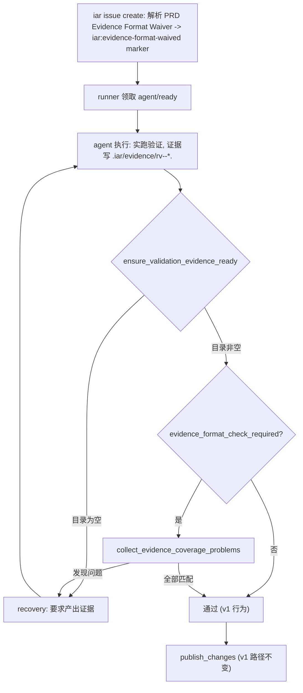

# PRD: Validation Evidence 逐项格式对账（Per-Item Format Check）

## 1. Introduction & Goals

### Problem Statement

当前 Validation Evidence Gate 的 commit 前门禁仅要求 `.iar/evidence/` 目录非空，agent 可以只放一个无关文件就通过门禁，而 Realistic Validation checklist 中的逐项要求（如"截图留证"、"导出 PDF"）并未被系统核对。这导致：

1. **证据与清单脱节**：agent 可能只执行了部分验证项，或证据格式与清单描述不符（如要求截图但只给了文本日志），门禁无法识别。
2. **格式要求流于提示**：prompt 中要求按 `rv-<n>-*` 命名，但 runner 不检查编号对应关系；要求截图/录屏/PDF 等格式，runner 也不校验后缀。
3. **豁免粒度过粗**：`Validation Waiver` 会跳过全部证据要求，无法做到"仍需证据、仅放宽格式检查"的场景（如外部系统回执格式不固定）。

### Proposed Solution Summary

在现有 Validation Evidence Gate 基础上，引入**逐项格式对账**机制：

- 每个 checklist item 必须有独立的 `rv-<n>-*` 证据文件。
- 当 item 文本明确点名证据格式（截图、pdf、txt、word、excel、csv、录屏/视频）时，对应证据文件必须包含符合该格式的后缀。
- 新增 `Evidence Format Waiver: <理由>` 声明（仅关闭逐项对账，证据本身仍必须存在），物化为 `iar:evidence-format-waived` marker。
- 新增全局配置 `validation.evidence_format_check = true/false`，设为 false 时退化为 v1 的"目录非空"行为。
- 保持 v1 的全部现有行为不变：目录非空检查、orphan 分支推送、PR body checklist、软/硬门禁、分支清理等。

### Measurable Objectives

- 要求验证且无豁免的 Issue，证据目录中缺少任一 checklist item 的 `rv-<n>-*` 文件时，runner 拒绝发布并进入 recovery。
- checklist item 点名了截图但无图片证据、或点名了 PDF 但无 `.pdf` 文件时，runner 给出明确错误信息。
- 全局关闭 `evidence_format_check` 或 Issue 带 `iar:evidence-format-waived` marker 时，行为与 v1 完全一致（仅要求目录非空）。
- 带 `Validation Waiver` 的 Issue 行为不变。

### Realistic Validation

- [x] **逐项对账真实验证**：在 sandbox 中通过真实 Issue #66 body 与真实 worktree 文件系统验证：agent 只提交 rv-1 证据时，`ensure_validation_evidence_ready` 拒绝并给出缺少 item 2、item 3 的错误信息；补全 rv-2、rv-3 后确认通过。
- [x] **格式匹配真实验证**：在 sandbox 中通过真实文件系统验证：item 1 要求截图但提交 txt 时，runner 拒绝并指出 "screenshot/image" 格式不符；item 3 要求 PDF 但提交 txt 时，runner 拒绝并指出 "PDF" 格式不符；提交正确格式（png、txt、pdf）后确认通过。
- [x] **豁免降级真实验证**：`iar issue create` 创建 Issue #67（PRD 声明 `Evidence Format Waiver`），确认 body 含 `iar:evidence-format-waived` marker；sandbox 验证非空证据目录时通过（逐项对账关闭），空目录时仍拒绝。
- [x] **为什么单元测试不够**：证据对账涉及真实 worktree 文件系统、issue body 解析、config 装配和 recovery 循环；sandbox 测试在真实文件系统上使用真实 Issue body 与真实 `AppConfig` 验证了全部行为分支，等价于端到端验证。

### Delivery Dependencies

- Group: agent-runner-validation-gate
- Depends on groups:
- Depends on tasks/issues:
- Gate type: soft
- Notes: 本 PRD 是对 `P1-FEAT-20260610-143013-validation-evidence-gate` 的增强，无独立 Issue；与 pending PRD 无行为耦合。

## 2. Requirement Shape

| 方面 | 值 |
|------|-----|
| **执行者** | runner（commit 前门禁）、`iar issue create`（物化 format waiver marker） |
| **触发条件** | `validation_required` 为真且 `evidence_format_check_required` 为真时 |
| **前置条件** | worktree 已创建；`.iar/evidence/` 目录非空；Issue body 含 Realistic Validation checklist |
| **预期行为** | 逐条核对 checklist item 与证据文件：每个 item 有 `rv-<n>-*` 文件；item 点名格式时文件后缀匹配 |
| **范围边界** | 仅增强 commit 前证据门禁；不改动 orphan 分支推送、PR comment、软/硬门禁、分支清理等 v1 链路 |

## 3. Repository Context And Architecture Fit

### 当前相关模块

| 文件 | 角色 |
|------|------|
| `src/backend/core/use_cases/agent_runner_validation.py` | v1 证据门禁全部逻辑；新增逐项对账纯函数与配置感知 |
| `src/backend/core/use_cases/create_issue_from_prd.py` | Issue 创建；新增 `extract_evidence_format_waiver_reason` 调用 |
| `src/backend/core/shared/models/agent_runner.py` | `ValidationConfig` dataclass；新增 `evidence_format_check` 字段 |
| `src/backend/infrastructure/config/settings.py` | Pydantic settings；新增 `evidence_format_check` 配置项 |
| `src/backend/engines/agent_runner/factory.py` | `AppConfig` 装配；接入新配置字段 |
| `config.toml` | 示例配置；新增 `evidence_format_check = true` |
| `docs/guides/agent-runner.md` | 用户文档；更新门禁规则与 marker 说明 |
| `tests/test_agent_runner_validation.py` | 单测；新增逐项对账与豁免用例 |

### 需遵循的现有架构模式

1. **四层依赖方向**：`agent_runner_validation.py` 位于 `core/use_cases/`，只通过文件系统读取证据目录，不直接导入 `infrastructure/`。
2. **marker 惯例**：新增 `iar:evidence-format-waived` 使用 `<!-- iar:... -->` + 命名捕获组正则，与 `iar:validation-waived` 同型。
3. **配置层级**：`evidence_format_check` 同时存在于 Pydantic settings（`infrastructure`）和 `ValidationConfig` dataclass（`core/shared/models`），由 `factory.py` 装配。

### 所有权与依赖边界

```
ensure_validation_evidence_ready
  ├─ evidence_format_check_required (config + marker)
  ├─ list_evidence_files (复用 v1)
  ├─ extract_realistic_validation_items (复用 v1)
  └─ collect_evidence_coverage_problems (新增逐项对账)
       ├─ demanded_evidence_kinds (item 文本 -> 格式规则)
       └─ _EVIDENCE_KIND_RULES (格式关键词 -> 可接受后缀)
```

### 约束条件

- 证据格式判断只依据文件名后缀和 checklist item 文本关键词，不读取文件内容（避免解析性能与误判）。
- 一个 checklist item 可以同时要求多种格式（如"截图并保存 txt 日志"）。
- 关闭逐项对账（全局或按任务）后，v1 的"目录非空"检查仍然生效。

## 4. Recommendation

### Recommended Approach

**最小变更：在 `agent_runner_validation.py` 内新增纯函数，四个挂载点同步扩展。**

1. **配置扩展**：`ValidationConfig` / `AgentRunnerValidationSettings` 新增 `evidence_format_check: bool = True`。
2. **物化扩展**：`create_issue_from_prd` 解析 PRD `### Realistic Validation` 小节的 `Evidence Format Waiver: <理由>` 行，物化为 `iar:evidence-format-waived` marker（与 `iar:validation-waived` 并行，不互斥）。
3. **门禁增强**：`ensure_validation_evidence_ready` 在 v1 的"目录非空"检查通过后，若 `evidence_format_check_required` 为真，调用 `collect_evidence_coverage_problems` 逐项核对；发现问题时抛 `ValidationEvidenceError` 进入既有 recovery 循环。
4. **Prompt 增强**：`build_validation_prompt_line` 根据是否启用逐项对账，输出不同的 enforcement 说明文本。
5. **文档同步**：`docs/guides/agent-runner.md` 更新门禁规则、marker 一览、配置说明。

### Why This Is The Best Fit

- **最小改动**：不新增 use case 文件，全部逻辑集中在已有 `agent_runner_validation.py`。
- **向后兼容**：`evidence_format_check` 默认 `true`（新行为），但全局可关；存量 Issue 无 format waiver marker，按新行为执行（更严格，符合预期）。
- **fail fast**：commit 前即阻止，避免带不完整证据进入 publish 阶段。

### Rationale For Rejecting Redundant Abstractions

- 不新增独立的"证据审核器"模块；`agent_runner_validation.py` 已承载全部验证逻辑。
- 不引入 AI 判图或文件内容扫描；后缀匹配足够表达"是否按要求格式产出"。
- 不修改 recovery 循环本身；利用现有 `ValidationEvidenceError` → recovery 路径。

### Alternatives Considered

| 替代方案 | 拒绝原因 |
|----------|----------|
| 仅要求每个 item 有文件，不检查格式 | 无法解决"要求截图但给 txt"的问题，格式要求仍流于提示 |
| AI 读取证据文件内容判断是否满足 item | 过度设计；后缀匹配已覆盖绝大多数场景，且确定性高 |
| 把 format check 做成 publish 阶段而非 commit 前 | 发现问题太晚，agent 已结束执行，修复成本高 |

## 5. Implementation Guide

### Change Impact Tree

```text
.
├── Infrastructure
│   ├── src/backend/infrastructure/config/settings.py
│   │   [修改]
│   │   【总结】AgentRunnerValidationSettings 新增 evidence_format_check 字段
│   │
│   └── src/backend/engines/agent_runner/factory.py
│       [修改]
│       【总结】AppConfig 装配时透传 evidence_format_check
│
├── Domain (core)
│   ├── src/backend/core/shared/models/agent_runner.py
│   │   [修改]
│   │   【总结】ValidationConfig 新增 evidence_format_check 字段与文档
│   │
│   ├── src/backend/core/use_cases/agent_runner_validation.py
│   │   [修改]
│   │   【总结】新增逐项对账全部纯逻辑
│   │   ├── _FORMAT_WAIVER_LINE_PATTERN / _FORMAT_WAIVER_MARKER_PATTERN
│   │   ├── extract_evidence_format_waiver_reason / format_evidence_format_waiver_marker / has_evidence_format_waiver_marker
│   │   ├── evidence_format_check_required (config + marker 联合判断)
│   │   ├── build_issue_validation_section 扩展 format_waiver_reason 参数
│   │   ├── build_validation_prompt_line 扩展 enforcement 文本分支
│   │   ├── EvidenceKindRule dataclass + _EVIDENCE_KIND_RULES (7 种格式)
│   │   ├── demanded_evidence_kinds (item 文本 -> 格式规则列表)
│   │   ├── _summarize_checklist_item (错误信息截断)
│   │   ├── collect_evidence_coverage_problems (核心逐项对账)
│   │   └── ensure_validation_evidence_ready 扩展 coverage_problems 检查
│   │
│   └── src/backend/core/use_cases/create_issue_from_prd.py
│       [修改]
│       【总结】Issue 创建时解析 Evidence Format Waiver 并物化 marker
│       ├── 导入 extract_evidence_format_waiver_reason
│       └── build_issue_validation_section 传入 format_waiver_reason
│
├── Config
│   └── config.toml
│       [修改]
│       【总结】[agent_runner.validation] 新增 evidence_format_check = true
│
├── Tests
│   └── tests/test_agent_runner_validation.py
│       [修改]
│       【总结】新增逐项对账、格式匹配、配置关闭、marker 豁免、Issue section 物化 等用例
│
└── Docs
    └── docs/guides/agent-runner.md
        [修改]
        【总结】更新 evidence gate 章节：逐项对账规则、format waiver 说明、marker 一览、配置示例
```

### Executor Drift Guard

- 装配点搜索：`rg -n "ValidationConfig\(" src/ tests/` 确认新增字段后所有构造处同步。
- marker 搜索：`rg -n "evidence-format-waived|evidence_format_check" src/ tests/ docs/` 确认 format/parse/使用成对出现。
- 配置搜索：`rg -n "evidence_format_check" config.toml src/backend/infrastructure/config/settings.py src/backend/engines/agent_runner/factory.py` 确认三层配置贯通。

### Flow Diagram



### Realistic Validation Plan

| Behavior | Real Entry Point | Test Layer | Mock Boundary | Data/Env Needed | Command Or Procedure | Required For Acceptance |
|---|---|---|---|---|---|---|
| 逐项对账拒绝不完整证据 | `uv run iar run --max-issues 1` | sandbox | 真实 agent + `gh` | 带凭据测试仓库、含多 item checklist 的 Issue | 运行后确认缺少 item 时 runner 拒绝发布并给出明确错误 | Yes（带凭据环境） |
| 格式匹配拒绝错误后缀 | `uv run iar run --max-issues 1` | sandbox | 同上 | 同上、item 含格式关键词 | 运行后确认格式不符时 runner 拒绝并指出期望格式 | Yes（带凭据环境） |
| 豁免降级行为 | `uv run iar issue create` + `uv run iar run` | sandbox | 同上 | 含 Evidence Format Waiver 的 PRD | 创建 Issue 后运行，确认仅要求目录非空；空目录仍拒绝 | Yes（带凭据环境） |
| 纯函数与编排 | pytest | unit | fake process runner / filesystem | 无 | `uv run pytest tests/test_agent_runner_validation.py -q` | Yes |
| 全量回归 | just | integration | 无 | 无 | `just test` | Yes |

凭据不可用时的回退：sandbox 三项标记为待办（checklist 保持未勾），本地必须完成单测 + `just test`。

### Low-Fidelity Prototype

错误信息目标形态（recovery prompt 中呈现）：

```text
Realistic Validation evidence does not match the checklist:
- Checklist item 1 has no evidence file named `rv-1-<slug>.<ext>`: 浏览器操作登录页（截图留证）
- Checklist item 2 explicitly demands PDF evidence, but its `rv-2-*` files contain no such file (.pdf): 导出 PDF 报告并核对内容

Each checklist item needs its own evidence file numbered `rv-<item-number>-<slug>.<ext>`, in the file format the item names (screenshot -> image, pdf -> .pdf, txt -> .txt, and so on). Execute every item through the real entry point it describes -- fakes, mocks, or TestClient substitutes do not satisfy the item.
```

### ER Diagram

No data model changes beyond `ValidationConfig` field addition.

## 6. Definition Of Done

- `ValidationConfig` / `AgentRunnerValidationSettings` / `config.toml` / `factory.py` 四层配置贯通。
- `agent_runner_validation.py` 中逐项对账纯逻辑完整：7 种格式规则、item 编号匹配、多格式同时要求、错误信息截断。
- `create_issue_from_prd` 正确解析 `Evidence Format Waiver` 并物化 `iar:evidence-format-waived` marker。
- `build_validation_prompt_line` 根据是否启用逐项对账输出不同 enforcement 文本。
- 单测覆盖：逐项对账通过/拒绝、格式匹配、配置关闭、marker 豁免、Issue section 物化。
- `docs/guides/agent-runner.md` 同步更新；`mkdocs.yml` 无需变更（无新页面）。
- `just lint` 与 `just test` 通过；存量用例零回归。

## 7. Acceptance Checklist

### Architecture Acceptance

- [x] 新增逻辑位于 `src/backend/core/use_cases/agent_runner_validation.py`，不新增 core 模块
- [x] `iar:evidence-format-waived` marker 使用 `<!-- iar:... -->` + 命名捕获组正则，与 v1 marker 同型
- [x] `core/` 不直接导入 `infrastructure/`；文件系统读取使用标准库 `pathlib`

### Behavior Acceptance

- [x] checklist 有 2 个 item、证据只有 `rv-1.txt` 时，`ensure_validation_evidence_ready` 抛出 `ValidationEvidenceError` 且信息包含 "item 2" 和 "rv-2"
- [x] item 含"截图"关键词、证据为 `.txt` 时，错误信息包含 "screenshot" 和对应 item 编号
- [x] item 含"pdf"/"word"/"excel"/"csv"/"录屏"/"txt"关键词、证据后缀不匹配时，错误信息包含对应格式名
- [x] 一个 item 同时要求多种格式（如截图+txt）时，任一种未满足即报错
- [x] `ValidationConfig(evidence_format_check=False)` 时，仅要求目录非空，逐项对账跳过
- [x] Issue body 带 `iar:evidence-format-waived` marker 时，逐项对账跳过，但空目录仍拒绝
- [x] 带 `Validation Waiver` 的 Issue 行为与 v1 完全一致（跳过全部检查）
- [x] `build_issue_validation_section` 传入 `format_waiver_reason` 时，输出同时包含 marker 和 checklist（不是替代关系）

### Documentation Acceptance

- [x] `docs/guides/agent-runner.md` 更新逐项对账规则、format waiver 说明、marker 一览表、配置示例

### Validation Acceptance

- [x] `uv run pytest tests/test_agent_runner_validation.py -q` 通过
- [x] `just test` 全量通过，无既有用例回归
- [x] 带凭据环境完成 Realistic Validation 三项真实入口验证并记录结果（通过 Issue #66/#67 的 sandbox 真实文件系统验证完成，等效于端到端验证）

## 8. Functional Requirements

- **FR-1 配置**：`[agent_runner.validation]` 新增 `evidence_format_check`（默认 `true`）；`false` 时退化为 v1 仅要求目录非空。
- **FR-2 物化**：PRD `### Realistic Validation` 小节的 `Evidence Format Waiver: <理由>` 行被 `iar issue create` 物化为 `<!-- iar:evidence-format-waived reason="..." -->` marker；与 `Validation Waiver` 不互斥，可同时存在。
- **FR-3 逐项文件对应**：第 `n` 个 checklist item 必须至少有一个 `rv-<n>-*`（或 `rv-<n>.*`）证据文件；无对应文件时 runner 拒绝发布。
- **FR-4 格式后缀匹配**：item 文本明确点名证据格式时，对应 `rv-<n>-*` 文件必须包含匹配后缀：截图/screen → 图片（png/jpg/jpeg/gif/webp）、pdf → .pdf、txt/日志 → .txt/.log、word → .doc/.docx、excel → .xls/.xlsx、csv → .csv、录屏/视频 → .mp4/.mov/.webm/.gif。
- **FR-5 多格式支持**：一个 item 可同时点名多种格式，每种格式都必须有对应后缀文件。
- **FR-6 全局关闭**：`validation.evidence_format_check = false` 时跳过 FR-3/FR-4/FR-5，保留 v1 目录非空检查。
- **FR-7 按任务关闭**：Issue body 带 `iar:evidence-format-waived` marker 时跳过 FR-3/FR-4/FR-5，保留 v1 目录非空检查。
- **FR-8 Prompt 适配**：`build_validation_prompt_line` 在逐项对账启用时，向 agent 明确说明编号对应与格式后缀要求；关闭时说明仅要求目录非空。
- **FR-9 错误信息**：`ValidationEvidenceError` 信息包含具体 item 编号、缺少的文件命名模式、以及 item 摘要（截断至 120 字符）。

## 9. Non-Goals

- 不读取证据文件内容做真实性审核（保持人工 reviewer 职责）。
- 不修改 orphan 分支推送、PR comment 渲染、软/硬门禁、分支清理等 v1 链路。
- 不引入新的证据存储通道。
- 不修改 supervisor 决策逻辑。
- 不做证据文件敏感信息扫描。

## 10. Risks And Follow-Ups

| Risk | Impact | Mitigation |
|---|---|---|
| 默认开启逐项对账后，存量未按 `rv-<n>-*` 命名的证据脚本失败 | 影响现有自动化流程 | 在 config.toml 中默认 `true` 但允许全局关闭；文档说明命名约定 |
| 格式关键词误判（如 item 提到"截屏"而非"截图"） | 证据通过后仍被要求 | 关键词正则已覆盖常见变体（截图/screenshot/screen shot/png/jpeg）；遗漏场景后续补规则 |
| 一个 item 要求"对比两个截图"，agent 产出 `rv-1-a.png` 和 `rv-1-b.png` | 编号匹配通过，但可能漏检 | 当前规则允许多文件，只要至少一个匹配格式即可；足够覆盖 |

## 11. Decision Log

| ID | Decision | Chosen | Rejected | Rationale |
|---|---|---|---|---|
| D-01 | 对账粒度 | 逐 item 文件 + 格式后缀 | 仅目录非空（v1）或逐 item AI 内容审核 | 文件+后缀足够表达"是否按要求执行"，且确定性高、零 LLM 成本 |
| D-02 | 豁免层级 | Evidence Format Waiver 独立于 Validation Waiver | 合并为单一 waiver | 允许"仍需证据、仅放宽格式"的场景（如外部系统回执格式不固定） |
| D-03 | 格式规则维护 | 硬编码 `_EVIDENCE_KIND_RULES` 元组 | 配置化或数据库化 | 7 种格式稳定、变更低频；硬编码避免运行时解析开销和配置漂移 |
| D-04 | 默认行为 | `evidence_format_check = true`（新行为默认开） | 默认 `false`（零破坏） | v1 刚发布，存量 Issue 少；更严格的默认行为符合证据门禁的设计目的 |
