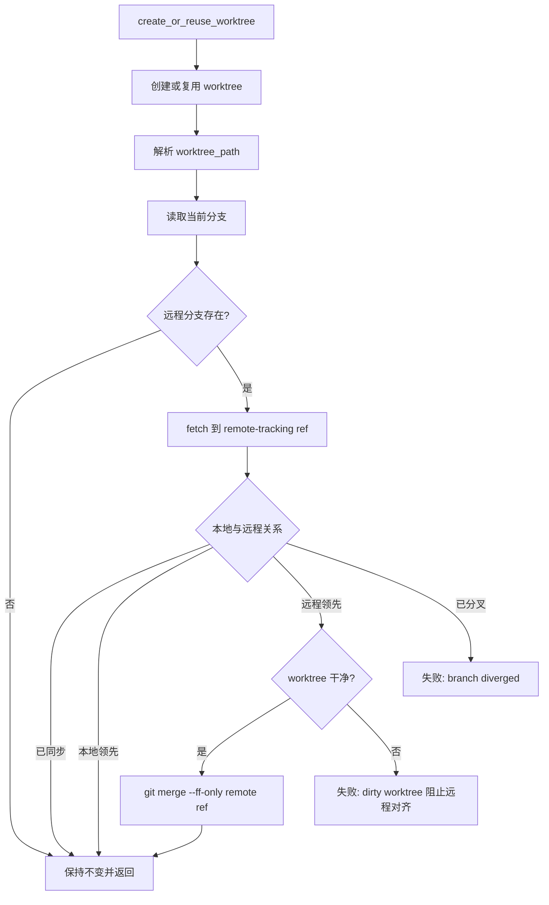

# PRD: Agent Runner Worktree 远程分支安全对齐

- GitHub Issue: https://github.com/zata-zhangtao/keda/issues/71

## 1. Introduction & Goals

### 问题说明

`create_or_reuse_worktree()` 会创建或复用某个 issue 对应的 worktree，随后 runner 会立即使用该本地分支执行 agent 实现、发布恢复、代码 review 或 rework。当前 worktree 准备流程在返回 `worktree_path` 前，没有把本地 worktree 分支与配置的远程 PR 分支做安全对齐。

当 `{config.git.remote}/<current-branch>` 已经存在更新提交时，runner 可能仍基于过期的本地状态继续运行。这会让 agent 在旧状态上重复工作，也可能让 runner 误判为“没有产生变更”，而真实的目标分支状态其实已经存在于远程。

本 PRD 只处理远程分支安全对齐问题。另一个独立问题是 repair agent 在没有真实文件变更时仍写入 `.agent-runner/commit-request.json`，该问题不由本 PRD 解决，也不能通过放宽 commit-request 语义来掩盖。

### 目标

- 在 `create_or_reuse_worktree()` 返回前，如果当前 worktree 分支在 `config.git.remote` 上存在对应远程分支，则先 fetch 该远程分支。
- 将本地 `HEAD` 与已 fetch 的远程分支关系分类为：远程分支不存在、已同步、远程领先、本地领先、已分叉。
- 只在安全 fast-forward 场景移动本地 `HEAD`：worktree 必须干净，且本地 `HEAD` 是远程分支的祖先。
- 保留本地未提交变更和本地未发布 commit。
- 对 dirty worktree 或 diverged branch 这类需要 destructive reset、rebase 或人工判断的状态显式失败。
- 使用配置中的 remote 名称，不硬编码 `origin`。

### Proposed Solution Summary

Extend the existing `create_or_reuse_worktree()` preparation path with a core-layer remote branch reconcile helper that fetches the configured remote's same-named branch, classifies local/remote ancestry, and performs only clean fast-forward updates before returning the worktree path. The runner consumes explicit Git state from the configured remote and current branch; it does not infer issue branch names or rewrite local history. The user-visible behavior is safer agent execution on reused worktrees while preserving local-ahead commits and dirty worktrees. This avoids a separate sync service, destructive reset, automatic rebase, or changes to publish/rebase recovery semantics.

### Realistic Validation

除单元测试和集成测试外，本 PRD 要求通过**真实项目入口点**验证关键行为，确保真实使用路径生效，而非仅在隔离 helper 中通过。

- [x] **Run worktree preparation 真实验证**：通过 `uv run pytest tests/test_run_agent.py -k "worktree_reconcile" -v` 中调用 `run_once()` 的真实用例入口，使用真实 Git 仓库/裸远程和 mocked GitHub/agent 边界，验证 ready issue 在 agent 执行前完成远程分支对齐。
- [x] **复用 worktree 真实验证**：通过真实 Git 临时仓库创建已存在 worktree，再推进远程同名分支，运行包含 `create_or_reuse_worktree()` 的 runner 路径，验证 clean local-behind 分支 fast-forward 到远程 HEAD。
- [x] **保护本地状态真实验证**：通过真实 Git 临时仓库制造 dirty worktree、local-ahead、diverged 三类状态，验证 runner 不执行 destructive reset，且 dirty/diverged 给出明确失败。
- [x] **为什么单元测试不够**：单元测试可以验证命令序列，但不能证明 Git refspec、remote-tracking ref、fast-forward 判定和真实 worktree 状态在实际 Git 仓库中正确工作。

### Delivery Dependencies

- Group: agent-runner-worktree-safety
- Depends on groups:
  - none
- Depends on tasks/issues:
  - none
- Gate type: none
- Notes: Related PRDs touch other worktree lifecycle moments, but this PRD can be implemented independently because it only changes pre-agent worktree preparation.

## 2. Requirement Shape

- **执行者 (Actor)**: Agent runner 的 worktree preparation 路径，主要入口为 `run_agent_once.create_or_reuse_worktree()`，调用者包括 `agent_runner_orchestrate` 和 `review_once`。
- **触发条件 (Trigger)**: runner 开始处理一个 issue，并完成 create/reuse command 后、返回 `worktree_path` 前。
- **预期行为 (Expected Behavior)**: worktree 当前分支与 `{config.git.remote}/<current-branch>` 完成安全 reconcile；只有 clean fast-forward 场景移动本地 `HEAD`。
- **范围边界 (Scope Boundary)**: 仅处理 worktree 准备阶段的远程分支对齐；不改变 agent commit proxy、pre-push review、post-PR repair/rebase、push、PR 创建逻辑。

## 3. Repository Context And Architecture Fit

### 当前相关模块

| 文件 | 职责 |
|------|------|
| `src/backend/core/use_cases/run_agent_once.py` | `create_or_reuse_worktree()`、Git 状态 helper、commit proxy、publish helper 所在文件 |
| `src/backend/core/use_cases/agent_runner_orchestrate.py` | ready/running issue 编排入口，依赖 `create_or_reuse_worktree()` 返回可用 worktree |
| `src/backend/core/use_cases/review_once.py` | review/rework 入口，也复用 `create_or_reuse_worktree()` |
| `src/backend/core/shared/models/agent_runner.py` | `GitConfig.remote` 和 worktree command 配置 |
| `scripts/worktree/create.sh` | 新建 worktree 时同步 base branch remote-tracking ref，但不负责复用 worktree 的 issue branch reconcile |
| `docs/guides/agent-runner.md` | 当前文档明确说明复用 worktree 不自动 rebase/reset，需要随行为变化更新 |
| `tests/test_run_agent.py` | runner use case 单元/集成测试集中位置 |
| `tests/test_worktree_create_script.py` | Shell create script 的真实 Git 测试，作为 base branch fetch 行为参考 |

### 现有架构模式

- Git 操作通过 `IProcessRunner` 在 core use case 内编排，符合 `run_agent_once.py` 现有模式。
- `pr_supervisor.execute_rebase()` 已在 core 层通过 `process_runner.run(["git", ...])` 执行 fetch/rebase，但它解决的是 PR 后 rebase，不应复用于 worktree preparation。
- `scripts/worktree/create.sh` 负责物理 worktree 创建和 base branch 起点；Python runner 负责 issue workflow 状态判断和安全门禁。

### 所有权与依赖边界

- 新增逻辑应留在 `src/backend/core/use_cases/run_agent_once.py`，作为 `create_or_reuse_worktree()` 的内部辅助函数。
- 不新增 service、module 或 class，避免把单一 Git reconcile 逻辑抽象成并行系统。
- `core` 层只能依赖 `core/shared/interfaces` 和现有 use case helper，不导入 `engines`、`infrastructure`、`api`。
- 不修改 `scripts/worktree/create.sh` 的 base branch fetch 行为；本 PRD 关注 create/reuse 后的当前分支 reconcile。

### Existing PRD Relationship

- Related to archived `tasks/archive/P2-FEAT-20260610-144433-iar-worktree-cleanup.md`; cleanup owns post-close local worktree deletion, while this PRD owns pre-agent branch freshness and can run independently.
- Related to `tasks/pending/P1-BUG-20260528-095136-agent-runner-rebase-detached-head-branch-guard.md`; both protect Git worktree safety, but this PRD runs before agent execution and the rebase PRD runs during conflict recovery.
- Related to `tasks/pending/P1-BUG-20260527-093356-agent-runner-ci-rework-state-recovery.md`; both affect runner recovery safety, but this PRD does not require workflow helper changes.
- Does not duplicate or block any pending PRD.

### Potential Redundancy Risks

- Do not add a separate worktree synchronization service for a single branch reconcile step.
- Do not move issue branch reconcile into `scripts/worktree/create.sh`; that script does not cover reused worktrees.
- Do not share this helper with post-PR rebase code until real duplication exists, because preparation and conflict recovery have different safety semantics.

## 4. Recommendation

### Recommended Approach

在 `create_or_reuse_worktree()` 获取 `worktree_path` 后调用 `_reconcile_worktree_with_remote_branch()`。

核心策略：

1. 读取当前 worktree 分支名，默认通常是 `issue-{issue.number}`，但不硬编码该名称。
2. 使用 `config.git.remote` 作为 remote 名称。
3. 先检查远程同名分支是否存在；不存在时 no-op。
4. fetch 远程同名分支到 `refs/remotes/{remote}/{branch}`，不移动本地 branch。
5. 读取本地 `HEAD` 和 remote-tracking ref。
6. 根据 `git merge-base --is-ancestor` 分类：
   - `HEAD == remote`: no-op
   - `HEAD` 是 remote 的祖先：worktree 必须 clean，然后 fast-forward 到 remote
   - remote 是 `HEAD` 的祖先：本地已有未发布 commit，保留，用于现有 publish recovery 路径
   - 两者分叉：失败并要求人工处理
7. 如果 worktree dirty 且需要移动 `HEAD`，直接失败；禁止 reset、rebase 或 merge 覆盖本地改动。

### Why This Is The Best Fit

- 只扩展 worktree preparation 的既有路径，所有调用者自动受益。
- 保留现有 publish recovery 语义：本地领先远程时不回滚本地 commit。
- 避免 `git reset --hard` 造成静默数据丢失。
- 保持 `scripts/worktree/create.sh` 的职责稳定，不把 runner workflow 状态判断塞进 shell 脚本。
- 使用真实 Git ancestor 判断，避免用 `local_sha != remote_sha` 把 local-ahead、remote-ahead、diverged 混为一类。

### Rationale For Rejecting Redundant Abstractions

- 不新增 worktree sync service；当前单一入口可以作为 `create_or_reuse_worktree()` 的 file-private helper。
- 不扩展 shell create script；Python runner 才有 issue workflow、remote config 和错误传播上下文。
- 不自动 rebase/diverged 分支；这会把 preparation 变成历史改写流程。

### Alternatives Considered

**方案 B：无条件 `git reset --hard {remote}/{branch}`**

- 拒绝原因：会丢弃 dirty worktree 和本地未发布 commit，且与 runner 的发布恢复路径冲突。

**方案 C：自动 rebase local-ahead 或 diverged branch**

- 拒绝原因：rebase 是发布/修复阶段的显式行为，worktree preparation 不应改写本地历史或解决冲突。

**方案 D：在 `scripts/worktree/create.sh` 中实现 issue branch reconcile**

- 拒绝原因：该脚本只覆盖新建 worktree；复用 worktree 属于 Python runner 流程。把 reconcile 放进 Python 层更容易测试、记录错误，并复用 `config.git.remote`。

## 5. Implementation Guide

本节是基于当前仓库分析形成的动态实施指南。如果实现过程中发现额外受影响文件、隐藏依赖、边界情况或更合适的路径，应先更新本 PRD 再继续实现。

### Core Logic

```text
create_or_reuse_worktree(repo_path, issue, config, process_runner)
  ├─ 执行 create_command
  ├─ 如果 create 失败，执行 reuse_command
  ├─ 执行 path_command 并解析 worktree_path
  ├─ _reconcile_worktree_with_remote_branch(worktree_path, config, process_runner)
  │    ├─ current_branch = git branch --show-current
  │    ├─ remote = config.git.remote
  │    ├─ 如果远程分支不存在：no-op
  │    ├─ fetch 精确分支到 refs/remotes/{remote}/{current_branch}
  │    ├─ 分类本地 HEAD 与远程 ref 的关系
  │    ├─ 如果已同步：no-op
  │    ├─ 如果本地落后且 worktree clean：git merge --ff-only {remote_ref}
  │    ├─ 如果本地落后但 worktree dirty：失败
  │    ├─ 如果本地领先：no-op
  │    └─ 如果已分叉：失败
  └─ 返回 worktree_path
```

### Change Impact Tree

```text
src/backend/core/use_cases/run_agent_once.py
  [修改] create_or_reuse_worktree()
    解析 worktree_path 后调用远程分支 reconcile
  [新增] _reconcile_worktree_with_remote_branch()
    编排安全 fetch、关系分类、fast-forward 行为
  [可选新增] 小型 Git helper
    保持 file-private 和命令导向，不新增抽象层

tests/test_run_agent.py
  [新增] 命令流和错误信息单元测试
  [新增] remote-ahead、local-ahead、dirty、diverged 的真实 Git 集成测试
  [新增] run_once 级测试，证明 agent 调用前已完成 reconcile

docs/guides/agent-runner.md
  [修改] worktree 行为说明
    记录复用 worktree 的安全远程分支 reconcile 行为
```

### Executor Drift Guard

Run these searches before editing because the listed files are starting points, not an exhaustive guarantee:

```bash
rg -n "create_or_reuse_worktree|path_command|reuse_command|worktree_path" src tests docs
rg -n "config.git.remote|merge-base|ff-only|remote-tracking|dirty worktree|diverged" src tests docs tasks/pending
```

If validation fails in real Git fixtures, first inspect `create_or_reuse_worktree()` call order in `src/backend/core/use_cases/run_agent_once.py`, then custom worktree commands in config fixtures, then the precise `git fetch` refspec and remote-tracking ref naming. Do not weaken dirty/diverged refusal to make a flaky fixture pass.

### Flow Diagram



### Realistic Validation Plan

| 行为 | 真实入口点 | 测试层级 | Mock 边界 | 所需数据/环境 | 命令或流程 | 是否验收必需 |
|------|------------|----------|-----------|---------------|------------|--------------|
| `run_once()` 在 agent 执行前把 ready issue 准备到最新远程分支 | pytest 中调用 `backend.core.use_cases.agent_runner_orchestrate.run_once()` | Integration | Mock GitHub client 和 agent command；真实 Git repo、真实 bare remote、真实 worktree | 临时 repo、等价 `.iar.toml` 配置、远程分支领先本地 worktree | `uv run pytest tests/test_run_agent.py -k "worktree_reconcile_run_once" -v` | Yes |
| 复用的 clean worktree 在远程分支领先时 fast-forward | 通过配置的 create/reuse/path command 调用 `create_or_reuse_worktree()` | Integration | 使用真实 Git command；不需要外部 GitHub | 临时 repo、bare remote、已存在 worktree | `uv run pytest tests/test_run_agent.py -k "worktree_reconcile_remote_ahead" -v` | Yes |
| local-ahead worktree 被保留，用于发布恢复 | `create_or_reuse_worktree()` | Integration | 真实 Git command；仅在命令路径设置不相关时 mock process runner | 本地分支有远程没有的 commit | `uv run pytest tests/test_run_agent.py -k "worktree_reconcile_local_ahead" -v` | Yes |
| dirty 或 diverged worktree 显式失败 | `create_or_reuse_worktree()` | Integration | 真实 Git command | 临时 repo，制造 dirty file、remote-ahead、diverged branch 状态 | `uv run pytest tests/test_run_agent.py -k "worktree_reconcile_dirty or worktree_reconcile_diverged" -v` | Yes |
| 全量回归仍通过 | 仓库测试命令 | Regression | 沿用现有测试套件边界 | 现有本地开发环境 | `just test` | Yes |

### Low-Fidelity Prototype

```python
def _reconcile_worktree_with_remote_branch(
    worktree_path: Path,
    config: AppConfig,
    process_runner: IProcessRunner,
) -> None:
    """Safely reconcile the current worktree branch with its remote branch."""
    branch = get_current_branch(worktree_path, process_runner)
    remote = config.git.remote
    remote_ref = f"{remote}/{branch}"
    remote_tracking_ref = f"refs/remotes/{remote}/{branch}"

    if not _remote_branch_exists(worktree_path, remote, branch, process_runner):
        return

    _fetch_remote_branch(
        worktree_path,
        remote,
        branch,
        remote_tracking_ref,
        process_runner,
    )

    local_sha = get_head_sha(worktree_path, process_runner)
    remote_sha = _rev_parse(worktree_path, remote_ref, process_runner)
    if local_sha == remote_sha:
        return

    local_is_ancestor = _is_ancestor(
        worktree_path, local_sha, remote_ref, process_runner
    )
    remote_is_ancestor = _is_ancestor(
        worktree_path, remote_sha, "HEAD", process_runner
    )

    if local_is_ancestor:
        if has_changes(worktree_path, process_runner):
            raise RuntimeError(
                f"Worktree branch {branch} is behind {remote_ref}, "
                "but the worktree has uncommitted changes."
            )
        process_runner.run(["git", "merge", "--ff-only", remote_ref], cwd=worktree_path)
        return

    if remote_is_ancestor:
        return

    raise RuntimeError(
        f"Worktree branch {branch} has diverged from {remote_ref}; "
        "manual reconciliation is required."
    )
```

### ER Diagram

不适用。本变更不引入持久化数据或 schema 变更。

### Interactive Prototype Change Log

不适用。本变更没有 UI 或 prototype artifact。

### External Validation

未使用外部网络调研。仓库代码、仓库文档和通过本地集成测试验证的 Git 行为足以支撑本 PRD。

## 6. Definition Of Done

- [x] `create_or_reuse_worktree()` 在返回 `worktree_path` 前调用 reconcile helper。
- [x] Reconcile 使用 `config.git.remote` 和真实当前分支名。
- [x] Clean local-behind worktree 会 fast-forward 到已 fetch 的远程分支。
- [x] Dirty local-behind 和 diverged worktree 会以可行动错误失败，而不是 reset。
- [x] Local-ahead worktree 保持不变，继续支持现有发布恢复行为。
- [x] 更新 `docs/guides/agent-runner.md` 中相关说明。
- [x] Reconcile 相关 targeted tests 通过。
- [x] `just test` 通过。
- [x] 架构检查通过，且没有新增跨层 import。

## 7. Acceptance Checklist

### Architecture Acceptance

- [x] 新增逻辑保留在 `src/backend/core/use_cases/run_agent_once.py`。
- [x] 不新增 service class、module、infrastructure adapter 或外部依赖。
- [x] `core` 层 import 方向保持合法。
- [x] Worktree shell script 继续只负责创建和 base branch 起点准备。

### Behavior Acceptance

- [x] 远程分支名称基于当前 worktree 分支；默认 `issue-{n}` 行为仍然有效。
- [x] Remote 名称来自 `config.git.remote`；测试覆盖非 `origin` remote。
- [x] 远程分支不存在时 no-op。
- [x] Clean local branch behind remote 时 fast-forward 到 remote HEAD。
- [x] Local branch ahead of remote 时保留本地分支。
- [x] Dirty worktree 永不被 reset 或覆盖。
- [x] Diverged branch 给出明确错误，要求人工 reconcile。
- [x] 已确认需要检查远程分支后，network/fetch failure 不会静默放行过期状态。

### Validation Acceptance

- [x] 单元测试覆盖命令序列和错误信息。
- [x] 真实 Git 集成测试覆盖 remote-ahead、local-ahead、dirty、missing-remote-branch、diverged 状态。
- [x] `run_once()` 级测试证明 reconcile 发生在 agent invocation 之前。
- [x] `uv run pytest tests/test_run_agent.py -k "worktree_reconcile" -v` 通过。
- [x] 完成 PRD 前 `just test` 通过。

### Documentation Acceptance

- [x] `docs/guides/agent-runner.md` 不再声称复用 worktree 永远不会自动 reconcile。
- [x] 文档明确说明安全行为：只 fast-forward、保留 local-ahead、dirty/diverged 时失败。

## 8. Functional Requirements

| ID | 需求 |
|----|-------------|
| FR-1 | `create_or_reuse_worktree()` MUST 在解析 `worktree_path` 后、返回前调用 file-private reconcile helper。 |
| FR-2 | Reconcile helper MUST 从 Git 读取当前分支，不得硬编码 `issue-{issue.number}`。 |
| FR-3 | Reconcile helper MUST 使用 `config.git.remote`，不得硬编码 `origin`。 |
| FR-4 | 如果配置 remote 上不存在当前分支，reconcile MUST no-op 并保持 worktree 不变。 |
| FR-5 | 如果远程分支存在，reconcile MUST 先 fetch 到 `refs/remotes/{remote}/{branch}`，再比较 SHA。 |
| FR-6 | 如果本地 `HEAD` 等于已 fetch 的 remote ref，reconcile MUST no-op。 |
| FR-7 | 如果本地 `HEAD` 是已 fetch remote ref 的祖先，且 worktree clean，reconcile MUST fast-forward 本地分支到 remote ref。 |
| FR-8 | 如果本地 `HEAD` 是已 fetch remote ref 的祖先，但 worktree dirty，reconcile MUST 抛出可行动错误，且 MUST NOT reset files。 |
| FR-9 | 如果已 fetch remote ref 是本地 `HEAD` 的祖先，reconcile MUST 保持本地分支不变。 |
| FR-10 | 如果本地和远程已分叉，reconcile MUST 抛出可行动错误，且 MUST NOT rebase、merge、reset 或 push。 |
| FR-11 | 对于已存在远程分支的 fetch/network failure，MUST 暴露为失败，不得静默让 agent 基于过期状态运行。 |

## 9. Non-Goals

- 不改变 `.agent-runner/commit-request.json` 语义。
- 不让空 commit request 成功。
- 不修改 `pr_supervisor.execute_rebase()` 或 repair/rebase conflict handling。
- 不新增独立 worktree synchronization service。
- 不实现自动冲突解决、自动 rebase 或自动 force-push。
- 不改变 `scripts/worktree/create.sh` 的 base branch sync 行为。

## 10. Risks And Follow-Ups

### 风险

- **远程分支 force-push**：force-push 后的分支可能表现为与本地 diverged。正确安全行为是失败并要求人工决策。
- **Dirty recovery worktree**：一些过去会继续执行的 dirty worktree，现在如果需要移动远程状态会更早失败。这是为了避免丢失本地改动。
- **Remote 可用性**：fetch/network error 会阻塞自动化，但让无人值守 agent 基于过期分支继续执行风险更高。
- **可配置 worktree command**：自定义 command 可能创建非 `issue-{n}` 命名的分支。读取当前分支可以避免 helper 绑定默认命名。

### 后续事项

- 单独新增 PRD 处理 repair-agent no-op 行为：repair prompt 应允许“无需修改”且不写 `.agent-runner/commit-request.json`，runner 应把它报告为 no-op repair，而不是 commit failure。
- 只有当实现后出现有意义的重复逻辑时，再考虑与 `pr_supervisor` 共享 Git relation helper。
- 可后续考虑添加 operator-facing diagnostic command，但不要放入本次最小变更。

## 11. Decision Log

| ID | 决策点 | 选择 | 拒绝 | 理由 |
|----|----------|--------|----------|-----------|
| D-01 | Reconcile 位置 | Python `create_or_reuse_worktree()` | `scripts/worktree/create.sh` | Python 路径覆盖 create 和 reuse，并可使用 runner config/tests。 |
| D-02 | 分支名来源 | 当前 Git 分支 | 硬编码 `issue-{number}` | Worktree command 可配置；当前分支才是真实状态。 |
| D-03 | Remote 来源 | `config.git.remote` | 硬编码 `origin` | 仓库可能使用 `zata` 等 remote；config 是 source of truth。 |
| D-04 | 安全移动策略 | 仅 clean fast-forward | 无条件 `reset --hard` | 保留 dirty worktree 和本地未发布 commit。 |
| D-05 | Local-ahead 处理 | 保留并 no-op | reset 到 remote | 现有 publish recovery 依赖本地领先 base/remote 的 commit。 |
| D-06 | Diverged 处理 | 显式失败 | 自动 rebase 或 merge | Preparation 不应改写历史或解决冲突。 |
| D-07 | 空 repair commit-request | 作为后续事项处理 | 合并到本 PRD | 这是另一个协议问题，不应被 worktree reconcile 掩盖。 |
