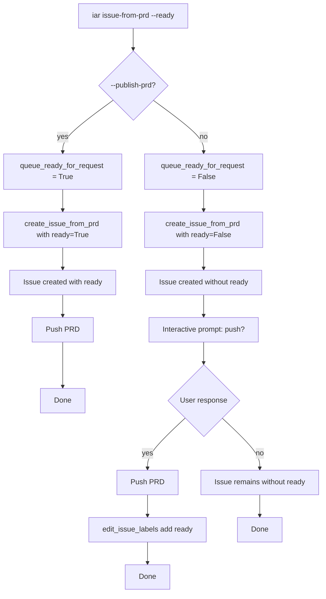

# PRD: issue-from-prd Interactive Ready Label Deferral

## 1. Introduction & Goals

### Problem Statement

当前 `iar issue-from-prd --ready`（不带 `--publish-prd`）存在时序缺陷：

1. `create_issue_from_prd` 在 `build_issue_labels` 中判断 `queue_ready=True` 且 `publish_prd=False`，于是在**创建 Issue 时直接带上 `agent/ready`**。
2. 随后 `write_issue_link` 把 Issue URL 回写到本地 PRD，但**PRD 尚未 push**。
3. CLI 进入 `_prompt_and_publish_prd_if_needed`，询问用户是否 commit/push。

这意味着：从 Issue 创建完成到用户确认 push（甚至用户选择不 push）之间，runner 可能已经通过 `agent/ready` 拾取了该 Issue，但 worktree 中读到的 PRD 是**旧版本或完全不存在**的（如果 PRD 是全新文件）。

### Measurable Objectives

- 不带 `--publish-prd` 但带 `--ready` 时，Issue 创建时**不含** `agent/ready` 标签。
- 交互式 push 成功后，`agent/ready` 被补加。
- 交互式 push 被拒绝或失败时，Issue 保持**非 ready** 状态。
- `--publish-prd --ready` 的行为不变（仍由 `create_issue_from_prd` 内部在 push 后加 ready）。

### Realistic Validation

除单元测试外，本 PRD 要求通过真实 CLI 入口验证关键行为：

- [x] **不带 --publish-prd 的 --ready 延迟验证**：通过 `iar issue-from-prd --ready` 创建 Issue，确认 Issue 初始不含 `agent/ready`，交互式 push 后才添加。
- [x] **push 拒绝后保持非 ready 验证**：用户拒绝 push 时，Issue 保持非 ready 状态。
- [x] **--publish-prd --ready 行为不变验证**：确认 `--publish-prd --ready` 仍由 `create_issue_from_prd` 内部在 push 后加 ready。
- [x] **为什么单元测试不够**：CLI 交互涉及 stdin/stdout、进程退出码、真实 Git 工作区状态，需要端到端验证。

---

## 2. Requirement Shape

- **Actor**: 使用 `iar issue-from-prd --ready` 的开发者
- **Trigger**: 执行 `iar issue-from-prd tasks/pending/xxx.md --ready`（不带 `--publish-prd`）
- **Expected Behavior**: Issue 先创建（不带 ready）→ 交互式询问 push → push 成功后补 ready；push 失败/拒绝则保持非 ready
- **Scope Boundary**: 仅修改 CLI 层的参数传递和日志输出；不改动 `create_issue_from_prd` 的 core 逻辑。

---

## 3. Repository Context And Architecture Fit

### Existing Relevant Modules

| 文件 | 角色 |
|------|------|
| `src/backend/api/cli.py` | CLI 入口，包含 `_prompt_and_publish_prd_if_needed` 函数 |
| `src/backend/core/use_cases/create_issue_from_prd.py` | 核心 use case，包含 `create_issue_from_prd`、`build_issue_labels`、`IssueFromPrdRequest` |
| `src/backend/core/shared/models/agent_runner.py` | `LabelConfig` 模型 |
| `tests/test_agent_runner_cli.py` | CLI 集成测试 |
| `tests/test_create_issue_from_prd.py` | use case 单元测试 |

### Key Code Locations

**`build_issue_labels` 在 `create_issue_from_prd.py:270-309`：**
```python
def build_issue_labels(
    request: IssueFromPrdRequest, effective_labels_config: LabelConfig
) -> list[str]:
    labels = [f"type/{request.issue_type}", "status/backlog", "source/prd"]
    # 仅在用户显式要求且本次命令不发布 PRD 时才添加 "ready"。
    # 当 publish_prd=True 时，ready 在 push 成功*之后*再添加。
    if request.queue_ready and not request.publish_prd:
        labels.append(effective_labels_config.ready)
    # ...
    return labels
```

**`_prompt_and_publish_prd_if_needed` 在 `cli.py:61-97`：**
```python
def _prompt_and_publish_prd_if_needed(
    *,
    queue_ready: bool,
    # ...
) -> bool:
    # ...询问用户...
    if queue_ready:
        github_client.edit_issue_labels(
            parse_issue_number(issue_url),
            add=[labels_config.ready],
        )
    return True
```

**CLI `issue-from-prd` 处理逻辑在 `cli.py:341-401`：**
```python
# 当不显式 --publish-prd 时，先把 queue_ready 压成 False，
# 避免 Issue 还没发布就已经 ready。
# 交互式 prompt 在 push 成功后再补 ready。
queue_ready_for_request = parsed.ready if parsed.publish_prd else False
issue_url = create_issue_from_prd(
    request=IssueFromPrdRequest(
        queue_ready=queue_ready_for_request,
        # ...
    ),
    # ...
)
```

### Architecture Patterns To Preserve

1. **CLI Layer Gating**：CLI 决定传给 core use case 的参数；core 保持纯净。
2. **Idempotent Label Operations**：`edit_issue_labels` 是幂等的；添加已存在的标签是安全的。
3. **Request Object Pattern**：`IssueFromPrdRequest` 封装所有入参。
4. **Four-Layer Dependency**：CLI (api) → use case (core) → interfaces → engines/infrastructure。

### Ownership And Dependency Boundaries

```
cli.py (api layer)
  ├─ 根据 parsed.ready 和 parsed.publish_prd 决定 queue_ready_for_request
  ├─ 调用 create_issue_from_prd 时传入被压制的 queue_ready
  └─ 调用 _prompt_and_publish_prd_if_needed 时传入原始 queue_ready
       └─ push 成功后调用 github_client.edit_issue_labels 添加 ready
```

---

## 4. Recommendation

### Recommended Approach

**在 CLI 层推迟 `queue_ready`，当 `publish_prd=False` 时。**

当 `publish_prd=False` 时，传 `queue_ready=False` 给 `create_issue_from_prd`，让 Issue 先以非 ready 状态创建。交互式 prompt 仍接收 `queue_ready=True`，在 push 成功后通过 `edit_issue_labels` 补 ready。

**改动点：**

1. **`cli.py`**：`queue_ready_for_request = parsed.ready if parsed.publish_prd else False`
2. **`cli.py`**：接收 `_prompt_and_publish_prd_if_needed` 的返回值，判断是否需要打印 "without ready" 日志

### Why This Is The Best Fit

- **最小改动**：只影响 CLI 交互路径；core 逻辑不变。
- **保持 API 契约**：`build_issue_labels` 语义不变；非 CLI 调用者不受影响。
- **职责清晰**：CLI 层负责 gating 决策；core 保持纯业务逻辑。

### Alternatives Considered

| 替代方案 | 拒绝原因 |
|----------|----------|
| 修改 `build_issue_labels` 永远不在创建时加 ready | 破坏现有 API 契约；影响依赖当前行为的非 CLI 调用者 |
| 给 `IssueFromPrdRequest` 新增 `defer_ready` 参数 | 参数膨胀；CLI 通过传不同的 `queue_ready` 即可达到同样效果 |

---

## 5. Implementation Guide

This section is a living implementation guide based on current repository analysis. If implementation discovers additional affected files, hidden dependencies, edge cases, or a better path, update this PRD before proceeding.

### 5.1 Core Logic

```
issue-from-prd 命令在 cli.py 中:
  1. 解析 CLI 参数 (parsed.ready, parsed.publish_prd)

  2. queue_ready_for_request = parsed.ready if parsed.publish_prd else False

  3. issue_url = create_issue_from_prd(
       request=IssueFromPrdRequest(
         queue_ready=queue_ready_for_request,  # 无 --publish-prd 时被压制
         publish_prd=parsed.publish_prd,
         ...
       ),
       ...
     )

  4. published = False
     if not parsed.publish_prd:
       published = _prompt_and_publish_prd_if_needed(
         queue_ready=parsed.ready,  # 原始值
         ...
       )

  5. if not parsed.ready or (parsed.ready and not parsed.publish_prd and not published):
       logger.info("Issue created without '%s' label...", context.config.labels.ready)
```

### 5.2 Change Impact Tree

```text
.
├── src/backend/api/
│   └── cli.py
│       [修改]
│       【总结】CLI 层推迟 ready 标签，交互式 push 后再补 ready
│
│       ├── 新增 queue_ready_for_request = parsed.ready if parsed.publish_prd else False
│       ├── create_issue_from_prd 调用时传入 queue_ready_for_request
│       ├── _prompt_and_publish_prd_if_needed 调用时传入原始 parsed.ready
│       └── 根据 published 结果决定是否打印 "without ready" 日志
│
└── tests/
    └── test_agent_runner_cli.py
        [新增]
        【总结】验证 CLI 层 ready 推迟逻辑
│
        ├── test_main_issue_from_prd_ready_without_publish_defers_label
        └── test_main_issue_from_prd_ready_with_publish_keeps_label
```

### 5.3 Executor Drift Guard

The file list above is the expected implementation surface from current repository analysis.

| Check | Command | Expected Result | If It Fails, Inspect First |
|-------|---------|----------------|----------------------------|
| CLI issue-from-prd handling | `rg -n "issue-from-prd" src/backend/api/cli.py` | Command handler exists | Parser definition, subcommand routing |
| queue_ready_for_request logic | `rg -n "queue_ready_for_request" src/backend/api/cli.py` | Variable assignment present | CLI argument parsing |
| build_issue_labels condition | `rg -n "queue_ready and not request.publish_prd" src/backend/core/use_cases/create_issue_from_prd.py` | Condition exists in label builder | Label building logic |

Search verification commands:
```bash
rg -n "queue_ready_for_request" src/backend/api/cli.py
rg -n "def build_issue_labels" src/backend/core/use_cases/create_issue_from_prd.py
rg -n "def _prompt_and_publish_prd_if_needed" src/backend/api/cli.py
```

### 5.4 Flow Or Architecture Diagram



### 5.5 Realistic Validation Plan

| Behavior | Real Entry Point | Test Layer | Mock Boundary | Data/Env Needed | Command Or Procedure | Required For Acceptance |
|----------|------------------|------------|---------------|-----------------|---------------------|--------------------------|
| --ready without --publish-prd defers label | `iar issue-from-prd --ready` | integration | Fake GitHub client, Fake process runner | Fake PRD file, clean git worktree | `uv run pytest tests/test_agent_runner_cli.py -k "ready_without_publish" -q` | Yes |
| --ready with --publish-prd keeps label | `iar issue-from-prd --ready --publish-prd` | integration | Fake GitHub client, Fake process runner | Fake PRD file, staged changes | `uv run pytest tests/test_agent_runner_cli.py -k "ready_with_publish" -q` | Yes |
| Push rejection preserves non-ready | `_prompt_and_publish_prd_if_needed` | unit | Mock stdin returning "n" | Fake git status with changes | `uv run pytest tests/test_create_issue_from_prd.py -k "prompt" -q` | Yes |
| Full regression | repository command | regression | Normal project mocks | Local dev environment | `just test` | Yes |

Failure triage:
- If `test_main_issue_from_prd_ready_without_publish_defers_label` fails, inspect `queue_ready_for_request` assignment in `cli.py`.
- If `test_main_issue_from_prd_ready_with_publish_keeps_label` fails, inspect `create_issue_from_prd` call arguments.

### 5.6 External Validation

- No external validation required; repository evidence was sufficient.

---

## 6. Definition Of Done

- [x] CLI 层正确推迟 `queue_ready`，当 `publish_prd=False` 时。
- [x] 交互式 prompt 在 push 成功后添加 ready。
- [x] push 被拒绝时 Issue 保持非 ready。
- [x] `--publish-prd --ready` 行为不变。
- [x] `just test` 全量通过。
- [x] 日志消息正确指示 "without ready"。

---

## 7. Acceptance Checklist

### Architecture Acceptance

- [x] 改动仅限于 `cli.py`；未修改 `create_issue_from_prd.py` core 逻辑。
- [x] 四层依赖方向保持（api → core → interfaces → engines）。

### Behavior Acceptance

- [x] 不带 `--publish-prd` 但带 `--ready` 时，Issue 创建时不含 `agent/ready`。
- [x] 交互式 push 成功后添加 `agent/ready`。
- [x] 交互式 push 被拒绝时 Issue 保持非 ready。
- [x] `--publish-prd --ready` 行为不变（仍由 `create_issue_from_prd` 在 push 后加 ready）。
- [x] 不带 `--ready` 时，日志指示 "without ready"。

### Validation Acceptance

- [x] `uv run pytest tests/test_agent_runner_cli.py tests/test_create_issue_from_prd.py -q` 通过。
- [x] `just test` 通过（345 passed）。

---

## 8. Functional Requirements

- **FR-1**: 当 `--ready` 传入但无 `--publish-prd` 时，`create_issue_from_prd` 必须收到 `queue_ready=False`。
- **FR-2**: `_prompt_and_publish_prd_if_needed` 必须收到原始的 `parsed.ready` 值。
- **FR-3**: 交互式 prompt 中 push 成功后，必须通过 `edit_issue_labels` 添加 `agent/ready`。
- **FR-4**: 当 push 被拒绝或失败时，Issue 必须保持无 `agent/ready`。
- **FR-5**: 当使用 `--publish-prd --ready` 时，行为必须与原来一致。

---

## 9. Non-Goals

- 不修改 `build_issue_labels` core 逻辑。
- 不给 `IssueFromPrdRequest` 新增参数。
- 不改变非 CLI 调用者的行为。
- 不影响 `iar daemon` 或 `iar run-once` 行为。

---

## 10. Risks And Follow-Ups

| 风险 | 影响 | 缓解 |
|------|--------|------------|
| 现有测试假设旧行为 | 改动后测试可能失败 | 更新测试期望以匹配新的推迟行为 |
| 非 CLI 调用者期望不同行为 | 外部工具可能受影响 | 文档说明仅 CLI 变更；core API 契约不变 |

---

## 11. Decision Log

| # | Decision Question | Chosen | Rejected | Rationale |
|---|------------------|--------|----------|-----------|
| D-01 | Where to defer ready | CLI 层压制 `queue_ready` | 修改 `build_issue_labels` | 最小改动；保持 core API 契约；仅影响 CLI 交互路径 |
| D-02 | How to communicate suppression | 给 use case 和 prompt 传不同的 `queue_ready` | 新增 `defer_ready` 参数 | 避免参数膨胀；用现有参数即可达到同样效果 |
| D-03 | Log message timing | 交互式 prompt 完成后打印 "without ready" | Issue 创建时打印 | 用户需要知道所有决策完成后的最终状态 |
