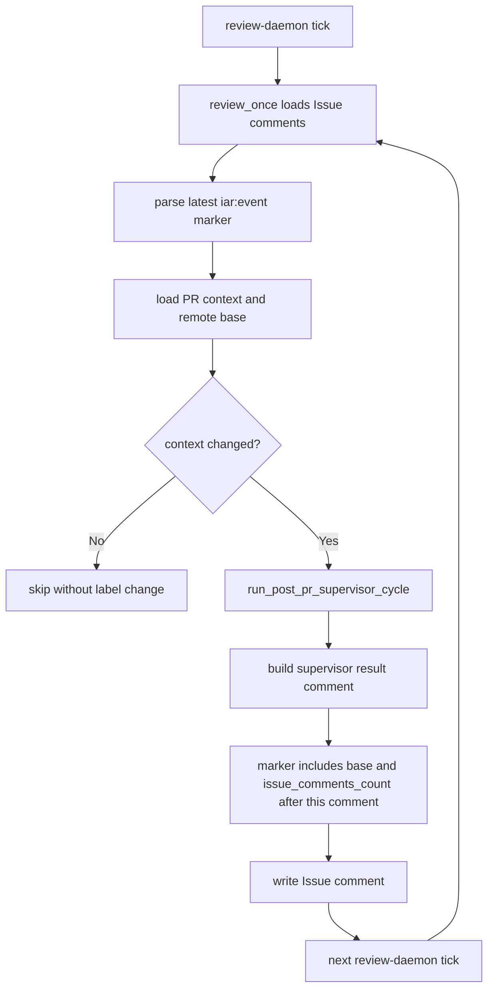

# PRD: Agent Runner Supervisor Cursor Self-Loop Fix

## 1. Introduction & Goals

`iar review-once` / `iar review-daemon` 会持续扫描处于 `agent/supervising` 或 `agent/review` 的 open Issue，并通过最新 `iar:event` marker 判断 PR context 是否变化。真实 Issue 历史显示，post-PR supervisor 在已经 `approve_for_human_review` 后仍反复运行，产生大量重复的 `Agent Runner Post-PR Supervisor` 评论和 label 切换。

根因有两个：

1. `post_pr_supervisor` result marker 没有写入 remote base SHA，后续 `review_once._context_changed_wide(...)` 比较 `last_marker.base_sha` 与 remote base SHA 时会把缺失值判定为变化。
2. supervisor result marker 记录的是写入当前结果评论之前的 Issue comment 数量；下一轮轮询会把 supervisor 自己刚写入的结果评论误判为新评论。

本 PRD 记录并约束一个已完成的最小修复切片：

1. `post_pr_supervisor` result marker 写入 remote base SHA。
2. result marker 的 Issue comment cursor 记录为写入 supervisor result 评论后的数量。
3. `review_once` 在 remote base SHA 不可读时不因空字符串触发重复重审。
4. 增加回归测试，覆盖 supervisor 自己写出的结果评论不会触发下一轮 review。
5. 更新 Agent Runner operator 文档，说明 Issue comment cursor 语义。

### Realistic Validation

除单元测试和集成测试外，本 PRD 要求通过**真实项目入口点**验证关键行为，确保真实使用路径生效，而非仅在隔离 fixture 中通过。

- [x] **review-once cursor 行为验证**：通过 `uv run pytest tests/test_pr_supervisor.py tests/test_review_once.py -q` 验证 `post_pr_supervisor` marker 写入 base/comment cursor，且 supervisor 自己的结果评论不会触发下一轮重审。
- [x] **真实仓库测试入口验证**：通过 `just test` 验证 lint、架构检查、PRD checklist 检查和全量 pytest 均通过。
- [x] **为什么不直接运行 live `iar review-once`**：真实 `iar review-once` 会修改 GitHub Issue labels/comments 并可能调用 agent；本修复通过 core use case 的真实轮询路径 fixture 复现状态机行为，避免对 live Issue 继续制造重复评论。

## 2. Requirement Shape

**Actor**：运行 `iar review-once` / `iar review-daemon` 的本地 Agent Runner operator。

**Trigger**：

- Issue 已有关联 open PR。
- Issue 处于 `agent/supervising` 或 `agent/review`。
- 最新 Issue comment 是 `phase=post_pr_supervisor` 的 `iar:event` marker。
- PR head/checks/mergeability/base/comment count 相对该 marker 没有真实变化。

**Expected Behavior**：

- `review_once` 应返回 `skipped_context_unchanged`，不重新调用 supervisor agent。
- Issue label 不应从 `agent/review` 切回 `agent/supervising`。
- 不应新增重复的 `Agent Runner Post-PR Supervisor` 评论。
- 当 PR head、remote base、checks、mergeability、人类 Issue comment 或 PR comment 真实变化时，仍应触发 supervisor cycle。

**Explicit Scope Boundary**：

- 不改变 `agent/review` 仍可被 `review-daemon` 观察的设计。
- 不新增数据库、本地 state 文件、队列、webhook 或后台服务。
- 不改变 rework/rebase/repair action 语义。
- 不实现完整 event history scanner；继续使用最新 `iar:event` marker 作为 cursor。
- 不对真实 GitHub Issue 执行 live mutation validation 作为必需验收项。

## 3. Repository Context And Architecture Fit

### Current Relevant Modules And Files

| Path | Current Role | Change Relationship |
|---|---|---|
| `src/backend/core/use_cases/pr_supervisor.py` | post-PR supervisor prompt、action parse、result comment 写入 | 修正 result marker 的 `base` 和 Issue comment cursor |
| `src/backend/core/use_cases/review_once.py` | review polling 单次处理和 context change 判断 | 避免 remote base SHA 空值导致重复重审 |
| `tests/test_pr_supervisor.py` | supervisor cycle tests | 覆盖 result marker 写入 base/comment cursor |
| `tests/test_review_once.py` | review-once polling tests | 覆盖 supervisor result comment 不触发下一轮重审 |
| `docs/guides/agent-runner.md` | Agent Runner operator 文档 | 记录 comment cursor 语义 |

### Existing Path

最接近本需求的现有路径是：

```text
iar review-once / review-daemon
  -> review_once._process_review_candidate(...)
  -> review_once._context_changed_wide(...)
  -> pr_supervisor.run_post_pr_supervisor_cycle(...)
  -> pr_supervisor.build_supervisor_result_comment(...)
  -> GitHub Issue comment marker
```

### Reuse Candidates

- 复用现有 `ReviewEventMarker` 的 `base_sha` 和 `issue_comments_count` 字段，不新增 cursor model。
- 复用现有 `format_event_marker(...)` / `parse_latest_event_marker(...)` marker contract。
- 复用现有 `FakeGitHubClient` / `FakeProcessRunner`，通过 core use case 级测试覆盖状态机。
- 复用 `docs/guides/agent-runner.md` 的 review-daemon 说明，不新增文档页。

### Architecture Constraints

- 变更属于 Agent Runner 核心编排逻辑，应留在 `src/backend/core/use_cases/`。
- `src/backend/core/` 不得导入 `backend.infrastructure`、`backend.engines` 或 `backend.api`。
- GitHub Issue comments 仍是跨机器 runner 的 durable cursor，不引入本地文件作为唯一状态源。
- 文档变更应同步到 `docs/guides/agent-runner.md`，无需更新 `mkdocs.yml` 导航。

### Potential Redundancy Risks

- 新增数据库或本地 JSON state 会复制 Issue comment marker 的职责。
- 新增“忽略所有 Agent Runner 评论”的全局过滤器会误伤 rework intent marker。
- 只在文档要求 operator 手动移除 `agent/review` 无法解决 daemon 自动轮询中的幂等问题。

## 4. Recommendation

### Recommended Approach

采用最小修复路径：

1. 扩展 `build_supervisor_result_comment(...)`，允许传入 `base_sha` 并写入 marker。
2. `run_post_pr_supervisor_cycle(...)` 使用已读取的 `base_sha_remote` 填充 result marker。
3. `run_post_pr_supervisor_cycle(...)` 将 `issue_comments_count` 写为 `len(issue_comments) + 1`，表示 result comment 写入后的 cursor。
4. `_context_changed_wide(...)` 仅在 `base_sha_remote` 非空时比较 base SHA，避免远端 base 读取失败导致假变化。
5. 增加 focused regression tests，并同步 operator 文档。

### Why This Is The Best Fit

- 修复直接落在已有 marker 写入与 marker 比较路径，最小化状态机改动。
- 不改变 `agent/review` 可被持续观察的设计，保留 review-daemon 对真实 PR 变化的响应能力。
- 不新增外部依赖、存储或服务，符合当前 CLI-first Agent Runner 架构。
- 旧 marker 兼容：已有缺失 `base` 或旧 comment count 的 Issue 最多再触发一轮，写出新 marker 后即可收敛。

### Rationale For Rejecting Redundant Abstractions

- 拒绝新增 persistent cursor store：GitHub Issue comments 已是跨机器可审计状态源。
- 拒绝把 `agent/review` 改成终止态：设计上 human review 期间仍需要观察新 CI、base、PR/Issue comments。
- 拒绝删除 Issue comment count 触发条件：人类补充需求或 reviewer 评论仍应重新触发 supervisor。

### Alternatives Considered

| Alternative | Why Rejected |
|---|---|
| `review_once` 不再扫描 `agent/review` | 会破坏已设计的 human-review 期间持续观察能力，无法响应新 CI/base/comment 变化 |
| 过滤所有包含 `Agent Runner Post-PR Supervisor` 的评论 | 粗粒度过滤会绕开 marker contract，且无法解决 `base_sha` 缺失造成的循环 |
| 引入本地 state 文件记录最后 review cursor | 多机 runner 和 GitHub 审计需要以 Issue comment 为准，本地文件会产生状态分裂 |

## 5. Implementation Guide

This section is a living implementation guide based on current repository analysis. If implementation discovers additional affected files, hidden dependencies, edge cases, or a better path, update this PRD before proceeding.

### Core Logic

#### Supervisor Result Marker

Search anchors:

```bash
rg -n "build_supervisor_result_comment|run_post_pr_supervisor_cycle|issue_comments_count|base_sha_remote" src/backend/core/use_cases tests
```

Required behavior:

- `build_supervisor_result_comment(...)` accepts `base_sha` and passes it to `format_event_marker(...)`.
- `run_post_pr_supervisor_cycle(...)` writes `base_sha=base_sha_remote` into the marker.
- `run_post_pr_supervisor_cycle(...)` writes `issue_comments_count=len(issue_comments) + 1`.
- Existing rework intent comments are not changed.

#### Review Context Comparison

Search anchors:

```bash
rg -n "_context_changed_wide|base_sha_remote|skipped_context_unchanged" src/backend/core/use_cases tests
```

Required behavior:

- `last_marker.head_sha` remains a strict comparison against current PR head.
- `last_marker.base_sha` is compared only when remote base SHA is available.
- `issue_comments_count` and `pr_comments_count` still trigger re-review when real new comments appear after the marker cursor.
- A latest supervisor result marker that already accounts for itself must not trigger another supervisor cycle.

### Change Impact Tree

```text
.
├── Domain
│   ├── src/backend/core/use_cases/pr_supervisor.py
│   │   [修改]
│   │   【总结】让 post-PR supervisor result marker 写入 remote base 和写后 comment cursor。
│   │
│   │   ├── build_supervisor_result_comment accepts base_sha
│   │   ├── marker includes base=...
│   │   └── issue_comments_count records len(issue_comments) + 1
│   │
│   └── src/backend/core/use_cases/review_once.py
│       [修改]
│       【总结】remote base SHA 不可读时不把空值当作 context 变化。
│
│       └── compare marker base only when current remote base SHA is available
│
├── Tests
│   ├── tests/test_pr_supervisor.py
│   │   [修改]
│   │   【总结】验证 supervisor cycle 写出的 marker 包含 base 和写后 Issue comment cursor。
│   │
│   └── tests/test_review_once.py
│       [修改]
│       【总结】覆盖 supervisor 自己写出的 result comment 不会触发下一轮 review。
│
└── Docs
    └── docs/guides/agent-runner.md
        [修改]
        【总结】说明 review-daemon 的 Issue comment cursor 语义和自写评论不会触发重审。
```

### Executor Drift Guard

- Run `rg -n "issue_comments_count=len\\(issue_comments\\)" src tests` and confirm no supervisor result path still writes the pre-comment count.
- Run `rg -n "base_sha=base_sha_remote|base_sha_remote and last_marker.base_sha" src tests` and confirm result marker writes remote base while comparison tolerates unavailable remote base.
- Run `rg -n "post_pr_supervisor|skipped_context_unchanged|Agent Runner Post-PR Supervisor" tests` and confirm tests cover the self-comment skip path.
- If future work adds a new supervisor result comment builder, require it to pass through the same `iar:event` cursor contract.

### Flow Diagram



### Realistic Validation Plan

| Behavior | Real Entry Point | Test Layer | Mock Boundary | Data/Env Needed | Command Or Procedure | Required For Acceptance |
|---|---|---|---|---|---|---|
| Supervisor result marker cursor | pytest through `run_post_pr_supervisor_cycle(...)` | unit/use-case | Agent command and GitHub comments mocked at process/client boundary | Fake Issue/PR context and fake GitHub client | `uv run pytest tests/test_pr_supervisor.py -q` | Yes |
| Review polling skips self-written supervisor comment | pytest through `_process_review_candidate(...)` | use-case integration | GitHub PR context and comments mocked; core state machine real | Fake draft PR comment plus supervisor result comment | `uv run pytest tests/test_review_once.py -q` | Yes |
| Focused Agent Runner review regression | pytest through related supervisor/review suites | use-case integration | Existing fake clients/runners only | Local Python/uv environment | `uv run pytest tests/test_pr_supervisor.py tests/test_review_once.py -q` | Yes |
| Full repository regression | Repository test entry | full local regression | Existing test fakes only; no live external writes | Local Python/uv/just environment | `just test` | Yes |
| Optional live daemon observation | CLI command against disposable GitHub Issue/PR | manual/sandbox | No mock; writes labels/comments and may invoke agent | Disposable Issue/PR; operator opt-in | `IAR_LIVE_GITHUB_VALIDATION=1 uv run iar review-once --max-issues 1` against disposable repo | No |

Failure triage:

- If self-comment skip fails, inspect `build_supervisor_result_comment(...)` marker fields before changing label transitions.
- If base comparison loops when `origin/main` is unavailable, inspect `_context_changed_wide(...)` and `GitHubCliClient.get_remote_base_sha(...)`.
- If `just test` fails in PRD checks, inspect this archived PRD checklist and task archive rules before touching runtime code.

### Low-Fidelity Prototype

No UI or multi-step human interaction changes in this PRD.

### ER Diagram

No data model changes in this PRD.

### Interactive Prototype Change Log

No interactive prototype file changes in this PRD.

### External Validation

No external validation required; repository evidence and local tests were sufficient.

## 6. Definition Of Done

- `post_pr_supervisor` result marker includes remote base SHA when available.
- `post_pr_supervisor` result marker records Issue comment cursor after its own comment is written.
- `review_once` does not treat unavailable remote base SHA as a context change.
- Existing true-change triggers remain intact for PR head, base, checks, mergeability, Issue comments, and PR comments.
- Focused supervisor/review tests pass.
- `just test` passes.
- Operator documentation explains the comment cursor behavior.
- No architecture dependency rule is violated.

## 7. Acceptance Checklist

### Architecture Acceptance

- [x] Changes remain in `src/backend/core/use_cases/`, `tests/`, and `docs/`.
- [x] No `src/backend/api/`, `src/backend/engines/`, or `src/backend/infrastructure/` changes are required.
- [x] No new database, local state file, queue, webhook, service, API route, or dependency is introduced.
- [x] GitHub Issue comments remain the durable cross-runner cursor source.

### Dependency Acceptance

- [x] `src/backend/core/` does not import `backend.infrastructure`, `backend.engines`, or `backend.api`.
- [x] Tests reuse existing `FakeGitHubClient` and `FakeProcessRunner`.
- [x] No new Python or npm dependency is added.

### Behavior Acceptance

- [x] `build_supervisor_result_comment(...)` supports `base_sha` and writes it into the marker.
- [x] `run_post_pr_supervisor_cycle(...)` passes `base_sha_remote` into the result marker.
- [x] `run_post_pr_supervisor_cycle(...)` writes `issue_comments_count=len(issue_comments)+1` for result comments.
- [x] `_context_changed_wide(...)` compares base SHA only when current remote base SHA is non-empty.
- [x] A latest supervisor result comment that already accounts for itself produces `skipped_context_unchanged`.
- [x] The self-comment skip path does not edit Issue labels.
- [x] True new Issue comments after the marker cursor still trigger supervisor review.

### Documentation Acceptance

- [x] `docs/guides/agent-runner.md` describes Issue comment cursor comparison.
- [x] `docs/guides/agent-runner.md` states supervisor result comments account for themselves and do not trigger the next review pass.

### Validation Acceptance

- [x] `uv run pytest tests/test_pr_supervisor.py tests/test_review_once.py -q` passes.
- [x] `just test` passes.
- [x] `git diff --check` passes.
- [x] This PRD is archived with all Acceptance Checklist items complete.

## 8. Functional Requirements

**FR-1**: `build_supervisor_result_comment(...)` must support writing a `base` marker field.

**FR-2**: `run_post_pr_supervisor_cycle(...)` must use `get_remote_base_sha(...)` output as the supervisor result marker base SHA.

**FR-3**: `run_post_pr_supervisor_cycle(...)` must record the Issue comment count that will be true after the supervisor result comment is written.

**FR-4**: `_context_changed_wide(...)` must not report a base change when the current remote base SHA cannot be read.

**FR-5**: A latest `post_pr_supervisor` marker whose head, base, checks, mergeability, Issue comment cursor, and PR comment cursor match the current context must produce no supervisor rerun.

**FR-6**: A real new Issue comment after the marker cursor must still trigger a supervisor rerun.

**FR-7**: A real new PR comment after the marker cursor must still trigger a supervisor rerun.

**FR-8**: The fix must not change rework intent marker semantics.

**FR-9**: The fix must not change `approve_for_human_review`, `repair_pr_branch`, `rebase_pr_branch`, or `resolve_conflict` action meanings.

## 9. Non-Goals

- Do not stop scanning `agent/review` Issues.
- Do not remove Issue comment count as a review trigger.
- Do not add a persistent database, local JSON state file, or separate cursor store.
- Do not rewrite the broader label state machine.
- Do not implement a full historical marker scanner in this PRD.
- Do not require live GitHub mutation validation for acceptance.

## 10. Risks And Follow-Ups

- Existing Issues with old-format `post_pr_supervisor` markers may run one more supervisor cycle before writing a new marker and converging.
- If `get_remote_base_sha(...)` repeatedly returns empty due to local remote state, base changes cannot be detected until the remote ref is available; head/check/comment changes still work.
- A future event marker schema version could make count-based cursor semantics clearer, but the current fix intentionally stays within version 1 marker fields.

## 11. Decision Log

| ID | Decision | Chosen | Rejected | Rationale |
|---|---|---|---|---|
| D-01 | Cursor storage | Continue using Issue comment `iar:event` marker fields | Add database or local state file | Issue comments are already the durable, auditable, cross-machine state source for runner polling. |
| D-02 | Self-comment handling | Record `issue_comments_count` after writing the supervisor result comment | Filter all supervisor result comments during comparison | Updating the cursor keeps the existing count-based trigger while avoiding special-case comment classification. |
| D-03 | Base SHA handling | Write remote base SHA into supervisor result markers | Ignore base SHA changes entirely | Base changes are a legitimate reason to re-run supervisor, so the marker should include the observed base. |
| D-04 | Missing remote base behavior | Skip base comparison when current remote base SHA is unavailable | Treat empty remote base as a context change | Empty remote base is an observation failure, not proof that the PR context changed. |
| D-05 | PRD placement | Archive this completed bugfix PRD | Add a completed PRD under `tasks/pending/` | Repository rules require completed PRD tasks to have checked acceptance items and live under `tasks/archive/`. |
