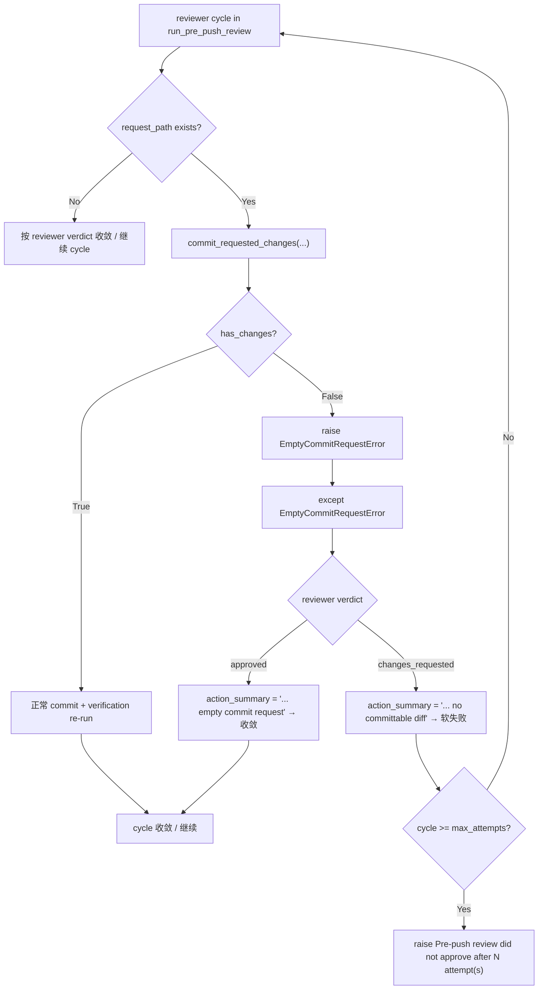

# PRD: Pre-Push Review Empty Commit Request Hard Fail

## 1. Introduction & Goals

Pre-push review 在 `run_pre_push_review(...)` 内会让 reviewer 写 `.agent-runner/commit-request.json` 来表达"我修改了 worktree，请帮我 commit"。当 reviewer 写了 commit-request 但工作树没有实际文件改动（例如 reviewer 的建议与当前现状一致，或上一轮 cycle 已经把修复提交了），`commit_requested_changes(...)` 会抛 `RuntimeError("Agent requested a commit but produced no file changes.")`。

这条 RuntimeError 会被 `run_pre_push_review` 的 `except Exception` 兜底分支捕获，错误归类为 `reviewer patch failed to commit`，并最终抛出 `Pre-push review repair failed: ...` 硬失败，让整个 runner 停下来。

Issue #5 的真实运行日志就是被这条硬失败挡住的：reviewer 写了一个空 commit request（剩余 review 项与现状一致或已经收敛），但 runner 仍然把它当成 patch 失败，导致后续的 `publish_changes` / Draft PR 创建无法推进。

根因有两层：

1. `commit_requested_changes(...)` 的失败信号过于粗糙：没有区分"无 commit request"（合理 review 路径）、"branch mismatch / forbidden path / verification 失败"（必须升级为硬失败）、"空 commit request"（良性 no-op）。
2. `run_pre_push_review(...)` 用 `except Exception` 把"无内容可提交"也当成了 patch 失败，错误地把 reviewer 解析出的真实 verdict（approved / changes_requested）丢掉。

本 PRD 记录并约束一个已完成的最小修复切片：

1. 在 `agent_runner_commit.py` 引入 `EmptyCommitRequestError(RuntimeError)` 子类，承载"写了 commit request 但无文件改动"这一特定信号；同时导出 `EMPTY_COMMIT_REQUEST_MESSAGE` 常量以兼容 `is_recoverable_commit_request_error(...)` 基于 message 前缀的旧逻辑。
2. `commit_requested_changes(...)` 在检测到空提交请求时改抛 `EmptyCommitRequestError`；其他失败（branch mismatch、invalid commit request）继续抛 `RuntimeError`。
3. `run_pre_push_review(...)` 在 reviewer 写了 commit-request 的分支里 `except EmptyCommitRequestError`：回退到 reviewer 解析出的真实 verdict，approved 时直接收敛，changes_requested 时继续循环并在用尽次数后走"did not approve after N attempts"软失败路径。
4. `run_agent_once.py` 重新导出 `EmptyCommitRequestError`，保持公共 use case 入口的导出契约。
5. 增加回归测试：覆盖 approved + 空 commit request 收敛、changes_requested + 空 commit request 软失败两条路径。
6. 同步 operator 文档：在 `docs/guides/agent-runner.md` 的 pre-push review 章节注明"空 commit request 会按 reviewer 真实 verdict 收敛 / 软失败，不会触发硬失败"。

### Realistic Validation

除单元测试外，本 PRD 要求通过**真实项目入口点**验证关键行为：

- [x] **Pre-push review 空 commit request 行为验证**：通过 `uv run pytest tests/test_agent_review.py -q` 验证 reviewer 写空 commit request 时的 approved 收敛路径和 changes_requested 软失败路径。
- [x] **真实仓库测试入口验证**：通过 `just test` 验证 lint、架构检查、PRD checklist 检查和全量 pytest 均通过。
- [x] **现有失败分类回归验证**：通过 `uv run pytest tests/test_agent_runner_failure.py -q` 验证 `is_recoverable_commit_request_error(...)` 在收到 `EmptyCommitRequestError` 时仍把它分类为可恢复（保持原 message 字符串 `"Agent requested a commit but produced no file changes."`）。
- [x] **为什么不直接运行 live `iar run-once`**：真实 `iar run-once` 会修改 GitHub Issue labels/comments 并可能调用 agent；本修复通过 core use case 的真实 review-loop 路径 fixture 复现状态机行为，避免对 live Issue 制造重复事件。

## 2. Requirement Shape

**Actor**：运行 `iar run-once`、本地 Agent Runner operator，以及查看 GitHub Issue 评论的开发者。

**Trigger**：

- Pre-push review 被配置启用（`pre_push_review.enabled=true`）。
- Reviewer 决定修改 worktree 并写出 `.agent-runner/commit-request.json`。
- 移除 commit-request 文件后，`git status --porcelain` 返回空（无任何可提交改动）。

**Expected Behavior**：

- `commit_requested_changes(...)` 抛 `EmptyCommitRequestError`（`RuntimeError` 的子类），而不是泛化的 `RuntimeError`。
- 异常 message 仍为固定字符串 `"Agent requested a commit but produced no file changes."`，保证 `is_recoverable_commit_request_error(...)` 仍能识别为空 commit request。
- `run_pre_push_review(...)` 捕获 `EmptyCommitRequestError` 后：
  - 若 reviewer verdict 是 `approved` → 写一条"reviewer approved with an empty commit request"的 Issue comment 并正常 return，循环收敛。
  - 若 reviewer verdict 是 `changes_requested` → 写一条"reviewer requested changes but produced no committable diff"的 Issue comment，记录为 `last_failure_summary`，进入下一轮 cycle；用尽 `max_attempts` 后抛 `Pre-push review did not approve after N attempt(s): ...` 软失败。
- 不应再出现 `Pre-push review repair failed: Agent requested a commit but produced no file changes.` 这类把空请求当成 patch 失败的硬失败。

**Explicit Scope Boundary**：

- 不修改 `is_recoverable_commit_request_error(...)` 的判定逻辑（仍按 message 前缀匹配）。
- 不修改 reviewer prompt、verdict schema、commit-request schema。
- 不修改 post-PR supervisor 的 empty commit request 处理路径（若 supervisor 之后也走到相同代码，需在后续 PRD 单独评估；本 PRD 范围限于 `run_pre_push_review`）。
- 不修改 `run_agent_once` 主路径对空 commit request 的处理（已通过 `is_recoverable_commit_request_error` 正确分类为 `UNCOMMITTED_CHANGES`）。
- 不新增数据库、本地 state 文件、外部依赖。
- 不改变 `agent/running` label 语义。

## 3. Repository Context And Architecture Fit

### Current Relevant Modules And Files

| Path | Current Role | Change Relationship |
|---|---|---|
| `src/backend/core/use_cases/agent_runner_commit.py` | reviewer 修改后的 commit proxy：`has_changes` 校验、`git add`、verification re-run、commit | 引入 `EmptyCommitRequestError` 子类；空提交时改抛新异常；导出符号 |
| `src/backend/core/use_cases/agent_review.py` | pre-push review 主循环 | 在 reviewer 写 commit-request 的分支里 `except EmptyCommitRequestError` 并按 verdict 收敛/软失败 |
| `src/backend/core/use_cases/run_agent_once.py` | 公共 use case 入口与符号 re-export | 重新导出 `EmptyCommitRequestError`，保持模块契约 |
| `src/backend/core/use_cases/agent_runner_failure.py` | 失败分类与 `is_recoverable_commit_request_error` | 不修改；依赖新异常保持原 message 字符串 |
| `tests/test_agent_review.py` | pre-push review 集成测试 | 覆盖 approved + 空 commit request 收敛、changes_requested + 空 commit request 软失败 |
| `tests/test_agent_runner_failure.py` | 失败分类测试 | 验证空 commit request 仍被分类为 `UNCOMMITTED_CHANGES` |
| `docs/guides/agent-runner.md` | Agent Runner operator 文档 | pre-push review 章节注明空 commit request 不会触发硬失败 |

### Existing Path

最接近本需求的现有路径是：

```text
iar run-once
  -> run_pre_push_review(...)
  -> reviewer cycle
  -> reviewer 写 .agent-runner/commit-request.json
  -> commit_requested_changes(...)
       -> has_changes(worktree_path)  # False
       -> raise RuntimeError("Agent requested a commit but produced no file changes.")
  -> except Exception  # 兜底 → 当成 patch 失败
  -> raise RuntimeError("Pre-push review repair failed: ...")
```

### Reuse Candidates

- 复用现有 `EmptyCommitRequestError` 与 `RuntimeError` 的继承关系（`class EmptyCommitRequestError(RuntimeError)`），让所有 `except RuntimeError` 与 `is_recoverable_commit_request_error` 的 message 前缀匹配保持兼容。
- 复用现有 reviewer 解析出的 `reviewer_decision.verdict`（`approved` / `changes_requested`），不再需要新增加 verdict enum。
- 复用现有 `FakeGitHubClient` / `FakeProcessRunner` 写两个 use case 级测试覆盖新分支。
- 复用 `docs/guides/agent-runner.md` 的 pre-push review 章节作为文档更新位置，不新增独立文档页。

### Architecture Constraints

- 变更属于 Agent Runner 核心编排逻辑，应留在 `src/backend/core/use_cases/`。
- `src/backend/core/` 不得导入 `backend.infrastructure`、`backend.engines` 或 `backend.api`。
- 公共异常类必须从 `__all__` 导出，并在公共入口（`run_agent_once.py`）re-export，保持符号契约。
- 文档变更应同步到 `docs/guides/agent-runner.md`，无需更新 `mkdocs.yml` 导航（PRDs 不在导航内）。

### Potential Redundancy Risks

- 新增一个独立的"review-loop empty commit handler" 模块会复制 reviewer verdict 解析的职责，应保留在 `agent_review.py` 主循环。
- 把 `commit_requested_changes(...)` 改成在空提交时返回 `None` 会让 caller 失去"已清理 commit-request 文件"的语义信号；保留异常更明确。
- 在 `is_recoverable_commit_request_error(...)` 中加入 `isinstance(exc, EmptyCommitRequestError)` 短路会与现有 message 前缀匹配产生双轨逻辑；继续依赖 message 字符串可以保证零行为漂移。

## 4. Options And Recommendation

### Option A：最小异常子类 + 现有 review loop 分支处理（推荐）

1. 在 `agent_runner_commit.py` 定义 `EmptyCommitRequestError(RuntimeError)`，固定 message。
2. `commit_requested_changes(...)` 在 `has_changes` 为 False 时改抛 `EmptyCommitRequestError()`。
3. `run_pre_push_review(...)` 的 reviewer 写 commit-request 分支新增 `except EmptyCommitRequestError`，按 reviewer verdict 收敛 / 软失败。
4. 文档同步更新 pre-push review 章节。

**优点**：改动面最小，复用现有 verdict 解析、`is_recoverable_commit_request_error`、review loop 结构。

**缺点**：依赖 message 字符串保持原值，跨模块修改时需要小心别改 message。

### Option B：把空 commit request 改造成 reviewer verdict 之一

把"写了 commit request 但无文件改动"建模成 reviewer 的一个新 verdict（例如 `noop_requested`），由 reviewer 自己显式表达。

**优点**：更显式地让 reviewer 表达意图。

**缺点**：增加 reviewer prompt 与 schema 的复杂度；空 commit request 本质上是 reviewer 与 worktree 状态不一致的副作用，不应让 reviewer 承担这一信号的语义；reviewer 仍可能写出空 commit request；会让现有的 verdict 解析与回退逻辑需要新加分支。

### Option C：删除 reviewer 写 commit-request 的能力

让 reviewer 只能通过 `changes_requested` 表达"我要改 worktree"，由 runner 自己 diff 并决策是否 commit。

**优点**：消除空 commit request 类别。

**缺点**：破坏现有 reviewer 协议；reviewer 无法表达"我已经把改动写好了但需要 runner 提交"的语义；改动面过大，超出本 PRD 的 bug 修复范围。

### Recommendation

采用 **Option A**：最小异常子类 + 现有 review loop 分支处理。理由：

- 直接落在已有的 commit proxy 失败分类与 reviewer verdict 解析路径，最小化状态机改动。
- 通过 `EmptyCommitRequestError(RuntimeError)` 子类化与固定 message 字符串，零行为漂移地兼容 `is_recoverable_commit_request_error(...)` 与既有 `except RuntimeError` 捕获。
- 不修改 reviewer 协议、verdict schema、commit-request schema，避免引入跨模块语义风险。
- 与最近归档的 `P1-BUG-20260610-094420-agent-runner-supervisor-cursor-self-loop.md`（post-PR supervisor cursor 自循环）形成对称：cursor 自循环修的是 supervisor 状态机，空 commit request 硬失败修的是 pre-push review 状态机。

## 5. Implementation Guide

This section is a living implementation guide based on current repository analysis. If implementation discovers additional affected files, hidden dependencies, edge cases, or a better path, update this PRD before proceeding.

### Core Logic

#### Commit Proxy Empty Request Signal

Search anchors:

```bash
rg -n "commit_requested_changes|has_changes|EmptyCommitRequestError|EMPTY_COMMIT_REQUEST_MESSAGE" src/backend/core/use_cases tests
```

Required behavior:

- `agent_runner_commit.py` 新增 `class EmptyCommitRequestError(RuntimeError)`，默认 message 为 `EMPTY_COMMIT_REQUEST_MESSAGE = "Agent requested a commit but produced no file changes."`。
- `commit_requested_changes(...)` 在 `not has_changes(worktree_path, process_runner)` 时改抛 `EmptyCommitRequestError()`。
- `__all__` 导出 `EmptyCommitRequestError` 与 `EMPTY_COMMIT_REQUEST_MESSAGE`。

#### Pre-Push Review Loop

Search anchors:

```bash
rg -n "run_pre_push_review|cycle_verdict|reviewer patched and runner committed" src/backend/core/use_cases tests
```

Required behavior:

- `run_pre_push_review(...)` 在 reviewer 写 commit-request 的 `try` 块里新增 `except EmptyCommitRequestError` 分支：
  - `cycle_verdict = reviewer_decision.verdict`（覆盖先前被 `request_path.is_file()` 强制设置的 `changes_requested`）。
  - approved：`action_summary = "reviewer approved with an empty commit request"`，进入既有收敛判断。
  - changes_requested：`action_summary = "reviewer requested changes but produced no committable diff"`，记录到 `last_failure_summary`，继续 cycle。
- 不再被泛化的 `except Exception` 升级为 `Pre-push review repair failed`。

#### Public Re-Export

Search anchors:

```bash
rg -n "from backend.core.use_cases.agent_runner_commit import" src tests
```

Required behavior:

- `run_agent_once.py` 从 `agent_runner_commit` 导入 `EmptyCommitRequestError`，加入 `__all__`。

#### Test Coverage

Search anchors:

```bash
rg -n "test_run_pre_push_review|empty_commit_request|FakeProcessRunner" tests/test_agent_review.py
```

Required behavior:

- `test_run_pre_push_review_empty_commit_request_with_approval_converges`：空 commit request + approved verdict → 不抛异常、head 未推进、Issue comment 包含 `"empty commit request"`。
- `test_run_pre_push_review_empty_commit_request_changes_requested_soft_fails`：空 commit request + changes_requested verdict + `max_attempts=1` → 抛 `Pre-push review did not approve after ...` 而非 `Pre-push review repair failed: ...`，Issue comment 包含 `"produced no committable diff"`。

### Change Impact Tree

```text
Domain
├── src/backend/core/use_cases/agent_runner_commit.py
│   [修改]
│   【总结】新增 EmptyCommitRequestError 子类并在 has_changes=False 时改抛
│
│   ├── class EmptyCommitRequestError(RuntimeError)
│   ├── EMPTY_COMMIT_REQUEST_MESSAGE 常量
│   ├── __all__ 导出新符号
│   └── commit_requested_changes 在 has_changes=False 时 raise EmptyCommitRequestError()
│
├── src/backend/core/use_cases/agent_review.py
│   [修改]
│   【总结】pre-push review loop 按 reviewer verdict 收敛/软失败空 commit request
│
│   ├── import EmptyCommitRequestError
│   ├── except EmptyCommitRequestError 分支
│   │   ├── approved → 收敛，action_summary = "reviewer approved with an empty commit request"
│   │   └── changes_requested → 软失败路径，action_summary = "reviewer requested changes but produced no committable diff"
│   └── 不再被 except Exception 升级为 "Pre-push review repair failed"
│
├── src/backend/core/use_cases/run_agent_once.py
│   [修改]
│   【总结】重新导出 EmptyCommitRequestError，保持公共 use case 入口契约
│
│   └── __all__ 增加 "EmptyCommitRequestError"
│
├── src/backend/core/use_cases/agent_runner_failure.py
│   [未改]
│   【总结】继续依赖 message 前缀匹配；EmptyCommitRequestError 保持原 message 字符串
│
├── Tests
│   ├── tests/test_agent_review.py
│   │   [修改]
│   │   【总结】覆盖 approved + 空 commit request 收敛、changes_requested + 空 commit request 软失败
│   │   │
│   │   ├── test_run_pre_push_review_empty_commit_request_with_approval_converges
│   │   └── test_run_pre_push_review_empty_commit_request_changes_requested_soft_fails
│   │
│   └── tests/test_agent_runner_failure.py
│       [验证]
│       【总结】回归验证 is_recoverable_commit_request_error 仍把空 commit request 分类为可恢复
│
└── Docs
    └── docs/guides/agent-runner.md
        [修改]
        【总结】pre-push review 章节注明空 commit request 不会触发硬失败，按 reviewer 真实 verdict 收敛/软失败
```

### Executor Drift Guard

- Run `rg -n "class EmptyCommitRequestError|EmptyCommitRequestError" src tests` and confirm the new exception class and re-exports exist in `agent_runner_commit.py`, `agent_review.py`, `run_agent_once.py`.
- Run `rg -n "EMPTY_COMMIT_REQUEST_MESSAGE|Agent requested a commit but produced no file changes" src tests` and confirm the message string is preserved for `is_recoverable_commit_request_error`.
- Run `rg -n "Pre-push review repair failed" tests` and confirm no new test asserts the old hard-fail path is triggered.
- Run `rg -n "test_run_pre_push_review_empty_commit_request" tests` and confirm both new test cases are present.

### Flow Diagram



### Realistic Validation Plan

| Behavior | Real Entry Point | Test Layer | Mock Boundary | Data/Env Needed | Command Or Procedure | Required For Acceptance |
|---|---|---|---|---|---|---|
| Empty commit request 收敛 | pytest through `run_pre_push_review(...)` | unit/use-case | Agent command and GitHub comments mocked at process/client boundary | Fake Issue/PR context and fake GitHub client | `uv run pytest tests/test_agent_review.py -q` | Yes |
| Empty commit request 软失败 | pytest through `run_pre_push_review(...)` | unit/use-case | Agent command and GitHub comments mocked | Fake Issue/PR context and fake GitHub client | `uv run pytest tests/test_agent_review.py -q` | Yes |
| 失败分类回归 | pytest through `classify_failure(...)` | unit/use-case | Existing fake clients/runners | Local Python/uv environment | `uv run pytest tests/test_agent_runner_failure.py -q` | Yes |
| Full repository regression | Repository test entry | full local regression | Existing test fakes only; no live external writes | Local Python/uv/just environment | `just test` | Yes |
| Optional live run-once observation | CLI command against disposable GitHub Issue | manual/sandbox | No mock; writes labels/comments and may invoke agent | Disposable Issue/PR; operator opt-in | `IAR_LIVE_GITHUB_VALIDATION=1 uv run iar run-once --max-issues 1` against disposable repo | No |

Failure triage:

- 如果 `EmptyCommitRequestError` 仍被当成 patch 失败：检查 `agent_review.py` 的 `except` 顺序，确认 `EmptyCommitRequestError` 分支在 `except Exception` 之前。
- 如果 `is_recoverable_commit_request_error` 不再识别空 commit request：检查 `EmptyCommitRequestError.__init__` 是否仍传入 `EMPTY_COMMIT_REQUEST_MESSAGE` 默认值。
- 如果 `just test` 在 PRD checklist 检查中失败：检查本归档 PRD 的 Acceptance Checklist 全部勾选后再归档。

### Low-Fidelity Prototype

No UI or multi-step human interaction changes in this PRD.

### ER Diagram

No data model changes in this PRD.

### Interactive Prototype Change Log

No interactive prototype file changes in this PRD.

### External Validation

No external validation required; repository evidence and local tests were sufficient.

## 6. Definition Of Done

- `commit_requested_changes(...)` 在 `has_changes` 为 False 时抛 `EmptyCommitRequestError`，message 与原 `RuntimeError` 保持一致。
- `run_pre_push_review(...)` 在 reviewer 写空 commit request 时按 reviewer verdict 收敛或软失败，不再抛 `Pre-push review repair failed: ...`。
- `run_agent_once.py` 重新导出 `EmptyCommitRequestError`，公共 use case 入口符号契约保持完整。
- `is_recoverable_commit_request_error(...)` 在收到 `EmptyCommitRequestError` 时仍把它分类为可恢复（依赖 message 字符串保持原值）。
- 两条新回归测试通过，覆盖 approved 收敛与 changes_requested 软失败路径。
- `docs/guides/agent-runner.md` 的 pre-push review 章节同步更新。
- `just test` 全部通过。
- 不破坏 `src/backend/core/` 的依赖方向约束。

## 7. Acceptance Checklist

### Architecture Acceptance

- [x] Changes remain in `src/backend/core/use_cases/`, `tests/`, and `docs/`.
- [x] No `src/backend/api/`, `src/backend/engines/`, or `src/backend/infrastructure/` changes are required.
- [x] No new database, local state file, queue, webhook, service, API route, or dependency is introduced.
- [x] `EmptyCommitRequestError` is exported from `agent_runner_commit.__all__` and re-exported by `run_agent_once.__all__`.

### Dependency Acceptance

- [x] `src/backend/core/` does not import `backend.infrastructure`, `backend.engines`, or `backend.api`.
- [x] Tests reuse existing `FakeGitHubClient` and `FakeProcessRunner`.
- [x] No new Python or npm dependency is added.

### Behavior Acceptance

- [x] `commit_requested_changes(...)` raises `EmptyCommitRequestError` when `has_changes(...)` returns False.
- [x] `EmptyCommitRequestError` defaults to message `"Agent requested a commit but produced no file changes."`.
- [x] `EmptyCommitRequestError` subclasses `RuntimeError` so existing `except RuntimeError` and `is_recoverable_commit_request_error` keep working.
- [x] `run_pre_push_review(...)` converges when reviewer verdict is `approved` and commit request is empty.
- [x] `run_pre_push_review(...)` soft-fails via "did not approve after N attempts" when reviewer verdict is `changes_requested` and commit request is empty.
- [x] Empty commit request no longer triggers `Pre-push review repair failed: ...` hard failure.
- [x] The commit-request file is still removed before `EmptyCommitRequestError` is raised.
- [x] `is_recoverable_commit_request_error(...)` still classifies empty commit request as recoverable.

### Documentation Acceptance

- [x] `docs/guides/agent-runner.md` pre-push review section notes that empty commit requests converge or soft-fail per reviewer verdict, and never raise `Pre-push review repair failed`.

### Validation Acceptance

- [x] `uv run pytest tests/test_agent_review.py -q` passes with the two new tests.
- [x] `uv run pytest tests/test_agent_runner_failure.py -q` passes (regression).
- [x] `just test` passes.
- [x] `git diff --check` passes.
- [x] This PRD is archived with all Acceptance Checklist items complete.

## 8. Functional Requirements

**FR-1**: `commit_requested_changes(...)` must raise `EmptyCommitRequestError` instead of a generic `RuntimeError` when the worktree has no file changes after the commit-request file is removed.

**FR-2**: `EmptyCommitRequestError` must default to message `"Agent requested a commit but produced no file changes."` and must subclass `RuntimeError`.

**FR-3**: `run_pre_push_review(...)` must catch `EmptyCommitRequestError` separately from other `RuntimeError` / `Exception` paths and must not let it become a `Pre-push review repair failed` hard failure.

**FR-4**: When the reviewer verdict is `approved` and an empty commit request is raised, `run_pre_push_review(...)` must write an `Pre-Push Review Result` comment with action summary `"reviewer approved with an empty commit request"` and return the current head SHA.

**FR-5**: When the reviewer verdict is `changes_requested` and an empty commit request is raised, `run_pre_push_review(...)` must write a `Pre-Push Review Result` comment with action summary `"reviewer requested changes but produced no committable diff"` and continue the cycle; after `max_attempts` it must raise `Pre-push review did not approve after N attempt(s): ...` as a soft failure.

**FR-6**: `run_agent_once.__all__` must continue to expose `EmptyCommitRequestError` as a public symbol.

**FR-7**: `is_recoverable_commit_request_error(...)` must continue to recognize the new exception as a recoverable commit request error.

## 9. Non-Goals

- Do not modify `is_recoverable_commit_request_error(...)` or any other failure classification logic.
- Do not change the reviewer prompt, verdict schema, or commit-request schema.
- Do not add a new reviewer verdict for empty commit requests.
- Do not modify the post-PR supervisor's empty commit request behavior in this PRD; if needed, cover it in a separate PRD.
- Do not add a database, local state file, queue, webhook, or external service.
- Do not change the `agent/running` label semantics or any other Agent Runner label.
- Do not require live GitHub mutation validation for acceptance.

## 10. Risks And Follow-Ups

- If a future refactor renames `EMPTY_COMMIT_REQUEST_MESSAGE` or changes its default value, `is_recoverable_commit_request_error(...)` will silently stop recognizing empty commit requests. A future PRD may add an `isinstance` short-circuit in `is_recoverable_commit_request_error(...)` to make this more robust.
- If the post-PR supervisor path also depends on `commit_requested_changes(...)` and shares the same hard-fail pattern, the same fix may need to be applied there in a follow-up PRD. The current PRD scopes changes to `run_pre_push_review` only.
- If reviewer agents start relying on `EmptyCommitRequestError` to mean "I intentionally wrote an empty request", the verdict semantics may need to be reviewed. Today, the contract is "empty commit request is a benign no-op, not a verdict".

## 11. Decision Log

| ID | Decision | Chosen | Rejected | Rationale |
|---|---|---|---|---|
| D-01 | Empty commit request signal | `EmptyCommitRequestError(RuntimeError)` with fixed message | New `verdict=noop_requested` in reviewer schema | Empty commit request is a side effect of reviewer/worktree state mismatch, not a reviewer intent signal; reviewer should not be asked to express this; the new exception subclasses `RuntimeError` to keep `is_recoverable_commit_request_error(...)` zero-drift. |
| D-02 | Where to handle the signal | New `except EmptyCommitRequestError` branch in `run_pre_push_review` | Catch in `run_agent_once` outer loop | Pre-push review is the only path where empty commit request currently misclassifies as hard failure; catching it at the source preserves the existing `verdict` parsing and the "did not approve after N attempts" soft-fail path. |
| D-03 | Approved + empty commit request outcome | Converge and return current head | Force another review cycle | Reviewer's parsed `verdict=approved` plus no file changes means there is nothing more to commit; re-running the cycle adds no value and could itself produce another empty request. |
| D-04 | Changes requested + empty commit request outcome | Continue cycle, soft-fail after `max_attempts` | Hard-fail immediately | Keeps the operator-visible "did not approve after N attempts" semantics; preserves the agent's right to attempt a different patch in the next cycle; matches the existing behavior of `request_path` missing with `changes_requested`. |
| D-05 | Documentation update | Inline note in `docs/guides/agent-runner.md` pre-push review section | New standalone guide | The fix is a small behavioral nuance; operators reading the pre-push review section should see it next to the existing description of the review cycle. |
| D-06 | PRD placement | Archive this completed bugfix PRD | Add a completed PRD under `tasks/pending/` | Repository rules require completed PRD tasks to have checked acceptance items and live under `tasks/archive/`. |
