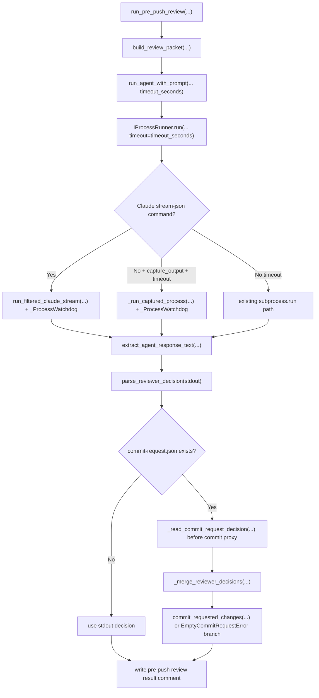

# PRD: Pre-Push Review Timeout And Diagnostics

## 1. Introduction & Goals

Agent Runner 的 pre-push review 在 reviewer agent 长时间无输出时缺少可见进度，并且 reviewer 写出 `.agent-runner/commit-request.json` 后如果没有产生可提交 diff，仍可能因为 stdout verdict 不可解析而进入不准确的失败路径。真实运行中 operator 看到的现象是：

- `Agent left uncommitted changes for Issue #30; runner processing commit request.`
- 随后长时间没有日志。
- 最终失败为 `Pre-push review repair failed: Agent requested a commit but produced no file changes.`

本 PRD 记录一个已完成的补充 bugfix：在已有"空 commit request 不应硬失败"修复基础上，补齐 pre-push review 的 timeout、heartbeat 日志、commit-request verdict 元数据兜底，以及对应测试和文档。

目标：

- Pre-push reviewer 调用必须有可配置 timeout，默认 900 秒。
- 长时间运行的 captured 子进程必须定期输出 heartbeat 日志，并在 timeout 后终止。
- Claude `stream-json` reviewer 即使在 `capture_output=True` 下也必须走过滤流式路径，让 operator 能看到有意义的 agent 输出。
- Reviewer stdout 不可解析时，runner 必须能从 commit request 中读取可选 `verdict` 元数据作为兜底，避免 approved 空操作被误判。
- Pre-push review 必须记录 start、cycle、reviewer exit、parsed verdict、commit request processing、comment write 和 final warning/approval 等关键日志。
- Docs 和 tests 必须同步记录该行为。

### Realistic Validation

除单元测试和集成测试外，本 PRD 已通过真实项目入口点验证关键行为，确保真实使用路径生效，而非仅在隔离 fixture 中通过。

- [x] **真实 timeout smoke**：通过 `uv run python - <<'PY' ... SubprocessRunner().run(... timeout=1 ...) ... PY` 启动真实 Python 子进程，验证 watchdog 会终止超时子进程并抛 `TimeoutExpired`。
- [x] **pre-push review 用例验证**：通过 `uv run pytest tests/test_agent_review.py tests/test_run_agent.py tests/test_process_runner.py tests/test_agent_config_consistency.py -q` 验证 timeout 透传、commit-request verdict 兜底、Claude capture 流式路径和 watchdog 行为。
- [x] **文档构建验证**：通过 `uv run mkdocs build --strict` 验证 Agent Runner guide 更新不破坏文档站点。
- [x] **仓库总入口验证**：通过 `just test` 验证 full lint、架构检查、PRD checklist 检查和 406 个 pytest 全部通过。
- [x] **为什么单元测试不够**：本修复涉及真实子进程 timeout/kill、agent command routing、配置映射、operator 日志和文档；真实子进程 smoke 与 `just test` 能覆盖单元 fixture 无法证明的 runtime wiring。

## 2. Requirement Shape

**Actor**：运行 Agent Runner daemon / `iar run` 的 operator，以及排查 pre-push review 卡顿或失败的开发者。

**Trigger**：

- `pre_push_review.enabled=true`。
- Runner 在 publish 前调用 reviewer agent。
- Reviewer agent 长时间运行、输出为空、输出为 Claude stream-json、或写出空 `.agent-runner/commit-request.json`。

**Expected Behavior**：

- Pre-push reviewer 命令使用 `[agent_runner.pre_push_review].timeout_seconds`，默认 900 秒。
- Captured 子进程不再完全静默等待；超过 heartbeat 间隔时记录 `"still running after ..."` 日志。
- Captured 子进程达到 timeout 时被终止，并抛 `subprocess.TimeoutExpired`。
- Claude `--output-format stream-json` 命令不因 `capture_output=True` 退回 raw `subprocess.run`，而是继续使用 filtered stream renderer。
- Reviewer stdout 无法解析出 verdict，但 commit request JSON 包含合法 `verdict` 时，runner 以 commit-request metadata 作为 fallback。
- 空 commit request + approved fallback 能正常收敛；空 commit request + changes_requested 仍走软失败路径。
- Operator 能从日志中看到 pre-push review 处于哪一个 cycle、正在运行哪个 reviewer、解析到什么 verdict、是否正在处理 commit request，以及是否写入 result comment。

**Explicit Scope Boundary**：

- 不改变 Agent Runner 的 GitHub label 状态机。
- 不新增 API、数据库、本地 state 文件、daemon 类型或外部服务。
- 不改变 `commit_requested_changes(...)` 的 commit proxy 安全边界。
- 不要求 live GitHub Issue mutation 作为验收条件。
- 不重新设计 reviewer prompt schema；仅允许 commit request 携带可选 reviewer metadata。
- 不改变 recovery loop 的 retry 语义。

## 3. Repository Context And Architecture Fit

### Existing Path

当前最接近的运行路径是：

```text
iar run / daemon pass
  -> run_once(...)
  -> run_pre_push_review(...)
     -> build_review_packet(...)
     -> run_agent_with_prompt(... capture_output=True)
        -> SubprocessRunner.run(...)
           -> subprocess handling
     -> parse_reviewer_decision(...)
     -> optional commit_requested_changes(...)
     -> GitHub pre-push review result comment
```

修复点沿用该路径，不新增平行 runner 或 review service。

### Current Relevant Modules And Files

| Path | Current Role | Final State |
|---|---|---|
| `src/backend/core/shared/models/agent_runner.py` | Core Agent Runner config dataclasses | `PrePushReviewConfig` 增加 `timeout_seconds` 默认值 |
| `src/backend/infrastructure/config/settings.py` | Pydantic settings model | `AgentRunnerPrePushReviewSettings` 增加 `timeout_seconds` 默认值 |
| `src/backend/engines/agent_runner/factory.py` | Settings 到 core config 的 composition mapping | 把 `timeout_seconds` 映射进 `PrePushReviewConfig` |
| `config.toml` | 默认运行配置 | `[agent_runner.pre_push_review]` 增加 `timeout_seconds = 900` |
| `src/backend/core/use_cases/run_agent_once.py` | Agent command builder / public use case helpers | `run_agent_with_prompt(...)` 接收并透传 `timeout_seconds` |
| `src/backend/core/use_cases/agent_review.py` | Pre-push review 主循环 | 增加关键阶段日志、timeout 使用、commit-request verdict fallback |
| `src/backend/infrastructure/process_runner.py` | 子进程执行器 | 增加 watchdog heartbeat/timeout，Claude capture 走 filtered stream |
| `tests/test_agent_review.py` | Pre-push review use case tests | 覆盖 timeout、metadata fallback 和空 request 收敛 |
| `tests/test_run_agent.py` | Agent command helper tests | 覆盖 `run_agent_with_prompt` timeout 透传 |
| `tests/test_process_runner.py` | 子进程执行器 tests | 覆盖 Claude capture path、captured timeout path、watchdog heartbeat/kill |
| `tests/test_agent_config_consistency.py` | Config consistency tests | 覆盖 settings/core/factory timeout 一致性 |
| `docs/guides/agent-runner.md` | Operator guide | 记录 timeout、heartbeat 和 commit-request metadata fallback |

### Existing Architecture Pattern To Follow

- Core 层的 review 状态机继续位于 `src/backend/core/use_cases/agent_review.py`。
- Core 层只依赖 `IProcessRunner` 与 `IGitHubClient` ports，不直接调用 `subprocess` 或 infrastructure。
- 子进程 runtime 细节保留在 `src/backend/infrastructure/process_runner.py`。
- Settings 解析在 infrastructure，core dataclass 在 core，二者通过 `engines/agent_runner/factory.py` composition root 映射。

### Ownership And Dependency Boundaries

- `src/backend/core/` 不导入 `backend.infrastructure`、`backend.engines` 或 `backend.api`。
- `src/backend/infrastructure/process_runner.py` 可以使用 `subprocess`、`threading`、`time` 等 runtime detail。
- `src/backend/engines/agent_runner/factory.py` 是 settings 到 core config 的合法边界。
- Tests 使用 fake ports 验证 core use case，用 mocked subprocess 验证 infrastructure behavior。

### Constraints From Runtime, Docs, Tests, Or Workflows

- Python 文本 I/O 必须显式 `encoding="utf-8"`；commit-request metadata 读取遵守该要求。
- `just test` 会先运行 full lint，因此新 PRD 和代码必须通过 PRD checklist、架构检查和最大文件行数检查。
- `tests/playwright-e2e/` 无关本次修复，不应引入 Node validation。
- 归档 PRD 的 Acceptance Checklist 必须全部勾选。

## 4. Recommendation

### Recommended Approach

采用已实现的最小变更路径：

1. 在 pre-push review config 中增加 `timeout_seconds`，默认 900 秒，并从 `config.toml` 到 core dataclass 完整映射。
2. `run_agent_with_prompt(...)` 增加可选 `timeout_seconds` 参数，pre-push review 调用 reviewer 时传入配置值。
3. `SubprocessRunner` 增加 `_ProcessWatchdog`，对 captured timeout path 和 Claude filtered stream path 提供 heartbeat logging 与 wall-clock timeout kill。
4. Claude stream-json 命令无论是否 `capture_output=True` 都优先走 `run_filtered_claude_stream(...)`，避免 raw JSON 静默捕获。
5. `agent_review.py` 在 request 文件被 `commit_requested_changes(...)` 删除前读取可选 reviewer metadata，并在 stdout 不可解析时 fallback 到 commit-request verdict。
6. 在 pre-push review cycle 中补关键阶段日志。
7. 用 focused tests、真实 timeout smoke、docs build 和 `just test` 验证。

### Why This Fits The Current Architecture

- Timeout 作为 pre-push review 配置进入 core config，符合现有 `[agent_runner.pre_push_review]` section shape。
- Process heartbeat/kill 是 runtime detail，放在 infrastructure runner，而不是泄漏到 core use case。
- Commit-request metadata fallback 使用现有 JSON protocol 文件，没有新增 state backend 或 API。
- Review loop 继续复用 `ReviewerDecision`、`parse_reviewer_decision(...)` 和 `commit_requested_changes(...)`，不引入新状态机。

### Rationale For Rejecting Redundant Abstractions

- 不新增 `ReviewProcessSupervisor` 或 background monitor service；现有 `SubprocessRunner` 已是统一子进程执行点。
- 不新增 durable progress state；operator 需要的是日志可见性和 timeout，不是持久化事件表。
- 不新增 reviewer verdict enum；现有 `approved` / `changes_requested` 足以表达最终 review decision。
- 不把 heartbeat 放入 core loop；否则每个 command callsite 都要重复处理 runtime timeout。

### Alternatives Considered

**Alternative A: Only reduce pre-push review timeout, no heartbeat**

Rejected. 这能缩短卡住时间，但 operator 在等待期间仍然看不到发生了什么，也无法区分 agent 正常长跑、无输出等待或已经接近 timeout。

**Alternative B: Add a dedicated pre-push review worker/process wrapper**

Rejected. 这会复制 `SubprocessRunner` 的职责，并把 infrastructure runtime 细节拉进 core use case，违背现有 port/adapter 分层。

**Alternative C: Require reviewer stdout JSON only, ignore commit-request metadata**

Rejected. 真实 agent 可能写 request 文件后没有按 stdout schema 收尾；request 文件在 commit proxy 删除前是唯一能保存 reviewer verdict metadata 的稳定边界。

## 5. Implementation Guide

This section is a living implementation guide based on current repository analysis. If implementation discovers additional affected files, hidden dependencies, edge cases, or a better path, update this PRD before proceeding.

### Core Logic

Search anchors:

```bash
rg -n "timeout_seconds|PrePushReviewConfig|AgentRunnerPrePushReviewSettings|run_agent_with_prompt" config.toml src tests
rg -n "_ProcessWatchdog|_run_captured_process|run_filtered_claude_stream|should_filter_claude_stream" src/backend/infrastructure/process_runner.py tests/test_process_runner.py
rg -n "_read_commit_request_decision|_merge_reviewer_decisions|commit_request_verdict|empty commit request" src/backend/core/use_cases/agent_review.py tests/test_agent_review.py docs/guides/agent-runner.md
```

Implemented behavior:

- `PrePushReviewConfig.timeout_seconds` and `AgentRunnerPrePushReviewSettings.timeout_seconds` default to `900`.
- `build_app_config_from_settings(...)` maps settings timeout into core config.
- `run_agent_with_prompt(...)` accepts `timeout_seconds` and passes it as `timeout` to `IProcessRunner.run(...)`.
- `run_pre_push_review(...)` computes `timeout_seconds = max(1, review_config.timeout_seconds)` and uses it for reviewer agent calls.
- `run_pre_push_review(...)` logs:
  - disabled review
  - review start with reviewer, max attempts, timeout and head
  - each cycle packet build and reviewer command start
  - reviewer exit code and elapsed seconds
  - parsed verdict, stdout parseability and commit-request verdict
  - commit-request processing, empty request handling, comment write, approval, and final warning
- `_read_commit_request_decision(...)` reads optional metadata from `.agent-runner/commit-request.json` before `commit_requested_changes(...)` removes it.
- `_merge_reviewer_decisions(...)` prefers parseable stdout verdict and falls back to commit-request metadata only when stdout is not parseable.
- `SubprocessRunner.run(...)` routes Claude stream-json commands to `run_filtered_claude_stream(...)` before checking `capture_output`.
- Captured non-Claude commands with timeout use `_run_captured_process(...)`, which starts `_ProcessWatchdog`.
- `_ProcessWatchdog` logs heartbeat every `_COMMAND_HEARTBEAT_SECONDS` and kills the process when wall-clock timeout is reached.

### Change Impact Tree

```text
Infrastructure
├── src/backend/infrastructure/process_runner.py
│   [修改]
│   【总结】为 captured subprocess 和 Claude stream-json 路径增加 heartbeat 日志和 wall-clock timeout kill
│
│   ├── 新增 _COMMAND_HEARTBEAT_SECONDS
│   ├── 新增 _run_captured_process(...)
│   ├── 新增 _ProcessWatchdog
│   ├── Claude stream-json 命令优先走 run_filtered_claude_stream(...)
│   └── captured timeout path 使用 Popen + watchdog，而不是静默 subprocess.run(...)
│
├── src/backend/infrastructure/config/settings.py
│   [修改]
│   【总结】把 pre-push review timeout 加入 Pydantic settings
│
│   └── AgentRunnerPrePushReviewSettings.timeout_seconds = 900
│
Configuration
├── config.toml
│   [修改]
│   【总结】为默认 pre-push review 配置声明 900 秒 timeout
│
│   └── [agent_runner.pre_push_review].timeout_seconds = 900
│
Domain
├── src/backend/core/shared/models/agent_runner.py
│   [修改]
│   【总结】把 reviewer timeout 纳入 core Agent Runner config
│
│   └── PrePushReviewConfig.timeout_seconds = 900
│
├── src/backend/core/use_cases/run_agent_once.py
│   [修改]
│   【总结】agent command helper 允许调用方向 process runner 透传 timeout
│
│   └── run_agent_with_prompt(..., timeout_seconds=None)
│
├── src/backend/core/use_cases/agent_review.py
│   [修改]
│   【总结】pre-push review 使用 timeout、输出关键阶段日志，并支持 commit-request verdict fallback
│
│   ├── _read_commit_request_decision(...)
│   ├── _merge_reviewer_decisions(...)
│   ├── reviewer 命令使用 configured timeout
│   ├── stdout 不可解析时 fallback 到 request metadata
│   └── empty commit request 日志与 comment 行为保持可审计
│
├── src/backend/engines/agent_runner/factory.py
│   [修改]
│   【总结】把 infrastructure settings 中的 timeout 映射到 core config
│
│   └── build_app_config_from_settings(...) 传入 pre_push.timeout_seconds
│
Tests
├── tests/test_agent_config_consistency.py
│   [修改]
│   【总结】验证 settings/core/factory 的 pre-push timeout 默认值一致
│
├── tests/test_run_agent.py
│   [修改]
│   【总结】验证 run_agent_with_prompt 会把 timeout_seconds 传到底层 runner
│
├── tests/test_agent_review.py
│   [修改]
│   【总结】验证 pre-push review timeout 透传和 commit-request verdict fallback
│
└── tests/test_process_runner.py
    [修改]
    【总结】验证 captured timeout path、Claude capture filtered stream path 和 watchdog heartbeat/kill

Docs
└── docs/guides/agent-runner.md
    [修改]
    【总结】记录 timeout_seconds、60 秒 heartbeat、timeout termination 和 commit-request metadata fallback
```

### Executor Drift Guard

- Run `rg -n "timeout_seconds" config.toml src/backend tests docs/guides/agent-runner.md` and confirm timeout is present in config, settings, core config, factory mapping, review call, tests and docs.
- Run `rg -n "_ProcessWatchdog|still running after|timed out after" src/backend/infrastructure/process_runner.py tests/test_process_runner.py` and confirm heartbeat/timeout behavior is centralized in infrastructure.
- Run `rg -n "commit_request_verdict|_read_commit_request_decision|_merge_reviewer_decisions" src/backend/core/use_cases/agent_review.py tests/test_agent_review.py` and confirm metadata fallback happens before commit proxy removes the request file.
- Run `rg -n "subprocess.run\\(|run_filtered_claude_stream" src/backend/infrastructure/process_runner.py tests/test_process_runner.py` and confirm Claude stream-json capture does not fall through to raw `subprocess.run`.
- If future edits add new agent command helpers, verify they either intentionally pass `timeout=None` or expose a config-backed timeout.

### Flow Or Architecture Diagram



### Realistic Validation Plan

| Behavior | Real Entry Point | Test Layer | Mock Boundary | Data/Env Needed | Command Or Procedure | Required For Acceptance |
|---|---|---|---|---|---|---|
| Real subprocess timeout kill | `SubprocessRunner.run(...)` with a real Python child process | smoke/runtime | No mocked subprocess; no external service | Local Python/uv environment | `uv run python - <<'PY'` smoke command documented below | Yes |
| Pre-push review timeout and fallback behavior | `run_pre_push_review(...)` through pytest use-case tests | unit/use-case | Agent command and GitHub client mocked at existing ports | Fake Issue, fake process runner, fake GitHub client | `uv run pytest tests/test_agent_review.py tests/test_run_agent.py tests/test_process_runner.py tests/test_agent_config_consistency.py -q` | Yes |
| Config wiring | `build_app_config()` and config consistency tests | unit/config | No external services | Local config files | `uv run pytest tests/test_agent_config_consistency.py -q` | Yes |
| Docs sync | MkDocs build | docs/build | No mock | Local docs environment | `uv run mkdocs build --strict` | Yes |
| Full regression and architecture gate | Repository test entry | full local regression | Existing test fakes only | Local Python/uv/just environment | `just test` | Yes |
| Optional live daemon observation | `uv run iar run --max-issues 1` against disposable repository | manual/sandbox | No mock; writes GitHub labels/comments and may invoke agents | Disposable GitHub Issue, authenticated `gh`, agent CLI credentials | `IAR_LIVE_GITHUB_VALIDATION=1 uv run iar run --max-issues 1` | No |

Runtime smoke command:

```bash
uv run python - <<'PY'
from pathlib import Path
import subprocess
import sys

from backend.infrastructure.process_runner import SubprocessRunner

runner = SubprocessRunner()
try:
    runner.run(
        [sys.executable, "-c", "import time; time.sleep(2)"],
        cwd=Path("."),
        timeout=1,
        capture_output=True,
        check=False,
    )
except subprocess.TimeoutExpired:
    print("timeout smoke passed")
else:
    raise SystemExit("timeout smoke failed")
PY
```

Failure triage:

- If the timeout smoke hangs, inspect `_ProcessWatchdog._run(...)`, `_run_captured_process(...)`, and the `process.communicate()` path first.
- If Claude capture returns raw JSON, inspect `SubprocessRunner.run(...)` branch order and `should_filter_claude_stream(...)`.
- If empty commit request still hard-fails, inspect `_read_commit_request_decision(...)` call order and confirm it executes before `commit_requested_changes(...)`.
- If `just test` fails in PRD checklist checks, verify this archived PRD has all checklist items checked.

### Low-Fidelity Prototype

No UI or multi-step human interaction changes in this PRD.

### ER Diagram

No data model changes in this PRD.

### Interactive Prototype Change Log

No interactive prototype file changes in this PRD.

### External Validation

No external validation required; repository evidence and local runtime validation were sufficient.

## 6. Definition Of Done

- Pre-push review timeout is configurable through `[agent_runner.pre_push_review].timeout_seconds` and defaults to 900 seconds.
- Pre-push review reviewer calls pass the configured timeout to `IProcessRunner.run(...)`.
- Captured subprocess calls with timeout provide heartbeat logging and terminate on wall-clock timeout.
- Claude stream-json commands continue to use filtered streaming output when output is captured.
- Commit-request metadata fallback can recover approved verdicts when reviewer stdout is not parseable.
- Operator docs describe timeout, heartbeat, timeout termination and commit-request metadata fallback.
- Focused tests, docs build, real timeout smoke and `just test` pass.
- No architecture dependency boundary is violated.

## 7. Acceptance Checklist

### Architecture Acceptance

- [x] Runtime process timeout/heartbeat logic is contained in `src/backend/infrastructure/process_runner.py`.
- [x] Pre-push review orchestration remains in `src/backend/core/use_cases/agent_review.py`.
- [x] Core layer continues to depend on `IProcessRunner` instead of importing `subprocess`.
- [x] Settings-to-core mapping remains in `src/backend/engines/agent_runner/factory.py`.
- [x] No database, local state file, API route, daemon type, webhook or external dependency is added.

### Dependency Acceptance

- [x] No new Python or npm dependency is introduced.
- [x] Tests reuse existing fake process and GitHub boundaries where possible.
- [x] Direct subprocess mocking is limited to infrastructure process runner tests.
- [x] Live GitHub validation remains optional and is not required for acceptance.

### Behavior Acceptance

- [x] `PrePushReviewConfig` exposes `timeout_seconds` with default `900`.
- [x] `AgentRunnerPrePushReviewSettings` exposes `timeout_seconds` with default `900`.
- [x] `config.toml` documents `timeout_seconds = 900` under `[agent_runner.pre_push_review]`.
- [x] `run_agent_with_prompt(...)` forwards `timeout_seconds` to `process_runner.run(..., timeout=...)`.
- [x] `run_pre_push_review(...)` passes configured timeout to reviewer agent execution.
- [x] Captured non-Claude commands with timeout run through watchdog-backed `Popen` handling.
- [x] Claude stream-json commands with `capture_output=True` return rendered output instead of raw stream JSON.
- [x] Long-running subprocesses emit heartbeat logs before timeout.
- [x] Timed-out subprocesses are killed and surface `subprocess.TimeoutExpired`.
- [x] Reviewer stdout that is unparseable can fallback to commit-request `verdict` metadata.
- [x] Approved empty commit request with metadata fallback converges without `Pre-push review repair failed`.
- [x] Pre-push review logs start, cycle, reviewer exit, parsed verdict, commit request processing, result comment write and final outcome.

### Documentation Acceptance

- [x] `docs/guides/agent-runner.md` documents `timeout_seconds` in the pre-push review config example.
- [x] `docs/guides/agent-runner.md` documents heartbeat logging and timeout termination.
- [x] `docs/guides/agent-runner.md` documents commit-request `verdict` metadata fallback.
- [x] The old statement that commit request "only" accepts `commit_message` is updated to allow pre-push reviewer metadata.

### Validation Acceptance

- [x] `uv run pytest tests/test_agent_review.py tests/test_run_agent.py tests/test_process_runner.py tests/test_agent_config_consistency.py -q` passes.
- [x] `uv run mkdocs build --strict` passes.
- [x] Real timeout smoke using `SubprocessRunner` and a real Python child process passes.
- [x] `just test` passes with 406 tests.
- [x] This PRD is archived with all Acceptance Checklist items complete.

## 8. Functional Requirements

**FR-1**: The pre-push review configuration must expose `timeout_seconds` with a default of 900 seconds in both core dataclass config and Pydantic settings.

**FR-2**: The default `config.toml` must include `[agent_runner.pre_push_review].timeout_seconds = 900`.

**FR-3**: `build_app_config_from_settings(...)` must map infrastructure settings timeout into `PrePushReviewConfig.timeout_seconds`.

**FR-4**: `run_agent_with_prompt(...)` must accept an optional `timeout_seconds` argument and pass it to `IProcessRunner.run(...)` as `timeout`.

**FR-5**: `run_pre_push_review(...)` must call reviewer agents with `timeout_seconds=max(1, review_config.timeout_seconds)`.

**FR-6**: `SubprocessRunner.run(...)` must route Claude stream-json commands to the filtered stream runner even when `capture_output=True`.

**FR-7**: Captured non-Claude commands with a timeout must use watchdog-backed process execution so the runner can emit heartbeat logs and terminate timed-out processes.

**FR-8**: `_ProcessWatchdog` must log heartbeat messages at the configured heartbeat interval and kill the process when wall-clock elapsed time reaches timeout.

**FR-9**: `run_pre_push_review(...)` must read optional commit-request reviewer metadata before calling `commit_requested_changes(...)`, because the commit proxy removes the transient request file.

**FR-10**: If stdout reviewer decision is not parseable and commit-request metadata contains a valid verdict, the review loop must use the commit-request verdict.

**FR-11**: Pre-push review must log key lifecycle stages so operator output does not have unexplained multi-minute gaps.

## 9. Non-Goals

- Do not alter Agent Runner labels or GitHub Issue state transitions.
- Do not introduce persistent runner event storage.
- Do not add a new service, worker, daemon or queue.
- Do not change the commit proxy security contract or forbidden path checks.
- Do not require live GitHub mutation tests for acceptance.
- Do not change Playwright or frontend behavior.
- Do not redesign the reviewer prompt beyond documenting optional commit-request metadata.
- Do not change `max_attempts` or recovery retry semantics.

## 10. Risks And Follow-Ups

- Heartbeat logs intentionally summarize commands and truncate long command strings; if future prompts include sensitive data in command arguments, command summarization should be revisited.
- The watchdog kills the process from a background thread; tests cover timeout behavior, but future platform-specific process group handling may be needed if child processes spawn grandchildren.
- Commit-request metadata fallback is intentionally used only when stdout is not parseable; if future reviewers produce conflicting parseable stdout and request metadata, stdout remains authoritative.
- Optional live daemon validation against GitHub remains manual to avoid mutating real Issues during local tests.

## 11. Decision Log

| ID | Decision | Chosen | Rejected | Rationale |
|---|---|---|---|---|
| D-01 | Timeout ownership | Add `pre_push_review.timeout_seconds` and pass it through `run_agent_with_prompt(...)` | Hard-code a timeout inside `SubprocessRunner` | Pre-push review has distinct runtime expectations from other commands, so the timeout belongs to its config section. |
| D-02 | Heartbeat implementation point | Centralize heartbeat/timeout enforcement in `SubprocessRunner` infrastructure | Add logging loops inside `run_pre_push_review(...)` | The process runner is the only layer that can observe child process lifetime and kill it without leaking subprocess details into core. |
| D-03 | Claude capture behavior | Use `run_filtered_claude_stream(...)` even when `capture_output=True` | Capture raw Claude JSON via `subprocess.run(...)` | Filtered streaming preserves operator-readable progress and still returns rendered stdout for parsing. |
| D-04 | Verdict fallback source | Read optional verdict metadata from commit-request JSON before commit proxy cleanup | Require stdout JSON to be parseable in all cases | The request file is the stable protocol boundary when agent stdout is malformed, and it is removed during commit proxy processing. |
| D-05 | Fallback precedence | Prefer parseable stdout verdict over commit-request metadata | Let commit-request metadata always override stdout | Stdout is the primary reviewer response contract; metadata is only a recovery path for unparseable output. |
| D-06 | PRD placement | Archive this completed supplemental bugfix PRD | Create a pending PRD after implementation is already complete | Repository rules treat completed PRD-backed work as archived with all acceptance items checked. |
