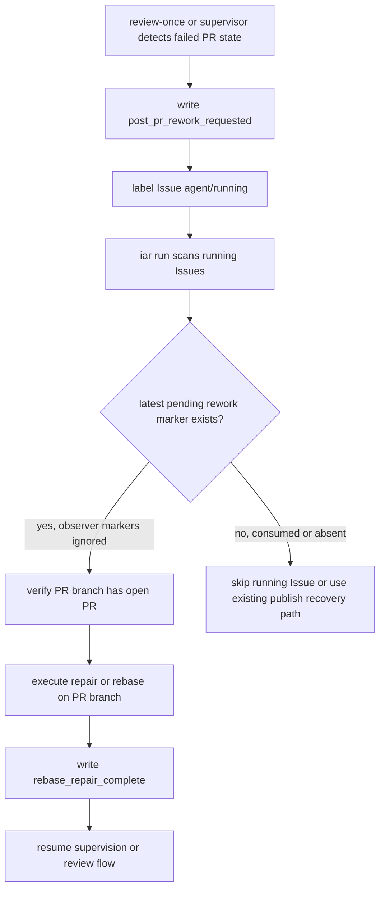

# P1 BUG: Agent Runner Pending Rework Marker Masking

## 1. Introduction & Goals

Agent Runner 的 post-PR repair/rebase 状态依赖 Issue comment 中的 `iar:event` marker。现有 `iar run` 只读取最新任意 marker 来判断 `agent/running` Issue 是否需要执行 rework，导致 `post_pr_rework_requested` 后面如果又出现 `post_pr_supervisor` 等观察类 marker，pending repair 会被误判为不存在，runner 会跳过实际 repair 或走错误恢复路径。

本修复目标是让 `post_pr_rework_requested` 成为可恢复的 pending marker：后续 observer marker 不会覆盖它；只有明确完成/发布类 marker 才能消费它。

### Realistic Validation

- [x] **真实 runner 入口验证**：通过 `just test` 覆盖 `iar run` 对 running Issue 的 rework guard 选择逻辑，确认后续 `post_pr_supervisor` 不会掩盖 pending repair marker。
- [x] **状态机完成验证**：通过 supervisor/rework 测试验证 repair/rebase 执行完成后写入 `rebase_repair_complete`，旧 pending marker 不会被重复消费。
- [x] **为什么单元测试不够**：本 bug 发生在 `review-once` 写 marker 与 `run` 读取 marker 的跨入口状态协作，必须覆盖 orchestrator guard 和 supervisor entrypoint，而不是只测 marker parser。

## 2. Requirement Shape

- **Actor**：运行 `iar run` / `iar run-once` 的 operator 或 daemon。
- **Trigger**：Issue 已处于 `agent/running`，Issue comments 中存在 `post_pr_rework_requested` marker，且该 marker 后面还有 `post_pr_supervisor` 等 observer marker。
- **Expected Behavior**：runner 仍识别该 Issue 为 pending rework，在对应 open PR branch 上执行 repair/rebase；repair/rebase 成功后写完成 marker，后续轮次不重复执行旧请求。
- **Scope Boundary**：只修 Agent Runner comment marker 状态机和文档说明；不改变 GitHub label 名称、PR 监督策略、CLI 参数或自动合并行为。

## 3. Repository Context And Architecture Fit

当前相关路径：

- `src/backend/core/use_cases/agent_runner_events.py`：解析和格式化 `iar:event` hidden marker。
- `src/backend/core/use_cases/agent_runner_orchestrate.py`：`iar run` 处理 ready/running Issue 的核心编排。
- `src/backend/core/use_cases/agent_runner_supervisor.py`：post-PR supervisor repair/rebase 循环。
- `src/backend/core/use_cases/pr_supervisor.py`：构建 supervisor/rework/rebase-repair comments。
- `tests/test_agent_review.py`、`tests/test_agent_runner_supervisor_entrypoints.py`：marker 解析和 supervisor/rework entrypoint 覆盖。
- `docs/guides/agent-runner.md`：Agent Runner 状态机文档。

架构约束：

- 变更保持在 `core/use_cases` 内，继续依赖 `IGitHubClient`、`IProcessRunner` 等 core interface，不引入 infrastructure 依赖。
- `parse_latest_event_marker()` 的旧语义必须保留，因为 review-once 等逻辑仍需要读取最新任意 marker 作为 cursor。
- 新逻辑应复用 existing hidden marker 格式，不新增数据库、本地状态文件或外部服务。

## 4. Recommendation

### Recommended Approach

新增一个专用解析入口 `parse_latest_pending_rework_marker(comments)`，按 Issue comments 倒序查找最新尚未消费的 `post_pr_rework_requested` marker。`post_pr_supervisor` 等 observer marker 不会消费该请求；`rebase_repair_complete`、`draft_pr_created`、`implementation_complete`、`publish_recovered` 这类完成/发布类 marker 会消费旧 rework 请求。

`agent_runner_orchestrate._has_rework_intent()` 改用该专用解析入口；`_process_running_rework()` 和 supervisor 同步 repair/rebase 路径在成功后写 `rebase_repair_complete`，从而让 pending marker 有明确终点。

### Why This Fits

该方案最小化改动：继续使用 Issue comments 作为 durable audit trail，不新增状态存储，也不改变 label 队列模型。它把“最新任意事件 cursor”和“最新待处理 rework intent”拆成两个读取语义，避免为了修 repair 路径破坏 review-once 的 cursor 行为。

### Alternatives Considered

- **只让 `_has_rework_intent()` 扫描任意历史 `post_pr_rework_requested`**：会导致已完成 repair/rebase 的旧请求被重复执行。
- **新增本地 consumed-marker 状态文件**：会破坏当前无状态、可跨机器恢复的 Issue comment 状态机。
- **修改 `parse_latest_event_marker()` 语义**：会影响依赖“最新任意 marker”的 review-once context-change 判断。

## 5. Implementation Guide

This section is a living implementation guide based on current repository analysis. If implementation discovers additional affected files, hidden dependencies, edge cases, or a better path, update this PRD before proceeding.

### Core Logic

1. `review-once` 或 supervisor gate 写入 `post_pr_rework_requested`，表达待执行 repair/rebase intent。
2. 后续 `post_pr_supervisor` marker 只表示观察结果，不消费 pending repair intent。
3. `iar run` 通过 `parse_latest_pending_rework_marker()` 查找未消费 rework marker，并通过 PR branch open PR guard 进入 `_process_running_rework()`。
4. repair/rebase 成功后写 `rebase_repair_complete`，后续轮次倒序扫描到该完成 marker 后不再消费更早的 rework request。

### Change Impact Tree

```text
.
├── Domain
│   └── src/backend/core/use_cases/agent_runner_events.py
│       [修改]
│       【总结】拆分 marker 读取语义，新增 pending rework marker 解析。
│       ├── 保留 parse_latest_event_marker 的最新任意 marker 行为
│       ├── 新增 parse_latest_pending_rework_marker
│       └── 定义可消费 rework 的完成/发布 phase 集合
│
├── Domain
│   └── src/backend/core/use_cases/agent_runner_orchestrate.py
│       [修改]
│       【总结】让 running Issue rework guard 使用 pending marker 语义。
│       ├── _has_rework_intent 改为读取未消费 rework marker
│       └── _process_running_rework 成功后写 rebase_repair_complete
│
├── Domain
│   └── src/backend/core/use_cases/agent_runner_supervisor.py
│       [修改]
│       【总结】让 supervisor repair/rebase 路径拥有请求和完成 marker 配对。
│       ├── 执行前先写 post_pr_rework_requested 再切 agent/running
│       └── 执行成功后写 rebase_repair_complete
│
├── Tests
│   ├── tests/test_agent_review.py
│   │   [修改]
│   │   【总结】覆盖 pending marker 被 observer marker 跟随时仍可识别，以及完成 marker 会消费旧请求。
│   └── tests/test_agent_runner_supervisor_entrypoints.py
│       [修改]
│       【总结】覆盖 orchestrator guard 与 supervisor repair/rebase entrypoint 的状态机行为。
│
└── Docs
    └── docs/guides/agent-runner.md
        [修改]
        【总结】同步 Rework Guard 的 pending marker 和完成 marker 语义。
```

### Executor Drift Guard

实施或复查时使用以下搜索确认没有漏掉旧语义：

```bash
rg -n "parse_latest_event_marker|parse_latest_pending_rework_marker|post_pr_rework_requested|rebase_repair_complete" src tests docs/guides/agent-runner.md
rg -n "_has_rework_intent|_guard_running_issue_is_rework|_process_running_rework" src/backend/core/use_cases
```

若未来新增消费 `post_pr_rework_requested` 的路径，必须显式决定该路径是 observer、pending producer，还是 completion producer，并补充测试。

### Flow Diagram



### Realistic Validation Plan

| Behavior | Real Entry Point | Test Layer | Mock Boundary | Data/Env Needed | Command Or Procedure | Required For Acceptance |
|---|---|---|---|---|---|---|
| Pending repair survives later observer marker | `iar run` orchestration path via `run_once` tests | Integration-style unit test | GitHub client and process runner mocked at repository boundary | Synthetic Issue comments with `post_pr_rework_requested` followed by `post_pr_supervisor` | `uv run pytest tests/test_agent_runner_supervisor_entrypoints.py::test_running_rework_guard_finds_rework_marker_hidden_by_later_marker -q` | Yes |
| Completed repair is not repeated | Marker parser and orchestrator guard | Unit/integration-style unit test | No live GitHub; comments modeled in memory | `post_pr_rework_requested` followed by `rebase_repair_complete` | `uv run pytest tests/test_agent_review.py::test_parse_pending_rework_marker_stops_after_completion tests/test_agent_runner_supervisor_entrypoints.py::test_running_rework_guard_ignores_completed_rework_marker -q` | Yes |
| Full runner behavior remains compatible | Repository test command | Full local suite | External services mocked by existing tests | Local dev environment with `uv` and `just` | `just test` | Yes |

Triage note: if the first validation fails, inspect `src/backend/core/use_cases/agent_runner_events.py` and `_has_rework_intent()` before debugging GitHub infrastructure.

### Low-Fidelity Prototype

No low-fidelity prototype required for this bugfix.

### ER Diagram

No data model changes in this PRD.

### Interactive Prototype Change Log

No interactive prototype file changes in this PRD.

### External Validation

No external validation required; repository evidence was sufficient.

## 6. Definition Of Done

- Pending rework marker detection is independent from latest arbitrary marker detection.
- Repair/rebase execution writes a completion marker after successful verification and push.
- Existing review-once cursor behavior remains unchanged.
- Agent Runner guide documents the updated marker lifecycle.
- Targeted tests and `just test` pass locally.

## 7. Acceptance Checklist

### Architecture Acceptance

- [x] `src/backend/core/use_cases/agent_runner_events.py` keeps `parse_latest_event_marker()` behavior intact for existing callers.
- [x] `src/backend/core/use_cases/agent_runner_orchestrate.py` uses `parse_latest_pending_rework_marker()` for running Issue rework detection.
- [x] No new infrastructure dependency, database table, local state file, or external service is introduced.

### Behavior Acceptance

- [x] A `post_pr_rework_requested` marker followed by `post_pr_supervisor` is still treated as pending rework.
- [x] A `post_pr_rework_requested` marker followed by `rebase_repair_complete` is treated as consumed and is not reprocessed.
- [x] Supervisor repair/rebase paths write `post_pr_rework_requested` before entering `agent/running` and `rebase_repair_complete` after successful execution.

### Documentation Acceptance

- [x] `docs/guides/agent-runner.md` documents pending rework marker semantics and completion marker consumption.
- [x] Supported marker phase list includes `publish_recovered`, matching existing recovery comments.

### Validation Acceptance

- [x] Targeted marker/orchestrator/supervisor tests pass with `uv run pytest tests/test_agent_review.py tests/test_agent_runner_supervisor_entrypoints.py tests/test_review_once.py -q`.
- [x] Broader runner tests pass with `uv run pytest tests/test_agent_review.py tests/test_agent_runner_supervisor_entrypoints.py tests/test_run_agent.py tests/test_pr_supervisor.py tests/test_review_once.py -q`.
- [x] Full repository validation passes with `just test`.

## 8. Functional Requirements

- **FR-1**：`iar run` must identify a running Issue as rework when the latest unconsumed `post_pr_rework_requested` marker exists, even if later observer markers are present.
- **FR-2**：`iar run` must not reprocess a rework request after a later completion/production marker consumes it.
- **FR-3**：Supervisor repair/rebase paths must leave a durable pending marker before changing the Issue into `agent/running`.
- **FR-4**：Successful repair/rebase paths must write `rebase_repair_complete` so future polling can distinguish completed rework from pending rework.
- **FR-5**：Existing latest-marker consumers must continue to receive the latest arbitrary marker.

## 9. Non-Goals

- No change to GitHub label names or label synchronization.
- No change to PR approval, merge, or auto-merge policy.
- No live GitHub API integration test requirement for this local bugfix.
- No automatic repair of existing historical Issues beyond making future `iar run` passes interpret their comments correctly.

## 10. Risks And Follow-Ups

- Historical Issues whose repair actually completed before this fix but never wrote `rebase_repair_complete` may still look pending if no later completion/production marker exists. This is acceptable because the runner still checks branch and open PR state before acting, and such cases should be inspected by operator if encountered.
- Future marker phases that should consume rework must be added to the completion phase set with tests.

## 11. Decision Log

| ID | Decision Question | Chosen | Rejected | Rationale |
|---|---|---|---|---|
| D-01 | How should pending repair intent be detected? | Add `parse_latest_pending_rework_marker()` with explicit completion phases. | Change `parse_latest_event_marker()` semantics. | Existing callers rely on latest arbitrary marker as a cursor, while rework scheduling needs pending-intent semantics. |
| D-02 | How should completed repair be recorded? | Write `rebase_repair_complete` after repair/rebase success. | Write another `post_pr_rework_requested` after success. | A second request marker requeues already completed work and recreates the masking/repeat bug. |
| D-03 | Should this fix add persistent local state? | Keep Issue comments as the durable state source. | Add consumed marker files or local DB state. | Comment markers already support cross-run recovery and match the existing no-local-state runner model. |
