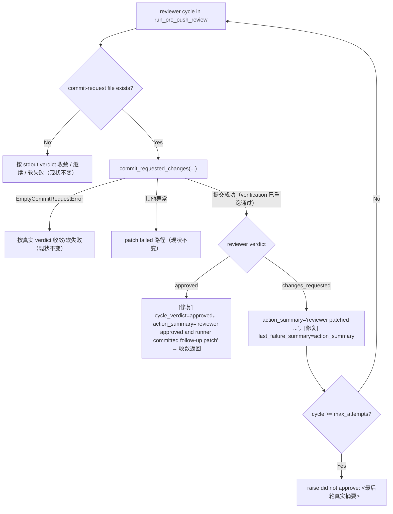

# PRD: Pre-Push Review Approved-With-Patch Verdict Override Hard Fail

## 1. Introduction & Goals

Pre-push review 循环（`run_pre_push_review(...)`，位于 `src/backend/core/use_cases/agent_review.py`）存在两个相互放大的缺陷，Issue #53 的 2026-06-11 运行日志完整复现了它们：

1. **approved + 非空 commit request 被强制降级为 changes_requested**：只要 reviewer 写出了 `.agent-runner/commit-request.json`，循环就把 `cycle_verdict` 无条件设为 `changes_requested`，即使 reviewer stdout 解析出的真实 verdict 是 `approved`（日志：`parsed verdict=approved` → `wrote result comment with verdict=changes_requested`）。收敛判断又要求 `action_summary` 以 `"reviewer approved"` 开头，因此 reviewer 在最后一轮"批准并顺手补丁"时，补丁已成功提交、verification 已重跑通过，循环却因 `max_attempts` 用尽抛出 `Pre-push review did not approve after N attempt(s)` 硬失败。reviewer 越负责（批准时顺手修小问题），runner 越必然失败。
2. **最终失败信息陈旧误导**：`last_failure_summary` 只在"无 commit request"分支和异常分支更新，"patched and committed" 成功分支不更新。最终异常显示的是更早 cycle 的摘要（如 cycle 1 的 `reviewer requested changes without a commit request`），而不是最后一轮的实际结果，让 operator 误以为是已修复的旧问题复发。

本 PRD 约束一个最小修复切片：

1. reviewer verdict 为 `approved` 且 commit request 成功提交（隐含 staging 后 verification 重跑通过，否则 `commit_requested_changes` 会抛 `VerificationFailedError`）时，将该 cycle 视为通过：`cycle_verdict = "approved"`，`action_summary = "reviewer approved and runner committed follow-up patch"`，走既有收敛判断直接返回。
2. reviewer verdict 为 `changes_requested` 且补丁成功提交时，保持现有继续循环语义，但同步更新 `last_failure_summary = action_summary`，确保最终失败信息反映最后一轮真实结果。
3. 增加回归测试覆盖两条路径；同步更新 `docs/guides/agent-runner.md` 的 Pre-Push Review 章节。

### Realistic Validation

除单元测试外，本 PRD 要求通过**真实项目入口点**验证关键行为：

- [x] **approved + 补丁收敛真实验证**：通过 `uv run pytest tests/test_agent_review.py -q` 验证 reviewer verdict 为 approved 且写出非空 commit request 时（`max_attempts=1`），循环提交补丁后直接收敛返回新 head，Issue comment 的 verdict 为 `approved`。
- [x] **失败信息时效性真实验证**：通过 `uv run pytest tests/test_agent_review.py -q` 验证 changes_requested + 补丁提交后用尽 `max_attempts` 时，软失败异常 message 包含最后一轮的 `reviewer patched and runner committed follow-up changes`，而非更早 cycle 的陈旧摘要。
- [x] **真实仓库测试入口验证**：通过 `just test` 验证 lint、架构检查、PRD checklist 检查和全量 pytest 均通过。
- [x] **为什么不直接运行 live `iar run`**：真实 `iar run` 会修改 GitHub Issue labels/comments 并调用 agent CLI；本修复位于 core use case 的 review-loop 状态机，pytest 通过真实 review-loop 路径（含真实 commit proxy 调用链）复现 Issue #53 日志中的状态序列，避免对 live Issue 制造重复事件。

### Delivery Dependencies

- Group: none
- Depends on groups:
  - none
- Depends on tasks/issues:
  - none
- Gate type: none
- Notes: 与已归档 `P1-BUG-20260610-100457-pre-push-review-empty-commit-request-hard-fail.md` 互补（空补丁 vs 非空补丁），无顺序依赖。

### Proposed Solution Summary

- 核心机制：在 `run_pre_push_review(...)` 的 commit-request 成功提交分支内，按 reviewer stdout/commit-request 合并解析出的真实 verdict 决定 cycle 结果，不再无条件强制 `changes_requested`；同分支同步维护 `last_failure_summary`。
- 输入来源：完全复用现有 `parse_reviewer_decision` / `_merge_reviewer_decisions` 解析结果，不要求 reviewer 提供任何新字段。
- 接入点：仅改 `agent_review.py` 主循环既有分支，不改 reviewer prompt、commit-request schema、`commit_requested_changes` commit proxy。
- 行为变化：approved + 补丁 → 当轮收敛通过；changes_requested + 补丁用尽次数 → 失败信息反映最后一轮实际动作。
- 刻意避免的复杂度：不新增 verdict 枚举、不增加额外 review cycle、不引入新状态文件或配置项。

### Measurable Objectives

- reviewer 在任意 cycle（含最后一轮）返回 approved 并附带可提交补丁时，`run_pre_push_review` 正常返回 `(new_head, verification)`，不抛异常。
- `Pre-push review did not approve after N attempt(s): <summary>` 中的 `<summary>` 永远等于最后一轮的 `action_summary`。

## 2. Requirement Shape

**Actor**：运行 `iar run` / `iar daemon` 的本地 Agent Runner operator，以及查看 GitHub Issue 评论排障的开发者。

**Trigger**：

- Pre-push review 启用（`[agent_runner.pre_push_review].enabled=true`）。
- Reviewer 修改 worktree 并写出非空 `.agent-runner/commit-request.json`。
- Reviewer stdout（或 commit-request 兜底元数据）解析出的 verdict 为 `approved` 或 `changes_requested`。

**Expected Behavior**：

- verdict 为 `approved` 且补丁经 commit proxy 成功提交（verification 重跑通过）→ 该 cycle 收敛：Issue comment `Verdict: approved`、action summary `reviewer approved and runner committed follow-up patch`，函数返回新 head 与新 verification 结果。
- verdict 为 `changes_requested` 且补丁成功提交 → 维持现有"继续下一轮"语义；若该轮为最后一轮，软失败 message 为 `... : reviewer patched and runner committed follow-up changes`。
- 空 commit request、patch 提交失败、无 commit request 等既有路径行为不变。

**Explicit Scope Boundary**：

- 不修改 reviewer prompt、verdict schema、commit-request schema。
- 不修改 `commit_requested_changes(...)` commit proxy 与 `EmptyCommitRequestError` 语义。
- 不修改 `max_attempts` 语义，不为"最后一轮补丁"追加额外免费 cycle。
- 不修改 post-PR supervisor 路径。

## 3. Repository Context And Architecture Fit

### Current Relevant Modules And Files

| Path | Current Role | Change Relationship |
|---|---|---|
| `src/backend/core/use_cases/agent_review.py` | pre-push review 主循环、verdict 解析与合并、result comment | 修改 commit-request 成功提交分支：按真实 verdict 收敛；同步 `last_failure_summary` |
| `src/backend/core/use_cases/agent_runner_commit.py` | commit proxy：分支守卫、forbidden path、staging 后 verification、commit | 不修改；其"成功返回即 verification 通过"的契约是本修复的前提 |
| `tests/test_agent_review.py` | pre-push review use-case 测试（含 FakeProcessRunner/FakeGitHubClient 套件） | 新增 approved+补丁收敛、失败信息时效性两条回归测试 |
| `docs/guides/agent-runner.md` | Agent Runner operator 文档 Pre-Push Review 章节 | 在空 commit request 注记旁补充 approved+非空补丁的收敛行为 |

### Existing Path

```text
iar run
  -> run_pre_push_review(...)
  -> reviewer cycle: parsed verdict=approved, 写出非空 commit-request.json
  -> request_path.is_file() → cycle_verdict 被强制设为 "changes_requested"   # 缺陷 1
  -> commit_requested_changes(...) 成功（verification 重跑通过）
  -> action_summary = "reviewer patched and runner committed follow-up changes"
     （last_failure_summary 未更新）                                          # 缺陷 2
  -> action_summary 不以 "reviewer approved" 开头 → 不收敛
  -> cycle >= max_attempts → raise "did not approve after N attempt(s): <陈旧摘要>"
```

### Reuse Candidates

- 复用 `_merge_reviewer_decisions` 已合并好的 `reviewer_decision.verdict`，无需新增解析。
- 复用既有收敛判断 `action_summary.startswith("reviewer approved") and all(return_code == 0)`，新 action summary 以 `reviewer approved` 开头即可自然收敛。
- 复用 `tests/test_agent_review.py` 中 `_PatchThenApproveRunner` 模式（fake `git branch/status/rev-parse` + codex stdout）编写新测试。

### Architecture Constraints

- 变更全部留在 `src/backend/core/use_cases/`；`core/` 不得导入 `engines.*`、`infrastructure.*`、`api.*`。
- 不新增配置项、状态文件、依赖。

### Existing PRD Relationship

- `tasks/pending/` 中无重叠工作：`P2-FEAT-20260527-162000-agent-runner-unified-entry.md`（Issue #53 的 `iar ask` 功能本身）是本 bug 的**触发场景**而非同一工作；本修复不依赖也不阻塞它，修复后该 Issue 的 runner 流程可重新跑通。
- `tasks/archive/P1-BUG-20260610-100457-pre-push-review-empty-commit-request-hard-fail.md` 修复了同一循环的**空** commit request 路径，本 PRD 修复**非空**补丁与 approved verdict 的组合，互补且遵循其既定决策（按 reviewer 真实 verdict 收敛）。
- 本 PRD 可独立执行。

### Potential Redundancy Risks

- 不应为"approved with patch"新增 verdict 枚举或独立 handler 模块——verdict 解析与分支决策已集中在 `agent_review.py` 主循环，新增抽象会产生平行职责。

## 4. Recommendation

### Recommended Approach：在 commit-request 成功分支内按真实 verdict 收敛（最小改动）

1. commit proxy 提交成功后，若 `reviewer_decision.verdict == "approved"`：`cycle_verdict = "approved"`，`action_summary = "reviewer approved and runner committed follow-up patch"`，复用既有收敛判断直接返回。
2. 否则保持 `action_summary = "reviewer patched and runner committed follow-up changes"`，并补上 `last_failure_summary = action_summary`。

**为什么最适合现有架构**：`commit_requested_changes` 成功返回已隐含 staging 后 verification 重跑通过（失败会抛 `VerificationFailedError` 进入既有 `except Exception` 路径），因此"approved + 补丁提交成功"等价于"reviewer 批准且补丁通过验证"，无需任何新校验即可安全收敛；改动只触及两个赋值点，状态机其余路径零漂移。

**拒绝的冗余抽象**：不引入"approval-with-patch"新 verdict、不新增 re-review 轮次配置。

### Alternatives Considered

- **Approved + 补丁后强制追加一轮 re-review 确认**：更保守，但 reviewer 补丁已通过 verification 重跑且出自 reviewer 本人，再 review 一遍自己的补丁收益极低，还使 `max_attempts` 语义复杂化（最后一轮补丁需要"免费"附加轮）、显著增加 agent 调用成本。拒绝。
- **仅修复 `last_failure_summary` 陈旧问题，保留强制 changes_requested**：失败信息变准了，但"批准即失败"的根因仍在，Issue #53 场景仍必然失败。拒绝。

## 5. Implementation Guide

This section is a living implementation guide based on current repository analysis. If implementation discovers additional affected files, hidden dependencies, edge cases, or a better path, update this PRD before proceeding.

### Core Logic

#### Review Loop Verdict Restoration

Search anchors:

```bash
rg -n "reviewer patched and runner committed|cycle_verdict|last_failure_summary" src/backend/core/use_cases/agent_review.py
```

Required behavior（位于 `run_pre_push_review` 中 `request_path.is_file()` 为 True 且 `commit_requested_changes(...)` 正常返回的分支）：

- 提交成功并取得新 head 后：
  - `reviewer_decision.verdict == "approved"` → `cycle_verdict = "approved"`；`action_summary = "reviewer approved and runner committed follow-up patch"`。
  - 否则 → `action_summary = "reviewer patched and runner committed follow-up changes"`（不变）且 `last_failure_summary = action_summary`。
- `except EmptyCommitRequestError` / `except Exception` 分支与无 commit request 分支保持现状。
- 既有收敛判断（`action_summary.startswith("reviewer approved")` 且全部 verification 通过）不修改，新 action summary 借其自然收敛。

#### Test Coverage

Search anchors:

```bash
rg -n "_PatchThenApproveRunner|test_run_pre_push_review_commits_reviewer_changes" tests/test_agent_review.py
```

Required behavior:

- `test_run_pre_push_review_approved_with_patch_converges`：`max_attempts=1`，reviewer stdout 返回 `approved` 且预先写好非空 commit-request；断言函数返回新 head（如 `after-sha`）、不抛异常、唯一一条 result comment 含 `Verdict: approved` 与 `reviewer approved and runner committed follow-up patch`。
- `test_run_pre_push_review_patched_soft_fail_reports_last_cycle_summary`：`max_attempts=1`，reviewer stdout 返回 `changes_requested` 且写好非空 commit-request；断言抛出的 `RuntimeError` message 含 `reviewer patched and runner committed follow-up changes`。

### Change Impact Tree

```text
Domain
├── src/backend/core/use_cases/agent_review.py
│   [修改]
│   【总结】commit-request 成功提交后按 reviewer 真实 verdict 收敛，并让最终失败信息反映最后一轮结果
│
│   ├── 提交成功且 verdict=approved → cycle_verdict="approved"，
│   │   action_summary="reviewer approved and runner committed follow-up patch"
│   └── 提交成功且 verdict=changes_requested → last_failure_summary 同步更新
│
├── Tests
│   └── tests/test_agent_review.py
│       [修改]
│       【总结】覆盖 approved+补丁单轮收敛、changes_requested+补丁软失败信息时效性
│       │
│       ├── test_run_pre_push_review_approved_with_patch_converges
│       └── test_run_pre_push_review_patched_soft_fail_reports_last_cycle_summary
│
└── Docs
    └── docs/guides/agent-runner.md
        [修改]
        【总结】Pre-Push Review 章节补充 approved+非空补丁的当轮收敛行为与失败信息语义
```

文件列表是分析起点而非穷举保证，发现新受影响文件时先更新本 PRD（见 Executor Drift Guard）。

### Executor Drift Guard

- Run `rg -n "reviewer approved and runner committed follow-up patch" src tests docs` and confirm the new action summary exists in `agent_review.py`, both new tests, and the docs note.
- Run `rg -n "reviewer patched and runner committed follow-up changes" src tests` and confirm the changes_requested patched path keeps the original summary and now feeds `last_failure_summary`.
- Run `rg -n "startswith\(\"reviewer approved\"\)" src/backend/core/use_cases/agent_review.py` and confirm the convergence predicate is unchanged.
- Run `rg -n "build_pre_push_review_result_comment" src tests` and confirm no comment contract change is needed elsewhere.

### Flow Diagram



### Realistic Validation Plan

| Behavior | Real Entry Point | Test Layer | Mock Boundary | Data/Env Needed | Command Or Procedure | Required For Acceptance |
|---|---|---|---|---|---|---|
| approved + 非空补丁单轮收敛 | pytest through `run_pre_push_review(...)`（真实 review loop + 真实 commit proxy 调用链） | use-case integration | agent 命令与 git/GitHub 在 process/client 边界 fake | FakeProcessRunner/FakeGitHubClient、tmp worktree、预写 commit-request | `uv run pytest tests/test_agent_review.py -q` | Yes |
| 软失败信息反映最后一轮 | pytest through `run_pre_push_review(...)` | use-case integration | 同上 | 同上 | `uv run pytest tests/test_agent_review.py -q` | Yes |
| 全仓回归 | Repository test entry | full local regression | 既有测试 fake，无 live 外部写入 | 本地 uv/just 环境 | `just test` | Yes |
| Optional live 观察 | CLI against disposable Issue | manual/sandbox | 无 mock；写 labels/comments 并调用 agent | 可丢弃 Issue/PR；operator opt-in | 对一次性仓库运行 `uv run iar run --max-issues 1`，观察 reviewer approved+补丁时 runner 收敛并 publish | No |

Failure triage:

- 若 approved+补丁仍硬失败：检查收敛判断是否仍为 `action_summary.startswith("reviewer approved")`，以及新 action summary 拼写是否以 `reviewer approved` 开头。
- 若软失败信息仍陈旧：检查 `last_failure_summary = action_summary` 是否落在补丁成功分支而非仅 `else` 分支。
- 若 `just test` 在 PRD checklist 检查失败：确认本 PRD 归档前 Acceptance Checklist 全部勾选。

### Low-Fidelity Prototype

No UI or multi-step human interaction changes in this PRD.

### ER Diagram

No data model changes in this PRD.

### Interactive Prototype Change Log

No interactive prototype file changes in this PRD.

### External Validation

No external validation required; repository evidence (Issue #53 run logs and `agent_review.py` source) was sufficient.

## 6. Definition Of Done

- reviewer verdict 为 approved 且补丁经 commit proxy 成功提交时，`run_pre_push_review` 当轮收敛返回新 head，不再抛 `did not approve` 硬失败。
- 软失败异常 message 中的摘要等于最后一轮 `action_summary`。
- 既有空 commit request、patch 失败、无 commit request 路径行为零漂移（现有测试全绿）。
- 新增两条回归测试通过；`just test` 全部通过。
- `docs/guides/agent-runner.md` Pre-Push Review 章节同步更新。
- `src/backend/core/` 依赖方向约束不被破坏。

## 7. Acceptance Checklist

### Architecture Acceptance

- [x] Changes remain in `src/backend/core/use_cases/agent_review.py`, `tests/test_agent_review.py`, and `docs/guides/agent-runner.md`.
- [x] No new config key, state file, dependency, verdict enum value, or module is introduced.

### Dependency Acceptance

- [x] `src/backend/core/` does not import `backend.infrastructure`, `backend.engines`, or `backend.api`.
- [x] Tests reuse existing `FakeGitHubClient` / `FakeProcessRunner` patterns from `tests/test_agent_review.py`.

### Behavior Acceptance

- [x] approved verdict + 非空 commit request 成功提交（`max_attempts=1`）→ `run_pre_push_review` 返回新 head，result comment 含 `Verdict: approved` 与 `reviewer approved and runner committed follow-up patch`。
- [x] changes_requested verdict + 非空 commit request 成功提交并用尽 `max_attempts` → 异常 message 含 `reviewer patched and runner committed follow-up changes`。
- [x] `rg -n "reviewer approved and runner committed follow-up patch" src/backend/core/use_cases/agent_review.py` 命中收敛分支。
- [x] 既有空 commit request 收敛/软失败、patch 失败、无 commit request 测试全部保持通过。

### Documentation Acceptance

- [x] `docs/guides/agent-runner.md` Pre-Push Review 章节说明：approved + 非空补丁当轮收敛；软失败信息反映最后一轮实际动作。

### Validation Acceptance

- [x] `uv run pytest tests/test_agent_review.py -q` passes with the two new tests.
- [x] `just test` passes.
- [x] `git diff --check` passes.
- [x] This PRD is archived with all Acceptance Checklist items complete.

## 8. Functional Requirements

**FR-1**: 当 reviewer 合并解析 verdict 为 `approved` 且 `commit_requested_changes(...)` 正常返回时，`run_pre_push_review(...)` 必须将该 cycle 判定为通过并返回 `(new_head, new_verification)`。

**FR-2**: FR-1 场景的 Issue result comment 必须为 `Verdict: approved`，action summary 为 `reviewer approved and runner committed follow-up patch`。

**FR-3**: 当 reviewer verdict 为 `changes_requested` 且补丁成功提交时，`last_failure_summary` 必须更新为该轮 `action_summary`，使用尽 `max_attempts` 后的异常 message 反映最后一轮实际结果。

**FR-4**: 空 commit request（`EmptyCommitRequestError`）、patch 提交失败、无 commit request 三条既有路径的行为与 action summary 文案保持不变。

**FR-5**: 收敛判断仍要求全部 verification 结果 return code 为 0；verification 失败的补丁不得借 approved verdict 收敛（由 `commit_requested_changes` 抛 `VerificationFailedError` 进入既有失败路径保证）。

## 9. Non-Goals

- 不修改 reviewer prompt、verdict schema、commit-request schema。
- 不为 approved+补丁场景追加 re-review 轮次或新配置项。
- 不修改 `commit_requested_changes(...)`、`EmptyCommitRequestError`、failure 分类逻辑。
- 不修改 post-PR supervisor 或 publish 路径。
- 不要求 live GitHub 验证作为验收条件。

## 10. Risks And Follow-Ups

- reviewer 自批自改（approved + 补丁直接收敛）信任边界依赖"补丁必须通过 verification 重跑"这一既有 commit proxy 守卫；若未来 verification_commands 配置为空，该守卫弱化——这是既有行为，非本 PRD 引入，若需收紧应另立 PRD。
- 若未来调整 action summary 文案，需同步更新依赖 `startswith("reviewer approved")` 的收敛判断与本 PRD 新增测试断言。

## 11. Decision Log

| ID | Decision | Chosen | Rejected | Rationale |
|---|---|---|---|---|
| D-01 | approved + 非空补丁的 cycle 结果 | 当轮收敛通过（复用 verification 重跑结果） | 强制追加一轮 re-review 确认 | commit proxy 成功返回已隐含补丁通过 verification 重跑，再让 reviewer review 自己的补丁收益极低且使 `max_attempts` 语义复杂化、增加 agent 调用成本。 |
| D-02 | 收敛信号的表达方式 | 新 action summary `reviewer approved and runner committed follow-up patch`，借既有 `startswith("reviewer approved")` 判断收敛 | 引入独立布尔/枚举收敛标志重构判断 | 既有判断同时校验 verification 全绿，新增文案即可零结构改动接入；重构判断会触碰所有既有路径，超出 bug 修复范围。 |
| D-03 | 失败信息时效性修复位置 | 在补丁成功分支同步 `last_failure_summary = action_summary` | 在循环末尾统一 `last_failure_summary = action_summary` | 循环末尾统一赋值会把 approved 类摘要也写入 failure summary，语义混淆；只补缺失的分支保持每条路径显式可审计。 |
| D-04 | PRD placement | 完成后归档至 `tasks/archive/` | 长期留在 `tasks/pending/` | 仓库规则要求完成的 PRD 勾选全部 Acceptance Checklist 后归档。 |
