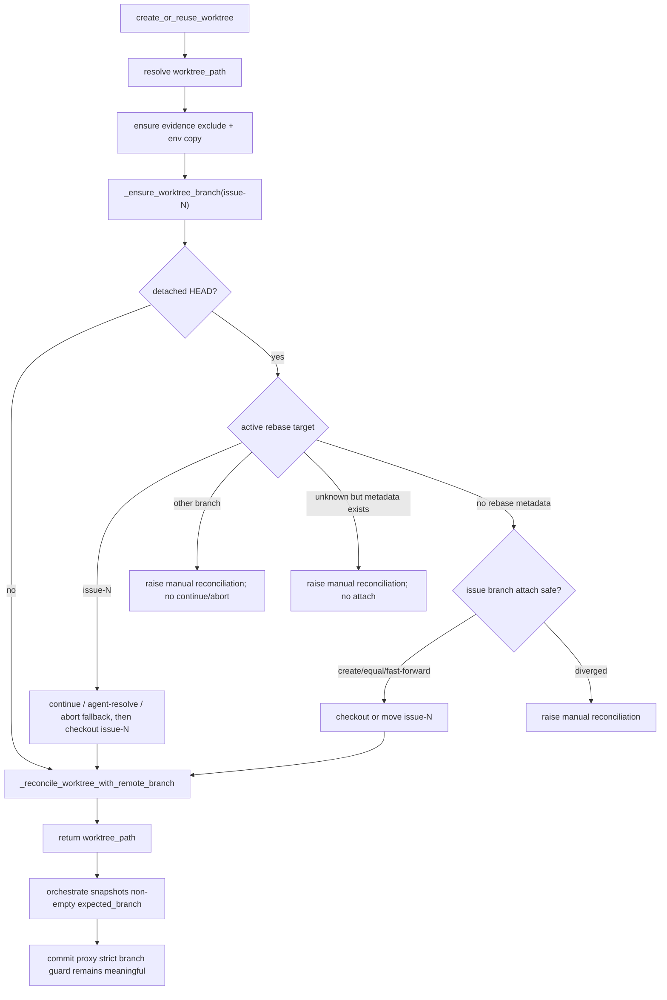

# PRD: Agent Runner Worktree Reuse Rebase-State Self-Heal

- Incident record: Issue #73 的 "Manual Takeover Recovery" 评论（2026-06-12）
- Updated: 2026-06-14 21:16:05 CST
- Decision update: operator 明确接受自动自愈方案；本 PRD 已从"复用时拒绝 rebase 中间态"改为"受限自动自愈后继续"。

## 1. Introduction & Goals

Issue #73 的重跑暴露了一个与 PR #75 同源但方向相反的 worktree 复用缺陷：

1. 上一次运行在 `pr_supervisor.execute_rebase(...)` 冲突恢复中异常退出，worktree 可能被留在 active rebase / detached HEAD 状态。
2. operator 重新打 `agent/ready` 后，`agent_runner_orchestrate._process_ready_issue` 复用该 worktree。
3. 如果 runner 在自愈前就快照 `expected_branch = get_current_branch(...)`，detached HEAD 会让 `expected_branch` 变成空字符串。
4. agent 后续回到正确 issue 分支并写出 commit request 时，`commit_requested_changes(...)` 会因 `"issue-73" != ""` 把正确分支误判成不安全分支。

本 PRD 的目标是：复用 worktree 时自动把可证明属于当前 Issue 的 detached/rebase 状态恢复到 `issue-<number>` 分支，保证 agent、commit proxy 和 publish 流程看到非空且正确的 branch context；对无法证明归属的 rebase 状态失败并保留现场。

### Proposed Solution Summary

在 `run_agent_once.create_or_reuse_worktree(...)` 的共同入口中复用 `agent_runner_worktree_branch._ensure_worktree_branch(...)` 做受限自动自愈：先将 worktree 恢复到当前 Issue 的 `issue-<number>` 分支，再执行 `_reconcile_worktree_with_remote_branch(...)` 做远程分支对齐。自愈使用现有 `IProcessRunner` Git 边界和 `agent_runner_git.get_active_rebase_target(...)` / `has_rebase_metadata(...)` helper，不新增配置、持久状态或 workflow label。普通 `commit_requested_changes(...)` 的严格分支门禁保持不变；本方案修复的是门禁基准，而不是放宽门禁。

可自动恢复的状态：

- detached HEAD 且没有 active rebase metadata：当 `issue-<number>` 分支不存在、指向当前 HEAD，或可 fast-forward 到当前 HEAD 时，checkout / move branch。
- active rebase 且目标分支可确认等于 `issue-<number>`：尝试 `git rebase --continue`；有冲突时调用配置的 agent 解决并继续；修复尝试耗尽后执行 `git rebase --abort` 并 checkout 目标分支。

必须拒绝并保留现场的状态：

- active rebase target 不等于当前 Issue 分支。
- Git 显示存在 rebase metadata，但 target branch 无法确认。
- detached HEAD 与 `issue-<number>` 分支已经分叉，无法安全 fast-forward。

### Realistic Validation

除单元测试和集成测试外，本 PRD 要求通过**真实项目入口点**验证关键行为，确保真实使用路径生效，而非仅在隔离 fixture 中通过。

- [x] **detached HEAD 自愈真实验证**：用真实 Git 临时仓库制造 detached worktree，经 `create_or_reuse_worktree(...)` 验证恢复到 `issue-<number>` 分支，`expected_branch` 不会为空。
- [x] **active rebase 自愈验证**：覆盖 active rebase target 等于当前 Issue 分支时，runner 允许继续 rebase；冲突无法修复时执行 abort 并 checkout 目标分支。
- [x] **错误 rebase target 拒绝验证**：fake runner 命令序列验证 active rebase target 不属于当前 Issue 时，不执行 `rebase --continue`、`rebase --abort` 或 checkout 错误 target。
- [x] **不可确认 rebase target 拒绝验证**：fake runner 验证存在 rebase metadata 但 target 不可读时，不被当成普通 detached HEAD 自动挂到当前 issue 分支。
- [x] **remote reconcile 顺序验证**：真实 Git remote 场景验证 detached worktree 先恢复分支，再做远程分支对齐，避免 `git ls-remote --heads origin ""` 或空 refspec。
- [x] **真实 run 入口验证**：`run_once()` / `_process_ready_issue` 级测试验证远程对齐发生在 agent 启动前，且不再把空 branch snapshot 传入 commit 门禁。
- [x] **全仓库回归**：`just test` 已在初步审查时通过；完成本 PRD 更新和代码收紧后需再次运行。

### Delivery Dependencies

- Group: agent-runner-rebase-recovery
- Depends on groups:
  - none
- Depends on tasks/issues:
  - GitHub Issue #73 / PR #75（已归档 PRD：`tasks/archive/P1-BUG-20260528-095136-agent-runner-rebase-detached-head-branch-guard.md`）
  - Issue #71 worktree sync（已归档 PRD：`tasks/archive/P1-BUG-20260527-112400-agent-runner-worktree-sync.md`）
- Gate type: none
- Notes: 本 PRD 是 PR #75 的后续复用路径修正，且已与 worktree remote sync 的入口顺序协同：**先分支自愈，再远程对齐**。

## 2. Requirement Shape

**Actor**：运行 `iar run` / `iar review` / `iar review-daemon` 的本地 Agent Runner operator，特别是失败重跑场景（`agent/failed` -> `agent/ready`）。

**Trigger**：

- 上一次运行把 issue worktree 留在 detached HEAD。
- 或者 worktree 处于 active rebase，且 Git metadata 中的 target branch 可确认。
- operator 重新标记 Issue 为 ready，runner 经 `_process_ready_issue` -> `create_or_reuse_worktree(...)` 复用该 worktree；review 路径经 `review_once` 复用同一入口。

**Expected Behavior**：

- 普通分支 worktree：行为不变。
- detached HEAD 且无 active rebase metadata：
  - `issue-<number>` 分支不存在 -> 在当前 HEAD 创建并 checkout。
  - `issue-<number>` 分支等于当前 HEAD -> checkout 该分支。
  - `issue-<number>` 分支是当前 HEAD 的祖先 -> `checkout -B issue-<number> <detached_sha>`。
  - 分支与当前 HEAD 分叉 -> fail with manual reconciliation message。
- active rebase target 等于 `issue-<number>`：
  - 无冲突且 `git rebase --continue` 成功 -> 继续正常 runner 流程。
  - 有冲突 -> 调用配置 agent 解决冲突，读取 `.agent-runner/commit-request.json`，验证安全变更，提交冲突解决并继续 rebase。
  - 达到 `post_pr_supervisor.max_repair_attempts` 仍未恢复 -> `git rebase --abort`，若仍 detached 则 checkout target branch。
- active rebase target 不等于 `issue-<number>` -> fail，不执行 continue/abort/checkout target。
- 存在 active rebase metadata 但 target branch 不可确认 -> fail，不当作普通 detached HEAD 自动恢复。
- `create_or_reuse_worktree(...)` 必须先完成分支自愈，再调用 `_reconcile_worktree_with_remote_branch(...)`，避免 remote sync 在空 branch 名上运行。
- `_process_ready_issue` 后续 `expected_branch = get_current_branch(...)` 必须得到非空分支；`commit_requested_changes(...)` 严格门禁保持不变。

**Explicit Scope Boundary**：

- 不改变 agent prompt、workflow label 状态机、publish recovery、PR 创建逻辑。
- 不放宽 `commit_requested_changes(...)` / publish 的 branch guard。
- 不自动恢复无法证明归属的 active rebase。
- 不引入数据库、队列、本地 checkpoint、配置开关或新的持久状态。
- 不处理 dirty/diverged remote branch 以外的新策略；已有 `_reconcile_worktree_with_remote_branch(...)` 继续负责 remote ahead/local ahead/diverged 分类。

## 3. Repository Context And Architecture Fit

### Current Relevant Modules And Files

| Path | Current Responsibility | Relevance |
|---|---|---|
| `src/backend/core/use_cases/run_agent_once.py` | `create_or_reuse_worktree(...)`、agent 执行编排、helper 聚合导出 | 自愈与 remote reconcile 的共同入口；保护 ready 与 review 复用方 |
| `src/backend/core/use_cases/agent_runner_worktree_branch.py` | `_ensure_worktree_branch(...)`、`_reconcile_worktree_with_remote_branch(...)` | 自动自愈和远程分支对齐的主要实现 |
| `src/backend/core/use_cases/agent_runner_git.py` | Git helper、verification | 提供 branch/head/rebase metadata helper |
| `src/backend/core/use_cases/agent_runner_orchestrate.py` | `_process_ready_issue` 等 Issue 路由 | 消费 `create_or_reuse_worktree(...)` 返回后的 branch snapshot；不应承载自愈逻辑 |
| `src/backend/core/use_cases/pr_supervisor.py` | `execute_rebase(...)` post-PR rebase conflict recovery | active rebase target 语义来源；PR #75 已覆盖 rebase 中间态合法恢复 |
| `src/backend/core/use_cases/agent_runner_commit.py` | `commit_requested_changes(...)` 严格分支门禁 | 行为保持不变，是空 snapshot bug 的受害方 |
| `src/backend/core/use_cases/review_once.py` | review 路径复用 worktree | 通过共同入口自动获得保护 |
| `tests/test_run_agent.py` | run 编排、worktree sync、自愈集成测试 | 主要测试落点 |
| `tests/test_pr_supervisor.py` | supervisor/rebase 行为测试 | 继续证明 PR #75 rebase conflict guard 不回归 |
| `docs/guides/agent-runner.md` | operator 操作文档 | 已描述 worktree 分支状态自愈语义 |

### Existing Path

当前目标路径：

```text
iar run / review
  -> create_or_reuse_worktree(repo_path, issue, config, process_runner)
       -> create/reuse/path command
       -> ensure_evidence_dir_excluded
       -> copy missing env files
       -> expected_branch = issue-<number>
       -> _ensure_worktree_branch(worktree_path, expected_branch, ...)
            -> normal branch: no-op
            -> detached no rebase: attach or fast-forward issue branch
            -> active rebase target == expected_branch: continue/agent-resolve/abort fallback
            -> active rebase target mismatched or unknown: fail, no destructive action
       -> _reconcile_worktree_with_remote_branch(...)
            -> only runs after branch context is non-empty
  -> expected_branch = get_current_branch(worktree_path, process_runner)
  -> run_agent_until_committed(..., expected_branch=expected_branch)
  -> commit_requested_changes(..., strict expected_branch guard)
```

### Reuse Candidates

- Reuse `agent_runner_worktree_branch._ensure_worktree_branch(...)` instead of adding a new `WorktreeStateService`.
- Reuse `agent_runner_git.get_active_rebase_target(...)` and `has_rebase_metadata(...)` for active rebase detection.
- Reuse `pr_supervisor.build_conflict_resolution_prompt(...)` and `run_agent_once.run_agent_with_prompt(...)` for conflict resolution attempts.
- Reuse `_reconcile_worktree_with_remote_branch(...)` after self-heal; do not merge remote sync concerns into rebase detection.

### Architecture Constraints

- Changes stay in `src/backend/core/use_cases/`; core must not import `infrastructure`.
- All Git operations go through `IProcessRunner`.
- Rebase metadata paths must be resolved through `git rev-parse --git-path ...`, because linked worktrees often use `.git` files that point into common git dirs.
- Python file I/O must use `encoding="utf-8"`.
- `agent_runner_orchestrate.py` is near the file-size warning threshold; keep orchestration unchanged and place guard behavior in the shared worktree helper.

### Potential Redundancy Risks

- Do not copy rebase metadata parsing into `run_agent_once.py`.
- Do not add another worktree recovery module while `_ensure_worktree_branch(...)` owns this behavior.
- Do not encode branch naming in multiple places beyond the current `expected_branch = f"issue-{issue.number}"` use in `create_or_reuse_worktree(...)`.
- Do not change `commit_requested_changes(...)` to accept detached HEAD; ordinary commit proxy must remain strict.

### Existing PRD Relationship

- This updates the still-pending PRD `tasks/pending/P1-BUG-20260612-105203-agent-runner-worktree-reuse-rebase-state-guard.md`; no duplicate pending PRD was found.
- Related completed PRD `tasks/archive/P1-BUG-20260528-095136-agent-runner-rebase-detached-head-branch-guard.md` defines the active rebase target safety model for `execute_rebase(...)`.
- Related completed PRD `tasks/archive/P1-BUG-20260527-112400-agent-runner-worktree-sync.md` defines remote branch reconciliation. This PRD depends on order, not ownership: self-heal must run before remote reconcile.

## 4. Recommendation

### Recommended Approach

Keep the automatic self-heal approach, but make the safety contract explicit and enforce it in code:

1. In `create_or_reuse_worktree(...)`, compute `expected_branch = f"issue-{issue.number}"`, call `_ensure_worktree_branch(...)`, then call `_reconcile_worktree_with_remote_branch(...)`.
2. In `_ensure_worktree_branch(...)`, only recover active rebase when `get_active_rebase_target(...) == expected_branch`.
3. If `get_active_rebase_target(...)` returns another branch, raise a manual reconciliation error and do not abort or continue.
4. If `get_active_rebase_target(...)` returns `None` but `has_rebase_metadata(...)` is true, raise a manual reconciliation error and do not attach the detached HEAD to the issue branch.
5. Only treat detached HEAD as attachable when no active rebase metadata exists.
6. Keep `commit_requested_changes(...)`, publish branch guards, and `classify_failure(...)` unchanged.

### Why This Is The Best Fit

- It matches the accepted product behavior: failed runner state should be recovered automatically when Git can prove the state belongs to the current Issue.
- It keeps the safety line from PR #75: detached/rebase state is acceptable only with branch ownership proof.
- It avoids the original empty `expected_branch` bug by restoring branch context before orchestration snapshots it.
- It avoids running remote reconciliation on empty branch names, which can produce empty remote refs or no-op `ls-remote` probes.
- It centralizes worktree preparation in the common entry point used by both run and review paths.

### Rationale For Rejecting Redundant Abstractions

- No new `WorktreeStateService`: the current worktree helper already owns branch healing and remote reconciliation.
- No new configuration switch: an unsafe worktree state is not a user preference; it is either provably recoverable or manual.
- No GitHub label/comment state for local rebase metadata: active rebase is local filesystem state and would drift if persisted remotely.

### Alternatives Considered

| Alternative | Description | Rejected Because |
|---|---|---|
| Refuse all detached/rebase reuse | Fail before agent starts and ask operator to run `git rebase --abort` or remove worktree | User explicitly wants automatic self-heal; existing code and docs already implement it |
| Auto-heal every active rebase regardless of target | Continue or abort any active rebase found in the reused worktree | Could mutate a rebase belonging to another Issue or branch |
| Treat unreadable rebase metadata as plain detached HEAD | Attach `issue-<number>` branch to current HEAD when `head-name` is missing | Hides a corrupted or unknown active rebase and can rewrite the issue branch onto unverified state |
| Run remote reconcile before branch self-heal | Keep current remote sync order | Detached HEAD has empty branch name; remote probes may run against empty branch/refspec |
| Relax `commit_requested_changes(...)` | Allow detached HEAD or empty expected branch in commit proxy | Weakens a critical branch safety gate and masks the root cause |

## 5. Implementation Guide

This section is a living implementation guide based on current repository analysis. If implementation discovers additional affected files, hidden dependencies, edge cases, or a better path, update this PRD before proceeding.

### Core Logic

```text
create_or_reuse_worktree(...)
  -> resolve worktree_path
  -> ensure_evidence_dir_excluded(...)
  -> copy_missing_env_files(...)
  -> expected_branch = issue-<number>
  -> _ensure_worktree_branch(...)
       -> if not detached: return
       -> target = get_active_rebase_target(...)
       -> if target == expected_branch: recover active rebase
       -> if target is other branch: raise manual reconciliation
       -> if target is None and has_rebase_metadata(...): raise manual reconciliation
       -> otherwise attach/fast-forward expected branch to detached HEAD when safe
  -> _reconcile_worktree_with_remote_branch(...)
  -> return worktree_path
```

Search anchors:

```bash
rg -n "def create_or_reuse_worktree|_ensure_worktree_branch|_reconcile_worktree_with_remote_branch" src/backend tests
rg -n "get_active_rebase_target|has_rebase_metadata|rebase-merge|rebase-apply" src/backend tests
rg -n "expected_branch = get_current_branch|commit_requested_changes" src/backend/core/use_cases
rg -n "分支状态自愈|detached HEAD|active rebase" docs/guides tasks
```

### Change Impact Tree

```text
.
├── src/backend/core/use_cases/
│   ├── run_agent_once.py
│   │   [修改]
│   │   【总结】create_or_reuse_worktree 中调整顺序：先 _ensure_worktree_branch，再 _reconcile_worktree_with_remote_branch。
│   │
│   ├── agent_runner_worktree_branch.py
│   │   [修改]
│   │   【总结】active rebase 只在 target 等于当前 issue branch 时自愈；target 不匹配或不可确认时失败并保留现场。
│   │
│   └── agent_runner_git.py
│       [修改]
│       【总结】新增 has_rebase_metadata(...)，区分"无 rebase"与"有 rebase 但 target 不可确认"。
│
├── tests/
│   └── test_run_agent.py
│       [修改]
│       【总结】覆盖 detached-before-reconcile、真实 Git remote 场景、错误 active rebase target、不可确认 target 四类回归。
│
└── docs/guides/agent-runner.md
    [已同步]
    【总结】描述 remote reconcile 与分支状态自愈语义。
```

### Executor Drift Guard

- `rg -n "_ensure_worktree_branch\\(" src/backend tests` 确认新增调用方是否需要同样的 target 绑定语义。
- `rg -n "git\", \"ls-remote\", \"--heads\"" src/backend tests` 确认没有其他路径会对空 branch 名做 remote 探测。
- `rg -n "git\", \"rebase\", \"--abort\"" src/backend tests` 确认 abort 仅发生在已确认归属或 attempts exhausted 的路径。
- `rg -n "git\", \"reset\", \"--hard\"" src/backend` 确认本 PRD 未引入 destructive reset。
- 如果 `worktree.create_command` 支持非 `issue-<number>` 命名模板，必须先统一 branch derivation，再扩展自愈；当前实现以既有配置约定为准。

### Flow Diagram



### Realistic Validation Plan

| Behavior | Real Entry Point | Test Layer | Mock Boundary | Data/Env Needed | Command Or Procedure | Required For Acceptance |
|---|---|---|---|---|---|---|
| detached worktree heals before remote reconcile | `create_or_reuse_worktree(...)` | unit/integration | process runner fake for command order | detached HEAD responses plus remote branch probe | `uv run pytest tests/test_run_agent.py -k "heals_detached_before_reconcile" -v` | Yes |
| detached worktree with real remote heals and avoids empty remote branch | `create_or_reuse_worktree(...)` + real Git repo | integration | Git real; GitHub not involved | bare remote, linked worktree, detached checkout | `uv run pytest tests/test_run_agent.py -k "before_remote_reconcile_real_git" -v` | Yes |
| active rebase target mismatch fails without mutation | `_ensure_worktree_branch(...)` | unit | process runner fake records commands | `rebase-merge/head-name` points to other branch | `uv run pytest tests/test_run_agent.py -k "mismatched_rebase_target" -v` | Yes |
| active rebase metadata exists but target unavailable fails without attach | `_ensure_worktree_branch(...)` | unit | process runner fake records commands | rebase dir exists, head-name missing | `uv run pytest tests/test_run_agent.py -k "unconfirmed_rebase_target" -v` | Yes |
| original self-heal behavior still works | `_ensure_worktree_branch(...)` and `create_or_reuse_worktree(...)` | integration | Git real where needed | detached HEAD and active rebase fixtures | `uv run pytest tests/test_run_agent.py -k "ensure_worktree_branch or create_or_reuse_worktree_heals_detached_head" -v` | Yes |
| full repository regression | `just test` | regression | existing test suite | local dev env | `just test` | Yes |

Failure triage:

- If real Git tests fail at `git worktree add`, ensure the source checkout has switched away from the branch being added to the linked worktree.
- If command-order tests fail before branch assertions, check `ensure_evidence_dir_excluded(...)` fixture responses for `git rev-parse --git-path info/exclude`.
- If active rebase target is unexpectedly `None`, inspect `git rev-parse --git-path rebase-merge/head-name` and `rebase-apply/head-name` paths before reading files directly.

### ER Diagram

No data model changes.

### Interactive Prototype Change Log

No prototype changes.

### External Validation

No external validation required; repository-local Git behavior is sufficient.

## 6. Definition Of Done

- `create_or_reuse_worktree(...)` restores safe branch context before remote reconcile and before `_process_ready_issue` snapshots `expected_branch`.
- Active rebase is auto-recovered only when target branch equals the current Issue branch.
- Active rebase with mismatched or unconfirmed target fails without `rebase --continue`, `rebase --abort`, `reset`, or checkout of the wrong target.
- Detached HEAD without rebase metadata is attached to `issue-<number>` only when create/equal/fast-forward is safe; diverged state fails.
- Remote reconciliation never runs against empty current branch in the reuse path.
- Commit proxy and publish branch gates remain strict and unchanged.
- Tests and docs reflect automatic self-heal semantics.
- `just test` passes before archiving.

## 7. Acceptance Checklist

### Architecture Acceptance

- [x] Self-heal logic stays in `agent_runner_worktree_branch.py`; orchestration does not duplicate branch-state logic.
- [x] `create_or_reuse_worktree(...)` calls `_ensure_worktree_branch(...)` before `_reconcile_worktree_with_remote_branch(...)`.
- [x] `agent_runner_git.py` exposes helper coverage for both active rebase target and rebase metadata presence.
- [x] All Git commands go through `IProcessRunner`; Python file reads use `encoding="utf-8"`.
- [x] No new service, config switch, persistent state, or workflow label was added.

### Behavior Acceptance

- [x] Detached HEAD without rebase metadata can be restored to `issue-<number>` when branch attach is safe.
- [x] Diverged detached HEAD fails with manual reconciliation guidance.
- [x] Active rebase target equal to `issue-<number>` can be recovered automatically.
- [x] Active rebase target not equal to `issue-<number>` fails without continue/abort/checkout target.
- [x] Active rebase metadata with unreadable target fails without attaching the issue branch.
- [x] Remote reconcile happens only after branch self-heal; no `ls-remote --heads <remote> ""` call occurs in the reuse self-heal path.
- [x] `_process_ready_issue` receives a worktree whose `get_current_branch(...)` is non-empty before normal agent execution.
- [x] `commit_requested_changes(...)` branch guard remains unchanged.

### Documentation Acceptance

- [x] `docs/guides/agent-runner.md` describes remote branch alignment and branch-state self-heal.
- [x] No `mkdocs.yml` update required because no new documentation page was added.

### Validation Acceptance

- [x] `uv run pytest tests/test_run_agent.py -k "ensure_worktree_branch or create_or_reuse_worktree_heals_detached_head" -q` passed with 9 selected tests.
- [x] `just test` passes after this PRD/code update.
- [x] PRD is moved from `tasks/pending/` to `tasks/archive/` after all checklist items are complete.

## 8. Functional Requirements

- **FR-1**: `create_or_reuse_worktree(...)` MUST perform branch self-heal before remote branch reconciliation.
- **FR-2**: Active rebase MUST be automatically recovered only when Git metadata confirms target branch equals `issue-<number>`.
- **FR-3**: Active rebase target mismatch MUST fail without `git rebase --continue`, `git rebase --abort`, `git reset`, or checkout of the mismatched target.
- **FR-4**: Active rebase metadata with unconfirmed target MUST fail and MUST NOT be treated as plain detached HEAD.
- **FR-5**: Detached HEAD without rebase metadata MAY be attached to `issue-<number>` only when the branch is missing, equal to HEAD, or an ancestor of HEAD.
- **FR-6**: Diverged detached HEAD MUST fail with manual reconciliation guidance.
- **FR-7**: `_process_ready_issue` and review reuse paths MUST not pass an empty expected branch into commit/publish flows.
- **FR-8**: `commit_requested_changes(...)` and publish branch guards MUST remain strict and unchanged.
- **FR-9**: Remote reconcile MUST NOT run against an empty branch name in the normal reuse self-heal path.
- **FR-10**: Validation MUST include fake command-order tests and real Git integration for detached worktree reuse.

## 9. Non-Goals

- Changing agent prompts or conflict-resolution instructions.
- Changing workflow labels, Issue/PR comments, or publish recovery behavior.
- Allowing ordinary commit proxy to commit from detached HEAD.
- Auto-recovering active rebase that belongs to another branch.
- Auto-recovering corrupted or unreadable rebase metadata.
- Adding a configuration flag to disable or loosen branch safety.
- Replacing `_reconcile_worktree_with_remote_branch(...)` remote sync semantics.
- Requiring live GitHub credentials.

## 10. Risks And Follow-Ups

- **Conflict-resolution commit shape**: `_recover_from_active_rebase(...)` currently commits conflict resolution before `git rebase --continue`. Real Git accepts this in tested scenarios, but it differs from `execute_rebase(...)`'s `git add -A` + `rebase --continue` flow. If future tests expose duplicate/odd commits, consolidate both paths onto the supervisor rebase-continue semantics.
- **Branch naming assumption**: `create_or_reuse_worktree(...)` derives `issue-<number>` directly. If worktree branch naming becomes configurable, self-heal must consume the same branch derivation as worktree creation.
- **Git metadata differences**: Git versions may differ between `rebase-merge` and `rebase-apply`; helper coverage must keep both.
- **Operator visibility**: Rejected mismatched/unconfirmed rebase states fail with RuntimeError today. If operators need richer guidance in Issue comments, add targeted formatting without weakening the guard.

## 11. Decision Log

| ID | Decision | Chosen | Rejected | Rationale |
|---|---|---|---|---|
| D-01 | Reuse detached/rebase state handling | Automatic self-heal when branch ownership is proven | Always fail and require operator cleanup | User explicitly wants automatic self-heal; current docs and tests already support it |
| D-02 | Active rebase ownership rule | Recover only when target equals `issue-<number>` | Recover any active rebase found in the reused worktree | Prevents mutating a rebase belonging to another Issue/branch |
| D-03 | Unknown rebase metadata | Fail and preserve state | Treat as plain detached HEAD | Unknown active rebase cannot prove branch ownership |
| D-04 | Operation order | Self-heal before remote reconcile | Remote reconcile before self-heal | Detached HEAD has empty branch name; remote reconcile needs a real branch |
| D-05 | Commit proxy branch guard | Keep strict and unchanged | Accept detached HEAD or inferred branch in commit proxy | The bug is the snapshot baseline, not the guard itself |
