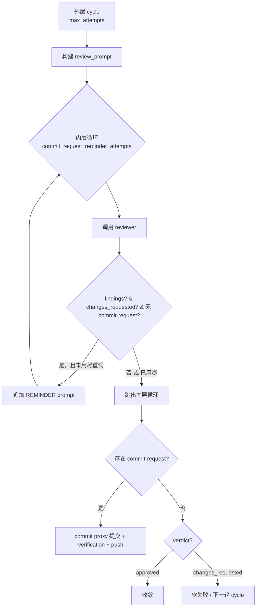

# PRD: Pre-PR Review Findings Commit Request Reminder

- GitHub Issue: https://github.com/zata-zhangtao/keda/issues/104#issuecomment-runner-review-fix

## 1. Introduction & Goals

### Problem Statement

当前 `iar run` 在实现 agent 提交后会进入 pre-PR AI review 门禁。Reviewer 被明确要求：若发现 findings，必须在 worktree 中落实修复并写出 `.agent-runner/commit-request.json`，由 runner 通过 commit proxy 提交并推送。

实践中出现如下情况：

- 第一轮 reviewer 正常产出 commit request 并提交修复。
- 第二轮 reviewer 再次报出 findings（high/medium/low），但**只列问题、不写 commit request**。
- `run_pre_pr_review(...)` 在最后一轮遇到 "findings 存在但无 commit request" 时，只能记录 `reviewer reported findings but produced no commit request` 并软失败退出。

用户的预期是"review 后自动修复并提交，两轮修复足够"。旧行为在第二轮根本没有产生可提交 diff，导致 runner 提前失败，与预期不符。

### Proposed Solution Summary

**在 `run_pre_pr_review(...)` 的每一轮 review 内增加内层重试：当 reviewer 报出 findings 但未写 `.agent-runner/commit-request.json` 时，runner 追加一条严格提醒 prompt，并在同一 cycle 内重新调用 reviewer，最多 `commit_request_reminder_attempts` 次（默认 1 次）。**

- **谁供给输入**：`.iar.toml` 中的 `[agent_runner.pre_pr_review].commit_request_reminder_attempts`，默认 1；运维可显式置 0 恢复旧行为。
- **插入的扩展点**：`src/backend/core/use_cases/agent_review.py` 的 `run_pre_pr_review(...)` 循环体，新增 `max_inner_attempts` 内层循环； reminder prompt 由新增 `_build_commit_request_reminder_prompt()` 生成。
- **系统状态变化**：同一 review cycle 内，reviewer 可能收到第二条包含 "REMINDER #1" 和结构化 findings 列表的 prompt；若第二轮产出 commit request，则正常走 commit proxy 并收敛；若仍只列问题不补丁，才走软失败。
- **有意避免的复杂度**：不新增持久化表或 state 文件；不引入独立"修复 agent"；不改现有 commit proxy、verdict schema、findings schema、PRD 发布时机或 daemon 恢复模型。

### Measurable Objectives

- 给定 `commit_request_reminder_attempts=1` 的配置，当 reviewer 第一轮报 findings 且无 commit request、第二轮产出 commit request 时，pre-PR review 在同一 cycle 内收敛通过。
- 当 `commit_request_reminder_attempts=0` 时，行为与旧逻辑完全一致：findings 无 commit request 直接软失败。
- 新配置项在 core `PrePrReviewConfig`、infrastructure `AgentRunnerPrePrReviewSettings`、factory 映射、`.iar.toml` 字段注释、`docs/guides/agent-runner.md` 中保持一致。
- `just test` 全绿，`uv run mkdocs build --strict` 通过。

### Realistic Validation

除单元测试和集成测试外，本 PRD 要求通过**真实项目入口点**验证关键行为，确保真实使用路径生效，而非仅在隔离 fixture 中通过。

- [x] **Reviewer findings 无 commit request 重试真实验证**：通过 `uv run pytest tests/test_agent_review.py::test_run_pre_pr_review_reminds_reviewer_then_commits -q`，以真实 `run_pre_pr_review(...)` 入口 + fake process runner，验证第一轮 findings-only 触发提醒、第二轮 commit request 被提交并收敛。
- [x] **零重试回退真实验证**：通过 `uv run pytest tests/test_agent_review.py::test_run_pre_pr_review_zero_reminder_attempts_fails_fast -q`，验证 `commit_request_reminder_attempts=0` 时 reviewer 仅被调用一次即软失败。
- [x] **配置一致性真实验证**：通过 `uv run pytest tests/test_agent_config_consistency.py -q`，验证 infrastructure settings 与 core config 的 `commit_request_reminder_attempts` 默认值一致、factory 正确映射。
- [x] **无回归真实验证**：通过 `just test` 确认现有 pre-PR review、daemon、CLI、deliberation 测试全部通过。

**为什么单元测试不够**：本改动改变的是 `run_pre_pr_review(...)` 真实循环体内的状态机（何时重试、何时提交、何时软失败），必须在真实入口函数中验证 `reviewer_decision`、`request_path`、inner loop 的交互；孤立解析函数或纯 prompt 构造测试无法证明循环收敛路径。

### Delivery Dependencies

- Group: none
- Depends on groups:
  - none
- Depends on tasks/issues:
  - `tasks/archive/P1-BUG-20260610-100457-pre-push-review-empty-commit-request-hard-fail.md`（相关上下文：同模块 commit request 异常处理，但无阻塞关系）
- Gate type: none
- Notes: 本改动与 deliberate async discussion PRD（`tasks/pending/P1-FEAT-20260622-193742-deliberate-issue-async-discussion.md`）由同一 runner 失败触发，但修改点不同、无逻辑依赖。

## 2. Requirement Shape

### Actor

- 运行 `iar run --once` 或 `iar daemon` 的本地 Agent Runner operator。
- 查看 GitHub Issue `Pre-PR Review Result` 评论的开发者。

### Trigger

- `pre_pr_review.enabled=true`。
- Reviewer 在某一 review cycle 中返回 `changes_requested` verdict 并附带非空 `findings` 数组。
- 该 cycle 结束时 worktree 中不存在 `.agent-runner/commit-request.json`。

### Expected Behavior

1. Runner 检测到 "findings 存在但无 commit request" 后，不立即结束该 cycle。
2. Runner 追加 reminder prompt（包含 "REMINDER #N" 标题和待修复 findings 列表），重新调用同一 reviewer agent。
3. 若重试后 reviewer 写出 commit request，则按现有 commit proxy 路径提交、重跑 verification、push callback，并根据最终 verdict 收敛或继续下一轮 cycle。
4. 若用尽 `commit_request_reminder_attempts` 次重试后仍无 commit request，则按现有软失败路径记录 `reviewer reported findings but produced no commit request`。
5. `commit_request_reminder_attempts=0` 时，完全禁用内层重试，行为与改动前一致。

### Explicit Scope Boundary

- 仅修改 pre-PR review 循环内的重试策略，不改 reviewer prompt 默认模板、findings schema、commit-request schema、commit proxy。
- 不新增独立修复 agent 或自动补丁合成逻辑。
- 不新增数据库表、本地 state 文件、外部依赖。
- 不改变 `max_attempts` 的语义：它仍控制外层 review cycle 数量；内层 reminder 重试不计入 `max_attempts`。

## 3. Repository Context And Architecture Fit

### Current Relevant Modules/Files

| 文件 | 作用 | 与本次改动关系 |
|---|---|---|
| `src/backend/core/use_cases/agent_review.py` | pre-PR review 主循环 | 新增 `_build_commit_request_reminder_prompt()`；`run_pre_pr_review(...)` 增加内层重试循环 |
| `src/backend/core/shared/models/agent_runner.py` | core 配置模型 | `PrePrReviewConfig` 新增 `commit_request_reminder_attempts: int = 1` |
| `src/backend/infrastructure/config/settings.py` | infrastructure 配置模型 | `AgentRunnerPrePrReviewSettings` 新增同名字段 |
| `src/backend/engines/agent_runner/factory.py` | settings → core config 映射 | 透传 `commit_request_reminder_attempts` |
| `src/backend/engines/agent_runner/repository_local.py` | `.iar.toml` 初始化与字段注释 | 新增 `pre_pr_review.commit_request_reminder_attempts` 字段注释 |
| `tests/test_agent_review.py` | pre-PR review 集成测试 | 新增重试收敛与零重试回退两个回归测试 |
| `tests/test_agent_config_consistency.py` | 配置一致性测试 | 新增 infrastructure/core 字段默认值一致性断言 |
| `docs/guides/agent-runner.md` | Agent Runner operator 文档 | 两处 `.iar.toml` 示例与行为说明补充 |

### Existing Path

最接近本需求的现有路径是：

```text
iar run --once / iar daemon
  └─ run_agent_repositories_once / run_agent_daemon
       └─ run_agent_until_committed
            └─ publish phase 触发 run_pre_pr_review(...)
                 └─ run_agent_with_prompt(reviewer_agent, review_prompt)
                      └─ reviewer 可能写出 .agent-runner/commit-request.json
                           └─ commit_requested_changes(...)
```

改动点位于 `run_pre_pr_review(...)` 内部，紧接 `run_agent_with_prompt` 之后、commit proxy 之前。

### Architecture Constraints

- 必须遵守四层依赖方向：`api/` → `core/` → `engines/` → `infrastructure/`。配置字段从 `infrastructure` 流向 `core` 经 `engines/agent_runner/factory.py` 映射，符合现有模式。
- `core/use_cases/agent_review.py` 仅依赖 `core/shared/interfaces/` 与 `core/use_cases/run_agent_once.py` 的已有公开函数，不新增 engines/infrastructure 依赖。
- 新字段必须有默认值，保证现有 `.iar.toml` 不写该字段时行为不变（默认开启 1 次 reminder）。

### Existing PRD Relationship

- 在 `tasks/pending/` 中未发现针对 "findings 无 commit request" 重试的重复 PRD。
- 在 `tasks/archive/` 中发现相关上下文 PRD：`P1-BUG-20260610-100457-pre-push-review-empty-commit-request-hard-fail.md`，它处理的是"写了 commit request 但无文件改动"的异常分类；本 PRD 处理的是"未写 commit request"的循环重试。两者在同模块但独立，无依赖关系。
- 与 `tasks/pending/P1-FEAT-20260622-193742-deliberate-issue-async-discussion.md` 由同一 runner 失败触发，但修改文件与函数不同，可独立交付。

## 4. Recommendation

### Recommended Approach

在 `run_pre_pr_review(...)` 每轮 review 内新增内层循环：

1. 调用 reviewer。
2. 解析 verdict 与 findings。
3. 若 findings 非空、verdict 为 `changes_requested`、且不存在 `.agent-runner/commit-request.json`，且未超过 `commit_request_reminder_attempts`，则追加 reminder prompt 并 `continue`。
4. 否则 `break`，继续走原有 commit-request / 软失败分支。

新增配置项 `commit_request_reminder_attempts`，默认 `1`，允许运维显式置 `0` 恢复旧行为。

### Why This Fits

- 最小改动：复用现有 reviewer agent、commit proxy、findings schema，只增加一个内层重试和 reminder prompt 构造。
- 不改变状态机外层语义：`max_attempts` 仍控制 review cycle 数量；内层重试是同一 cycle 内的"补救"。
- 向后兼容：默认开启 1 次 reminder，但若 reviewer 本来就遵守规则写 commit request，行为与旧逻辑完全一致（只多一次 cheap 的条件判断）。

### Alternatives Considered

- **激进方案：runner 自己把 findings 转成 fix prompt，再调一次实现 agent 去生成 patch。**  rejected：会引入新的 agent 调用路径和补丁合成逻辑，增加复杂度和失败面；当前 reviewer agent 已被明确要求"有 findings 就写 commit request"，应优先让 reviewer 完成自己的职责。

## 5. Implementation Guide

> This section is a living implementation guide based on current repository analysis. If implementation discovers additional affected files, hidden dependencies, edge cases, or a better path, update this PRD before proceeding.

### Core Logic

1. `build_review_packet(...)` 照常构造 review prompt（含 diff、verification results、review rules）。
2. `run_pre_pr_review(...)` 进入外层 `for attempt_index in range(max_attempts)` 循环。
3. 每轮先计算 `max_inner_attempts = max(0, review_config.commit_request_reminder_attempts)`。
4. 进入内层 `for inner_attempt in range(max_inner_attempts + 1)` 循环：
   - 调用 `run_agent_with_prompt(reviewer_agent, review_prompt, ...)`。
   - 解析 `stdout_decision` 与可选的 `commit_request_decision`。
   - 若 `reviewer_decision.has_findings` 且 `verdict == "changes_requested"` 且 `request_path` 不存在，且 `inner_attempt < max_inner_attempts`，则：
     - 调用 `_build_commit_request_reminder_prompt(review_prompt, reviewer_decision.findings, reminder_index=inner_attempt + 1)` 生成新 prompt。
     - `continue` 重新调用 reviewer。
   - 否则 `break`。
5. 内层循环退出后，原有逻辑不变：
   - 若存在 commit request → `commit_requested_changes(...)`。
   - 若 approved → 收敛。
   - 若 changes_requested 无 commit request → 软失败。

### Change Impact Tree

```text
.
├── src/backend/core/use_cases/agent_review.py
│   [修改]
│   【总结】pre-PR review 主循环增加 findings 无 commit request 时的内层 reminder 重试
│   ├── 新增 _build_commit_request_reminder_prompt()：把 findings 拼成 REMINDER 追加到 review prompt
│   └── run_pre_pr_review() 增加 max_inner_attempts 内层循环，重试条件判断与日志
│
├── src/backend/core/shared/models/agent_runner.py
│   [修改]
│   【总结】PrePrReviewConfig 新增 commit_request_reminder_attempts 字段
│   └── commit_request_reminder_attempts: int = 1
│
├── src/backend/infrastructure/config/settings.py
│   [修改]
│   【总结】AgentRunnerPrePrReviewSettings 新增同名字段，保持与 core 默认值一致
│   └── commit_request_reminder_attempts: int = 1
│
├── src/backend/engines/agent_runner/factory.py
│   [修改]
│   【总结】factory 把 infrastructure 的 commit_request_reminder_attempts 映射到 core PrePrReviewConfig
│   └── PrePrReviewConfig(..., commit_request_reminder_attempts=pre_pr.commit_request_reminder_attempts)
│
├── src/backend/engines/agent_runner/repository_local.py
│   [修改]
│   【总结】.iar.toml 初始化字段注释表新增 pre_pr_review.commit_request_reminder_attempts 说明
│   └── _IAR_FIELD_COMMENTS["pre_pr_review.commit_request_reminder_attempts"] = "..."
│
├── tests/test_agent_review.py
│   [修改]
│   【总结】新增两个回归测试覆盖 reminder 重试收敛与零重试回退
│   ├── test_run_pre_pr_review_reminds_reviewer_then_commits
│   └── test_run_pre_pr_review_zero_reminder_attempts_fails_fast
│   └── 原 test_run_pre_pr_review_soft_fails_with_findings_on_last_cycle 显式置 commit_request_reminder_attempts=0
│
├── tests/test_agent_config_consistency.py
│   [修改]
│   【总结】新增 infrastructure 与 core config 的 commit_request_reminder_attempts 一致性断言
│   └── test_settings_review_and_supervisor_match_core 增加 assert
│
└── docs/guides/agent-runner.md
    [修改]
    【总结】两处 .iar.toml 示例与 Pre-PR Review 行为说明补充 commit_request_reminder_attempts
    ├── [agent_runner.pre_pr_review] 示例增加 commit_request_reminder_attempts = 1
    └── Pre-PR Review 段落说明内层提醒重试机制
```

### Executor Drift Guard

- 搜索所有 `PrePrReviewConfig(` 构造点，确保新字段被显式或默认值覆盖：
  ```bash
  rg -n "PrePrReviewConfig\(" src tests
  ```
- 搜索所有 `.iar.toml` 中 `[agent_runner.pre_pr_review]` 的示例或文档快照，确保新字段说明同步：
  ```bash
  rg -n "pre_pr_review" docs
  ```
- 如果未来有人把 `commit_request_reminder_attempts` 改名为其他名称，需同步更新 `AgentRunnerPrePrReviewSettings`、`PrePrReviewConfig`、factory 映射、字段注释、文档示例；可用以下搜索兜底：
  ```bash
  rg -n "commit_request_reminder_attempts" src tests docs
  ```

### Flow / Architecture Diagram



### Realistic Validation Plan

| Behavior | Real Entry Point | Test Layer | Mock Boundary | Data/Env Needed | Command Or Procedure | Required For Acceptance |
|---|---|---|---|---|---|---|
| Findings 无 commit request → reminder → 第二次 commit request → 收敛 | `run_pre_pr_review(...)` via `tests/test_agent_review.py` | integration | `IProcessRunner`/`IGitHubClient` mocked | tmp_path worktree, fake runner returns findings then writes commit-request | `uv run pytest tests/test_agent_review.py::test_run_pre_pr_review_reminds_reviewer_then_commits -q` | Yes |
| `commit_request_reminder_attempts=0` 禁用重试，行为回退 | `run_pre_pr_review(...)` via `tests/test_agent_review.py` | integration | `IProcessRunner`/`IGitHubClient` mocked | tmp_path worktree, fake runner returns findings only | `uv run pytest tests/test_agent_review.py::test_run_pre_pr_review_zero_reminder_attempts_fails_fast -q` | Yes |
| 配置字段 infrastructure ↔ core 一致性 | `tests/test_agent_config_consistency.py` | unit | none | default config instances | `uv run pytest tests/test_agent_config_consistency.py::test_settings_review_and_supervisor_match_core -q` | Yes |
| 全量无回归 | `just test` recipe | e2e/lint/unit | external services skipped by markers | local Python venv, just, pre-commit | `just test` | Yes |
| 文档构建 | `uv run mkdocs build --strict` | docs build | none | mkdocs deps installed | `uv run mkdocs build --strict` | Yes |

No live external services required. The highest-fidelity real entry point is `run_pre_pr_review(...)` itself; CLI-level live `iar run` is not required because the fix is entirely inside the review-loop state machine.

### Low-Fidelity Prototype

Not required; this change has no UI or multi-step interaction surface.

### ER Diagram

No data model changes in this PRD.

### Interactive Prototype Change Log

No interactive prototype file changes in this PRD.

### External Validation

No external validation required; repository evidence was sufficient.

## 6. Definition Of Done

- [x] `src/backend/core/use_cases/agent_review.py` 实现内层重试与 reminder prompt。
- [x] `commit_request_reminder_attempts` 配置项在 core、infrastructure、factory、字段注释中同步。
- [x] `tests/test_agent_review.py` 覆盖重试收敛与零重试回退。
- [x] `tests/test_agent_config_consistency.py` 覆盖配置一致性。
- [x] `docs/guides/agent-runner.md` 更新配置示例与行为说明。
- [x] `just test` 全绿。
- [x] `uv run mkdocs build --strict` 通过。
- [x] 无架构层依赖方向破坏。

## 7. Acceptance Checklist

### Architecture Acceptance

- [x] `commit_request_reminder_attempts` 仅作为配置字段从 `infrastructure` 流向 `core`，未引入反向依赖或跨层调用。
- [x] `src/backend/core/use_cases/agent_review.py` 未直接导入 `engines/` 或 `infrastructure/`。
- [x] 新增字段具有默认值 `1`，现有未配置仓库行为可预测。

### Dependency Acceptance

- [x] 无新增外部依赖。
- [x] 无新增数据库表或本地 state 文件。

### Behavior Acceptance

- [x]  reviewer 第一轮报 findings 且无 commit request、第二轮产出 commit request 时，pre-PR review 在同一 cycle 内收敛。
- [x] `commit_request_reminder_attempts=0` 时，findings 无 commit request 直接软失败，与旧行为一致。
- [x] reviewer 正常写 commit request 时，内层循环不触发，行为零回归。
- [x] reviewer 返回 `approved` 且无 findings 时，不触发 reminder。
- [x] reviewer 返回 `changes_requested` 但无 findings 时，不触发 reminder。

### Documentation Acceptance

- [x] `docs/guides/agent-runner.md` 两处 `[agent_runner.pre_pr_review]` 示例包含 `commit_request_reminder_attempts = 1`。
- [x] `docs/guides/agent-runner.md` Pre-PR Review 行为说明解释内层 reminder 重试机制。

### Validation Acceptance

- [x] `uv run pytest tests/test_agent_review.py -q` 通过。
- [x] `uv run pytest tests/test_agent_config_consistency.py -q` 通过。
- [x] `just test` 全绿。
- [x] `uv run mkdocs build --strict` 通过。

## 8. Functional Requirements

- **FR-1**: `run_pre_pr_review(...)` 必须在同一 review cycle 内支持内层重试，重试次数由 `review_config.commit_request_reminder_attempts` 决定。
- **FR-2**: 当且仅当 reviewer 决策为 `changes_requested`、存在结构化 findings、且 worktree 中不存在 `.agent-runner/commit-request.json` 时，才触发 reminder 重试。
- **FR-3**: Reminder prompt 必须包含待修复 findings 列表，并明确要求 reviewer 写出 `.agent-runner/commit-request.json`。
- **FR-4**: `commit_request_reminder_attempts=0` 必须完全禁用内层重试，行为与改动前一致。
- **FR-5**: 新配置项必须在 `PrePrReviewConfig`、`AgentRunnerPrePrReviewSettings`、factory 映射、`.iar.toml` 字段注释中保持一致。
- **FR-6**: 外层 `max_attempts` 语义不变；内层 reminder 重试不计入外层 attempt。

## 9. Non-Goals

- 不引入独立"补丁 agent"自动把 findings 转成代码修改。
- 不修改 reviewer 默认 prompt 模板或 findings JSON schema。
- 不修改 commit proxy、`commit_requested_changes(...)`、EmptyCommitRequestError 处理路径。
- 不改 PRD 发布时机、daemon 恢复/checkpoint 机制、label 工作流。
- 不要求 reviewer 在 reminder 后必须返回 `approved`；reminder 只要求必须产出 commit request。

## 10. Risks And Follow-Ups

- **风险：reminder prompt 仍无法让某些模型产出 commit request。** 缓释：配置项可调；若默认 1 次不足，用户可增大 `commit_request_reminder_attempts`，或未来在 reviewer prompt 模板中强化指令。
- **风险：内层重试增加 API 调用开销。** 缓释：仅在没有 commit request 时触发，正常 reviewer 行为不受影响；默认仅 1 次。
- **跟进（可选）**：观察真实运行日志中 reminder 触发频率，必要时把默认 reminder 次数或 prompt 模板作为调优项。

## 11. Decision Log

| ID | Decision | Chosen | Rejected | Rationale |
|---|---|---|---|---|
| D-01 | 重试策略 | 同一 review cycle 内追加 reminder 并重新调用 reviewer | 新增独立 patch agent 把 findings 转成代码 | 复用现有 reviewer 职责与 commit proxy，最小侵入；新 agent 会引入额外失败面和维护成本。 |
| D-02 | 配置项默认值 | `commit_request_reminder_attempts = 1` | 默认 0（保持旧行为）或 2 以上 | 默认 1 能在不显著增加成本的前提下修复常见"只列问题不补丁"场景；默认 0 无法改善用户体验，默认过大则浪费 token。 |
| D-03 | 重试计入规则 | 内层 reminder 不计入外层 `max_attempts` | 内层重试消耗一次 `max_attempts` | `max_attempts` 应保持为"review cycle"语义；reminder 是同一 cycle 内的补救，不应消耗整轮 review。 |
