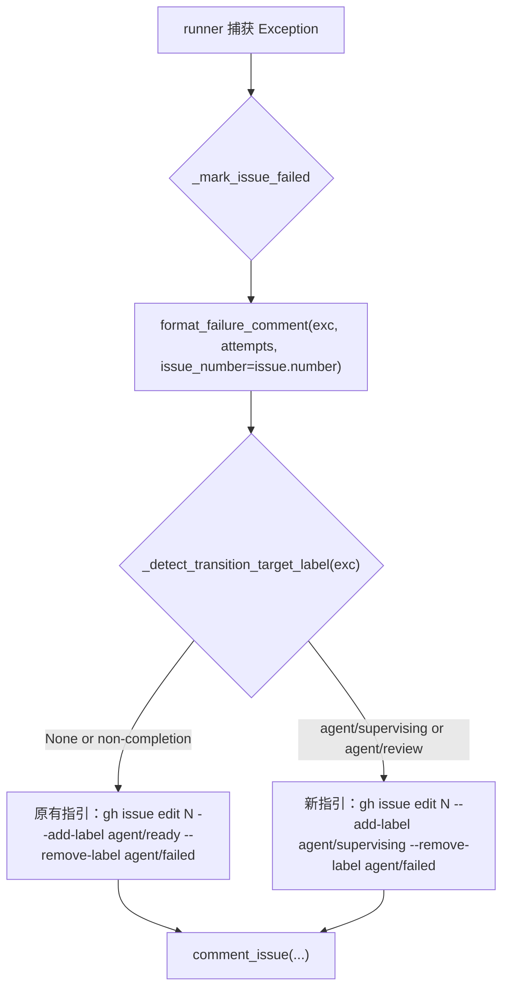

# PRD: Agent Runner 失败恢复提示识别 Workflow 标签切换失败

## 1. Introduction & Goals

Agent Runner 在非 publish 阶段失败时，会通过 `format_failure_comment(...)` 在 Issue 评论末尾追加恢复指引，命令固定为：

```bash
gh issue edit <n> --add-label agent/ready --remove-label agent/failed
```

该指引假设失败发生在 agent 执行、验证或 commit 阶段，重新从 `agent/ready` 开始是合理的。但实践中出现一种新的失败场景：本地实现已经完成（commit、验证、mkdocs、just test 全部通过），只是在最后的 workflow 状态切换（如 `running → supervising`）时，`gh issue edit` 因 GitHub API 临时抖动（EOF、429 等）失败。此时若按指引回到 `agent/ready`，runner 会从头重跑整个实现流程，产生无意义的重复工作甚至额外 commit。

本 PRD 约束一个最小修复切片：让失败评论的恢复指引能够识别失败是否发生在 workflow label 切换命令上，并针对"实现已完成、仅标签切换失败"的场景给出直接继续切换的建议。

### Proposed Solution Summary

- **核心机制**：扩展 `src/backend/core/use_cases/agent_runner_failure.py` 中的评论构建函数，使其能够从 `subprocess.CalledProcessError` 的命令文本中解析 `gh issue edit ... --add-label <target>` 的目标 label；当目标 label 是完成态 workflow label（`agent/supervising`、`agent/review`）时，恢复指引改为直接切到该目标 label，而非回到 `agent/ready`。
- **输入来源**：无需调用方额外传参，由评论构建函数根据异常对象自身信息推断。
- **接入点**：仅修改 `format_failure_comment(...)` 与 `format_minimal_failure_comment(...)` 内部的恢复指引生成逻辑；`_mark_issue_failed`、orchestrate 层、状态机均不变。
- **行为变化**：当失败由 `gh issue edit --add-label agent/supervising`（或 `agent/review`）触发时，Issue 评论的 How To Recover 建议直接执行 `gh issue edit <n> --add-label agent/supervising --remove-label agent/failed`，并附带说明"agent 工作已完成，只需补标签切换"。
- **刻意避免的复杂度**：不改 workflow 状态机；不新增配置项；不引入重试逻辑；不在 `transition_issue_workflow_state` 里做特殊错误包装；不试图自动恢复标签（仍由 operator 手动执行）。

### Measurable Objectives

- 当 `_mark_issue_failed` 收到的异常是 `CalledProcessError` 且命令为 `gh issue edit <n> --add-label agent/supervising` 时，生成的 `Agent Runner Failed` 评论 How To Recover 段包含 `gh issue edit <n> --add-label agent/supervising --remove-label agent/failed`。
- 当命令目标 label 是 `agent/review` 时，恢复命令同理指向 `agent/review`。
- 当命令目标 label 是 `agent/running` 或 `agent/ready`（非完成态）时，保持原有回到 `agent/ready` 的恢复建议。
- 当异常不是 `gh issue edit` 标签切换命令失败时，保持原有回到 `agent/ready` 的恢复建议。
- `format_failure_comment(...)` 不传 `issue_number` 时输出与现状一致；`format_publish_failure_comment` 行为不变。
- `just test` 全绿；`docs/guides/agent-runner.md` 失败重跑章节同步补充该场景说明。

### Realistic Validation

除单元测试和集成测试外，本 PRD 要求通过**真实项目入口点**验证关键行为，确保真实使用路径生效，而非仅在隔离 fixture 中通过。

- [x] **完成态标签切换失败真实验证**：通过 `uv run pytest tests/test_run_agent.py -q` 中新增测试，验证当 `CalledProcessError` 的 cmd 为 `gh issue edit 104 --add-label agent/supervising --remove-label agent/running` 时，`format_failure_comment` 输出包含 `gh issue edit 104 --add-label agent/supervising --remove-label agent/failed`。
- [x] **非标签切换失败保持原有行为真实验证**：通过 `uv run pytest tests/test_run_agent.py -q` 验证普通 agent error 失败仍输出回到 `agent/ready` 的恢复命令。
- [x] **Orchestrate 端到端路径真实验证**：通过 `uv run pytest tests/test_agent_runner_orchestrate.py -q` 验证 orchestrate 失败处理路径写入的评论在标签切换失败场景下包含正确的目标 label 恢复命令。
- [x] **全量回归真实验证**：通过 `just test` 验证 lint、架构检查、PRD checklist 检查与全量 pytest 均通过。

**为什么单元测试不够**：`format_failure_comment` 是纯函数，单元测试可以覆盖字符串生成，但本变更的价值在于"runner 真实失败处理路径如何根据异常类型生成差异化的评论"。必须通过 orchestrate 层的真实失败捕获路径（`FakeGitHubClient` 捕获 `comment_issue` 调用）验证，才能证明 `_mark_issue_failed` 无需额外上下文即可把正确的恢复建议写入 Issue 评论。

### Delivery Dependencies

- Group: agent-runner-failure-recovery
- Depends on groups:
  - none
- Depends on tasks/issues:
  - none
- Gate type: none
- Notes: 本 PRD 是对已归档 `tasks/archive/P2-FEAT-20260611-103232-failure-comment-recovery-guidance.md` 中 D-03 决策（非 publish 失败统一给 relabel 重跑指引）的局部调整。因实践中发现 workflow 标签切换失败属于"工作已完成"场景，需差异化指引。二者无 hard 依赖，可独立交付。

## 2. Requirement Shape

**Actor**：在 GitHub Issue 上看到 `Agent Runner Failed` 评论的 operator。

**Trigger**：runner 在 workflow 状态切换阶段失败，具体表现为 `subprocess.CalledProcessError`，其命令文本匹配 `gh issue edit <n> --add-label <target-label> --remove-label <current-label>`，且 `<target-label>` 是 `agent/supervising` 或 `agent/review`。

**Expected Behavior**：

- 失败评论的 How To Recover 段根据失败场景给出不同建议：
  - 若是完成态标签切换失败：直接给出补切换命令，例如 `gh issue edit <n> --add-label agent/supervising --remove-label agent/failed`，并说明 agent 工作已完成。
  - 否则：保持原有回到 `agent/ready` 的命令。
- 评论仍包含根因摘要、Attempt History（如有）、异常文本。

**Explicit Scope Boundary**：

- 不修改 `format_publish_failure_comment`。
- 不修改 `transition_issue_workflow_state` 或任何 workflow 状态机逻辑。
- 不新增自动重试、自动恢复标签逻辑。
- 不新增配置项或持久化状态。
- 不修改 orchestrate 层调用 `format_failure_comment` 的方式。

## 3. Repository Context And Architecture Fit

### Current Relevant Modules And Files

| Path | Current Role | Change Relationship |
|---|---|---|
| `src/backend/core/use_cases/agent_runner_failure.py` | 失败分类与失败评论构建 | 新增 `_detect_transition_target_label` 辅助函数；`format_failure_comment` 与 `format_minimal_failure_comment` 的恢复指引段根据目标 label 动态生成 |
| `src/backend/core/use_cases/agent_runner_failure_marking.py` | 失败状态标记与评论写入 | 无需修改；`_mark_issue_failed` 继续把异常对象原样传给评论构建函数 |
| `src/backend/core/use_cases/agent_runner_workflow.py` | workflow label 互斥转换 | 无需修改；仅作为目标 label 语义参考 |
| `tests/test_run_agent.py` | 既有 `format_failure_comment` 测试所在 | 新增完成态标签切换失败场景断言 |
| `tests/test_agent_runner_orchestrate.py` | orchestrate 失败路径测试 | 新增/扩展标签切换失败端到端断言 |
| `docs/guides/agent-runner.md` | 失败重跑章节 | 补充"workflow 标签切换失败"场景说明 |

### Existing Path

```text
runner 失败
  -> agent_runner_orchestrate.run_once 捕获 Exception
  -> _mark_issue_failed(issue, config, github_client, exc)
  -> transition_issue_workflow_state 打 agent/failed 标签
  -> format_failure_comment(exc, attempt_results, issue_number=issue.number)
     -> 当前：无论 exc 是什么，How To Recover 都建议回到 agent/ready
     -> 目标：若 exc 是 gh issue edit --add-label agent/supervising/review，建议直接切到目标 label
  -> comment_issue(issue.number, body)
```

### Reuse Candidates

- 复用 `format_failure_comment` 与 `format_minimal_failure_comment` 现有的恢复指引段结构，仅动态替换目标 label 与说明文案。
- 复用 `agent_runner_workflow.py` 中定义的 workflow state labels 集合来判断目标 label 是否为完成态。
- 复用既有 `AttemptResult` 测试构造模式。

### Architecture Constraints

- 变更全部留在 `src/backend/core/use_cases/`、`tests/`、`docs/`；`core/` 不得导入 `engines.*`、`infrastructure.*`、`api.*`。
- 不新增配置项、状态文件、依赖。
- 保持 `format_failure_comment` 函数签名不变；`issue_number` 仍为 keyword-only 可选参数。

### Existing PRD Relationship

- `tasks/pending/` 中无重叠工作。
- `tasks/archive/P2-FEAT-20260611-103232-failure-comment-recovery-guidance.md` 是本 PRD 的前身，它决定非 publish 失败统一给 `agent/ready` 重跑指引。本 PRD 基于实践反馈对其中 D-03 决策做局部修正，不推翻其整体架构。
- 本 PRD 与 `tasks/pending/P1-FEAT-20260622-193742-deliberate-issue-async-discussion.md` 同改 `agent_runner_failure.py` 文件族但关注点不同（彼处改 PRD 上下文内联，此处改恢复指引），soft 协调，无逻辑冲突。
- 本 PRD 可独立执行。

### Potential Redundancy Risks

- 不应为"解析目标 label"新建独立模块；逻辑应内聚在 `agent_runner_failure.py` 的评论构建函数旁。
- 不应为完成态判断新增配置；直接引用 `agent_runner_workflow.py` 中的 workflow state labels 集合即可。

## 4. Recommendation

### Recommended Approach：在 `agent_runner_failure.py` 内根据异常命令推断目标 label 并动态生成恢复指引

1. 新增私有辅助函数 `_detect_transition_target_label(exc: BaseException) -> str | None`，从 `CalledProcessError.cmd` 中解析 `gh issue edit <n> ... --add-label <target>` 的 `<target>`。
2. 在 `format_failure_comment` 与 `format_minimal_failure_comment` 中，调用该辅助函数；若返回的 target label 属于完成态集合 `{agent/supervising, agent/review}`，则生成"直接继续切换"指引；否则保持原有"回到 agent/ready"指引。
3. 新增/扩展测试覆盖两种场景：完成态标签切换失败、普通 agent error。
4. 同步更新 `docs/guides/agent-runner.md`。

**为什么最适合现有架构**：失败评论的所有内容已集中在 `agent_runner_failure.py`，异常对象本身携带了足够信息（失败的 `gh issue edit` 命令），无需 orchestrate 层传递额外上下文即可做出判断。改动最小，不破坏任何调用契约。

**拒绝的冗余抽象**：

- **在 `transition_issue_workflow_state` 里抛特定异常**：需要改 workflow 模块并传递 target label，扩大影响面；且 `CalledProcessError` 已经携带足够信息。拒绝。
- **新增按 `FailureType` 的指引矩阵**：本场景无法通过 `FailureType` 区分（它仍是 `AGENT_ERROR` 或外部命令失败），必须看具体命令文本。拒绝。
- **注入 `config.labels` 动态渲染 label 名**：当前仓库未自定义 label 名，注入 config 会扩大函数签名与调用链改动面，收益有限。拒绝（沿用既有硬编码默认名，并在 Risks 中记录）。

### Alternatives Considered

- **在 `_mark_issue_failed` 中预先判断并传入 recovery_label 参数**：会把"什么场景该给什么指引"的判断职责泄漏到 orchestrate/marking 层，而异常命令文本属于失败详情，应由 failure 模块处理。拒绝。
- **对 `transition_issue_workflow_state` 失败做自动重试**：能缓解网络抖动，但改动面大、需要重试策略与幂等性考虑，超出本 PRD 范围。可作为后续跟进，但不在本次交付。

## 5. Implementation Guide

This section is a living implementation guide based on current repository analysis. If implementation discovers additional affected files, hidden dependencies, edge cases, or a better path, update this PRD before proceeding.

### Core Logic

#### Detect Target Label From Failed Transition Command

Search anchors:

```bash
rg -n "def format_failure_comment|def format_minimal_failure_comment|CalledProcessError" src/backend/core/use_cases/agent_runner_failure.py
```

Required behavior:

- 新增 `_detect_transition_target_label(exc: BaseException) -> str | None`：
  - 仅当 `exc` 是 `subprocess.CalledProcessError` 时继续。
  - 从 `exc.cmd` 拼接命令字符串。
  - 用正则匹配 `gh issue edit \d+ .*--add-label (\S+)`。
  - 返回匹配到的目标 label；不匹配或命令格式不符时返回 `None`。
- 新增 `_is_completion_workflow_label(label: str, config: AppConfig | None = None) -> bool`：
  - 当 label 在 `{agent/supervising, agent/review}` 中时返回 True。
  - 为减少耦合，可直接硬编码这两个默认名；也可可选接受 `AppConfig` 从 `config.labels` 读取（但本 PRD 推荐不注入 config）。

#### Dynamic Recovery Guidance In Failure Comments

Search anchors:

```bash
rg -n "### How To Recover|add-label agent/ready --remove-label agent/failed" src/backend/core/use_cases/agent_runner_failure.py
```

Required behavior:

- 在 `format_failure_comment` 与 `format_minimal_failure_comment` 中：
  - 调用 `_detect_transition_target_label(exc)` 得到 `target_label`。
  - 若 `target_label` 是完成态 workflow label：
    - 说明句改为："The agent finished its work, but the final workflow label transition failed. You can retry the transition without re-running the agent:"
    - bash 代码块：`gh issue edit {issue_number} --add-label {target_label} --remove-label agent/failed`
  - 否则保持原有说明句与 `agent/ready` 代码块。
- 脏 worktree 提示与文档指向在两种场景下均保留。

### Change Impact Tree

```text
Domain
├── src/backend/core/use_cases/agent_runner_failure.py
│   [修改]
│   【总结】根据异常命令中的目标 workflow label 动态生成差异化恢复指引
│
│   ├── 新增 _detect_transition_target_label 辅助函数
│   ├── 新增 _is_completion_workflow_label 辅助函数
│   ├── format_failure_comment 的 How To Recover 段支持完成态 label 直接切换
│   └── format_minimal_failure_comment 的 How To Recover 段支持完成态 label 直接切换
│
├── Tests
│   ├── tests/test_run_agent.py
│   │   [修改]
│   │   【总结】新增完成态标签切换失败场景的恢复指引断言
│   │   │
│   │   ├── test_format_failure_comment_transition_to_supervising_recovery
│   │   └── test_format_failure_comment_transition_to_review_recovery
│   │
│   └── tests/test_agent_runner_orchestrate.py
│       [修改]
│       【总结】新增 orchestrate 捕获标签切换失败后写入评论的端到端断言
│       │
│       └── test_mark_issue_failed_transition_failure_recovery_guidance
│
└── Docs
    └── docs/guides/agent-runner.md
        [修改]
        【总结】失败重跑章节补充 workflow 标签切换失败场景的恢复说明
```

文件列表是分析起点而非穷举保证，发现新受影响文件时先更新本 PRD（见 Executor Drift Guard）。

### Executor Drift Guard

- Run `rg -n "format_failure_comment\(" src tests` and confirm every call site either passes `issue_number=` or intentionally relies on the backward-compatible default.
- Run `rg -n "_detect_transition_target_label|_is_completion_workflow_label" src/backend/core/use_cases/agent_runner_failure.py` and confirm the helper functions exist and are only used inside the failure comment builders.
- Run `rg -n "add-label agent/(ready|supervising|review) --remove-label agent/failed" src docs` and confirm all three command variants are textually consistent between code and docs.
- Run `rg -n "How To Recover" src/backend/core/use_cases/agent_runner_failure.py` and confirm the guidance section exists only in `format_failure_comment` / `format_minimal_failure_comment` (not duplicated in orchestrate or marking).

### Flow Diagram



### Realistic Validation Plan

| Behavior | Real Entry Point | Test Layer | Mock Boundary | Data/Env Needed | Command Or Procedure | Required For Acceptance |
|---|---|---|---|---|---|---|
| 完成态标签切换失败评论 | pytest through `format_failure_comment(...)` | use-case | 无外部依赖 | `CalledProcessError` with `gh issue edit` cmd | `uv run pytest tests/test_run_agent.py -q` | Yes |
| 普通 agent error 保持原指引 | pytest through `format_failure_comment(...)` | use-case | 无外部依赖 | `AttemptResult` fixtures | `uv run pytest tests/test_run_agent.py -q` | Yes |
| Orchestrate 端到端路径 | pytest through `agent_runner_orchestrate.run_once` with `FakeGitHubClient` | integration | GitHub client faked | orchestrate fixtures | `uv run pytest tests/test_agent_runner_orchestrate.py -q` | Yes |
| 全仓回归 | Repository test entry | full local regression | 既有测试 fake，无 live 外部写入 | 本地 uv/just 环境 | `just test` | Yes |

Failure triage:

- 若完成态标签切换失败未生成直接切换指引：检查 `_detect_transition_target_label` 正则是否匹配 `gh issue edit <n> --add-label agent/supervising --remove-label agent/running` 的 cmd 列表。
- 若普通 agent error 指引被错误替换：检查 `_is_completion_workflow_label` 是否把 `agent/ready` 误判为完成态。
- 若 orchestrate 测试失败：检查 `_mark_issue_failed` 是否仍把原始 `CalledProcessError` 传给 `format_failure_comment`。
- 若 `just test` 在 PRD checklist 检查失败：确认本 PRD 归档前 Acceptance Checklist 全部勾选。

### Low-Fidelity Prototype

No UI or multi-step human interaction changes in this PRD.

### ER Diagram

No data model changes in this PRD.

### Interactive Prototype Change Log

No interactive prototype file changes in this PRD.

### External Validation

No external validation required; repository evidence (Issue #104 failure comments and `agent_runner_failure.py` source) was sufficient.

## 6. Definition Of Done

- `format_failure_comment` 与 `format_minimal_failure_comment` 在识别到完成态 workflow label 切换失败时，生成直接继续切换的恢复指引。
- 普通失败场景保持原有回到 `agent/ready` 的指引。
- 新增/扩展测试通过；`just test` 全部通过。
- `docs/guides/agent-runner.md` 失败重跑章节同步更新。
- `src/backend/core/` 依赖方向约束不被破坏。
- PRD 归档至 `tasks/archive/`。

## 7. Acceptance Checklist

### Architecture Acceptance

- [x] Changes remain in `src/backend/core/use_cases/agent_runner_failure.py`, `tests/test_run_agent.py`, `tests/test_agent_runner_orchestrate.py`, and `docs/guides/agent-runner.md`.
- [x] No new config key, module, dependency, or label state is introduced.
- [x] `core/` does not import `engines.*`, `infrastructure.*`, or `api.*`.

### Dependency Acceptance

- [x] No new Python or npm dependency is added.
- [x] No hard dependency on other pending PRDs.

### Behavior Acceptance

- [x] `format_failure_comment(CalledProcessError(...cmd=['gh','issue','edit','104','--add-label','agent/supervising','--remove-label','agent/running']...), issue_number=104)` 输出包含 `gh issue edit 104 --add-label agent/supervising --remove-label agent/failed`。
- [x] 上述评论输出同时包含说明文案，提示 agent 工作已完成、只需补标签切换。
- [x] `format_failure_comment` 对普通 `MaxRetriesExceededError` 仍输出回到 `agent/ready` 的恢复命令。
- [x] `format_minimal_failure_comment` 在完成态标签切换失败场景下同样给出直接切换指引。
- [x] `format_failure_comment(...)` 不传 `issue_number` 时输出不含 `gh issue edit`。
- [x] `format_publish_failure_comment` 行为不变。

### Documentation Acceptance

- [x] `docs/guides/agent-runner.md` 失败重跑章节补充 workflow 标签切换失败场景说明。

### Validation Acceptance

- [x] `uv run pytest tests/test_run_agent.py -q` passes with the new tests.
- [x] `uv run pytest tests/test_agent_runner_orchestrate.py -q` passes with the new/extended tests.
- [x] `just test` passes.
- [x] `git diff --check` passes.
- [x] This PRD is archived with all Acceptance Checklist items complete.

## 8. Functional Requirements

**FR-1**: `agent_runner_failure.py` 必须新增 `_detect_transition_target_label(exc: BaseException) -> str | None`，能够从 `subprocess.CalledProcessError` 的命令文本中解析 `gh issue edit <n> ... --add-label <target>` 的目标 label。

**FR-2**: `format_failure_comment(...)` 与 `format_minimal_failure_comment(...)` 必须在目标 label 为 `agent/supervising` 或 `agent/review` 时，生成直接继续切换到该 label 的恢复命令；否则保持原有回到 `agent/ready` 的命令。

**FR-3**: 完成态标签切换失败的恢复指引必须包含说明文案，告知 operator agent 的本地工作已完成，无需重跑。

**FR-4**: 普通失败场景（非完成态标签切换命令失败）的恢复指引必须与修改前保持完全一致。

**FR-5**: `format_failure_comment(...)` 不传 `issue_number` 时输出必须与修改前逐字符一致（向后兼容）。

**FR-6**: `format_publish_failure_comment` 行为不得改变。

## 9. Non-Goals

- 不修改 `format_publish_failure_comment` 或 `iar recover` / `iar recover-publish`。
- 不修改 `transition_issue_workflow_state`、workflow 状态机、失败分类逻辑。
- 不新增自动重试或自动恢复标签逻辑。
- 不注入 `config.labels` 动态渲染自定义 label 名。
- 不要求 live GitHub 验证作为验收条件。

## 10. Risks And Follow-Ups

- 评论中的 label 名使用默认名（`agent/ready`、`agent/failed`、`agent/supervising`、`agent/review`）；若仓库通过配置自定义了 label 名，命令需要 operator 自行替换。如需精确渲染配置后的 label 名，需把 `config.labels` 传入评论构建函数，属后续增强，另立 PRD。
- 正则匹配基于 `gh issue edit` 命令文本；若未来 CLI 调用方式改变（如使用 GitHub REST API 而非 `gh`），解析会失效。但当前 `transition_issue_workflow_state` 统一通过 `IGitHubClient.edit_issue_labels` 实现，实际调用 `gh issue edit` 的是基础设施层 `GitHubClient`，其命令格式稳定。
- 完成态判断仅包含 `supervising` 与 `review`；若未来新增完成态 workflow label，需要同步更新 `_is_completion_workflow_label` 集合。

## 11. Decision Log

| ID | Decision | Chosen | Rejected | Rationale |
|---|---|---|---|---|
| D-01 | 完成态判断数据来源 | 从 `CalledProcessError.cmd` 文本解析目标 label | 由调用方额外传入 `recovery_label` 参数 | 异常对象已携带足够信息，无需改 orchestrate/marking 调用链。 |
| D-02 | 完成态 label 集合 | 硬编码 `{agent/supervising, agent/review}` | 注入 `AppConfig.labels` 动态判断 | 当前仓库未自定义 label 名；注入 config 会扩大函数签名与调用链改动面，收益有限。 |
| D-03 | 是否自动恢复标签 | 只改评论指引，不自动执行标签切换 | 在 `transition_issue_workflow_state` 失败时自动重试或自动切回目标 label | 自动写标签存在并发与状态误判风险，且超出最小修复范围；operator 手动执行更安全。 |
| D-04 | 是否调整既有统一指引策略 | 对完成态标签切换失败场景差异化指引 | 继续沿用统一回到 `agent/ready` 的策略（见已归档 P2-FEAT-20260611-103232） | 实践中发现该场景本地实现已完成，回到 ready 会导致无意义重跑。 |
| D-05 | PRD placement | 完成后归档至 `tasks/archive/` | 长期留在 `tasks/pending/` | 仓库规则要求完成的 PRD 勾选全部 Acceptance Checklist 后归档。 |
