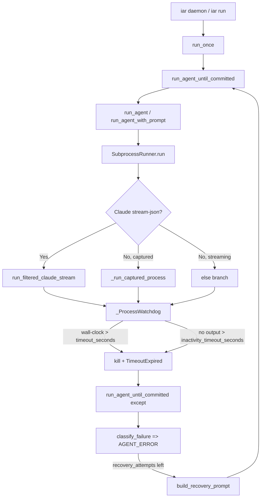

# PRD: Agent Runner 执行阶段超时保护

- GitHub Issue: https://github.com/zata-zhangtao/keda/issues/117（待创建，由当前排查衍生）

## 1. Introduction & Goals

Agent Runner 在调用本地 AI agent（Claude / Kimi）执行 Issue 时，主执行阶段没有任何 wall-clock 超时，也没有无输出超时。一旦 agent 子进程不自行退出（例如 freshai Issue #19 recovery 中 Claude CLI 在 agent 已声明“任务完成”后继续运行），runner 会永久挂起，`process.wait(timeout=None)` 永远不会返回，`_ProcessWatchdog` 只能每隔 60 秒打印 `"still running after ..."` 心跳日志。

### Proposed Solution Summary

**推荐机制**：给 `src/backend/infrastructure/process_runner.py` 的 `_ProcessWatchdog` 增加**无输出超时（inactivity timeout）**能力，同时给 `RunnerConfig` / `AgentRunnerRunnerSettings` 增加**可配置的 wall-clock 超时**，默认 4 小时。超时值通过 `run_agent_until_committed` → `run_agent_with_prompt` → `SubprocessRunner.run()` 一路透传到子进程执行器。这样既能捕获真正卡死的进程，又给大型任务留出充足时间。

- **谁提供输入**：默认由 `config.toml` 的 `[agent_runner.runner]` 提供；未来也可在 Issue body / PRD 中用 `Agent timeout: <seconds>` 覆盖（本次不实现）。
- **插入的现有边界**：不新增模块或服务，直接扩展 `process_runner.py` 的 `_ProcessWatchdog` 和 `run_agent_once.py` 的调用链；`PrePrReviewConfig.timeout_seconds` 已存在同模式 precedent。
- **系统状态/可见行为变化**：超时时 runner 会 kill 子进程，把 `TimeoutExpired` 当作可恢复 `AGENT_ERROR` 进入 recovery；operator 能在日志中看到明确的超时原因。
- **刻意规避的复杂度**：不引入新的 core 抽象、不新增存储、不改动 GitHub label 状态机、不要求 agent 主动心跳；只复用已有的 stdout/stderr 输出流作为活性信号。

### Measurable Objectives

- Agent Runner 主执行阶段不再无限挂起：任何 agent 子进程在 4 小时 wall-clock 或 20 分钟无输出后会被强制终止。
- 超时kill 后，runner 进入 recovery 流程（如仍有重试次数），recovery prompt 能收到清晰的超时说明。
- 配置可覆盖：通过 `.iar.toml` 或 `config.toml` 的 `[agent_runner.runner]` 可调整 `timeout_seconds` 和 `inactivity_timeout_seconds`。
- 不误杀正常大任务：只要进程在 20 分钟内有 stdout/stderr 输出，就不会被 inactivity timeout 终止；只要总耗时不超过 4 小时，就不会被 wall-clock timeout 终止。
- 现有 pre-push review、REPL、deliberation 等已有超时路径不回归。

### Realistic Validation

除单元测试和集成测试外，本 PRD 要求通过**真实项目入口点**验证关键行为，确保真实使用路径生效，而非仅在隔离 fixture 中通过。

- [x] **无输出超时真实验证**：通过真实 Python 子进程（`sleep` 或循环不输出）调用 `SubprocessRunner().run(..., timeout=<大>, inactivity_timeout=2)`，验证 watchdog 在 2 秒无输出后 kill 进程并抛 `TimeoutExpired`。
- [x] **wall-clock 超时真实验证**：通过真实 `claude` 或长睡眠子进程调用 `run_agent_with_prompt(..., timeout_seconds=5)`，验证 5 秒后进程被 kill，runner 记录 `AGENT_ERROR` 并进入 recovery。
- [x] **配置透传真实验证**：启动真实 `iar run --dry-run` 或调用 `create_app_config()` 工厂，验证 `RunnerConfig.timeout_seconds` 和 `inactivity_timeout_seconds` 来自 `config.toml` / `.iar.toml`。
- [x] **正常大任务不被误杀真实验证**：启动一个持续输出但运行 10 秒以上的子进程，配置 inactivity_timeout=20，验证进程正常完成且不被 kill。

**为什么单元测试不够**：watchdog 的单元测试用 mock process 验证 kill 逻辑，但真实路径涉及 `subprocess.Popen`、stdout/stderr 管道、后台线程、signal-free kill、以及 `run_agent_once.py` 对 `TimeoutExpired` 的捕获与 recovery 透传；这些只有真实子进程和真实入口调用才能证明。

### Delivery Dependencies

- Group: none
- Depends on groups:
  - none
- Depends on tasks/issues:
  - none
- Gate type: none
- Notes: 独立 bugfix，不依赖其他 pending PRD。与 `tasks/archive/P1-BUG-20260610-113727-pre-push-review-timeout-diagnostics.md` 为已完成 precedent 关系，非阻塞。

## 2. Requirement Shape

**Actor**：运行 `iar daemon`、`iar run` 或 Agent Runner daemon 的 operator；以及被 Agent Runner 自动调度的 AI agent 子进程。

**Trigger**：
- Agent Runner 为某个 Issue 启动 agent 子进程执行代码变更。
- 子进程 wall-clock 运行时间超过配置上限，或 stdout/stderr 连续无输出超过配置上限。

**Expected Behavior**：
- `_ProcessWatchdog` 在检测到无输出超时时 kill 子进程，并抛出 `subprocess.TimeoutExpired`。
- `_ProcessWatchdog` 在检测到 wall-clock 超时时 kill 子进程，并抛出 `subprocess.TimeoutExpired`。
- `run_agent_once.py` 捕获超时异常，记录为 `AGENT_ERROR`，并在有剩余重试次数时进入 recovery。
- 默认值：wall-clock 4 小时，inactivity 20 分钟；两者都可通过配置覆盖。
- 超时 kill 后，runner 应在日志和 recovery prompt 中明确说明是超时导致。

**Explicit Scope Boundary**：
- 只修改主 agent 执行路径的 timeout 透传和 `_ProcessWatchdog` 的无输出检测。
- 不改变 pre-push review、deliberation、REPL、generated content 等其他已有超时路径。
- 不新增 Issue/PRD 级别的 timeout 覆盖语法（仅保留未来扩展可能性）。
- 不修改 recovery loop 的重试语义（仍由 `max_recovery_attempts` 控制）。
- 不新增后台任务、HTTP API、数据库表或外部依赖。

## 3. Repository Context And Architecture Fit

### Current Relevant Modules And Files

| Path | Current Role | Final State |
|---|---|---|
| `src/backend/infrastructure/process_runner.py` | 子进程执行器 + `_ProcessWatchdog` | `_ProcessWatchdog` 增加无输出超时检测；`run_filtered_claude_stream` / `_run_captured_process` / `SubprocessRunner.run` 透传 `inactivity_timeout` |
| `src/backend/core/shared/models/agent_runner.py` | Core config dataclasses | `RunnerConfig` 增加 `timeout_seconds` 和 `inactivity_timeout_seconds` |
| `src/backend/infrastructure/config/settings.py` | Pydantic settings model | `AgentRunnerRunnerSettings` 增加对应字段 |
| `src/backend/engines/agent_runner/factory.py` | Settings → core config 映射 | 把两个超时字段映射进 `RunnerConfig` |
| `config.toml` | 默认运行配置 | `[agent_runner.runner]` 增加 `timeout_seconds = 14400` 和 `inactivity_timeout_seconds = 1200` |
| `src/backend/core/use_cases/run_agent_once.py` | Agent 执行主循环 | `run_agent_until_committed` 和 `run_agent` 透传超时给 `run_agent_with_prompt` |
| `src/backend/core/use_cases/agent_runner_failure.py` | 失败分类 | 无需修改；`TimeoutExpired` 已被 `classify_failure` 归为 `AGENT_ERROR`（可恢复） |
| `tests/test_process_runner.py` | 子进程执行器测试 | 新增无输出超时测试、wall-clock 与 inactivity 共存测试 |
| `tests/test_agent_config_consistency.py` | 配置一致性测试 | 新增 `RunnerConfig` / settings / factory / `config.toml` 一致性断言 |
| `tests/test_run_agent.py` | Agent 执行用例测试 | 新增 `run_agent_with_prompt` 超时透传测试 |
| `docs/guides/agent-runner.md` | Operator guide | 补充 timeout 与 inactivity timeout 行为说明 |

### Existing Architecture Pattern To Follow

- 子进程 runtime 细节保留在 `src/backend/infrastructure/process_runner.py`。
- Core 层只依赖 `IProcessRunner` port，不直接调用 `subprocess`。
- Settings 解析在 infrastructure，core dataclass 在 core，二者通过 `engines/agent_runner/factory.py` composition root 映射。
- 与 pre-push review timeout precedent（`tasks/archive/P1-BUG-20260610-113727-pre-push-review-timeout-diagnostics.md`）保持一致：配置 → settings → factory → core dataclass → use case 透传 → process runner。

### Ownership And Dependency Boundaries

- `src/backend/core/` 不导入 `backend.infrastructure` 或 `backend.engines`。
- `src/backend/infrastructure/process_runner.py` 可以使用 `subprocess`、`threading`、`time` 等 runtime detail。
- `src/backend/engines/agent_runner/factory.py` 是 settings 到 core config 的合法边界。

### Constraints From Runtime, Docs, Tests, Or Workflows

- Python 文本 I/O 必须显式 `encoding="utf-8"`；新代码遵守。
- `just test` 会先运行 full lint、架构检查、PRD checklist 检查；新增代码与 PRD 必须全部通过。
- 单代码文件非空行不超过 1000 行；`process_runner.py` 当前 569 行，仍有空间。
- `tests/playwright-e2e/` 无关本次修复，不引入 Node validation。
- 归档 PRD 的 Acceptance Checklist 必须全部勾选。

### Matching Or Related PRDs

- `tasks/pending/` 中无重复或相关 PRD。
- `tasks/archive/P1-BUG-20260610-113727-pre-push-review-timeout-diagnostics.md` 是已完成 precedent，它为 pre-push review 增加了 `timeout_seconds`、watchdog heartbeat/timeout、Claude capture 路径。本 PRD 采用同一模式扩展到主 agent 执行，并额外增加 inactivity timeout。
- 关系：已完成 precedent，非阻塞依赖。

## 4. Recommendation

### Recommended Approach

1. **扩展 `_ProcessWatchdog`**：增加 `inactivity_timeout_seconds` 字段。watchdog 线程在每次循环时检查：
   - 进程是否已结束；
   - wall-clock 是否超时；
   - **最近一次输出时间**是否超过 inactivity 阈值。
   任一条件满足即 kill 进程。

2. **给 `RunnerConfig` / `AgentRunnerRunnerSettings` 增加两个字段**：
   - `timeout_seconds: int = 14400`（wall-clock）
   - `inactivity_timeout_seconds: int = 1200`（无输出）

3. **在 factory 中映射**两个字段。

4. **在 `config.toml` 的 `[agent_runner.runner]` 中暴露默认值**。

5. **在 `run_agent_once.py` 中透传**：
   - `run_agent_until_committed` 从 `config.runner` 读取两个值；
   - `run_agent()` 增加 `timeout_seconds` 和 `inactivity_timeout_seconds` 参数；
   - `run_agent_with_prompt()` 增加 `inactivity_timeout_seconds` 参数，并一起传给 `process_runner.run()`。

6. **在 `IProcessRunner.run` 接口**（duck typing）和 `SubprocessRunner.run` 实现中增加 `inactivity_timeout: int | None = None` 参数；`_run_captured_process` 和 `run_filtered_claude_stream` 创建 watchdog 时传入。

7. **测试覆盖**：watchdog 无输出超时、wall-clock + inactivity 共存、配置一致性、超时后进入 recovery。

### Why This Fits

- 直接复用已有的 `_ProcessWatchdog`，只增加一个维度（inactivity），不引入新抽象。
- `PrePrReviewConfig.timeout_seconds` 已经证明同一配置路径可行。
- 4 小时 wall-clock 给大任务足够空间；20 分钟无输出对真正卡死的进程足够敏感。
- `TimeoutExpired` 已被 `run_agent_until_committed` 的异常处理捕获为可恢复错误，无需改动 recovery 状态机。

### Alternatives Considered

- **纯 wall-clock 1 小时超时**： rejected，容易误杀需要跑 `just test` 多次的大型任务。
- **给 Claude 加 `--bare` 标志**：rejected 为本次范围外；`--bare` 会跳过 hooks/LSP/background prefetches，可能解决 Claude 不退出的根因，但属于行为变更，需要单独评估，不适合和超时修复混在一起。
- **Issue-level timeout 覆盖语法（`Agent timeout: 7200`）**：rejected 为本次范围外；4 小时默认已覆盖绝大多数场景，未来可按需扩展。

## 5. Implementation Guide

> This section is a living implementation guide based on current repository analysis. If implementation discovers additional affected files, hidden dependencies, edge cases, or a better path, update this PRD before proceeding.

### Core Logic

1. `SubprocessRunner.run()` 接收可选 `inactivity_timeout`。
2. 对于需要 watchdog 的路径（`_run_captured_process`、非 captured 的 else 分支、`run_filtered_claude_stream`），把 `inactivity_timeout` 传给 `_ProcessWatchdog`。
3. `_ProcessWatchdog` 内部维护 `self._last_output_at = time.monotonic()`，并提供 `note_output()` 方法。
4. 在 stdout/stderr 读取循环中，每读到一行数据就调用 `watchdog.note_output()`。
5. watchdog 线程每 1 秒检查：进程是否结束、wall-clock 超时、inactivity 超时；任一满足即 kill。
6. `run_agent_once.py` 中，`run_agent_until_committed` 把 `config.runner.timeout_seconds` 和 `config.runner.inactivity_timeout_seconds` 传给 `run_agent()` / `run_agent_with_prompt()`。
7. 超时后 `TimeoutExpired` 被捕获为 `AGENT_ERROR`，进入 recovery；recovery prompt 包含超时信息。

### Change Impact Tree

```text
.
├── src/backend/infrastructure/process_runner.py
│   [修改]
│   【总结】给 _ProcessWatchdog 增加无输出超时检测，并在所有使用 watchdog 的路径透传 inactivity_timeout。
│   ├── _ProcessWatchdog.__init__ 增加 inactivity_timeout_seconds 和 last_output_at
│   ├── _ProcessWatchdog 增加 note_output() 与 _check_inactivity_timeout()
│   ├── _ProcessWatchdog._run 每轮检查 inactivity 超时
│   ├── SubprocessRunner.run 增加 inactivity_timeout 参数
│   ├── _run_captured_process 透传 inactivity_timeout，并在 stdout/stderr 读取时调用 note_output()
│   ├── run_filtered_claude_stream 透传 inactivity_timeout，并在 process.stdout 循环中调用 note_output()
│   └── 非 captured 分支的 else 路径同样透传和 note_output()
│
├── src/backend/core/shared/models/agent_runner.py
│   [修改]
│   【总结】RunnerConfig 增加 timeout_seconds 和 inactivity_timeout_seconds 两个配置字段。
│   ├── RunnerConfig.timeout_seconds = 14400
│   └── RunnerConfig.inactivity_timeout_seconds = 1200
│
├── src/backend/infrastructure/config/settings.py
│   [修改]
│   【总结】AgentRunnerRunnerSettings 增加对应 Pydantic 字段。
│   ├── AgentRunnerRunnerSettings.timeout_seconds = 14400
│   └── AgentRunnerRunnerSettings.inactivity_timeout_seconds = 1200
│
├── src/backend/engines/agent_runner/factory.py
│   [修改]
│   【总结】factory 把 settings 的两个超时字段映射进 RunnerConfig。
│   ├── RunnerConfig(...) 增加 timeout_seconds=runner_settings.timeout_seconds
│   └── RunnerConfig(...) 增加 inactivity_timeout_seconds=runner_settings.inactivity_timeout_seconds
│
├── config.toml
│   [修改]
│   【总结】在 [agent_runner.runner] 段暴露默认值。
│   ├── timeout_seconds = 14400
│   └── inactivity_timeout_seconds = 1200
│
├── src/backend/core/use_cases/run_agent_once.py
│   [修改]
│   【总结】把 RunnerConfig 的超时值透传到 run_agent_with_prompt。
│   ├── run_agent() 增加 timeout_seconds / inactivity_timeout_seconds 参数
│   ├── run_agent_until_committed() 调用 run_agent() 时传入 config.runner 的超时值
│   └── run_agent_with_prompt() 增加 inactivity_timeout_seconds 参数并透传
│
├── src/backend/core/shared/interfaces/agent_runner.py
│   [修改]
│   【总结】IProcessRunner 的 duck-typing run 签名增加 inactivity_timeout 参数（文档/注释）。
│   └── IProcessRunner.run(...) 注释中增加 inactivity_timeout: int | None = None
│
├── tests/test_process_runner.py
│   [新增/修改]
│   【总结】补充无输出超时、输出活跃时不误杀、wall-clock 与 inactivity 同时存在等测试。
│   ├── test_process_watchdog_kills_on_inactivity_timeout
│   └── test_process_watchdog_does_not_kill_when_output_is_active
│
├── tests/test_agent_config_consistency.py
│   [新增/修改]
│   【总结】验证 RunnerConfig / settings / factory / config.toml 四者默认值一致。
│   ├── 新增 timeout_seconds / inactivity_timeout_seconds 一致性断言
│
├── tests/test_run_agent.py
│   [新增/修改]
│   【总结】验证 run_agent_with_prompt 把 timeout_seconds/inactivity_timeout_seconds 透传给 process_runner。
│   ├── 新增 timeout 透传测试
│
└── docs/guides/agent-runner.md
    [修改]
    【总结】在 Agent Runner operator guide 中记录 timeout 与 inactivity timeout 的行为和默认值。
    ├── 新增 [agent_runner.runner] 配置说明
    └── 新增超时后日志与 recovery 行为说明
```

### Executor Drift Guard

- 查找所有 `run_agent_with_prompt` 调用：
  ```bash
  rg -n "run_agent_with_prompt" src/backend tests
  ```
- 查找所有 `_ProcessWatchdog(` 创建点：
  ```bash
  rg -n "_ProcessWatchdog\(" src/backend/infrastructure/process_runner.py
  ```
- 查找所有 `process_runner.run(` 调用中是否仍有 `timeout=None` 的 agent 执行路径：
  ```bash
  rg -n "run_agent_with_prompt|run_agent_until_committed|\.run\(.*timeout" src/backend/core/use_cases
  ```
- 如果 `IProcessRunner` 有其他实现（mock/fake），同步更新其 `run` 签名，避免 duck-typing 不一致。

### Flow / Architecture Diagram



### Realistic Validation Plan

| Behavior | Real Entry Point | Test Layer | Mock Boundary | Data/Env Needed | Command Or Procedure | Required For Acceptance |
|---|---|---|---|---|---|---|
| Inactivity timeout kills silent process | `SubprocessRunner().run(..., inactivity_timeout=2)` | smoke | none | Python interpreter | `uv run python - <<'PY' ... SubprocessRunner().run([sys.executable, "-c", "import time; time.sleep(60)"], cwd=tmp_path, timeout=3600, inactivity_timeout=2, check=False) ... PY` | Yes |
| Active output is not killed | `SubprocessRunner().run(..., inactivity_timeout=2)` | smoke | none | Python interpreter | 运行一个每 0.5 秒打印一行、共 10 秒的脚本，验证返回码 0 | Yes |
| Wall-clock timeout透传到 agent 执行 | `run_agent_with_prompt(..., timeout_seconds=5)` | integration | mock `IProcessRunner` / fake process | 构造 fake runner | 单测验证 `process_runner.run()` 收到 `timeout=5` 和 `inactivity_timeout=...` | Yes |
| Config defaults consistency | `create_app_config()` / `AgentRunnerSettings()` | integration | filesystem config | `config.toml` | `uv run pytest tests/test_agent_config_consistency.py -q` | Yes |
| Recovery after timeout | `run_agent_until_committed` with timeout_seconds=5 | integration | mock process_runner that raises TimeoutExpired | issue fixture | 单测验证捕获 `TimeoutExpired` 后进入 recovery attempt | Yes |
| Operator guide accuracy | `docs/guides/agent-runner.md` | docs | none | mkdocs | `uv run mkdocs build --strict` | Yes |

### Low-Fidelity Prototype

Not required; this is a backend runtime behavior change with no UI layout ambiguity.

### ER Diagram

No data model changes in this PRD.

### Interactive Prototype Change Log

No interactive prototype file changes in this PRD.

### External Validation

No external validation required; repository evidence was sufficient.

## 6. Definition Of Done

- [x] `_ProcessWatchdog` 支持 inactivity timeout 并 kill 无输出进程。
- [x] `RunnerConfig`、`AgentRunnerRunnerSettings`、factory、`config.toml` 四方配置一致。
- [x] `run_agent_until_committed` → `run_agent_with_prompt` → `SubprocessRunner.run()` 透传 wall-clock 和 inactivity timeout。
- [x] 超时 kill 后 runner 进入 recovery，recovery prompt 包含超时原因。
- [x] 新增/更新单元测试、集成测试通过。
- [x] `just test` 通过（lint、架构检查、PRD checklist、pytest 全量）。
- [x] `docs/guides/agent-runner.md` 更新。
- [x] PRD Acceptance Checklist 全部完成，PRD 归档到 `tasks/archive/`。

## 7. Acceptance Checklist

### Architecture Acceptance

- [x] `src/backend/core/` 不导入 `backend.infrastructure` 或 `backend.engines`；超时配置通过 core dataclass 透传。
- [x] 子进程 runtime 改动只发生在 `src/backend/infrastructure/process_runner.py`。
- [x] `IProcessRunner` 接口（duck typing）同步更新 `inactivity_timeout` 参数说明。

### Behavior Acceptance

- [x] `SubprocessRunner.run(..., timeout=14400, inactivity_timeout=1200)` 对静默 20 分钟以上的进程 kill 并抛 `TimeoutExpired`。
- [x] `SubprocessRunner.run(..., timeout=14400, inactivity_timeout=1200)` 对总运行超过 4 小时的进程 kill 并抛 `TimeoutExpired`。
- [x] 持续有输出的进程在 4 小时内不会被 inactivity timeout 误杀。
- [x] `run_agent_until_committed` 超时后捕获 `TimeoutExpired`，记录 `AGENT_ERROR`，并在有重试次数时进入 recovery。
- [x] 默认值：wall-clock `14400`，inactivity `1200`；可通过 `config.toml` / `.iar.toml` 覆盖。

### Configuration Acceptance

- [x] `config.toml` 的 `[agent_runner.runner]` 包含 `timeout_seconds = 14400` 和 `inactivity_timeout_seconds = 1200`。
- [x] `AgentRunnerRunnerSettings` 与 `RunnerConfig` 字段名、类型、默认值一致。
- [x] `factory.py` 将两个字段从 settings 映射到 `RunnerConfig`。

### Documentation Acceptance

- [x] `docs/guides/agent-runner.md` 说明 `[agent_runner.runner]` 下 `timeout_seconds` 与 `inactivity_timeout_seconds` 的含义与默认值。
- [x] `docs/guides/agent-runner.md` 说明超时后的日志表现和 recovery 行为。

### Validation Acceptance

- [x] `uv run pytest tests/test_process_runner.py tests/test_run_agent.py tests/test_agent_config_consistency.py -q` 全部通过。
- [x] 真实子进程 smoke 验证：无输出 2 秒被 kill，持续输出 10 秒不被 kill。
- [x] `just test` 通过。

## 8. Functional Requirements

- **FR-1**: `RunnerConfig` 必须包含 `timeout_seconds: int = 14400` 和 `inactivity_timeout_seconds: int = 1200`。
- **FR-2**: `AgentRunnerRunnerSettings` 必须包含与 `RunnerConfig` 对应的字段和默认值。
- **FR-3**: `factory.py` 必须把 settings 的两个超时字段映射到 `RunnerConfig`。
- **FR-4**: `config.toml` 的 `[agent_runner.runner]` 必须暴露这两个配置项。
- **FR-5**: `_ProcessWatchdog` 必须支持 `inactivity_timeout_seconds` 参数；当 `None` 时禁用无输出检测。
- **FR-6**: `_ProcessWatchdog` 必须在每轮循环中检查 wall-clock 超时和无输出超时，任一满足即 kill 子进程。
- **FR-7**: `SubprocessRunner.run` 必须接收 `inactivity_timeout` 并透传给所有使用 watchdog 的子路径。
- **FR-8**: stdout/stderr 读取循环必须在读到数据时更新 watchdog 的 last_output_at。
- **FR-9**: `run_agent_with_prompt` 必须接收 `timeout_seconds` 和 `inactivity_timeout_seconds` 并透传给 `process_runner.run()`。
- **FR-10**: `run_agent_until_committed` 必须把 `config.runner.timeout_seconds` 和 `config.runner.inactivity_timeout_seconds` 传给 agent 调用。
- **FR-11**: 超时 kill 后抛出的 `TimeoutExpired` 必须被 `run_agent_until_committed` 捕获为可恢复 `AGENT_ERROR`，并进入 recovery。
- **FR-12**: recovery prompt 必须包含前一次尝试因超时而失败的信息。

## 9. Non-Goals

- 不实现 Issue/PRD 级别的 `Agent timeout: <seconds>` 覆盖语法。
- 不改用 `--bare` 或 `--no-session-persistence` 等 Claude CLI 标志来尝试解决不退出根因。
- 不改动 pre-push review、deliberation、REPL、generated content 等已有超时路径的默认值。
- 不新增 daemon 级别的全局任务调度超时。
- 不改动 recovery loop 的重试次数、延迟、失败分类状态机。

## 10. Risks And Follow-Ups

- **Risk**: 如果某个合法任务长时间无输出（例如大型编译、数据库迁移、网络下载），20 分钟 inactivity timeout 可能误杀。缓解：默认值 20 分钟对常规 AI agent 工具调用足够；如真实场景出现误杀，可调大默认值或在后续 PRD 中引入 Issue-level 覆盖。
- **Risk**: 超时 kill 可能中断正在写入文件的 agent，留下不一致 worktree。缓解：recovery 流程会让下一个 agent 先 inspect 当前状态；如问题严重，后续可考虑 kill 前发送 SIGTERM 宽限期。
- **Follow-Up**: 评估是否给 Claude CLI 增加 `--bare` 以减少后台活动导致的“不退出”现象，作为独立变更。

## 11. Decision Log

| ID | Decision | Chosen | Rejected | Rationale |
|---|---|---|---|---|
| D-01 | 主 agent 执行超时默认值 | wall-clock 4h + inactivity 20min | 1h wall-clock only | 4h 覆盖大任务，20min 无输出检测捕获真正卡死，平衡误杀与挂起风险。 |
| D-02 | 无输出超时实现位置 | 扩展 `_ProcessWatchdog` | 新增独立 watchdog / scheduler | 复用现有 watchdog 线程，避免新抽象和线程管理复杂度。 |
| D-03 | 超时后行为 | 当作 `AGENT_ERROR` 进入 recovery | 直接失败/重试整轮 daemon | `TimeoutExpired` 已被现有异常处理捕获为可恢复错误，不改动状态机。 |
| D-04 | 是否引入 `--bare` 等 Claude 标志 | 本次不引入 | 本次加入 `--bare` | `--bare` 是行为变更，应作为独立 PRD 评估，避免与超时修复混为一谈。 |
| D-05 | 是否支持 Issue-level timeout 覆盖 | 本次不支持 | 在 Issue body 解析 `Agent timeout:` | 4h 默认已覆盖绝大多数场景，Issue-level 覆盖增加解析复杂度，留待后续按需扩展。 |
