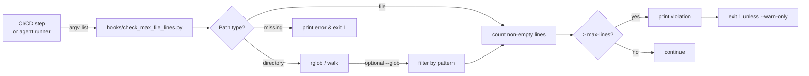

# PRD: 让 `check_max_file_lines` 命令可被 keda agent runner 安全复跑

本 PRD 分两层：Part A 供人审快速判断问题与验收标准；Part B 供执行器按图施工。

# Part A · 人审层 (Review Layer)

## 1. Introduction & Goals

### Problem Statement

keda 仓库的 CI/CD 工作流使用了一条依赖 shell 命令替换的 `check_max_file_lines` 调用：

```text
uv run python hooks/check_max_file_lines.py --max-lines 1000 $(find src/backend -name "*.py")
```

在真正的 GitHub Actions bash 环境中，shell 会展开 `$(find ...)`，命令可以正常执行。但当 keda agent runner 在本地 worktree 中复跑或验证这条命令时，命令字符串可能被 `shlex.split` 或直接按参数列表传递，导致 `$(find` 被当成字面量文件路径传给脚本。结果是 agent runner 反复失败，错误信息为：

```text
check_max_file_lines.py: error: unrecognized arguments: -name *.py)
```

这阻塞了依赖该验证步骤的 issue 执行（例如 #115），也让任何需要复跑仓库自身 CI 检查的工作流都变得不可靠。

### Interpretation (解读回显)

我读这个请求为：

- **目标**：消除 keda 自身 CI 检查命令在 agent runner 复跑场景下的脆弱性，不是改变 1000 行非空行的限制，也不是改变 pre-commit hook 的行为。
- **范围**：改动 `hooks/check_max_file_lines.py` 使其支持接收目录参数并按可选 glob 递归查找文件；同步改动 `.github/workflows/ci.yml` 和 `.github/workflows/cd.yml`，用目录形式替换 `$(find ...)` 命令替换。
- **不变**：pre-commit hook 的入口和 `--warn-only` 行为保持原样；对单个文件路径的调用保持原样；1000 行的阈值不变。

### What The User Gets

- keda agent runner 在本地复跑仓库质量门禁时，`check_max_file_lines` 这一步不再因为 shell 命令替换被错误拆分而失败。
- 维护者可以直接用 `uv run python hooks/check_max_file_lines.py --max-lines 1000 --glob "*.py" src/backend` 这类可参数化、可 tokenize 的命令检查目录，而不必依赖 shell 展开。
- CI 工作流本身的行为和判定结果与改动前保持一致：仍检查 `src/backend` 下所有 `.py` 文件的非空行数是否超过 1000。

### Measurable Objectives

1. `.github/workflows/ci.yml` 与 `.github/workflows/cd.yml` 中不再出现 `$(find ...)` 命令替换。
2. `hooks/check_max_file_lines.py` 支持接收目录参数，并可通过 `--glob` 限制匹配模式。
3. 以下命令在 shell 和按参数列表执行时结果一致：
   `uv run python hooks/check_max_file_lines.py --max-lines 1000 --glob "*.py" src/backend`
4. 现有 pre-commit hook 调用方式继续通过，不引入回归。
5. 新增针对目录扩展与 glob 过滤的单元测试，补充到 `tests/`。

## 2. Human Review Map (介入与风险地图)

**固定人审区**：
① core 业务逻辑/编排 `core/`；② 数据库结构/ schema / 迁移；③ 安全/认证/信任边界；④ 外部 API 契约/破坏性变更。

**跨层触发器**：
⑤ 资金/计费/配额；⑥ 不可逆或破坏性数据操作；⑦ 并发/事务/幂等性。

**命中的人审项**：本次无人工确认项。改动仅涉及本地 hook 脚本和 GitHub Actions 工作流，不触碰 core 业务逻辑、数据库、安全边界或外部 API 契约。

**未命中**：①②③④⑤⑥⑦ 均不涉及，交由执行器 + 自动化门禁兜底。

**分类表**：

| 改动点 | 架构层 | 风险 | 介入方式 | 证据 / Oracle |
|---|---|---|---|---|
| `hooks/check_max_file_lines.py` 增加目录递归与 `--glob` | infrastructure（本地 hook） | 低：仅扩展输入解析，不改变判定逻辑 | 执行器 + 自动化门禁 | rv-1, rv-2, rv-3 |
| `.github/workflows/ci.yml` 替换 `$(find ...)` 为目录参数 | infrastructure（CI 配置） | 低：等价命令改写 | 执行器 + 自动化门禁 | rv-4 |
| `.github/workflows/cd.yml` 替换 `$(find ...)` 为目录参数 | infrastructure（CI 配置） | 低：等价命令改写 | 执行器 + 自动化门禁 | rv-4 |
| 新增单元测试 | tests | 低 | 执行器 + 自动化门禁 | rv-1, rv-2, rv-3 |

**未命中项 worst-case-if-wrong**：
- ① core 逻辑：无 core 改动；若脚本误判行数，最坏是 CI 误报/漏报文件超长，可在 pre-commit 与 CI 双门禁下快速发现。
- ④ 外部 API 契约：无 API 改动。
- ⑥ 不可逆/破坏性操作：hook 只读文件，不写任何状态。

**如何证明它生效（真实入口，白话）**：
在真实 worktree 中，先运行新的目录形式命令，确认它能正确列出超过 1000 行的 Python 文件；再模拟 agent runner 把命令按参数列表传入，确认不再出现 `unrecognized arguments: -name *.py)`；最后在临时目录构造一个超过阈值的 `.py` 文件，验证命令返回非零退出码。

**数据库结构评审**：本次无数据库结构变化。

## 3. Usage And Impact After Implementation

### 开发者 / 维护者

改动后，开发者可以运行以下命令检查整个目录：

```bash
uv run python hooks/check_max_file_lines.py --max-lines 1000 --glob "*.py" src/backend
```

该命令不依赖 shell 命令替换，可以直接交给 keda agent runner 复跑，也可以在 `subprocess.run([...])` 这类参数列表执行方式下工作。

### CI / CD

GitHub Actions 的 `Check max file lines (hard limit)` 步骤改为：

```yaml
run: uv run python hooks/check_max_file_lines.py --max-lines 1000 --glob "*.py" src/backend
```

判定结果与改动前一致：任何非空行超过 1000 的 `.py` 文件都会让步骤失败。

### 对现有行为的影响

- **pre-commit hook**：入口仍是 `uv run python hooks/check_max_file_lines.py --max-lines 1000 --warn-only`，pre-commit 会自动传入文件路径，行为不变。
- **单个文件调用**：如 `uv run python hooks/check_max_file_lines.py --max-lines 1000 src/backend/api/cli.py` 继续工作。
- **返回值**：无变化，发现超限文件时退出码仍为 1（`--warn-only` 时为 0）。

## 4. Requirement Shape

- **actor**：keda agent runner、GitHub Actions CI/CD、本地开发者。
- **trigger**：需要运行 `check_max_file_lines` 检查目录下多个文件时。
- **expected behavior**：
  1. 脚本接收目录参数时，递归遍历目录内文件。
  2. 若提供 `--glob`，只检查匹配 glob 模式的文件；否则检查目录内所有常规文件。
  3. CI/CD 工作流使用目录参数形式，不再使用 `$(find ...)` 命令替换。
  4. 脚本对不存在或不可读路径给出清晰错误而非 traceback。
- **explicit scope boundary**：
  - 只改 `hooks/check_max_file_lines.py` 和两个 workflow 文件。
  - 不改行数阈值、不改 pre-commit 配置、不改 `just lint --reuse` 的 hook 调用方式、不改其他 hook。

# Part B · 执行器层 (Build Layer)

## 5. Repository Context And Architecture Fit

### 当前相关文件

- `hooks/check_max_file_lines.py`：只接受文件路径列表的本地 hook，pre-commit 与 CI 都使用它。
- `.github/workflows/ci.yml`：CI 工作流，第 69 行使用 `$(find src/backend -name "*.py")`。
- `.github/workflows/cd.yml`：CD 工作流，第 42 行使用同样的 `$(find ...)`。
- `.pre-commit-config.yaml`：pre-commit hook 配置，使用 `--warn-only` 且由 pre-commit 自动传文件路径。
- `tests/`：当前没有针对 `hooks/check_max_file_lines.py` 的测试。

### 现有架构模式

本项目 hook 脚本放在 `hooks/` 目录，使用标准库 + 无第三方依赖，便于被 `uv run python` 直接调用。hook 脚本只读本地文件，不写持久化状态，符合 infrastructure 层只依赖外部包/标准库的约束。

### 依赖边界

- 改动不涉及 `src/backend/api/`、`core/`、`engines/` 之间的依赖方向。
- 新增测试位于 `tests/`，可自由导入 `hooks/check_max_file_lines.py`。

### Frontend Impact

No frontend impact. 本改动是本地 hook 与 CI 配置，不涉及任何前端应用、路由、组件或 API 调用。

### 约束

- 脚本需要兼容 Python 3.11+（由 `.python-version` 和 `pyproject.toml` 推断）。
- 单文件非空行不超过 1000 行：改动后的 `hooks/check_max_file_lines.py` 自身仍需满足此约束。
- 保持 pre-commit hook 的 `--warn-only` 行为不变。

### Existing PRD Relationship

- `tasks/pending/P1-FEAT-20260623-232747-iar-cli-logs-view-and-daemon-status-log-path.md`：#115 的 PRD，它因本 bug 在执行 `check_max_file_lines` 时被阻塞。本 PRD 修复的是阻塞原因，可独立交付，#115 依赖它软相关。
- 其他 pending PRD 无直接关联。
- 无重复 PRD。

## 6. Recommendation

### Recommended Approach

**最小改动**：扩展 `hooks/check_max_file_lines.py` 使其支持目录参数与可选 `--glob` 过滤；同步把 CI/CD workflow 中的 `$(find ...)` 替换为目录参数形式。

这是最佳适配，因为：

1. 它直接消除命令被 tokenize 后失效的根因，不需要修改 keda agent runner 的命令执行逻辑。
2. 它复用现有的 `check_max_file_lines.py`，只增加输入解析能力，不引入新的 hook 或抽象。
3. 对 pre-commit 和已有调用方式保持 100% 向后兼容。

### Proposed Solution Summary (实现机制)

- **核心机制**：在 `hooks/check_max_file_lines.py` 中，把每个位置参数先解析为 `Path`；若是文件则直接使用；若是目录则递归遍历（`os.walk` 或 `Path.rglob`），按 `--glob` 过滤后收集文件。
- **输入来源**：用户/CI 显式传入目录路径和 `--glob` 模式；pre-commit 继续传入文件路径。
- **入口边界**：本地 hook 脚本与 GitHub Actions 工作流。
- **系统状态/输出变化**：无持久化状态变化；输出仍是 `[ERROR]/[WARNING] <path>: <count> 非空行，超过上限 <max> 行。`
- **刻意规避的复杂度**：不改阈值、不改 pre-commit 配置、不新增 hook、不在 core/engines/api 层加代码。

### Alternatives Considered

1. **只改 workflow，不改脚本**：把 workflow 改成 `find src/backend -name "*.py" -exec uv run python hooks/check_max_file_lines.py --max-lines 1000 {} +`。这个方案也能消除 `$(...)`，但 `find -exec` 会多次调用 Python 进程，且 keda agent runner 若把整条命令 tokenize，行为虽正确但命令结构仍复杂。推荐方案一次进程调用更简洁，也更容易被 agent 直接复用。
2. **在 keda agent runner 中检测 shell 命令替换并自动用 `bash -lc` 执行**：这需要在 `core/use_cases/agent_runner_validation.py` 或 `infrastructure/process_runner.py` 增加 shell 元字符检测，改动面大、风险高，且无法解决仓库自身 CI 命令设计不良的问题。不推荐。

## 7. Implementation Guide

> This section is a living implementation guide based on current repository analysis. If implementation discovers additional affected files, hidden dependencies, edge cases, or a better path, update this PRD before proceeding.

### Core Logic

当前 `hooks/check_max_file_lines.py` 的入口 `main(argv)` 直接解析 `files` 位置参数，对每个 `Path(file_str)` 调用 `count_non_empty_lines`。改动后：

1. 新增 `--glob` 可选参数（默认 `None`，表示不过滤）。
2. 遍历 `args.files` 时，对每个路径：
   - `is_file()` → 直接加入待检查列表。
   - `is_dir()` → 使用 `Path.rglob('*')` 或 `os.walk` 递归，若 `--glob` 存在则再用 `fnmatch`/`path.match` 过滤；跳过目录本身和非常规文件（如 symlink、socket、device）。
   - 既非文件也非目录 → 打印清晰错误并退出码 1（或继续处理其他路径）。
3. 收集到的文件列表去重后按原逻辑检查。

### Change Impact Tree

```text
.
├── hooks/
│   └── check_max_file_lines.py
│       [修改]
│       【总结】增加目录递归遍历与 --glob 模式过滤，同时保持文件路径和 pre-commit 调用兼容。
│
│       ├── 新增 --glob 命令行参数
│       ├── 将位置参数扩展为文件列表（文件直接保留，目录递归展开）
│       ├── 对不存在路径给出清晰错误
│       └── 保持 count_non_empty_lines 判定逻辑不变
│
├── .github/workflows/
│   ├── ci.yml
│   │   [修改]
│   │   【总结】将 Check max file lines 步骤从 $(find ...) 命令替换改为目录参数形式。
│   │
│   │   └── run: uv run python hooks/check_max_file_lines.py --max-lines 1000 --glob "*.py" src/backend
│   │
│   └── cd.yml
│       [修改]
│       【总结】与 ci.yml 保持一致，消除同样脆弱的 shell 命令替换。
│       │
│       └── run: uv run python hooks/check_max_file_lines.py --max-lines 1000 --glob "*.py" src/backend
│
└── tests/
    └── test_check_max_file_lines.py
        [新增]
        【总结】覆盖文件检查、目录递归、glob 过滤、不存在路径、去重等行为的单元测试。
        │
        ├── 测试单个文件超限与未超限
        ├── 测试目录递归展开
        ├── 测试 --glob 过滤
        ├── 测试目录与文件混合输入
        └── 测试不存在路径的错误处理
```

### Executor Drift Guard

- 搜索 `$(find.*check_max_file_lines` 确认两个 workflow 文件已同步修改。
- 搜索 `hooks/check_max_file_lines.py` 在 `docs/` 和 `tasks/archive/` 中的引用，确认文档示例是否需要同步更新（如 `tasks/archive/P1-FEAT-20260614-224914-pr-preview-deployment.md` 中的示例使用 `$(rg -l ...)`，属于历史 PRD，可不改）。
- 若未来 workflow 文件名或路径变化，使用 `rg "check_max_file_lines" .github/workflows/` 定位。

### Flow or Architecture Diagram



### ER Diagram

No data model changes in this PRD.

### Realistic Validation Plan

```yaml
- id: rv-1
  behavior: 脚本对单个文件仍按原有方式检查并返回正确退出码
  real_entry: "uv run python hooks/check_max_file_lines.py --max-lines 1000 tests/fixtures/under_limit.py"
  expected: 退出码 0，无 ERROR/WARNING 输出
  mock_boundary: 在 tests/fixtures/ 下创建临时 <1000 行文件；不依赖外部服务
  negative_control: "uv run python hooks/check_max_file_lines.py --max-lines 1 tests/fixtures/under_limit.py"
  expected_fail: 退出码 1，输出包含文件路径和行数
  test_layer: unit
  required_for_acceptance: true

- id: rv-2
  behavior: 脚本接收目录参数并按 --glob 递归查找匹配文件
  real_entry: "uv run python hooks/check_max_file_lines.py --max-lines 1000 --glob '*.py' /tmp/keda-cml-test-dir"
  expected: 退出码 0（目录下无超限 .py 文件）或 1（目录下存在超限 .py 文件），输出仅涉及 .py 文件
  mock_boundary: 在 /tmp/keda-cml-test-dir 下创建嵌套临时目录和 .py / .txt 文件；不依赖外部服务
  negative_control: "uv run python hooks/check_max_file_lines.py --max-lines 1000 --glob '*.py' /tmp/keda-cml-test-dir-with-overlimit"
  expected_fail: 退出码 1，仅命中 .py 超限文件，不命中同目录 .txt 文件
  test_layer: unit
  required_for_acceptance: true

- id: rv-3
  behavior: 命令作为参数列表执行时不因 shell 命令替换而失败
  real_entry: "python -c 'import subprocess, sys; subprocess.run([\"uv\", \"run\", \"python\", \"hooks/check_max_file_lines.py\", \"--max-lines\", \"1000\", \"--glob\", \"*.py\", \"src/backend\"])'"
  expected: 退出码与直接在 shell 中运行一致，且不出现 unrecognized arguments 错误
  mock_boundary: 使用 subprocess 参数列表执行，不经过 shell
  negative_control: 旧命令字符串经 shlex.split 后执行："python -c 'import subprocess, shlex, sys; subprocess.run(shlex.split(\"uv run python hooks/check_max_file_lines.py --max-lines 1000 $(find src/backend -name '*.py')\"))'"
  expected_fail: 旧命令返回非零并出现 unrecognized arguments: -name *.py
  test_layer: integration
  required_for_acceptance: true

- id: rv-4
  behavior: GitHub Actions workflow 中不再使用 $(find ...) 命令替换
  real_entry: "rg -n 'check_max_file_lines' .github/workflows/ci.yml .github/workflows/cd.yml"
  expected: 输出中包含 --glob \"*.py\" src/backend，且不包含 $(find
  mock_boundary: 仅检查仓库文件内容
  negative_control: 恢复旧 workflow 行并运行 rg
  expected_fail: rg 命中 $(find 字符串
  test_layer: smoke
  required_for_acceptance: true
```

**Failure triage note**：
- 若 rv-1/rv-2 失败，先检查 `hooks/check_max_file_lines.py` 的参数解析与路径展开逻辑。
- 若 rv-3 失败，检查是否仍残留 shell 元字符或 `--glob` 值未正确传递。
- 若 rv-4 失败，检查两个 workflow 文件是否都已修改并提交。

### Low-Fidelity Prototype

Not required. This change has no UI surface.

### Interactive Prototype Change Log

No interactive prototype file changes in this PRD.

### External Validation

No external validation required; repository evidence was sufficient.

## 8. Delivery Dependencies

```markdown
### Delivery Dependencies

- Group: keda-ci-robustness
- Depends on groups:
  - none
- Depends on tasks/issues:
  - none
- Gate type: soft
- Notes: 本修复软相关于 #115（iar-cli-logs-view-and-daemon-status-log-path），因为它解除了 #115 执行过程中被 `check_max_file_lines` 调用阻塞的问题，但本身可独立交付。
```

## 9. Acceptance Checklist

### Human-Confirmed

本次无人工确认项。

### Architecture Acceptance

- [x] `hooks/check_max_file_lines.py` 的改动仅扩展输入解析，未改变行数判定逻辑。
- [x] 未新增 core/engines/api 层代码，保持四层依赖方向不变。

### Behavior Acceptance

- [x] `uv run python hooks/check_max_file_lines.py --max-lines 1000 --warn-only <file>` 与改动前行为一致（rv-1）。
- [x] `uv run python hooks/check_max_file_lines.py --max-lines 1000 --glob "*.py" <dir>` 能递归检查目录并正确过滤（rv-2）。
- [x] 对不存在路径打印清晰错误并返回非零退出码（rv-2 负面控制可覆盖）。

### Documentation Acceptance

- [x] 无需更新 `docs/ai-standards/` 中的规范；本改动是工具调用方式优化，不改变规范。

### Validation Acceptance

- [x] 新增 `tests/test_check_max_file_lines.py` 通过 `just test`（rv-1, rv-2）。
- [x] 通过 subprocess 参数列表执行新命令，结果与 shell 执行一致（rv-3）。
- [x] `.github/workflows/ci.yml` 与 `.github/workflows/cd.yml` 中 `check_max_file_lines` 步骤不再包含 `$(find`（rv-4）。

### Delivery Readiness

- [x] `just lint --full` 通过。
- [x] `just test` 通过。
- [x] 新增代码自身不超过 1000 非空行。

## 10. Functional Requirements

- **FR-1**: `hooks/check_max_file_lines.py` 应接受文件路径作为位置参数，行为与改动前一致。
- **FR-2**: `hooks/check_max_file_lines.py` 应接受目录路径作为位置参数，并递归遍历其下所有常规文件。
- **FR-3**: 当提供 `--glob` 参数时，脚本仅检查匹配该 glob 模式的文件；未提供时检查目录下所有常规文件。
- **FR-4**: 对不存在或非常规路径（如 broken symlink、socket），脚本应打印清晰错误并返回非零退出码。
- **FR-5**: `.github/workflows/ci.yml` 与 `.github/workflows/cd.yml` 的 `Check max file lines (hard limit)` 步骤应使用 `--glob "*.py" src/backend` 形式，不再使用 `$(find ...)`。
- **FR-6**: pre-commit hook 的现有调用方式（`--warn-only` 由 pre-commit 传文件路径）必须继续工作。

## 11. Non-Goals

- 不改 1000 行非空行的阈值。
- 不改 `.pre-commit-config.yaml` 中的 hook 入口或 `--warn-only` 行为。
- 不修改 keda agent runner 的命令执行/验证逻辑。
- 不改动其他 hook 或 workflow 步骤。
- 不处理 `.gitignore` 或文件排除逻辑（glob 过滤已足够覆盖 CI 需求）。

## 12. Risks And Follow-Ups

- **风险**：若 `--glob` 实现使用了不兼容旧 Python 版本的语法（如 3.12+ only），可能在 CI 环境失败。缓解：使用 `pathlib.Path.match` 或 `fnmatch.fnmatch`，两者均为标准库且兼容 Python 3.11+。
- **风险**：目录递归时若意外跟随 symlink 可能导致循环或检查到预期外文件。缓解：使用 `Path.rglob('*')` 并过滤 `is_file()`，rglob 默认不递归进入 symlink 目录；如需更严格可显式跳过 `is_symlink()`。
- **跟进**：考虑在 `docs/ai-standards/code-reuse.md` 的示例中统一使用新的目录形式命令，减少未来 copy-paste 出错的概率（可选，非阻塞）。

## 13. Decision Log

| ID | Decision Question | Chosen | Rejected | Rationale |
|---|---|---|---|---|
| D-01 | 是否修改脚本以支持目录，还是只改 workflow 避开 `$(...)` | 修改脚本并支持 `--glob`，同时改 workflow | 只改 workflow 为 `find -exec` | 让命令可被 agent runner 直接作为参数列表复用，避免每次调用都依赖 shell 或 find 语法，且保持单进程调用更简洁。 |
| D-02 | glob 过滤使用哪个标准库 | `pathlib.Path.match`（或 `fnmatch.fnmatch`） | 无 / 引入第三方 glob 库 | 标准库已满足需求，避免新增依赖；`Path.match` 语义与常见 glob 一致。 |
| D-03 | 是否处理 symlink | 默认不跟随 symlink 目录（依赖 `rglob` 默认行为），文件 symlink 通过 `is_file()` 判断 | 显式递归解析 symlink | 检查脚本只读文件，跟随 symlink 带来的收益有限，反而可能引入意外路径；保持默认行为最保守。 |
