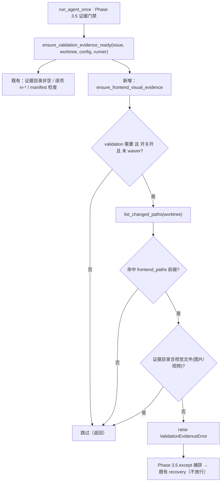

# PRD: iar runner 前端改动强制真实视觉证据的 fail-closed 门禁

> 本 PRD 分两个 altitude，自上而下阅读：
>
> - **Part A · 人审层 (Review Layer)** — 需求方 / 验收人读这部分，决定"该不该做、做得对不对"，并通过风险地图知道哪些地方必须亲自确认。Part A 不出现实现机制、文件路径、命令。
> - **Part B · 执行器层 (Build Layer)** — 实现者（人或 Agent）读这部分动手。人只在 Part A 风险地图点名处下钻审查。

---

# Part A · 人审层 (Review Layer)

## 1. Introduction & Goals

### Problem Statement

iar（issue-agent-runner，本仓 keda）在目标仓库上自动跑 issue 时，对"影响用户可见界面的前端改动"缺少**能真正兜底的视觉证据门禁**，导致一个前端功能可以在**完全没有任何截图/录屏**的情况下，以"本地门禁全绿"的姿态被交付。

实测逃逸（freshai issue-49 中英双语 i18n，runner 全自动跑完 executor + pre-PR review + post-PR supervisor + draft PR）：

1. runner 的 worktree 里没有目标仓库前端的 `node_modules`，Playwright / 真实视觉证据在结构上根本产不出来；
2. 逐项证据格式检查把"要不要图片"从 **RV item 的行为描述文本**里用关键字猜——而前端 RV item 的文本是"前台官网默认英文、可切中文…"，**不含"截图/png"**（"截图/录屏"写在另一段验收清单里），于是没有触发图片要求，一个 `.txt` 文本桩就满足了本应要视觉证据的 rv-1；
3. pre-PR 评审员**精确报出了**"no real visual evidence captured""frontend 还有约 51+46 个文件仍是硬编码中文"，却把这些降级为 non-blocking 的 "scope observation" 放行；
4. 目标仓库 `.iar.toml` 里 `verifier_enabled = false`（对抗复验这层被关），机械视觉门禁 `check_prd_evidence.sh` 又只挂在手动 `just ai implement` recipe 上、不在 runner 的执行路径里。

净结果：一个**从未被挂载（mount）到任何页面**的孤儿语言切换组件 + 完成度约 10% 的功能，被当作已交付合入。

这条链的共性是 **fail-open**：每一层要么看错了对象（按文本关键字而非按 diff 判定）、要么把该阻断的发现降级放行、要么根本不在 runner 路径上。更深一层的认知盲区是：keda 的验证设计长期在想"怎么验证**它自己**（一个没有前端的 CLI 工具）"，**忘了它是通用 runner，会去操作 freshai 这类带前端的目标仓库**——所以"目标仓库前端改动必须有视觉证据"这件事，没有任何一层结构性地负责。

### Interpretation (解读回显)

我把需求读成：**在 runner 的证据门禁里补一条 fail-closed 的结构性规则——只要本次 worktree 的 git 变更命中目标仓库的前端应用目录，证据目录就必须至少有一个真实的视觉证据文件（图片/视频），否则门禁失败、进入既有 recovery，绝不放行。判定依据是"改了什么（git diff）"，不是"RV 文本里有没有写截图"。**

我**明确不**把它读作：
- ❌ 让 runner 自己去装前端依赖 + 跑 e2e 把证据"生产"出来（那是"能否产出证据"的能力，属于 docker 容器化 PRD 与执行器职责，本 PRD 只负责"没有就拦下"）；
- ❌ 重写逐项证据格式匹配 `collect_evidence_coverage_problems` 的关键字推断逻辑（本 PRD 用一条独立的全局 diff 驱动门禁盖过它的前端盲区，不动它的既有行为）；
- ❌ 改动 verifier / supervisor（verifier 默认值与 supervisor 跨轮累积由 pending 的 completeness-judgment PRD 负责，本门禁**独立于 verifier**，即使某目标仓库 verifier 仍为 false 也照样生效）；
- ❌ 语义级判断"这张截图是否真的证明了功能"（机械门禁只保证"至少有真实视觉产物存在"，语义有效性交给 verifier 与终点人审）。

如果这个解读偏了——尤其"只拦不产"这条边界——请在动工前指出（第一次人类触点）。

### What The User Gets

- **iar 运营者**：runner 处理任何"改了前端、却没有任何截图/录屏"的 issue 时，会在开 PR 前**直接判失败并进入 recovery**，而不是开出一个"本地全绿"的 draft PR。issue-49 那类"半成品全绿合入"在 runner 路径上被结构性堵死。
- **下游使用 iar 的项目**：这条门禁通过一个**新配置键默认开启**——既有 `.iar.toml`（如 freshai，没有这个键）升级后**自动获得**该门禁，无需改配置；确有需要的仓库可显式关掉。
- **终点人审者**：前端交付的证据包里"要么有真实视觉证据、要么这条 issue 根本没被放行"成为不变量；不再出现"证据是文本桩、界面其实没接上"的静默放行。

### Measurable Objectives

- **可证伪**：构造一个"前端目录有改动、但证据目录只有 `.txt`"的 worktree，跑真实门禁必须**判失败（raise `ValidationEvidenceError`）**；补入一个 `.png` 后同一入口必须**通过**——以此量化"绿=至少有视觉产物"。
- **判定按 diff 不按文本**：RV item 文本不含"截图/png"关键字时，门禁仍能因 git diff 命中前端目录而要求视觉证据（覆盖 issue-49 的确切盲区）。
- **默认生效于既有仓**：不含新键的 `.iar.toml` 加载后，门禁值为"开"；显式设为关时门禁跳过。
- **零回归**：非前端改动、或带 Evidence Format Waiver / 关闭开关的 issue，行为与改造前一致；keda 现有测试全绿。

## 2. Human Review Map (介入与风险地图)

判定菜单——固定区域：① Core 业务逻辑/编排（`core/`）；② DB 结构/schema/迁移；③ 安全/信任边界；④ 对外契约/breaking。横切触发器：⑤ 资金/计费/配额；⑥ 不可逆/破坏性数据操作；⑦ 并发/幂等。

**命中的人审项（逐条进下表，需人工确认，高证据负担）**：① —— 本改动直接决定"目标仓库前端交付能否发布"，是发布门禁的核心逻辑，正确性关键度高，且默认开启影响所有下游派生仓（影响面）。

**未命中（默认执行器 + 自动门禁）**：②（无 schema，仅新增两个配置字段）、③（不触碰认证/信任边界，复用既有 worktree 隔离）、④（不新增对外 API / GitHub label / marker 契约，复用既有 `ValidationEvidenceError` 与 recovery）、⑤（无计费）、⑥（无破坏性数据操作，只读 git status + 只读证据目录）、⑦（门禁为同步只读判断，不引入并发/幂等语义）。

- 各未命中最坏情况：② 新字段与旧证据不兼容 → 新键为纯增量、旧配置走默认值，最坏=多一次可预期的 fail-closed，不会破坏历史数据；④ 无契约变更，最坏=复用错误类型的错误详情文案不清晰（rv-1 覆盖）。均非严重/不可逆，可留作 miss。

| 改动点 | 架构层 | 风险 | 介入方式 | 证据 / Oracle |
|---|---|---|---|---|
| ① 前端视觉证据门禁逻辑：git diff 命中前端目录 ⟹ 证据目录须含视觉文件，否则 `ValidationEvidenceError`（新增 `ensure_frontend_visual_evidence`，接入 `ensure_validation_evidence_ready`） | core | 高 | 人工确认 | rv-1 |
| ① 默认开启的影响面：新配置键默认 True，使既有无此键的 `.iar.toml`（如 freshai）自动获得门禁 | core/infra | 中 | 人工确认 | rv-2 |
| 全链路真实入口：runner 真跑一个"改前端无视觉证据"的 issue 被拦下 | core | 中 | 执行器+门禁（rv-1 为无凭据 fallback） | rv-3 |
| 两个配置字段的三处同步（dataclass / pydantic settings / factory 映射） | infra | 低 | 执行器+门禁：`rg -n "frontend_visual_evidence_required" src/backend`（三处均命中且默认一致，见 §7 Drift Guard） | rv-2 |
| `.iar.toml` / `config.toml` / `docs/guides/agent-runner.md` 文档与默认注释 | infra/docs | 低 | 执行器+门禁：`uv run mkdocs build --strict` + 文档 grep | rv-2 |

**如何证明它生效（真实入口，白话）**：造一个"改了前端、证据目录只有文本"的临时仓库跑门禁——它必须拦下；放进一张截图再跑——必须放行（rv-1）。再用真实 `iar run` 在一个前端改动 issue 上跑一遍，确认它不再开出 PR（rv-3）。默认开启用配置加载测试证明：不写这个键也是"开"，显式写 false 才关（rv-2）。

**数据库结构评审**：本次无数据库结构变化。

## 3. Usage And Impact After Implementation

- **iar 运营者（跑 daemon / `iar run`）**：无需改任何配置。当 runner 处理的 issue 改动命中前端目录、但 `.iar/evidence/` 里没有任何 `.png/.jpg/.jpeg/.webp/.gif/.webm/.mp4/.mov` 时，本轮 attempt 判 validation evidence 失败并进入既有 recovery 循环；重试仍无视觉证据则最终 blocked/escalate，而不是开出 draft PR。日志/失败详情会指明"前端改动缺少视觉证据"。
- **下游派生仓维护者**：升级 iar 后，`.iar.toml` 即便没有新键也自动启用该门禁（新键默认 True）。若某仓确需临时关闭，在 `[agent_runner.validation]` 显式写 `frontend_visual_evidence_required = false`；若某仓前端目录命名与默认不同，写 `frontend_paths = ["<你的前端目录>"]` 覆盖。
- **对既有行为的影响（向后兼容）**：非前端改动的 issue、带 `Evidence Format Waiver` 的 issue、或显式关闭本门禁的仓库，行为与改造前完全一致；本门禁与逐项格式检查 `evidence_format_check`、`verifier_enabled`、`reexecute_commands` 相互独立叠加，不改动它们任何一个的既有语义。

配置示例（目标仓库 `.iar.toml`）：

```toml
[agent_runner.validation]
# 前端改动强制真实视觉证据（默认开；关掉则回退旧行为）
frontend_visual_evidence_required = true
# 判定为"前端"的目录前缀（默认模板约定的两个前端 app）
frontend_paths = ["frontend-admin", "frontend-public"]
```

## 4. Requirement Shape

- **actor**：iar runner（`run_agent_once` 的 Realistic Validation 证据门禁阶段）。
- **trigger**：一个 `validation_required` 为真、未被 waiver 豁免的 issue，其 worktree 的 git 变更命中任一 `frontend_paths` 前缀。
- **expected behavior**：证据目录（第一层）必须至少存在一个视觉证据文件（图片或视频后缀）；否则抛 `ValidationEvidenceError`，由既有 Phase 3.5 捕获进入 recovery，不放行发布。
- **scope boundary**：只做"缺失即拦下"的存在性判定；不生产证据、不做语义有效性判断、不改逐项关键字匹配、不改 verifier/supervisor。仅治理**目标仓库**的前端改动；keda 自身无前端 app。

---

# Part B · 执行器层 (Build Layer)

## 5. Repository Context And Architecture Fit

- **相关模块（现状）**：
  - `src/backend/core/use_cases/run_agent_once.py`：Realistic Validation 门禁在 Phase 3.5 调 `ensure_validation_evidence_ready(...)` 和 `ensure_validation_commands_pass(...)`，随后 Phase 3.6 调 `run_verifier_gate(...)`；三者抛出的 `ValidationEvidenceError` 已被同段 `except` 捕获并转入 recovery。
  - `src/backend/core/use_cases/agent_runner_validation.py`：门禁本体所在模块（`ensure_validation_evidence_ready` 为接入点；已有 `validation_required` / `has_validation_waiver_marker` / `evidence_dir_path` / `list_evidence_files` / `ValidationEvidenceError` 可复用）。
  - `src/backend/core/use_cases/agent_runner_git.py`：已有 `list_changed_paths(worktree_path, process_runner) -> list[str]`（`git status --porcelain -z`，NUL 分隔、含 rename 源路径）——**门禁检测前端改动直接复用它，不新写 diff 逻辑**。
  - `src/backend/core/use_cases/agent_runner_evidence_format.py`：已有 `IMAGE_EVIDENCE_SUFFIXES = {.png,.jpg,.jpeg,.gif,.webp}`；视频后缀 `{.mp4,.mov,.webm,.gif}` 目前散在 `_EVIDENCE_KIND_RULES` 里。
  - 配置三处同步链：`src/backend/core/shared/models/agent_runner.py` 的 `ValidationConfig`(frozen dataclass) ↔ `src/backend/infrastructure/config/settings.py` 的 validation settings ↔ `src/backend/engines/agent_runner/factory_config_builder.py` 的映射；键的中文描述在 `src/backend/engines/agent_runner/repository_local.py`。
- **要遵循的架构模式**：四层 `api → core → engines → infrastructure`（`hooks/shared/check_architecture.py` 强制）。门禁逻辑属 `core/use_cases`，只依赖已有 `IProcessRunner` 抽象与 `core` 内工具函数，不反向依赖。
- **Frontend impact**：**No frontend impact** —— keda 自身是 CLI 后端产品，本改动全部落在后端 runner 逻辑；它治理的是 runner 对**目标仓库**前端改动的证据要求，keda 自己的 `frontend-admin/` / `frontend-public/`（若有）不变。
- **既有 PRD 关系**：
  - `tasks/archive/P1-FEAT-20260628-041733-realistic-validation-independent-verifier-gate.md`（已归档）：建立了 T1 负控 + T2 keda 复跑 + T3 独立 verifier 的机架；verifier 为灰度开关，且**未处理前端视觉证据缺口**。本 PRD 是其未覆盖面的补充。
  - `tasks/pending/P1-FEAT-20260705-161739-completeness-judgment-hardening.md`：翻转 `verifier_enabled` 默认值、加 `stdout_assertions`、supervisor 跨轮累积。它明确声明 `No frontend impact（iur 是 CLI 后端工具,仓库无 frontend app）`——**正是本 PRD 指出的认知盲区**。本 PRD 与其**独立但互补**：本门禁不依赖 verifier 开关即可生效（soft 依赖）。
  - `tasks/pending/P2-FEAT-20260707-141659-iar-runner-docker-containerization.md`：容器化 runner 环境并预装 Node 工具链——是"让 runner 能**产出**前端视觉证据"的前置能力；本 PRD 只负责"没有就拦下"，两者互补不重叠（soft 依赖）。
  - 未发现与本"前端视觉证据门禁"直接重复的 pending PRD。

## 6. Recommendation

### Recommended Approach

在 `agent_runner_validation.py` 新增一个**全局、diff 驱动、fail-closed** 的前端视觉证据检查 `ensure_frontend_visual_evidence(issue, worktree_path, config, process_runner)`，并在既有 `ensure_validation_evidence_ready` 内部调用（作为其证据卫生检查的一部分），逻辑对齐 `scripts/shared/just/check_prd_evidence.sh` 但用 Python 在 runner 路径上执行：

1. 前置门：`config.validation.enabled` 且 `config.validation.frontend_visual_evidence_required` 且 `validation_required(issue.body, config)` 且未命中 waiver，否则直接返回（跳过）。
2. 检测前端改动：`list_changed_paths(worktree_path, process_runner)`，任一路径以 `config.validation.frontend_paths` 中某前缀开头即判"命中前端"。未命中 → 返回。
3. 存在性判定：`list_evidence_files(worktree_path, config)` 中是否有后缀 ∈ 视觉集合（图片 ∪ 视频）。无 → `raise ValidationEvidenceError(...)`，详情说明"前端改动缺少视觉证据 + 命中的前端路径 + 期望后缀"。

配置侧新增两个字段（走既有三处同步链，默认值让既有仓自动生效）：
- `frontend_visual_evidence_required: bool = True`
- `frontend_paths: tuple[str, ...] = ("frontend-admin", "frontend-public")`

视觉后缀集合以单一真相提供：在 `agent_runner_evidence_format.py` 增 `VISUAL_EVIDENCE_SUFFIXES = IMAGE_EVIDENCE_SUFFIXES | {".mp4", ".mov", ".webm"}`，由门禁引用（`.gif` 已在 IMAGE 集合内）。

**为什么是这条最小路径而不是更重的方案**：
- 复用 `list_changed_paths` 而非新写 git diff；复用 `ValidationEvidenceError` + 既有 Phase 3.5 recovery，不新增异常类型、状态、label 或 marker 契约；不新增服务/端口。
- 用**全局 diff 驱动门禁**盖过逐项关键字匹配的前端盲区，而不去重写 `collect_evidence_coverage_problems`——后者按 RV 文本猜格式的行为对非前端项仍有价值，改写它会扩大风险面且不解决"文本不含 png"的根因。
- `frontend_paths` 做成可配置（默认模板约定两目录）而非硬编码：runner 面对任意目标仓库，硬编码目录名比 per-repo 配置更脆。

### Proposed Solution Summary (实现机制)

- **核心机制**：runner 证据门禁阶段新增一条"git diff 命中前端目录 ⟹ 证据目录必须有视觉文件"的存在性断言，接入既有 `ensure_validation_evidence_ready`。
- **谁提供输入 / 是否推断**：改动集由 runner 从 worktree 的 `git status` 实时读出（系统推断，不需 agent 声明）；前端目录前缀与开关由仓库 `.iar.toml` 提供，默认值使既有仓无需改配置即生效。
- **接入的既有边界**：`run_agent_once` Phase 3.5 → `ensure_validation_evidence_ready`；异常复用 `ValidationEvidenceError` → 既有 recovery。
- **系统状态/行为变化**：前端改动缺视觉证据的 issue 由"开出全绿 draft PR"变为"门禁失败进 recovery / 最终 blocked"。
- **有意避免的复杂度**：不生产证据、不跑 e2e、不改 verifier/supervisor、不改逐项关键字匹配、无新存储/状态机/契约。

### Alternatives Considered

- **改写逐项关键字匹配让它按 diff 判定**：需改动 `collect_evidence_coverage_problems` 的既有语义、影响所有格式类型，风险面大且仍是"逐项"视角；被全局门禁方案取代。
- **只强化 executor prompt（要求 PNG）**：`build_validation_prompt_line` 已在要求"UI 行为用 PNG 截图"——issue-49 证明"告知≠强制"，纯 prompt 无强制力，否决。

## 7. Implementation Guide

> This section is a living implementation guide based on current repository analysis. If implementation discovers additional affected files, hidden dependencies, edge cases, or a better path, update this PRD before proceeding.

### 7.1 Core Logic

控制流：`run_agent_once`（Phase 3.5）→ `ensure_validation_evidence_ready(issue, worktree_path, config, process_runner)` → 其内部在既有证据卫生检查之外，追加调用新增的 `ensure_frontend_visual_evidence(...)`：读 `list_changed_paths` → 命中 `frontend_paths` 前缀？→ 是则要求 `list_evidence_files` 中存在视觉后缀文件 → 否则 `raise ValidationEvidenceError` → 被 Phase 3.5 既有 `except ValidationEvidenceError` 捕获转 recovery。

### 7.2 Change Impact Tree

```text
.
├── src/backend/core/shared/models/agent_runner.py
│   [修改]
│   【总结】ValidationConfig 增两个字段（开关 + 前端目录前缀），承载三处同步链的源类型
│   ├── 新增 frontend_visual_evidence_required: bool = True
│   ├── 新增 frontend_paths: tuple[str, ...] = ("frontend-admin", "frontend-public")
│   └── 更新类 docstring 说明两字段语义（含"默认开、可 per-repo 关"）
│
├── src/backend/infrastructure/config/settings.py
│   [修改]
│   【总结】pydantic validation settings 同步两字段，保证 .iar.toml/config.toml 可加载覆盖
│   └── 在 validation settings 类中加同名字段与默认值（rg 定位现有 verifier_enabled 字段所在类）
│
├── src/backend/engines/agent_runner/factory_config_builder.py
│   [修改]
│   【总结】把两字段从 settings 映射进 ValidationConfig，防"三处同步"漏映射被同默认值掩盖
│   └── 在构造 ValidationConfig 处补两字段传参（rg 定位现有 verifier_enabled= 映射行）
│
├── src/backend/engines/agent_runner/repository_local.py
│   [修改]
│   【总结】补两键的中文描述，供本地配置视图/文档一致展示
│   └── 在 validation.* 描述表加 frontend_visual_evidence_required / frontend_paths 两条
│
├── src/backend/core/use_cases/agent_runner_evidence_format.py
│   [修改]
│   【总结】以单一真相导出"视觉证据后缀"集合，供门禁复用
│   └── 新增 VISUAL_EVIDENCE_SUFFIXES = IMAGE_EVIDENCE_SUFFIXES | {".mp4", ".mov", ".webm"}
│
├── src/backend/core/use_cases/agent_runner_validation.py
│   [修改]
│   【总结】新增前端视觉证据 fail-closed 门禁并接入既有证据就绪检查
│   ├── 新增 ensure_frontend_visual_evidence(issue, worktree_path, config, process_runner)
│   │     复用 validation_required / has_validation_waiver_marker / list_changed_paths /
│   │     list_evidence_files / VISUAL_EVIDENCE_SUFFIXES；缺失即 raise ValidationEvidenceError
│   └── 在 ensure_validation_evidence_ready 内调用该函数（受 frontend_visual_evidence_required 开关）
│
├── .iar.toml   (keda 自身)
│   [修改]
│   【总结】validation 段补两键及中文注释，作为默认配置样例
│
├── config.toml   (若含 validation 默认，rg 确认后同步)
│   [修改]
│   【总结】与 .iar.toml 一致地补两键默认（无则跳过）
│
├── docs/guides/agent-runner.md
│   [修改]
│   【总结】在 validation 门禁章节记录前端视觉证据门禁：判定按 diff、默认开、如何关/改目录
│
└── tests/test_agent_runner_validation.py
    [修改/新增]
    【总结】覆盖门禁：前端改动+无视觉→raise；+有视觉→通过；非前端→跳过；waiver/开关关→跳过；默认值三处同步
    ├── 前端 diff + 仅 .txt → raise ValidationEvidenceError（真实临时 git 仓 + 真实 process_runner）
    ├── 前端 diff + 含 .png → 通过（负控）
    ├── 非前端 diff → 不要求视觉证据
    ├── frontend_visual_evidence_required=false / 命中 waiver → 跳过
    └── 不含新键的配置加载 → 值为 True（默认生效）；显式 false → 关
```

（复用不改动：`src/backend/core/use_cases/agent_runner_git.py:list_changed_paths`；`run_agent_once.py` 的 Phase 3.5 `except ValidationEvidenceError` 已能捕获，无需改。若发现 `ensure_validation_evidence_ready` 的调用点或异常捕获与此处描述不符，以仓库为准并更新本 PRD。）

### 7.3 Executor Drift Guard

以下路径为起点、非穷举；用 `rg`（在 keda 仓库根执行）定位真实锚点后再改：

```bash
# 证据门禁接入点与异常类型
rg -n "def ensure_validation_evidence_ready|class ValidationEvidenceError|raise ValidationEvidenceError" src/backend/core/use_cases/agent_runner_validation.py
# Phase 3.5 捕获处（确认 except 覆盖新调用）
rg -n "ensure_validation_evidence_ready|except ValidationEvidenceError" src/backend/core/use_cases/run_agent_once.py
# 复用的变更集 helper 与证据文件列举
rg -n "def list_changed_paths" src/backend/core/use_cases/agent_runner_git.py
rg -n "def list_evidence_files|def validation_required|def has_validation_waiver_marker" src/backend/core/use_cases/agent_runner_validation.py
# 视觉后缀单一真相
rg -n "IMAGE_EVIDENCE_SUFFIXES|VISUAL_EVIDENCE_SUFFIXES" src/backend/core/use_cases/agent_runner_evidence_format.py
# 配置"三处同步"——三处都要出现新键且默认一致（漏一处会被同默认值掩盖）
rg -n "frontend_visual_evidence_required|frontend_paths" src/backend/core/shared/models/agent_runner.py src/backend/infrastructure/config/settings.py src/backend/engines/agent_runner/factory_config_builder.py
# 现有 verifier_enabled 作为三处同步的定位参照
rg -n "verifier_enabled" src/backend/core/shared/models/agent_runner.py src/backend/infrastructure/config/settings.py src/backend/engines/agent_runner/factory_config_builder.py src/backend/engines/agent_runner/repository_local.py
```

失败排查提示：若门禁"不生效"，先查 `factory_config_builder.py` 是否漏映射新字段（症状：`.iar.toml` 显式改值无效、始终走 dataclass 默认）；若"误拦非前端"，查 `frontend_paths` 前缀匹配是否把子串误判（应按路径段前缀，如 `frontend-admin/` 而非裸 `frontend`）。

### 7.4 Flow / Architecture Diagram



### 7.5 ER Diagram

No data model changes in this PRD.

### 7.6 Realistic Validation Plan (Oracle block)

```yaml
- id: rv-1
  behavior: "目标仓库前端改动但证据目录无视觉文件时，runner 证据门禁 fail-closed 拦下"
  real_entry: "cd ~/code/keda && uv run pytest tests/test_agent_runner_validation.py -k frontend_visual -o addopts=\"\""
  expected: "存在'前端 diff + 仅 .txt 证据'用例断言 raise ValidationEvidenceError；'前端 diff + 含 .png'用例断言不 raise；测试用真实临时 git 仓 + 真实 SubprocessProcessRunner（git 不 mock）"
  mock_boundary: "git 命令走真实 subprocess（被测的 diff 检测边界不得 mock）；不涉及 LLM/agent"
  negative_control: "临时把 ensure_frontend_visual_evidence 改为直接 return（不判定）后重跑：'前端 diff + 仅 .txt'用例必须由 PASS 变 RED"
  expected_fail: "改成直接 return 后该用例仍 PASS = 测试没有真正驱动门禁，判无效"
  test_layer: integration
  required_for_acceptance: true

- id: rv-2
  behavior: "新配置键默认 True（既有无此键的 .iar.toml 自动获得门禁）；显式 false 可关；三处同步一致"
  real_entry: "cd ~/code/keda && uv run pytest tests/test_agent_runner_validation.py -k frontend_visual_default -o addopts=\"\" && rg -n \"frontend_visual_evidence_required|frontend_paths\" src/backend/core/shared/models/agent_runner.py src/backend/infrastructure/config/settings.py src/backend/engines/agent_runner/factory_config_builder.py"
  expected: "加载不含新键的配置 → frontend_visual_evidence_required 为 True；显式 false → 为 False；rg 三处均命中且默认一致"
  mock_boundary: "配置加载真实（pydantic settings ↔ dataclass ↔ factory）；无 mock"
  negative_control: "在临时 .iar.toml 显式写 frontend_visual_evidence_required = false 加载并跑门禁 → 门禁跳过"
  expected_fail: "显式 false 仍触发门禁 = opt-out 失效；或 rg 少于三处命中 = 漏同步"
  test_layer: integration
  required_for_acceptance: true

- id: rv-3
  behavior: "runner 真实入口：处理一个'改前端、无视觉证据'的 issue 不再开出 draft PR"
  real_entry: "在一个带前端改动且证据目录无视觉文件的目标仓库 worktree 上运行 iar run（例：iar run --repo <target-repo-path>），观察本轮 attempt"
  expected: "attempt 判 validation evidence 失败并进 recovery，不产出 draft PR；失败详情含'前端改动缺少视觉证据'"
  mock_boundary: "真实 iar 入口 + 真实 git；agent CLI 有凭据时真跑，无凭据时以 rv-1 作为等价 fallback"
  negative_control: "向该证据目录补一张 .png 后重跑 → 该门禁通过（不再因视觉证据缺失被拦）"
  expected_fail: "无任何视觉证据却开出 PR = 门禁未接入 runner 路径"
  test_layer: manual
  required_for_acceptance: false
```

失败排查提示：rv-1/rv-2 若在 CI 工作目录跑，确认 cwd 为 keda 仓库根、`uv` 环境已 `just sync`；rv-3 无 agent 凭据时以 rv-1 为阻塞项、rv-3 记为 post-merge 手动。

### 7.7 External Validation

No external validation required; repository evidence was sufficient.

## 8. Delivery Dependencies

- Group: iar-validation-hardening
- Depends on groups:
  - none
- Depends on tasks/issues:
  - `P1-FEAT-20260705-161739-completeness-judgment-hardening`（soft：verifier 默认开 / supervisor 加固为互补语义层，本门禁不依赖其落地即可生效）
  - `P2-FEAT-20260707-141659-iar-runner-docker-containerization`（soft：让 runner 能"产出"前端视觉证据的前置能力；本 PRD 只负责"没有就拦下"）
- Gate type: soft
- Notes: 本门禁独立于 verifier 与容器化，可单独交付；上述两项决定"被拦下后能否自动补齐证据"，不构成本 PRD 的阻塞前置。

## 9. Acceptance Checklist

> 单一终点验收物，按风险地图排序：先高风险 oracle，再默认开启的影响面核对，再兜底门禁，最后折叠低风险。

**交付验证证据（2026-07-07，commit `e34b446`，已 ff 合并入 main）**：

- rv-1（真实 git + `SubprocessRunner`，未 mock git 边界）：`uv run pytest -k frontend_visual` → **7 passed**，含红/绿负控（`frontend-admin/` 改动 + 仅 `.txt` → 抛错；补 `.png` → 放行）。
- rv-2（三处同步 + 默认开）：`test_factory_maps_frontend_visual_evidence_settings` 用非默认值（`False`/`["web"]`）穿过 factory 通过；`AppConfig().validation.frontend_visual_evidence_required is True`。
- 全量：`just test` **715 passed** + `just lint --full` 全绿 + `uv run mkdocs build --strict` 通过 + `check_architecture` 无违规 + `ruff` clean。
- rv-3（真实 `iar run`）：**未执行**（opt-in，无 agent 凭据），以通过的 rv-1 集成测试为等价 fallback（PRD §7.6 允许）。
- `just lint --reuse` jscpd 仅报 `github_models.py`↔`agent_runner.py` 历史镜像 DTO 重复（本次未改这些行；跨 core↔infra 层去重违反架构，属已知假阳性；jscpd 为 manual stage，不阻断提交）。

### Human-Confirmed（对应 §2 人审项）

- [x] **门禁逻辑正确（§2 ①，rv-1）**：`uv run pytest tests/test_agent_runner_validation.py -k frontend_visual -o addopts=""` 通过，且已演示负控（把门禁改为直接 return 后"前端+仅 .txt"用例变红）——附通过输出与一次红/绿对照。
- [x] **默认开启的影响面可控（§2 ①，rv-2）**：加载不含新键的配置得 True、显式 false 得 False；`rg -n "frontend_visual_evidence_required|frontend_paths"` 在 dataclass/settings/factory 三处均命中且默认一致——附命令输出。

### Behavior Acceptance

- [x] git diff 命中 `frontend_paths` 前缀且证据目录无视觉文件 → `ensure_frontend_visual_evidence` 抛 `ValidationEvidenceError`；补入 `.png` 后不再抛。
- [x] 非前端改动、命中 `Evidence Format Waiver`、或 `frontend_visual_evidence_required=false` → 门禁跳过，行为与改造前一致。
- [x] 视觉后缀以 `VISUAL_EVIDENCE_SUFFIXES`（图片 ∪ 视频）为单一真相；`.txt/.log` 不计为视觉证据。

### Architecture Acceptance

- [x] 新逻辑位于 `core/use_cases`，仅依赖 `IProcessRunner` 抽象与 `core` 内工具；`uv run python hooks/shared/check_architecture.py` 通过。
- [x] 复用既有 `list_changed_paths` 与 `ValidationEvidenceError`，未新增异常类型 / label / marker / 服务 / 端口。

### Dependency Acceptance

- [x] `git diff pyproject.toml uv.lock` 为空（零新依赖）。
- [x] §8 依赖均为 soft，本 PRD 可独立交付；不因 completeness / docker 未落地而阻塞。

### Validation Acceptance

- [x] **真实入口（rv-1，阻塞）**：集成测试通过真实临时 git 仓 + 真实 `SubprocessProcessRunner` 驱动门禁（git 未 mock），正/负用例齐全。
- [x] **真实 runner 入口（rv-3，opt-in/post-merge）**：有 agent 凭据时，`iar run` 在"改前端无视觉证据"的 issue 上不产出 draft PR；无凭据时以 rv-1 为等价 fallback，并在此记录。

### Documentation Acceptance

- [x] `docs/guides/agent-runner.md` 记录该门禁（判定按 diff、默认开、如何关 / 改 `frontend_paths`）；`.iar.toml`（及 `config.toml` 若适用）含两键默认与中文注释；`uv run mkdocs build --strict` 通过。

### Delivery Readiness

- [x] 推荐方案完整落地（无 Phase 2 残留）；`just test` 与 `just lint --full` 通过；交付前 `just lint --repo`（或至少 `just lint --reuse` 复核未触发重复检测误报）。
- [x] 无未解决回归或上线阻塞；归档前本清单全部勾选。

## 10. Functional Requirements

- **FR-1**：当 `config.validation.enabled` 且 `frontend_visual_evidence_required` 且 issue `validation_required` 且未 waiver 时，若 worktree 变更命中任一 `frontend_paths` 前缀且证据目录第一层无视觉后缀文件，runner 必须抛 `ValidationEvidenceError` 阻断发布。
- **FR-2**：前端改动的判定必须来自 worktree 实时 git 变更（`list_changed_paths`），不依赖 RV item 文本关键字。
- **FR-3**：视觉证据后缀集合由 `VISUAL_EVIDENCE_SUFFIXES`（图片 ∪ 视频）统一定义并被门禁引用。
- **FR-4**：新增两配置键 `frontend_visual_evidence_required`(默认 True) 与 `frontend_paths`(默认 `("frontend-admin","frontend-public")`)，经 dataclass/settings/factory 三处同步，缺键时取默认、可 per-repo 覆盖。
- **FR-5**：门禁与 `evidence_format_check` / `verifier_enabled` / `reexecute_commands` 相互独立，不改动其既有语义；非命中场景零回归。

## 11. Non-Goals

- 不让 runner 自动安装目标仓库前端依赖或跑 e2e 来"生产"视觉证据（属 docker PRD 与执行器）。
- 不判断截图/录屏是否语义上真的证明了功能（属 verifier 与终点人审）。
- 不重写 `collect_evidence_coverage_problems` 的逐项关键字匹配逻辑。
- 不改 `verifier_enabled` 默认值 / supervisor 跨轮累积（属 completeness-judgment PRD）。
- 不新增 GitHub label / marker / 对外契约。

## 12. Risks And Follow-Ups

- **默认开启的行为翻转（迁移风险）**：既有派生仓升级后，前端改动无视觉证据的 issue 将开始被拦。属预期的 fail-closed 收紧；release notes 需标注新键 `frontend_visual_evidence_required` 默认 True 及关闭方式。
- **前端目录约定差异**：非模板约定命名的目标仓库需显式配置 `frontend_paths`，否则门禁不触发（漏拦，非误拦）；文档需提示。
- **Follow-up（非阻塞）**：docker PRD 落地后，可让 runner 在被本门禁拦下时自动尝试装依赖 + 跑 e2e 补齐证据，把"拦下"升级为"拦下并自愈"。

## 13. Decision Log

| ID | 决策问题 | Chosen | Rejected | Rationale |
|---|---|---|---|---|
| D-01 | 门禁按什么判定"需要视觉证据" | 按 worktree git diff 是否命中前端目录 | 按 RV item 文本关键字（现状 `collect_evidence_coverage_problems`） | issue-49 的 rv-1 文本不含"截图/png"，关键字推断漏判；diff 是"改了什么"的客观事实 |
| D-02 | 缺证据时的处置 | fail-closed：抛 `ValidationEvidenceError` 进既有 recovery | 仅告警/降级为 scope observation（现状 pre-PR 行为） | fail-open 正是 issue-49 逃逸根因；复用既有异常与 recovery 零新契约 |
| D-03 | 是否让 runner 自动产出视觉证据 | 不做，只拦下（最小范围） | 门禁 + runner 自动 pnpm install + 跑 e2e | 需求方选定最小 fail-closed；产证据依赖 docker 工具链，职责应分离 |
| D-04 | 独立 PRD 还是并入 completeness-judgment | 新建独立 PRD，soft 依赖 | 并入 completeness-judgment PRD | 后者已锁定 `No frontend impact` 解读，并入需推翻其解读与风险地图，改动面更大 |
| D-05 | 前端目录如何确定 | 可配置 `frontend_paths`，默认模板两目录 | 硬编码 `frontend-admin/`、`frontend-public/`（同 check_prd_evidence.sh） | runner 面对任意目标仓库，硬编码比 per-repo 配置更脆 |
| D-06 | 是否依赖 verifier 开启 | 不依赖，机械门禁独立生效 | 靠 verifier prompt 的"前端无视觉证据 REJECT" | 目标仓库（如 freshai）verifier 仍可能为 false；确定性机械门禁作防线更可靠 |
