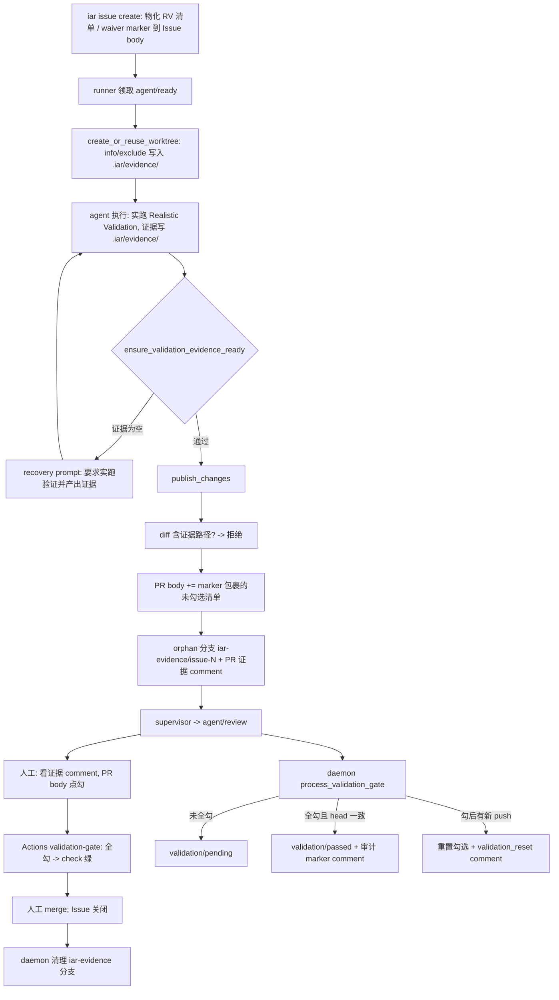

# PRD: Realistic Validation 证据门禁（Validation Evidence Gate）

## 1. Introduction & Goals

### Problem Statement

当前流水线中 Realistic Validation 只是 PRD 的"计划"，执行 agent 可以不真正运行验证就把 Acceptance Checklist 自行勾选并进入人工 review；人工 reviewer 在 PR 上看不到任何真实运行证据（截图/输出），也没有任何门禁阻止未经人工确认验证结果的 PR 被合并。验证的最后一公里完全依赖 agent 自觉与人工自律。

### Proposed Solution Summary

采用 **worktree 本地隔离证据目录 + orphan 证据分支 + PR body 人工勾选清单 + 双层门禁** 的方案：

- 执行 agent 必须实际执行 PRD 的 Realistic Validation Plan，并把截图/输出证据写入 worktree 内 `.iar/evidence/` 目录；runner 在创建 worktree 时把该目录写入 `git rev-parse --git-path info/exclude`，证据在 git 层面永远不可能进入代码 diff。
- 发布前 runner 校验：要求验证且无豁免时，证据目录为空 → 拒绝进入发布、转 recovery；diff 中混入证据路径 → 拒绝 push。
- 发布时 runner 用 git plumbing（`hash-object`/`mktree`/`commit-tree`）构造无父提交，force-push 到 orphan 分支 `iar-evidence/issue-<N>`（永不合并，Issue 关闭后由 runner 自动删除），并在 PR 上发一条嵌入图片/引用文本的证据 comment。
- PR body 末尾追加由 hidden marker 包裹的 `Realistic Validation` 未勾选 task list；人工 reviewer 查看证据 comment 后直接在 GitHub PR body 点击 checkbox 完成"打勾提交"。
- iar 侧软门禁：daemon 轮询 `agent/review` Issue，按 PR body 勾选状态维护 `validation/pending` / `validation/passed` label，全勾后写入审计 marker comment；勾选后又有新 commit 时重置勾选并通知。
- GitHub 侧硬门禁：极小 workflow `validation-gate.yml` 解析 PR body 的 marker 区块，未全勾则 check 失败，配合 branch protection required check 物理阻止合并。
- 豁免收紧：默认必做；只有 PRD 在 `### Realistic Validation` 小节显式声明 `Validation Waiver: <理由>`（由 operator 确认）时，`iar issue create` 才物化 `<!-- iar:validation-waived -->` marker，跳过证据要求。声明由 PRD 作者（经 operator 审核）提供，系统只消费显式声明、不做推断。

不引入本地状态存储（GitHub Issue/PR 仍是唯一状态源），不新建第二套 marker 语法（复用 `iar:event` 的 `<!-- iar:... -->` + 命名捕获组惯例），不改变已领取后的 runner 状态机阶段定义。

### Measurable Objectives

- 要求验证且无豁免的 Issue，agent 不产出证据文件则无法进入发布阶段（转 recovery，最终 `agent/failed`）。
- 证据文件不可能出现在 PR diff 或主分支 git 历史中；reviewer 可在 PR comment 中看到截图或文本证据。
- PR body 的 Realistic Validation checklist 未全勾时，`validation-gate` required check 保持失败，合并被物理阻止；人工点勾后 check 自动变绿。
- 勾选后 PR 又有新 commit，daemon 在一个轮询周期内重置勾选并发出说明 comment。
- Issue 关闭后对应 `iar-evidence/issue-<N>` 分支在后续轮询周期内被自动删除。
- 带 waiver marker 或不含 Realistic Validation 清单的存量 Issue 行为完全不变（零破坏）。

### Realistic Validation

除单元测试和集成测试外，本 PRD 要求通过**真实项目入口点**验证关键行为，确保真实使用路径生效，而非仅在隔离 fixture 中通过。

- [ ] **发布链路真实验证**：在带凭据的测试仓库通过 `uv run iar issue create <prd-path>` 创建 Issue，确认 Issue body 含 `## Realistic Validation` 清单；对带 `Validation Waiver:` 的 PRD 确认 body 含 `iar:validation-waived` marker 且无清单。
- [ ] **证据门禁真实验证**：对要求验证的 Issue 运行 `uv run iar run --max-issues 1`，确认 agent 产出 `.iar/evidence/` 文件后 PR body 含 marker 包裹的未勾选清单、PR 有证据 comment、`iar-evidence/issue-<N>` 分支存在且 `git log <branch>` 无父提交、PR diff 不含证据文件。
- [ ] **人工勾选门禁真实验证**：在 PR body 手动勾选全部清单项，确认 `validation-gate` check 由失败转为成功，且 daemon 轮询后 Issue label 由 `validation/pending` 换为 `validation/passed` 并出现审计 comment；再推一个空白 commit，确认勾选被重置、check 重新失败。
- [ ] **为什么单元测试不够**：证据链横跨 worktree 文件系统、git plumbing 推送、`gh` PR body/comment 读写、GitHub Actions 渲染与 branch protection，单元测试无法证明 blob 链接可访问、checkbox 点击触发 `edited` 事件重跑 check、以及 orphan 分支与代码历史零共同祖先这些端到端事实。

### Delivery Dependencies

- Group: agent-runner-validation-gate
- Depends on groups:
- Depends on tasks/issues:
- Gate type: soft
- Notes: 与 archived `P1-FEAT-20260610-114529-issue-dependency-gate` 仅存在文件级合并冲突风险，无行为耦合；不物化为 GitHub Issue 依赖。

## 2. Requirement Shape

- **Actor**：执行 agent（产出证据）、runner（隔离/校验/上传/门禁轮询）、`iar issue create`（物化清单与 waiver marker）、人工 reviewer（看证据、点 checkbox）、GitHub Actions（硬门禁 check）。
- **Trigger**：Issue 发布时；agent 完成实现进入 commit 流程前；publish 创建 PR 时；daemon 每个轮询周期；PR body 被编辑或有新 push 时（Actions）。
- **Expected Behavior**：见 Proposed Solution Summary。
- **Scope Boundary**：只管"验证证据的产出、隔离、呈现与人工确认"；不改变 supervisor 的 review 决策逻辑；不做跨仓库证据存储；不做证据内容的 AI 审核；不强制每个清单项一张截图（v1 要求目录非空，按项命名为约定）。

## 3. Repository Context And Architecture Fit

### Current Relevant Modules

| 模块 | 现状 |
|---|---|
| `src/backend/core/use_cases/agent_runner_events.py` | `<!-- iar:event ... -->` marker 解析/格式化惯例（命名捕获组正则），新增 marker 必须同型 |
| `src/backend/core/use_cases/run_agent_once.py` | `create_or_reuse_worktree`（info/exclude 写入点）、`run_agent_until_committed`（Phase 3 PRD 交付检查后是证据门禁插入点） |
| `src/backend/core/use_cases/agent_runner_feedback.py` | `_DEFAULT_EXECUTION_TEMPLATE` / `build_recovery_prompt`（agent 指令注入点）、`ensure_prd_delivery_ready`（同型门禁先例） |
| `src/backend/core/use_cases/agent_runner_publish.py` | `publish_changes`（push 前安全校验、PR body 组装、create_draft_pr，是证据上传与 checklist 注入点） |
| `src/backend/core/use_cases/agent_runner_publication.py` | `_reuse_existing_local_commit`（恢复路径也要过证据门禁）、`_finish_*_publication`（发布编排） |
| `src/backend/core/use_cases/agent_runner_orchestrate.py` | `run_once` 轮询入口（软门禁与证据分支清理的挂载点）；`_process_running_rework`（修复后刷新证据） |
| `src/backend/core/use_cases/create_issue_from_prd.py` | `build_issue_body` / `create_issue_from_prd`（Realistic Validation 清单与 waiver marker 的物化点） |
| `src/backend/core/shared/models/agent_runner.py` | `LabelConfig` / `AppConfig` / `PullRequestContext`（需要扩展 validation 配置、validation labels、PR number/body 字段） |
| `src/backend/infrastructure/github_client.py` | `GitHubCliClient`（`gh` 封装；需要补 PR comment / PR body 读写 / issue state 能力） |
| `src/backend/infrastructure/config/settings.py` | `AgentRunner*Settings` Pydantic 模型（新增 `[agent_runner.validation]` 配置节与 label 字段） |
| `tests/backend/test_run_agent.py` 等 | 现有 fake `IProcessRunner` / `IGitHubClient` 测试模式，直接复用 |

### Architecture Constraints

- 证据判定与上传编排属于 `core/`，对 git 与 GitHub 的副作用通过 `IProcessRunner` / `IGitHubClient` 端口注入；`core` 不得 import `infrastructure/`。
- GitHub Labels / Issue / PR body 仍是唯一状态源；不引入本地数据库或状态文件。
- Python 文本 I/O 显式 `encoding="utf-8"`；单文件非空行 ≤ 1000。

### Existing PRD Relationship

- `tasks/pending/P1-FEAT-20260610-114529-issue-dependency-gate.md`：与本 PRD 共享 `create_issue_from_prd.py` 物化点与 orchestrate 轮询入口的修改区域 → 记为 soft 依赖，二者可独立交付。
- `tasks/archive/20260522-143103-prd-two-stage-agent-review-pr-supervisor.md` 与 `tasks/archive/20260527-234531-prd-agent-runner-pr-context-approval-gate.md`：定义了 supervisor 决策守卫与 `PullRequestContext` 确定性信号惯例，本 PRD 的硬门禁沿用"确定性信号优先于 LLM 判断"的同一原则。
- 其余 pending PRD（worktree-sync、unified-entry、ci-rework-state-recovery 等）无重叠。

### Potential Redundancy Risks

- 不要为证据状态新建第二套 marker 体系——所有新 marker 使用 `<!-- iar:... -->` + 命名捕获组正则，与 `agent_runner_events.py` 同型；审计事件直接复用 `format_event_marker`（phase=`validation_passed` / `validation_reset`）。
- 不要把豁免判断做成自然语言推断——只消费 `iar:validation-waived` marker 与 `Validation Waiver:` 显式声明行。
- 不要新建独立的发布管线——证据上传内嵌在现有 `publish_changes` 中。
- 不要给 supervisor 增加证据守卫——证据 comment 由 publish 确定性产出，门禁由 daemon + Actions 承担，supervisor 不重复判断。

## 4. Recommendation

### Recommended Approach

最小变更路径：**新增单一 core 模块 `agent_runner_validation.py` 承载全部纯逻辑，副作用挂在四个既有锚点上**（worktree 创建、commit 前门禁、publish、daemon 轮询），加一个独立的 GitHub Actions workflow 文件。

拒绝的更重方案：为证据引入对象存储/Release asset 通道（需要新的鉴权与生命周期管理，且私有仓库内 blob 链接已满足"人能看到"），以及为人工验收做专门 Web UI（GitHub PR body checkbox 原生支持点选，零增量 UI）。

git plumbing orphan 分支优于"临时切分支提交证据"：不触碰 worktree 的 HEAD/index，无并发污染风险，天然无父提交。

### Alternatives Considered

- **Release asset 通道**：完全不进 git 对象库，但 `gh release upload` 需要 tag 管理、私有仓库 asset 链接在 comment 内不可内联渲染、清理逻辑更复杂。在"分支永不合并 + 用后即删"已满足需求的前提下属于过度设计。
- **仅软门禁（label + 纪律）**：不需要在目标仓库安装 workflow，但无法物理阻止合并，不满足用户"必须人工确认后才能合并"的核心诉求。保留为 `enabled=false` 时的退化形态。

## 5. Implementation Guide

> This section is a living implementation guide based on current repository analysis. If implementation discovers additional affected files, hidden dependencies, edge cases, or a better path, update this PRD before proceeding.

### Core Logic

1. **物化（issue create）**：`create_issue_from_prd` 读取 PRD `### Realistic Validation` 小节 → 提取 checkbox 项与 `Validation Waiver:` 行 → Issue body 追加确定性 `## Realistic Validation` 区块（清单或 waiver marker）。该区块独立于 AI 生成正文，三条 body 路径（template/agent/fallback）一致。
2. **隔离（worktree）**：`create_or_reuse_worktree` 末尾调用 `ensure_evidence_dir_excluded`：`git rev-parse --git-path info/exclude` 解析排除文件路径，幂等追加 `/.iar/evidence/` 行。
3. **强制执行（commit 前）**：`run_agent_until_committed` 在 `ensure_prd_delivery_ready` 之后插入 `ensure_validation_evidence_ready`：`validation_required(issue.body, config)`（enabled 且 body 有 RV 清单且无 waiver marker）时要求 `.iar/evidence/` 下至少一个常规文件，否则抛 `ValidationEvidenceError` 进 recovery 循环；`_reuse_existing_local_commit` 同样调用。
4. **发布（publish_changes）**：push 前 `ensure_no_evidence_paths_in_changes`（diff 含证据路径即拒绝）；PR body 末尾追加 `build_validation_checklist_block`（`<!-- iar:realistic-validation version=1 total=N -->` … `<!-- iar:realistic-validation-end -->` 包裹的未勾选 task list）；create PR 后 `upload_evidence_branch`（hash-object/mktree/commit-tree/force-push `iar-evidence/issue-<N>`）并 `comment_pr` 证据 comment（嵌图 + 文本引用 + `<!-- iar:validation-evidence version=1 head=<sha> branch=<branch> count=N -->` marker）。
5. **修复刷新（rework）**：`_process_running_rework` 修复完成后若仍要求验证且证据目录非空 → 重新 upload + comment（新 head 的证据）。
6. **软门禁（daemon）**：`run_once` 每轮调用 `process_validation_gate`：扫 `agent/review` Issue → 从 event marker 取 `pr_branch` → 读 PR body 勾选状态：未全勾 → 确保 `validation/pending`；全勾且 PR head == 证据 marker head → `validation/passed` + 审计 comment（带 `phase=validation_passed` marker，按 head 去重）；全勾但 head 落后于证据 → 重置 body 勾选 + `validation_reset` comment。随后清理：`git ls-remote` 列出 `iar-evidence/*`，对应 Issue 已关闭则删除远端分支。
7. **硬门禁（Actions）**：`validation-gate.yml` 在 `pull_request: [opened, edited, synchronize, reopened]` 上解析 PR body marker 区块，存在区块且未全勾 → exit 1；无区块 → pass（不要求验证的 PR 不受影响）。

### Change Impact Tree

```text
.
├── Infrastructure
│   ├── src/backend/infrastructure/config/settings.py
│   │   [修改]
│   │   【总结】新增 [agent_runner.validation] 配置节与 validation/pending、validation/passed label 字段
│   │   ├── 新增 AgentRunnerValidationSettings(enabled/evidence_dir/branch_prefix)
│   │   ├── AgentRunnerLabelSettings 增加 validation_pending / validation_passed
│   │   └── 接入 AgentRunnerSettings 与 AppConfig 装配点（rg "validation" 验证装配完整）
│   └── src/backend/infrastructure/github_client.py
│       [修改]
│       【总结】补齐 PR 维度读写能力并扩展 PR 上下文字段
│       ├── get_pull_request_context 的 --json 增加 number,body 并填充新字段
│       ├── 新增 comment_pr(pr_number, body)（gh pr comment --body-file）
│       ├── 新增 update_pull_request_body(pr_number, body)（gh pr edit --body-file）
│       └── 新增 get_issue_state(issue_number) -> str（gh issue view --json state）
│
├── Domain (core)
│   ├── src/backend/core/shared/models/agent_runner.py
│   │   [修改]
│   │   【总结】扩展配置与 PR 上下文模型承载 validation 状态
│   │   ├── 新增 ValidationConfig dataclass
│   │   ├── LabelConfig 增加 validation_pending / validation_passed
│   │   ├── AppConfig 增加 validation 字段
│   │   └── PullRequestContext 增加 number / body 字段（默认值保持向后兼容）
│   ├── src/backend/core/shared/interfaces/agent_runner.py
│   │   [修改]
│   │   【总结】IGitHubClient 端口补 PR comment、PR body 编辑与 issue state 查询三个抽象方法
│   ├── src/backend/core/use_cases/agent_runner_validation.py
│   │   [新增]
│   │   【总结】Validation Evidence Gate 的全部纯逻辑与编排（marker、清单、证据、orphan 分支、软门禁）
│   │   ├── waiver / checklist / evidence marker 的 format + parse（同 iar:event 正则风格）
│   │   ├── extract_realistic_validation_items / extract_validation_waiver_reason（解析 PRD/Issue 文本）
│   │   ├── validation_required / list_evidence_files / ensure_validation_evidence_ready
│   │   ├── build_validation_checklist_block / parse_validation_checklist_state
│   │   ├── upload_evidence_branch（git plumbing）+ build_evidence_comment（嵌图/引文本）
│   │   ├── publish_validation_evidence（上传 + comment 的复合编排，发布与 rework 共用）
│   │   └── process_validation_gate（daemon 软门禁 + 重置 + 审计 + 证据分支清理）
│   ├── src/backend/core/use_cases/run_agent_once.py
│   │   [修改]
│   │   【总结】worktree 创建后写 info/exclude；commit 循环 Phase 3 后插入证据门禁并接入 recovery
│   ├── src/backend/core/use_cases/agent_runner_feedback.py
│   │   [修改]
│   │   【总结】执行与 recovery 默认 prompt 增加"必须执行 Realistic Validation 并写证据到 .iar/evidence/"规则行
│   ├── src/backend/core/use_cases/agent_runner_publish.py
│   │   [修改]
│   │   【总结】push 前证据路径守卫；PR body 追加 checklist 区块；create PR 后上传证据分支并发证据 comment
│   ├── src/backend/core/use_cases/agent_runner_publication.py
│   │   [修改]
│   │   【总结】_reuse_existing_local_commit 复用路径同样执行证据门禁
│   ├── src/backend/core/use_cases/agent_runner_orchestrate.py
│   │   [修改]
│   │   【总结】run_once 每轮执行 process_validation_gate；rework 完成后刷新证据
│   ├── src/backend/core/use_cases/create_issue_from_prd.py
│   │   [修改]
│   │   【总结】Issue body 物化 Realistic Validation 清单或 waiver marker（独立于 AI 生成正文）
│   ├── src/backend/core/use_cases/recover_publish.py
│   │   [修改]（实现中发现）
│   │   【总结】恢复发布路径同样注入 PR 签收清单并 best-effort 上传证据
│   ├── src/backend/core/use_cases/agent_runner_events.py
│   │   [修改]（实现中发现）
│   │   【总结】新增 parse_latest_event_marker_for_phases 供审计 comment 按 head 去重
│   └── src/backend/infrastructure/process_runner.py
│       [修改]（实现中发现）
│       【总结】IProcessRunner.run 新增 keyword-only input_text 参数，支撑 git mktree 的 stdin 输入
│
├── CI/CD
│   └── .github/workflows/validation-gate.yml
│       [新增]
│       【总结】解析 PR body marker 区块的 required check，未全勾即失败
│
├── Config
│   └── config.toml
│       [修改]
│       【总结】新增 [agent_runner.validation] 示例节、validation labels、execution phase 模板补证据规则行
│
├── Tests
│   ├── tests/test_agent_runner_validation.py
│   │   [新增]
│   │   【总结】31 个用例：marker/清单/豁免解析、证据门禁、orphan 上传命令序列、commit 循环 recovery、publish 注入与守卫、软门禁状态机与分支清理、issue create 物化
│   ├── tests/conftest.py
│   │   [修改]
│   │   【总结】FakeProcessRunner 支持 input_text 记录；FakeGitHubClient 补 comment_pr / update_pull_request_body / issue state
│   └── tests/test_github_client.py
│       [修改]
│       【总结】get_pull_request_context 的 --json 字段同步 number,body
│
└── Docs
    └── docs/guides/agent-runner.md
        [修改]
        【总结】新增 "Realistic Validation 证据门禁" 章节：全链路流程、marker 一览、配置、branch protection 操作步骤；mkdocs.yml 无需变更（无新页面）
```

注：以上文件清单是起点而非穷尽保证，见 Executor Drift Guard。

### Executor Drift Guard

- 装配点搜索：`rg -n "AppConfig\(" src/ tests/` 找全 AppConfig 构造处（settings→config 装配、测试 fixture），新增 `validation` 字段后全部同步。
- fake client 搜索：`rg -n "class .*GitHubClient|IGitHubClient" src/ tests/` 找全 IGitHubClient 实现/测试替身，补三个新方法。
- label 集合搜索：`rg -n "_workflow_state_labels|sync_labels" src/` 确认 validation labels 是否纳入标签同步与状态清理集合（validation labels 不属于 workflow state，不应被 `_workflow_state_labels` 移除；`sync_labels` 应创建它们）。
- CLI 双轨：`rg -n "issue create|issue_create" src/backend/api/` 确认 `cli.py` 与 `cli_typer.py` 是否都需要透出新行为（本 PRD 不新增 CLI 参数，应零改动，验证即可）。
- prompt 模板双源：默认模板在 `agent_runner_feedback.py`，仓库级模板在 `config.toml [agent_runner.prompts.phases]`，两处都要加证据规则行。

### Flow Diagram



### Realistic Validation Plan

| Behavior | Real Entry Point | Test Layer | Mock Boundary | Data/Env Needed | Command Or Procedure | Required For Acceptance |
|---|---|---|---|---|---|---|
| Issue body 物化清单/waiver | `uv run iar issue create <prd>` | sandbox | 真实 `gh` + 测试仓库 | 带凭据测试仓库、含 RV 小节的 PRD | `uv run iar issue create tasks/pending/<prd>.md` 后 `gh issue view <n> --json body` | Yes（带凭据环境） |
| 证据门禁+发布链路 | `uv run iar run --max-issues 1` | sandbox | 真实 agent + `gh` | 同上 | 运行后检查 PR body、PR comment、`git ls-remote origin "refs/heads/iar-evidence/*"`、`gh pr diff <n>` 无证据文件 | Yes（带凭据环境） |
| 人工勾选→check 变绿→push 重置 | GitHub PR 页 + Actions | manual/sandbox | 全真实 | 同上 + workflow 已安装 | PR body 点勾观察 check；`git commit --allow-empty && git push` 观察重置 | Yes（带凭据环境） |
| workflow 解析逻辑 | `python3` 内嵌脚本本地执行 | smoke | 无 mock | 无 | 用样例 body 文本本地运行 workflow 内嵌的解析脚本，断言 exit code | Yes |
| 各纯函数与编排 | pytest | unit | fake process runner / github client | 无 | `uv run pytest tests/backend/test_agent_runner_validation.py -q` | Yes |
| 全量回归 | just | integration | 无 | 无 | `just test` | Yes |

凭据不可用时的回退：sandbox 三项标记为待办（checklist 保持未勾，PRD 留在 pending），本地必须完成 workflow 脚本 smoke + 单测 + `just test`。失败排查首查点：`info/exclude` 实际落盘路径（worktree 的 git-path 解析）、`gh pr list --json` 字段名大小写、mktree 输入的 TAB 分隔格式。

### Low-Fidelity Prototype

证据 comment 的目标形态（PR 内）：

```text
<!-- iar:validation-evidence version=1 head=abc1234 branch=iar-evidence/issue-42 count=2 -->
### Realistic Validation Evidence

Evidence branch: `iar-evidence/issue-42`（never merged; auto-deleted after the issue closes）

#### rv-1-dependency-wait.png

[Open file](https://github.com/<owner>/<repo>/blob/iar-evidence/issue-42/rv-1-dependency-wait.png)

#### rv-2-cli-output.txt
```text
$ uv run iar run --dry-run --max-issues 2
DRY RUN: would process Issue #41 ...
```（超长截断）
```

PR body 追加区块的目标形态：

```text
<!-- iar:realistic-validation version=1 total=3 -->
### Realistic Validation Human Sign-Off Shape

Review the evidence comment on this PR, then tick每一项 once verified:

- [ ] 依赖等待真实验证：…
- [ ] 依赖放行真实验证：…
- [ ] 发布链路真实验证：…
<!-- iar:realistic-validation-end -->
```

### ER Diagram

No data model changes in this PRD.（状态全部存于 GitHub label / PR body / comment marker。）

### Interactive Prototype Change Log

No interactive prototype file changes in this PRD.

### External Validation

No external validation required; repository evidence was sufficient.（GitHub checkbox 点选触发 `pull_request: edited` 与 orphan push 行为属于稳定的平台事实，由 sandbox 真实验证覆盖。）

## 6. Definition Of Done

- 上述全部代码、配置、workflow、文档落地，`just lint` 与 `just test` 通过。
- 单测覆盖新模块的纯逻辑与四个挂载点的行为分支。
- 凭据可用时完成三项 sandbox 真实入口验证并在本 PRD 勾选记录；不可用时保留未勾项并在 Risks 中注明。
- 文档与 `mkdocs.yml` 同步；branch protection 配置步骤已写入文档（required check 本身需 operator 在 GitHub 设置中手动启用）。
- 存量行为零回归：无 RV 清单或带 waiver 的 Issue 全链路行为不变。

## 7. Acceptance Checklist

### Architecture Acceptance

- [x] 新增逻辑位于 `src/backend/core/use_cases/agent_runner_validation.py`，对 git/GitHub 的副作用全部经 `IProcessRunner` / `IGitHubClient` 端口；`rg -n "from backend.infrastructure" src/backend/core/` 无新增命中
- [x] 所有新 hidden marker 使用 `<!-- iar:... -->` + 命名捕获组正则；`rg -n "iar:validation|iar:realistic-validation" src/backend/core/use_cases/agent_runner_validation.py` 可见 format 与 parse 成对出现
- [x] 不新增本地状态存储；`rg -n "sqlite|json.dump" src/backend/core/use_cases/agent_runner_validation.py` 无命中

### Dependency Acceptance

- [x] 与 issue-dependency-gate 无功能耦合：本 PRD 改动不读取/写入 `iar:depends-on` 或 `task-group/` 语义

### Behavior Acceptance

- [x] `iar issue create`：PRD 含 RV 清单 → Issue body 出现 `## Realistic Validation` 未勾清单；PRD 声明 `Validation Waiver:` → body 出现 `iar:validation-waived` marker 且无清单（单测断言）
- [x] worktree 创建后 `git rev-parse --git-path info/exclude` 指向的文件包含 `/.iar/evidence/` 行，且重复创建不重复追加（单测断言）
- [x] 要求验证且证据目录为空时，`run_agent_until_committed` 进入 recovery，重试耗尽后 Issue 标记 `agent/failed`（单测断言）
- [x] `publish_changes`：diff 含证据路径 → 拒绝 push；PR body 含 marker 区块与未勾清单；证据经 plumbing 推送到 `iar-evidence/issue-<N>` 且命令序列含 `commit-tree`（无 `-p` 父参数）（单测断言）
- [x] `process_validation_gate`：未全勾 → `validation/pending`；全勾且 head 一致 → `validation/passed` + 含 `phase=validation_passed` marker 的 comment 且按 head 去重；全勾但 head 更新 → PR body 勾选被重置 + `validation_reset` comment；Issue 关闭 → 证据分支被删除（单测断言）
- [x] 无 RV 清单或带 waiver 的 Issue：上述任何环节零行为变化（单测断言）

### Documentation Acceptance

- [x] agent runner 文档新增 Validation Evidence Gate 章节（流程图、label、marker 一览、branch protection 操作步骤）；`mkdocs.yml` 如新增页面已同步；`uv run mkdocs build` 通过

### Validation Acceptance

- [x] `uv run pytest tests/backend/test_agent_runner_validation.py -q` 通过
- [x] `just test` 通过，无既有用例回归
- [x] workflow 解析脚本以样例 PR body 本地 smoke：全勾 exit 0、含未勾 exit 1、无区块 exit 0
- [x] 带凭据环境完成 Realistic Validation 三项真实入口验证并记录结果（发布链路 / 证据门禁与发布 / 人工勾选与重置）

## 8. Functional Requirements

- **FR-1 物化**：`iar issue create` 解析 PRD `### Realistic Validation` 小节；存在 checkbox 项且无 `Validation Waiver:` 声明时，在 Issue body 追加确定性 `## Realistic Validation` 未勾清单；存在 waiver 声明时追加 `<!-- iar:validation-waived reason="..." -->` marker。该物化独立于 AI 生成正文路径。
- **FR-2 隔离**：runner 在 worktree 创建/复用后，把 `/{evidence_dir}/`（默认 `/.iar/evidence/`）幂等写入 `git rev-parse --git-path info/exclude` 所指文件，全部文件 I/O 显式 UTF-8。
- **FR-3 强制执行**：`validation_required` 为真（配置启用 + Issue body 有 RV 清单 + 无 waiver marker）时，commit 前门禁要求证据目录至少含一个常规文件，否则抛 `ValidationEvidenceError` 进入既有 recovery 循环；复用本地 commit 的恢复路径执行同一门禁。执行/recovery prompt 明确要求实跑验证计划、按 `rv-<序号>-<slug>.<ext>` 命名证据（UI 行为截图 PNG，CLI 行为可用文本输出）。
- **FR-4 发布守卫**：push 前若 `git diff` 变更路径落在证据目录内则拒绝发布（独立于 info/exclude 的双保险）。
- **FR-5 证据上传**：发布时用 `git hash-object -w` / `mktree` / `commit-tree`（无父提交）构造证据树，force-push 到 `{branch_prefix}issue-<N>`；不改变 worktree HEAD/index；仅收集证据目录第一层常规文件。
- **FR-6 呈现**：PR 创建后发布证据 comment：图片项内联嵌入 blob `?raw=true` 链接并附原链接，文本项内联引用（截断），comment 头部带 `iar:validation-evidence` marker（head/branch/count）。
- **FR-7 人工验收面**：PR body 末尾追加 `iar:realistic-validation` marker 区块包裹的未勾 task list，条目文本来自 Issue body 的 RV 清单。
- **FR-8 软门禁**：daemon 每轮对 `agent/review` Issue 执行：未全勾 → 确保 `validation/pending`（移除 passed）；全勾且 PR head 等于最近证据 marker head → `validation/pending`→`validation/passed` 并发含 `phase=validation_passed` 的审计 comment（同 head 去重）；全勾但 PR head 新于证据 head → 重置区块内全部勾选（编辑 PR body）并发 `phase=validation_reset` comment。
- **FR-9 分支清理**：daemon 每轮列出远端 `{branch_prefix}*` 分支，对应 Issue 状态为 CLOSED 的删除远端分支。
- **FR-10 硬门禁**：`.github/workflows/validation-gate.yml` 在 PR opened/edited/synchronize/reopened 时解析 body：marker 区块存在且含未勾项 → 失败；全勾或无区块 → 成功。文档说明将其设为 required check 的 branch protection 步骤。
- **FR-11 rework 刷新**：修复/rebase 完成后，若仍要求验证且证据目录非空，重新上传证据分支并追加新的证据 comment。
- **FR-12 配置**：`[agent_runner.validation]`（enabled 默认 true、evidence_dir、branch_prefix）与 `validation/pending`、`validation/passed` label 配置化；`sync_labels` 创建新 label；validation labels 不纳入 `_workflow_state_labels`。
- **FR-13 豁免收紧（prd skill）**：通用 `prd` skill 规则更新为——Realistic Validation 默认必须由执行方实跑并产出证据；跳过仅允许通过 PRD 中显式 `Validation Waiver: <理由>` 声明，且该声明必须经用户确认。skill 文件位于 `~/.claude/skills/prd/SKILL.md`（用户级，不在本仓库）；其规范要点同步记录在本仓库文档中。

## 9. Non-Goals

- 不做证据内容的自动审核/AI 判图；真实性判断属于人工 reviewer。
- 不做跨仓库或对象存储的证据通道；不做 Release asset。
- 不强制"每个清单项至少一张图"的逐项校验（v1 目录非空 + 命名约定）。
- 不自动配置 branch protection（GitHub 设置需 operator 手动操作，文档给出步骤）。
- 不改变 supervisor 的决策动作集合与 review 语义。
- 不处理证据文件的敏感信息脱敏（执行 prompt 提示 agent 不得截取密钥，但不做扫描）。

## 10. Risks And Follow-Ups

- **私有仓库内联渲染**：私有仓库中 blob `?raw=true` 图片可能不内联渲染，reviewer 需点链接查看。证据 comment 同时给出可点击链接以兜底。
- **Actions 安装为一次性基础设施**：其他目标仓库使用本能力时需复制 workflow 并配置 required check；文档提供模板与步骤。
- **凭据不可用时的 sandbox 验证**：三项真实入口验证可能延后，期间软门禁逻辑仅有单测背书；保留 checklist 未勾项跟踪。
- **info/exclude 为 commondir 级共享**：排除规则对主仓与所有 worktree 生效（预期行为，证据目录本就不该入库），但操作者手动 `git add -f` 仍可绕过——发布守卫（FR-4）是兜底。

## 11. Decision Log

| ID | Decision Question | Chosen | Rejected | Rationale |
|---|---|---|---|---|
| D-01 | 证据如何送达 reviewer 且不进代码 | orphan 分支 `iar-evidence/issue-<N>` + PR comment 链接，用后即删 | Release asset 通道 | 分支方案零新增鉴权面、`gh`/git 即可完成全生命周期，且与代码历史零共同祖先即满足"永不合并" |
| D-02 | 人工验收交互 | GitHub PR body 原生 checkbox 点选 | 专门 Web UI / 评论指令 | 点 checkbox 触发 `edited` 事件可直接驱动硬门禁重跑，零增量 UI 与解析歧义 |
| D-03 | 合并阻断机制 | Actions required check 解析 body marker 区块（软门禁 label 并存） | 仅 label + 人工纪律 | 只有 required check 能物理阻止 merge，满足"未确认不得合并"的核心诉求 |
| D-04 | 证据目录排除方式 | `git rev-parse --git-path info/exclude` 本地排除 | 修改项目 `.gitignore` | 改 `.gitignore` 本身是会被合并的代码变更，违背"截图相关内容不进代码"的边界 |
| D-05 | orphan 分支构造方式 | git plumbing（hash-object/mktree/commit-tree） | 临时切换分支提交 | plumbing 不触碰 HEAD/index，对运行中的 worktree 零侵入、无竞态 |
| D-06 | 豁免机制 | PRD 显式 `Validation Waiver:` → `iar:validation-waived` marker | AI 自judge"纯内部重构"豁免 | 把"可以不做"的裁量权从执行 agent 收回到 operator，符合本 PRD 的根本目的 |
| D-07 | 勾后又 push 的处理 | daemon 检测 head 漂移重置勾选 | Actions 内重置 / 不处理 | Actions 无法区分勾选与 push 的先后且无写权限边界控制；daemon 已有全上下文与端口能力 |
