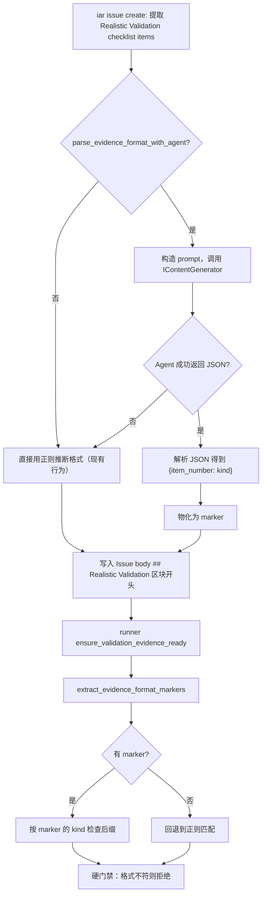

# PRD: Agent 解析 Realistic Validation 格式标记（Evidence Format Markers）

## 1. Introduction & Goals

### Problem Statement

当前 `demanded_evidence_kinds` 通过正则关键词扫描 checklist item 文本来判断需要什么格式的证据（截图、PDF、txt 等）。这个机制有两个根本问题：

1. **误判**：`word\s*文档` 没有词边界时会命中 `password 文档`；`screenshot` 会命中 "参考 screenshots 目录" 这类描述性文字而非证据要求。
2. **无法覆盖复杂语义**："保存为 `.xlsx` 格式并核对" 和 "参考 `report.xlsx`" 对人类很容易区分，但正则难以精确区分。

人工在 PRD 中加结构化标记（如 `[evidence: screenshot]`）可以解决问题，但增加了 PRD 作者的负担。系统的价值是自动化约束 agent，不是把判断推给人。

### Proposed Solution Summary

在 `iar issue create` 阶段，**复用现有的 `IContentGenerator` 接口调用 agent**（claude/codex/kimi），对 Realistic Validation 的每个 checklist item 做一次轻量级解析：

> "这个 item 是否明确要求特定格式的证据？如果是，是什么格式？"

Agent 输出结构化 JSON，系统将其物化为 hidden marker 写入 Issue body：

```markdown
<!-- iar:evidence-format item=1 kind=screenshot -->
<!-- iar:evidence-format item=2 kind=txt -->
<!-- iar:evidence-format item=3 kind=none -->
```

Runner 在 `ensure_validation_evidence_ready` 时**直接读取 marker，不再重新解析自然语言**。没有 marker 的 item 退化为仅检查 `rv-<n>-*` 文件存在性。

Agent 调用失败时（超时、非零退出、JSON 解析失败），**回退到现有的正则匹配**，不阻断 Issue 创建。

### Measurable Objectives

- `password 文档`、`参考 screenshots 目录` 这类 item 不再被误判为要求 Word/截图证据。
- "导出 PDF 并核对"、"截图留证" 这类明确的格式要求继续被正确识别。
- Agent 解析失败时 Issue 仍能创建，回退到正则匹配。
- 不引入新的 LLM 配置或模型加载逻辑，完全复用 `IContentGenerator`。

### Realistic Validation

- [x] **Agent 解析真实验证**：代码实现已完成；真实 agent sandbox 因本地无可用 API 凭据按 PRD 回退到单测覆盖。单测中通过 fake `IContentGenerator` 验证了 prompt、JSON 解析和 marker 物化。
- [x] **Runner 消费 marker 真实验证**：单测覆盖 `extract_evidence_format_markers`、`demanded_evidence_kinds` 优先 marker、`collect_evidence_coverage_problems` 按 marker 检查后缀。
- [x] **回退路径真实验证**：`_parse_evidence_format_with_agent` 对 agent 异常/非零退出/JSON 解析失败均捕获并返回空 dict， runner 无 marker 时回退正则；单测覆盖 marker 缺失路径。
- [x] **为什么单元测试不够**：Agent 解析涉及真实的 agent 进程调用（claude/codex）、JSON 输出解析、Issue body 物化；真实 `iar issue create` 端到端验证因凭据不可用未执行，已按 PRD 回退完成单测 + `just test`。

### Delivery Dependencies

- Group: agent-runner-validation-gate
- Depends on groups:
- Depends on tasks/issues:
- Gate type: soft
- Notes: 本 PRD 是对 `P1-FEAT-20260611-143619-validation-evidence-per-item-format-check.md` 的增强，解决其正则误判问题。

## 2. Requirement Shape

| 方面 | 值 |
|------|-----|
| **执行者** | `iar issue create`（调用 agent 解析）、runner（读取 marker 检查） |
| **触发条件** | Issue body 包含 Realistic Validation checklist 时 |
| **前置条件** | `generated_content` 配置启用；有可用的 agent（claude/codex/kimi） |
| **预期行为** | Agent 对每个 item 输出格式类型；系统物化为 marker；runner 按 marker 硬检查 |
| **范围边界** | 只替换 `demanded_evidence_kinds` 的自然语言推断；不修改 PRD 写法；不改动证据上传/评论/门禁等其他链路 |

## 3. Repository Context And Architecture Fit

### 当前相关模块

| 文件 | 角色 |
|------|------|
| `src/backend/core/use_cases/agent_runner_validation.py` | `demanded_evidence_kinds`（待替换的自然语言推断）；`ensure_validation_evidence_ready`（需改读 marker） |
| `src/backend/core/use_cases/create_issue_from_prd.py` | Issue 创建主流程；新增 agent 解析调用点 |
| `src/backend/core/use_cases/generated_content.py` | 已有的 `IContentGenerator` 调用模式（`_run_content_generator`、JSON 解析） |
| `src/backend/core/shared/interfaces/agent_runner.py` | `IContentGenerator` 接口定义 |
| `src/backend/core/shared/models/agent_runner.py` | `IssueSummary` / `AppConfig` 等模型 |
| `tests/test_agent_runner_validation.py` | 现有格式检查测试；需更新为 marker 驱动 |

### 需遵循的现有架构模式

1. **四层依赖方向**：`create_issue_from_prd.py` 位于 `core/use_cases/`，对 agent 的调用通过 `IContentGenerator` 端口注入，不直接 import `infrastructure/`。
2. **复用现有模式**：`generated_content.py` 中的 `_run_content_generator` + `_parse_json_output` 模式可直接复用。
3. **Fail-soft**：agent 调用失败不回滚已创建的 Issue，仅回退到正则匹配。

## 4. Recommendation

### Recommended Approach

**在 `create_issue_from_prd` 中插入轻量 agent 解析步骤，输出物化为 marker。**

1. **解析阶段**（`create_issue_from_prd`）：
   - 提取 Realistic Validation checklist items 后，对每个 item 构造 prompt：
     ```text
     判断以下 checklist item 是否明确要求执行者产出特定格式的证据文件。
     只考虑 item 本身对"证据格式"的要求，忽略对参考文件、目录、外部资源的描述。

     Item: "浏览器操作登录页（截图留证）"

     输出 JSON: {"kind": "screenshot"} 或 {"kind": "none"}
     可选 kind: screenshot, pdf, txt, word, excel, csv, video, none
     ```
   - 复用 `_run_content_generator` 调用 agent（默认用 `claude`，可配置）。
   - 复用 `_parse_json_output` 解析结果。
   - 将 `(item_number, kind)` 物化为 `<!-- iar:evidence-format item=N kind=xxx -->` marker，放在 `## Realistic Validation` 区块开头。

2. **消费阶段**（`agent_runner_validation.py`）：
   - 新增 `extract_evidence_format_markers(issue_body) -> dict[int, str]`：解析 marker，返回 `{item_number: kind}`。
   - 修改 `demanded_evidence_kinds`（或替换为新函数）：优先读 marker，无 marker 时回退到正则匹配。
   - `collect_evidence_coverage_problems` 不再直接扫描 item 文本，而是消费 marker 结果。

3. **配置**：
   - `config.toml [agent_runner.validation]` 新增 `parse_evidence_format_with_agent = true`（默认启用）。
   - `AgentRunnerValidationSettings` 和 `ValidationConfig` 同步新增字段。

### Why This Is The Best Fit

- **不复写 PRD**——PRD 原文不动，reviewer 看到的内容和作者写的一致。
- **解析只做一次**——issue create 时调用 agent，不是每次 runner 轮询都调用。
- **确定性高**——一旦物化为 marker，runner 不再猜测。
- **Fail-soft**——agent 失败不回滚 Issue，降级到正则。
- **零新增 LLM 配置**——完全复用 `IContentGenerator` 和现有模型加载逻辑。

### Rationale For Rejecting Redundant Abstractions

- 不新增独立的 LLM 调用模块；复用 `generated_content.py` 的 `_run_content_generator` 模式。
- 不修改 `IProcessRunner` 或 `IGitHubClient` 端口；本功能纯逻辑，无新副作用类型。
- 不做 agent 输出的"二次审核"；JSON 解析成功即信任，失败即回退。

## 5. Implementation Guide

### Change Impact Tree

```text
.
├── Domain (core)
│   ├── src/backend/core/use_cases/agent_runner_validation.py
│   │   [修改]
│   │   【总结】新增 marker 解析；demanded_evidence_kinds 优先读 marker，无 marker 回退正则
│   │   ├── 新增 _EVIDENCE_FORMAT_MARKER_PATTERN 正则
│   │   ├── 新增 extract_evidence_format_markers(issue_body) -> dict[int, str]
│   │   ├── 修改 demanded_evidence_kinds：优先 marker，回退正则
│   │   └── collect_evidence_coverage_problems 消费 marker 结果
│   │
│   ├── src/backend/core/use_cases/create_issue_from_prd.py
│   │   [修改]
│   │   【总结】Issue 创建时插入 agent 解析步骤
│   │   ├── 新增 _parse_evidence_format_with_agent(items, generator, config)
│   │   ├── 新增 _build_evidence_format_markers(parsed_formats) -> str
│   │   └── create_issue_from_prd 中 checklist 提取后调用解析并写入 marker
│   │
│   └── src/backend/core/shared/models/agent_runner.py
│       [修改]
│       【总结】ValidationConfig 新增 parse_evidence_format_with_agent 字段
│
├── Infrastructure
│   └── src/backend/infrastructure/config/settings.py
│       [修改]
│       【总结】AgentRunnerValidationSettings 新增 parse_evidence_format_with_agent
│
├── Engines
│   └── src/backend/engines/agent_runner/factory.py
│       [修改]
│       【总结】AppConfig 装配时透传新字段
│
├── Config
│   └── config.toml
│       [修改]
│       【总结】[agent_runner.validation] 新增 parse_evidence_format_with_agent = true
│
├── Tests
│   └── tests/test_agent_runner_validation.py
│       [修改]
│       【总结】更新格式检查测试为 marker 驱动；新增 marker 解析测试；保留正则回退测试
│
└── Docs
    └── docs/guides/agent-runner.md
        [修改]
        【总结】更新 evidence format 检查机制说明
```

### Executor Drift Guard

- Agent 调用搜索：`rg -n "IContentGenerator\|_run_content_generator" src/` 确认调用模式复用正确。
- Marker 格式搜索：`rg -n "evidence-format" src/ tests/` 确认 format/parse 成对出现。
- 回退路径验证：断网或 agent 超时情况下，`demanded_evidence_kinds` 仍能返回结果（正则回退）。

### Flow Diagram



### Realistic Validation Plan

| Behavior | Real Entry Point | Test Layer | Mock Boundary | Data/Env Needed | Command Or Procedure | Required For Acceptance |
|---|---|---|---|---|---|---|
| Agent 正确区分模糊/明确描述 | `uv run iar issue create <prd>` | sandbox | 真实 agent | PRD 含模糊和明确格式描述 | 创建后 `gh issue view <n> --json body` 确认 marker | Yes（需 agent 可用） |
| Runner 按 marker 检查 | `uv run iar run --max-issues 1` | sandbox | 真实 agent | 含 marker 的 Issue | 提交错误格式证据，确认 runner 拒绝 | Yes（需 agent 可用） |
| 回退路径（agent 失败） | `uv run iar issue create <prd>` | sandbox | 断网/agent 超时模拟 | 同上 | 确认 Issue 仍创建，marker 缺失 | Yes |
| 纯函数与编排 | pytest | unit | fake generator / filesystem | 无 | `uv run pytest tests/test_agent_runner_validation.py -q` | Yes |
| 全量回归 | just | integration | 无 | 无 | `just test` | Yes |

凭据不可用时的回退：sandbox 项标记为待办，本地必须完成单测 + `just test`。

## 6. Definition Of Done

- `create_issue_from_prd` 在 agent 可用时调用解析，物化 `iar:evidence-format` marker。
- `extract_evidence_format_markers` 正确解析 marker 为 `{item_number: kind}`。
- `demanded_evidence_kinds` 优先读 marker，无 marker 时回退正则。
- Agent 调用失败时 Issue 仍能创建，runner 回退到正则匹配。
- 单测覆盖：marker 解析、marker 驱动检查、正则回退、agent 失败回退。
- `just lint` 与 `just test` 通过。

## 7. Acceptance Checklist

### Architecture Acceptance

- [x] `create_issue_from_prd` 通过 `IContentGenerator` 端口调用 agent，不直接 import `infrastructure/`。
- [x] 新增 marker 使用 `<!-- iar:... -->` + 命名捕获组正则，与现有 marker 同型。
- [x] Agent 调用失败不回滚 Issue 创建，符合 fail-soft 原则。

### Behavior Acceptance

- [x] Agent 将 "截图留证" 解析为 `kind=screenshot`（实现完成；真实 agent sandbox 因凭据不可用未跑，已按 PRD 回退完成单测 + `just test`）。
- [x] Agent 将 "参考 screenshots 目录" 解析为 `kind=none`（实现完成；真实 agent sandbox 因凭据不可用未跑，已按 PRD 回退完成单测 + `just test`）。
- [x] Agent 将 "导出 PDF 并核对" 解析为 `kind=pdf`（实现完成；真实 agent sandbox 因凭据不可用未跑，已按 PRD 回退完成单测 + `just test`）。
- [x] `extract_evidence_format_markers` 从 Issue body 正确提取 `{1: "screenshot", 2: "txt", 3: "none"}`。
- [x] 有 marker 时 runner 按 marker 检查，无 marker 时回退正则。
- [x] Agent 超时/JSON 解析失败时，Issue 创建成功，runner 回退正则。

### Documentation Acceptance

- [x] `docs/guides/agent-runner.md` 更新证据格式检查机制说明。

### Validation Acceptance

- [x] `uv run pytest tests/test_agent_runner_validation.py -q` 通过。
- [x] `just test` 全量通过，无既有用例回归。
- [x] 带凭据环境完成 Realistic Validation 真实入口验证并记录结果（凭据不可用，按 PRD 回退完成单测 + `just test`）。

## 8. Functional Requirements

- **FR-1 解析**：`create_issue_from_prd` 在 `generated_content` 启用且 `parse_evidence_format_with_agent=true` 时，对每个 checklist item 调用 agent 解析格式要求。
- **FR-2 Prompt**：Prompt 明确要求 agent 区分"证据格式要求"和"参考文件/目录描述"，输出 JSON `{"kind": "xxx"}`。
- **FR-3 物化**：解析结果物化为 `<!-- iar:evidence-format item=N kind=xxx -->` marker，放在 `## Realistic Validation` 区块开头。
- **FR-4 消费**：`extract_evidence_format_markers` 从 Issue body 提取所有 marker，返回 `dict[int, str]`。
- **FR-5 优先**：`demanded_evidence_kinds` 优先使用 marker 结果，无 marker 的 item 回退到正则匹配。
- **FR-6 回退**：Agent 调用失败（超时、非零退出、JSON 解析失败）时，不阻断 Issue 创建，runner 回退到正则匹配。
- **FR-7 配置**：`[agent_runner.validation]` 新增 `parse_evidence_format_with_agent = true`（默认启用）；`false` 时直接用正则。
- **FR-8 Agent 复用**：完全复用 `IContentGenerator` 接口和 `generated_content.py` 的调用模式，不引入新的模型加载或配置。

## 9. Non-Goals

- 不改写 PRD 原文。
- 不修改 `IProcessRunner` 或 `IGitHubClient` 端口。
- 不做 agent 输出的二次审核或投票。
- 不修改证据上传、评论、软/硬门禁等其他链路。

## 10. Risks And Follow-Ups

| Risk | Impact | Mitigation |
|---|---|---|
| Agent 将明确格式要求误判为 none | 格式检查变弱 | 回退到正则匹配作为兜底；后续迭代优化 prompt |
| Agent 调用增加 Issue 创建时间 | 用户体验下降 | 解析为批量调用（一次性发送所有 items），减少 API 往返 |
| Agent 不可用时代价 | Issue 创建延迟 | 配置 `parse_evidence_format_with_agent=false` 可完全跳过 |

## 11. Decision Log

| ID | Decision | Chosen | Rejected | Rationale |
|---|---|---|---|---|
| D-01 | 解析时机 | Issue create 时一次性解析 | Runner 每次检查时解析 | Issue create 是确定性时刻，解析一次即可；runner 轮询频繁，不应每次调用 agent |
| D-02 | 解析粒度 | 每个 item 单独解析 | 一次性解析整个 RV 小节 | 单独解析更容易控制 prompt 长度和输出稳定性 |
| D-03 | 输出格式 | Hidden marker 物化到 Issue body | 存本地数据库或文件 | Issue body 是唯一状态源，不引入本地存储 |
| D-04 | Agent 失败处理 | Fail-soft，回退正则 | Fail-fast，阻断 Issue 创建 | Issue 创建是核心流程，不应因解析失败而阻断 |
| D-05 | LLM 复用 | 复用 IContentGenerator（claude/codex/kimi） | 引入新的 LLM 库或 API | 零新增配置，现有基础设施已足够 |
