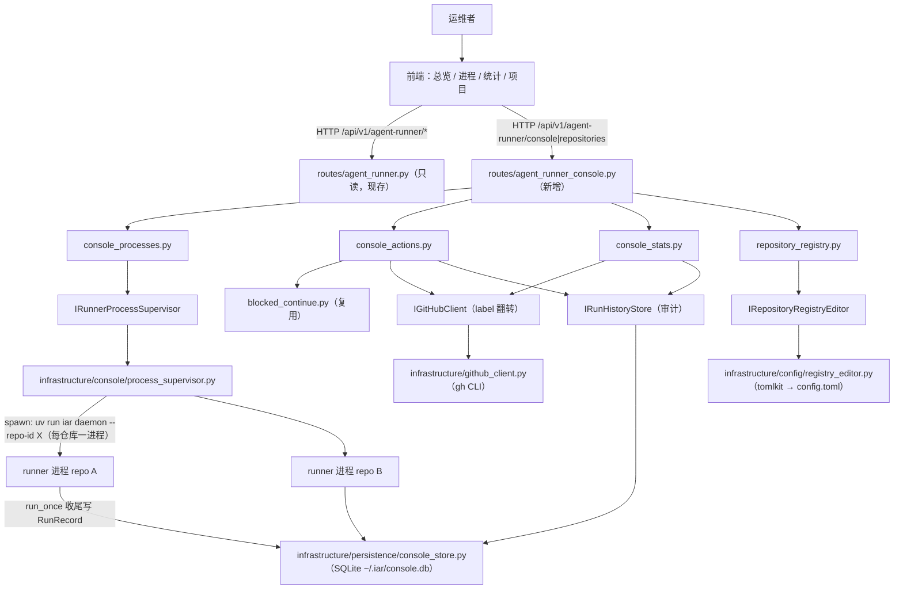
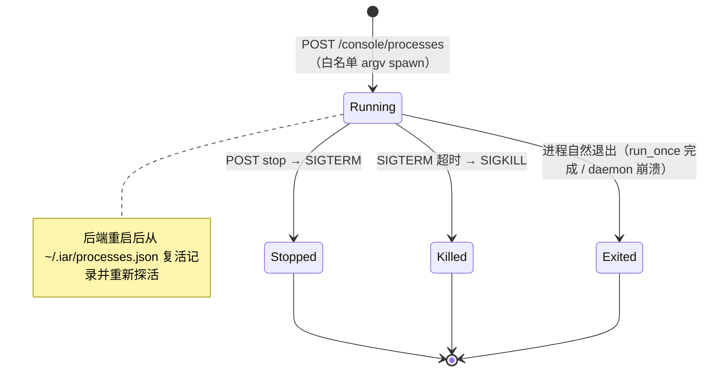
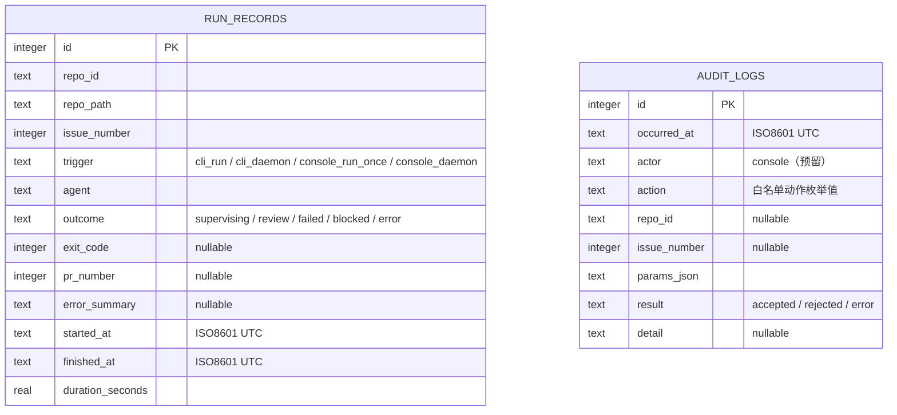

# PRD: Agent Runner 统一管理终端（Unified Operations Console）

- Supersedes: `tasks/archive/20260524-162356-prd-agent-runner-operations-console.md` 中"只读面板、不新增数据库、不做进程管理"的三条约束（用户已于 2026-06-11 明确确认放开）

## 1. Introduction & Goals

### Problem Statement

`iar` 已在多个项目（如 keda 本仓库、TransMaster）中作为 Issue → Agent 队列运行，且已具备多仓库 registry（`config.toml` 的 `[agent_runner.repositories.*]`）、多仓库单轮执行（`run_agent_repositories_once.py`）和只读监控面板（`agent_runner_monitor.py` + Dashboard）。但运维者当前面临三个无法通过现有面板解决的痛点：

1. **只能看不能管**：监控面板是只读的。触发 run/review、重试 failed Issue、继续 blocked Issue、启停 runner 全部要切回终端敲 CLI，多项目场景下成本线性放大。
2. **没有完成度视角**：面板只展示当前 open 队列的 label 分布。每个项目"一共处理了多少 Issue、完成多少、失败多少、最近趋势如何"完全不可见——closed Issue 不进视野，运行结果也不留痕。
3. **单进程串行执行**：`run_agent_daemon.py` 在一个进程内串行轮询所有仓库，一个仓库执行 Issue 时其他仓库只能等待；也没有任何"哪个项目的 runner 正在跑、跑到哪了"的进程可见性。

### Proposed Solution Summary

将现有只读监控面板演进为**统一管理终端**，核心机制：

- **进程托管即并发**：后端新增进程监管端口 `IRunnerProcessSupervisor`（core 定义、infrastructure 用 `subprocess` + JSON pidfile registry 实现），面板按 `(repo_id, kind)` 启停**每仓库独立的** `iar daemon` / `iar review-daemon` 子进程。多项目并发由"一仓库一进程"自然获得，不重写现有串行 daemon 循环。进程 stdout/stderr 重定向到日志文件，面板通过 offset 轮询接口实时查看。
- **可操作面板**：新增 console 写 API——触发 run-once/review-once（一次性托管子进程）、重试 failed Issue（label 翻转 failed→ready，复用 `IGitHubClient.edit_issue_labels`）、继续 blocked Issue（复用 `blocked_continue_issue` use case）。所有写操作落审计日志。UI 上的操作只能映射到**硬编码白名单动作枚举**，后端从枚举构建 argv，永不接受 UI 传入的原始命令字符串。
- **完成度统计双轨**：实时统计从 GitHub 拉取（扩展 `IGitHubClient` 支持按 state=closed/all 列 Issue），计算每仓库完成数/失败数/blocked 数/完成率；历史趋势由**本地 SQLite 文件**（默认 `~/.iar/console.db`，stdlib `sqlite3` + WAL，不走 PostgreSQL/alembic）承载——`run_once` 编排在每个 Issue 处理结束时通过新端口 `IRunHistoryStore` 写入运行记录，CLI 直跑和面板托管跑都会留痕。
- **项目接入面板化**：`config.toml` registry 仍是唯一事实来源；面板通过 `tomlkit`（新依赖，保留注释和格式的 TOML round-trip 编辑）提供添加/启用/停用仓库的写回能力。

配置由用户在 `config.toml` 新增 `[agent_runner.console]` 节声明（DB 路径、进程日志目录、runner 启动命令前缀）；系统只消费显式配置，不做目录扫描自动发现。

刻意避免的复杂度：不引入 PostgreSQL 依赖到 CLI 路径、不新增 WebSocket/SSE（日志用 offset 轮询）、不做跨机器调度、不暴露任意 shell 执行、不改变 GitHub labels/comments 作为 workflow 状态机事实来源的地位。

### Measurable Objectives

- 打开面板即可看到所有注册仓库的：队列状态（现有）、完成度统计（完成/失败/blocked 数与完成率）、运行中的 runner 进程及其实时日志。
- 面板可启停每个仓库的 daemon / review-daemon 进程；两个仓库的 daemon 同时运行时，各自仓库的 Issue 处理互不阻塞。
- 面板可触发 run-once / review-once、重试 failed Issue、继续 blocked Issue；每次操作在审计日志中可查（时间、动作、仓库、Issue、结果）。
- `iar run` 在 CLI 直接执行后，`~/.iar/console.db` 中出现对应运行记录；面板历史趋势页能展示按天聚合的成功/失败曲线。
- 面板可添加新仓库到 registry 并启用/停用，`config.toml` 中 `[agent_runner.repositories.*]` 被正确写回且保留文件注释。
- 后端继续遵守四层依赖方向；console 写 API 只能执行白名单动作。

### Realistic Validation

除单元测试和集成测试外，本 PRD 要求通过**真实项目入口点**验证关键行为，确保真实使用路径生效，而非仅在隔离 fixture 中通过。

- [x] **进程托管真实验证**：启动后端（`uv run uvicorn backend.api.app:app --port 8000`），通过 `curl -X POST .../api/v1/agent-runner/console/processes` 启动一个指向 fixture 仓库的 daemon 进程（`console.runner_command` 指向 fake runner 脚本），验证 `GET /processes` 显示 running、`GET /processes/{id}/logs` 能 offset 续读日志、`POST /processes/{id}/stop` 后进程真实退出（`ps` 验证），并截图/留存 curl 输出。
- [x] **运行历史落库真实验证**：在 fixture 仓库用 fake `gh`/fake agent 通过 `uv run iar run --repo <fixture-repo>` 真实执行一轮，随后 `sqlite3 ~/.iar/console.db "select repo_id, issue_number, outcome from run_records"` 验证记录写入；留存终端输出。
- [x] **可操作面板真实验证**：通过 Playwright（mock console API）验证进程页、统计页、仓库管理页渲染，操作按钮弹确认框、触发后审计列表出现新条目；对 retry-failed 动作另以 curl 打真实后端（fake gh），验证 label 翻转调用与 audit_logs 落库。
- [x] **registry 写回真实验证**：通过 `curl -X POST .../api/v1/agent-runner/repositories` 向临时 config.toml 添加仓库，验证 TOML 写回后注释保留、`resolve_repository_targets` 能解析新仓库；留存写回前后的文件 diff。
- [x] **为什么单元测试不够**：本功能横跨 FastAPI 路由、子进程生命周期（spawn/SIGTERM/pidfile 复活）、SQLite 并发写、tomlkit 文件写回和前端轮询交互；单元测试无法证明真实进程能被启停、真实 CLI 跑完会留痕、真实 TOML 文件不被写坏。

### Delivery Dependencies

- Group: agent-runner-ops-console
- Depends on groups:
  - none
- Depends on tasks/issues:
  - none
- Gate type: none
- Notes: 与 `tasks/pending/P2-FEAT-20260527-162000-agent-runner-unified-entry.md`（`iar ask`）共享"白名单动作 + 审计"理念但无代码耦合，互不阻塞。与 `tasks/pending/P3-CHORE-20260610-110443-remove-legacy-iar-commands.md` 软相关：本 PRD 的进程托管必须使用现代命令名（`iar daemon` / `iar review-daemon` / `iar run` / `iar review`），不得依赖兼容别名。

## 2. Requirement Shape

- **Actor**：在本机同时维护多个接入 `iar` 项目的运维者（单用户、本地信任边界）。
- **Trigger**：
  - 运维者打开管理终端查看所有项目的队列、完成度、运行进程。
  - 运维者需要为某项目启动/停止常驻 runner，或触发一次性 run/review。
  - 某 Issue 进入 failed/blocked，运维者在面板上直接重试/继续。
  - 运维者要接入一个新项目或临时停用某项目。
- **Expected Behavior**：
  - 总览页：按仓库展示队列 + 完成度统计 + 异常（沿用现有 anomaly 机制）。
  - 进程页：列出托管进程（repo、kind、pid、状态、启动时间），可启停、可实时看日志尾部。
  - 统计页：实时口径（GitHub）+ 历史趋势（SQLite，按天聚合成功/失败/耗时）。
  - 项目页：registry 列表、添加仓库（路径校验必须存在且为 git 仓库）、启用/停用开关。
  - 所有写操作需前端二次确认，且写入审计日志并可在面板查看。
- **Explicit Scope Boundary**：
  - 写操作只能是白名单动作枚举：`start_daemon`、`start_review_daemon`、`stop_process`、`run_once`、`review_once`、`retry_failed`、`blocked_continue`、`registry_add`、`registry_set_enabled`。
  - 不暴露任意 shell、任意 label 编辑、PR merge、worktree 删除。
  - 不新增登录/权限体系；信任边界仍是本机部署的后端。
  - GitHub labels/comments/PR 仍是 workflow 状态事实来源；SQLite 只是运行历史与审计的旁路记录，不参与状态机决策。
  - 不做跨机器 runner 调度、不做 WebSocket/SSE 实时推送。

## 3. Repository Context And Architecture Fit

### Current Relevant Modules And Files

| 路径 | 当前职责 | 与本 PRD 的关系 |
|---|---|---|
| `src/backend/api/routes/agent_runner.py` | 只读监控 API（overview / issue detail / timeline） | 保持只读职责不变；新增的写 API 放入新路由文件 |
| `src/backend/api/app.py` | FastAPI 应用工厂 | 注册新 console 路由 |
| `src/backend/api/cli_typer.py` | `iar` Typer CLI（run/daemon/review/recover 等） | 进程托管 spawn 的目标命令；CLI run 路径需接 run history 落库 |
| `src/backend/core/use_cases/agent_runner_monitor.py` | 队列快照、事件时间线、异常检测 | 复用；统计页的实时口径在其旁新增 console_stats 用例 |
| `src/backend/core/use_cases/agent_runner_orchestrate.py` | run_once 编排（claim → 实现 → review → publish） | 在每个 Issue 处理结束处增加可选的 run history 记录回调 |
| `src/backend/core/use_cases/run_agent_daemon.py` | 单进程串行多仓库轮询 | 保留不改；面板并发通过"一仓库一 daemon 进程"实现 |
| `src/backend/core/use_cases/blocked_continue.py` | blocked Issue 继续执行 | `blocked_continue` 面板动作直接复用 `blocked_continue_issue` |
| `src/backend/core/shared/interfaces/agent_runner.py` | `IGitHubClient` / `IProcessRunner` 端口 | `IGitHubClient` 扩展按 state 列 Issue 的能力（实时完成度统计） |
| `src/backend/engines/agent_runner/factory.py` | settings → config、client 装配、`resolve_repository_targets` | 新增 console store / supervisor / registry editor 的装配函数 |
| `src/backend/infrastructure/github_client.py` | GitHub CLI 适配 | 实现 closed/all state Issue 列表查询 |
| `src/backend/infrastructure/persistence/database.py` | SQLAlchemy + PostgreSQL（应用主库，当前无业务表） | **不使用**；console 历史走独立 SQLite（见 Decision Log D-02） |
| `frontend/src/pages/dashboard-page.tsx` | Agent Runner Monitor 总览页 | 扩展统计摘要与 Issue 操作按钮 |
| `frontend/shared/api/{client.ts,agentRunner.ts,types.ts}` | HTTP client 与监控 DTO | 新增 console API wrapper 与 DTO |
| `frontend/src/components/app-sidebar.tsx` | 侧边导航 | 新增 进程/统计/项目 导航项 |
| `config.toml` | `[agent_runner.*]` 配置与 repositories registry | 新增 `[agent_runner.console]` 节；registry 成为面板写回目标 |
| `docs/guides/agent-runner.md` | runner 使用与状态流转文档 | 同步管理终端能力、白名单动作、信任边界说明 |
| `tests/test_agent_runner_api.py` 等 | 现有 API / runner 测试 | fixture 复用为 console 测试的 mock 数据来源 |

### Existing Architecture Pattern To Follow

```text
src/backend/api/ -> src/backend/core/ -> src/backend/engines/ -> src/backend/infrastructure/
```

- 新端口定义在 `core/shared/interfaces/`，core 用例不导入 infrastructure。
- infrastructure 实现只依赖 stdlib/第三方（`subprocess`、`sqlite3`、`tomlkit`）。
- engines/factory 负责装配；api 路由只做 DTO 组装和 use case 调用。
- 前端只经 `/api/v1/agent-runner/*` HTTP API，复用 `frontend/shared/api/client.ts` 与 shadcn 组件。

### Ownership And Dependency Boundaries

- workflow 状态推导仍归 core use cases；面板动作不绕过状态机（retry_failed 即 label 翻转，与手工 CLI 等价）。
- 进程监管只认 pidfile registry 中由本面板启动的进程，不接管用户手工启动的 CLI 进程（但运行历史两者都覆盖，因为落库在 run_once 编排内）。
- `config.toml` 写回只允许触碰 `[agent_runner.repositories.*]` 子树，其他节只读。

### Runtime, Docs, Tests, And Workflow Constraints

- Python 文本 I/O 显式 `encoding="utf-8"`；公共 API 用 Google Style Docstrings；变量命名带语义。
- 单文件非空行 ≤ 1000 行——`agent_runner_monitor.py` 已 919 行，统计逻辑必须放新文件而非追加。
- 全局安装的 `iar` 读不到项目本地 config（见 `~/.claude` 记忆 `uv-tool-config-isolation`）：进程托管 spawn 默认命令为 `["uv", "run", "iar"]` 且 `cwd` = keda 项目根，保证子进程读取正确配置。
- 完成实现后必须 `just test`；前端改动跑 `just frontend build`；docs 改动跑 `uv run mkdocs build --strict`。

### Matching Or Related PRDs

- `tasks/pending/` 检索结果：无重复或前置依赖。`P2-FEAT-20260527-162000-agent-runner-unified-entry.md`（`iar ask`）为理念相关的独立工作；`P3-CHORE-20260610-110443-remove-legacy-iar-commands.md` 为软相关（命令名现代化）。本 PRD 可独立交付。
- `tasks/archive/20260524-162356-prd-agent-runner-operations-console.md`：本 PRD 的直接前置（已完成）。其"只读、无 DB、无进程管理"约束被本 PRD 显式取代；其 anomaly 检测、事件时间线、监控 DTO 全部复用。
- `tasks/archive/20260521-104408-prd-multi-repository-agent-runner.md`：registry 与 `resolve_repository_targets` 的来源，本 PRD 复用其选择器语义。

## 4. Recommendation

### Recommended Approach

最小可行的统一管理终端 = 四个正交切片，全部挂在现有路径上：

1. **进程托管**（并发的来源）：`IRunnerProcessSupervisor` 端口 + subprocess/pidfile 实现 + console_processes 用例 + 进程 API + 前端进程页。每仓库一个 daemon 子进程即天然并发，`run_agent_daemon.py` 一行不改。
2. **操作动作**：console_actions 用例把白名单动作映射到现有 use case（`edit_issue_labels`、`blocked_continue_issue`、一次性子进程），每次动作写审计。
3. **完成度统计**：`IGitHubClient` 扩展 closed/all state 查询（实时口径）+ `IRunHistoryStore` SQLite 落库（历史趋势），`run_once` 编排尾部记录每个 Issue 的结果。
4. **registry 面板化**：tomlkit 写回 `[agent_runner.repositories.*]`，添加前校验路径存在且为 git 仓库。

### Why This Fits

- 复用全部既有监控基建（anomaly、timeline、多仓库 resolve、前端组件），新增面积集中在四个新文件簇，不动 workflow 状态机。
- "一仓库一进程"复用 `iar daemon` 既有语义获得并发，避免在 daemon 内部引入线程池/asyncio 并发改造（那会触碰 worktree、GitHub client 的并发安全假设）。
- SQLite 旁路记录让 CLI 与面板共享同一份历史，且不给日常 CLI 使用增加 Postgres 依赖。
- registry 写回保持 config.toml 单一事实来源，面板只是它的编辑器。

### Rationale For Rejecting Alternative Approaches

| 方案 | 拒绝原因 |
|---|---|
| daemon 内部线程池并发（单进程多线程跑多仓库） | worktree 操作、GitHub CLI 调用、日志输出均无并发安全设计；改造面大且崩一个全崩；进程隔离更稳 |
| 复用 PostgreSQL + alembic 落历史 | CLI 直跑也要写记录，强制日常 `iar` 依赖 Postgres 常驻，运维成本不成比例（用户已确认选 SQLite） |
| WebSocket/SSE 实时日志 | offset 轮询 2–3s 已满足运维观察需求，省去连接管理与测试复杂度 |
| 自动扫描目录发现项目 | 隐式接入不可控且有误纳风险；registry 显式声明 + 面板编辑已覆盖需求（用户已确认） |
| 面板直接 import use case 在后端进程内跑 runner | runner 一跑几十分钟，会占死 API 进程；子进程隔离 + 日志文件是既有 CLI 形态的自然延伸 |

## 5. Implementation Guide

> This section is a living implementation guide based on current repository analysis. If implementation discovers additional affected files, hidden dependencies, edge cases, or a better path, update this PRD before proceeding.

### Implementation Notes（2026-06-11 实施时的偏差与补充）

实现已完成并验证。以下为相对原计划的偏差与重要补充：

1. **三个范围外前置阻塞被一并修复**（不修复则面板根本不可用）：
   - vite proxy 与 nginx 均剥掉 `/api` 前缀而后端路由注册在 `/api/v1`，前后端从未真正连通——两处代理改为原样透传（`frontend/vite.config.ts`、`frontend/nginx.conf`）。
   - 前端模板遗留的登录墙调用不存在的 `/auth/me`——新增 `src/backend/api/routes/local_auth.py` 返回固定本地 operator 会话（本机单用户信任边界）。
   - registry 中失效路径（TransMaster 已不存在）使 overview 直接 500——新增 `resolve_repository_targets_with_diagnostics`，单仓库解析失败降级为 `unreachable_repositories` 警示而非拖死面板。
2. **infrastructure 实现为鸭子类型**：仓库架构检查禁止 `infrastructure -> core` import（与 `github_client.py` 同模式），三个实现（`console_store.py`、`process_supervisor.py`、`registry_editor.py`）自带与 core 端口同构的 dataclass，不继承 ABC。
3. **`RunnerProcessKind` 增加 `blocked_continue`**：blocked_continue 动作会运行 agent（耗时分钟级），必须进程隔离，实现为一次性托管子进程 `iar blocked-continue --issue N --repo-id X`。
4. **trigger 实际取值**：`cli_run` / `cli_daemon` / `console_run` / `console_daemon`。托管子进程通过 `IAR_CONSOLE=1` 环境标记被 CLI 识别为 console 触发。
5. **`run_records` 不含 `pr_number` 列**：收尾处补查 PR 需要额外 GitHub 调用，性价比不足；`outcome` 枚举为 completed / failed / blocked。
6. **settings 即时刷新**：进程级 `config` 单例不会感知 registry 写回，监控与 console 读路径改用 `load_fresh_agent_runner_settings()` 每次重读 config.toml，registry 增删启停即时生效、无需重启后端。
7. **僵尸进程探活**：子进程退出后在父进程存活期间是僵尸态，`os.kill(pid, 0)` 误判存活；supervisor 持有模块级 Popen 句柄并用 `poll()` 探活兼 reap，非子进程（后端重启复活场景）回退 `os.kill` 探测。
8. **验证证据**留存于 `logs/agent-runner/console-validation-20260611/`（curl 输出、SQLite 查询、config.toml diff、双仓库并发日志）。

### Core Logic

#### 进程托管与并发

1. 新端口（`core/shared/interfaces/runner_console.py`）：

```python
class RunnerProcessKind(StrEnum):
    DAEMON = "daemon"
    REVIEW_DAEMON = "review_daemon"
    RUN_ONCE = "run_once"
    REVIEW_ONCE = "review_once"

@dataclass(frozen=True)
class RunnerProcessRecord:
    process_id: str          # uuid
    repo_id: str
    kind: RunnerProcessKind
    pid: int
    status: str              # running / exited / stopped
    exit_code: int | None
    log_path: str
    started_at: str
    stopped_at: str | None

class IRunnerProcessSupervisor(ABC):
    def spawn(self, *, repo_id, kind, argv, cwd, log_path) -> RunnerProcessRecord: ...
    def list_processes(self) -> list[RunnerProcessRecord]: ...
    def stop(self, process_id: str, *, timeout_seconds: int) -> RunnerProcessRecord: ...
    def read_log(self, process_id: str, *, offset: int, max_bytes: int) -> LogChunk: ...
```

2. core 用例 `console_processes.py`：
   - `start_runner_process(repo_id, kind)`：校验 repo_id 在 registry 且 enabled；常驻类 kind（daemon/review_daemon）同 `(repo_id, kind)` 已有 running 进程则拒绝；**从枚举构建 argv**——`daemon` → `runner_command + ["daemon", "--repo-id", repo_id]`，`run_once` → `runner_command + ["run", "--repo-id", repo_id]`，以此类推；`cwd` = keda 项目根；日志路径 `logs/agent-runner/processes/<repo_id>/<kind>-<process_id>.log`。
   - `stop_runner_process(process_id)`：SIGTERM → 等待 `timeout_seconds`（默认 30）→ SIGKILL。
   - `tail_runner_log(process_id, offset)`：返回 `{content, next_offset, eof}`，供前端轮询。
3. infrastructure `console/process_supervisor.py`：
   - `subprocess.Popen(argv, cwd=..., stdout=log_file, stderr=subprocess.STDOUT, start_new_session=True)`——脱离后端进程组，后端重启不杀 runner。
   - registry 持久化为 JSON 文件（默认 `~/.iar/processes.json`，`encoding="utf-8"`，写入用临时文件 + `os.replace` 原子替换）。
   - 状态探测：`os.kill(pid, 0)` + 启动时间比对防 pid 复用误判（记录 `started_at`，探测时容忍 ProcessLookupError → exited）。
   - 后端重启后 `list_processes()` 从 pidfile 复活记录并重新探测存活。

#### 操作动作与审计

1. core 用例 `console_actions.py`，入口 `execute_console_action(action, repo_id, issue_number, ...)`：
   - `retry_failed`：校验 Issue 当前含 failed label → `IGitHubClient.edit_issue_labels(issue_number, add=[ready], remove=[failed])`。
   - `blocked_continue`：复用 `blocked_continue_issue(...)`（语义与 `iar blocked-continue` CLI 一致）。
   - `run_once` / `review_once`：委托 `console_processes.start_runner_process` 起一次性子进程（结束后状态变 exited，exit_code 可见）。
   - 任何动作（含失败的动作）调用 `IRunHistoryStore.append_audit(...)` 落审计。
2. 审计字段：`occurred_at`、`actor`（固定 `console`，预留字段）、`action`、`repo_id`、`issue_number`、`params_json`、`result`（accepted/rejected/error）、`detail`。

#### 完成度统计（双轨）

1. 实时口径——`IGitHubClient` 新增端口方法（先加接口再实现）：

```python
def list_issues_by_label(self, label, *, state="open", limit=...) -> list[IssueSummary]:
    """扩展现有方法签名增加 state 参数（open/closed/all），保持默认值兼容现有调用方。"""
```

   `GitHubCliClient` 实现追加 `--state` 参数。core 用例 `console_stats.py` 的 `build_completion_stats(repo_context, github_client)`：
   - 对每个 workflow label 统计 open 数（复用现有队列查询）。
   - closed + 含任一 workflow label 的 Issue 计为已处理：closed 且不含 failed/blocked label → `completed`；closed 且含 failed → `failed_closed`。
   - `completion_rate = completed / (completed + open_total + failed + blocked)`，分母为 0 时报 `null`。
2. 历史口径——`IRunHistoryStore` 端口 + infrastructure `persistence/console_store.py`（stdlib `sqlite3`）：
   - 连接参数：`PRAGMA journal_mode=WAL`、`PRAGMA busy_timeout=5000`；建表用 `CREATE TABLE IF NOT EXISTS` + `PRAGMA user_version` 版本号迁移（不走 alembic，理由见 D-02）。
   - DB 路径来自 `[agent_runner.console] history_db_path`，默认 `~/.iar/console.db`，`Path.expanduser()` 解析。
   - 落库点：`agent_runner_orchestrate.run_once` 在每个 Issue 处理收尾处（成功进入 supervising/review、failed、blocked 的分支汇合点）调用可选参数 `run_history_store.append_run(...)`；参数为 None 时零行为变化。定位锚点：`rg -n "def run_once" src/backend/core/use_cases/agent_runner_orchestrate.py` 及其中 failed/blocked label 写入调用处。
   - `engines/agent_runner/factory.py` 新增 `create_console_store()`，并在 CLI `run`/`daemon` 命令装配路径注入，使 CLI 直跑同样留痕。
3. 趋势聚合：`console_stats.build_run_history_trend(repo_id, days)` 在 SQL 内按天 group by（`date(started_at)`），返回每日 completed/failed/blocked 计数与平均耗时。

#### Registry 面板化

1. 端口 `IRepositoryRegistryEditor`（core 定义）：`add_repository(repo_id, path, display_name)`、`set_enabled(repo_id, enabled)`、`list_repositories()`。
2. infrastructure `config/registry_editor.py` 用 `tomlkit` 读改写 `config.toml`：只触碰 `agent_runner.repositories.<repo_id>` 子树；写入同样临时文件 + `os.replace`。
3. core 用例 `repository_registry.py` 校验：repo_id 满足 `^[a-z0-9][a-z0-9-]*$`；路径 `Path(path).expanduser().resolve()` 必须存在且含 `.git`；repo_id 不得与现有冲突。
4. 写回后 API 即时重新 `resolve_repository_targets` 验证可解析，失败则回滚文件并报错。

#### API 路由（新文件 `api/routes/agent_runner_console.py`，前缀 `/api/v1/agent-runner`）

| Method | Path | 行为 |
|---|---|---|
| GET | `/console/processes` | 托管进程列表 |
| POST | `/console/processes` | body `{repo_id, kind}`，启动常驻进程 |
| POST | `/console/processes/{process_id}/stop` | 停止进程 |
| GET | `/console/processes/{process_id}/logs?offset=0` | offset 续读日志 |
| POST | `/console/repositories/{repo_id}/actions` | body `{action: run_once\|review_once}` |
| POST | `/console/repositories/{repo_id}/issues/{issue_number}/actions` | body `{action: retry_failed\|blocked_continue}` |
| GET | `/console/stats/overview` | 各仓库实时完成度 |
| GET | `/console/stats/history?repo_id=&days=30` | SQLite 趋势 |
| GET | `/console/audit?limit=100` | 审计日志倒序 |
| GET | `/repositories` | registry 列表（含 enabled 状态） |
| POST | `/repositories` | body `{repo_id, path, display_name}` 添加并校验 |
| PATCH | `/repositories/{repo_id}` | body `{enabled: bool}` |

#### 前端

- 侧边导航四项：总览（现有 dashboard 扩展）、进程、统计、项目。
- 总览页：每仓库卡片增加完成度摘要条（完成率、failed/blocked 计数）；Issue 详情区为 failed/blocked Issue 增加"重试 / 继续"按钮（确认对话框 → POST action → 刷新）。
- 进程页 `processes-page.tsx`：进程表格 + 启动表单（仓库下拉 × kind 下拉）+ 日志抽屉（2.5s 间隔 offset 轮询，仅在抽屉打开时轮询）。
- 统计页 `stats-page.tsx`：实时统计表 + 按天趋势图（用现有图表依赖；若无图表库则用简单 CSS 柱状，不新增重型依赖）。
- 项目页 `repositories-page.tsx`：registry 表格、添加表单、启停开关。
- `frontend/shared/api/console.ts` + `types.ts` 增加 DTO；全部复用 `client.ts`。

### Change Impact Tree

```text
.
├── config.toml
│       [修改]
│       【总结】新增 [agent_runner.console] 节：history_db_path、process_log_dir、process_registry_path、runner_command、stop_timeout_seconds
│
├── pyproject.toml
│       [修改]
│       【总结】新增运行时依赖 tomlkit（TOML round-trip 写回）
│
├── Infrastructure
│   ├── src/backend/infrastructure/console/process_supervisor.py
│   │       [新增]
│   │       【总结】subprocess + JSON pidfile 的进程监管实现：spawn(start_new_session)/探活/SIGTERM 停止/offset 读日志/重启复活
│   ├── src/backend/infrastructure/persistence/console_store.py
│   │       [新增]
│   │       【总结】stdlib sqlite3 实现 IRunHistoryStore：WAL + busy_timeout，user_version 迁移，run_records 与 audit_logs 读写
│   ├── src/backend/infrastructure/config/registry_editor.py
│   │       [新增]
│   │       【总结】tomlkit 实现 IRepositoryRegistryEditor：只写 agent_runner.repositories 子树，原子替换，保留注释
│   └── src/backend/infrastructure/github_client.py
│           [修改]
│           【总结】list_issues_by_label 增加 state 参数（open/closed/all），透传 gh --state
│
├── Domain (core)
│   ├── src/backend/core/shared/interfaces/runner_console.py
│   │       [新增]
│   │       【总结】console 三端口与模型：IRunnerProcessSupervisor / IRunHistoryStore / IRepositoryRegistryEditor、RunnerProcessKind/Record、RunRecord、AuditEntry、CompletionStats
│   ├── src/backend/core/shared/interfaces/agent_runner.py
│   │       [修改]
│   │       【总结】IGitHubClient.list_issues_by_label 签名增加 state 参数（默认 "open" 保持兼容）
│   ├── src/backend/core/use_cases/console_processes.py
│   │       [新增]
│   │       【总结】启停/列表/日志尾读用例：白名单 argv 构建、同 (repo,kind) 常驻去重、repo enabled 校验
│   ├── src/backend/core/use_cases/console_actions.py
│   │       [新增]
│   │       【总结】白名单动作分发：retry_failed 翻转 label、blocked_continue 复用既有用例、run/review_once 委托进程用例，全动作审计
│   ├── src/backend/core/use_cases/console_stats.py
│   │       [新增]
│   │       【总结】实时完成度（GitHub closed/all 查询聚合）与历史趋势（按天 group by run_records）
│   ├── src/backend/core/use_cases/repository_registry.py
│   │       [新增]
│   │       【总结】registry 添加/启停的校验与编排：repo_id 格式、路径存在且为 git 仓库、写回后可解析验证
│   └── src/backend/core/use_cases/agent_runner_orchestrate.py
│           [修改]
│           【总结】run_once 增加可选 run_history_store 参数，在每个 Issue 收尾分支写 RunRecord（None 时零变化）
│
├── Engines
│   └── src/backend/engines/agent_runner/factory.py
│           [修改]
│           【总结】新增 create_console_store/create_process_supervisor/create_registry_editor 装配；CLI run/daemon 路径注入 history store
│
├── API
│   ├── src/backend/api/routes/agent_runner_console.py
│   │       [新增]
│   │       【总结】console 全部读写端点（进程/动作/统计/审计/registry），薄路由只做 DTO 与 use case 调用
│   ├── src/backend/api/app.py
│   │       [修改]
│   │       【总结】include 新 console 路由
│   └── src/backend/api/cli_typer.py
│           [修改]
│           【总结】run/daemon 命令装配处接入 create_console_store（CLI 直跑留痕）
│
├── Frontend
│   ├── frontend/shared/api/console.ts            [新增]【总结】console API wrapper（进程/动作/统计/审计/registry）
│   ├── frontend/shared/api/types.ts              [修改]【总结】新增 console DTO 类型
│   ├── frontend/src/pages/dashboard-page.tsx     [修改]【总结】仓库卡片加完成度摘要；failed/blocked Issue 加重试/继续按钮
│   ├── frontend/src/pages/processes-page.tsx     [新增]【总结】进程表格、启动表单、日志轮询抽屉
│   ├── frontend/src/pages/stats-page.tsx         [新增]【总结】实时完成度表 + 按天趋势
│   ├── frontend/src/pages/repositories-page.tsx  [新增]【总结】registry 管理（列表/添加/启停）
│   └── frontend/src/components/app-sidebar.tsx   [修改]【总结】导航增加 进程/统计/项目
│
├── Tests
│   ├── tests/test_console_processes.py           [新增]【总结】白名单 argv、去重、停止超时升级 SIGKILL、pidfile 复活（fake supervisor + 真实 subprocess 双层）
│   ├── tests/test_console_store.py               [新增]【总结】SQLite 落库/审计/趋势聚合/并发写（tmp_path db）
│   ├── tests/test_console_actions.py             [新增]【总结】retry_failed label 翻转、blocked_continue 委托、未知动作拒绝、审计落库
│   ├── tests/test_repository_registry.py         [新增]【总结】tomlkit 写回保注释、非法 repo_id/路径拒绝、回滚
│   ├── tests/test_agent_runner_console_api.py    [新增]【总结】console 路由 DTO 与错误码（mock 端口）
│   └── tests/playwright-e2e/                     [修改]【总结】进程/统计/项目页 smoke（mock console API）
│
└── Docs
    ├── docs/guides/agent-runner.md               [修改]【总结】管理终端章节：能力、白名单动作、信任边界、SQLite 路径、进程托管语义
    └── mkdocs.yml                                 [检查]【总结】仅更新现有页则无导航变更
```

文件清单是实现起点而非穷尽保证，隐藏引用见 Executor Drift Guard。

### Executor Drift Guard

实现前先跑以下搜索确认锚点与隐藏引用（仓库可能已漂移）：

```bash
# run_once 编排收尾点与 failed/blocked 写 label 处
rg -n "def run_once" src/backend/core/use_cases/agent_runner_orchestrate.py
rg -n "labels.failed|labels.blocked" src/backend/core/use_cases/agent_runner_orchestrate.py src/backend/core/use_cases/agent_runner_workflow.py

# list_issues_by_label 全部调用方（改签名需同步）
rg -n "list_issues_by_label" src/ tests/

# 现有 console/monitor DTO 序列化方式（新路由沿用）
rg -n "_serialize_monitoring" src/backend/api/routes/agent_runner.py

# CLI run/daemon 装配点（注入 history store）
rg -n "_run_runner_once_command|_run_daemon_command" src/backend/api/cli_typer.py

# 前端路由/导航注册方式
rg -n "dashboard-page|Route|createBrowserRouter" frontend/src --type ts --type tsx -g '!node_modules'

# registry 解析入口（写回后验证用）
rg -n "def resolve_repository_targets" src/backend/engines/agent_runner/factory.py
```

- `agent_runner_monitor.py` 已 919 行，禁止向其追加统计逻辑（lint 1000 行警戒线）。
- `edit_issue_labels` 的参数形态以 `rg -n "def edit_issue_labels" src/backend/core/shared/interfaces/agent_runner.py` 实际签名为准。
- 触发 Playwright 时先确认 `tests/playwright-e2e/` 包的启动命令（独立 npm 包，不套用 Python 规范）。

### Flow / Architecture Diagram



### State And Action Flow（进程生命周期）



### Realistic Validation Plan

| Behavior | Real Entry Point | Test Layer | Mock Boundary | Data/Env Needed | Command Or Procedure | Required For Acceptance |
|---|---|---|---|---|---|---|
| 进程启停 + 日志续读 | 运行中后端的 `POST /api/v1/agent-runner/console/processes` 等 | manual/sandbox（curl 对真实 uvicorn） | `console.runner_command` 指向 fake runner 脚本（持续 echo）；其余真实 | 临时 config.toml + fixture 仓库 | `uv run uvicorn backend.api.app:app --port 8000` 后依次 curl POST/GET/stop，`ps -p <pid>` 验证退出 | Yes |
| CLI 直跑落运行记录 | `uv run iar run --repo <fixture-repo>` | integration（真实 CLI 子进程） | PATH 注入 fake `gh` 与 fake agent；SQLite 真实 | fixture git 仓库、tmp HOME 或 `history_db_path` 指向 tmp | 跑完后 `sqlite3 <db> "select repo_id, issue_number, outcome from run_records;"` | Yes |
| retry_failed 动作 + 审计 | `POST .../issues/{n}/actions`（真实后端） | integration/API test | mock `IGitHubClient`（断言 edit_issue_labels 调用）；store 真实 SQLite | fake failed Issue fixture | `uv run pytest tests/test_agent_runner_console_api.py tests/test_console_actions.py -q` + curl 实测 | Yes |
| registry 写回 | `POST /api/v1/agent-runner/repositories`（真实后端） | manual + integration | 无 mock；写临时 config.toml | tmp config + tmp git 仓库 | curl 后 `diff` 前后文件，确认注释保留；`uv run pytest tests/test_repository_registry.py -q` | Yes |
| 双仓库并发执行 | 面板启动两个 daemon 进程 | manual/sandbox | fake runner 脚本各自 sleep+写日志 | 两个 fixture 仓库注册 | 同时启动，观察两份日志时间戳交错（非串行等待） | Yes |
| 实时完成度统计 | `GET /console/stats/overview` | API test | mock `IGitHubClient.list_issues_by_label(state=...)` | open/closed 混合 Issue fixture | `uv run pytest tests/test_console_stats.py -q`（文件名以实际为准） | Yes |
| 前端四页渲染与操作交互 | Playwright 真实路由 | e2e smoke | Playwright route 拦截 console API | mock JSON fixtures | `just frontend build`；按 `tests/playwright-e2e/` README 跑 smoke | Yes |
| 文档与无回归 | MkDocs / 全量测试 | build/test | 无 | 无 | `uv run mkdocs build --strict` && `just test` | Yes |

失败排查提示：进程托管验证失败先查 `console.runner_command` 与 `cwd` 是否为 keda 项目根（全局 `iar` 读不到本地 config）；SQLite 验证失败先查 `history_db_path` expanduser 解析与 WAL 文件权限；registry 写回失败先查 tomlkit 版本与 `os.replace` 跨设备问题（tmp 文件须与 config.toml 同目录）。

### Low-Fidelity Prototype

```text
┌──────────────────────────────────────────────────────────────────────────────┐
│ ☰ 总览 | 进程 | 统计 | 项目                     Agent Runner 管理终端          │
├──────────────────────────────────────────────────────────────────────────────┤
│ [总览]  keda-main      完成率 78% (45✓ 8✗ 3⛔)  队列: ready 2 running 1 ...    │
│         transmaster    完成率 62% (21✓ 9✗ 4⛔)  队列: ready 0 failed 2 ⚠️1     │
│         Issue #19 agent/failed   [重试 ▷]   Issue #23 agent/blocked [继续 ▷]  │
├──────────────────────────────────────────────────────────────────────────────┤
│ [进程]  仓库▾ keda-main   类型▾ daemon   [启动]                                │
│  ┌──────────┬──────────────┬───────┬─────────┬──────────┬────────┐           │
│  │ keda-main│ daemon       │ 41233 │ running │ 10:21:05 │ [停止] │ [日志]    │
│  │ transmas.│ review_daemon│ 41410 │ running │ 10:22:13 │ [停止] │ [日志]    │
│  │ keda-main│ run_once     │   —   │ exited 0│ 09:55:02 │        │ [日志]    │
│  └──────────┴──────────────┴───────┴─────────┴──────────┴────────┘           │
│  日志抽屉（2.5s 轮询）: [10:21:07] Daemon pass for repository 'keda-main'...  │
├──────────────────────────────────────────────────────────────────────────────┤
│ [统计]  范围▾ 30天   keda-main ▾                                              │
│   06-01 ▇▇▇▇▇ 5✓ 1✗    06-02 ▇▇▇ 3✓ 0✗    ...    平均耗时 14m            │
├──────────────────────────────────────────────────────────────────────────────┤
│ [项目]  repo_id      路径                         enabled                     │
│         keda-main    /Users/zata/code/keda        [✓]                        │
│         transmaster  /Users/zata/code/TransMaster [✓]                        │
│         + 添加仓库: repo_id [____] path [____] display [____]  [校验并添加]   │
├──────────────────────────────────────────────────────────────────────────────┤
│ 审计: 10:30 console retry_failed keda-main#19 accepted │ 10:21 start daemon… │
└──────────────────────────────────────────────────────────────────────────────┘
```

UI notes：所有写操作弹确认框；保持运维密度风格；操作失败用红色 toast 并指向审计详情。

### ER Diagram



两表无外键关系（审计与运行记录独立旁路）；SQLite `PRAGMA user_version` 从 1 起步。托管进程注册表为 JSON 文件而非 DB 表（进程状态是易失运行时状态，pidfile 形态便于崩溃恢复探活）。

### Interactive Prototype Change Log

No interactive prototype file changes in this PRD.

### External Validation

No external validation required; repository evidence was sufficient.（tomlkit 为成熟标准库级第三方包，round-trip 保格式是其核心特性，无需外部调研。）

## 6. Definition Of Done

- 四个切片（进程托管、操作动作、双轨统计、registry 面板化）全部实现且通过 Section 5 验证计划中所有 Required=Yes 行。
- Realistic Validation 清单逐项执行并留存证据（curl 输出、sqlite3 查询、文件 diff、Playwright 截图）。
- `docs/guides/agent-runner.md` 同步管理终端章节；`mkdocs.yml` 检查完成。
- `just test`、`just frontend build`、`uv run mkdocs build --strict` 全部通过；现有监控只读 API 与 CLI 行为无回归。
- 四层依赖方向无违例：core 不导入 infrastructure；新写 API 仅白名单动作。

## 7. Acceptance Checklist

### Architecture Acceptance

- [x] 新端口全部位于 `src/backend/core/shared/interfaces/runner_console.py`，core 用例不导入 `backend.infrastructure`（`rg -n "backend.infrastructure" src/backend/core/` 无新增命中）。
- [x] `src/backend/api/routes/agent_runner.py` 保持只读；写端点全部在 `src/backend/api/routes/agent_runner_console.py`。
- [x] 进程 spawn 的 argv 由 `RunnerProcessKind` 枚举硬编码构建；`rg -n "shell=True" src/backend/` 无命中；API 不接受原始命令字符串。
- [x] 运行历史与审计使用独立 SQLite（`console_store.py`），未触碰 `infrastructure/persistence/database.py` 的 PostgreSQL 引擎，未新增 alembic 迁移。
- [x] `agent_runner_monitor.py` 未追加统计逻辑（行数不超过现有规模），统计在 `console_stats.py`。

### Behavior Acceptance

- [x] `POST /console/processes` 对已存在 running 的同 `(repo_id, kind)` 常驻进程返回 409 类错误。
- [x] `POST /console/processes/{id}/stop`：SIGTERM 后未退出则在 `stop_timeout_seconds` 后 SIGKILL，记录最终状态。
- [x] 后端重启后 `GET /console/processes` 仍能列出此前启动且存活的进程（pidfile 复活 + 探活）。
- [x] `retry_failed` 仅当 Issue 含 failed label 时执行 label 翻转（failed→ready），否则 rejected 并审计。
- [x] `blocked_continue` 动作调用与 `iar blocked-continue` 相同的 `blocked_continue_issue` 用例。
- [x] `uv run iar run --repo <fixture>` 真实执行后 `run_records` 出现对应行（trigger=cli_run）。
- [x] 所有 console 写操作（含被拒绝的）在 `audit_logs` 留痕，`GET /console/audit` 可查。
- [x] `GET /console/stats/overview` 的 completed 口径 = closed 且不含 failed/blocked label 的 workflow Issue。
- [x] registry 添加：非法 repo_id、不存在路径、非 git 目录均被拒绝；成功写回后 config.toml 原有注释保留。
- [x] 两个 fixture 仓库的 daemon 进程同时运行时日志时间戳交错（非串行）。

### Documentation Acceptance

- [x] `docs/guides/agent-runner.md` 新增管理终端章节：四页能力、白名单动作清单、本地信任边界声明、SQLite 路径与含义、"进程托管的 runner 与手工 CLI 等价且共享运行历史"。
- [x] 文档说明不支持任意 shell / 任意 label 编辑 / PR merge 的原因。
- [x] `config.toml` 内 `[agent_runner.console]` 各键有注释说明。

### Validation Acceptance

- [x] 真实入口验证 1：对运行中 uvicorn 后端完成进程 启动→看日志→停止 全链路 curl 操作并留存输出（Section 5 表第 1 行）。
- [x] 真实入口验证 2：CLI 直跑落库的 sqlite3 查询输出留存（Section 5 表第 2 行）。
- [x] 真实入口验证 3：registry 写回的文件 diff 留存（Section 5 表第 4 行）。
- [x] `uv run pytest tests/test_console_processes.py tests/test_console_store.py tests/test_console_actions.py tests/test_repository_registry.py tests/test_agent_runner_console_api.py -q` 通过（文件名以实际创建为准）。
- [x] Playwright smoke 覆盖进程/统计/项目页渲染与确认框交互（mock API）。
- [x] `just test`、`just frontend build`、`uv run mkdocs build --strict` 通过。

## 8. Functional Requirements

- **FR-1**：系统必须提供托管进程 API：按 `(repo_id, kind)` 启动、停止、列表、offset 续读日志；kind 限于 daemon / review_daemon / run_once / review_once。
- **FR-2**：常驻 kind 的同 `(repo_id, kind)` 同时只允许一个 running 进程。
- **FR-3**：托管进程必须以 `start_new_session` 脱离后端进程组，并通过 JSON pidfile registry 在后端重启后可复活探活。
- **FR-4**：进程 spawn 命令必须由白名单枚举构建，`cwd` 为 keda 项目根，命令前缀来自 `console.runner_command`（默认 `["uv", "run", "iar"]`）。
- **FR-5**：系统必须提供 Issue 动作 API：retry_failed（label 翻转）与 blocked_continue（复用既有用例）；未知动作必须拒绝。
- **FR-6**：所有 console 写操作（含拒绝与失败）必须写入审计日志并可通过 API 查询。
- **FR-7**：`run_once` 编排必须支持可选 run history 记录，CLI 与面板托管执行共用同一 SQLite 落库路径。
- **FR-8**：系统必须提供实时完成度统计 API（GitHub closed/all 查询）与历史趋势 API（SQLite 按天聚合）。
- **FR-9**：`IGitHubClient.list_issues_by_label` 必须支持 state 参数且默认值保持现有调用方行为不变。
- **FR-10**：系统必须提供 registry 管理 API：列表、添加（带校验）、启停；写回必须保留 config.toml 注释并原子替换。
- **FR-11**：前端必须提供总览（含完成度与 Issue 操作）、进程（含日志轮询）、统计、项目四个页面，写操作需确认框。
- **FR-12**：面板不得暴露任意 shell 执行、任意 label 编辑、PR merge 或 worktree 删除能力。

## 9. Non-Goals

- 不做跨机器 runner 调度或远程 agent 池。
- 不引入 WebSocket / SSE；日志与状态均为轮询。
- 不把 SQLite 历史用于 workflow 状态机决策（GitHub 仍是唯一事实来源）。
- 不新增登录/多用户权限体系（audit.actor 字段仅预留）。
- 不接管用户手工启动的 CLI 进程的生命周期（只记录其运行历史）。
- 不做 PostgreSQL/alembic 迁移；不做自动目录扫描发现项目。
- 不在本 PRD 内重构 `run_agent_daemon.py` 的串行语义（CLI `iar daemon --all` 行为不变）。

## 10. Risks And Follow-Ups

- **pid 复用误判**：长时间运行后 OS 复用 pid 可能令探活误报 running。已通过记录 started_at 并容忍 ProcessLookupError 缓解；若实测仍误判，follow-up 为在 pidfile 中加 `proc 启动时间` 比对（macOS `ps -o lstart=`）。
- **SQLite 并发写**：多 daemon 进程同时收尾写库依赖 WAL + busy_timeout；极端争用下单条记录可能等待 5s。可接受（旁路记录），不阻塞 runner 主流程——落库异常必须 catch 并降级为日志警告。
- **GitHub closed 查询配额**：仓库 closed Issue 很多时统计查询变慢。首版按 limit 上限（如 200）截断并在响应中标注 `truncated: true`；趋势页主要依赖 SQLite，不受影响。
- **config.toml 并发写**：面板写回与人工编辑同时发生可能相互覆盖。原子替换保证文件完整性；写前读取-比对-写回窗口的竞争视为本地单用户可接受风险。

## 11. Decision Log

| ID | 决策问题 | Chosen | Rejected | Rationale |
|---|---|---|---|---|
| D-01 | 多项目并发的实现机制 | 一仓库一 `iar daemon` 托管子进程 | daemon 内部线程池并发 | worktree/gh CLI 无并发安全设计，进程隔离崩溃域最小且复用既有 CLI 语义 |
| D-02 | 运行历史与审计的存储 | 独立 SQLite 文件（stdlib sqlite3 + user_version 迁移，默认 `~/.iar/console.db`） | 复用 PostgreSQL + alembic | CLI 直跑也要留痕，不能让日常 `iar` 依赖 Postgres 常驻（用户 2026-06-11 确认） |
| D-03 | 面板操作权限边界 | 硬编码白名单动作枚举，后端构建 argv | 通用操作 API / 任意命令执行 | 复用 `iar ask` PRD 同款"白名单+审计"原则，防注入且审计可枚举 |
| D-04 | 实时日志传输 | offset 轮询（2.5s） | WebSocket/SSE 推送 | 运维观察延迟容忍秒级，轮询省去连接管理与测试复杂度 |
| D-05 | 项目接入方式 | config.toml registry + tomlkit 面板写回 | 目录自动扫描发现 | 显式声明可控、registry 保持单一事实来源（用户 2026-06-11 确认） |
| D-06 | 进程注册表形态 | JSON pidfile（`~/.iar/processes.json`） | SQLite 表 | 进程状态是易失运行时状态，pidfile + 探活是崩溃恢复的最简形态 |
| D-07 | 子进程启动命令 | `["uv", "run", "iar"]` + cwd=keda 根（可配置） | 直接调全局 `iar` | 全局 uv tool 安装的 `iar` 读不到项目本地 config.toml（已知环境约束） |
| D-08 | 与上一版只读 PRD 的关系 | 显式取代其只读/无DB/无进程三约束 | 另起独立小 PRD 仅加统计 | 用户确认目标是完整管理终端；拆散会留下临时形态 |
| D-09 | infra 端口实现方式 | 鸭子类型 + 同构 dataclass（实施期补充） | infra 直接 import core ABC | 仓库架构检查禁止 infrastructure→core 依赖，github_client.py 已有同模式先例 |
| D-10 | registry 写回的生效时机 | 读路径每请求重读 settings（实施期补充） | 写回后要求重启后端 | 面板内添加项目后必须立即可用，重读单个 toml 成本可忽略 |
| D-11 | blocked_continue 执行形态 | 一次性托管子进程（实施期补充） | API 进程内直接调用 use case | agent 执行耗时分钟级，进程内调用会占死 API worker |
| D-12 | 本地认证形态 | 后端固定本地 operator 会话（实施期补充） | 移除前端会话守卫 | 保留模板认证脚手架供未来替换，前端零改动 |
