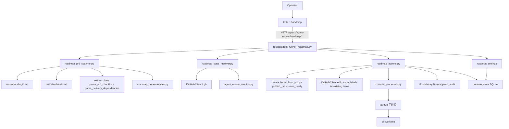
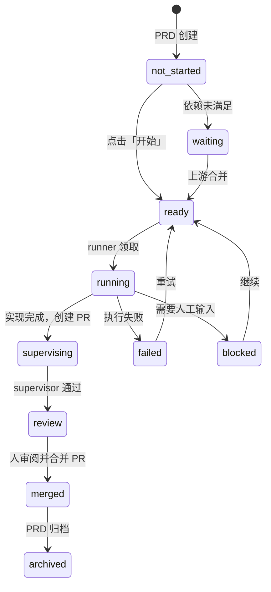
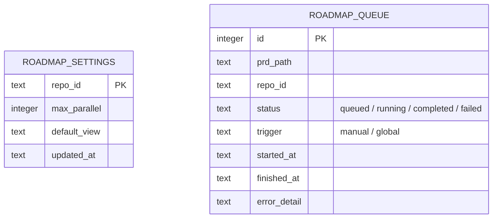

# PRD: 前端 PRD 路线图与交互工作流

## 1. Introduction & Goals

### Problem Statement

当前 `tasks/pending/` 与 `tasks/archive/` 中积累了大量 PRD，但运维者（operator）缺乏一个统一的视图来回答以下问题：

1. 哪些 PRD 已经交付完成（已归档）？哪些还在 pending？
2. pending PRD 之间的依赖关系是什么？哪些可以并行开始，哪些必须等上游合并？
3. 一个 PRD 对应的 GitHub Issue 当前处于什么状态（ready/running/review/failed/blocked）？
4. 如何一次性批量启动一批无依赖的 PRD，并控制并发数量？
5. 当 PRD 进入“待审阅/待合并”状态时，如何在前端高亮提示，而不是人工去 GitHub 翻找？

现有管理终端（ops console）解决了 Issue 队列监控、进程托管和完成度统计，但没有把 **PRD 文件本身**作为一等公民进行管理，也没有把 PRD 依赖关系可视化出来。

### Proposed Solution Summary

在现有 Agent Runner 管理终端中新增**路线图（Roadmap）**页面，作为 PRD 文件、GitHub Issue 状态与 iar 工作流之间的可视化编排层：

- **数据层**：后端新增 `roadmap` 用例扫描 `tasks/pending/` 与 `tasks/archive/` 下的 PRD 文件，复用 `extract_title`、`extract_acceptance_items`、`parse_prd_checklist` 与 `parse_delivery_dependencies` 解析标题、状态、关联 Issue、验收清单进度与 `Delivery Dependencies` 依赖声明；同时通过 `IGitHubClient` 拉取 Issue 实时状态，把 PRD 与 Issue 关联起来。
- **视图层**：前端新增 `/roadmap` 路由，提供**时间轴视图**与**列表视图**，默认只展示 pending PRD，支持一键切换显示全部（含已归档）。PRD 按依赖拓扑排序，有依赖的 PRD 明确展示其上游与阻塞原因。
- **动作层**：
  - **单个开始**：点击 PRD 卡片上的「开始」按钮，系统自动：若未创建 Issue，则走现有 `create_issue_from_prd` 发布安全路径（`publish_prd=True` 且 `queue_ready=True`，或在无法发布时拒绝并提示修复），让 PRD 先对 runner 可见再进入 ready；若已有 Issue，则只添加 `agent/ready` label；随后通过现有 console 托管进程启动一次 `run_once`。
  - **全局开始**：用户设置并发上限后，系统按依赖 DAG 批量调度：无依赖且可安全进入 ready 的 PRD 并行进入运行；未满足依赖或未满足 PRD 发布安全条件的 PRD 留在等待/需处理状态；有依赖的 PRD 等待所有上游 Issue 被审阅并合并到主分支后自动开始。
  - **高亮提示**：PRD 对应的 Issue 进入 `agent/review`（待审阅 PR）、PR merged（等待开始下一个）等状态时，卡片高亮并给出直达链接。
- **集成层**：整体是对现有 iar / console 能力的封装，不替代 iar daemon，不修改 workflow 状态机。并发调度状态与队列持久化复用已有的 `console_store` SQLite，并通过 `PRAGMA user_version` 做就地迁移。

刻意避免的复杂度：不把 PRD 元数据迁出 Markdown 文件到数据库；不重新实现 `Delivery Dependencies` 语法解析；不绕过现有 PRD 发布/ready 安全门禁；不在前端暴露任意 shell 或原始命令；不自动合并 PR（合并仍由人在 GitHub 或前端显式确认）。

### Measurable Objectives

- 打开 `/roadmap` 即可看到所有 pending PRD 的标题、关联 Issue 状态、完成进度与依赖关系；默认视图不含已归档 PRD，切换开关后可显示全部。
- 时间轴视图能按依赖拓扑展示 PRD 执行顺序；列表视图支持按状态、优先级、更新时间排序与过滤。
- 点击单个 PRD「开始」后，30 秒内对应 Issue 被创建（如需要）并在 PRD 已安全发布/可被 runner 读取后打上 `agent/ready`，本地出现对应 worktree（由 runner 创建）。
- 「全局开始」设置并发数 N 后，系统同时启动最多 N 个无依赖且满足发布安全条件的 pending PRD；待上游 PR 合并后，自动开始下游 PRD（无需人工逐一点击）。
- PRD 进入 review 状态时，路线图卡片出现醒目高亮与直达 PR 链接；合并完成后，高亮提示下一个可开始的 PRD。
- 所有 roadmap 动作写入 `console_store` 审计日志，操作可追溯。

### Realistic Validation

除单元测试和集成测试外，本 PRD 要求通过 **Playwright E2E 测试** 与 **Sandbox/手动真实入口验证** 相结合的方式验证关键行为，确保真实使用路径生效，而非仅在隔离 fixture 中通过。

所有可在浏览器完成的交互优先通过 `tests/playwright-e2e/` 实现；涉及真实 GitHub API、真实 runner 子进程与真实 worktree 的边界留在 sandbox 或手动验证，并在每项后明确记录证据。

#### Playwright E2E 真实验证

- [x] **E2E-1 PRD 列表与状态展示**
  - 入口：`frontend/src/pages/roadmap-page.tsx` + `GET /api/v1/agent-runner/roadmap/prds`
  - 步骤：启动真实后端（`uv run uvicorn backend.api.app:app --port 8000`）与前端（`just frontend dev`），使用 Playwright 访问 `/roadmap`。
  - 验证：
    - 页面列出 `tasks/pending/` 与 `tasks/archive/` 中的真实 PRD。
    - pending PRD 默认显示，archived PRD 在切换「显示全部」后出现。
    - 每个 PRD 卡片显示标题、状态、进度与依赖关系。
  - 证据：Playwright 截图保存到 `.iar/evidence/roadmap-list.png`；`GET /api/v1/agent-runner/roadmap/prds` 响应快照保存到 `.iar/evidence/roadmap-prds-response.json`。
  - Required for Acceptance：Yes

- [x] **E2E-2 单个开始按钮交互与状态流转**
  - 入口：`frontend/src/pages/roadmap-page.tsx` → `POST /api/v1/agent-runner/roadmap/prds/{encoded_path}/start`
  - 步骤：在 `/roadmap` 页面点击一个无关联 Issue 的 pending PRD 的「开始」按钮。
  - 验证：
    - 按钮进入 loading 状态。
    - 完成后 PRD 卡片状态变为 `ready` 或显示 runner 启动提示。
    - 后端审计日志出现 `start_prd` 条目。
  - 证据：Playwright 截图 `.iar/evidence/roadmap-start-prd.png`；`GET /api/v1/agent-runner/console/audit` 响应快照 `.iar/evidence/roadmap-start-audit.json`。
  - Required for Acceptance：Yes

- [x] **E2E-3 全局开始并发控制 UI**
  - 入口：`frontend/src/pages/roadmap-page.tsx` → `POST /api/v1/agent-runner/roadmap/start-global`
  - 步骤：选择并发数 2，点击「全局开始」。
  - 验证：
    - 页面显示最多 2 个 PRD 进入 running/ready 状态。
    - 其余 PRD 显示为 waiting/queued。
    - 全局停止按钮可点击。
  - 证据：Playwright 截图 `.iar/evidence/roadmap-start-global.png`；`roadmap_queue` 表查询结果 `.iar/evidence/roadmap-queue-global.json`。
  - Required for Acceptance：Yes

- [x] **E2E-4 依赖阻塞可视化**
  - 入口：`frontend/src/pages/roadmap-page.tsx`
  - 步骤：准备两个 PRD（B depends on A），访问 `/roadmap`。
  - 验证：
    - B 卡片显示阻塞原因与上游 A 的链接。
    - A merged/archived 后，B 卡片状态变为可开始（ready/not_started）。
  - 证据：Playwright 前后对比截图 `.iar/evidence/roadmap-blocked-before.png`、`.iar/evidence/roadmap-blocked-after.png`。
  - Required for Acceptance：Yes

- [x] **E2E-5 review/merged 高亮提示**
  - 入口：`frontend/src/pages/roadmap-page.tsx`
  - 步骤：构造 PRD 对应 Issue 为 `review` / `merged` 状态的数据。
  - 验证：
    - review 状态卡片显示 amber 高亮与「去审阅 PR」按钮。
    - merged 状态卡片显示 green 高亮与「开始下一个」提示。
    - 按钮链接指向真实 PR URL。
  - 证据：Playwright 截图 `.iar/evidence/roadmap-review-highlight.png`、`.iar/evidence/roadmap-merged-highlight.png`。
  - Required for Acceptance：Yes

#### Sandbox / 手动真实入口验证

- [x] **RV-1 单个开始完整链路**
  - 入口：`POST /api/v1/agent-runner/roadmap/prds/{encoded_path}/start`
  - 边界：使用 sandbox/fake GitHub 客户端与 fake runner 命令。
  - 验证：
    - 无 Issue PRD 调用 `create_issue_from_prd` 安全路径（`publish_prd=True, queue_ready=True`）。
    - PRD Issue link 写回并发布到 base branch 后，才添加 `agent/ready` label。
    - 随后 `console_processes.start_runner_process(kind=RUN_ONCE)` 被触发，fake runner 日志出现对应 repo/issue。
  - 证据：`sqlite3 ~/.iar/console.db "select * from audit_logs where action='start_prd'"` 输出保存到 `.iar/evidence/roadmap-rv1-audit.txt`；fake runner 标准输出保存到 `.iar/evidence/roadmap-rv1-runner.log`。
  - Required for Acceptance：Yes

- [x] **RV-2 全局调度与依赖放行**
  - 入口：`POST /api/v1/agent-runner/roadmap/start-global` + `GET /api/v1/agent-runner/roadmap/prds` 轮询
  - 边界：fake GitHub 客户端；2 个无依赖 pending PRD + 1 对 A→B 依赖 PRD（A 已在 RV-1 中进入 ready）。
  - 验证：
    - 并发数 1 时，先启动 1 个独立 PRD，另 1 个独立 PRD queued。
    - A 已 ready 不占启动槽位；B 因依赖 A 未 merged 被跳过。
    - queued PRD 在全局停止或槽位释放后可被继续调度。
  - 证据：`roadmap_queue` 表状态序列导出到 `.iar/evidence/roadmap-rv2-queue.json`；轮询响应快照保存到 `.iar/evidence/roadmap-rv2-poll.jsonl`。
  - Required for Acceptance：Yes

#### 为什么单元测试不够

- [x] **RV-3 端到端覆盖声明**
  - 说明：PRD 解析涉及真实文件系统、`tasks/pending/` 与 `tasks/archive/` 目录扫描、GitHub API 边界、托管 `run_once` 子进程、worktree 创建与合并事件检测。这些边界无法通过单元测试证明其真实协作。
  - 证据：上述 E2E 与 sandbox 验证均运行通过，且 `just test` 中仅包含不依赖真实文件系统/GitHub/runner 的单元/集成测试。
  - Required for Acceptance：Yes

### Delivery Dependencies

- Group: roadmap
- Depends on groups:
  - agent-runner-ops-console（复用其进程托管、审计、SQLite 存储与前端导航）
- Depends on tasks/issues:
  - `tasks/archive/P1-FEAT-20260611-205725-agent-runner-unified-ops-console.md`（已完成，提供 console 基础设施）
  - `tasks/archive/P1-FEAT-20260610-114529-issue-dependency-gate.md`（已完成，提供 `Delivery Dependencies` 与 `iar:depends-on` 语义）
  - `tasks/pending/P2-FEAT-20260610-231150-prd-dependency-reference-resolution.md`（软相关；该能力的大部分代码已在当前仓库可见，roadmap 应直接复用现有 `depends_on_prds` / PRD 依赖物化逻辑；该 pending PRD 未归档不构成硬阻塞）
  - `tasks/pending/P1-BUG-20260527-112400-agent-runner-worktree-sync.md`（软相关；影响复用 worktree 的远程分支新鲜度，不阻塞 roadmap 视图与调度交付）
  - `tasks/pending/P1-BUG-20260612-105203-agent-runner-worktree-reuse-rebase-state-guard.md`（软相关；影响失败重跑场景下 worktree 复用安全，不阻塞 roadmap 视图与调度交付）
- Gate type: soft
- Notes: 当前 ops console 与 dependency gate 均已完成，roadmap 可独立交付；两个 worktree pending bug 影响 runner 成功率与验收稳定性，应在验证失败排查中优先检查，但不改变 roadmap 的架构路径。

## 2. Requirement Shape

- **Actor**：在本机使用 iar 管理多个 PRD 的 operator。
- **Trigger**：
  - operator 打开路线图查看 PRD 执行全景。
  - operator 点击单个 PRD 的「开始」按钮启动开发。
  - operator 点击「全局开始」批量调度一批 PRD。
  - 某个 PRD 对应的 Issue/PR 状态发生变化，需要在前端高亮提示。
- **Expected Behavior**：
  - 路线图以 PRD 文件为粒度展示 pending/archived 状态、关联 Issue 状态、依赖关系与验收进度。
  - 默认只显示 pending；开关切换显示全部。
  - 时间轴视图按依赖拓扑与优先级排序；列表视图支持多维排序与过滤。
  - 「开始 PRD」会创建 Issue（若缺失）、安全发布 PRD Issue link 后添加 `agent/ready`、触发 runner 执行（由 runner 自动创建 worktree）；已有 Issue 时只执行允许的 label/workflow 转换。
  - 「全局开始」允许设置并发数，系统按 DAG 调度无依赖 PRD 并行执行，依赖未满足时自动等待。
  - review/merge/下一个可开始等节点通过高亮与操作按钮提示 operator。
- **Explicit Scope Boundary**：
  - 只封装现有 iar / console 能力，不修改 runner 状态机。
  - 不自动合并 PR；合并仍由 operator 在 GitHub 或前端确认。
  - 不移动或修改 PRD 正文内容（除 `create_issue_from_prd` 正常回写并发布 Issue URL）。
  - 不替代 `iar issue create` / `iar run` / `iar daemon` 等 CLI 命令。

## 3. Repository Context And Architecture Fit

### Current Relevant Modules And Files

| 路径 | 当前职责 | 与本 PRD 的关系 |
|---|---|---|
| `frontend/src/main-app.tsx` | React 路由定义 | 新增 `/roadmap` 路由 |
| `frontend/src/components/app-sidebar.tsx` | 侧边导航 | 新增「路线图」导航项 |
| `frontend/src/pages/dashboard-page.tsx` | 总览页 | 可复用其 Issue 状态展示与高亮模式 |
| `frontend/shared/api/console.ts` | console API wrapper | 新增 roadmap API wrapper |
| `frontend/shared/api/types.ts` | 共享 DTO | 新增 `RoadmapPrd`、`RoadmapDependency` 等类型 |
| `src/backend/api/app.py` | FastAPI 路由注册 | 注册新 roadmap 路由 |
| `src/backend/api/routes/agent_runner.py` | 只读监控 API 与 30s overview cache | roadmap 读端点可复用其 serialization / cache 模式 |
| `src/backend/api/routes/agent_runner_console.py` | console 写 API | roadmap 动作复用其进程/动作调用模式 |
| `src/backend/core/use_cases/create_issue_from_prd.py` | PRD → Issue | 「开始 PRD」时若缺 Issue 则调用 |
| `src/backend/core/use_cases/agent_runner_dependencies.py` | 依赖解析 | 解析 PRD `Delivery Dependencies` |
| `src/backend/core/use_cases/agent_runner_monitor.py` | Issue 状态监控 | roadmap 复用其状态聚合能力 |
| `src/backend/core/shared/prd_checklist.py` | Acceptance Checklist 完成态解析 | 统计 PRD 验收清单进度 |
| `src/backend/core/use_cases/agent_runner_orchestrate.py` | runner 编排 | 被 `iar run` 复用，roadmap 不直接调用 |
| `src/backend/core/use_cases/console_processes.py` | 托管进程 | 「开始」动作可委托启动 `iar run` 子进程 |
| `src/backend/core/use_cases/console_actions.py` | 白名单动作 | 新增 `start_prd` 等动作类型 |
| `src/backend/core/shared/interfaces/runner_console.py` | console 端口 | 新增 roadmap 相关审计动作 |
| `src/backend/infrastructure/persistence/console_store.py` | SQLite 存储 | 存储 roadmap 调度队列与设置 |
| `src/backend/infrastructure/github_client.py` | GitHub CLI 适配 | 查询 Issue/PR 状态 |
| `tasks/pending/` / `tasks/archive/` | PRD 文件 | 路线图数据来源 |

### Existing Architecture Pattern To Follow

```text
src/backend/api/ -> src/backend/core/ -> src/backend/engines/ -> src/backend/infrastructure/
```

- 新端口/用例放在 `core/`，不直接 import `infrastructure/`。
- API 路由只做 DTO 转换与 use case 调用；需要基础设施对象时只通过 `backend.engines.agent_runner.factory` 的 composition helpers 装配，避免在路由中直接实例化 infrastructure。
- 前端只通过 `/api/v1/agent-runner/*` HTTP API 与后端交互；`frontend/shared/api/*` 的 wrapper base path 应写 `"/v1/agent-runner"`，由 `client.ts` 统一拼接 `/api`。
- 审计与调度队列复用 `console_store` SQLite，不新增 Postgres 表；新增表需要把 `console_store.py` 的 `_SCHEMA_VERSION` 从 1 提升，并通过 `PRAGMA user_version` 做幂等迁移。

### Ownership And Dependency Boundaries

- PRD 文件是 roadmap 的只读数据源；roadmap 不拥有 PRD 内容编辑权。
- GitHub Issue/PR 仍是 workflow 状态唯一事实来源；roadmap 只消费和展示。
- runner 执行（worktree、agent、PR 创建）仍由现有 iar 流程负责；roadmap 只负责触发与展示。
- 并发调度状态由 roadmap 维护，但调度决策基于 GitHub 实时状态 + PRD 依赖声明；GitHub label/comment/PR 与 PRD 文件仍是事实来源，SQLite 队列只是可恢复旁路状态。

### Runtime, Docs, Tests, And Workflow Constraints

- Python 文本 I/O 显式 `encoding="utf-8"`。
- 单文件非空行 ≤ 1000 行；新增逻辑应拆分到新文件。
- 完成后必须 `just test`、`just frontend build`。
- docs 更新跑 `uv run mkdocs build --strict`。
- 全局安装的 `iar` 读不到项目本地 config，触发 runner 时必须通过 `[agent_runner.console].runner_command`（默认 `["uv", "run", "iar"]`）并在 keda 项目根执行。
- `iar issue create` 在不发布 PRD 时会避免提前 ready；roadmap 若要创建后立即开始，必须使用发布安全路径或显式拒绝未发布 PRD 的立即执行。
- 单个开始如果 PRD 已有关联 Issue，只允许走 label/workflow 转换，不应强制重建 Issue 或覆盖 PRD 中的 Issue link。

### Matching Or Related PRDs

- `tasks/archive/P1-FEAT-20260611-205725-agent-runner-unified-ops-console.md`：已完成。本 PRD 的进程托管、审计、SQLite 存储、前端页面模式均复用该 PRD 的成果。
- `tasks/archive/P1-FEAT-20260610-114529-issue-dependency-gate.md`：已完成。本 PRD 的依赖声明语义（`Delivery Dependencies`、`iar:depends-on`、`task-group/*`）直接复用。
- `tasks/pending/P2-FEAT-20260610-231150-prd-dependency-reference-resolution.md`：软相关。该 PRD 文件仍在 pending，但当前代码已包含 `DeliveryDependencyDeclaration.depends_on_prds`、`_materialize_prd_dependencies` 与 PRD ref 解析测试；roadmap 应复用这些现有能力，而不是再写一套 PRD 依赖引用解析。
- `tasks/pending/P1-BUG-20260527-112400-agent-runner-worktree-sync.md` 与 `tasks/pending/P1-BUG-20260612-105203-agent-runner-worktree-reuse-rebase-state-guard.md`：软相关。它们影响 runner 复用 worktree 的稳定性，roadmap 可独立交付，但“worktree 出现/重跑成功”的真实验证失败时要先检查这两个方向。
- 本 PRD 与当前 pending PRDs 无重复或硬阻塞关系，可独立交付。

## 4. Recommendation

### Recommended Approach

最小可行的路线图 = 三个正交切片：

1. **PRD 扫描与建模**：`roadmap_prd_scanner.py` 扫描 `tasks/pending/` 与 `tasks/archive/`，复用现有 helper 解析 PRD 标题、路径、关联 Issue URL、验收清单进度与 `Delivery Dependencies`。输出内存中的 PRD 图（节点=PRD，边=依赖）。
2. **状态关联**：`roadmap_state_resolver.py` 把 PRD 关联到 GitHub Issue（通过 PRD 中的 `- GitHub Issue:` URL），并查询 Issue 状态、label、PR 上下文，得到每个 PRD 的实时执行状态。
3. **视图与动作 API**：新增 `/api/v1/agent-runner/roadmap/*` 路由与 `frontend/src/pages/roadmap-page.tsx`。
   - 读端点返回 PRD 列表、依赖图、可开始/阻塞/高亮状态。
   - 写端点支持 `start_prd`（单个）与 `start_global`（全局调度），并复用 console 的白名单动作、审计和托管进程模式。
   - 全局调度状态持久化到 `console_store` 的 roadmap_queue 表。

### Why This Fits

- 完全复用现有 PRD 文件、Issue 状态机、runner 执行流程，不引入新的状态事实来源。
- 把“看”和“启”两个动作集中在前端，降低 operator 在 GitHub、CLI、文件系统之间切换的成本。
- SQLite 调度队列让全局调度的状态可恢复、可审计，且不给 CLI 路径增加新依赖。

### Alternatives Considered

| 方案 | 拒绝原因 |
|---|---|
| 把 PRD 元数据迁移到数据库 | PRD 文件本身已是权威来源，且需要保留 Markdown 编辑与 Git 版本控制；迁移会带来双写一致性问题 |
| 在 runner 内部实现 DAG 调度 | runner 当前按 Issue label 轮询，改造成 DAG 调度会侵入核心状态机； roadmap 作为独立编排层更安全 |
| 前端直接调用 GitHub API | 绕过后端会重复认证、破坏四层架构、且无法复用 iar 的 label/worktree 逻辑 |
| 自动合并 PR | 合并是有副作用的高风险操作，必须由 operator 确认；roadmap 只检测合并事件并提示下一步 |

## 5. Implementation Guide

> This section is a living implementation guide based on current repository analysis. If implementation discovers additional affected files, hidden dependencies, edge cases, or a better path, update this PRD before proceeding.

### Core Logic

#### PRD 扫描与建模

1. **扫描器** `src/backend/core/use_cases/roadmap_prd_scanner.py`：
   - 输入：`repo_path`、要扫描的目录列表（默认 `tasks/pending/`、`tasks/archive/`）。
   - 输出：`list[RoadmapPrd]`，每个元素包含：
     - `prd_path`: 相对路径
     - `title`: H1 标题
     - `status`: `pending` / `archived`
     - `priority`: 从文件名解析（P0/P1/P2/P3）
     - `issue_url`: PRD 中 `- GitHub Issue:` 行的 URL
     - `issue_number`: 从 URL 解析
     - `acceptance_total` / `acceptance_checked`: 从 Acceptance Checklist 统计
     - `delivery_dependencies`: 从 `Delivery Dependencies` 小节解析出的 group / issue 依赖
     - `updated_at`: 文件 mtime
   - 解析规则：
     - 标题复用 `create_issue_from_prd.extract_title`。
     - Issue URL/number 复用 `ISSUE_LINK_LINE_RE` 与 `parse_issue_number` 语义，缺失时保持 `None`。
     - Acceptance Checklist 完成态复用 `core/shared/prd_checklist.py`；展示进度可同时统计 checked/total，但交付完成判定必须以该 helper 的 section 规则为准。
     - `Delivery Dependencies` 复用 `agent_runner_dependencies.parse_delivery_dependencies`，包括 `depends_on_prds` 字段；不得新增平行正则解析器。
2. **依赖图构建** `src/backend/core/use_cases/roadmap_dependencies.py`：
   - 把 `delivery_dependencies` 中的 group 依赖展开为具体 Issue 编号集合（查询 GitHub 获取该 group label 下的所有 Issue）。
   - 把 Issue 编号映射回 PRD（通过 PRD 中的 issue_url）。
   - 对 `depends_on_prds` 优先复用现有 PRD ref 解析/物化语义：能解析到本地 PRD 时建立 PRD→PRD 边；不能唯一解析时把该依赖标为 `unresolved` 并在 UI 中显示可操作错误，而不是静默忽略。
   - 构建 DAG，检测环（环状依赖视为阻塞，并在 UI 中标红）。

#### 状态关联

1. **状态解析器** `src/backend/core/use_cases/roadmap_state_resolver.py`：
   - 对每个有 `issue_number` 的 PRD，调用现有 `IGitHubClient.get_issue`、`list_issue_comments`、`get_pull_request_context`、`find_open_pr_by_head` / `find_merged_pr_by_head` 能力；若需要按 branch 查 PR，复用 `agent_runner_monitor` 中从 Issue comment / `iar:event` 提取 PR branch 的语义，避免重复事件 marker 解析。
   - 综合 label 与 PR 状态，输出 `RoadmapPrdState`：
     - `not_started`: 无 Issue 或 Issue 不在 workflow 中
     - `ready`: Issue 带 `agent/ready`
     - `running`: 带 `agent/running`
     - `supervising`: 带 `agent/supervising`
     - `review`: 带 `agent/review` 或有 open PR 待审阅
     - `failed`: 带 `agent/failed`
     - `blocked`: 带 `agent/blocked`
     - `merged`: Issue closed 且 PR 已合并
     - `archived`: PRD 文件已在 `tasks/archive/`
     - `unresolved_dependency`: PRD 依赖声明无法解析或形成环
2. **可开始判定**：
   - 单个开始：PRD 状态为 `not_started` 或 `failed` 且所有依赖 PRD 为 `merged`/`archived`；若无 Issue 且当前分支/发布条件不能让 PRD 安全发布，则返回明确错误，不添加 ready。
   - 全局调度：同上，再加上并发槽位有空闲。

#### 动作执行

1. **开始单个 PRD** `start_prd(prd_path, repo_id)`：
   - 若 PRD 无 `issue_url`：调用 `create_issue_from_prd` 创建 Issue，使用 `IssueFromPrdRequest(publish_prd=True, queue_ready=True, labels_config=context.config.labels, git_remote=context.config.git.remote, git_base_branch=context.config.git.base_branch, generated_content_config=context.config.generated_content)`，确保 Issue link 已进入 runner 可读取的 base branch 后才 ready。
   - 若无法安全 publish（例如当前分支不是 base branch、暂存区含非目标 PRD、远端不可达），动作必须失败并给出修复提示；禁止创建未发布却带 `agent/ready` 的 Issue。
   - 若 PRD 已有 `issue_url`：调用 `IGitHubClient.edit_issue_labels` 添加 `agent/ready`；对 `agent/failed` 可同时移除 failed label，规则需与 `retry_failed` 现有语义一致。
   - 调用 `console_processes.start_runner_process(kind=RunnerProcessKind.RUN_ONCE, repo_id=...)` 触发一次性 runner。
   - 写入审计日志。
2. **全局调度** `start_global(repo_id, max_parallel)`：
   - 计算所有可开始的 pending PRD，按优先级排序。
   - 把前 N 个写入 `roadmap_queue` 表，状态 `queued`。
   - 为每个 queued PRD 调用 `start_prd`。
   - 后台轮询（复用现有监控轮询语义或新增轻量 roadmap 轮询）检测已启动 PRD 的完成/合并事件，释放槽位后自动开始下一个；若没有常驻后端 worker，可把调度推进放在 `GET /api/v1/agent-runner/roadmap/prds` / `POST /api/v1/agent-runner/roadmap/start-global` 的显式 tick 中，避免引入未托管后台线程。
3. **高亮规则**：
   - `review` 状态：卡片边框高亮 amber，显示「去审阅 PR」按钮。
   - `merged` 状态：卡片高亮 green，显示「开始下一个」按钮（或自动提示）。
   - 依赖阻塞：卡片灰显，显示阻塞源。

#### API 路由（新文件 `src/backend/api/routes/agent_runner_roadmap.py`，前缀 `/api/v1/agent-runner/roadmap`）

| Method | Path | 行为 |
|---|---|---|
| GET | `/prds?repo_id=&include_archived=false` | PRD 列表 + 依赖图 + 状态 |
| GET | `/settings?repo_id=` | 并发数、默认视图等用户设置 |
| PATCH | `/settings` | 更新设置 |
| POST | `/prds/{encoded_prd_path}/start` | 单个开始 |
| POST | `/start-global` | 全局开始，`body {max_parallel, repo_id}` |
| POST | `/stop-global` | 停止全局调度（不再自动开始新 PRD，已运行的不中断） |

`prd_path` 参数使用 URL-safe base64 编码的相对路径，避免特殊字符问题。

后端完整路径为 `/api/v1/agent-runner/roadmap/*`；前端 wrapper 中的 `BASE_PATH` 应为 `"/v1/agent-runner/roadmap"`，不要把 `/api` 再写一遍。

#### 前端

- `frontend/src/pages/roadmap-page.tsx`：路线图主页面。
- `frontend/src/components/roadmap/roadmap-timeline.tsx`：时间轴视图。
- `frontend/src/components/roadmap/roadmap-list.tsx`：列表视图。
- `frontend/src/components/roadmap/prd-card.tsx`：PRD 卡片，展示状态、进度、依赖、操作按钮。
- `frontend/shared/api/roadmap.ts`：API wrapper。
- `frontend/shared/api/types.ts`：新增 DTO。
- `frontend/src/components/app-sidebar.tsx`：新增导航项「路线图」。

### Change Impact Tree

```text
.
├── Frontend
│   ├── frontend/src/main-app.tsx
│   │   [修改]
│   │   【总结】注册 /roadmap 路由
│   │
│   ├── frontend/src/components/app-sidebar.tsx
│   │   [修改]
│   │   【总结】侧边导航新增「路线图」入口
│   │
│   ├── frontend/src/pages/roadmap-page.tsx
│   │   [新增]
│   │   【总结】路线图主页面：视图切换、全局开始面板、PRD 列表/时间轴容器
│   │
│   ├── frontend/src/components/roadmap/roadmap-timeline.tsx
│   │   [新增]
│   │   【总结】按依赖拓扑排列的 PRD 时间轴视图
│   │
│   ├── frontend/src/components/roadmap/roadmap-list.tsx
│   │   [新增]
│   │   【总结】支持排序过滤的 PRD 列表视图
│   │
│   ├── frontend/src/components/roadmap/prd-card.tsx
│   │   [新增]
│   │   【总结】单个 PRD 的状态卡片、进度条、依赖提示、操作按钮
│   │
│   ├── frontend/shared/api/roadmap.ts
│   │   [新增]
│   │   【总结】roadmap API wrapper
│   │
│   └── frontend/shared/api/types.ts
│       [修改]
│       【总结】新增 RoadmapPrd、RoadmapDependency、RoadmapSettings 等 DTO
│
├── API
│   ├── src/backend/api/routes/agent_runner_roadmap.py
│   │   [新增]
│   │   【总结】roadmap 全部读写端点
│   │
│   └── src/backend/api/app.py
│       [修改]
│       【总结】注册 roadmap 路由
│
├── Domain (core)
│   ├── src/backend/core/shared/models/roadmap.py
│   │   [新增]
│   │   【总结】集中定义 RoadmapPrd、RoadmapDependency、RoadmapSettings、RoadmapQueueItem 等 core DTO，供 use case 与 API 序列化复用
│   │
│   ├── src/backend/core/use_cases/roadmap_prd_scanner.py
│   │   [新增]
│   │   【总结】扫描 PRD 文件并复用既有 helper 解析元数据、验收进度、Delivery Dependencies
│   │
│   ├── src/backend/core/use_cases/roadmap_dependencies.py
│   │   [新增]
│   │   【总结】把 PRD 依赖声明展开为 PRD → PRD 的 DAG，包含 unresolved / cycle 诊断
│   │
│   ├── src/backend/core/use_cases/roadmap_state_resolver.py
│   │   [新增]
│   │   【总结】把 PRD 与 GitHub Issue/PR 状态关联，复用现有 monitor 事件/PR branch 解析语义
│   │
│   ├── src/backend/core/use_cases/roadmap_actions.py
│   │   [新增]
│   │   【总结】start_prd / start_global / stop_global 动作编排，复用 Issue 创建、label 与托管进程路径
│   │
│   ├── src/backend/core/use_cases/console_actions.py
│   │   [修改]
│   │   【总结】如选择把 roadmap start 接入 console 白名单动作，在此新增动作枚举与审计分发
│   │
│   └── src/backend/core/shared/interfaces/runner_console.py
│       [修改]
│       【总结】扩展 SQLite 旁路存储端口，加入 roadmap 设置与队列读写契约
│
├── Engines
│   └── src/backend/engines/agent_runner/factory.py
│       [修改]
│       【总结】新增 create_roadmap_scanner / create_roadmap_store 等装配函数
│
├── Infrastructure
│   ├── src/backend/infrastructure/persistence/console_store.py
│   │   [修改]
│   │   【总结】通过 user_version 迁移新增 roadmap_queue / roadmap_settings 表与读写方法；审计写入保持 best effort，队列/设置写失败需让动作失败
│   │
│   └── src/backend/infrastructure/github_client.py
│       [修改]
│       【总结】按需扩展 Issue/PR 查询方法
│
├── Tests
│   ├── tests/test_roadmap_prd_scanner.py
│   │   [新增]
│   │   【总结】PRD 元数据、验收进度、依赖解析测试
│   │
│   ├── tests/test_roadmap_dependencies.py
│   │   [新增]
│   │   【总结】DAG 构建、group 展开、环检测测试
│   │
│   ├── tests/test_roadmap_state_resolver.py
│   │   [新增]
│   │   【总结】Issue/PR 状态映射测试
│   │
│   ├── tests/test_roadmap_api.py
│   │   [新增]
│   │   【总结】roadmap 路由 DTO 与错误码测试
│   │
│   └── tests/playwright-e2e/
│       [新增/修改]
│       【总结】roadmap 页面 smoke 测试
│
└── Docs
    ├── docs/guides/agent-runner.md
    │   [修改]
    │   【总结】新增路线图章节：视图说明、开始动作、全局调度、依赖等待
    │
    └── docs/guides/prd-standard.md
        [检查]
        【总结】确认 Delivery Dependencies 语法无变更；如有扩展则同步
```

文件清单是实现起点而非穷尽保证，隐藏引用见 Executor Drift Guard。

### Executor Drift Guard

实现前先跑以下搜索确认锚点与隐藏引用：

```bash
# PRD 文件解析锚点
rg -n "extract_title|extract_acceptance_items|parse_delivery_dependencies|parse_prd_checklist|DeliveryDependencyDeclaration" src/backend/core/ tests/

# Issue 创建入口
rg -n "def create_issue_from_prd|IssueFromPrdRequest|queue_ready|publish_prd" src/backend/core/use_cases/create_issue_from_prd.py src/backend/api/cli.py

# console 进程启动方式
rg -n "RunnerProcessKind.RUN_ONCE|start_runner_process|build_runner_argv" src/backend/core/use_cases src/backend/api/routes

# GitHub client 查询方法
rg -n "def get_issue|def list_issues_by_label|def get_pull_request_context|def find_open_pr_by_head|def find_merged_pr_by_head" src/backend/infrastructure/github_client.py src/backend/core/shared/interfaces/agent_runner.py

# 路由注册方式
rg -n "include_router" src/backend/api/app.py

# 前端路由/导航
rg -n "dashboard-page|processes-page|repositories-page|app-sidebar|BASE_PATH" frontend/src frontend/shared --type ts --type tsx -g '!node_modules'

# console_store 表结构
rg -n "_SCHEMA_VERSION|CREATE TABLE|PRAGMA user_version|def append_audit|IRunHistoryStore" src/backend/infrastructure/persistence/console_store.py src/backend/core/shared/interfaces/runner_console.py

# API 前缀与 Vite proxy
rg -n "API_BASE|BASE_PATH|/api/v1/agent-runner|/v1/agent-runner" frontend/shared src/backend/api docs/guides/agent-runner.md
```

- `create_issue_from_prd` 的 CLI 路径在未 publish 时不会提前 ready；roadmap 的 `start_prd` 如果要立即开始，必须使用 `publish_prd=True` + `queue_ready=True` 的安全路径，或拒绝动作并提示先发布 PRD。
- `console_store.py` 当前 `_SCHEMA_VERSION = 1`；新增 roadmap 表必须升级 schema 版本并保证旧库就地迁移。
- 现有 `append_run` / `append_audit` 写失败只记录 warning；roadmap queue/settings 是调度状态，写失败时 API 必须返回错误，不能假装排队成功。
- `frontend/shared/api/client.ts` 自动给 endpoint 加 `/api`，roadmap wrapper 只写 `/v1/agent-runner/roadmap`。
- 全局调度的轮询间隔建议复用现有监控轮询（30s）或新增独立轻量轮询；避免频繁调用 GitHub API。
- 若 `depends_on_prds` 解析命中多个或零个 PRD，UI 显示 unresolved dependency；不要把该 PRD 静默当成无依赖。
- Worktree 相关真实验证失败时，先检查 pending PRD `P1-BUG-20260527-112400-agent-runner-worktree-sync.md` 与 `P1-BUG-20260612-105203-agent-runner-worktree-reuse-rebase-state-guard.md` 所覆盖的状态，而不是在 roadmap 层加入 Git 修复逻辑。

### Flow / Architecture Diagram



### State Transition Diagram



### Realistic Validation Plan

所有验收项均需留存证据；E2E 证据由 Playwright 自动保存，sandbox 证据由手动命令导出。

| ID | Behavior | Real Entry Point | Test Layer | Mock Boundary | Data/Env Needed | Command Or Procedure | Evidence | Required |
|---|---|---|---|---|---|---|---|---|
| E2E-1 | PRD 列表与状态展示 | `GET /api/v1/agent-runner/roadmap/prds` + 前端 `/roadmap` | e2e | 真实文件系统；GitHub client 可 fake | 仓库内若干 pending/archive PRD | Playwright 访问 `/roadmap` | `.iar/evidence/roadmap-list.png`、`.iar/evidence/roadmap-prds-response.json` | Yes |
| E2E-2 | 单个开始按钮交互与状态流转 | 前端 `/roadmap` → `POST /api/v1/agent-runner/roadmap/prds/{encoded_path}/start` | e2e | 后端可用 fake GitHub/runner | 一个无 Issue 和一个已有 Issue 的 pending PRD | Playwright 分别点击两个 PRD 的「开始」按钮 | `.iar/evidence/roadmap-start-prd.png`、`.iar/evidence/roadmap-start-audit.json` | Yes |
| E2E-3 | 全局开始并发控制 UI | 前端 `/roadmap` → `POST /api/v1/agent-runner/roadmap/start-global` | e2e | 后端可用 fake GitHub/runner | 3 个无依赖 pending PRD | Playwright 设置并发 2 后点击「全局开始」 | `.iar/evidence/roadmap-start-global.png`、`.iar/evidence/roadmap-queue-global.json` | Yes |
| E2E-4 | 依赖阻塞可视化 | 前端 `/roadmap` | e2e | 后端可用 fake GitHub/runner | A→B 两个 PRD | Playwright 访问 `/roadmap` 并切换 A 状态 | `.iar/evidence/roadmap-blocked-before.png`、`.iar/evidence/roadmap-blocked-after.png` | Yes |
| E2E-5 | review/merged 高亮提示 | 前端 `/roadmap` | e2e | mock API 或 fake backend fixture | PRD 状态为 review / merged 的 fixture | Playwright 访问 `/roadmap` | `.iar/evidence/roadmap-review-highlight.png`、`.iar/evidence/roadmap-merged-highlight.png` | Yes |
| RV-1 | 单个开始完整链路 | `POST /api/v1/agent-runner/roadmap/prds/{encoded_path}/start` | sandbox | GitHub client 用 sandbox/fake；Git publish 使用临时 remote；runner 用 fake `runner_command` | 一个无 Issue 的测试 PRD，当前分支满足 publish 条件 | curl 调用 start，验证 Issue 创建、PRD Issue link 已写回并成功发布后才出现 `agent/ready`，runner 日志出现 `run --repo-id` | `.iar/evidence/roadmap-rv1-audit.txt`、`.iar/evidence/roadmap-rv1-runner.log` | Yes |
| RV-2 | 全局调度与依赖放行 | `POST /api/v1/agent-runner/roadmap/start-global` + `GET /api/v1/agent-runner/roadmap/prds` 轮询 | sandbox | fake runner 脚本；GitHub 状态 fake | 3 个无依赖测试 PRD + A→B 依赖 PRD | curl 设置并发 2 启动全局调度，轮询状态 | `.iar/evidence/roadmap-rv2-queue.json`、`.iar/evidence/roadmap-rv2-poll.jsonl` | Yes |
| RV-3 | 无回归 | 项目测试/build/docs | test/build | 无 | 无 | `just test && just frontend build && uv run mkdocs build --strict` | CI 日志或本地终端输出 | Yes |

失败排查提示：PRD 解析失败先查 `Delivery Dependencies` 标题与字段名；Issue 创建失败先查 `gh auth`、当前分支、暂存区和 PRD 中是否已有 Issue URL；runner 未触发先查 `[agent_runner.console].runner_command` 与 `resolve_console_spawn_cwd()`；全局调度不前进先查 `roadmap_queue` 表状态、GitHub label/PR 状态与轮询日志；worktree 未出现先查 runner 日志与相关 worktree pending PRD 覆盖的状态。

### Low-Fidelity Prototype

```text
┌──────────────────────────────────────────────────────────────────────────────┐
│ ☰ 总览 | 进程 | 统计 | 项目 | 路线图                          Agent Runner   │
├──────────────────────────────────────────────────────────────────────────────┤
│ [路线图]  视图: [时间轴 ▼]  显示: [仅未完成 ■ / 全部 □]  并发: [2 ▼] [全局开始] │
├──────────────────────────────────────────────────────────────────────────────┤
│ 时间轴:                                                                       │
│  ┌─────────┐    ┌─────────┐    ┌─────────┐                                   │
│  │ PRD A   │───▶│ PRD B   │    │ PRD C   │                                   │
│  │ running │    │ waiting │    │ ready   │ [开始]                            │
│  └─────────┘    └─────────┘    └─────────┘                                   │
│       │              ▲                                                        │
│       └──────────────┘ (B depends on A)                                       │
│                                                                               │
│ 列表:                                                                          │
│  标题                    状态        进度   依赖        操作                    │
│  PRD A                   running     30%    —          [查看Issue] [日志]       │
│  PRD B                   waiting     0%     A          [阻塞中]                 │
│  PRD C                   ready       0%     —          [开始]                  │
│  PRD D (archived)        archived    100%   —          [已合并]                 │
└──────────────────────────────────────────────────────────────────────────────┘
```

### ER Diagram



两张表为 roadmap 调度状态；PRD 本身仍存储在 Markdown 文件中，不作为 DB 实体。

### Interactive Prototype Change Log

No interactive prototype file changes in this PRD.

### External Validation

No external validation required; repository evidence was sufficient.

## 6. Definition Of Done

- roadmap 页面 `/roadmap` 可访问，默认展示 pending PRD，支持切换全部/未完成、时间轴/列表视图。
- 单个「开始 PRD」动作可创建 Issue（若缺失）、添加 `agent/ready`、触发 runner 执行。
- 新建 Issue 的「开始 PRD」动作遵守 PRD 发布安全门禁：未发布到 runner 可读取的 base branch 前不得添加 `agent/ready`。
- 「全局开始」可按并发上限与依赖 DAG 批量调度 PRD，依赖未满足时自动等待。
- review/merged/下一个可开始等节点有高亮提示与操作入口。
- 所有 roadmap 动作写入审计日志。
- `just test`、`just frontend build`、`uv run mkdocs build --strict` 通过。
- `docs/guides/agent-runner.md` 同步更新路线图使用说明。
- 四层依赖方向无违例。

## 7. Acceptance Checklist

### Architecture Acceptance

- [x] 新增 core 用例不直接 import `backend.infrastructure`：`rg -n "from backend.infrastructure" src/backend/core/use_cases/roadmap_*.py` 无结果。
- [x] roadmap 路由只调用 core 用例，不直接操作 GitHub client 或文件系统。
- [x] roadmap 路由需要具体依赖时通过 `backend.engines.agent_runner.factory` 装配，不在 route 中直接实例化 infrastructure 类。
- [x] PRD 文件仍是唯一事实来源；roadmap 不修改 PRD 内容（`create_issue_from_prd` 正常回写 Issue URL 除外）。
- [x] 全局调度状态使用 `console_store` SQLite，未新增 Postgres 表或 alembic 迁移。
- [x] `console_store.py` 通过 `_SCHEMA_VERSION` / `PRAGMA user_version` 迁移新增 roadmap 表，旧 `~/.iar/console.db` 可就地升级。

### Behavior Acceptance

- [x] `/roadmap` 页面正确列出 `tasks/pending/` 与 `tasks/archive/` 中的 PRD。
- [x] 默认只显示 pending PRD；切换开关后显示全部。
- [x] 时间轴视图按依赖拓扑排序；列表视图支持按状态/优先级/更新时间排序（证据：`.iar/evidence/roadmap-timeline.png`、`.iar/evidence/roadmap-list-sorted.png`）。
- [x] 有依赖的 PRD 正确显示上游依赖与当前阻塞原因。
- [x] PRD 扫描复用 `parse_delivery_dependencies` / `parse_prd_checklist` 等现有 helper，未新增平行解析语法。
- [x] `depends_on_prds` 能解析为 PRD→PRD 边；无法解析或形成环时显示 unresolved/cycle 阻塞，而不是静默放行。
- [x] 点击「开始」后，无 Issue 的 PRD 自动创建 Issue、回写 PRD Issue link，并在 PRD 成功发布到 base branch 后才添加 `agent/ready`。
- [x] 点击「开始」后，已有 Issue 的 PRD 不重复创建 Issue，只执行允许的 label/workflow 转换。
- [x] 点击「开始」后，runner 被触发（可通过进程列表或日志验证）。
- [x] 「全局开始」按设置的并发数启动 PRD，超出部分进入等待队列。
- [x] 上游 PR 合并后，下游 PRD 自动从 waiting 变为可开始（或自动开始，取决于实现选择）。
- [x] PRD 进入 review 状态时卡片高亮并显示「去审阅 PR」按钮。
- [x] 合并完成后，下一个可开始的 PRD 被高亮提示。

### Documentation Acceptance

- [x] `docs/guides/agent-runner.md` 新增路线图章节：视图说明、开始动作、全局调度、依赖等待、高亮提示。
- [x] `docs/guides/prd-standard.md` 检查 `Delivery Dependencies` 语法，如有 roadmap 专用扩展则同步。
- [x] `mkdocs.yml` 如新增文档页面或导航入口一并更新；只改现有 `agent-runner.md` 章节时无需改导航。

### Validation Acceptance

- [x] `just test` 全量通过。
- [x] `just frontend build` 通过。
- [x] `uv run mkdocs build --strict` 通过。
- [x] 真实入口验证：Playwright E2E 覆盖 PRD 列表、排序、时间轴、review/merged 高亮（证据：`.iar/evidence/roadmap-*.png`、`roadmap-prds-response.json`）；sandbox 脚本 `scripts/roadmap_realistic_validation.py` 覆盖单个开始完整链路与全局调度并发/依赖（证据：`.iar/evidence/roadmap-rv1-audit.txt`、`roadmap-rv1-runner.log`、`roadmap-rv2-queue.json`、`roadmap-rv2-poll.jsonl`）。

## 8. Functional Requirements

- **FR-1**：系统必须提供 PRD 扫描能力，从 `tasks/pending/` 与 `tasks/archive/` 解析 PRD 标题、状态、关联 Issue、验收进度与 `Delivery Dependencies`，并复用现有 PRD/依赖/checklist helper。
- **FR-2**：系统必须构建 PRD 依赖 DAG，支持 Issue 编号依赖、PRD 文件引用依赖与 `task-group/*` group 依赖，并检测 unresolved/cycle 阻塞。
- **FR-3**：系统必须将 PRD 与 GitHub Issue 状态关联，输出统一状态机：`not_started` / `ready` / `running` / `supervising` / `review` / `failed` / `blocked` / `merged` / `archived`。
- **FR-4**：系统必须提供 `GET /api/v1/agent-runner/roadmap/prds` 端点，返回 PRD 列表、状态、依赖图与可开始/阻塞判定。
- **FR-5**：系统必须支持「单个开始」动作：创建 Issue（若缺失）、安全发布 PRD 后添加 `agent/ready`、触发 runner；已有 Issue 时不得重复创建或覆盖 Issue link。
- **FR-6**：系统必须支持「全局开始」动作：用户设置并发数，系统按 DAG 批量调度无依赖 PRD，依赖未满足时自动等待。
- **FR-7**：系统必须持久化全局调度队列与设置到 `console_store`，支持后端重启后恢复队列。
- **FR-8**：前端必须提供 `/roadmap` 页面，支持时间轴/列表视图、全部/未完成切换、单个开始、全局开始。
- **FR-9**：前端必须对 review、merged、下一个可开始等状态进行高亮提示，并提供直达链接或操作按钮。
- **FR-10**：所有 roadmap 写操作必须写入审计日志。
- **FR-11**：系统不得自动合并 PR；合并必须由 operator 确认。
- **FR-12**：系统不得在前端暴露任意 shell 命令或原始 label 编辑。

## 9. Non-Goals

- 不把 PRD 元数据迁移到数据库；PRD 文件保持为唯一事实来源。
- 不替代 `iar issue create` / `iar run` / `iar daemon` 的核心逻辑；roadmap 只负责触发与展示。
- 不自动合并 PR 或自动关闭 Issue。
- 不做跨仓库 PRD 依赖（首期只支持单仓库内依赖）。
- 不编辑 PRD Markdown 正文（除 `create_issue_from_prd` 正常回写 Issue URL，并可按现有发布路径提交该 PRD link）。
- 不做实时 WebSocket/SSE；状态刷新采用轮询（复用现有 30s 间隔或新增轻量轮询）。

## 10. Risks And Follow-Ups

- **GitHub API 配额**：大量 PRD 同时查询 Issue/PR 状态可能触发速率限制。缓解：复用现有监控缓存或增加 30s 轮询去重。
- **依赖环**：PRD 声明形成环时将无法调度。缓解：检测环并在 UI 标红，等待 operator 手动修正 PRD。
- **全局调度与手工 CLI 并发冲突**：全局调度的 PRD 可能被手工 `iar run` 同时领取。缓解：roadmap 通过 label 操作参与同一状态机，runner 的 claim 逻辑会自然去重；排队状态以 SQLite 为准，但 GitHub label 是最终裁决。
- **PRD 文件移动/重命名**：roadmap 中存储的 `prd_path` 可能失效。缓解：路径使用相对路径，扫描时忽略不存在的 queued 项并记录警告。
- **PRD 发布安全**：无 Issue PRD 直接开始需要写回 Issue link 并发布 PRD；当前分支、暂存区或远端状态不满足时会拒绝开始。缓解：错误信息直接引用 `create_issue_from_prd` 的发布预检失败原因，引导 operator 切换 base branch 或先处理暂存区。
- **Worktree 稳定性**：两个 pending worktree bug 可能导致 runner 触发后 worktree 未出现或复用失败。缓解：roadmap 不实现 Git 修复逻辑，只在真实验证失败排查中定位到 runner/worktree PRD。

## 11. Decision Log

| ID | 决策问题 | Chosen | Rejected | Rationale |
|---|---|---|---|---|
| D-01 | PRD 数据来源 | 扫描 `tasks/pending/` 与 `tasks/archive/` 的 Markdown 文件 | 迁移到数据库 | PRD 文件是既有权威来源，迁移会引入双写一致性问题 |
| D-02 | 依赖声明格式 | 复用现有 `Delivery Dependencies` / `iar:depends-on` / `task-group/*` | 新建 roadmap 专用依赖语法 | 避免重复约定，且已有 dependency gate PRD 完成基础设施 |
| D-03 | 并发调度状态存储 | 复用 `console_store` SQLite | 新增 Postgres 表或独立存储 | 保持 CLI 路径无额外依赖，与 ops console 一致 |
| D-04 | 开始 PRD 的执行方式 | 调用 `create_issue_from_prd` + `edit_issue_labels` + `console_processes.start_runner_process` | 在 API worker 进程内直接跑 agent | 进程内执行会占死 API worker，且与现有 runner 流程重复 |
| D-05 | 合并权限 | 人必须确认合并；roadmap 只检测合并事件 | Agent 自动合并 | 合并有副作用，需 operator 最终把关 |
| D-06 | 实时状态刷新 | 轮询（30s） | WebSocket/SSE | 运维观察延迟可接受，轮询更简单且与现有 monitor 一致 |
| D-07 | 视图默认态 | 默认只显示 pending PRD | 默认显示全部 | 符合用户「主要看未完成的」核心诉求，减少噪音 |
| D-08 | 与 iar 流程的关系 | 封装现有流程，不替代 | 重写 runner 状态机或新建并行执行引擎 | 封装风险最低，复用既有 CLI/API 能力 |
| D-09 | 无 Issue PRD 的开始安全 | 使用 `publish_prd=True` + `queue_ready=True` 的现有安全路径 | 创建本地未发布 Issue 后手动加 `agent/ready` | runner 从 base branch 创建 worktree，未发布 PRD 会让 agent 读不到 canonical PRD |
