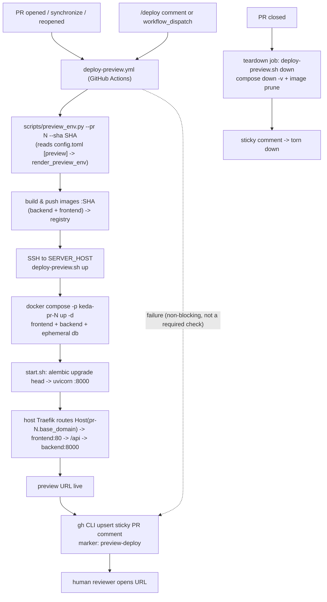

# P1-FEAT-20260614-224914 — PR 审阅预览部署能力（PR Preview Deployment）

- GitHub Issue: https://github.com/zata-zhangtao/keda/issues/86

## 1. Introduction & Goals

### Problem Statement

当前 iar 工作流中，人类的核心职责是「确认开始」与「审阅 PR」。但 reviewer 审阅 PR 时只能看代码 diff 与 CI 状态，**无法看到改动后的应用真实运行效果**。`docs/guides/deployment.md` 末尾仍挂着 `TODO: 补充容器化部署模板`，仓库内既没有 `deploy/` 目录，也没有任何按 PR 部署的工作流；`cd.yml` 只构建发布归档，不部署服务。

需求：PR 创建/更新后，自动把该 PR 的应用部署到用户配置的远程服务器，reviewer 通过一个稳定的预览网址查看真实运行效果；服务器密钥通过环境变量/GitHub Secrets 提供，部署模板化并注入 commit 等信息；首个交付切片是「Docker + Traefik 默认部署模板/工具封装」，复用 `zata-ops` / `zata_code_template` 已有脚本，降低后续多项目接入成本。

### Proposed Solution Summary

**核心机制：GitHub Actions 驱动的「每 PR 一套」临时 Docker + Traefik 预览栈**，复用仓库既有的 `deploy/vps-traefik/` 约定（来自 `zata_code_template`，keda 尚未落地），新增 preview 专用产物，而**不**新建 `deploy/preview/docker-traefik/` 平行目录、**不**让本地 iar daemon 承担部署、**不**引入新的持久化状态。

- **谁提供声明/配置**：非敏感结构（base 域名、项目 slug、APP_DIR 根、registry host/namespace、Traefik network、是否启用）由维护者写入项目 `config.toml` 的 `[preview]` 段（映射到新增的 `PreviewSettings`，与现有每段一个 pydantic 模型的约定一致）；敏感值（`SERVER_HOST`、`SERVER_SSH_KEY`、`SERVER_USER`、`REGISTRY_PASSWORD`、`POSTGRES_PASSWORD`）只放 GitHub Secrets/环境，永不进 `config.toml`。系统只消费显式配置，不推断服务器身份。
- **插入的现有入口**：`.github/workflows/`（新增 `deploy-preview.yml`，与 `ci.yml`/`cd.yml` 并列）、`deploy/vps-traefik/`（新增 preview compose / env 模板 / 部署脚本）、`config.toml` + `settings.py`（新增 `[preview]` 段与模型）、`scripts/`（新增 `preview_env.py`，对标既有 `scripts/release.py`）、`src/backend/core/use_cases/`（新增纯函数 `render_preview_env` 承载命名/域名派生逻辑）。
- **系统状态/用户可见变化**：PR open/synchronize/reopen → 构建并推送 SHA 标签镜像、SSH 到预览服务器拉起 `pr-<N>.<base_domain>` 栈、在 PR 上**更新同一条 sticky 评论**给出预览 URL；PR closed → 拆栈并清理；`/deploy` 评论与手动 dispatch 可重跑。
- **刻意规避的复杂度**：不引入新数据库表（预览栈复用现有 alembic schema 的临时 Postgres）；不引入本地 daemon 部署链路；不实现全局 `~/.iar/config.toml` 预览服务器注册表（保留 `registry_editor.py` 作为后续扩展点）；预览失败**不**作为 PR 合并门禁。

### Measurable Objectives

1. keda 自身的 PR 在 open/synchronize 后，可在预览服务器获得一个可访问的运行实例，URL 以 sticky 评论形式出现在该 PR 上（端到端可被人工验证）。
2. 默认部署模板落在 `deploy/vps-traefik/`，与 `zata_code_template` 约定一致，可经 `just sync-template` 传播到被管理仓库；非敏感配置集中在 `config.toml [preview]`，敏感值仅在 Secrets。
3. 预览部署失败不阻塞 PR review/merge（该 workflow 不进入分支保护必需检查）；PR 关闭后对应预览栈被自动拆除。
4. 命名/域名派生逻辑在 Python 中（`render_preview_env`）有单元测试，预览 compose 可通过 `docker compose config` 校验并能在本地拉起后命中健康检查。

### Realistic Validation

除单元测试和集成测试外，本 PRD 要求通过**真实项目入口点**验证关键行为，确保真实使用路径生效，而非仅在隔离 fixture 中通过。

- [x] **预览环境派生真实验证**：通过 `uv run python scripts/preview_env.py --pr 123 --sha deadbeefcafe` 验证标准输出含正确的 `PREVIEW_DOMAIN` / `COMPOSE_PROJECT_NAME` / `BACKEND_IMAGE` / `FRONTEND_IMAGE`（基于 `config.toml [preview]`）。证据：`.iar/evidence/rv-1-preview-env-cli.txt`。
- [x] **预览栈本地真实验证**：通过 `docker compose -p keda-pr-0 -f deploy/vps-traefik/docker-compose.preview.yml --env-file <tmp.env> up -d` 拉起 backend+frontend+db，`curl` 命中 `http://localhost:<published>/api/v1/agent-runner/health`，证明 alembic 迁移与 nginx→backend 代理在预览栈内可用。证据：`.iar/evidence/rv-3-preview-up-health.txt` + `.iar/evidence/rv-3-preview-up-health.png`。
- [x] **Compose 模板真实验证**：通过 `docker compose -f deploy/vps-traefik/docker-compose.preview.yml --env-file <tmp.env> config` 验证 Traefik router/service/volume 名按 PR 维度唯一化、无变量缺失。证据：`.iar/evidence/rv-2-compose-config.txt`。
- [x] **回归真实验证**：通过 `just test` 验证新增配置模型与派生逻辑不破坏现有配置加载与测试集。证据：`.iar/evidence/rv-4-just-test.txt`。

**为什么单元测试不够**：单测只能证明字符串派生正确，无法证明「镜像能构建、迁移能在容器内 `alembic upgrade head`、nginx 能代理到 `backend:8000`、Traefik 标签能被网关接收」这些跨容器/跨服务行为；这些只有真实拉起预览栈才能暴露。

### Delivery Dependencies

- Group: pr-preview-deployment
- Depends on groups:
  - none
- Depends on tasks/issues:
  - none
- Gate type: soft
- Notes: 与 `tasks/pending/P1-FEAT-20260614-200054-frontend-prd-roadmap.md` 为**软关系**——本 PRD 产出 PR 上的预览 URL，Roadmap PRD 后续在 review 高亮处消费该 URL，二者可并行交付，本 PRD 不依赖 Roadmap，也不阻塞它。与 `structured-validation-evidence`、`frontend-idea-inbox-cross-platform` 为彼此独立的同期 PRD。

---

## 2. Requirement Shape

- **Actor**：（a）iar Agent Runner / 维护者，作为推动 PR open/synchronize 的一方；（b）人类 reviewer，作为预览 URL 的消费者；（c）维护者，作为 `[preview]` 配置与 Secrets 的提供者。
- **Trigger**：
  - 自动：`pull_request` 的 `opened` / `synchronize` / `reopened` → 构建+部署+刷新预览评论；`closed` → 拆栈清理。
  - 手动：PR 下 `/deploy` 评论（`issue_comment`）或 `workflow_dispatch`（传 PR 号）→ 重新部署。
- **Expected Behavior**：在预览服务器拉起按 PR 隔离的 Docker + Traefik 栈（frontend + backend + 临时 Postgres），通过 `pr-<N>.<base_domain>` 暴露；在 PR 上以 sticky 评论给出 URL 与状态；失败时评论给出失败原因与日志链接，但**不**阻塞 review/merge。
- **Explicit Scope Boundary**：
  - 仅服务**同仓库** PR（iar 在同仓库推分支）；fork PR 预览不在范围。
  - 预览栈默认只含 frontend + backend + 临时 Postgres；MinIO/Qdrant/Redis 不默认拉起（compose 内留可选注释位）。
  - 不替换 Dokploy 生产部署（`docker-compose.dokploy.yml` 保持现状）。
  - 不实现前端 Roadmap 对预览 URL 的展示（属 Roadmap PRD）。
  - 不实现本地 `iar preview` CLI 命令与全局 `~/.iar` 预览服务器注册表（见 Non-Goals）。

---

## 3. Repository Context And Architecture Fit

### Current Relevant Modules And Files

- `config.toml` + [`src/backend/infrastructure/config/settings.py`](src/backend/infrastructure/config/settings.py)：每个 `[section]` 对应一个 pydantic 模型，源优先级 `env > TOML > init`；`AppSettings` 聚合所有子配置。
- `.github/workflows/`：[`ci.yml`](.github/workflows/ci.yml)（PR+main）、[`cd.yml`](.github/workflows/cd.yml)（tag→发布归档，**非**服务部署）、`validation-gate.yml`。无任何部署 workflow。
- [`docker-compose.dokploy.yml`](docker-compose.dokploy.yml)：现生产部署（backend + frontend + backup，外部 `dokploy-network`，Traefik 标签）。
- [`frontend/nginx.conf`](frontend/nginx.conf)：`location /api/ { proxy_pass http://backend:8000; }` —— **前端镜像与环境无关（运行时代理），无需为每个 PR 重新构建带域名的镜像**。后端服务名必须是 `backend`。
- [`src/backend/scripts/start.sh`](src/backend/scripts/start.sh)：`alembic upgrade head` 后 `uvicorn ... :8000`（`set -e`）—— 启动**强依赖**可达的 Postgres。
- 健康检查实路径：`/api/v1/agent-runner/health`（[`src/backend/api/routes/agent_runner.py`](src/backend/api/routes/agent_runner.py)）。注意 `docker-compose.dokploy.yml` 里的 `/health` 与当前后端不符，预览 compose 必须用真实路径。
- [`scripts/release.py`](scripts/release.py)：被 `cd.yml` 调用的 CI 辅助脚本——「CI 辅助脚本放 `scripts/`」的既有约定。
- [`src/backend/infrastructure/config/registry_editor.py`](src/backend/infrastructure/config/registry_editor.py)：已有「读写带 `expanduser()` 的全局/项目配置」能力，是未来全局预览服务器注册表的扩展点。
- 复用源（仓库外、同机）：`~/code/zata_code_template/deploy/vps-traefik/`（`docker-compose.yml`、`.env.example`、`app.env.example`、`github-actions-deploy.yml.example`、`README.md`）与 `~/code/zata-ops`（`zata-ops env provision/fix` 封装的 `install-docker-traefik.sh` / `fix-acme-email.sh` 服务器初始化模板）。

### Existing Path

最接近的现有路径是 `zata_code_template/deploy/vps-traefik/github-actions-deploy.yml.example` 的「build → push（SHA 标签）→ SSH 到服务器改 image 引用 → `docker compose pull && up -d`」生产部署模式。本 PRD 把它从「tag 触发、单生产实例」改造为「PR 触发、按 PR 隔离、可自动拆除」的预览变体。

### Reuse Candidates

- `zata_code_template/deploy/vps-traefik/docker-compose.yml` → 派生 `docker-compose.preview.yml`（参数化 + 加临时 Postgres + 双网络）。
- `zata_code_template/deploy/vps-traefik/github-actions-deploy.yml.example` → 派生 `.github/workflows/deploy-preview.yml`（PR 触发、sticky 评论、拆栈）。
- `zata_code_template/deploy/vps-traefik/.env.example` / `app.env.example` → 派生 `preview.env.example`。
- `settings.py` 既有「每段一个 BaseSettings + `settings_customise_sources`」样板 → 直接套出 `PreviewSettings`。
- `scripts/release.py` 调用样式 → `scripts/preview_env.py`。
- `zata-ops env provision`（README 指明 shell 脚本已迁入该 CLI）→ 服务器一次性初始化（装 Docker/Traefik/letsencrypt），**不**把 `bootstrap.sh` 交互逻辑复制进 keda。

### Architecture Constraints

- 四层依赖方向：`api → core → engines → infrastructure`。派生逻辑作为**纯函数**放 `core/use_cases/`，只依赖传入的 settings 对象，不反向依赖。
- 单文件非空行 ≤ 1000（`hooks/check_max_file_lines.py`）。
- Python 文本 I/O 必须显式 `encoding="utf-8"`。
- 文本文件命名/变量需语义化，避免 `data`/`item`/`res`。
- 变更代码需同步 `docs/` 与 `mkdocs.yml`。
- 敏感文件保护：`config.toml [agent_runner.safety].forbidden_path_patterns` 含 `.env` / `.env.*` / `secrets/*`，预览的密钥绝不能落进受管 diff。

### Existing PRD Relationship

`rg -ni "preview|deploy|部署|预览" tasks/pending` 在本 PRD 之外**无任何命中**——pending 中没有重复、前置或下游的部署/预览 PRD。归档区 `tasks/archive/` 全为 agent-runner / worktree / review 主题，无部署预览先例。结论：

- 不重复任何 pending PRD。
- 与 `frontend-prd-roadmap` 为软关系（下游消费者），不构成硬依赖。
- 可独立执行。

### Potential Redundancy Risks

- **平行目录风险**：summary 澄清里建议 `deploy/preview/docker-traefik/`，但仓库既有约定是 `deploy/vps-traefik/`。若另起目录会与模板同步、与 `zata_code_template` 产生两套部署约定。→ 决策：复用 `deploy/vps-traefik/`（D-02）。
- **配置双源风险**：base 域名/slug 若同时写 `config.toml` 与 GitHub Vars 会漂移。→ 非敏感结构唯一源是 `config.toml [preview]`，CI 经 `scripts/preview_env.py` 读取；Secrets 只放敏感值。
- **派生逻辑重复风险**：域名/router 命名若在 shell 与（未来）前端各写一遍会漂移。→ 收敛到 `render_preview_env` 纯函数，shell 不做模板拼接。

---

## 4. Recommendation

### Recommended Approach

**GitHub Actions 驱动 + `deploy/vps-traefik/` 复用 + 每 PR 临时栈**，落地以下产物：

1. `deploy/vps-traefik/docker-compose.preview.yml`：`backend`（image 引用、`DATABASE_URL` 指向同栈 `db`、healthcheck 用 `/api/v1/agent-runner/health`、与 `frontend` 同处「项目默认网络」以便被 `backend:8000` 解析）、`frontend`（image 引用、同时加入外部 `traefik` 网络、PR 维度唯一的 router/service 标签、`Host(\`${PREVIEW_DOMAIN}\`)`）、`db`（`postgres:17-alpine` 临时实例 + 命名卷）。`COMPOSE_PROJECT_NAME=${COMPOSE_PROJECT_NAME}` 让服务/网络/卷名按 PR 隔离，多个 PR 栈可共存。预览资源限额小于生产。
2. `deploy/vps-traefik/preview.env.example`：非敏感部署元数据模板（`PREVIEW_DOMAIN`、`COMPOSE_PROJECT_NAME`、`BACKEND_IMAGE`、`FRONTEND_IMAGE`、`TRAEFIK_NETWORK`、预览 `POSTGRES_*`、`DATABASE_URL`）。
3. `deploy/vps-traefik/deploy-preview.sh`：**非交互**幂等脚本，`action=up|down`；`up` 写 `.env` 并 `docker compose -p <proj> -f docker-compose.preview.yml up -d --remove-orphans` 后等健康；`down` 执行 `down -v` 并 `docker image prune -f`。
4. `.github/workflows/deploy-preview.yml`：触发 `pull_request: [opened, synchronize, reopened, closed]` + `issue_comment: [created]`（`/deploy`，带 `github.event.issue.pull_request` 守卫）+ `workflow_dispatch`；`build-push`（matrix backend/frontend，SHA 标签）→ 非 closed 时 `deploy`（SSH `up` + 通过 `gh` CLI **upsert sticky 评论**给出 URL）→ closed 时 `teardown`（SSH `down`）。`concurrency: preview-${{ pr }}` 取消在飞部署。该 workflow **不**加入分支保护必需检查，故失败不阻塞合并。
5. `config.toml` 新增 `[preview]` 段；`settings.py` 新增 `PreviewSettings(BaseSettings, env_prefix="PREVIEW_")` 聚合进 `AppSettings.preview`。字段：`enabled`、`base_domain`、`project_slug`、`app_dir_root`、`registry_host`、`registry_namespace`、`traefik_network`、`url_scheme`、`subdomain_template`、`compose_template`。
6. `src/backend/core/use_cases/preview_deployment.py`：纯函数 `render_preview_env(preview: PreviewSettings, pr_number: int, commit_sha: str) -> dict[str, str]`，派生 `PREVIEW_DOMAIN`、`COMPOSE_PROJECT_NAME`、`APP_DIR`、`BACKEND_IMAGE`、`FRONTEND_IMAGE`、router/service 名。
7. `scripts/preview_env.py`：薄 CLI，载入 `config.preview` → 调纯函数 → 打印 `KEY=VALUE`（检测到 `GITHUB_ENV` 时追加写入），对标 `scripts/release.py`。
8. 测试：`render_preview_env` 单测、`scripts/preview_env.py` 冒烟、`docker compose config` 校验（见 §5 验证计划）。
9. 文档：替换 `docs/guides/deployment.md` 的 `TODO: 补充容器化部署模板`、`docs/guides/configuration.md` 记 `[preview]`、`deploy/vps-traefik/README.md` 增预览章节、必要时更新 `mkdocs.yml`；`.env.example` 增注释化的预览 Secret 占位。

### Why This Fits

- 复用既有 `deploy/vps-traefik/` 约定与 `settings.py`/`scripts/` 样板，新增面最小、可经 `just sync-template` 自然传播到多项目（直接回应「降低多项目接入成本」）。
- 部署在 CI + SSH 完成，密钥走 GitHub Secrets，**不**把部署耦合进本地 iar daemon（与 summary「密钥经环境变量」一致，也避免常驻进程竞争）。
- 前端运行时代理（nginx）意味着镜像环境无关，预览只需替换 Host 路由，无需为每 PR 重建带域名的前端镜像。
- 派生逻辑入 core 纯函数，满足四层方向且可单测；shell 不做易错的模板拼接。

### Alternatives Considered

- **本地 iar/后端驱动部署**（runner SSH 部署）：与「密钥走环境变量、人只管确认/审阅」相悖，且与常驻 daemon 抢资源、把部署链路塞进应用进程。拒绝。
- **新建 `deploy/preview/docker-traefik/` 平行目录**（summary 原建议）：与既有 `deploy/vps-traefik/` 约定割裂，模板同步会出现两套部署树。拒绝，改为在 `deploy/vps-traefik/` 内加 preview 变体（D-02）。
- **每 PR 独立 HTTP-01 证书签发**：PR 多时触发 Let's Encrypt 速率限制。拒绝，改用共享通配证书 `*.<base_domain>`（DNS-01）或 HTTP-only 预览入口（`url_scheme` 切换，D-06）。
- **第三方 sticky 评论 Action**（如 `peter-evans/create-or-update-comment`）：本仓库目前只用一方/官方 Action，改用内置 `gh` CLI upsert 评论以免新增第三方依赖（D-08）。

---

## 5. Implementation Guide

> This section is a living implementation guide based on current repository analysis. If implementation discovers additional affected files, hidden dependencies, edge cases, or a better path, update this PRD before proceeding.

### Core Logic

1. **触发**：PR 事件/`/deploy` 评论/手动 dispatch 进入 `deploy-preview.yml`。解析出 `pr_number` 与 `commit_sha`（PR head SHA）。
2. **派生**：`uv run python scripts/preview_env.py --pr <N> --sha <sha>` 读取 `config.toml [preview]`（经 `config.preview`），调用 `render_preview_env` 得到非敏感环境（域名、compose 项目名、镜像引用、APP_DIR、router 名），写入 `$GITHUB_ENV`。
3. **构建推送**：matrix 分别 build `src/backend/Dockerfile`（context `.`）与 `frontend/Dockerfile`（context `./frontend`），打 `:<sha>` 标签 push 到 `${registry_host}/${registry_namespace}/...`（凭据来自 Secrets）。
4. **部署**（非 closed）：SSH 到 `SERVER_HOST`，把 `docker-compose.preview.yml` + 生成的 `.env` 同步到 `${APP_DIR}`，运行 `deploy-preview.sh up`：`docker compose -p ${COMPOSE_PROJECT_NAME} ... up -d` → 容器内 `start.sh` 跑 `alembic upgrade head`（命中临时 `db`）→ uvicorn 起 → 健康检查通过 → frontend 经 Traefik 在 `${PREVIEW_DOMAIN}` 暴露。
5. **回传**：`gh` CLI 以隐藏标记 `<!-- preview-deploy -->` 查找并 upsert 评论，给出预览 URL / 状态 / 失败日志链接。
6. **拆除**（closed）：`deploy-preview.sh down` 执行 `docker compose -p ${COMPOSE_PROJECT_NAME} down -v` 并清理镜像，sticky 评论更新为「已拆除」。
7. **非阻塞**：该 workflow 不在分支保护必需检查内；其结论不影响 merge。

### Change Impact Tree

```text
.
├── deploy/
│   └── vps-traefik/
│       ├── docker-compose.preview.yml
│       │   [新增]
│       │   【总结】按 PR 隔离的临时预览栈：frontend(+traefik 网络/PR 维度 router)+backend(健康检查走 /api/v1/agent-runner/health)+临时 postgres
│       │   ├── 服务/卷/网络名由 COMPOSE_PROJECT_NAME 唯一化，多 PR 共存
│       │   ├── backend 服务名固定为 `backend` 以匹配 nginx.conf 代理目标
│       │   ├── DATABASE_URL 指向同栈 db，满足 start.sh 的 alembic upgrade
│       │   └── 预览资源限额低于生产；MinIO/Qdrant/Redis 留可选注释位
│       │
│       ├── preview.env.example
│       │   [新增]
│       │   【总结】非敏感预览部署元数据模板（域名/项目名/镜像/网络/预览库凭据占位）
│       │
│       ├── deploy-preview.sh
│       │   [新增]
│       │   【总结】非交互幂等远程脚本：up 写 .env 并拉起+等健康，down 拆栈清卷清镜像
│       │
│       └── README.md
│           [修改]（若复用模板 README）/[新增]（keda 暂无该文件，预计新增）
│           【总结】补「Preview（每 PR 临时栈）」章节，说明 Secrets/Vars、触发与拆除、与生产路径区别
│
├── .github/
│   └── workflows/
│       └── deploy-preview.yml
│           [新增]
│           【总结】PR/评论/手动触发的 build-push-SSH 预览部署与拆除，sticky 评论回传 URL，非必需检查
│           ├── on: pull_request[opened,synchronize,reopened,closed]+issue_comment[/deploy]+workflow_dispatch
│           ├── concurrency: preview-<pr> 取消在飞
│           ├── permissions: contents:read, packages:write, pull-requests:write
│           └── teardown job 仅在 closed 运行
│
├── config.toml
│   [修改]
│   【总结】新增 [preview] 段：enabled/base_domain/project_slug/app_dir_root/registry_*/traefik_network/url_scheme/subdomain_template/compose_template
│
├── src/backend/
│   ├── infrastructure/config/settings.py
│   │   [修改]
│   │   【总结】新增 PreviewSettings(env_prefix=PREVIEW_) 并聚合进 AppSettings.preview，复用 _env_toml_init_sources("preview")
│   │   ├── 仿 DatabaseSettings 写 settings_customise_sources
│   │   └── 同步 __all__ 导出 PreviewSettings
│   │
│   └── core/use_cases/preview_deployment.py
│       [新增]
│       【总结】纯函数 render_preview_env：由 PreviewSettings+pr+sha 派生域名/项目名/镜像/router 名，无 I/O 可单测
│
├── scripts/
│   └── preview_env.py
│       [新增]
│       【总结】薄 CLI：载入 config.preview→调 render_preview_env→输出 KEY=VALUE，检测到 GITHUB_ENV 时追加写入（对标 scripts/release.py）
│
├── .env.example
│   [修改]
│   【总结】追加注释化的预览 Secret 占位（SERVER_HOST/SERVER_SSH_KEY/SERVER_USER/REGISTRY_*/POSTGRES_PASSWORD），仅占位不含真实值
│
├── tests/
│   ├── <config 测试目录>/test_preview_settings.py
│   │   [新增]
│   │   【总结】断言 [preview] 段与环境变量覆盖、默认值、env_prefix 生效
│   ├── <core 测试目录>/test_preview_deployment.py
│   │   [新增]
│   │   【总结】断言 render_preview_env 对 PR 号/SHA/模板的派生输出（域名、唯一项目名、镜像引用）
│   └── <scripts 测试目录>/test_preview_env_script.py
│       [新增]
│       【总结】子进程冒烟运行 scripts/preview_env.py，断言 stdout 含必需键且可被 shell eval
│
├── docs/guides/deployment.md
│   [修改]
│   【总结】用「Preview 部署（每 PR 临时 Docker+Traefik）」章节替换文末 TODO，给出触发/Secrets/拆除/失败非阻塞说明
│
├── docs/guides/configuration.md
│   [修改]
│   【总结】记录 [preview] 各字段语义与「非敏感入 config、敏感入 Secrets」边界
│
└── mkdocs.yml
    [修改, 条件]
    【总结】若新增独立文档页则补 nav；仅在既有页内追加章节则可不改
```

> 文件清单是实现起点，不保证穷尽。配置测试/核心测试/脚本测试的确切目录需用下方 Executor Drift Guard 的 `rg` 命令在 `tests/` 中定位现有同类测试后就近落位。

### Executor Drift Guard

仓库内可能存在隐藏引用与约定漂移，实现前后用以下命令核对（命令均可从仓库根复制执行）：

```bash
# 1. 确认 AppSettings 聚合点与 __all__ 导出位置（PreviewSettings 接线处）
rg -n "class AppSettings|agent_runner: AgentRunnerSettings|__all__ =" src/backend/infrastructure/config/settings.py

# 2. 确认 CI 辅助脚本既有调用样式（对标 preview_env.py 的放置与调用）
rg -n "scripts/release.py|uv run python scripts/" .github/workflows justfile

# 3. 确认后端健康路径与服务名约定（预览 compose 必须一致）
rg -n "agent-runner/health" src/backend/api/routes/agent_runner.py
rg -n "proxy_pass http://backend:8000|server backend" frontend/nginx.conf

# 4. 确认两个 Dockerfile 的构建 context（workflow matrix 必须对齐）
rg -n "EXPOSE|CMD|WORKDIR" src/backend/Dockerfile frontend/Dockerfile

# 5. 定位现有测试目录布局，决定新测试就近落位
rg -n "config|settings" --files tests | rg -i "config|settings" | head
fd -t f test_ tests | head -40

# 6. 确认是否有分支保护/必需检查清单需要显式排除 deploy-preview
rg -n "required_status_checks|branch protection|deploy-preview" .github docs 2>/dev/null

# 7. 确认 .env.example / .gitignore 不会把预览 .env 纳入受管 diff
rg -n "^\.env|preview\.env|deploy/vps-traefik" .gitignore .dockerignore
```

失败排查要点：若预览容器起不来——先查 `db` 是否就绪（`alembic upgrade head` 会因 DB 不可达而 `set -e` 退出）、再查 `DATABASE_URL` 是否指向同栈 `db`、再查 backend 服务名是否为 `backend`（nginx 代理目标）。若 Traefik 不路由——查 frontend 是否同时加入外部 `traefik` 网络、`Host` 规则与 `${PREVIEW_DOMAIN}` 是否一致、router/service 名是否按 PR 唯一。若评论不出现——查 `pull-requests: write` 权限与 `GH_TOKEN`，以及同仓库 PR（fork 上 `GITHUB_TOKEN` 只读，不在范围）。

### Flow Or Architecture Diagram



### Realistic Validation Plan

| Behavior | Real Entry Point | Test Layer | Mock Boundary | Data/Env Needed | Command Or Procedure | Required For Acceptance |
|---|---|---|---|---|---|---|
| 预览环境派生（域名/项目名/镜像/router 名） | CLI `scripts/preview_env.py` | smoke | 无（读真实 `config.toml`） | 临时设置 `[preview]` 或环境变量覆盖 | `uv run python scripts/preview_env.py --pr 123 --sha deadbeefcafe` | Yes |
| 派生纯函数正确性（模板/边界/唯一性） | `render_preview_env` 经 pytest | unit | 无 | 传入构造的 `PreviewSettings` | `just test`（含新增 `test_preview_deployment.py`） | Yes |
| `[preview]` 配置加载与覆盖 | `config.preview` 经 pytest | unit | 无 | `monkeypatch` 环境变量 / 临时 toml | `just test`（含 `test_preview_settings.py`） | Yes |
| 预览 compose 渲染（变量齐全、PR 维度唯一名） | `docker compose config` | integration | 不起容器 | 临时 `.env` | `docker compose -f deploy/vps-traefik/docker-compose.preview.yml --env-file /tmp/preview.env config` | Yes |
| 预览栈真实可运行（迁移+nginx 代理+健康） | `docker compose up`（本地） | e2e/smoke（opt-in） | 用本地构建镜像，不连远程服务器 | 本机 Docker；`/tmp/preview.env`；published port | `docker compose -p keda-pr-0 -f deploy/vps-traefik/docker-compose.preview.yml --env-file /tmp/preview.env up -d` 后 `curl -f http://localhost:<port>/api/v1/agent-runner/health` | Yes |
| 远程 PR 预览端到端（含 Traefik+域名+评论） | 真实 PR 触发 `deploy-preview.yml` | e2e（opt-in，post-merge） | 真实预览服务器 | Secrets：`SERVER_HOST`/`SERVER_SSH_KEY`/`SERVER_USER`/`REGISTRY_*`；`[preview].enabled=true` | 开测试 PR 观察 sticky 评论 URL 可访问、关 PR 后栈被拆 | No（凭据缺失时跳过，不阻塞验收） |
| 不破坏既有配置/测试 | `just test` | regression | 无 | 默认 | `just test` | Yes |

凭据/外部依赖说明：远程端到端验证需 `[preview].enabled=true` 且配置上述 Secrets，**opt-in**；凭据不可用时以「本地 `docker compose up` 冒烟 + 单测 + `compose config`」作为必过回退，远程验证跳过**不**阻塞验收。失败排查见 Executor Drift Guard。

命令前置：本地 compose 冒烟需先构建镜像（`docker build -t <reg>/<ns>/keda-backend:local -f src/backend/Dockerfile .` 与 `docker build -t <reg>/<ns>/keda-frontend:local -f frontend/Dockerfile ./frontend`），并在 `/tmp/preview.env` 用 `:local` 标签 + 一个 published port 映射（预览 compose 默认 `expose` 不发布端口，本地冒烟时临时加 `-p` 端口或用 `docker compose exec` 内部 `curl`）。

### Low-Fidelity Prototype

PR sticky 评论（reviewer 可见的唯一新增 UI 面）：

```text
┌────────────────────────────────────────────────────────┐
│ 🟢 Preview deployment ready                              │
│                                                          │
│  URL:     https://pr-123.preview.example.com             │
│  Commit:  deadbee (build #482)                           │
│  Stack:   keda-pr-123  ·  updated 2026-06-14 22:50       │
│                                                          │
│  Re-deploy: comment `/deploy` · Logs: <actions run>      │
│  <!-- preview-deploy -->                                 │
└────────────────────────────────────────────────────────┘

失败态：
┌────────────────────────────────────────────────────────┐
│ 🔴 Preview deployment failed (does not block merge)      │
│  Commit:  deadbee  ·  Step: ssh deploy-preview.sh up     │
│  Logs:    <actions run link>                             │
│  <!-- preview-deploy -->                                 │
└────────────────────────────────────────────────────────┘

关闭态：
┌────────────────────────────────────────────────────────┐
│ ⚪ Preview torn down (PR closed)                         │
│  <!-- preview-deploy -->                                 │
└────────────────────────────────────────────────────────┘
```

### Realistic Validation Evidence

按 `[agent_runner.validation]` 逐项格式对账：每条 Validation Acceptance 需有对应 `rv-<n>-*` 证据。建议证据：

- `rv-1-preview-env-cli.txt`：`scripts/preview_env.py` 真实输出。
- `rv-2-compose-config.txt`：`docker compose config` 成功输出（含 PR 维度唯一名）。
- `rv-3-preview-up-health.txt` + `rv-3-preview-up.png`：本地拉起栈后健康检查 200 的命令输出与（可选）截图。
- `rv-4-just-test.txt`：`just test` 通过输出。

### ER Diagram

No data model changes in this PRD. 预览栈复用现有 alembic schema 的临时 Postgres，不新增表/字段/持久结构。

### Interactive Prototype Change Log

No interactive prototype file changes in this PRD.

### External Validation

| Topic | Source | Checked On | Relevant Finding | Impact On Recommendation |
|---|---|---|---|---|
| Let's Encrypt 速率限制对每 PR 子域名签发的影响 | letsencrypt.org（联网核验在本环境因 WebSearch 模型不可用而失败） | 2026-06-14（未完成核验） | 标准 ACME 实践：大量短生命周期子域名逐个 HTTP-01 签发会触达「每注册域名/周」证书签发上限 | 默认采用共享通配证书 `*.<base_domain>`（DNS-01）或 HTTP-only 预览入口（`url_scheme` 切换），避免每 PR 独立签发；实现者应在启用前对照当前 Let's Encrypt 官方限额复核 |

说明：本条为工程常识/推断，标注「未完成联网核验」；除该证书策略外，其余决策均由仓库证据支撑，无需外部事实。

---

## 6. Definition Of Done

- 实现校验：`render_preview_env`、`PreviewSettings`、`scripts/preview_env.py` 有单测/冒烟；`docker compose config` 通过。
- 真实入口校验：本地 `docker compose up` 预览栈命中 `/api/v1/agent-runner/health`；（凭据可用时）真实 PR 触发产出可访问预览 URL 并在关闭后拆栈。
- 文档更新：`docs/guides/deployment.md` 的 TODO 被替换、`configuration.md` 记 `[preview]`、`deploy/vps-traefik/README.md` 增预览章节、必要时 `mkdocs.yml` 补 nav；`uv run mkdocs build --strict` 通过。
- 无回归：`just test` 通过；现有配置加载、CI/CD workflow 不受影响。
- 架构吻合：派生逻辑在 `core/use_cases`，未破坏四层方向；无敏感值入库；新增文件均 < 1000 非空行。
- 交付门禁：预览 workflow 不在分支保护必需检查内（失败不阻塞合并）。

## 7. Acceptance Checklist

### Architecture Acceptance
- [x] 预览模板落在 `deploy/vps-traefik/`（非新建 `deploy/preview/docker-traefik/`）；`rg -n "deploy/preview/docker-traefik" .` 无命中。
- [x] `PreviewSettings` 定义于 `src/backend/infrastructure/config/settings.py` 并聚合进 `AppSettings.preview`，且写入 `__all__`；`rg -n "PreviewSettings" src/backend/infrastructure/config/settings.py` 命中类定义、聚合与导出三处。
- [x] 派生逻辑 `render_preview_env` 位于 `src/backend/core/use_cases/preview_deployment.py`，不 import `engines/`、`infrastructure/`（纯函数仅依赖传入 settings）。
- [x] 新增文件均 < 1000 非空行：`uv run python hooks/check_max_file_lines.py --max-lines 1000 $(rg -l "" deploy/vps-traefik scripts/preview_env.py src/backend/core/use_cases/preview_deployment.py)`。

### Dependency Acceptance
- [x] `[preview]` 仅含非敏感结构；`config.toml`、`deploy/vps-traefik/*` 不含任何真实密钥/host：`rg -n "SSH|PRIVATE KEY|password|secret" config.toml deploy/vps-traefik` 仅命中占位/变量名而非真实值。
- [x] 敏感值仅在 GitHub Secrets/环境引用：`rg -n "secrets\.|vars\." .github/workflows/deploy-preview.yml` 覆盖 `SERVER_HOST`/`SERVER_SSH_KEY`/`SERVER_USER`/`REGISTRY_*`/`POSTGRES_PASSWORD`。
- [x] 预览 `.env` 不进受管 diff：`.gitignore` 覆盖 `deploy/vps-traefik/*.env`（保留 `*.example`）。

### Behavior Acceptance
- [x] `docker-compose.preview.yml` 中 backend 服务名为 `backend`、healthcheck 为 `/api/v1/agent-runner/health`、`DATABASE_URL` 指向同栈 `db`；frontend 同时在默认网络与外部 `${TRAEFIK_NETWORK}`，router/service 名按 `${COMPOSE_PROJECT_NAME}` 唯一。
- [x] `deploy-preview.yml` 触发含 `opened/synchronize/reopened/closed` + `issue_comment(/deploy)` + `workflow_dispatch`；`closed` 走 teardown；`concurrency` 按 PR 分组。
- [x] sticky 评论用隐藏标记 `<!-- preview-deploy -->` 实现 upsert（同一条评论更新，不刷屏）。
- [x] 失败不阻塞：`deploy-preview` 未被加入任何分支保护必需检查（在 README/部署文档中显式说明不要将其设为 required）。

### Documentation Acceptance
- [x] `docs/guides/deployment.md` 不再含 `TODO: 补充容器化部署模板`，且新增预览部署章节；`rg -n "补充容器化部署模板" docs/guides/deployment.md` 无命中。
- [x] `docs/guides/configuration.md` 记录 `[preview]` 全部字段；`deploy/vps-traefik/README.md` 含 Preview 章节。
- [x] `uv run mkdocs build --strict` 通过。

### Validation Acceptance
- [x] **真实 CLI**：`uv run python scripts/preview_env.py --pr 123 --sha deadbeefcafe` 输出含正确 `PREVIEW_DOMAIN`/`COMPOSE_PROJECT_NAME`/`BACKEND_IMAGE`/`FRONTEND_IMAGE`（证据 `rv-1-*`）。
- [x] **真实 Compose 渲染**：`docker compose -f deploy/vps-traefik/docker-compose.preview.yml --env-file /tmp/preview.env config` 成功且名称按 PR 唯一（证据 `rv-2-*`）。
- [x] **真实运行栈**：本地 `docker compose -p keda-pr-0 ... up -d` 后 `curl -f .../api/v1/agent-runner/health` 返回成功（证据 `rv-3-*`）。
- [x] **回归**：`just test` 通过（证据 `rv-4-*`）。
- [x] **（opt-in）远程端到端**：凭据可用时，真实 PR 产出可访问预览 URL、关闭后拆栈；凭据不可用时记录为跳过，不阻塞验收。本机环境无 GitHub Secrets/预览服务器凭据，已以本地 `docker compose up` 冒烟替代。

## 8. Functional Requirements

- **FR-1**：提供 `deploy/vps-traefik/docker-compose.preview.yml`，按 PR 隔离拉起 frontend + backend + 临时 Postgres，服务/网络/卷名经 `COMPOSE_PROJECT_NAME` 唯一化，多 PR 共存。
- **FR-2**：提供非交互幂等的 `deploy/vps-traefik/deploy-preview.sh`，支持 `up`（写 `.env`、拉起、等健康）与 `down`（`down -v` + 镜像清理）。
- **FR-3**：提供 `.github/workflows/deploy-preview.yml`，在 PR open/synchronize/reopen 时构建并推送 SHA 标签镜像、SSH 部署、以 sticky 评论回传预览 URL。
- **FR-4**：PR `closed` 时自动拆除对应预览栈并更新评论为「已拆除」。
- **FR-5**：预览部署失败**不**阻塞 PR review/merge（workflow 不进入分支保护必需检查），失败信息进入 sticky 评论。
- **FR-6**：新增 `config.toml [preview]` 段与 `PreviewSettings` 模型，及 `render_preview_env` 纯函数 + `scripts/preview_env.py` 薄 CLI 完成非敏感环境派生。
- **FR-7**：非敏感结构唯一源是 `config.toml [preview]`；敏感值（host/SSH key/registry/DB 密码）仅经 GitHub Secrets/环境注入，绝不写入仓库受管文件。
- **FR-8**：预览 backend 启动满足 `alembic upgrade head`（连同栈临时 Postgres）并以 `/api/v1/agent-runner/health` 暴露健康；frontend 经 nginx 以 `backend:8000` 反代，且经 Traefik 在 `pr-<N>.<base_domain>` 暴露。
- **FR-9**：同步更新 `docs/guides/deployment.md`（替换 TODO）、`docs/guides/configuration.md`、`deploy/vps-traefik/README.md`，必要时 `mkdocs.yml`；`.env.example` 增注释化预览 Secret 占位。
- **FR-10**：支持 PR 下 `/deploy` 评论与 `workflow_dispatch` 手动重跑部署。

## 9. Non-Goals

- 全局 `~/.iar/config.toml` 预览服务器注册表（`server_ref` 多机选址）——保留 `registry_editor.py` 为扩展点，本切片不实现。
- fork PR 预览（`GITHUB_TOKEN` 在 fork 上只读；iar 用同仓库分支，不在范围）。
- 本地 `iar preview` CLI 命令（部署在 CI 完成，不引入本地部署链路）。
- 前端 Roadmap 对预览 URL 的展示/高亮（属 `frontend-prd-roadmap` PRD）。
- 替换或修改 Dokploy 生产部署（`docker-compose.dokploy.yml`）。
- 预览栈默认拉起 MinIO/Qdrant/Redis（仅在 compose 内留可选注释位）。
- 预览服务器一次性初始化（装 Docker/Traefik/证书）的实现——沿用 `zata-ops env provision`，本 PRD 只在文档引用。

## 10. Risks And Follow-Ups

- **证书速率限制**：每 PR 子域名逐个签发会触达 Let's Encrypt 限额。缓解：默认共享通配证书 `*.<base_domain>`（DNS-01）或 HTTP-only 预览入口（`url_scheme`）。实现前对照当前官方限额复核（External Validation 未能联网核验）。
- **预览服务器容量**：并发 PR 越多，栈越多，可能耗尽资源。缓解：PR 关闭即拆栈 + 预览资源限额从严；后续可加「按 PR 状态定时清理孤儿栈」（follow-up，非本切片阻塞项）。
- **孤儿栈**：若 `closed` 事件漏触发，栈不被回收。缓解：`deploy-preview.sh` 幂等可重跑；follow-up 增加定时对账（列服务器栈 vs 开放 PR）。
- **密钥泄露**：SSH key/registry 密码若打印进日志即泄露。缓解：只经 Secrets 注入、`set +x` 敏感段、不回显。
- **仅同仓库 PR**：fork PR 无预览（明确 Non-Goal），符合 iar 同仓库分支模型。

## 11. Decision Log

| ID | Decision | Chosen | Rejected | Rationale |
|---|---|---|---|---|
| D-01 | 部署驱动方式 | GitHub Actions + SSH 驱动 | 本地 iar/后端驱动部署 | 密钥走 Secrets、人只管确认/审阅；避免把部署链路塞进应用进程并与常驻 daemon 抢 worktree/资源 |
| D-02 | 模板目录 | 复用既有 `deploy/vps-traefik/` 加 preview 变体 | summary 原建议的新 `deploy/preview/docker-traefik/` | 与 `zata_code_template` 既有约定一致，避免模板同步出现两套部署树 |
| D-03 | 预览数据库 | 同栈临时 `postgres:17-alpine`（必需） | 无 DB / 仅 SQLite / 共享生产库 | `start.sh` 以 `set -e` 跑 `alembic upgrade head`，DB 不可达即启动失败，故临时 DB 必需且按 PR 隔离便于拆除 |
| D-04 | 配置分层 | 非敏感入 `config.toml [preview]`，敏感入 GitHub Secrets/环境 | 全部入 Vars / 全部入 config / host 入 config | 与 settings.py「每段一模型、env>TOML」约定一致；host/key 属环境敏感，绝不入受管文件 |
| D-05 | 失败阻塞策略 | 独立 workflow、非必需检查、失败仅评论 | 设为 PR required check 阻塞合并 | 预览是审阅辅助而非代码正确性门禁；阻塞会拖慢 iar 的 PR 流转 |
| D-06 | 预览证书策略 | 共享通配证书或 HTTP-only 入口（`url_scheme` 切换） | 每 PR 独立 HTTP-01 签发 | 大量短生命周期子域名逐个签发触达 Let's Encrypt 速率限制 |
| D-07 | 全局服务器注册表 | 本切片不做，保留 `registry_editor.py` 扩展点 | 立刻实现 `~/.iar` 预览服务器注册表 + `server_ref` | keda 为唯一首个消费者，多机选址属过度设计；summary 亦标注其为「可选」 |
| D-08 | sticky 评论实现 | 内置 `gh` CLI upsert（隐藏标记） | 第三方 `peter-evans/create-or-update-comment` | 本仓库目前只用一方/官方 Action，避免新增第三方依赖与权限面 |
| D-09 | 派生逻辑落点 | core 纯函数 `render_preview_env` + 薄 shell/CLI | 直接在 workflow/shell 拼接域名与 router 名 | 模板拼接易错且会与未来前端重复；入 core 可单测、单一真实来源、符合四层方向 |
