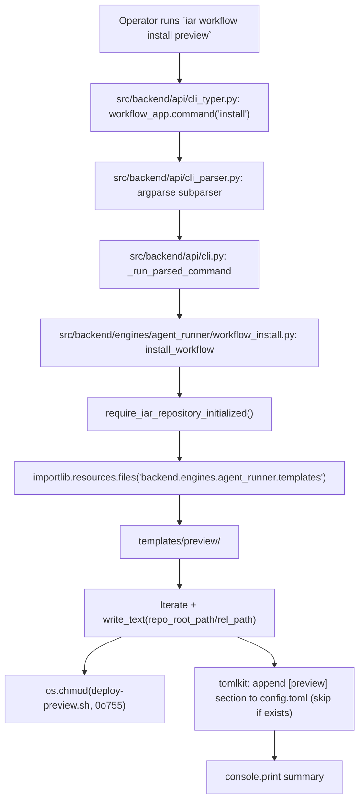

# PRD: IAR `iar workflow install` 子命令

- GitHub Issue: https://github.com/zata-zhangtao/keda/issues/92

## 1. Introduction & Goals

### Problem Statement

IAR 现在只初始化仓库级配置（`iar init` 写 `.iar.toml`）。当开发者把 IAR 接进一个新项目时，还需要手动把以下四套文件从源仓库（或文档里描述的来源）复制到目标仓库：

- `.github/workflows/deploy-preview.yml`
- `deploy/vps-traefik/`（含 `docker-compose.preview.yml`、`deploy-preview.sh`、`preview.env.example`、`README.md`）
- `scripts/preview_env.py`
- `scripts/provision_preview_server.py`

同时还要在 `config.toml` 里手写 `[preview]` 段。这一步是 onboarding 的最大摩擦点，源仓库与目标仓库之间没有自动分发机制；现有的 `scripts/template/sync_template.sh` 是从外部 git 仓库 (`zata-codes-template`) 拉取模板，跟"本仓库模板分发出去"语义相反，无法复用。

### Proposed Solution Summary

新增 IAR 子命令 `iar workflow install <name>`，从 IAR 自身 Python 包中**内嵌的模板资源**复制文件到当前 Git 仓库根目录，并在 `config.toml` 写入最小化的 `[preview]` 占位段。IAR 把模板作为 package data 与 CLI 一起发布，模板由仓库维护者签入并随版本演进；目标仓库不依赖任何外部 git 仓库或网络下载。入口是新的 Typer 子命令组 `workflow`，复用现有 `engines/agent_runner/repository_local.py` 的 `require_iar_repository_initialized` 守卫和 4 层依赖方向；不引入新数据库、新服务或新 registry daemon。系统仍只接受显式数据，不自动猜测 workflow 名——调用者必须传 `<name>`。

### Measurable Objectives

- `iar workflow install preview` 在已 `iar init` 的目标仓库中创建或覆盖以下路径，文件内容字节级与模板一致：
  - `.github/workflows/deploy-preview.yml`
  - `deploy/vps-traefik/docker-compose.preview.yml`
  - `deploy/vps-traefik/deploy-preview.sh`
  - `deploy/vps-traefik/preview.env.example`
  - `deploy/vps-traefik/README.md`
  - `scripts/preview_env.py`
  - `scripts/provision_preview_server.py`
- 在 `config.toml` 末尾追加最小化 `[preview]` 段（带 header comment 指向 README；已存在则跳过，`--force` 覆盖）。
- 已存在同名文件时拒绝覆盖，除非传 `--force`。
- `--dry-run` 模式打印将要写入的路径与字节数，不实际落盘。
- 不修改 `.iar.toml`（IAR 不需要记录已安装 workflow——workflow 由 PR 事件自然触发）。
- 不调用、不依赖 `scripts/provision_preview_server.py` 内的 `_build_preview_section`（避免把脚本 import 化）；占位段由 IAR 自身渲染，值与 `preview.env.example` 字段一致。
- 实现完成后 `just test` 全部通过，`uv run mkdocs build` 成功。

### Realistic Validation

除单元测试和集成测试外，本 PRD 要求通过**真实项目入口点**验证关键行为，确保真实使用路径生效，而非仅在隔离 fixture 中通过。

- [x] **`iar workflow install preview` 真实验证**：在一个临时 Git 仓库中先 `uv run iar init`，再 `uv run iar workflow install preview`，确认上述 7 个文件按模板字节级落地，`config.toml` 末尾出现 `[preview]` 段，且 `uv run iar workflow install preview` 二次运行（无 `--force`）以非零退出码拒绝。
- [x] **`--dry-run` 真实验证**：在同一仓库 `uv run iar workflow install preview --dry-run`，确认 7 个文件路径被打印但**无**文件落盘、`config.toml` 哈希未变。
- [x] **缺失 `.iar.toml` 守卫真实验证**：在裸临时 Git 仓库直接 `uv run iar workflow install preview`，确认报错信息提示"Run the following command from the repository root"（与 `cli.py:_handle_not_initialized_error` 实际文案一致）。
- [x] **回归门禁真实验证**：`just test` 与 `uv run mkdocs build` 在含新代码的工作树中均通过。

**为什么单元测试不够**：`workflow install` 跨 CLI 解析、Typer dispatch、package_data 资源加载、TOML 解析/追加、文件覆盖守卫、Git 仓库根探测多个真实层；任何一层 mock 化都会遗漏真实路径下的落盘与权限语义。必须用真实 `uv run iar …` 入口跑在临时 Git 仓库里。

### Delivery Dependencies

- Group: iar-onboarding
- Depends on groups:
  - none
- Depends on tasks/issues:
  - none
- Gate type: none
- Notes: 本 PRD 不依赖其它 pending/archive PRD；现有 `iar init`（archive `20260525-230847-prd-iar-repository-local-init-config.md`）是设计上被复用的能力，不是 sequencing 依赖。

---

## 2. Requirement Shape

- **Actor**：在目标仓库根目录运行 `iar` CLI 的开发者 / operator。
- **Trigger**：operator 执行 `uv run iar workflow install preview`（或将来 `<name>` 之外的其它 workflow 名）。
- **Expected Behavior**：
  - 检测当前 Git 仓库根；找不到则报错退出。
  - 校验 `.iar.toml` 存在；缺失则提示 `iar init` 并非零退出。
  - 从内嵌 package 资源复制模板文件到仓库根的相对路径，保留可执行位（`deploy-preview.sh` 需 0755）。
  - 已存在的目标文件：默认拒绝；`--force` 同时覆盖已存在的模板文件与 `config.toml [preview]` 段并打印提示。
  - `--dry-run` 全程不落盘，只打印"will write"清单。
  - 不修改 `.iar.toml`、不调用 GitHub API、不修改 Git 远程配置。
- **Explicit Scope Boundary**：
  - v1 只支持 `preview` workflow 名；其它名字返回 `Unknown workflow: <name>` 错误。
  - 不执行服务器端 provisioning（那是 `scripts/provision_preview_server.py` 的职责，独立运行）。
  - 不自动 `git add` / `git commit` 任何落盘文件。
  - 不向 `config.toml` 注入 `ghcr.io` / `domain` 等具体配置值；写占位段让用户自己改。

---

## 3. Repository Context And Architecture Fit

### Current relevant modules/files

- `src/backend/api/cli.py`（`_run_parsed_command` 在 290 行起）：所有子命令的 dispatch 入口；init 在 306-344 行。
- `src/backend/api/cli_parser.py`：argparse 子命令注册；init 走 typer wrapper，底层最终落到 `cli.py`。
- `src/backend/api/cli_typer.py`（65-80 行）：现有 Typer 子命令组（`labels_app`、`issue_app`、`worktree_app`、`registry_app`、`completion_app`）；新 `workflow_app` 应当并列。
- `src/backend/engines/agent_runner/repository_local.py`（474 行起 `initialize_repository_local_config`、50 行起 `require_iar_repository_initialized`）：现成的 Git 仓库根探测与 `.iar.toml` 守卫，是新功能的复用基础。
- `src/backend/engines/agent_runner/`：现有引擎层子模块目录；新模块 `workflow_install.py` 应放此处。
- `pyproject.toml`（`[tool.setuptools.packages.find]` 节）：当前未声明 `package-data`；新增 `template_files` 资源必须补上。
- `scripts/provision_preview_server.py`（1169 行起 `_build_preview_section`）：当前是脚本内私有函数；本 PRD **不** import 它，只渲染等价占位段。
- `deploy/vps-traefik/`、`scripts/preview_env.py`、`scripts/provision_preview_server.py`、`.github/workflows/deploy-preview.yml`：被分发的源文件。
- `tasks/archive/20260525-230847-prd-iar-repository-local-init-config.md`：定义 `iar init` 的范式（Git 根探测 + `.iar.toml` 守卫 + 引擎层写文件 + CLI 入口分发）；本 PRD 复用同一范式。

### Existing architecture pattern to follow

- **4 层依赖方向**（`api/ → core/ → engines/ → infrastructure/`）：新模块落 `engines/agent_runner/workflow_install.py`；CLI dispatch 落 `api/cli.py` 与 `api/cli_typer.py`；不引入新层。
- **引擎层处理 I/O 协调**（参考 `repository_local.py`）：探测 + 写文件 + 守卫全部在 `engines/agent_runner/`；`core/` 保持纯逻辑（本功能无 core 用例）。
- **Typer 子命令组 + argparse 桥接**（参考 `labels_app` / `issue_app`）：`workflow_app` 同模式；最终通过 `_run_parsed_command` 分发。
- **Git 仓库根探测 + `.iar.toml` 守卫**（参考 `repository_local.py` 50-67 行 `require_iar_repository_initialized`）：新功能直接 `require_iar_repository_initialized`，不再写自己的守卫。

### Ownership and dependency boundaries

- `api/` 接收子命令、调用 engine；不直接做文件 I/O。
- `engines/agent_runner/workflow_install.py` 协调 infrastructure 的文件读取（`importlib.resources`）与目标仓库的文件写入。
- `core/` 不变；本功能无 core 用例。
- `infrastructure/` 不变；唯一新增是 `pyproject.toml` 的 `package-data` 声明。
- `workflow install` 不 import `scripts/provision_preview_server.py`；两者共享 TOML 字段约定但无 Python 依赖。

### Constraints from runtime, docs, tests, workflows

- `pyproject.toml` 必须补 `[tool.setuptools.package-data]` 让模板随 wheel/sdist 发布。
- Python 文本文件 I/O 必须 `encoding="utf-8"`（项目规范）。
- `deploy-preview.sh` 落地时需保留执行权限（模板内 `0755`，scp/copy 后不丢）。
- 新增模块非空行 ≤ 1000 行（项目 lint 规则）。
- 公共函数需 Google style docstring（项目规范）。
- 变更后必须 `just test` 通过（CLAUDE.md 强制项）。
- 文档同步更新到 `docs/guides/agent-runner.md` 与 `README.md`（CLAUDE.md 强制项）。
- `mkdocs.yml` 在引入新文档节时需同步。

### Matching or related PRDs found in `tasks/pending/` and `tasks/archive/`

- `tasks/pending/P2-FEAT-20260528-110730-prd-deliberation-review.md`：内容是 PRD 多 agent review，与本 PRD 无关。
- `tasks/archive/20260525-230847-prd-iar-repository-local-init-config.md`：**复用**其设计模式（不是依赖），本 PRD 是它的对偶——`iar init` 写 IAR 自己的配置，本 PRD 写 IAR 协作所需的工程文件。
- `tasks/archive/20260616-??????-prd-preview-deployment.md`（实际在 `deploy/vps-traefik/` 与 `.github/workflows/deploy-preview.yml` 的 commit log 里）：本 PRD 分发的就是这套文件，不是另一份 PRD 的依赖。
- 结论：**没有重复，没有 hard sequencing 依赖**。本 PRD 可独立推进。

---

## 4. Recommendation

### Recommended Approach

新增 `iar workflow install <name>` 子命令，模板以 package_data 形式内嵌在 Python 包中。

核心机制：

1. **模板分发**：在 `src/backend/engines/agent_runner/templates/preview/` 下放置与源仓库同构的 7 个文件（4 个 deploy/vps-traefik/ 文件、1 个 workflow YAML、2 个 scripts Python 文件），加 `pyproject.toml` 的 `[tool.setuptools.package-data]` 让 setuptools 打包。
2. **运行时读取**：`importlib.resources.files("backend.engines.agent_runner.templates").joinpath("preview").iterdir()` 拿到源根目录，逐文件 `read_text(encoding="utf-8")`。
3. **落地逻辑**：相对仓库根路径，参考 `repository_local.py.initialize_repository_local_config` 的"已存在拒绝 / `--force` 覆盖 / `--dry-run` 不写盘"三态。
4. **config.toml 占位段**：在 IAR 内部用 `tomlkit` 拼接一段（`tomlkit` 已在 `pyproject.toml` dependencies 中），不在 `provision_preview_server.py` 共享；**字段名从 `backend.infrastructure.config.settings.PreviewSettings.model_fields` 派生**，字段值统一为 `"<set-me>"` 占位符。**禁止在 IAR 中硬编码字段清单**（与 `feedback-avoid-hardcoding` 记忆一致：`PreviewSettings` 是项目权威源，README 是它的视图）。段顶渲染一行 header comment（`# Preview deployment (placeholder values — see deploy/vps-traefik/README.md)`），告诉用户在哪里找字段说明；**不**做 per-field 注释（避免扩展 `PreviewSettings` 引入 `Field(description=...)` 的范围溢出）。
5. **守卫**：直接 `require_iar_repository_initialized(repo_root_path, process_runner)`；未 init 报错并提示运行 `iar init`。
6. **CLI 形态**：Typer 子命令组 `workflow`，子命令 `install` 接 `<name>` 位置参数 + `--force` / `--dry-run` 两个 flag；通过 `_run_typer_command` 桥接到 `cli.py` 的 dispatch。**`--force` 同时覆盖已存在的模板文件和 `config.toml [preview]` 段**（合并旧 `--force-config` 的语义，单一 flag 涵盖所有"已存在默认跳过"的场景，与 init `--force` 一致）。
7. **范围收紧**：v1 只支持 `preview`；其它 `<name>` 直接报错。`iar workflow list` 等扩展命令留作后续 PRD（避免 YAGNI）。

### Why this is the best fit for the current architecture

- **复用 `require_iar_repository_initialized` 与 `SubprocessRunner`**：避免重写 Git 仓库根探测、避免新依赖。
- **复用 `_run_parsed_command` 模式**：CLI 入口与 init 完全对称（Typer wrapper → argparse namespace → dispatch → engine call → console print）。
- **复用 4 层依赖方向**：新代码只落在 `engines/agent_runner/`（逻辑）+ `api/`（CLI 入口），不引入平行层。
- **不依赖 `scripts/provision_preview_server.py` 内的私有函数**：避免 import 化一个 CLI 脚本（脚本的 argparse 入口会被 import 副作用触发）；占位段独立渲染，**字段名派生自 `PreviewSettings.model_fields`**，README / `_build_preview_section` / 实际 settings 三者以 settings 为唯一权威源。
- **不引入新数据库 / 新服务 / 新 registry**：状态就是文件系统，遵循 init PRD 的 "no-op server, no central registry" 原则。

### Rationale for rejecting redundant abstractions

- **不写 `workflows` 字段到 `.iar.toml`**：IAR 没有 consumer 需要知道装了哪些 workflow；workflow 由 GitHub PR 事件自然触发。新增字段会引入"已装但 IAR 不知道"的失效模式。
- **不创建 `install` 之外的子命令（`list` / `uninstall` / `update`）**：v1 没有真实需求；按 YAGNI 推迟。
- **不做 interactive prompt**：与 `iar init` 风格一致；非交互脚本友好。
- **不复用 `scripts/template/sync_template.sh`**：那个是从外部 `zata-codes-template` 拉的，方向相反；强行复用会让 IAR 依赖外部 git 仓库，分发语义破坏。

### Alternatives Considered

| 备选方案 | 拒绝原因 |
|---|---|
| 从当前 IAR checkout 直接读 `deploy/vps-traefik/` 等路径 | `iar` 装到其它机器（如 PyPI 安装）后这些路径不存在；只对开发者本地 checkout 有效，对终端用户破。 |
| 把 7 个文件内嵌为 Python 字符串常量 | 可读性差（YAML/shell 转义 + 长 Python 字符串），diff 噪声大，编辑时易出错；package_data 是标准做法。 |
| 调用 `provision_preview_server.py` 子进程写 `config.toml [preview]` | 异步 shell 调用增加复杂度；目标仓库甚至可能还没 `provision_preview_server.py`（鸡生蛋）；占位段在 IAR 内独立渲染更简单。 |
| 把 `provision_preview_server.py` 拆模块并 import `_build_preview_section` | 改动 `scripts/provision_preview_server.py` 让其成为可 import 模块（拆 argparse main），范围溢出本 PRD；占位段与正式段字段一致即可，无需共享 Python 函数。 |
| 自动 `git add` + 提示 commit | CLAUDE.md 明确禁止自动 `git add`；越界。 |
| 一次性把 init 与 workflow install 合并为 `iar init --with preview` | init PRD 的设计选择是"窄"——保持原样不被拖累；用户分两步调用更清晰。 |

---

## 5. Implementation Guide

> This section is a living implementation guide based on current repository analysis. If implementation discovers additional affected files, hidden dependencies, edge cases, or a better path, update this PRD before proceeding.

### Core Logic

1. **添加 package_data（wheel + sdist 双覆盖）**：`pyproject.toml` 增加 `[tool.setuptools.package-data]` 节，明确 `backend.engines.agent_runner.templates = ["**/*"]`，让 setuptools 把模板目录打进 wheel；**同时**设置 `[tool.setuptools] include_package_data = true` 并新增 `MANIFEST.in` 包含 `recursive-include src/backend/engines/agent_runner/templates *`，让 sdist 路径下模板也能被 `importlib.resources` 发现（Realistic Validation Plan 行 9 验 wheel，行 10 验 sdist）。
2. **复制模板到引擎层**：把以下源文件原样复制到 `src/backend/engines/agent_runner/templates/preview/`：
   - `.github/workflows/deploy-preview.yml` → `templates/preview/.github/workflows/deploy-preview.yml`
   - `deploy/vps-traefik/README.md` → `templates/preview/deploy/vps-traefik/README.md`
   - `deploy/vps-traefik/docker-compose.preview.yml` → `…`
   - `deploy/vps-traefik/deploy-preview.sh` → `…`（保留 0755）
   - `deploy/vps-traefik/preview.env.example` → `…`
   - `scripts/preview_env.py` → `…`
   - `scripts/provision_preview_server.py` → `…`
2a. **同步 README 字段表**：把 `deploy/vps-traefik/README.md` 第 35-45 行的字段列表补齐 `enabled`（`PreviewSettings` 已有该字段，README 当前漏列），让字段数与 `PreviewSettings.model_fields` 对齐；不在其它地方改 README。
3. **写 `WorkflowInstallOptions` 与 `install_workflow`**：在 `src/backend/engines/agent_runner/workflow_install.py` 定义 `WorkflowInstallOptions(cwd, name, force, dry_run, force_config)` 与 `WorkflowInstallResult`；`install_workflow(options, process_runner)` 协调：
   - `repo_root_path = detect_git_repository_root(options.cwd, process_runner)`
   - `require_iar_repository_initialized(repo_root_path, process_runner)`
   - `template_root = importlib.resources.files("backend.engines.agent_runner.templates").joinpath(options.name)`
   - 若 `template_root` 不存在 → 抛 `ValueError(f"Unknown workflow: {options.name}")`
   - 遍历 `template_root` 树，路径相对映射到 `repo_root_path`；目标已存在则按 `options.force` 决策
   - `deploy-preview.sh` 落地后 `os.chmod(path, 0o755)`
   - `config.toml` 段：若 `repo_root_path/config.toml` 不存在则提示 "no config.toml; skipping [preview] section" 并继续（不抛异常、不返回非零）；存在则用 `tomlkit` 解析，**解析失败时按 FR-11 跳过**；检查顶层已有 `preview` 键则按 `options.force` 决策（`--force` 时**整体替换**子树而非合并）；否则追加占位段
   - 占位段字段集合：`from backend.infrastructure.config.settings import PreviewSettings; fields = list(PreviewSettings.model_fields.keys())`，渲染时循环 `fields` 写入 `key = "<set-me>"`；不要在此函数或模块其它位置硬编码字段名字符串。**段顶追加一行 header comment**（`# Preview deployment (placeholder values — see deploy/vps-traefik/README.md)`），告诉用户看哪里。
4. **Typer 入口**：在 `cli_typer.py` 增加 `workflow_app = typer.Typer(help="Install and manage bundled workflow templates.")` 并 `app.add_typer(workflow_app, name="workflow")`；子命令 `workflow_app.command("install")` 接 `name: str`、`--force`、`--dry-run`；**镜像 init 的 selector 模式**：在命令体内显式 `selector_options = _typer_selector_options(ctx, repo=None, repo_id=None, config=None)`（即使 `workflow install` 不需要 repo selector，也要走这一步以让全局 `--repo` / `--repo-id` / `--config` 流入 `parsed` 字段），然后 `_run_typer_command("workflow install", **selector_options, ...)`。
5. **argparse 桥接**：在 `cli_parser.py` 注册 `workflow` 子解析器，行为对齐 Typer 表面（含 `repo` / `repo_id` / `config` 三个全局 flag 字段，让 `parsed` 上能拿到，dispatch 层做 reject）。
6. **dispatch**：在 `api/cli.py` 的 `_run_parsed_command` 中新增 `if parsed.command == "workflow install":` 分支；**先镜像 init 306-311 行的 reject 守卫**——`if parsed.repo_id is not None or parsed.repo is not None or parsed.config is not None:` 时 stderr 打印 `"iar workflow install uses the current Git repository; omit --repo/--repo-id/--config"` 并返回非零（不写任何文件）；然后调用 `install_workflow(WorkflowInstallOptions(...), process_runner)`。
7. **文档同步**：更新 `docs/guides/agent-runner.md` 增"Workflow Templates"节，`README.md` 在 `iar` 快速开始列表增加 `iar workflow install preview`，`mkdocs.yml` 在 nav 中暴露新节；更新 `deploy/vps-traefik/README.md` 字段表加 `enabled`（步骤 2a）。
7a. **CI drift 门禁**：在 `justfile` 新增 `check-template-drift` recipe：递归比对 `src/backend/engines/agent_runner/templates/preview/` 与源路径（`deploy/`、`scripts/preview_env.py`、`scripts/provision_preview_server.py`、`.github/workflows/deploy-preview.yml`、`deploy/vps-traefik/README.md`），不一致以非零退出。挂到 `just lint` 之后、`just test` 之前——把 §10 R-1 的"过程性承诺"升级成工程门禁。
8. **测试**：新增 `tests/test_agent_runner_workflow_install.py`，覆盖 dry-run、force（含同时覆盖模板文件和 `config.toml` 段）、未知 name、缺失 `.iar.toml` 守卫、`PreviewSettings` 派生字段集合与 `deploy/vps-traefik/README.md` 一致（README 列表含 `enabled`）；同步扩展 `tests/test_agent_runner_cli.py` 覆盖子命令解析与全局 flag reject。**注意**：现有 `tests/test_agent_runner_workflow.py` 跑的是 agent-runner 状态机（`core/use_cases/agent_runner_workflow.py`），与本次新文件职责不同，无需改动。

### Change Impact Tree

```text
.
├── pyproject.toml
│   [修改]
│   【总结】新增 package-data 声明让 setuptools 把 templates/ 目录打进 wheel + sdist
│
│   ├── 新增 [tool.setuptools.package-data] 节，把 backend.engines.agent_runner.templates 全量纳入
│   └── 新增 [tool.setuptools] include_package_data = true（sdist 也带模板）
│
├── MANIFEST.in
│   [新增]
│   【总结】显式声明递归打包 templates/，补足 sdist 包含
│
│   └── recursive-include src/backend/engines/agent_runner/templates *
│
├── src/backend/engines/agent_runner/
│   ├── workflow_install.py
│   │   [新增]
│   │   【总结】新子命令的引擎层实现：Git 根探测、模板拷贝、config.toml 段追加
│   │
│   │   ├── 定义 WorkflowInstallOptions / WorkflowInstallResult dataclass
│   │   ├── 实现 install_workflow(options, process_runner) 编排
│   │   ├── 用 importlib.resources.files() 读 package 内嵌模板
│   │   ├── 用 tomlkit 解析与追加 [preview] 段；占位字段名派生自 PreviewSettings.model_fields
│   │   ├── 解析 config.toml 失败时按 FR-11 跳过占位段写入
│   │   └── 复用 require_iar_repository_initialized 守卫
│   │
│   └── templates/preview/
│       [新增]
│       【总结】把源仓库 7 个文件原样复制为内嵌模板资源
│
│       ├── .github/workflows/deploy-preview.yml
│       ├── deploy/vps-traefik/README.md
│       ├── deploy/vps-traefik/docker-compose.preview.yml
│       ├── deploy/vps-traefik/deploy-preview.sh  (chmod 0755)
│       ├── deploy/vps-traefik/preview.env.example
│       ├── scripts/preview_env.py
│       └── scripts/provision_preview_server.py
│
├── src/backend/api/
│   ├── cli_typer.py
│   │   [修改]
│   │   【总结】新增 workflow Typer 子命令组 + install 子命令
│   │
│   │   ├── 新增 workflow_app Typer 实例
│   │   ├── app.add_typer(workflow_app, name="workflow")
│   │   └── workflow_app.command("install") 接收 name / --force / --dry-run
│   │
│   ├── cli_parser.py
│   │   [修改]
│   │   【总结】同步 argparse 子解析器以匹配 Typer 表面
│   │
│   └── cli.py
│       [修改]
│       【总结】在 _run_parsed_command 中分发 workflow install 到 engine.install_workflow
│
│       └── 新增 `if parsed.command == "workflow install":` 分支
│
├── tests/
│   ├── test_agent_runner_workflow_install.py
│   │   [新增]
│   │   【总结】覆盖 dry-run、force（含 config 段）、未知 name、缺 .iar.toml、文件覆盖拒绝
│   │
│   └── test_agent_runner_cli.py
│       [修改]
│       【总结】覆盖 workflow install 的 CLI 解析与 dispatch
│
├── docs/guides/
│   └── agent-runner.md
│       [修改]
│       【总结】新增"Workflow Templates"节，描述 iar workflow install 用法与模板维护约定
│
├── deploy/vps-traefik/
│   └── README.md
│       [修改]
│       【总结】字段表补 `enabled`，与 PreviewSettings.model_fields 对齐
│
├── README.md
│   [修改]
│   【总结】在 iar 快速开始列表中加 iar workflow install preview
│
├── mkdocs.yml
│   [修改]
│   【总结】在 nav 中暴露新增的 Workflow Templates 文档节
│
└── justfile
    [修改]
    【总结】新增 check-template-drift recipe 并挂入 lint/test 流水线
```

**注意**：上面是起点而非穷举清单。隐藏引用排查见 Executor Drift Guard。

### Executor Drift Guard

模板文件复制是本 PRD 最容易出 drift 的环节（源仓库与内嵌模板脱节）。executor 应当：

- **复制后比对**：在 PR 描述里附 `diff -r src/backend/engines/agent_runner/templates/preview/ deploy/ scripts/preview_env.py scripts/provision_preview_server.py .github/workflows/deploy-preview.yml` 的输出，让 reviewer 一眼看到两份一致。
- **CI 门禁**：`just check-template-drift`（步骤 7a）在 CI 跑，源文件与 `templates/preview/` 不一致即失败——把"实现者记得同步"从口头承诺升级为可执行的工程约束。
- **README 也纳入 drift 检查**：字段表行数与 `PreviewSettings.model_fields` 不一致即失败；README 改字段时模板侧的 README 副本必须同步。
- **搜索可能的隐藏引用**：
  - `rg -n "deploy-preview" .github/ docs/ scripts/ src/` 找源仓库是否还有别处提到该 workflow
  - `rg -n "preview.env.example\|preview_env.py\|provision_preview_server.py" docs/ src/` 找文档/代码内对模板源文件的引用
  - `rg -n "scripts/provision_preview_server" src/ tests/` 确保没有被 import（本 PRD 明确不 import）
- **配置键名漂移**：`config.toml [preview]` 字段名以 `backend.infrastructure.config.settings.PreviewSettings.model_fields` 为权威源，`deploy/vps-traefik/README.md` 是它的视图；占位段字段必须与 `PreviewSettings` 完全一致，README 字段表必须与 `PreviewSettings` 一致（CI `check-template-drift` 检查）。
- **CHANGELOG 提示**：未来若源仓库模板演进，需要有约定把变化同步进 `templates/preview/`。本 PRD 不强制引入 CHANGELOG，但建议实现者在 PR 描述里写明。

### Flow or Architecture Diagram



### Realistic Validation Plan

| 行为 | 真实入口 | 测试层级 | Mock 边界 | 数据/环境要求 | 命令或流程 | 是否验收必需 |
|---|---|---|---|---|---|---|
| `iar workflow install preview` 落地 7 个文件 + 追加 [preview] 段 | `uv run iar workflow install preview` | CLI smoke / integration | 真实文件系统 + 真实 Git 仓库；无外部 mock | 临时 Git 仓库（`git init` + 远程占位 remote + `uv run iar init`） | `cd $(mktemp -d) && git init -q && git remote add origin git@x:x/x.git && uv run iar init && uv run iar workflow install preview && ls -la .github/workflows deploy/vps-traefik scripts && tail -20 config.toml` | 是 |
| 二次运行（无 --force）拒绝 | `uv run iar workflow install preview` | Integration | 同上 | 同上 | 接上一行：`uv run iar workflow install preview; echo $?` 应输出非零 | 是 |
| `--dry-run` 不落盘 | `uv run iar workflow install preview --dry-run` | Integration | 同上 | 同上 | 接上一行：`uv run iar workflow install preview --dry-run && md5sum config.toml .github/workflows/deploy-preview.yml` 与 dry-run 前一致 | 是 |
| 缺 `.iar.toml` 守卫 | `uv run iar workflow install preview`（裸 Git 仓库） | Integration | 真实 | 临时 Git 仓库（不跑 init） | `cd $(mktemp -d) && git init -q && uv run iar workflow install preview; echo $?` 应非零且 stderr 含 "Run the following command from the repository root"（与 `cli.py:_handle_not_initialized_error` 实际文案一致） | 是 |
| 未知 name 报错 | `uv run iar workflow install does-not-exist` | Integration | 真实 | 已 init 临时 Git 仓库 | 接 init 行后：`uv run iar workflow install does-not-exist; echo $?` 应非零且 stderr 含 "Unknown workflow" | 是 |
| 模板与源仓库字节级一致 | 文件比对 | 文件校验 | 无 | 真实 | `diff -r src/backend/engines/agent_runner/templates/preview/.github/workflows deploy/vps-traefik scripts/preview_env.py scripts/provision_preview_server.py .github/workflows/deploy-preview.yml deploy/` 应为空 | 是 |
| 文档构建通过 | `uv run mkdocs build` | Docs | 无 | 工作树 | `uv run mkdocs build` | 是 |
| 全量回归门禁 | `just test` | Full | 项目既有 mocks | 正常开发环境 | `just test` | 是 |
| 打包后模板可被发现（wheel） | wheel 内含 templates | 打包验证 | 真实打包 | 临时 venv | `uv build && uv pip install dist/*.whl --target /tmp/iar-wheel-test && python -c "from importlib.resources import files; print(list(files('backend.engines.agent_runner.templates').iterdir()))"` | 是 |
| 打包后模板可被发现（sdist） | sdist 内含 templates | 打包验证 | 真实打包 | 临时 venv | `uv build --sdist && uv pip install dist/*.tar.gz --target /tmp/iar-sdist-test && python -c "from importlib.resources import files; print(list(files('backend.engines.agent_runner.templates').iterdir()))"` | 是 |
| 模板 drift CI 门禁 | `just check-template-drift` | CI | 无 | 工作树 | `just check-template-drift` 在工作树与同步源一致时退出 0 | 是 |
| `--force` 同时覆盖模板与 `[preview]` 段 | `uv run iar workflow install preview --force`（在已有文件 + 已有 `[preview]` 段仓库） | Integration | 真实 | 已 init 临时 Git 仓库先 install 一次再改 config.toml 加 `[preview]` | 接首次 install 后：`uv run iar workflow install preview --force` 应退出 0 且 7 个文件被覆盖 + `[preview]` 段子树被替换为占位段 | 是 |
| 全局 flag reject | `uv run iar workflow install preview --repo /tmp/foo` | Integration | 真实 | 已 init 临时 Git 仓库 | 命令应非零退出且 stderr 含 "iar workflow install uses the current Git repository"；7 个文件**不**落盘 | 是 |

**Live / 外部服务依赖**：本 PRD 全部真实入口都在本地，不需要 GitHub 凭证、服务器或 registry 凭证。

**失败排查要点**：

- 若 `importlib.resources.files(...)` 报 `FileNotFoundError`：检查 `pyproject.toml` 的 `package-data` 是否漏写。
- 若落地路径不对（如落在 `cwd` 而非 git 根）：检查 `detect_git_repository_root` 返回值（参考 `repository_local.py`）。
- 若 `config.toml` 解析失败：检查 `tomlkit` 版本（已在 `pyproject.toml` dependencies 中）；若有格式错误，先 `tomlkit.loads()` 容错回退。

### Low-Fidelity Prototype

不需要 UI 原型；本变更只涉及 CLI 行为。

### ER Diagram

No data model changes in this PRD.

### Interactive Prototype Change Log

No interactive prototype file changes in this PRD.

### External Validation

No external validation required; repository evidence was sufficient.

---

## 6. Definition Of Done

- 实现完成：
  - 新增 `src/backend/engines/agent_runner/workflow_install.py` 与 `src/backend/engines/agent_runner/templates/preview/` 下 7 个文件
  - 修改 `pyproject.toml`（package-data + include_package_data）、新增 `MANIFEST.in`、修改 `cli_typer.py` / `cli_parser.py` / `cli.py` 三处入口
  - 修改 `deploy/vps-traefik/README.md` 字段表加 `enabled`
  - 新增 `just check-template-drift` recipe 并接入 lint/test 流水线
  - 新增 `tests/test_agent_runner_workflow_install.py`，扩展 `tests/test_agent_runner_cli.py`
- 真实入口验证：上述 Realistic Validation Plan 的 9 行全部通过
- 文档更新：`docs/guides/agent-runner.md` 新增"Workflow Templates"节，`README.md` 快速开始加一行，`mkdocs.yml` nav 同步
- 无回归：`just test` 全绿；`uv run mkdocs build` 成功；`just lint` 不报新警告
- 架构适配检查：`rg -n "from scripts\." src/` 应为空（确认未 import provision_preview_server.py）；`rg -n "package_data" pyproject.toml` 应有命中
- 交付门禁：本 PRD 全部 Acceptance Checklist 条目打勾后归档至 `tasks/archive/`

---

## 7. Acceptance Checklist

### Architecture Acceptance

- [x] 新代码全部落在 `engines/agent_runner/` 与 `api/`；未引入新层
- [x] 未 import `scripts/provision_preview_server.py`（`rg -n "from scripts|import scripts" src/backend/` 为空）
- [x] 4 层依赖方向未被破坏（`engines/agent_runner/workflow_install.py` 不 import `api/`；`infrastructure/` 不被新代码依赖）
- [x] `pyproject.toml` 的 `[tool.setuptools.package-data]` 已声明 `backend.engines.agent_runner.templates`
- [x] `pyproject.toml` 含 `[tool.setuptools] include_package_data = true` 且 `MANIFEST.in` 已声明 `recursive-include src/backend/engines/agent_runner/templates *`，确保 sdist 路径下模板仍可被 `importlib.resources` 发现
- [x] `[preview]` 占位段字段名派生自 `backend.infrastructure.config.settings.PreviewSettings.model_fields`，IAR 中无硬编码字段清单（`rg -n "base_domain|project_slug" src/backend/engines/agent_runner/workflow_install.py` 应只在 `PreviewSettings` 导入附近出现一次，不应有字段名重复罗列）
- [x] `deploy-preview.sh` 落地后保持 `0755` 权限

### Dependency Acceptance

- [x] 无新外部依赖（`tomlkit` 与 `importlib.resources` 已在依赖图中）
- [x] 模板文件不通过 git submodule / 外部 URL 拉取

### Behavior Acceptance

- [x] `uv run iar workflow install preview` 在已 init 仓库中创建 7 个路径，文件字节级与源仓库一致
- [x] 已存在的目标文件拒绝覆盖（exit code ≠ 0）
- [x] `--force` 覆盖已有文件并打印提示
- [x] `--dry-run` 不落盘，仅打印 "will write" 清单
- [x] `config.toml` 末尾追加最小化 `[preview]` 段（带 header comment 指向 README）；已存在则跳过；`--force` 同时覆盖已存在文件与 `[preview]` 段
- [x] 未知 `<name>` 返回 `Unknown workflow: <name>` 并非零退出
- [x] 缺 `.iar.toml` 时报错并提示 `iar init`，非零退出
- [x] 收到 `--repo` / `--repo-id` / `--config` 任意一个全局 flag 时，dispatch 层 reject 并非零退出，文件不落盘（FR-12）
- [x] 当 `config.toml` 无法被 `tomlkit` 解析时，打印 warning 并跳过 `[preview]` 段写入，其余 7 个文件按既定逻辑继续（FR-11）
- [x] 不修改 `.iar.toml`、不调用 GitHub API、不 `git add`

### Documentation Acceptance

- [x] `docs/guides/agent-runner.md` 新增"Workflow Templates"节，含 `iar workflow install preview` 用法与模板维护说明
- [x] `README.md` 在 `iar` 快速开始列表中加 `iar workflow install preview`
- [x] `mkdocs.yml` 的 nav 暴露新节
- [x] `uv run mkdocs build` 通过

### Validation Acceptance

- [x] 真实入口：`uv run iar init` + `uv run iar workflow install preview` 在临时 Git 仓库中落地 7 个文件，`diff` 与源仓库一致
- [x] 真实入口：缺 `.iar.toml` 时 `uv run iar workflow install preview` 报错并提示 `iar init`
- [x] 真实入口：`uv run iar workflow install preview --dry-run` 不修改任何文件
- [x] 真实入口：未知 name 报错退出
- [x] 真实入口：`--force` 在已存在 7 文件 + 已存在 `[preview]` 段时同时覆盖两者
- [x] 真实入口：全局 `--repo` / `--repo-id` / `--config` 任一被 reject 且不落盘
- [x] 打包验证：`uv build` 后 `importlib.resources.files('backend.engines.agent_runner.templates')` 可枚举模板
- [x] Drift 门禁：`just check-template-drift` 在工作树与同步源一致时退出 0
- [x] 全量门禁：`just test` 通过；`just lint` 无新增警告
- [x] 字节级一致：`diff -r src/backend/engines/agent_runner/templates/preview/.github/workflows deploy/vps-traefik scripts/preview_env.py scripts/provision_preview_server.py .github/workflows/deploy-preview.yml deploy/` 为空
- [x] `[preview]` 占位段字段集合（`PreviewSettings.model_fields.keys()`，共 10 个含 `enabled`）与 `deploy/vps-traefik/README.md` 第 35-45 行的字段名集合完全一致

---

## 8. Functional Requirements

- **FR-1**：`iar workflow install <name>` 必须在已 `iar init` 的当前 Git 仓库中工作，缺失 `.iar.toml` 时非零退出并提示 `iar init`。
- **FR-2**：`<name>` v1 仅接受 `preview`；其它值返回非零退出与 `Unknown workflow: <name>`。
- **FR-3**：命令必须把 7 个模板文件复制到仓库根的对应相对路径；复制内容字节级与源仓库文件一致。
- **FR-4**：复制目标已存在时默认拒绝；`--force` 覆盖并打印被覆盖路径清单。
- **FR-5**：`--dry-run` 全程不落盘（包括 `config.toml` 追加），但仍打印完整 "will write" 清单并通过所有非文件副作用的校验。
- **FR-6**：在 `config.toml` 末尾追加最小化 `[preview]` 段，**字段名从 `backend.infrastructure.config.settings.PreviewSettings.model_fields` 派生**，字段值为占位符（如 `base_domain = "<set-me>"`）。**禁止在 IAR 代码中硬编码字段名清单**（与 `feedback-avoid-hardcoding` 记忆一致）。段顶追加一行 header comment（`# Preview deployment (placeholder values — see deploy/vps-traefik/README.md)`）指引用户；本 PRD 不做 per-field 注释。本 PRD 同时承担 `deploy/vps-traefik/README.md` 第 35-45 行字段表补 `enabled` 的文档同步（与 `PreviewSettings` 对齐），以保证字段集合的单一权威源表述一致。
- **FR-7**：`config.toml` 已含 `preview` 顶层键时默认跳过追加；`--force` 强制用占位段**整体替换**该子表（tomlkit 替换 `preview` 子树，旧键全部清空；stderr 打印 `[yellow]Overwrote existing [preview] section[/]` 警告），不合并用户旧值。`--force` 同时覆盖已存在的模板文件（语义合并自旧的 `--force-config`）。
- **FR-8**：`deploy-preview.sh` 落地后必须保留 `0755` 权限（用 `os.chmod` 显式设置，不依赖 shutil 默认值）。
- **FR-9**：命令不调用任何外部网络（不连 GitHub、不连服务器、不连 registry）。
- **FR-10**：命令不修改 `.iar.toml`、不执行 `git add` / `git commit`、不修改 Git remote。
- **FR-11**：`tomlkit` 解析 `config.toml` 失败时，stderr 打印 `[yellow]config.toml 解析失败，跳过 [preview] 段写入[/]`，跳过占位段写入（不抛异常、不返回非零退出码），其余 7 个文件按既定逻辑继续落盘或拒绝。占位段写入是 best-effort，不允许因为它失败而拒绝整次 install。
- **FR-12**：命令收到 `--repo` / `--repo-id` / `--config` 三个全局 flag 之一时，**镜像 `iar init` 的拒绝行为**（参考 `src/backend/api/cli.py:307-311`）：stderr 打印明确错误（"iar workflow install uses the current Git repository; omit --repo/--repo-id/--config"），返回非零退出码，不写任何文件。

---

## 9. Non-Goals

- 不支持 `preview` 之外的 workflow 名称在 v1 安装（错误提示而非静默忽略）。
- 不实现 `iar workflow list` / `iar workflow uninstall` / `iar workflow update`（YAGNI，留待后续 PRD）。
- 不执行服务器端 `provision_preview_server.py` 的 VPS 引导（那是独立命令，operator 在自己的机器上跑）。
- 不自动 `git add` 与 `git commit`（CLAUDE.md 禁止；operator 自行决定何时提交）。
- 不读取 `config.toml [preview]` 已有值去渲染占位段（避免 import 化 `provision_preview_server.py`）。
- 不修改源仓库的 7 个文件本身；模板复制是单向的"分发"，不允许反向 sync 回源。
- 不在 `.iar.toml` 引入 `workflows` 字段（IAR 不需要记录已装 workflow）。
- 不支持 dry-run 之外的"先看 diff 再应用"交互模式（与 `iar init` 风格对齐）。
- 不支持安装到非当前 Git 仓库（`--repo` flag 不接受；与 `iar init` 一致）。

---

## 10. Risks And Follow-Ups

- **R-1：源仓库与内嵌模板 drift**：源仓库修改 `deploy/vps-traefik/` 等文件后，`templates/preview/` 内嵌副本不会自动同步；`deploy/vps-traefik/README.md` 字段表与 `PreviewSettings.model_fields` 也可能脱节。**缓解**：新增 `just check-template-drift` recipe（含 README 字段表与 `PreviewSettings` 一致性检查），挂入 lint/test 流水线，drift 在 CI 即可被拦下，不依赖 reviewer 记忆或实现者自觉。**Follow-up**：未来可加 `iar workflow sync` 反向检查或 `pre-commit` 钩子。
- **R-2：模板路径泄漏**：`templates/preview/.github/workflows/...` 嵌套路径若被 `package_data` 通配符漏掉，wheel 不会包含。**缓解**：实现后用 `uv build` + `python -c "importlib.resources..."` 验证（见 Realistic Validation Plan）。**Follow-up**：CI 加打包后自检。
- **R-3：`config.toml` 格式被破坏**：用户现有 `config.toml` 若非标准 TOML（注释、复杂结构），`tomlkit` 应能保留原样；极小概率失败。**缓解**：用 `tomlkit`（保持注释）而非手写字符串拼接；解析失败时按 FR-11 跳过占位段写入、打印 warning、其余文件继续落盘，不丢用户数据。**Follow-up**：未来可加 `config.toml` 健壮性测试覆盖异型输入。
- **R-4：重复触发器**：若 `.iar.toml` 守卫与其它 IAR 子命令的守卫不一致，operator 可能误以为已 init。**缓解**：直接复用 `require_iar_repository_initialized`（已有 8 处 caller，证明稳定）。**Follow-up**：无。
- **R-5：执行权限跨平台**：`os.chmod(0o755)` 在 Windows 上无效。**缓解**：项目运行目标为 POSIX（CLAUDE.md 隐含 uv + ssh + docker 工具链），Windows 不在支持范围。**Follow-up**：未来若需 Windows 友好，加 `--keep-mode` 跳过 chmod。

---

## 11. Decision Log

| ID | 决策 | 选定 | 拒绝 | 理由 |
|----|------|------|------|------|
| D-01 | 模板分发机制 | package_data + importlib.resources | 从 IAR checkout 直读 / 内嵌 Python 字符串 | 标准 Python 打包；模板是真实文件（diff/可读性好）；`importlib.resources` 跨 Python 版本稳定；终端用户从 PyPI/wheel 装也能用。 |
| D-02 | 是否改 `.iar.toml` | 不改 | 加 `workflows` 字段 | IAR 没有 consumer 需要"已装 workflow"列表；workflow 由 GitHub PR 事件自然触发；新增字段引入失效模式。 |
| D-03 | v1 支持哪些 workflow | 仅 `preview` | 多 workflow 列表 / 自动发现 | YAGNI；命令形状 `iar workflow install <name>` 为未来扩展留位。 |
| D-04 | `config.toml [preview]` 段来源 | IAR 内部 `tomlkit` 渲染占位段，**字段名派生自 `PreviewSettings.model_fields`** | import `_build_preview_section` / subprocess 调 `provision_preview_server.py --apply-config` / 硬编码字段清单 | 不 import 化脚本（避免 argparse main 副作用）；`PreviewSettings` 已是项目权威字段源，直接派生避免硬编码与 README / `_build_preview_section` / settings 之间的漂移；占位段与正式段字段一致即可；operator 后续可手动用 `provision_preview_server.py --apply-config` 覆盖。 |
| D-05 | `config.toml` 已有 `[preview]` 段时的行为 & `--force` 范围 | 默认跳过；`--force` 同时覆盖模板文件与 `[preview]` 段 | 默认覆盖 / 报错 / 拆 `--force` 与 `--force-config` | `--force` 是显式 opt-in，单一 flag 涵盖所有"已存在默认跳过"场景，与 init `--force` 行为对称；2x2 矩阵收为 1x2 减少测试与文档表面。 |
| D-11 | README 字段表与 `PreviewSettings` 不一致（README 漏 `enabled`） | 本 PRD 一并修 | 推迟到后续 PRD | `PreviewSettings` 是字段集合的权威源；本 PRD 的占位段从 `PreviewSettings.model_fields` 派生，README 必须与之同步才不引入"代码写 10 个、文档列 9 个"的 UX 割裂；一次性同步成本低。 |
| D-12 | 模板 drift 缓解 | 引入 `just check-template-drift` CI recipe | 文档要求"实现者记得同步" | 过程性承诺不可执行；CI 门禁把 §10 R-1 升级为可验证约束；不依赖 reviewer 记忆。 |
| D-06 | CLI 形态 | Typer 子命令组 `workflow`，子命令 `install` | 平铺 `iar install-workflow` / `iar workflow-preview install` | 与 `labels` / `issue` / `worktree` / `registry` 子命令组结构对齐；为未来 `list` / `uninstall` 留位。 |
| D-07 | 是否在 init 中自动 install | 不自动；分两步 | `iar init --with preview` | init 保持窄职责（archive PRD 的设计选择）；operator 显式控制。 |
| D-08 | 是否 import `scripts/provision_preview_server.py` | 不 import | 拆模块暴露 `_build_preview_section` | 范围溢出；占位段字段名硬编码对齐 README 即可。 |
| D-09 | `--dry-run` 是否落 `config.toml` | 不落 | 落 + 打印回滚命令 | 与 init `--dry-run` 行为一致；dry-run 必为完全可重放无副作用。 |
| D-10 | 是否自动 `git add` / `git commit` | 不自动 | 落盘后自动 stage | CLAUDE.md 明确禁止自动 `git add` / `git commit`；operator 自行决定提交时机。 |
