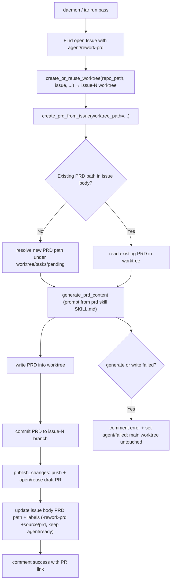

# PRD: rework-prd 流程改造 —— worktree+PR 落地 与 prd skill 规范单一来源

## 1. Introduction & Goals

### 问题说明

iar 的 rework-prd 流程(给 Issue 打 `agent/rework-prd` label → daemon/run 自动生成或重写 PRD)目前有两处缺陷:

1. **落地方式污染主工作树**:`create_prd_from_issue`(`src/backend/core/use_cases/create_prd_from_issue.py`)用 `prd_path.write_text(...)` 直接把 PRD 写进**主仓库工作目录**(`repo_path` 来自 `repo_config.path` / `context.repo_path`),全程不走 worktree、不 commit、不 push、不开 PR。后果:(a) 主分支(通常 checkout 在 main)工作树多出未跟踪文件,daemon 常驻时反复污染 `git status`;(b) 因为 PRD 未 commit 进任何分支,下游 ready-issue 执行从该分支创建的 worktree **读不到**这份新 PRD,"生成→实现"链路对新建 PRD 场景断裂。

2. **PRD 生成 prompt 与规范漂移**:`generate_prd_content`(`src/backend/core/use_cases/generated_content.py`)的 agent mode 使用配置里硬编码的 `target.prompt` 作为 PRD prompt(手工复制了 PRD 章节结构)。项目已有权威的 `prd` skill(架构感知、reuse 优先、真实验证规范),硬编码模板会与 skill 规范漂移,违反"禁止复制粘贴后微调"。

### Proposed Solution Summary

核心机制:**把 rework-prd 接入项目既有的 worktree+PR 标准流程,并让 `prd` skill 成为 PRD 规范的单一来源**。

- **落地(改造1)**:`process_prd_rework_issues` 先用既有模块级函数 `create_or_reuse_worktree(repo_path, issue, config, process_runner)` 为该 Issue 建/复用 `issue-<N>` worktree;`create_prd_from_issue` 改为在 **worktree 工作目录**内解析路径、生成、写入 PRD,然后 commit 进 `issue-<N>` 分支,并复用既有 `publish_changes`(`src/backend/core/use_cases/agent_runner_publish.py`,"push + 开 draft PR + 复用已存在 PR")发布。不新增 PR/worktree 抽象。
- **规范来源(改造2)**:`generate_prd_content` 的 agent mode prompt 改为由 runner 读取 `prd` skill 的 `SKILL.md` 规范注入构建,替换硬编码 `target.prompt`。`prd` skill 经核实是**静态方法论 + 输出契约文本**(非自动执行程序),因此"读其规范文本注入 agent prompt"是自洽且 agent-agnostic 的接法。
- **输入供给**:PRD 规范由 `prd` skill 文件提供(单一来源);Issue 内容/评论/现有 PRD 仍由现有 `build_prd_context` 供给。skill 路径解析必须从可达位置派生、不得硬编码安装路径。
- **状态变化**:PRD 以 `issue-<N>` 分支上的 commit + draft PR 形式落地,主工作树保持干净;Issue label 仍移除 `agent/rework-prd`、加 `source/prd`;`agent/ready` 保留(见下"关键判断")。
- **刻意避免的复杂度**:不接入 deliberation(多代理审议);不改 issue/pr 内容生成路径;不改 label 注册(已由提交 `0096aaf` 完成)。

**关键判断(queue_ready 保留)**:`issue-<N>` 分支名由 Issue number 决定,rework 与 ready-issue 共用同一分支/worktree。只要 PRD **commit 进 `issue-<N>` 分支**,下游 ready-issue 复用同一 worktree(或从该分支重建 worktree)都能读到 PRD。因此根本修复是"PRD 进分支"而非"推迟 ready"——`queue_ready=True` 可保留,无需引入"等 PR 合并再 ready"的额外机制。此判断必须经真实入口验证(下游能读到 PRD)。

### Realistic Validation

除单元测试和集成测试外,本 PRD 要求通过**真实项目入口点**验证关键行为,确保真实使用路径生效,而非仅在隔离 fixture 中通过。

- [x] **worktree+PR 落地真实验证**:`tests/test_agent_runner_orchestrate.py::test_process_prd_rework_issues_lands_pr_in_worktree`(真实 git + bare remote + fake `gh`,经真实编排入口 `process_prd_rework_issues`)验证 PRD 写入 `issue-87` worktree、commit 进 `issue-87` 分支、`create_draft_pr` 被调用,且**主仓库工作树 `git status --porcelain` 无新增 PRD**。
- [x] **下游可见性真实验证**:同一测试断言 `git show issue-87:tasks/pending/<prd>.md` 可读出已 commit 的 PRD(证明复用 `issue-87` worktree 的下游能看到,`queue_ready=True` 保留安全)。
- [x] **prd skill 规范来源真实验证**:`tests/test_generated_content.py::test_generate_prd_content_agent_prompt_uses_skill_spec` 验证 agent prompt 由 `prd` skill 规范构建(含 skill 标记、不含硬编码模板),并携带 PRD 上下文。
- [x] **失败回退真实验证**:`test_process_prd_rework_issues_failure_rollback` 注入 worktree 解析失败,验证 Issue 进入 `agent/failed` + 错误评论,且主工作树无 PRD 写入。

**为什么单元测试不够**:该改动连接 daemon/run polling、git worktree/branch/commit、push+PR 创建、AI prompt 构建与文件写入;只有真实入口能证明"PRD 落到 issue 分支且下游可见"这一组合路径收敛,隔离 helper 无法证明 worktree 复用与主工作树洁净。

### Delivery Dependencies

- Group: rework-prd-pr-migration
- Depends on groups:
  - none
- Depends on tasks/issues:
  - none
- Gate type: none
- Notes: `tasks/pending/` 为空,无重复或前置 PRD。本 PRD 显式推翻已归档 `tasks/archive/P2-FEAT-20260527-190923-prd-from-issue.md` 中"不创建 branch / 不创建 PR"的 Non-Goal(见 Decision Log D-01),但不依赖其执行。

---

## 2. Requirement Shape

- **执行者**:`iar daemon` 轮询进程 / `iar run` 单次执行(经 `process_prd_rework_issues`)。
- **触发条件**:open Issue 带 `agent/rework-prd` label。
- **预期行为**:为该 Issue 建/复用 `issue-<N>` worktree → 在 worktree 内按 `prd` skill 规范生成或重写 PRD → commit 进 `issue-<N>` 分支 → push + 开/复用 draft PR → 更新 Issue body(`PRD path:` 锚点)与 labels(移除 `agent/rework-prd`、加 `source/prd`、保留 `agent/ready`)→ 评论成功(含 PR 链接)。失败时切 `agent/failed` 并评论。
- **范围边界**:仅改 rework-prd 的 **PRD 落地方式**与 **PRD 规范来源**;不改 issue/pr 内容生成;不接 deliberation;不改 label 注册(`0096aaf` 已完成);不改写已 closed Issue。

---

## 3. Repository Context And Architecture Fit

### 当前相关模块(已验证基线)

> **复用点已按函数名 grep 核实(原稿有误,已修正)**:`_commit_and_push_changes`、`run_agent_in_worktree`、`_has_meaningful_diff` 在仓库中**均不存在**;`create_or_reuse_worktree` 不在 `agent_runner_worktree_branch.py` 而在 `run_agent_once.py`。下表为核实后的真实机制。

| 文件 | 角色 / 当前状态 |
|------|------|
| `src/backend/core/use_cases/create_prd_from_issue.py` | rework-prd 核心;原先在 `create_prd_from_issue` 内 `prd_path.write_text(...)` 直接写主仓库(无 worktree/commit/PR)。 |
| `src/backend/core/use_cases/generated_content.py` | `generate_prd_content` agent mode 原先用 `_render_template(target.prompt, ...)` + `_run_content_generator(...)`,prompt 硬编码自配置。 |
| `src/backend/core/use_cases/agent_runner_orchestrate.py` | `process_prd_rework_issues` 调用 `create_prd_from_issue`。 |
| `src/backend/core/use_cases/run_agent_once.py` | **模块级** `create_or_reuse_worktree(repo_path, issue, config, process_runner) -> Path`(返回 worktree 路径,非 `WorktreeContext`);分支约定 `issue-<N>`(各处用 `f"issue-{issue.number}"`)。 |
| `src/backend/core/use_cases/run_agent_daemon.py` / `run_agent_repositories_once.py` | 每轮先 `process_prd_rework_issues` 再正常执行;两处调用栈均已持有 `process_runner`,可直接下传。 |
| `src/backend/core/use_cases/agent_runner_commit.py` | commit 经 commit-request 代理:`commit_requested_changes`(需 `.agent-runner/commit-request.json` + 跑 verification)、`checkpoint_uncommitted_progress`(`--no-verify` WIP)。两者都不适合"runner 直接产出的 PRD 文档提交",故本 PRD 新增 `commit_runner_authored_paths(...)`(同模块,复用私有 `_commit_with_autofix_recovery` + `validate_safe_changes`,不跑 verification 套件)。 |
| `src/backend/core/use_cases/agent_runner_publish.py` | 复用:`publish_changes(issue, worktree_path, config, github_client, process_runner, *, expected_branch=None, content_generator=None, require_prd_archived=True)`,"push + 开/复用 draft PR,假设已 commit"。**关键门禁**:其内部 `assert_prd_archived_for_publish(issue, worktree_path)` 要求 Issue body 引用的 PRD 已在 `tasks/archive/`——对新生成的 pending PRD 会硬失败(重写场景 body 已含 `PRD path: tasks/pending/...`)。本 PRD 给 `publish_changes` 增加 `require_prd_archived: bool = True`,rework 发布传 `False` 跳过该交付门禁。 |
| `src/backend/core/shared/interfaces/agent_runner.py` | `IGitHubClient.create_draft_pr(...)` 等接口;core 经接口访问 git/GitHub。 |
| `~/.claude/skills/prd/SKILL.md` | PRD 规范单一来源(静态方法论 + 11 章输出契约)。runner 经 `generated_content.resolve_prd_skill_path`(显式入参 → `IAR_PRD_SKILL_PATH` 环境变量 → `~/.claude/skills/prd/SKILL.md`)解析,禁止硬编码安装路径;不可达时 `load_prd_skill_spec` 返回 `None` 走 fallback。 |

### 需遵循的架构模式与边界

- 四层依赖方向 `api/ → core/ → engines/ → infrastructure/`;`core/` 不直接导入 `infrastructure/`,git/GitHub/进程操作经 `IGitHubClient` / `IProcessRunner` 接口。
- 复用既有 worktree/publish 能力,不新增并行抽象(redundancy gate)。
- 读取 `prd` skill 规范属外部资源加载:须经接口或可注入路径解析器,且 fallback 安全(skill 不可达时退回当前最小 fallback PRD,不让生成崩溃)。

### Existing PRD Relationship

- **pending**:`tasks/pending/` 为空,**无重复、前置或下游 PRD**。
- **archive**:`tasks/archive/P2-FEAT-20260527-190923-prd-from-issue.md` 是本功能的原始 PRD,其 Non-Goals 明确"No code implementation, branch creation, PR creation"。本 PRD **推翻**该决策(理由见 Decision Log D-01),属于对该已归档 PRD 的行为修订;不复活其中已弃的 deliberation 增强(对应已删文档)。
- 关系判定:**独立运行**(无 pending 依赖),但行为上修订归档 PRD 的落地约定。

---

## 4. Recommendation

### Recommended Approach

**编排既有 worktree+publish 能力 + 注入 prd skill 规范**,最小新增逻辑:

1. `process_prd_rework_issues`:新增 `process_runner` 入参;对每个 rework Issue,先 `create_or_reuse_worktree(repo_path, issue, config, process_runner)` 得 `worktree_path`(分支 `issue-<N>`),把 `worktree_path` + `process_runner` 传给 `create_prd_from_issue`。
2. `create_prd_from_issue`:`CreatePrdFromIssueRequest` 新增 `worktree_path` / `process_runner` 入参;`base_path = worktree_path or repo_path`,所有路径解析(`_resolve_prd_path`)、现有 PRD 读取、`write_text`、`relative_to` 改以 `base_path` 为基准;写入后(仅当 worktree+runner 都提供)经 `commit_runner_authored_paths(...)` commit 进 `issue-<N>` 分支,再 `publish_changes(..., require_prd_archived=False)` 完成 push + draft PR;Issue body/labels/comment 更新沿用现有逻辑,comment 追加 PR 链接。**发布在更新 body/labels 之前**,确保发布失败不留半态 label。仅当 `issue-<N>` 相对 base 分支确有新增提交才发布(避免对内容未变的重写创建空 PR)。
3. `generate_prd_content`(PRD 分支):agent mode prompt 由读取 `prd` skill `SKILL.md` 规范构建并与 `PrdContext` 组合,替换 `target.prompt`;新增可注入的 skill 规范来源(路径解析器/读取接口),fallback 安全。
4. `queue_ready` 保留 `True`(根本修复"PRD 进分支"已解决下游可见性)。

### Why This Is The Best Fit

- 与正常 ready-issue 执行使用**同一** worktree/branch/publish 基础设施,行为一致、复用经硬化的代码。
- PRD commit 进 `issue-<N>` 分支后,下游复用/重建 worktree 均可见,自然消解原"下游读不到"缺陷,且无需新增"PR 合并监听"。
- prd skill 单一来源消除规范漂移,符合"禁止复制粘贴后微调"与"避免硬编码"。

### Rationale For Rejecting Redundant Abstractions

- 不新增 PR/worktree 抽象:`create_or_reuse_worktree` + `publish_changes` + `create_draft_pr` 已覆盖。
- 不新增 PRD 规范定义:`prd` skill 即权威来源,读取注入而非再写一份。
- 不接 deliberation:产出讨论总结非成品 PRD、默认 2 轮×3 agent 成本高、对走 PR+人审的中间产物边际价值低。

### Alternatives Considered

| 替代方案 | 拒绝原因 |
|----------|----------|
| 维持直接写主工作树,额外自动 commit+push 到 main | 直接改 main 历史,绕过 PR/人审,多数使用者不可接受;且与 ready-issue 流程不一致。 |
| PRD 写到主工作树外的隔离目录 | 下游 worktree 仍读不到(未进分支),不解决核心链路缺陷。 |
| 推迟 `agent/ready` 到 PRD PR 合并后 | 需新增 PR 合并监听机制;在"PRD 进 issue 分支 + 下游复用 worktree"方案下不必要。 |
| 接入 deliberation 审议 PRD | 见上;范围外。 |

---

## 5. Implementation Guide

This section is a living implementation guide based on current repository analysis. If implementation discovers additional affected files, hidden dependencies, edge cases, or a better path, update this PRD before proceeding.

### Core Logic(数据与控制流)

```
process_prd_rework_issues(repo_path, config, github_client, process_runner, content_generator)
  └─ for each rework Issue:
       ├─ wt = create_or_reuse_worktree(repo_path, issue, config, process_runner)   # -> Path, 分支 issue-<N>
       ├─ create_prd_from_issue(request{ repo_path, worktree_path=wt, process_runner, issue, ... }, github_client)
       │    ├─ base = worktree_path or repo_path                                     # 改:base 改为 worktree
       │    ├─ prd_path = _resolve_prd_path(repo_path=base, issue)
       │    ├─ existing = _extract_existing_prd_text(prd_path)
       │    ├─ text = generate_prd_content(... )                                     # 改造2:prompt 来自 prd skill
       │    ├─ prd_path.write_text(text)                                            # 改:写在 worktree 内
       │    ├─ (worktree+runner) _commit_and_publish_prd:                            # 在更新 body/labels 之前
       │    │     ├─ commit_runner_authored_paths(wt, [rel_prd], msg, ..., expected_branch=issue-<N>)
       │    │     ├─ if rev-list base..HEAD == 0: skip (内容未变,不开空 PR)
       │    │     └─ publish_changes(issue, wt, ..., expected_branch=issue-<N>, require_prd_archived=False)
       │    ├─ edit_issue_body(PRD path 锚点) / edit_issue_labels(-rework_prd +source/prd +ready)
       │    └─ comment_issue(成功 + PR 链接)
       └─ on failure: edit_issue_labels(+failed -rework_prd) + comment(错误)   # 主工作树未被写入
```

`process_runner` / `github_client` 已在 `process_prd_rework_issues` 调用链可得;`content_generator` 沿用现有注入。`generate_prd_content` 仅改 PRD 分支的 prompt 来源,不动 issue/pr 分支。

### Change Impact Tree

```text
.
├── Domain (core/use_cases)
│   ├── src/backend/core/use_cases/create_prd_from_issue.py
│   │   [修改]
│   │   【总结】PRD 落地从"写主仓库"改为"写 issue worktree → commit 进 issue 分支 → 经 publish_changes 开 draft PR"。
│   │   ├── CreatePrdFromIssueRequest 增加 worktree_path / process_runner 字段
│   │   ├── base_path = worktree_path or repo_path;_resolve_prd_path / write / 现有 PRD 读取 / relative_to 以 base_path 为基准
│   │   ├── 新增 _commit_and_publish_prd:commit_runner_authored_paths + publish_changes(require_prd_archived=False),发布在更新 body/labels 之前
│   │   └── comment 追加 draft PR 链接;labels 保留 agent/ready
│   │
│   ├── src/backend/core/use_cases/generated_content.py
│   │   [修改]
│   │   【总结】generate_prd_content 的 agent prompt 改为注入 prd skill SKILL.md 规范,替换硬编码 target.prompt。
│   │   ├── 新增 resolve_prd_skill_path / load_prd_skill_spec(显式 → IAR_PRD_SKILL_PATH → ~/.claude 默认),禁止硬编码安装路径
│   │   ├── 新增 _build_prd_agent_prompt:完整注入 skill 规范 + 截断后的可变上下文
│   │   └── skill 不可达时回退到现有 target.prompt 模板渲染(安全 fallback)
│   │
│   ├── src/backend/core/use_cases/agent_runner_commit.py
│   │   [修改]
│   │   【总结】新增 commit_runner_authored_paths——runner 直接产出文档的提交(无 commit-request、不跑 verification),内部复用 _commit_with_autofix_recovery + validate_safe_changes。
│   │
│   ├── src/backend/core/use_cases/agent_runner_publish.py
│   │   [修改]
│   │   【总结】publish_changes 增加 require_prd_archived: bool = True;为 False 时跳过 assert_prd_archived_for_publish(供 pending 提案 PRD 发布)。
│   │
│   ├── src/backend/core/use_cases/agent_runner_orchestrate.py
│   │   [修改]
│   │   【总结】process_prd_rework_issues 增加 process_runner 入参,调用 create_prd_from_issue 前 create_or_reuse_worktree,并把 worktree_path + process_runner 下传。
│   │
│   └── src/backend/core/use_cases/run_agent_daemon.py / run_agent_repositories_once.py
│       [修改]
│       【总结】两处 process_prd_rework_issues 调用补传 process_runner(调用栈已持有)。
│
├── Tests
│   ├── tests/conftest.py [修改] — FakeContentGenerator 记录完整 prompt(self.prompts)以断言 skill 注入
│   ├── tests/test_agent_runner_orchestrate.py [修改] — 真实 git + bare remote 的落地验证 + 失败回退
│   ├── tests/test_generated_content.py [修改] — prd-skill 注入 / fallback / 路径解析
│   └── tests/test_create_prd_from_issue.py [不变] — 无 worktree 的"仅生成"路径单测仍适用
│
└── Docs
    ├── docs/guides/agent-runner.md [修改] — PRD rework 改为 issue worktree + commit + draft PR + prd skill 规范来源
    └── config.toml [修改] — prd_from_issue.prompt 注释为"skill 不可达时的 fallback"
```

> **接口层不需要新增抽象**:原稿"按需在 `interfaces/agent_runner.py` 补充读取 skill 的能力"经评估**不采用**——`generated_content.py` 本就读文件系统(`_build_repo_structure_summary`),skill 读取走可注入的 `prd_skill_path` 参数 + 派生路径解析即可测试,无需新接口。

文件清单是起点而非穷举;以 Executor Drift Guard 的 `rg` 结果为准。

### Executor Drift Guard

实现前/中运行以下检索,确认所有受影响点(命令在仓库根目录可直接执行):

```bash
# 当前直接写主工作树的落地点(改造1 目标)
rg -n "write_text|_resolve_prd_path|repo_path|base_path" src/backend/core/use_cases/create_prd_from_issue.py
# rework 编排与 worktree 复用参照
rg -n "process_prd_rework_issues|create_or_reuse_worktree|publish_changes|commit_runner_authored_paths" src/backend/core/use_cases
# 复用的 publish / worktree / commit / draft PR 真实签名(_commit_and_push_changes 不存在)
rg -n "def publish_changes|def create_or_reuse_worktree|def commit_runner_authored_paths|def create_draft_pr|def assert_prd_archived_for_publish" src/backend
# 发布门禁:确认 publish 路径如何跳过 pending PRD 的归档断言
rg -n "require_prd_archived|assert_prd_archived_for_publish" src/backend
# 改造2:PRD prompt 来源(仅改 PRD 分支,勿误伤 issue/pr)
rg -n "target\.prompt|generate_prd_content|load_prd_skill_spec|_build_prd_agent_prompt" src/backend/core/use_cases/generated_content.py
# queue_ready 现状
rg -n "queue_ready" src/backend/core/use_cases
# prd skill 规范来源(路径解析,禁止硬编码安装路径)
rg -n "resolve_prd_skill_path|IAR_PRD_SKILL_PATH|skills/prd|SKILL\.md" src tests
```

触发失败排查:若下游读不到 PRD,先查 worktree 复用与 `issue-<N>` 分支是否一致、PRD 是否真的 commit 进该分支;若 PR 未创建,查 `publish_changes` 的 "已 commit" 前置与 `create_draft_pr` 调用;若 prompt 未用 skill,查 skill 路径解析与 fallback 分支。

### Flow Diagram



### Realistic Validation Plan

| Behavior | Real Entry Point | Test Layer | Mock Boundary | Data/Env Needed | Command Or Procedure | Required For Acceptance |
|---|---|---|---|---|---|---|
| PRD 落到 issue worktree + commit 进 issue-N 分支 + push/draft PR 调用 | `uv run iar run --max-issues 1` | smoke/sandbox | fake `gh` (`IGitHubClient`)、fake content generator;真实 git/worktree/文件 | 带 `agent/rework-prd` 的测试 Issue fixture,可写仓库 | 运行入口后断言 PRD 存在于 `issue-<N>` worktree、该分支含 PRD commit、`create_draft_pr` 被调用、Issue body 有 `PRD path:`、labels 切换 | Yes |
| 主工作树洁净(无未跟踪 PRD) | 同上 | smoke | 同上 | 同上 | 运行后断言主 `repo_path` 工作树 `git status --porcelain` 不含新增 PRD 文件 | Yes |
| 下游可见性(queue_ready 保留安全) | 同上 + 复用 worktree | smoke | 同上 | 同一 Issue 进入 ready 复用 `issue-<N>` worktree | 断言实现侧 worktree 内可读到已 commit 的 PRD 文件 | Yes |
| PRD prompt 来自 prd skill 规范 | `uv run iar run --max-issues 1`(agent mode) | smoke | fake content generator 捕获 prompt | `prd` skill 可达 | 断言传给 generator 的 prompt 含 prd skill 规范要点(章节契约),且不等于旧硬编码模板;skill 不可达时走 fallback | Yes |
| 失败回退 | 同上 | smoke | 注入 write/publish 失败 | 只读 worktree 或失败桩 | 断言 Issue 进 `agent/failed` + 错误评论,主工作树不污染 | Yes |
| 全量回归 | `just test` | integration | 仓库默认 | 无 | `just test` | Yes |

Live GitHub 验证为 opt-in;fake `gh` smoke + 真实本地 git/文件输出为强制项,凭据不可用不阻塞验收。

### Low-Fidelity Prototype

No low-fidelity prototype required; behavior is a CLI/daemon + git/GitHub workflow.

### ER Diagram

No data model changes in this PRD. 持久状态仍为 Issue body 的 `PRD path:` 锚点与仓库内 PRD 文件(现改为落在 `issue-<N>` 分支)。

### Interactive Prototype Change Log

No interactive prototype file changes in this PRD.

### External Validation

No external validation required; repository evidence was sufficient.

---

## 6. Definition Of Done

- rework-prd 生成/重写 PRD 走 `issue-<N>` worktree → commit → push → draft PR,主工作树不再被污染。
- PRD 生成 agent prompt 来自 `prd` skill 规范单一来源,skill 不可达有安全 fallback。
- 下游 ready-issue 执行能读到该 PRD(`queue_ready=True` 保留经验证安全)。
- issue/pr 内容生成、label 注册、deliberation 均未受影响(无回归)。
- `docs/guides/agent-runner.md` 同步更新;四层依赖方向不被破坏。
- 单元/集成测试 + 真实入口验证 + `just test` 全量通过。

## 7. Acceptance Checklist

### Architecture Acceptance

- [x] `create_prd_from_issue` 与 `generate_prd_content` 仍只经 `IGitHubClient` / `IProcessRunner` / 可注入抽象访问 git/GitHub/文件;`core/` 未直接导入 `infrastructure/`(pre-commit "Check architecture layer dependencies" 通过,无新增违规)。
- [x] 复用 `create_or_reuse_worktree` / `publish_changes` / `create_draft_pr`,未新增并行的 worktree/PR 抽象(仅给 `publish_changes` 加 `require_prd_archived` 开关、新增 `commit_runner_authored_paths` 文档提交助手)。

### Behavior Acceptance

- [x] `create_prd_from_issue` 不再向主 `repo_path` 写 PRD;`base_path = worktree_path or repo_path`,PRD 写入 worktree 并 commit 进 `issue-<N>` 分支。
- [x] PRD 发布经 `publish_changes`(`require_prd_archived=False`)开/复用 draft PR;Issue 成功评论含 `Draft PR:` 链接。
- [x] `generate_prd_content` PRD 分支 prompt 由 `prd` skill 规范构建,skill 不可达时回退到 `target.prompt`;issue/pr 分支不变。
- [x] `queue_ready` 保留 `True`,且下游可见性经真实入口(`git show issue-N:...`)验证。

### Dependency Acceptance

- [x] `tasks/pending/` 无与本 PRD 重复的文件;Delivery Dependencies = none 成立。

### Documentation Acceptance

- [x] `docs/guides/agent-runner.md` 的 PRD rework 章节更新为 worktree+draft PR 落地 + prd skill 规范来源;`mkdocs build --strict` 通过。

### Validation Acceptance

- [x] 经真实编排入口 `process_prd_rework_issues`(fake `gh` + 真实 git/bare remote,即 `iar run` 第一阶段所调用的同一函数)证明:PRD 落 `issue-87` worktree、commit 进该分支、`create_draft_pr` 被调用、**主工作树无新增 PRD**、下游 `git show issue-87:...` 可读到 PRD。(Live GitHub `iar run` 为 opt-in,凭据不可用不阻塞验收。)
- [x] skill 不可达 fallback 路径经 `test_generate_prd_content_agent_prompt_falls_back_when_skill_missing` 验证。
- [x] `just test` 全量通过(1020 passed)。

## 8. Functional Requirements

- **FR-1**: rework-prd 处理 MUST 先为 Issue 建/复用 `issue-<N>` worktree,并在该 worktree 内生成/重写 PRD。
- **FR-2**: PRD 写入后 MUST commit 进 `issue-<N>` 分支,并经 `publish_changes` push + 开/复用 draft PR。
- **FR-3**: 处理过程 MUST NOT 向主仓库工作目录写入未跟踪 PRD 文件。
- **FR-4**: 下游 ready-issue 执行复用 `issue-<N>` worktree 时 MUST 能读到该 PRD(`queue_ready=True` 保留)。
- **FR-5**: PRD 生成 agent prompt MUST 由 `prd` skill `SKILL.md` 规范构建(单一来源),且 MUST NOT 复制粘贴一份并行的 PRD 章节模板。
- **FR-6**: `prd` skill 路径 MUST 从可达位置派生,MUST NOT 硬编码安装路径;不可达时 MUST 安全 fallback 而非崩溃。
- **FR-7**: 生成/发布失败时 MUST 切 `agent/failed` + 评论错误,且不污染主工作树。
- **FR-8**: 改动 MUST NOT 影响 issue/pr 内容生成、label 注册与 deliberation。
- **FR-9**: 测试 MUST 覆盖 worktree 落地、commit 进分支、publish 调用、主工作树洁净、下游可见性、prd-skill 注入与 fallback、失败回退。

## 9. Non-Goals

- 不接入 deliberation(多代理审议)到 PRD 生成。
- 不改 issue 内容生成(`generate_issue_content`)与 PR body 生成(`generate_pr_content`)的 prompt 来源。
- 不改 `agent/rework-prd` 等 label 的注册(已由 `0096aaf` 完成)。
- 不新增"PR 合并监听 / 合并后再 ready"机制。
- 不处理已 closed Issue;不引入 webhook/第二个 daemon。

## 10. Risks And Follow-Ups

- **worktree 复用一致性**:若 rework 与 ready-issue 的 worktree/分支命名不一致,下游可能读不到 PRD;由 Executor Drift Guard 与下游可见性验证拦截。
- **prd skill 跨仓库可达性**:runner 在产品仓运行而 skill 在用户级目录;路径解析需稳健且不可达时 fallback。Follow-up:若产品仓需要独立 skill 副本,另行评估同步机制(本 PRD 不实现)。
- **prompt 体积**:注入完整 skill 规范可能增大 prompt;若超 `max_input_chars` 需截断策略(复用 `_truncate_text`)。

## 11. Decision Log

| ID | Decision | Chosen | Rejected | Rationale |
|---|---|---|---|---|
| D-01 | PRD 落地方式 | 走 `issue-<N>` worktree → commit → draft PR(复用 publish_changes) | 维持直接写主工作树 + 自动 commit/push 到 main | 直接写 main 工作树污染状态且下游 worktree 读不到;自动改 main 历史绕过人审不可接受。 |
| D-02 | 下游可见性 / ready 时机 | 保留 `queue_ready=True`,靠"PRD commit 进 issue-N 分支"保证下游复用 worktree 可见 | 推迟 ready 到 PRD PR 合并后 | 共用 `issue-<N>` 分支使复用/重建 worktree 均可见,推迟 ready 需额外 PR 合并监听,徒增复杂度。 |
| D-03 | PRD 规范来源 | 读取 `prd` skill `SKILL.md` 注入 agent prompt(单一来源) | 维持配置内硬编码 `target.prompt` 模板 | 硬编码会与 skill 规范漂移,违反"禁止复制粘贴后微调";skill 是静态规范文本,注入自洽且 agent-agnostic。 |
| D-04 | PRD 质量增强是否接 deliberation | 不接入 | 接入多代理审议(run_agent_deliberation) | 产出讨论总结非成品 PRD、默认 2 轮×3 agent 成本高、对走 PR+人审的中间产物边际价值低。 |
| D-05 | skill 路径解析 | 从可达位置派生 + 不可达安全 fallback | 硬编码安装路径 | 全局工具/跨仓库运行下硬编码路径会读不到;须派生并 fallback。 |
| D-06 | `publish_changes` 的 PRD 归档门禁 | 给 `publish_changes` 加 `require_prd_archived` 开关,rework 传 `False` | 直接复用 `publish_changes`(默认门禁) / 另写一份 PRD 专用 push+PR | grep 核实发现 `publish_changes` 内 `assert_prd_archived_for_publish` 硬要求 PRD 已在 `tasks/archive/`,对新生成的 pending PRD(尤其重写场景 body 已含 pending 路径)会硬失败;加一个语义明确的跳过开关比复制一份并行发布逻辑更符合"无冗余抽象"。 |
| D-07 | PRD 提交方式 | 新增 `commit_runner_authored_paths`(runner 直接产出的文档提交,不跑 verification) | 复用 `commit_requested_changes`(需 commit-request + 跑 verification) / `checkpoint_uncommitted_progress`(`--no-verify` WIP) | PRD 由 runner 直接 `write_text`(无 agent commit-request),且文档提交不应触发 lint/test 套件;既有两个 commit 函数都不契合,新增小函数内部仍复用 `_commit_with_autofix_recovery` + `validate_safe_changes`。 |
