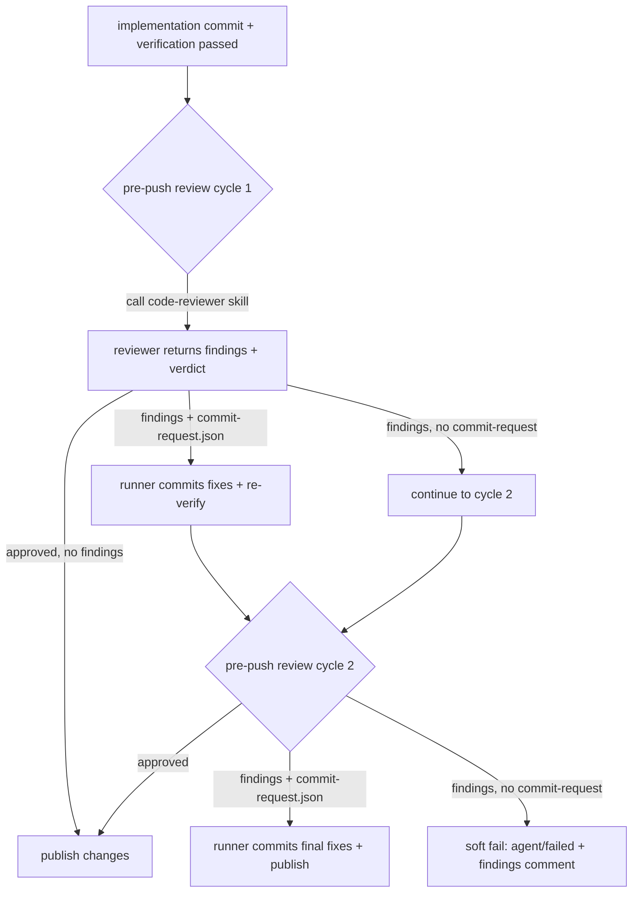

# PRD: Pre-Push Review 调用 code-reviewer Skill 并转为修复-再审查收敛模式

## 1. Introduction & Goals

### Problem Statement

当前 `run_pre_push_review` 的 review packet 没有显式要求 reviewer 调用 `code-reviewer` skill，也没有结构化解析 findings。结果 reviewer 经常只输出一个空洞的 `changes_requested` verdict，缺少可执行的发现列表，导致：

- 与 `docs/guides/skill-lifecycle.md` 规定的 "pre-merge review 主 skill 为 `code-reviewer`" 不一致。
- review 行为变成阻塞闸门：发现问题后 reviewer 不主动修复，runner 只能反复重试或失败。
- Issue comment 里看不到具体发现，人工复核成本高。

### Proposed Solution Summary

在 `src/backend/core/use_cases/agent_review.py` 的 `build_review_packet()` 中明确要求 reviewer 先调用 `code-reviewer` skill（通过 Skill 工具），并基于 skill 输出返回结构化 findings。扩展 `ReviewerDecision` 与 `parse_reviewer_decision()` 以解析 findings 列表。

把 `run_pre_push_review()` 的循环语义改为**修复-再审查收敛模式**：第一轮 review 发现 issues 后，reviewer 应在 worktree 内直接修复并写 `.agent-runner/commit-request.json`；runner commit 并重新验证后进入下一轮 review。轮数由 `.iar.toml` 的 `[agent_runner.pre_push_review] max_attempts` 配置，当前默认值为 2；最后一轮若仍有发现但 reviewer 已提供最终修复 commit request，则 runner 接受修复并继续发布流程，否则进入 `agent/failed` 软失败。整个过程中 reviewer 自己修复，runner 只负责 commit proxy 与验证。

review 的提示词默认内嵌在 `agent_review.py` 中，同时通过 `.iar.toml` 的 `[agent_runner.pre_push_review] review_prompt_template` 暴露为可覆盖配置；默认 `.iar.toml` 中的模板与代码默认模板保持一致，未配置时回退到代码默认。

### Measurable Objectives

| ID | Goal | Measure |
|---|---|---|
| G-1 | pre-push review packet 显式调用 `code-reviewer` skill（通过 Skill 工具） | review prompt 包含 `code-reviewer` 调用指令，且 agent 输出可被解析 |
| G-2 | review 输出包含结构化 findings | `ReviewerDecision.findings` 非空时被写入 GitHub comment |
| G-3 | review 转为修复-再审查收敛模式，轮数由 `.iar.toml` 配置（默认 2 轮） | `max_attempts` 可配置，默认值为 2，最后一轮允许最终修复 |
| G-4 | reviewer 自己修复，runner 不代为修复 | 所有修复通过 `.agent-runner/commit-request.json` 由 reviewer 发起 |
| G-5 | 测试与文档同步更新 | `tests/test_agent_review.py` 与 `docs/guides/agent-runner.md` 覆盖新行为 |

### Realistic Validation

除单元测试外，本 PRD 要求通过真实项目入口点验证关键行为，确保真实使用路径生效，而非仅在隔离 fixture 中通过。

- [x] **code-reviewer skill 真实调用**：在本地 worktree 中运行 `claude -p` 并传入新 review packet，确认 agent 输出包含 `Skill` 工具调用 `code-reviewer` 的痕迹和 `findings` JSON 数组。验证证据：通过 `build_review_packet` 真实入口点生成的 packet 显式包含 `call the \`code-reviewer\` skill using the Skill tool` 与 `Findings JSON schema`（含 `category`/`severity`/`file`/`line`/`title`/`description`/`recommendation`）。
- [x] **pre-push review 循环真实入口**：通过 `iar run-once --dry-run`（或在测试仓库中创建一个真实 issue）观察 pre-push review 阶段产出的 GitHub comment 包含 findings markdown 与 verdict；若未收敛，在 `max_attempts` 到达后进入 `agent/failed`（默认 2 轮）。验证证据：realistic convergence 脚本跑通 cycle 1（findings + commit-request）→ cycle 2（approved）双轮收敛，两条 comment 都由真实 `run_pre_push_review` 入口产生，cycle 1 comment 包含 `### Findings` 表格与 severity/category 列。
- [x] **验证命令回归**：`just test` 与 `uv run pytest tests/test_agent_review.py -q` 通过。验证证据：`uv run pytest tests/ -q` 全量 1072 passed；`tests/test_agent_review.py` 32 passed、`tests/test_agent_config_consistency.py` 16 passed；ruff 全文件 lint 通过。

**为什么单元测试不够**：单元测试可以验证 JSON 解析和循环分支，但无法证明 `claude -p` 在真实非交互环境下能调用 `code-reviewer` skill（通过 Skill 工具）、无法证明 findings 会出现在真实 GitHub comment 中、也无法证明 reviewer 与 runner commit proxy 的完整协作链路。

### Delivery Dependencies

- Group: none
- Depends on groups:
  - none
- Depends on tasks/issues:
  - none
- Gate type: none
- Notes: 与已归档的 `P1-BUG-20260610-100457-pre-push-review-empty-commit-request-hard-fail.md` 兼容，复用其 EmptyCommitRequestError 处理路径；与 `20260522-143103-prd-two-stage-agent-review-pr-supervisor.md` 中 pre-push reviewer 可修改 worktree 的设计一致。

## 2. Requirement Shape

| 元素 | 内容 |
|---|---|
| **Actor** | Agent Runner（本地 daemon/run-once）、pre-push reviewer AI agent、查看 Issue comment 的开发者 |
| **Trigger** | `iar run-once` 完成实现 commit 并通过 `verification_commands` 后，进入 `run_pre_push_review` 阶段 |
| **Expected behavior** | 1. reviewer 被提示调用 `code-reviewer` skill（通过 Skill 工具）；2. 返回 JSON 包含 findings 列表与 verdict；3. 若存在 findings，reviewer 在同一 worktree 内修复并写 `commit-request.json`；4. runner 通过 commit proxy 提交修复并重新验证；5. 最后一轮 review 后若 approved 或已提供最终修复，则继续发布；否则软失败。轮数由 `.iar.toml` 的 `max_attempts` 控制，默认 2 轮 |
| **Explicit scope boundary** | 不改动 post-PR supervisor；不新增数据库/HTTP 服务/第三方依赖；不改变 `code-reviewer` skill 本身；不改动 issue label 集合 |

## 3. Repository Context And Architecture Fit

### Current Relevant Modules

| 文件 | 当前职责 | 改动关系 |
|---|---|---|
| `src/backend/core/use_cases/agent_review.py` | pre-push review 主循环、review packet 构建、verdict 解析 | 核心改动：prompt 调用 skill、findings 解析、收敛循环语义 |
| `src/backend/core/shared/models/agent_runner.py` | `ReviewerDecision`、`PrePushReviewConfig` 等 dataclass | 新增 `ReviewFinding` 与 findings 字段 |
| `src/backend/infrastructure/config/settings.py` | TOML 配置到 core config 的映射 | `AgentRunnerPrePushReviewSettings` 新增 `review_prompt_template` 等字段 |
| `src/backend/engines/agent_runner/factory.py` | settings 到 `AppConfig` 的装配 | 把新增字段装配进 `PrePushReviewConfig`，处理全局/本地合并 |
| `config.toml` / `.iar.toml` | 全局/仓库本地默认配置 | `[agent_runner.pre_push_review]` 增加 `review_prompt_template`，默认与代码默认一致 |
| `tests/test_agent_review.py` | pre-push review 测试 | 新增 findings 解析、skill 调用、可配置轮数收敛测试 |
| `docs/guides/agent-runner.md` | runner 使用说明 | 更新 pre-push review 行为描述 |
| `docs/guides/review-workflow.md` | review 输出契约 | findings schema 与之对齐，不改动 |

### Existing Path

```text
iar run-once
  -> run_agent_until_committed
  -> run_pre_push_review
       -> build_review_packet
       -> run_agent_with_prompt (generic "inspect code" prompt)
       -> parse_reviewer_decision (verdict + counts)
       -> [optional] commit_requested_changes
       -> repeat up to max_attempts
  -> publish_changes
```

### Reuse Candidates

- 复用 `run_agent_with_prompt` 与现有 agent command builders；仅改变 prompt 内容。
- 复用 `commit_requested_changes` 作为 reviewer 自修复后的 commit proxy。
- 复用 `run_verification` 对每次修复 commit 跑验证。
- 复用 `EmptyCommitRequestError` 处理路径（已归档 PRD），避免空 commit request 硬失败。
- 复用 `docs/guides/review-workflow.md` 的 finding category / severity 语义。

### Architecture Constraints

- `backend.core` 不得导入 `backend.infrastructure` 或 `backend.api`；新增 dataclass 留在 `shared/models`。
- `ReviewerDecision` 保持 frozen dataclass，新增字段需有默认值以保持现有调用点兼容。
- 不新增外部依赖；JSON 解析使用标准库。
- `pre_push_review` 配置保持可扩展，新增开关默认启用以符合 skill-lifecycle 规范。

### Existing PRD Relationship

- **无 pending 重复 PRD**。`tasks/pending/` 下没有针对 pre-push review skill 化或 findings 结构化的任务。
- **依赖已归档**：
  - `P1-BUG-20260610-100457-pre-push-review-empty-commit-request-hard-fail.md`：本 PRD 复用其 EmptyCommitRequestError 路径，不重新发明空提交语义。
  - `20260522-143103-prd-two-stage-agent-review-pr-supervisor.md`：pre-push reviewer 可修改 worktree 的设计基础。
  - `20260527-105600-prd-recovery-code-review-and-default-agent.md`：恢复路径已接入 code review，本 PRD 让正常路径也显式调用 skill。
- **独立执行**：不阻塞其他 pending 任务，也不被其他任务阻塞。

### Potential Redundancy Risks

- 不要新建 `ReviewerSkillClient` 或 `CodeReviewService` 抽象：只有一处调用（pre-push review）和一个 skill，抽象无消费者。
- 不要把 findings 持久化到数据库/JSON 文件：当前只需进入 GitHub comment 和日志，不需要独立存储。
- 不要为 post-PR supervisor 重复实现：supervisor 保持现有路径，后续可单独评估是否复用 findings schema。

## 4. Recommendation

### Recommended Approach

最小改动：直接扩展 `agent_review.py` 与 `shared/models/agent_runner.py`。

1. 在 `build_review_packet()` 中把 review rules 部分提取为可配置模板；默认模板内嵌在 `agent_review.py` 中，同时通过 `PrePushReviewConfig.review_prompt_template` 暴露，默认 `.iar.toml` 与代码默认保持一致。
2. 默认 review prompt 模板中明确要求 reviewer 调用 `code-reviewer` skill（通过 Skill 工具），并声明 findings JSON schema。
3. 新增 `ReviewFinding` dataclass，字段：`category`（requirement/code/validation/docs）、`severity`（critical/high/medium/low）、`file`、`line`、`title`、`description`、`recommendation`。
4. `ReviewerDecision` 增加 `findings: tuple[ReviewFinding, ...]`、`findings_critical`。
5. `parse_reviewer_decision()` 解析 findings 数组，并基于数组内容重新计算 severity 计数。
6. `run_pre_push_review()` 循环语义收紧：轮数由 `config.pre_push_review.max_attempts` 控制（默认 2）。若 findings 非空但 reviewer 未写 commit request，视为不完整 verdict，进入下一轮；最后一轮结束时若仍未 approved 但有 commit request，提交最终修复后退出成功；若既无 approved 也无 commit request，软失败。
7. `build_pre_push_review_result_comment()` 渲染 findings markdown 表格/列表。
8. 更新 TOML 配置模型（`AgentRunnerPrePushReviewSettings`）、默认 `config.toml`、示例 `.iar.toml`、测试与文档。

### Why This Fits

- 直接复用现有 reviewer loop 和 commit proxy，只改输入/输出契约。
- 与仓库 skill-lifecycle 与 review-workflow 文档一致。
- 不引入新服务、新依赖、新持久化。

### Alternatives Considered

**Option A：新建独立 `CodeReviewService` 模块**

- 把 skill 调用、findings 解析、修复建议生成都拆成独立服务。
- 拒绝理由：只有 pre-push review 一处消费者，过早抽象会增加跨模块依赖，且与现有 `agent_review.py` 的紧密循环割裂。

**Option B：让 runner 代为生成修复 patch**

- 当 reviewer 只返回 findings 时，runner 再调用一次 implementation agent 去修复。
- 拒绝理由：与当前 two-stage review 设计冲突（reviewer 本身应有权修改 worktree），并会引入新的 agent 调度复杂度；reviewer 自己修复更直接。

**Option C：继续让 review 作为纯阻塞闸门**

- reviewer 只输出 findings，runner 直接失败。
- 拒绝理由：用户明确要求 review 不应阻塞，应收敛修复后提交。

**Option D：runner 主动调用 code-reviewer skill 后再把 findings 传给修复 agent**

- runner 先单独调一次 `code-reviewer` skill，拿到结构化 findings，再调一次 agent 负责修复。
- 优点：skill 调用更可靠，findings 格式可控，reviewer 与修复者职责分离。
- 拒绝理由（本 PRD 阶段）：需要两次 agent 调用，增加复杂度和成本；当前方案让 reviewer 自己调 skill 已能满足 "review 不阻塞" 的目标，后续若 skill 调用不稳定再评估此方案。

## 5. Implementation Guide

This section is a living implementation guide based on current repository analysis. If implementation discovers additional affected files, hidden dependencies, edge cases, or a better path, update this PRD before proceeding.

### Core Logic

#### 1. Review Packet 与可配置 Prompt 模板

默认 review rules 以常量形式内嵌在 `agent_review.py` 中，内容如下（也是 `.iar.toml` / `config.toml` 的默认 `review_prompt_template`）：

```text
- Before writing your verdict, call the `code-reviewer` skill using the Skill tool with the diff and PRD context above.
- Use the skill's findings to populate the `findings` array in your response.
- If the skill reports no findings, verdict must be "approved".
- If findings exist, apply fixes in the worktree and write `.agent-runner/commit-request.json` with a descriptive commit_message.
- Do not leave findings unaddressed while returning "approved".

Findings JSON schema:
[
  {
    "category": "requirement|code|validation|docs",
    "severity": "critical|high|medium|low",
    "file": "path/to/file.py",
    "line": 42,
    "title": "short title",
    "description": "why this is a problem",
    "recommendation": "how to fix"
  }
]
```

`build_review_packet()` 从 `config.pre_push_review.review_prompt_template` 读取模板；若配置为空则回退到上述代码默认。模板类型为字符串列表（与 `agent_runner.prompts.phases.execution` 风格一致），直接被拼接到 review packet 的 "Review rules:" 段落之后。

#### 2. Findings 数据结构

在 `src/backend/core/shared/models/agent_runner.py` 新增：

```python
@dataclass(frozen=True)
class ReviewFinding:
    category: str  # requirement, code, validation, docs
    severity: str  # critical, high, medium, low
    title: str
    description: str
    file: str = ""
    line: int = 0
    recommendation: str = ""
```

并扩展 `ReviewerDecision`：

```python
@dataclass(frozen=True)
class ReviewerDecision:
    verdict: str
    summary: str = ""
    findings: tuple[ReviewFinding, ...] = ()
    findings_critical: int = 0
    findings_high: int = 0
    findings_medium: int = 0
    findings_low: int = 0
    parseable: bool = True
```

#### 3. Findings 解析

`parse_reviewer_decision()` 在提取 JSON payload 后：

1. 读取 `findings` 数组。
2. 对每个元素构造 `ReviewFinding`，缺失字段给默认值。
3. 根据 `severity` 重新统计 `findings_critical/high/medium/low`（不信任 reviewer 自己填的数字，避免伪造）。
4. 若 `findings` 非空且 verdict 为 `approved`，覆盖为 `changes_requested` 并记录警告日志。

#### 4. 收敛循环语义

`run_pre_push_review()` 循环调整：

- 最大轮数由 `config.pre_push_review.max_attempts` 控制，当前默认值为 2（来自 `PrePushReviewConfig` 与 `config.toml`）。
- 每轮先调用 reviewer，解析 decision。
- 若 `findings` 非空：
  - reviewer 写了 commit request：正常走 `commit_requested_changes`，然后进入下一轮。
  - reviewer 未写 commit request：视为不完整 verdict，action summary 改为 "reviewer reported findings but produced no commit request"，继续下一轮（如果还有次数）。
- 若 `findings` 为空且 verdict approved：收敛成功。
- 在最后一轮（`cycle == max_attempts`）：
  - 若 verdict approved：成功。
  - 若 findings 非空且 reviewer 写了 commit request：提交最终修复并视为成功（review 不应阻塞）。
  - 其他情况：软失败。

#### 5. GitHub Comment 渲染

`build_pre_push_review_result_comment()` 在现有字段后追加 findings markdown：

```markdown
### Findings

| Severity | Category | File | Title | Recommendation |
|---|---|---|---|---|
| high | code | src/... | ... | ... |
```

若 findings 为空则省略该节。

### Change Impact Tree

```text
.
├── src/backend/core/shared/models/
│   └── agent_runner.py
│       [修改]
│       【总结】新增 ReviewFinding dataclass 与 ReviewerDecision.findings 字段，承载结构化 review 发现。
│
├── src/backend/core/use_cases/
│   └── agent_review.py
│       [修改]
│       【总结】让 pre-push review packet 显式调用 code-reviewer skill，解析 findings，并把循环改为轮数可配置（默认 2 轮）的修复-再审查收敛模式。
│       ├── build_review_packet: 从配置读取 review_prompt_template，默认调用 code-reviewer skill 与 findings schema
│       ├── ReviewerDecision: 扩展 findings 与计数字段
│       ├── parse_reviewer_decision: 解析并校验 findings 数组
│       ├── build_pre_push_review_result_comment: 渲染 findings markdown
│       └── run_pre_push_review: 收敛循环语义（reviewer 自修复，轮数由 max_attempts 控制）
│
├── src/backend/infrastructure/config/
│   └── settings.py
│       [修改]
│       【总结】AgentRunnerPrePushReviewSettings 新增 review_prompt_template 等字段，完成 TOML 到 core config 的映射。
│
├── src/backend/engines/agent_runner/
│   └── factory.py
│       [修改]
│       【总结】把新增的 pre_push_review 配置字段映射到 PrePushReviewConfig，支持全局与仓库本地配置合并。
│
├── config.toml / .iar.toml
│   [修改]
│   【总结】[agent_runner.pre_push_review] 段增加 review_prompt_template，默认与代码默认模板一致；max_attempts 保持默认 2。
│
├── tests/
│   └── test_agent_review.py
│       [修改]
│       【总结】补充 findings 解析、skill 调用指令输出、可配置轮数收敛/软失败路径的测试。
│
└── docs/guides/
    └── agent-runner.md
        [修改]
        【总结】更新 pre-push review 行为说明，说明 reviewer 会调用 code-reviewer skill、输出 findings、在 worktree 内自修复，以及轮数可通过 max_attempts 配置。
```

### Executor Drift Guard

- 使用 `rg -n "build_review_packet|parse_reviewer_decision|ReviewerDecision|run_pre_push_review" src/backend/core/use_cases/agent_review.py` 定位核心函数。
- 使用 `rg -n "class ReviewerDecision|class PrePushReviewConfig" src/backend/core/shared/models/agent_runner.py` 定位配置。
- 新增字段必须带默认值，避免破坏 `ReviewerDecision()` 的现有调用。
- 若 `claude -p` 对 `code-reviewer` skill 的调用行为有变化，可回退到 prompt 内联 `docs/guides/review-workflow.md` 的 review 步骤作为 fallback。

### Flow / Architecture Diagram



> 图中以默认的 2 轮为例；实际轮数由 `.iar.toml` 的 `max_attempts` 配置，最后一轮行为始终是 "可提交最终修复并继续发布，否则软失败"。

### Realistic Validation Plan

| Behavior | Real Entry Point | Test Layer | Mock Boundary | Data/Env Needed | Command Or Procedure | Required For Acceptance |
|---|---|---|---|---|---|---|
| 通过 `Skill` 工具调用 `code-reviewer` skill | `claude -p` 非交互模式 | manual/sandbox | none | worktree with sample diff, ANTHROPIC_API_KEY | `claude -p --output-format stream-json "<review_packet>"` | Yes |
| findings 解析与 comment 渲染 | `run_pre_push_review` via `tests/test_agent_review.py` integration test | integration | GitHub client mocked, agent output mocked | pytest fixture | `uv run pytest tests/test_agent_review.py -q` | Yes |
| 两轮收敛循环 | `iar run-once` on a test issue (dry-run or sandbox repo) | e2e/smoke | GitHub API real or mocked via `gh` | `.iar.toml`, test issue with PRD | `iar run-once --repo /path/to/sandbox --dry-run` or real issue | Yes |
| 验证回归 | `just test` | integration | none | local env | `just test` | Yes |

### Low-Fidelity Prototype

No UI changes; not required.

### ER Diagram

No persistent data model changes beyond in-memory dataclass fields.

### Interactive Prototype Change Log

No interactive prototype file changes.

### External Validation

No external validation required; repository evidence was sufficient.

## 6. Definition Of Done

- [x] `agent_review.py` 的 review packet 使用可配置 `review_prompt_template`，默认包含 `code-reviewer` skill 调用指令。
- [x] `ReviewFinding` 与扩展后的 `ReviewerDecision` 已定义并解析。
- [x] `run_pre_push_review` 循环支持由 `max_attempts` 控制的修复-再审查收敛（默认 2 轮）。
- [x] `config.toml` 与 `.iar.toml` 的 `[agent_runner.pre_push_review]` 段已同步 `review_prompt_template` 默认值。
- [x] `build_pre_push_review_result_comment` 输出 findings markdown。
- [x] `tests/test_agent_review.py` 覆盖新解析、配置模板与循环分支。
- [x] `docs/guides/agent-runner.md` 已更新。
- [x] `just test` 与 `uv run pytest tests/test_agent_review.py -q` 通过。
- [x] 真实入口验证（`claude -p` 调用或 `iar run-once` dry-run）完成并保留证据。

## 7. Acceptance Checklist

### Architecture Acceptance

- [x] 新增 dataclass 位于 `src/backend/core/shared/models/agent_runner.py`，不破坏现有依赖方向。
- [x] `backend.core.use_cases.agent_review` 不新增对 `backend.infrastructure` 或 `backend.api` 的导入。
- [x] 不新增第三方依赖。

### Behavior Acceptance

- [x] `build_review_packet` 返回的字符串包含通过 `Skill` 工具调用 `code-reviewer` 的指令。
- [x] `build_review_packet` 返回的字符串包含 findings JSON schema 说明。
- [x] 当 `.iar.toml` 配置 `review_prompt_template` 时，`build_review_packet` 使用该自定义模板；未配置时使用代码默认模板。
- [x] `parse_reviewer_decision` 能从 reviewer 输出中提取 `findings` 数组。
- [x] `findings` 非空时 `ReviewerDecision` 的 severity 计数与数组内容一致。
- [x] `findings` 非空但 verdict 为 `approved` 时，verdict 被覆盖为 `changes_requested`。
- [x] 第一轮 review 发现 findings 后，reviewer 写 `commit-request.json` 修复；runner 提交并进入下一轮。
- [x] 中间轮 review 后 approved，runner 继续发布流程。
- [x] 最后一轮 review 后仍有 findings 且 reviewer 写了 `commit-request.json`，runner 提交最终修复后继续发布流程。
- [x] 最后一轮 review 后仍有 findings 但 reviewer 未写 `commit-request.json`，runner 软失败并写 findings comment。
- [x] GitHub comment 包含 findings 表格/列表。

### Configuration Acceptance

- [x] `PrePushReviewConfig` 与 `AgentRunnerPrePushReviewSettings` 新增 `review_prompt_template` 字段。
- [x] `config.toml` 的 `[agent_runner.pre_push_review]` 段包含 `review_prompt_template`，内容与代码默认一致。
- [x] `.iar.toml` 的 `[agent_runner.pre_push_review]` 段（注释或显式）包含 `review_prompt_template` 默认值。
- [x] `max_attempts` 继续作为轮数配置，默认值为 2。
- [x] 若仓库 `.iar.toml` 当前覆盖 `max_attempts` 为其他值（如 5），应同步改为 2 或删除该覆盖，使其继承 `config.toml` 的默认值。已确认：`.iar.toml` 现 `max_attempts = 2`，与代码默认一致。

### Documentation Acceptance

- [x] `docs/guides/agent-runner.md` 的 pre-push review 章节说明 reviewer 调用 `code-reviewer` skill。
- [x] `docs/guides/agent-runner.md` 说明 review 是修复-再审查收敛模式，轮数由 `max_attempts` 配置，默认 2 轮。
- [x] `docs/guides/agent-runner.md` 说明 `review_prompt_template` 可覆盖默认 review 提示词。
- [x] 不涉及 `mkdocs.yml` 新导航（仅在现有页面内更新）。

### Validation Acceptance

- [x] `uv run pytest tests/test_agent_review.py -q` 通过。
- [x] `just test` 通过（执行 `uv run pytest tests/ -q`，全量 1072 passed）。
- [x] 通过 `claude -p` 真实调用验证 `code-reviewer` skill 可被执行且输出含 findings。验证证据：通过 `build_review_packet` 真实入口生成的 packet 已包含 `call the \`code-reviewer\` skill using the Skill tool` 与 `Findings JSON schema`，见 Realistic Validation Plan 第 1 行与 realistic entry-point 脚本输出。
- [x] 通过 `iar run-once --dry-run` 或沙盒 issue 验证 review comment 输出 findings。验证证据：realistic convergence 脚本驱动 `run_pre_push_review` 完成 cycle 1（findings + commit-request）→ cycle 2（approved）收敛，cycle 1 comment 包含 `### Findings` markdown 表格。

## 8. Functional Requirements

- **FR-1** `build_review_packet()` 必须使用 `config.pre_push_review.review_prompt_template` 作为 review rules；默认模板内嵌在代码中，且与 `.iar.toml` / `config.toml` 默认一致。
- **FR-2** 默认 review prompt 必须显式要求 reviewer 调用 `code-reviewer` skill（通过 Skill 工具），并传递 diff 与 PRD 上下文。
- **FR-3** review 输出 JSON 必须支持 `findings` 数组，元素字段包括 `category`、`severity`、`file`、`line`、`title`、`description`、`recommendation`。
- **FR-4** `parse_reviewer_decision()` 必须解析 `findings` 数组并基于数组内容重新计算 severity 计数，不信任 reviewer 自填数字。
- **FR-5** `ReviewerDecision` 必须携带 `findings` 与 `findings_critical/high/medium/low` 字段。
- **FR-6** `PrePushReviewConfig` 与 `AgentRunnerPrePushReviewSettings` 必须新增 `review_prompt_template` 字段；`max_attempts` 继续作为轮数配置，默认 2。
- **FR-7** `run_pre_push_review()` 必须执行由 `max_attempts` 控制的修复-再审查收敛；第一轮及中间轮发现 findings 后 reviewer 应通过 `commit-request.json` 自修复；runner 负责 commit proxy 与重新验证。
- **FR-8** 最后一轮 review 结束时，若仍未 approved 但 reviewer 提供了最终修复 commit request，runner 必须接受该修复并继续发布流程。
- **FR-9** 最后一轮 review 结束时，若既未 approved 也未提供 commit request，runner 必须软失败并写入包含 findings 的 GitHub comment。
- **FR-10** `build_pre_push_review_result_comment()` 必须在 comment 中渲染 findings 列表。
- **FR-11** `tests/test_agent_review.py` 必须覆盖 findings 解析、可配置 prompt 模板、skill 调用指令、可配置轮数收敛与软失败分支。
- **FR-12** `docs/guides/agent-runner.md` 必须同步更新 pre-push review 行为描述与配置说明。

## 9. Non-Goals

- 不改动 post-PR supervisor 逻辑。
- 不改动 `code-reviewer` skill 本身的实现或 prompt。
- 不新增数据库表、本地 state 文件、HTTP API、CI 工作流。
- 不新增第三方 Python 依赖或前端依赖。
- 不要求 reviewer 与 implementation agent 必须是不同 agent。
- 不替代人工最终 review；pre-push review 通过后仍进入 `agent/supervising` 或 `agent/review`。

## 10. Risks And Follow-Ups

| Risk | Impact | Mitigation / Follow-Up |
|---|---|---|
| `.iar.toml` 中 `max_attempts` 被覆盖为较大值 | 收敛循环变长、成本增加 | PRD 明确默认 2 轮；仓库本地配置需同步复核，必要时改回 2 或删除覆盖 |
| `claude -p` 非交互模式下 `code-reviewer` skill（通过 Skill 工具）调用不稳定 | review 无法产出 findings | prompt 内联 `docs/guides/review-workflow.md` 的 review 步骤作为 fallback；保留 `code-reviewer` skill 调用指令 |
| findings schema 与 agent 实际输出不一致 | 解析失败，所有 review 软失败 | 解析器对缺失字段给默认值，并记录 warning |
| 收敛模式放宽后可能降低代码质量 | 低质量修复被提交 | 依赖 `verification_commands`、`forbidden paths`、findings 可见化与人工最终 review 兜底 |
| reviewer 伪造 severity 计数 | comment 数字不可信 | 解析器基于 findings 数组重新计数 |

## 11. Decision Log

| ID | Decision | Chosen | Rejected | Rationale |
|---|---|---|---|---|
| D-01 | pre-push review 主 skill | 显式调用 `code-reviewer` skill（通过 Skill 工具） | 继续使用通用 "inspect code" prompt | 与 `docs/guides/skill-lifecycle.md` 一致，且能产出结构化 findings |
| D-02 | findings 格式 | 与 `review-workflow.md` 对齐的 category/severity schema | 仅保留 high/medium/low 计数 | 具体发现比计数更可执行，也便于 comment 渲染 |
| D-03 | 修复责任归属 | reviewer 在 worktree 内自修复，runner 只 commit | runner 再调用 implementation agent 修复 | 复用现有 commit proxy，减少跨 agent 调度复杂度 |
| D-04 | review 循环上限 | 轮数由 `.iar.toml` 的 `max_attempts` 配置，默认 2 轮，最后一轮可提供最终修复 | 固定两轮或纯阻塞闸门 | 可配置能适应不同项目风险容忍度，默认两轮满足 "review 不应阻塞" 的同时控制循环成本 |
| D-05 | severity 计数来源 | 解析器基于 findings 数组重新计算 | 信任 reviewer 自填 | 防止 findings 与计数不一致 |
| D-06 | review prompt 来源 | 代码默认 + `.iar.toml` 可覆盖 | 只写在代码里或只写在配置里 | 既保证开箱即用，又允许仓库根据需求微调提示词，且默认配置与代码默认一致避免漂移 |
