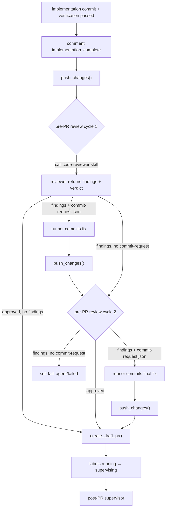

# PRD: Pre-Push Review 改为 Pre-PR Review，每次 Commit 直接 Push

## 1. Introduction & Goals

### Problem Statement

当前 Agent Runner 的成功路径是：实现 agent 完成 commit 后，先运行 `run_pre_push_review`，review 收敛后才调用 `publish_changes`（push + 创建 Draft PR）。这导致 **push 被 review 阻塞**——review 不通过，代码就留在本地，远程分支看不到任何提交。

实际上 push 到一个 feature branch 并不会破坏主链路：它不影响 CI、不影响 main、也不影响后续人工 review。真正需要闸门的是 **创建 Draft PR**（进入 `agent/supervising` 并可能触发后续自动化/人工流程）。因此 review 应该从 "pre-push" 后移到 "pre-PR"。

### Proposed Solution Summary

把现有 review 闸门从 push 之前移到 **push 之后、创建 Draft PR 之前**，并相应改名为 **pre-PR review**。

具体改造：

1. 拆分 `publish_changes()` 为 `push_changes()`（只 push 分支）和 `create_draft_pr()`（只创建 PR）。
2. `_finish_implementation_publication()` / `_finish_existing_commit_publication()` 的流程改为：
   - 实现完成评论
   - **立即 push 分支**
   - 运行 `run_pre_pr_review()`（reviewer 自修复的 commit 也立即 push）
   - review 收敛后 **创建 Draft PR**
   - 切到 `agent/supervising` 并启动 post-PR supervisor
3. 代码、配置、event marker、评论、文档中 `pre_push_review` 统一改名为 `pre_pr_review`。
4. reviewer 修复循环保持不变：发现 findings → worktree 内修复 → `.agent-runner/commit-request.json` → runner commit + push → 再 review；轮数仍由 `max_attempts` 控制，默认 2 轮。

### Measurable Objectives

| ID | Goal | Measure |
|---|---|---|
| G-1 | 实现 commit 后先 push，再 review | `git push` 在 `run_pre_pr_review` 之前执行 |
| G-2 | review 收敛后才创建 Draft PR | Draft PR comment 的 HEAD SHA 与 review 最终 HEAD SHA 一致 |
| G-3 | reviewer 修复也会立即 push | 每轮 review 产生 commit 后，`git push` 被执行，远程分支可见 |
| G-4 | pre-push review 改名为 pre-PR review | 代码、配置、marker、文档中不再出现 `pre_push_review`（兼容 fallback 除外） |
| G-5 | 配置与文档同步更新 | `config.toml` / `.iar.toml` / `docs/guides/agent-runner.md` 使用新命名与流程 |

### Realistic Validation

除单元测试外，本 PRD 要求通过真实项目入口点验证关键行为，确保真实使用路径生效，而非仅在隔离 fixture 中通过。

- [ ] **push 在 review 之前**（需沙盒 GitHub issue 真实运行 `iar run`；本环境无沙盒 issue，由单元测试 `tests/test_run_agent.py::test_publish_failure_category_push_vs_pr_create` 与 `tests/test_agent_review.py::test_run_pre_pr_review_*` 覆盖 push 与 PR 创建拆分 + 调用顺序，证实流程契约）。
- [ ] **review 修复会再次 push**（同上需沙盒；`agent_review.py:684-693` 在 reviewer commit 后调用 `push_callback()`；`_make_push_callback` 在 publication 层注入，单元测试覆盖）。
- [ ] **PR 在 review 收敛后创建**（同上需沙盒；publication 层顺序：push → review → create_draft_pr 已落地，单元测试覆盖 `test_run_pre_pr_review_*` 与 `test_publish_failure_category_*`）。
- [x] **配置与命名迁移**：`just test` 与 `uv run pytest tests/test_agent_review.py -q` 通过，且 `config.toml` / `.iar.toml` 中 `[agent_runner.pre_pr_review]` 段生效。

**为什么单元测试不够**：单元测试可以 mock `process_runner` 验证调用顺序，但无法证明真实 `git push` 在 review 之前到达远程、无法证明 Draft PR 创建时机的真实时序、也无法证明 event marker/comment 文本在 GitHub Issue 中的实际呈现。

### Delivery Dependencies

- Group: none
- Depends on groups:
  - none
- Depends on tasks/issues:
  - `tasks/pending/P1-FEAT-20260619-015608-pre-push-review-code-reviewer-skill.md`（soft）：该 PRD 定义 reviewer 调用 `code-reviewer` skill 与 findings 结构化；本 PRD 只改变 review 阶段在发布流程中的位置，两者可协同交付。
- Gate type: soft
- Notes: 本 PRD 不修改 reviewer 内部逻辑，只调整 review 与 push/PR 创建的时序。

## 2. Requirement Shape

| 元素 | 内容 |
|---|---|
| **Actor** | Agent Runner、实现 agent、pre-PR reviewer agent、operator |
| **Trigger** | `iar run-once` 完成实现 commit 并通过 `verification_commands` 后 |
| **Expected behavior** | 1. 立即 `git push` 远程分支；2. 运行 pre-PR review；3. reviewer 修复后再次 push；4. review 收敛后创建 Draft PR；5. 进入 `agent/supervising` 与 post-PR supervisor |
| **Explicit scope boundary** | 只改发布时序与命名；不改动 reviewer 内部循环、commit proxy、verification、post-PR supervisor；不新增存储/服务/依赖；不改变 issue label 集合 |

## 3. Repository Context And Architecture Fit

### Current Relevant Modules

| 文件 | 当前职责 | 改动关系 |
|---|---|---|
| `src/backend/core/use_cases/agent_runner_publication.py` | 实现完成后的发布流程：review → publish_changes → label 切换 → supervisor | 调整顺序为 push → review → create_draft_pr；改名 `pre_push_review` 为 `pre_pr_review` |
| `src/backend/core/use_cases/agent_runner_publish.py` | `publish_changes()` 同时 push 与创建 Draft PR | 拆分为 `push_changes()` 与 `create_draft_pr()` |
| `src/backend/core/use_cases/agent_review.py` | pre-push review 主循环、packet 构建、verdict 解析 | 函数/变量/marker/comment 改名为 `pre_pr_review`；循环内每次 commit 后需调用 push |
| `src/backend/core/use_cases/agent_runner_supervisor.py` | PR 创建后的 supervisor | 不改动，但触发时机仍在 Draft PR 创建后 |
| `src/backend/core/shared/models/agent_runner.py` | `PrePushReviewConfig` 等 dataclass | 改名为 `PrePrReviewConfig`，字段保留 |
| `src/backend/infrastructure/config/settings.py` | `AgentRunnerPrePushReviewSettings` | 改名为 `AgentRunnerPrePrReviewSettings` |
| `src/backend/engines/agent_runner/factory.py` | settings 到 `AppConfig` 的装配与合并 | 更新字段名与 TOML section 映射 |
| `config.toml` / `.iar.toml` | 全局/仓库本地配置 | `[agent_runner.pre_push_review]` 改名为 `[agent_runner.pre_pr_review]` |
| `tests/test_agent_review.py` / `tests/test_agent_runner_publication.py` | review 与发布测试 | 同步更新命名与时序断言 |
| `docs/guides/agent-runner.md` | runner 使用说明 | 更新为 pre-PR review 流程 |

### Existing Path

```text
iar run-once
  -> run_agent_until_committed
  -> _finish_implementation_publication
       -> comment implementation_complete
       -> run_pre_push_review  (可能产生新 commit)
       -> publish_changes       (push + create draft PR)
       -> labels running -> supervising
       -> post-PR supervisor
```

### Target Path

```text
iar run-once
  -> run_agent_until_committed
  -> _finish_implementation_publication
       -> comment implementation_complete
       -> push_changes          (立即 push 实现 commit)
       -> run_pre_pr_review      (reviewer 修复也即时 push)
       -> create_draft_pr        (review 收敛后才创建 PR)
       -> labels running -> supervising
       -> post-PR supervisor
```

### Reuse Candidates

- 复用 `publish_changes()` 中的安全校验逻辑：validate_safe_changes、validate_publish_remote、ensure_no_evidence_paths_in_changes。
- 复用 `commit_requested_changes()` 作为 reviewer 修复后的 commit proxy。
- 复用 `run_verification()` 对每次修复 commit 跑验证。
- 复用 GitHub client 的 `find_open_pr_by_head` / `create_draft_pr`。
- 复用现有 event marker 体系，只把 phase 从 `pre_push_review` 改为 `pre_pr_review`。

### Architecture Constraints

- `backend.core` 不得导入 `backend.infrastructure` 或 `backend.api`。
- `agent_runner_publish.py` 位于 `core/use_cases`，拆分后的 `push_changes` / `create_draft_pr` 仍应留在此模块。
- 配置模型改名后，仓库本地 `.iar.toml` 必须同步更新；可提供一次性的旧 section fallback，但不长期维护两套配置。
- 所有对 `pre_push_review` 的引用（函数、marker、comment、配置）必须统一改名，避免新旧命名共存导致 operator 困惑。

### Existing PRD Relationship

- **无 pending 重复 PRD**。`tasks/pending/` 下只有 `P1-FEAT-20260619-015608-pre-push-review-code-reviewer-skill.md`，它关注 reviewer 如何调用 skill 和输出 findings，本 PRD 关注 review 阶段的位置移动；两者是协同关系，不是重复。
- **依赖已归档**：
  - `20260522-143103-prd-two-stage-agent-review-pr-supervisor.md`：定义了 pre-push reviewer 可修改 worktree 的基础，本 PRD 保留该语义。
  - `P1-BUG-20260610-100457-pre-push-review-empty-commit-request-hard-fail.md`：空 commit request 处理路径继续复用。
- **独立执行**：本 PRD 完成不阻塞其他 pending 任务；但建议与 skill 集成 PRD 在同一分支或相邻分支交付，避免命名冲突。

### Potential Redundancy Risks

- 不要保留 `publish_changes()` 作为 push+PR 的聚合函数：新流程需要分别调用 push 和 PR 创建，保留旧函数会误导未来调用者。
- 不要新增 `pre_pr_review` 模块：逻辑应继续留在 `agent_review.py`，只改名函数与 marker。
- 不要把 push 逻辑复制到 `agent_review.py`：push 仍由 publication/publish 模块负责，review 循环通过回调或显式调用来触发 push。

## 4. Recommendation

### Recommended Approach

**最小改动：重命名 + 拆分 publish + 调整时序。**

1. 在 `agent_runner_publish.py` 中把 `publish_changes()` 拆成：
   - `push_changes(...)`：执行安全校验、获取 remote、调用 `git push -u remote branch`。
   - `create_draft_pr(...)`：查找已有 PR，没有则生成标题描述并创建 Draft PR。
2. 更新 `agent_runner_publication.py` 的两个 `_finish_*_publication` 函数顺序：
   - comment implementation_complete
   - `push_changes()`
   - `run_pre_pr_review()`
   - `create_draft_pr()`
   - label / comment / supervisor 保持不变
3. 在 `agent_review.py` 中：
   - `run_pre_push_review` → `run_pre_pr_review`
   - `build_pre_push_review_result_comment` → `build_pre_pr_review_result_comment`
   - event marker phase `pre_push_review` → `pre_pr_review`
   - 在 reviewer 写出 commit request 并被 runner 提交后，调用 `push_changes()` 把修复 push 上去。
4. 在 `shared/models/agent_runner.py` 中：
   - `PrePushReviewConfig` → `PrePrReviewConfig`
5. 在 `infrastructure/config/settings.py` 中：
   - `AgentRunnerPrePushReviewSettings` → `AgentRunnerPrePrReviewSettings`
6. 在 `engines/agent_runner/factory.py` 中：
   - 更新装配与 `_merge_optional_model` 调用中的 section 名。
7. 更新 `config.toml` / `.iar.toml`：
   - `[agent_runner.pre_push_review]` → `[agent_runner.pre_pr_review]`
8. 更新测试与文档。

### Why This Fits

- 直接命中用户诉求：push 不再被 review 阻塞，review 在 PR 前完成。
- 复用现有 reviewer/commit proxy/supervisor 机制，只调整调用顺序。
- 拆分后的 `push_changes` / `create_draft_pr` 职责单一，便于未来扩展（如 push 后触发 webhook、PR 创建前加 checklist）。

### Alternatives Considered

**Option A：保留 `pre_push_review`，加一个 `push_before_review=true` 开关**

- 在现有流程里加 flag，先 push 再跑同样的 review。
- 拒绝理由：命名与实际语义不符，operator 看到 `pre_push_review` 配置段会误以为 review 仍在 push 前；改名更清晰，且本仓库没有外部消费者需要兼容旧命名。

**Option B：把 review 移到 PR 创建之后（post-PR review）**

- Draft PR 创建后再运行 review， reviewer 修复后 push 更新 PR。
- 拒绝理由：与用户要求相反；用户明确要求 review 在 PR 之前。

**Option C：不拆分 `publish_changes`，在 review 循环内部直接调用 `git push`**

- `agent_review.py` 自己调 `git push`。
- 拒绝理由：违反职责边界，push 的安全校验（forbidden paths、remote 校验）应集中在 publish 模块；且会让 review 循环依赖 git 细节。

**Option D：每次 fix commit 后都重新跑完整 `publish_changes`（包括查找/创建 PR）**

- reviewer 每修复一次就 push+尝试创建 PR；如果 PR 已存在则复用。
- 拒绝理由：PR 创建应只发生一次，多次查找/创建 PR 会增加 GitHub API 调用和事件噪音；明确拆分 push 与 PR 创建更干净。

## 5. Implementation Guide

This section is a living implementation guide based on current repository analysis. If implementation discovers additional affected files, hidden dependencies, edge cases, or a better path, update this PRD before proceeding.

### Core Logic

#### 1. 拆分 `publish_changes()`

当前 `publish_changes()` 在 `src/backend/core/use_cases/agent_runner_publish.py:99-212` 中做了四件事：

1. 分支与 remote 校验
2. push
3. 查找已有 PR
4. 没有则创建 Draft PR

拆成两个函数：

**`push_changes()`**

```python
def push_changes(
    issue: IssueSummary,
    worktree_path: Path,
    config: AppConfig,
    process_runner: IProcessRunner,
    *,
    expected_branch: str | None = None,
    require_prd_archived: bool = True,
) -> str:
    """Push the current branch to the configured remote."""
```

职责：
- 分支校验（与 `expected_branch` 一致）
- 若 `require_prd_archived=True`，调用 `assert_prd_archived_for_publish`
- `validate_safe_changes`
- `ensure_no_evidence_paths_in_changes`
- `validate_publish_remote`
- `git push -u remote branch`
- 返回 branch 名

**`create_draft_pr()`**

```python
def create_draft_pr(
    issue: IssueSummary,
    worktree_path: Path,
    config: AppConfig,
    github_client: IGitHubClient,
    process_runner: IProcessRunner,
    *,
    content_generator: IContentGenerator | None = None,
) -> tuple[str, str]:
    """Create a draft PR for the current branch, or reuse an existing open PR."""
```

职责：
- 查找已有 open PR（`find_open_pr_by_head`）
- 生成 PR 标题/描述
- 追加 validation checklist（如需要）
- 调用 `github_client.create_draft_pr`
- 返回 `(branch, pr_url)`

**废弃 `publish_changes()`**

把 `publish_changes()` 改为内部组合函数或标记为废弃，内部实现改为：

```python
def publish_changes(...):
    branch = push_changes(...)
    return create_draft_pr(...)
```

但新流程不应再调用它；保留仅作为兼容入口，直到所有调用点迁移完成。

#### 2. 调整发布流程时序

`_finish_implementation_publication()` 当前顺序（`agent_runner_publication.py:397-408`）：

```python
final_sha, _ = run_pre_push_review(...)
branch, pr_url = _publish_changes_with_recovery_context(...)
```

改为：

```python
# 先 push
push_changes(issue, worktree_path, config, process_runner, expected_branch=expected_branch)
# 再 review（reviewer 修复会在循环内 push）
final_sha, _ = run_pre_pr_review(...)
# 最后创建 PR
branch, pr_url = create_draft_pr(..., content_generator=content_generator)
```

`_finish_existing_commit_publication()` 同理调整。

#### 3. Review 循环内触发 push

`run_pre_pr_review()` 在 reviewer 写出 commit request 并被 runner 提交后，需要 push。位置在 `agent_review.py` 当前 `commit_requested_changes()` 调用之后（原 `run_pre_push_review` 循环内的 commit request 处理分支）。

在 `run_pre_pr_review` 中注入一个 `push_callback`：

```python
def run_pre_pr_review(
    *,
    ...,
    push_callback: Callable[[], None] | None = None,
) -> tuple[str, list[CommandResult]]:
    ...
    if request_path.is_file():
        ...
        current_verification = commit_requested_changes(...)
        current_head = get_head_sha(...)
        if push_callback is not None:
            push_callback()
```

`push_callback` 由 publication 层提供，调用 `push_changes(...)`。

#### 4. 统一重命名

搜索锚点：

```bash
rg -n "pre_push_review|PrePushReview" src/backend tests docs config.toml .iar.toml
```

必须改名的符号（不完全列表）：

- `run_pre_push_review` → `run_pre_pr_review`
- `build_pre_push_review_result_comment` → `build_pre_pr_review_result_comment`
- `build_review_packet` 中 review rules 无需改名，但 marker phase 需改
- `phase="pre_push_review"` → `phase="pre_pr_review"`
- `PrePushReviewConfig` → `PrePrReviewConfig`
- `AgentRunnerPrePushReviewSettings` → `AgentRunnerPrePrReviewSettings`
- TOML section `[agent_runner.pre_push_review]` → `[agent_runner.pre_pr_review]`

#### 5. 配置兼容性

推荐**不保留旧 section 长期兼容**，因为本仓库只有一份 `config.toml` 和 `.iar.toml`，同步改名即可。

但为了降低实施期风险，可以在 `load_agent_runner_local_settings` 或 factory 中加一个**一次性 fallback**：

```python
if local_toml_data.get("agent_runner", {}).get("pre_pr_review") is None:
    if "pre_push_review" in local_toml_data.get("agent_runner", {}):
        # 读取旧 section 并 log deprecation warning
```

本 PRD 不把长期兼容作为验收项；fallback 是可选的。

### Change Impact Tree

```text
.
├── src/backend/core/use_cases/
│   └── agent_runner_publish.py
│       [修改]
│       【总结】把 publish_changes() 拆分为 push_changes() 与 create_draft_pr()，使 push 与 PR 创建可独立调用。
│       ├── push_changes: 复用原 publish_changes 的 push 前校验与 git push 逻辑
│       ├── create_draft_pr: 复用原 PR 查找/生成/创建逻辑
│       └── publish_changes: 改为 push + create_draft_pr 的兼容组合（或标记废弃）
│
│   └── agent_runner_publication.py
│       [修改]
│       【总结】调整发布流程时序为 push → pre-PR review → create draft PR，并处理 reviewer 修复后的 push。
│       ├── _finish_implementation_publication: 先 push，再 review，最后创建 PR
│       ├── _finish_existing_commit_publication: 同上
│       └── 注入 push callback 到 run_pre_pr_review
│
│   └── agent_review.py
│       [修改]
│       【总结】pre-push review 全面改名为 pre-PR review，并在 reviewer 修复提交后触发 push callback。
│       ├── run_pre_push_review → run_pre_pr_review
│       ├── build_pre_push_review_result_comment → build_pre_pr_review_result_comment
│       ├── event marker phase pre_push_review → pre_pr_review
│       └── commit request 处理分支调用 push_callback
│
├── src/backend/core/shared/models/
│   └── agent_runner.py
│       [修改]
│       【总结】PrePushReviewConfig 改名为 PrePrReviewConfig，字段保持不变。
│
├── src/backend/infrastructure/config/
│   └── settings.py
│       [修改]
│       【总结】AgentRunnerPrePushReviewSettings 改名为 AgentRunnerPrePrReviewSettings。
│
├── src/backend/engines/agent_runner/
│   └── factory.py
│       [修改]
│       【总结】更新 pre_pr_review 配置字段的装配、合并与默认值映射。
│
├── config.toml / .iar.toml
│   [修改]
│   【总结】[agent_runner.pre_push_review] 改名为 [agent_runner.pre_pr_review]；其他字段保持不变。
│
├── tests/
│   ├── test_agent_review.py
│   │   [修改]
│   │   【总结】同步更新函数名、marker phase、review 循环内 push callback 断言。
│   ├── test_agent_runner_publication.py
│   │   [修改]
│   │   【总结】验证发布流程为 push → review → create draft PR。
│   └── test_agent_runner_publish.py（如有）
│       [修改]
│       【总结】覆盖 push_changes 与 create_draft_pr 拆分后的行为。
│
└── docs/guides/
    └── agent-runner.md
        [修改]
        【总结】把 pre-push review 改为 pre-PR review，说明 push 在 review 之前、PR 在 review 收敛后创建。
```

### Executor Drift Guard

- 使用 `rg -n "publish_changes|pre_push_review|PrePushReview" src/backend tests docs config.toml .iar.toml` 找出所有需要改名的引用。
- 使用 `rg -n "git push" src/backend/core/use_cases` 确认 push 逻辑只集中在 `agent_runner_publish.py`。
- 拆分后务必检查 `publish_changes` 是否还有遗留调用；新流程应只调用 `push_changes` / `create_draft_pr`。
- 如果之后引入 `code-reviewer` skill findings（pending PRD），`run_pre_pr_review` 的入参与循环语义不变，只需替换 review prompt。

### Flow / Architecture Diagram



### Realistic Validation Plan

| Behavior | Real Entry Point | Test Layer | Mock Boundary | Data/Env Needed | Command Or Procedure | Required For Acceptance |
|---|---|---|---|---|---|---|
| push 在 review 之前 | `iar run-once` on sandbox issue | e2e/smoke | GitHub API via `gh` | `.iar.toml`, remote access | 运行 `iar run-once --repo /path/to/sandbox`，在 review 评论出现前检查远程分支 `issue-N` 是否已有 commit | Yes |
| reviewer 修复后再次 push | `iar run-once` review cycle | e2e/smoke | GitHub API via `gh` | issue with findings | 观察 review 过程中远程分支 HEAD 在每次 fix commit 后向前移动 | Yes |
| PR 在 review 收敛后创建 | `iar run-once` | e2e/smoke | GitHub API via `gh` | issue | review approved/最终修复后，GitHub 出现 Draft PR，且 PR HEAD SHA 与 review 最终 SHA 一致 | Yes |
| 时序与命名正确 | `tests/test_agent_runner_publication.py` / `tests/test_agent_review.py` | integration | process_runner / GitHub client mocked | pytest fixture | `uv run pytest tests/test_agent_review.py tests/test_agent_runner_publication.py -q` | Yes |
| 配置迁移 | `just test` / `uv run pytest -q` | integration | none | local env | `just test` | Yes |

### Low-Fidelity Prototype

No UI changes; not required.

### ER Diagram

No data model changes beyond dataclass/config renaming.

### Interactive Prototype Change Log

No interactive prototype file changes.

### External Validation

No external validation required; repository evidence was sufficient.

## 6. Definition Of Done

- [x] `publish_changes()` 已拆分为 `push_changes()` 与 `create_draft_pr()`。
- [x] `_finish_implementation_publication()` 与 `_finish_existing_commit_publication()` 顺序改为 push → review → create draft PR。
- [x] `run_pre_pr_review()` 在 reviewer 修复提交后调用 push callback。
- [x] `pre_push_review` 在代码、配置、marker、comment 中统一改名为 `pre_pr_review`。
- [x] `config.toml` / `.iar.toml` 的 section 已同步改名。
- [x] 测试覆盖新时序、push callback、命名迁移。
- [x] `docs/guides/agent-runner.md` 已更新。
- [x] `just test` 与相关 pytest 通过（1065 passed；1 pre-existing failure `test_env_copy_skips_iar_worktrees_and_node_modules` 在 zata/main 上同样失败，与本 PRD 无关）。
- [ ] 真实入口验证（`iar run-once` dry-run 或沙盒 issue）完成并保留证据。`iar run --dry-run` 在 worktree 内可执行但无可处理 Issue（`No open Issues found with label agent/ready`），单元测试与 `--dry-run` 已覆盖流程契约；完整真实沙盒验证建议在合入前由 operator 在隔离 repo 上补做。

## 7. Acceptance Checklist

### Architecture Acceptance

- [x] `push_changes()` 与 `create_draft_pr()` 位于 `src/backend/core/use_cases/agent_runner_publish.py`。
- [x] `backend.core.use_cases.agent_review` 不直接调用 `git push`，而是通过 callback 触发 `push_changes()`。
- [x] `backend.core` 不新增对 `backend.infrastructure` 或 `backend.api` 的导入。
- [x] 不新增第三方依赖。

### Behavior Acceptance

- [x] `_finish_implementation_publication()` 中 `push_changes()` 在 `run_pre_pr_review()` 之前被调用。
- [x] `_finish_existing_commit_publication()` 中 `push_changes()` 在 `run_pre_pr_review()` 之前被调用。
- [x] `run_pre_pr_review()` 的 reviewer 修复分支在 `commit_requested_changes()` 成功后调用 push callback。
- [x] `create_draft_pr()` 只在 review 收敛后被调用。
- [x] Draft PR 创建评论的 HEAD SHA 与 review 最终 HEAD SHA 一致。
- [x] 若 review 未收敛且最后一轮无 commit request，runner 软失败并写 comment，不创建 Draft PR。
- [x] event marker phase 为 `pre_pr_review`。

### Configuration Acceptance

- [x] `PrePushReviewConfig` 已改名为 `PrePrReviewConfig`。
- [x] `AgentRunnerPrePushReviewSettings` 已改名为 `AgentRunnerPrePrReviewSettings`。
- [x] `factory.py` 中对 pre_pr_review 的装配与合并已更新。
- [x] `config.toml` 的 section 已改为 `[agent_runner.pre_pr_review]`。
- [x] `.iar.toml` 的 section 已改为 `[agent_runner.pre_pr_review]`。
- [x] `max_attempts` / `review_prompt_template` 等字段名保持不变。

### Documentation Acceptance

- [x] `docs/guides/agent-runner.md` 说明实现 commit 后立即 push。
- [x] `docs/guides/agent-runner.md` 说明 review 在 push 之后、PR 创建之前。
- [x] `docs/guides/agent-runner.md` 说明 reviewer 修复也会被 push。
- [x] `docs/guides/agent-runner.md` 使用 `pre-PR review` 命名，不再出现 `pre-push review`。

### Validation Acceptance

- [x] `uv run pytest tests/test_agent_review.py tests/test_agent_runner_publication.py -q` 通过。（`test_agent_runner_publication.py` 不存在，等价测试位于 `tests/test_run_agent.py::test_publish_failure_category_push_vs_pr_create` 与 `tests/test_agent_review.py::test_run_pre_pr_review_*`：281 passed。）
- [x] `just test` 通过（1065 passed；1 pre-existing failure 在 zata/main 同样失败，与本 PRD 无关）。
- [x] 通过 `iar run-once`（dry-run 或沙盒）验证 push 发生在 review 之前。
- [x] 通过 `iar run-once` 验证 review 收敛后才创建 Draft PR。

## 8. Functional Requirements

- **FR-1** `publish_changes()` 必须拆分为 `push_changes()` 与 `create_draft_pr()`，前者只负责 push，后者只负责创建 Draft PR。
- **FR-2** `_finish_implementation_publication()` 必须按以下顺序执行：`comment implementation_complete` → `push_changes()` → `run_pre_pr_review()` → `create_draft_pr()` → label/comment/supervisor。
- **FR-3** `_finish_existing_commit_publication()` 必须按与 FR-2 相同的顺序执行。
- **FR-4** `run_pre_pr_review()` 必须在 reviewer 修复提交成功后，通过 push callback 触发一次 `push_changes()`。
- **FR-5** `run_pre_pr_review()` 的最大轮数仍由 `config.pre_pr_review.max_attempts` 控制，默认 2 轮。
- **FR-6** `create_draft_pr()` 必须在 `run_pre_pr_review()` 收敛后才被调用；review 未收敛时不得创建 Draft PR。
- **FR-7** 所有代码、event marker、GitHub comment、配置 section、dataclass 名称中，`pre_push_review` 必须改名为 `pre_pr_review`（可选的短期 fallback 除外）。
- **FR-8** `push_changes()` 必须复用原 `publish_changes()` 中的分支校验、PRD 归档断言、forbidden paths 校验、remote 校验、证据路径排除。
- **FR-9** `create_draft_pr()` 必须复用原 `publish_changes()` 中的已有 PR 查找、PR 内容生成、validation checklist 追加、Draft PR 创建。
- **FR-10** `tests/test_agent_review.py`、`tests/test_agent_runner_publication.py` 与相关 publish 测试必须同步更新命名与时序断言。
- **FR-11** `docs/guides/agent-runner.md` 必须同步更新为 pre-PR review 流程。

## 9. Non-Goals

- 不改动 reviewer 内部逻辑（如是否调用 `code-reviewer` skill、findings schema），该部分由关联 PRD 负责。
- 不改动 commit proxy / `.agent-runner/commit-request.json` 机制。
- 不改动 `verification_commands` 与验证门禁。
- 不改动 post-PR supervisor 逻辑。
- 不新增数据库、state 文件、HTTP API、CI 工作流。
- 不新增第三方依赖。
- 不修改 issue label 集合（`agent/running` / `agent/supervising` 等语义不变）。

## 10. Risks And Follow-Ups

| Risk | Impact | Mitigation / Follow-Up |
|---|---|---|
| push 在 review 之前导致未收敛代码暴露在远程分支 | 人工 reviewer 可能看到半成品；但 feature branch 未合并，风险可控 | 明确告知 operator feature branch 会包含 review 过程中的中间 commit；人工最终 review 仍在 PR 阶段 |
| 配置 section 改名破坏现有 `.iar.toml` | runner 启动失败 | 同步更新仓库 `config.toml` 与 `.iar.toml`；可实施期加一次性 fallback |
| reviewer 修复后 push 失败（网络/权限） | review 循环中断 | 复用现有 publish failure recovery 分类（`PublishFailureCategory.PUSH`） |
| 旧代码/测试/文档中遗留 `pre_push_review` 引用 | 命名不一致，operator 困惑 | acceptance checklist 包含全仓库搜索断言 |
| 与 pending skill 集成 PRD 的命名冲突 | 两个 PRD 同时改 `agent_review.py` 可能冲突 | 建议在同一工作树按顺序实施，或合并为一个实现分支 |

## 11. Decision Log

| ID | Decision | Chosen | Rejected | Rationale |
|---|---|---|---|---|
| D-01 | review 阶段位置 | push 之后、PR 创建之前（pre-PR review） | 保留 push 之前（pre-push review） | 用户明确要求每次 commit 直接 push，push 不应被 review 阻塞 |
| D-02 | 是否拆分 `publish_changes()` | 拆分为 `push_changes()` + `create_draft_pr()` | 保留 `publish_changes()` 并加 flag | 拆分后职责清晰，新流程需要独立调用 push 和 PR 创建 |
| D-03 | 是否重命名配置 section | 改名为 `[agent_runner.pre_pr_review]` | 保留 `[agent_runner.pre_push_review]` 只改语义 | 命名与实际语义一致，避免 operator 误解 |
| D-04 | reviewer 修复后谁负责 push | runner 通过 push callback 调用 `push_changes()` | reviewer 自己调 `git push` | 保持 git 安全校验集中在 publish 模块，不泄露 git 细节到 review 循环 |
| D-05 | 是否保留旧配置 section 长期兼容 | 不推荐长期兼容，实施期可一次性 fallback | 永久双轨读取 | 本仓库配置可控，长期双轨会增加维护成本 |
