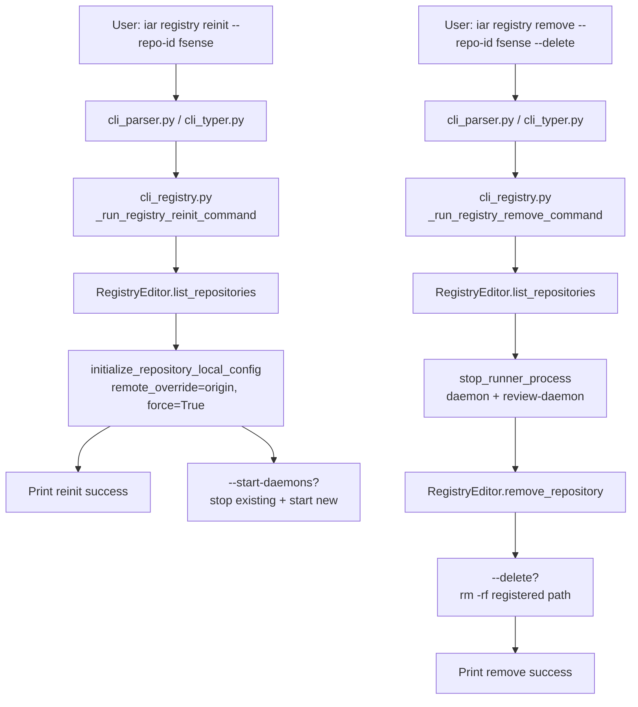

# PRD: Registry 仓库重初始化与取消接管（`iar registry reinit/remove`）

## 1. Introduction & Goals

### Problem Statement

`iar takeover` 把 GitHub 仓库 clone 到 `~/.iar/repos` 后会自动写入 `.iar.toml` 并注册到 `config.toml`。实际运行中出现两类运维问题：

1. **已接管仓库的 `.iar.toml` 配置写错后无法通过 CLI 修正**。例如用户本地 git 分支的 upstream remote 名称与 `gh repo clone` 后的实际 remote 不一致（如 upstream 指向不存在的 `zata`，实际只有 `origin`），`takeover` 会按自动检测写入 `remote = "zata"`，导致 `iar daemon` preflight 失败。当前唯一修复方式是手动进目录编辑 `.iar.toml` 或跑 `iar init --force --remote origin`。
2. **没有 CLI 方式取消已接管仓库的托管**。用户想停止 daemon、从 registry 删除条目、 optionally 删除本地 clone 时，必须手动 `pkill`、手动改 `config.toml`、手动 `rm -rf`。

本 PRD 把这两个运维动作收拢到 `iar registry` 子命令下，用户无需离开 CLI 或手动编辑文件。

### Proposed Solution Summary

- 在 `iar registry` 下新增两个子命令：
  - `iar registry reinit --repo-id <id> [--remote origin] [--base-branch main] [--start-daemons]`：对 registry 中已存在的仓库重新执行初始化，默认强制 `remote="origin"`，可覆盖其他 git 配置。
  - `iar registry remove --repo-id <id> [--delete]`：停止该仓库的 daemon / review-daemon，从 `config.toml` 删除 registry 条目，可选删除本地 clone 目录。
- 复用现有 `IRepositoryRegistryEditor`、`initialize_repository_local_config`、`start_runner_process`、`stop_runner_process` 等能力，不新增持久化层或进程管理层。
- 在 `IRepositoryRegistryEditor` 新增 `remove_repository(repo_id)` 方法，由 `TOMLRegistryEditor` 实现。

### Measurable Objectives

- 用户可以通过 `iar registry reinit --repo-id zata-zhangtao-fsense` 把 `.iar.toml` 的 `remote` 修正为 `origin` 并重新注册，无需手动编辑。
- 用户可以通过 `iar registry remove --repo-id zata-zhangtao-fsense` 停止该仓库的所有托管进程并从 registry 移除。
- `remove --delete` 仅删除 registry 中记录的克隆路径，且路径必须匹配注册记录，避免误删。
- 现有 `iar registry scan/sync` 行为不受影响。
- `just test` 全绿（除已知的 deliberation 测试失败外）。

### Realistic Validation

除单元测试和集成测试外，本 PRD 要求通过**真实项目入口点**验证关键行为，确保真实 CLI 路径生效，而非仅在隔离 fixture 中通过。

- [x] **reinit 真实验证**：通过 `uv run iar registry reinit --repo-id <fixture-repo>` 验证 `.iar.toml` 的 `remote` 被更新为 `origin` 且 registry 条目保持有效。
- [x] **remove 真实验证**：通过 `uv run iar registry remove --repo-id <fixture-repo>` 验证 registry 条目被删除、相关进程不再轮询。
- [x] **remove --delete 真实验证**：通过 `uv run iar registry remove --repo-id <fixture-repo> --delete` 验证克隆目录被删除。

**为什么单元测试不够**：这些命令涉及真实 `config.toml` 写入、真实子进程启动/停止、真实文件系统删除，必须通过 CLI 入口验证 end-to-end 行为；单元测试只能覆盖被 mock 后的内部函数。

### Delivery Dependencies

- Group: agent-runner-registry-lifecycle
- Depends on groups:
  - none
- Depends on tasks/issues:
  - none
- Gate type: none
- Notes: 本功能与 `P1-FEAT-20260622-152049-iar-repl-interactive-entry.md` 无依赖关系；与已归档的 `P1-FEAT-20260615-212235-registry-discovery-sync.md` 共享 `iar registry` 命令分组，但功能独立。

## 2. Requirement Shape

- **Actor**：使用 `iar` 管理多个仓库的开发者/运维人员。
- **Trigger**：
  - 已 take over 的仓库因 remote/base_branch 配置错误导致 daemon preflight 失败。
  - 用户决定不再托管某个已 take over 的仓库。
- **Expected Behavior**：
  - `reinit` 只接受 registry 中已存在的 `repo_id`；若不存在则报错。
  - `reinit` 默认写入 `remote = "origin"`（因为 takeover 的仓库都来自 GitHub clone），允许 `--remote` 覆盖。
  - `reinit` 复用 `initialize_repository_local_config` 的 `--force` 行为，覆盖已有 `.iar.toml`。
  - `reinit` 可选 `--start-daemons` 立即重启 daemon 和 review-daemon。
  - `remove` 只接受 registry 中已存在的 `repo_id`；若不存在则报错。
  - `remove` 先停止该仓库所有托管进程（daemon、review-daemon），再删除 registry 条目。
  - `remove --delete` 删除 registry 中记录的克隆目录；目录路径必须与 registry 记录一致，否则拒绝删除。
  - `remove` 不带 `--delete` 时保留本地代码，仅停止托管。
- **Explicit Scope Boundary**：
  - 不修改 `iar takeover` 的首次 onboarding 流程。
  - 不增加新的持久化存储或进程监管抽象。
  - 不处理仓库内部的 git 清理（分支、worktree 等）。

## 3. Repository Context And Architecture Fit

### Current Relevant Modules And Files

| 路径 | 当前职责 | 与本 PRD 的关系 |
|---|---|---|
| `src/backend/api/cli_parser.py` | argparse 子命令定义 | 新增 `registry reinit/remove` 子命令参数 |
| `src/backend/api/cli_typer.py` | Typer 命令树 | 新增 `registry_app` 子命令注册 |
| `src/backend/api/cli.py` | CLI 执行后端 | 新增 `registry reinit/remove` dispatch 分支 |
| `src/backend/api/cli_registry.py`（新建）| registry 子命令执行 | 集中实现 reinit/remove 命令逻辑 |
| `src/backend/core/shared/interfaces/runner_console.py` | `IRepositoryRegistryEditor` 端口 | 新增 `remove_repository` 抽象方法 |
| `src/backend/core/use_cases/console_processes.py` | 启动/停止托管进程 | `remove` 调用 `stop_runner_process` |
| `src/backend/engines/agent_runner/repository_local.py` | `initialize_repository_local_config` | `reinit` 复用 |
| `src/backend/engines/agent_runner/factory.py` | 创建 registry editor、process supervisor | `reinit/remove` 复用 |
| `src/backend/infrastructure/config/registry_editor.py` | `TOMLRegistryEditor` | 实现 `remove_repository` |
| `tests/test_agent_runner_cli.py` | CLI 测试 | 新增 reinit/remove 测试 |
| `tests/test_agent_runner_config.py` / `test_agent_runner_init.py` | registry editor 测试 | 新增 remove_repository 测试 |

### Existing Architecture Pattern To Follow

- 四层依赖方向：`api/` → `core/` → `engines/` → `infrastructure/`。
- CLI 只做参数解析和依赖装配，业务逻辑在新增/复用的 use case / engines 函数中。
- Registry 写操作统一通过 `IRepositoryRegistryEditor`。
- 进程管理统一通过 `ProcessSupervisor` / `start_runner_process` / `stop_runner_process`。

### Ownership And Dependency Boundaries

- `api/cli_registry.py` 拥有命令入口形态和 Rich 输出。
- `core/shared/interfaces/runner_console.py` 拥有 `IRepositoryRegistryEditor` 契约。
- `infrastructure/config/registry_editor.py` 拥有 `config.toml` 写回实现。
- `core/use_cases/console_processes.py` 拥有进程启停逻辑。

### Constraints From Runtime, Docs, Tests, Workflows

- `just test` 必须全绿（已存在的 deliberation 测试失败除外）。
- 单文件非空行不超过 1000 行；新增文件需控制规模。
- 变更需同步 `docs/guides/agent-runner.md` 与 `docs/guides/configuration.md`（如有新增配置）。
- 不新增外部依赖。

### Matching Or Related PRDs

- `tasks/archive/P1-FEAT-20260615-212235-registry-discovery-sync.md`（已完成）：定义了 `iar registry scan/sync`。本 PRD 扩展同一命令分组，功能互补。
- `tasks/pending/P1-FEAT-20260622-152049-iar-repl-interactive-entry.md`：无关；REPL 入口与本 registry 生命周期管理独立。
- `tasks/archive/P1-FEAT-20260611-205725-agent-runner-unified-ops-console.md`：涉及进程管理 UI；本 PRD 通过 CLI 复用同一 `stop_runner_process`，不冲突。

## 4. Recommendation

### Recommended Approach

**扩展 `iar registry` 子命令组，新增 `reinit` 和 `remove`。**

1. 在 `IRepositoryRegistryEditor` 新增 `remove_repository(repo_id: str) -> None`。
2. 在 `TOMLRegistryEditor` 实现 `remove_repository`，从 `config.toml` 的 `[agent_runner.repositories]` 下删除对应段并写回文件。
3. 新建 `src/backend/api/cli_registry.py`，实现：
   - `_run_registry_reinit_command(parsed, process_runner)`：查 registry → 调用 `initialize_repository_local_config(..., remote_override="origin" or parsed.remote, force=True)` → 可选重启 daemon/review-daemon。
   - `_run_registry_remove_command(parsed, process_runner)`：查 registry → `stop_runner_process` 停止所有该 repo 的进程 → `editor.remove_repository(repo_id)` → 可选 `rm -rf` 克隆目录（带路径校验）。
4. 在 `cli_parser.py`、`cli_typer.py`、`cli.py` 注册两个新子命令。
5. 新增/更新测试覆盖：registry editor remove、CLI reinit 更新 remote、CLI remove 删除条目与目录。

### Why This Is The Best Fit

- 与现有 `iar registry scan/sync` 自然分组，用户容易发现。
- 复用现有 `initialize_repository_local_config` 和 `stop_runner_process`，不引入新抽象。
- `remove_repository` 是 registry editor 的合理扩展，未来其他入口（如 console UI）也能复用。

### Alternatives Considered

| 方案 | 说明 | 未采纳原因 |
|---|---|---|
| A. `iar takeover --force` | 让 takeover 重新处理已注册仓库 | `takeover` 语义是 onboarding；重复 onboarding 与“生命周期管理”混淆；且取消接管无法放入 |
| B. 顶层命令 `iar reinit` / `iar unregister` | 不改动 registry 子命令 | 增加顶层命令数量，与现有 `iar registry scan/sync` 分组割裂 |
| C. 自动在 daemon preflight 失败时修复 remote | daemon 自动改写 `.iar.toml` | 破坏“配置显式声明”原则；daemon 不应修改仓库本地配置 |
| D. 在 `iar init` 里加 `--repo-id` 远程定位 | `iar init` 基于 cwd | 需要用户先 `cd` 到目标仓库，不如 `registry reinit --repo-id` 直接 |

## 5. Implementation Guide

> This section is a living implementation guide based on current repository analysis. If implementation discovers additional affected files, hidden dependencies, edge cases, or a better path, update this PRD before proceeding.

### Core Logic

#### `iar registry reinit --repo-id <id> [--remote origin] [--base-branch main] [--start-daemons]`

1. 创建 registry editor，读取所有 registry 条目。
2. 若 `repo_id` 不存在，报错退出。
3. 获取对应条目的 `path`。
4. 调用 `initialize_repository_local_config(
       RepositoryInitOptions(
           cwd=Path(path),
           repo_id_override=repo_id,
           display_name_override=entry.display_name or repo_id,
           remote_override=parsed.remote or "origin",
           base_branch_override=parsed.base_branch,
           force=True,
       ),
       process_runner,
   )`。
5. 输出成功信息。
6. 若 `--start-daemons`：先停止该 repo 现有 daemon/review-daemon，再调用 `start_runner_process` 启动新的。

#### `iar registry remove --repo-id <id> [--delete]`

1. 创建 registry editor，读取所有 registry 条目。
2. 若 `repo_id` 不存在，报错退出。
3. 获取对应条目的 `path`。
4. 创建 process supervisor，列出所有进程，停止 `repo_id` 匹配的 `daemon` 和 `review-daemon`。
5. 调用 `editor.remove_repository(repo_id)` 从 `config.toml` 删除条目。
6. 若 `--delete`：
   - 校验 `path` 等于 registry 中记录的绝对路径；
   - 校验路径在 `~/.iar/repos` 下（安全边界）；
   - 删除目录；
   - 输出删除信息。
7. 输出移除成功信息。

#### `IRepositoryRegistryEditor.remove_repository`

- 接口新增抽象方法：
  ```python
  @abstractmethod
  def remove_repository(self, repo_id: str) -> None:
      """Remove a repository entry from the registry."""
  ```
- `TOMLRegistryEditor` 实现：
  - 读取 document；
  - 从 `agent_runner.repositories` 删除 `repo_id` 对应的 table；
  - 若删除后 repositories table 为空，保留空 table（避免破坏注释结构）；
  - 写回文件。

### Change Impact Tree

```text
.
├── src/backend/api/cli_parser.py
│   [修改]
│   【总结】新增 registry reinit/remove 子命令参数定义
│   ├── registry reinit: --repo-id, --remote, --base-branch, --start-daemons
│   └── registry remove: --repo-id, --delete
│
├── src/backend/api/cli_typer.py
│   [修改]
│   【总结】在 registry_app 下注册 reinit/remove 命令
│   ├── reinit_command
│   └── remove_command
│
├── src/backend/api/cli.py
│   [修改]
│   【总结】新增 "registry reinit" / "registry remove" dispatch 分支
│
├── src/backend/api/cli_registry.py
│   [新增]
│   【总结】registry reinit/remove 命令执行逻辑
│   ├── _run_registry_reinit_command
│   └── _run_registry_remove_command
│
├── src/backend/core/shared/interfaces/runner_console.py
│   [修改]
│   【总结】IRepositoryRegistryEditor 新增 remove_repository 契约
│
├── src/backend/infrastructure/config/registry_editor.py
│   [修改]
│   【总结】TOMLRegistryEditor 实现 remove_repository
│
├── src/backend/engines/agent_runner/repository_local.py
│   [无需修改]
│   【总结】reinit 复用现有 initialize_repository_local_config
│
├── src/backend/core/use_cases/console_processes.py
│   [无需修改]
│   【总结】remove 复用现有 stop_runner_process
│
├── tests/test_agent_runner_cli.py
│   [修改]
│   【总结】新增 reinit/remove CLI 测试
│
├── tests/test_agent_runner_config.py
│   [修改]
│   【总结】新增 TOMLRegistryEditor.remove_repository 测试
│
└── docs/guides/agent-runner.md
    [修改]
    【总结】新增 registry reinit/remove 使用说明
```

### Executor Drift Guard

- 搜索 registry editor 接口：`rg -n "class IRepositoryRegistryEditor" src/backend/core/shared/interfaces/runner_console.py`
- 搜索 registry editor 实现：`rg -n "class TOMLRegistryEditor" src/backend/infrastructure/config/registry_editor.py`
- 搜索 registry CLI 现有分支：`rg -n "registry scan|registry sync" src/backend/api/cli.py`
- 搜索进程停止入口：`rg -n "def stop_runner_process" src/backend/core/use_cases/console_processes.py`
- 搜索 initialize_repository_local_config：`rg -n "def initialize_repository_local_config" src/backend/engines/agent_runner/repository_local.py`
- 如果实现时发现 `IRepositoryRegistryEditor` 已有 `remove_repository` 的别称或替代方法，应复用而不是新增。

### Flow / Architecture Diagram



### Realistic Validation Plan

| Behavior | Real Entry Point | Test Layer | Mock Boundary | Data/Env Needed | Command Or Procedure | Required For Acceptance |
|---|---|---|---|---|---|---|
| reinit 更新 remote | `uv run iar registry reinit --repo-id <fixture-id>` | CLI integration | `gh` 不调用；进程可选 mock | temp registry + temp clone with `.iar.toml` | `uv run pytest tests/test_agent_runner_cli.py -k "registry_reinit" -q` | Yes |
| remove 删除 registry 条目 | `uv run iar registry remove --repo-id <fixture-id>` | CLI integration | 进程停止 mock | temp registry + temp clone | `uv run pytest tests/test_agent_runner_cli.py -k "registry_remove" -q` | Yes |
| remove --delete 删除目录 | `uv run iar registry remove --repo-id <fixture-id> --delete` | CLI integration | 进程停止 mock | temp registry + temp clone under temp HOME | `uv run pytest tests/test_agent_runner_cli.py -k "registry_remove_delete" -q` | Yes |
| remove 对不存在 repo_id 报错 | `uv run iar registry remove --repo-id no-such-repo` | CLI smoke | 全部 mock | any | `uv run pytest tests/test_agent_runner_cli.py -k "registry_remove_missing" -q` | Yes |
| registry editor remove | `TOMLRegistryEditor.remove_repository` | unit | 文件系统真实 | temp config.toml | `uv run pytest tests/test_agent_runner_config.py -k "remove_repository" -q` | Yes |

### Low-Fidelity Prototype

No interactive UI; not required.

### ER Diagram

No data model changes in this PRD. `remove_repository` 删除现有 TOML table 中的条目，不引入新实体或字段。

### Interactive Prototype Change Log

No interactive prototype file changes in this PRD.

### External Validation

No external validation required; repository evidence was sufficient.

## 6. Definition Of Done

- [x] `iar registry reinit --repo-id <id>` 可修正已接管仓库的 `.iar.toml` 配置。
- [x] `iar registry remove --repo-id <id>` 可停止进程并从 registry 移除条目。
- [x] `iar registry remove --repo-id <id> --delete` 可删除本地 clone 目录。
- [x] 新增 `IRepositoryRegistryEditor.remove_repository` 及 `TOMLRegistryEditor` 实现。
- [x] 现有 `iar registry scan/sync` 行为无回归。
- [x] `just test` 全绿。
- [x] `docs/guides/agent-runner.md` 更新。

## 7. Acceptance Checklist

### Architecture Acceptance

- [x] `remove_repository` 新增在 `IRepositoryRegistryEditor` 接口，由 `TOMLRegistryEditor` 实现。
- [x] `cli_registry.py` 不直接读写 `config.toml`，只通过 `IRepositoryRegistryEditor` 操作。
- [x] `remove` 命令通过 `stop_runner_process` 停止进程，不直接 `kill`。
- [x] 四层架构依赖方向无违例。

### Behavior Acceptance

- [x] `reinit` 只接受 registry 中已存在的 `repo_id`；不存在时报错。
- [x] `reinit` 默认写入 `remote = "origin"`。
- [x] `reinit --remote upstream` 可覆盖默认 remote。
- [x] `reinit --start-daemons` 会重启 daemon 和 review-daemon。
- [x] `remove` 停止该仓库的 daemon 和 review-daemon。
- [x] `remove` 从 `config.toml` 删除 registry 条目。
- [x] `remove --delete` 删除 registry 记录的克隆路径。
- [x] `remove --delete` 拒绝删除与 registry 记录不一致的路径。

### Documentation Acceptance

- [x] `docs/guides/agent-runner.md` 新增 `### 重新初始化与取消接管` 小节，说明 `registry reinit/remove` 用法。

### Validation Acceptance

- [x] `uv run pytest tests/test_agent_runner_cli.py -k "registry" -q` 通过。
- [x] `uv run pytest tests/test_agent_runner_config.py -k "remove_repository" -q` 通过。
- [x] `just test` 全绿。

## 8. Functional Requirements

- **FR-1**：CLI 必须提供 `iar registry reinit --repo-id <id>` 命令。
- **FR-2**：`reinit` 必须重新初始化目标仓库的 `.iar.toml`，默认 `remote = "origin"`。
- **FR-3**：`reinit` 必须支持 `--remote`、`--base-branch` 覆盖。
- **FR-4**：`reinit` 必须支持 `--start-daemons` 在初始化后重启 daemon 和 review-daemon。
- **FR-5**：`reinit` 在 `repo_id` 不存在时必须返回清晰错误。
- **FR-6**：CLI 必须提供 `iar registry remove --repo-id <id>` 命令。
- **FR-7**：`remove` 必须先停止目标仓库的所有托管进程，再删除 registry 条目。
- **FR-8**：`remove` 必须支持 `--delete` 删除本地 clone 目录。
- **FR-9**：`remove --delete` 必须校验待删除路径与 registry 记录一致。
- **FR-10**：`remove` 在 `repo_id` 不存在时必须返回清晰错误。
- **FR-11**：`IRepositoryRegistryEditor` 必须提供 `remove_repository(repo_id)` 方法。

## 9. Non-Goals

- 不修改 `iar takeover` 的首次 onboarding 逻辑。
- 不新增 Web UI 或 console API 入口（可后续扩展）。
- 不自动清理仓库内部的 issue worktree、分支或证据文件。
- 不提供批量 reinit/remove（先做单条；未来可扩展）。
- 不在 `remove` 中自动删除 SQLite 运行历史记录。

## 10. Risks And Follow-Ups

| 风险 | 影响 | 缓解 |
|---|---|---|
| `remove --delete` 误删非 clone 目录 | 中 | 强制校验路径等于 registry 记录，且默认不删除 |
| 停止 daemon 时进程已不存在 | 低 | `stop_runner_process` 应优雅处理缺失进程 |
| `reinit` 覆盖用户自定义的 `.iar.toml` | 中 | `reinit` 语义就是强制重新初始化；用户可提前备份 |
| 取消接管后遗留进程日志/审计 | 低 | 保留在 `~/.iar/process-logs/` 供人工排查 |

## 11. Decision Log

| ID | Decision | Chosen | Rejected | Rationale |
|---|---|---|---|---|
| D-01 | 命令入口 | `iar registry reinit/remove` | `iar takeover --force` / 顶层 `iar reinit` | 与现有 `registry scan/sync` 自然分组，语义清晰 |
| D-02 | reinit 默认 remote | `origin` | 自动检测 | takeover 的仓库均来自 GitHub clone，remote 必然为 origin；避免被 stale git config 带偏 |
| D-03 | remove 删除策略 | 先停进程，再删 registry，最后可选删目录 | 先删 registry 再停进程 | 防止 daemon 在条目删除后仍尝试写入/轮询 |
| D-04 | remove --delete 安全校验 | 校验路径等于 registry 记录 | 无校验直接删除 | 避免误删用户工作目录 |
| D-05 | registry 移除实现位置 | `TOMLRegistryEditor.remove_repository` | 在 CLI 里直接编辑 config.toml | 保持 registry 写操作统一通过 editor 端口 |
