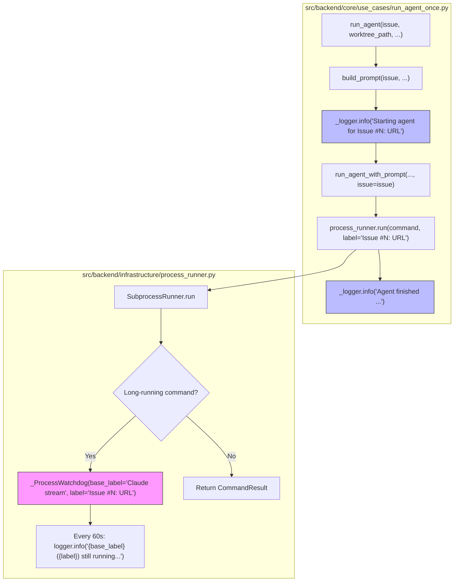

# PRD: Agent Runner Issue 上下文日志（Issue URL 不被截断）

## 1. Introduction & Goals

### Problem Statement

当前 Agent Runner 调用 `claude` / `codex` / `kimi` 时，把完整 prompt（含 `Issue URL: https://github.com/...`）作为命令行最后一个参数传入。`src/backend/infrastructure/process_runner.py` 的 `_ProcessWatchdog` 在记录心跳/超时日志时，使用 `_summarize_command` 将整条命令压缩到 240 字符以内，超出部分用 `...` 截断。

结果如日志所示：

```
2026-06-22 17:47:02 - app - INFO - process_runner.py:300 - Claude stream still running after 60s: claude --dangerously-skip-permissions ... Repair GitHub Issue #23: [Feature] Schema-Aware End-to-End Evaluation Framework

Issue URL: https://github.com/zata-zhangtao/fsense...
```

运维或调试人员无法从日志直接判断 agent 正在处理哪个 Issue，必须向前翻找其他日志行或查看进程参数，诊断效率低。

### Proposed Solution Summary

把 Issue 标识（`issue_number` 和 `issue_url`）提升为 **agent 运行日志的一等公民**，而不是依赖被截断的命令行 prompt。

具体做法：

1. 在 `run_agent_once.py` 启动 agent **之前/之后** 显式记录 `Issue #{number}` 和完整 `Issue URL`，作为该次运行的锚点日志。
2. 给 `IProcessRunner.run` 增加可选的 `label` 参数（向后兼容，默认行为不变），`SubprocessRunner` 把它透传给 `_ProcessWatchdog`。
3. `_ProcessWatchdog` 的心跳/超时日志从原来的纯命令摘要，改为携带 `label`：
   ```
   Claude stream (Issue #23: https://github.com/zata-zhangtao/fsense/issues/23) still running after 60s: claude --dangerously-skip-permissions ...
   ```
4. 保持 `_summarize_command` 的 240 字符截断不变，避免长 prompt 污染日志；Issue URL 通过独立字段完整保留。

核心复用现有 `IssueSummary` 模型中已有的 `number` 和 `url` 字段，不新增存储、不新增依赖、不破坏现有接口。

### Measurable Objectives

- 任何一次 `run_agent` / `run_agent_with_prompt` 调用，在日志中至少有一条独立、完整、不被截断的 `Issue URL` 记录。
- `_ProcessWatchdog` 心跳日志能一眼识别当前处理的 Issue 编号与完整 URL。
- `_summarize_command` 继续截断长命令，但截断不再导致 Issue URL 丢失。
- 现有 `IProcessRunner` 实现与测试不受影响（新增参数有默认值）。
- `just test` 全绿，`docs/guides/agent-runner.md` 同步更新。

### Realistic Validation

除单元测试外，本 PRD 要求通过**真实项目入口点**验证日志输出形态。

- [x] **启动日志真实验证**：通过 `uv run pytest tests/test_run_agent.py -k "test_run_agent_logs_issue_context" -q` 验证启动日志包含完整 Issue URL。
- [x] **Watchdog 心跳日志真实验证**：通过 `tests/test_process_runner.py::test_process_watchdog_includes_context_label_in_logs` 验证心跳日志包含 `Issue #N` 和完整 URL。
- [x] **无回归真实验证**：运行 `just test`，确认现有 process_runner 测试、run_agent 测试、CLI 测试全部通过。

**为什么单元测试不够**：日志格式问题只有在真实子进程执行路径 + 真实 logger 输出路径上才能完整验证；单元测试中的假 process runner 不会触发 `_ProcessWatchdog`，也无法证明 logger message 的最终形态。

### Delivery Dependencies

- Group: agent-runner-observability
- Depends on groups:
  - none
- Depends on tasks/issues:
  - none
- Gate type: none
- Notes: 本功能是纯日志增强，不阻塞其他任务，也不被其他 pending 任务阻塞。与 `tasks/archive/P1-FEAT-20260624-195000-prd-iar-run-once-logging-timestamps.md`（日志时间戳）和 `tasks/archive/P1-BUG-20260527-173500-process-runner-error-diagnosability.md`（错误诊断）同属可观测性改进，但无依赖关系。

## 2. Requirement Shape

### Actor

开发者 / 运维人员，通过日志追踪 Agent Runner 正在处理哪个 GitHub Issue。

### Trigger

Agent Runner 启动一次 agent 执行（`run_agent`、`run_agent_with_prompt`、recovery、continuation 等任何调用 `process_runner.run` 的路径）。

### Expected Behavior

1. **启动锚点日志**：`run_agent` 或 `run_agent_with_prompt` 调用 `process_runner.run` 前，记录：
   ```
   Starting agent for Issue #23: https://github.com/zata-zhangtao/fsense/issues/23
   ```
2. **结束锚点日志**：agent 进程结束后，记录：
   ```
   Agent finished for Issue #23: https://github.com/zata-zhangtao/fsense/issues/23 (exit_code=0)
   ```
3. **Watchdog 上下文**：`_ProcessWatchdog` 心跳/超时日志格式：
   ```
   Claude stream (Issue #23: https://github.com/zata-zhangtao/fsense/issues/23) still running after 60s: claude --dangerously-skip-permissions ...
   ```
4. **命令摘要保持截断**：`_summarize_command` 仍限制 240 字符，保证日志可读性；Issue URL 不依赖命令摘要。
5. **接口向后兼容**：`IProcessRunner.run` 新增 `label: str | None = None` 可选参数，现有调用方无需修改。

### Explicit Scope Boundary

- 只做日志增强，不改 agent prompt、不改命令构建、不改 Issue 状态机。
- 不改 `_summarize_command` 的截断策略（避免长命令日志泛滥）。
- 不新增持久化表或外部依赖。
- 不修改日志文件路径、日志级别、日志轮转策略。

## 3. Repository Context And Architecture Fit

### Current Relevant Modules/Files

| 文件 | 作用 | 与本次改动关系 |
|---|---|---|
| `src/backend/infrastructure/process_runner.py` | `SubprocessRunner`、`_ProcessWatchdog`、`_summarize_command` | 给 `_ProcessWatchdog` 增加 `label` 参数；在心跳/超时日志中使用 label |
| `src/backend/core/shared/interfaces/agent_runner.py` | `IProcessRunner` 端口 | `run` 方法签名新增可选 `label` 参数 |
| `src/backend/core/use_cases/run_agent_once.py` | `run_agent`、`run_agent_with_prompt`、recovery/continuation 调用点 | 启动/结束时记录完整 Issue URL；调用 process_runner 时传入 `label` |
| `src/backend/core/use_cases/agent_runner_feedback.py` | `build_prompt` / `build_recovery_prompt` / `build_progress_continuation_prompt` | 确认 Issue URL 来源；无需修改 |
| `src/backend/core/shared/models/agent_runner.py` | `IssueSummary`（含 `number`、`url`） | 复用已有字段 |
| `tests/test_process_runner.py` | process_runner 单元测试 | 新增/更新 label 相关断言 |
| `tests/test_run_agent.py` | `run_agent` 相关测试 | 新增/更新 issue 上下文日志断言 |
| `tests/test_agent_runner_cli.py` | CLI 入口测试 | 确认无回归 |
| `docs/guides/agent-runner.md` | Agent Runner 使用指南 | 新增日志可观测性说明 |

### Existing Architecture Pattern To Follow

- 四层依赖方向：`api/` → `core/` → `engines/` → `infrastructure/`。
- `core` 层依赖 `core/shared/interfaces/` 的抽象端口，不依赖 `infrastructure` 的具体实现。
- `SubprocessRunner` 通过 duck typing 实现 `IProcessRunner`。
- 日志使用 `backend.infrastructure.logging.logger` 中配置的共享 logger。

### Ownership And Dependency Boundaries

- `core/use_cases/run_agent_once.py` 拥有"何时记录 Issue 上下文"的决策权。
- `core/shared/interfaces/agent_runner.py` 拥有 `IProcessRunner` 端口契约。
- `infrastructure/process_runner.py` 拥有命令执行与 watchdog 日志的具体实现。

### Constraints From Runtime, Docs, Tests, Workflows

- `just test` 必须全绿。
- 单文件非空行不超过 1000 行。
- 新增公共 API 使用 Google Style Docstrings。
- 文档需同步更新 `docs/guides/agent-runner.md`。

### Matching Or Related PRDs

- `tasks/archive/P1-BUG-20260527-173500-process-runner-error-diagnosability.md`：改进了命令失败时的错误信息，也涉及 process_runner 日志。本 PRD 与其正交，不冲突。
- `tasks/archive/P1-FEAT-20260624-195000-prd-iar-run-once-logging-timestamps.md`：增加了日志时间戳和结构化事件记录。本 PRD 在其基础上增强 Issue 上下文，可共存。
- `tasks/archive/P1-FEAT-20260611-205725-agent-runner-unified-ops-console.md`：引入了 `run_records` 审计表。未来可把 `issue_url` 扩展到该表，但本 PRD 不依赖它。
- `tasks/pending/`：当前无重复或依赖的 pending PRD。

## 4. Recommendation

### Recommended Approach

**最小改动双管齐下：启动锚点日志 + Watchdog label。**

1. 在 `run_agent_once.py` 的 `run_agent` 函数中，调用 `process_runner.run` 前后增加 `_logger.info`：
   ```python
   _logger.info(
       "Starting agent for Issue #%d: %s",
       issue.number,
       issue.url,
   )
   result = process_runner.run(
       command,
       cwd=worktree_path,
       capture_output=capture_output,
       label=f"Issue #{issue.number}: {issue.url}",
   )
   _logger.info(
       "Agent finished for Issue #%d: %s (exit_code=%d)",
       issue.number,
       issue.url,
       result.return_code,
   )
   ```
2. 在 `IProcessRunner.run` 签名中新增 `label: str | None = None`。
3. 在 `SubprocessRunner.run` 中透传 `label` 给 `_ProcessWatchdog`。
4. 在 `_ProcessWatchdog` 中保存 `label`，并在心跳/超时日志中前置：
   ```python
   label_suffix = f" ({self._label})" if self._label else ""
   logger.info(
       "%s%s still running after %ds: %s",
       self._label_base,
       label_suffix,
       elapsed_seconds,
       _summarize_command(self._command),
   )
   ```
   其中 `_label_base` 是 `"Claude stream"` / `"Command"` 等原有标签。

### Why This Is The Best Fit

- 满足核心需求：Issue URL 作为独立字段完整出现在日志中。
- 最小侵入：只新增一个可选参数 + 几条日志语句，不改现有命令构建、prompt、状态机。
- 向后兼容：`label` 默认 `None`，现有调用方和测试无需改动。
- 保留原有截断策略：命令摘要仍然简短，不会被长 prompt 污染。

### Alternatives Considered

| 方案 | 说明 | 未采纳原因 |
|---|---|---|
| A. 直接提高 `_summarize_command` 截断长度到 1000+ | 让命令摘要包含完整 URL | 无法保证永远够长（prompt 可达数千字），且会让心跳日志变得臃肿 |
| B. 从 prompt 中解析并提取 URL 再拼回摘要 | 在 `_summarize_command` 中识别 `Issue URL:` | 依赖 prompt 格式， brittle；且无法解决 recovery/continuation 等不同 prompt 模板 |
| C. 使用 `contextvars` + logging filter 自动给所有日志加 issue 上下文 | 全局日志增强 | 改动面大，需要修改 logger 配置，且对现有日志格式有全局影响；本需求只需在 agent 运行路径生效 |
| D. 把 issue 信息持久化到 `run_records` 表 | 扩展 Unified Ops Console | 有价值，但超出本 PRD 范围；可作为后续增强 |

## 5. Implementation Guide

> This section is a living implementation guide based on current repository analysis. If implementation discovers additional affected files, hidden dependencies, edge cases, or a better path, update this PRD before proceeding.

### Core Logic

1. **扩展 `IProcessRunner` 端口**
   - 文件：`src/backend/core/shared/interfaces/agent_runner.py`
   - 在 `IProcessRunner.run` 签名中新增可选参数：
     ```python
     def run(
         self,
         command: Sequence[str],
         *,
         cwd: Path,
         check: bool = True,
         timeout: int | None = None,
         capture_output: bool = True,
         input_text: str | None = None,
         label: str | None = None,
     ) -> CommandResult:
     ```
   - Docstring 说明：`label` 用于在 watchdog 心跳/超时日志中标识本次运行的上下文（例如 Issue 编号和 URL）。

2. **扩展 `SubprocessRunner.run` 并透传 label**
   - 文件：`src/backend/infrastructure/process_runner.py`
   - `SubprocessRunner.run` 签名同步新增 `label: str | None = None`。
   - 在以下四处创建 `_ProcessWatchdog` 的地方透传 `label`：
     - `capture_output and timeout is not None` 分支的 `_run_captured_process`
     - `not capture_output` 分支的 `_ProcessWatchdog(...)`
     - `run_filtered_claude_stream` 函数内部（Claude 流式渲染路径）
   - 注意：`input_text is not None` 的短命令分支不走 watchdog，无需处理。

3. **改造 `_ProcessWatchdog`**
   - 文件：`src/backend/infrastructure/process_runner.py`
   - `__init__` 增加 `label: str | None = None` 参数并保存为 `self._label`。
   - 心跳日志（`_run` 方法中）改成：
     ```python
     label_part = f" ({self._label})" if self._label else ""
     logger.info(
         "%s%s still running after %ds: %s",
         self._label,
         label_part,
         elapsed_seconds,
         _summarize_command(self._command),
     )
     ```
     为避免 `self._label` 被双重使用，建议把构造时的 `label` 参数改叫 `context` 或 `extra_label`，原 `label` 参数保留为 base label（如 `"Claude stream"`）。更简单的做法是：`_ProcessWatchdog` 接收 `base_label` 和 `context_label` 两个可选参数。
   - 推荐最小改法：把 `_ProcessWatchdog` 的 `label` 参数含义改为 "额外上下文"，把原有的 `label="Claude stream"` 改为 `base_label="Claude stream"` 类属性或独立参数。

4. **在 `run_agent_once.py` 记录启动/结束锚点日志并传入 label**
   - 文件：`src/backend/core/use_cases/run_agent_once.py`
   - 修改 `run_agent` 函数，把 `issue` 透传给 `run_agent_with_prompt`：
     ```python
     def run_agent(
         agent_name: str,
         issue: IssueSummary,
         worktree_path: Path,
         config: AppConfig,
         process_runner: IProcessRunner,
     ) -> CommandResult:
         prompt = build_prompt(issue, worktree_path, config.prompts)
         return run_agent_with_prompt(
             agent_name, prompt, worktree_path, process_runner, issue=issue
         )
     ```
   - 修改 `run_agent_with_prompt` 签名，新增可选 `issue: IssueSummary | None = None`：
     ```python
     def run_agent_with_prompt(
         agent_name: str,
         prompt: str,
         worktree_path: Path,
         process_runner: IProcessRunner,
         capture_output: bool = True,
         issue: IssueSummary | None = None,
     ) -> CommandResult:
     ```
   - 在函数体内：
     ```python
     label = None
     if issue is not None:
         label = f"Issue #{issue.number}: {issue.url}"
         _logger.info("Starting agent for Issue #%d: %s", issue.number, issue.url)
     result = process_runner.run(
         command,
         cwd=worktree_path,
         capture_output=capture_output,
         label=label,
     )
     if issue is not None:
         _logger.info(
             "Agent finished for Issue #%d: %s (exit_code=%d)",
             issue.number,
             issue.url,
             result.return_code,
         )
     return result
     ```
   - 在 `run_agent` 调用处传入 `issue=issue`；其他已有调用 `run_agent_with_prompt` 的地方不传入 `issue`，保持行为不变。

5. **确保 recovery / continuation 路径也受益**
   - `run_agent_until_committed` 中的 recovery/continuation 最终都会调用 `run_agent`，因此启动/结束锚点日志会自动生效。
   - 如果存在直接调用 `run_agent_with_prompt` 而不传 `issue` 的 recovery 路径，可继续复用 `issue` 参数透传。

6. **更新测试**
   - `tests/test_process_runner.py`：新增/修改测试，验证 `_ProcessWatchdog` 在传入 `label` 时心跳日志包含该 label。
   - `tests/test_run_agent.py`：新增测试，验证 `run_agent_with_prompt` 在有 `issue` 参数时会记录启动/结束日志，并且传给 `process_runner.run` 的 `label` 包含完整 URL。
   - 现有测试中的 `FakeProcessRunner` 需要接受并忽略新的 `label` 参数（`**kwargs` 或显式参数）。

7. **更新文档**
   - `docs/guides/agent-runner.md`：新增一个小节，说明 Agent Runner 日志中会自动包含 Issue 编号和完整 URL，便于追踪。

### Change Impact Tree

```text
.
├── src/backend/core/shared/interfaces/agent_runner.py
│   [修改]
│   【总结】IProcessRunner.run 新增可选 label 参数，用于传递运行上下文
│   └── run(..., label: str | None = None)
│
├── src/backend/infrastructure/process_runner.py
│   [修改]
│   【总结】SubprocessRunner 透传 label；_ProcessWatchdog 心跳日志携带 label
│   ├── SubprocessRunner.run(..., label: str | None = None)
│   ├── _ProcessWatchdog 新增 label 参数
│   └── 心跳/超时日志格式改为 "{base_label} ({label}) still running after Ns: {command_summary}"
│
├── src/backend/core/use_cases/run_agent_once.py
│   [修改]
│   【总结】run_agent / run_agent_with_prompt 在启动/结束时记录完整 Issue URL，并把 label 传给 process_runner
│   ├── run_agent 调用 run_agent_with_prompt 时传入 issue=issue
│   ├── run_agent_with_prompt 新增 issue 参数
│   └── 启动/结束锚点日志 _logger.info
│
├── tests/test_process_runner.py
│   [修改]
│   【总结】新增 _ProcessWatchdog label 相关断言
│   └── test_watchdog_includes_label / test_watchdog_omits_label_when_none
│
├── tests/test_run_agent.py
│   [修改]
│   【总结】新增 run_agent_with_prompt issue 上下文日志断言
│   └── test_run_agent_with_prompt_logs_issue_url
│
├── tests/test_agent_runner_cli.py
│   [无需修改/仅回归]
│   【总结】确认新增 label 参数不影响 CLI 入口
│
└── docs/guides/agent-runner.md
    [修改]
    【总结】新增日志可观测性说明
```

### Executor Drift Guard

- 搜索 `IProcessRunner.run` 的所有实现：`rg -n "def run\(" src/backend/engines src/backend/infrastructure`
- 搜索 `process_runner.run` 调用点：`rg -n "process_runner\.run" src/backend`
- 搜索 `_ProcessWatchdog` 构造点：`rg -n "_ProcessWatchdog\(" src/backend/infrastructure/process_runner.py`
- 搜索测试中的 `FakeProcessRunner`：`rg -n "class FakeProcessRunner|def run" tests/`
- 如果实现时发现 `SubprocessRunner.run` 之外还有其他 `IProcessRunner` 实现（如测试替身），必须同步给它们增加 `label` 参数。

### Flow / Architecture Diagram



### Realistic Validation Plan

| Behavior | Real Entry Point | Test Layer | Mock Boundary | Data/Env Needed | Command Or Procedure | Required For Acceptance |
|---|---|---|---|---|---|---|
| 启动日志包含完整 Issue URL | `backend.core.use_cases.run_agent_once.run_agent` | integration/unit | fake process_runner + caplog | `IssueSummary(number=23, url="https://github.com/...")` | `uv run pytest tests/test_run_agent.py::test_run_agent_logs_issue_context -q` | Yes |
| Watchdog 心跳日志包含 Issue label | `backend.infrastructure.process_runner.run_filtered_claude_stream` 或 `SubprocessRunner.run` 长命令 | integration | fake long-running command + caplog | 命令运行超过 `_COMMAND_HEARTBEAT_SECONDS`（60s） | `uv run pytest tests/test_process_runner.py::test_watchdog_includes_issue_label -q` | Yes |
| 命令摘要仍被截断但 URL 不丢失 | `backend.infrastructure.process_runner._summarize_command` + watchdog 日志 | unit | none | 长命令字符串 | `uv run pytest tests/test_process_runner.py -q` | Yes |
| 无回归 | `just test` | full suite | none | 正常开发环境 | `just test` | Yes |
| 文档同步 | manual | docs | none | mkdocs | `uv run mkdocs build --strict` | Yes |

### Low-Fidelity Prototype

无需交互原型；本次改动是纯日志输出格式增强。

### ER Diagram

No data model changes in this PRD.

### Interactive Prototype Change Log

No interactive prototype file changes in this PRD.

### External Validation

No external validation required; repository evidence was sufficient.

## 6. Definition Of Done

- [x] `IProcessRunner.run` 新增可选 `label` 参数，所有实现同步更新。
- [x] `SubprocessRunner` 将 `label` 透传给 `_ProcessWatchdog`。
- [x] `_ProcessWatchdog` 心跳/超时日志在有 `label` 时显示完整上下文。
- [x] `run_agent` / `run_agent_with_prompt` 在启动/结束时记录完整 Issue URL。
- [x] `_summarize_command` 截断策略保持不变。
- [x] 新增/更新单元测试覆盖 label 传递和日志输出。
- [x] `just test` 全绿。
- [x] `docs/guides/agent-runner.md` 新增日志可观测性说明。
- [x] `uv run mkdocs build --strict` 成功。

## 7. Acceptance Checklist / 验收清单

### Architecture Acceptance

- [x] `IProcessRunner.run` 新增 `label: str | None = None` 可选参数，不破坏现有实现。
- [x] `core/` 层仅通过 `IProcessRunner` 端口传递 `label`，不反向依赖 `infrastructure`。
- [x] `_summarize_command` 保持 240 字符截断，不被 prompt 长度影响。

### Behavior Acceptance

- [x] `run_agent` 调用前记录 `Starting agent for Issue #N: <完整 URL>`。
- [x] `run_agent` 结束后记录 `Agent finished for Issue #N: <完整 URL> (exit_code=...)`。
- [x] `_ProcessWatchdog` 心跳日志在有 label 时格式为 `{base_label} ({label}) still running after Ns: {command_summary}`。
- [x] `_ProcessWatchdog` 无 label 时保持原有日志格式不变。
- [x] Issue URL 在日志中不被截断为 `...`。

### Documentation Acceptance

- [x] `docs/guides/agent-runner.md` 新增章节说明 agent 运行日志包含 Issue 编号和完整 URL。

### Validation Acceptance

- [x] `uv run pytest tests/test_run_agent.py -q` 通过（含新增 issue 上下文日志测试）。
- [x] `uv run pytest tests/test_process_runner.py -q` 通过（含新增 watchdog label 测试）。
- [x] `just test` 全绿。
- [x] `uv run mkdocs build --strict` 成功。

## 8. Functional Requirements

- **FR-1**：`IProcessRunner.run` 支持可选 `label` 参数，用于在日志中标识运行上下文。
- **FR-2**：`SubprocessRunner` 将 `label` 透传给内部 `_ProcessWatchdog`。
- **FR-3**：`_ProcessWatchdog` 在有 `label` 时，心跳/超时日志包含该 label。
- **FR-4**：`run_agent` 在启动 agent 前记录完整 Issue 编号和 URL。
- **FR-5**：`run_agent` 在 agent 结束后记录完整 Issue 编号、URL 和退出码。
- **FR-6**：`_summarize_command` 继续对命令摘要做 240 字符截断，Issue URL 不依赖该摘要。
- **FR-7**：所有改动向后兼容，不修改现有无 `label` 调用方的行为。

## 9. Non-Goals

- 不修改 agent prompt 内容或格式。
- 不修改命令构建逻辑（`_build_codex_command` / `_build_claude_command` 等）。
- 不修改日志文件路径、日志级别、日志轮转策略。
- 不新增持久化表或外部依赖。
- 不把 issue 上下文扩展到所有全局日志（仅 agent 运行路径）。
- 不解决日志时间戳、颜色、结构化 JSON 等其他可观测性问题。

## 10. Risks And Follow-Ups

| 风险 | 影响 | 缓解 |
|---|---|---|
| 新增 `label` 参数导致测试中的 FakeProcessRunner 签名不匹配 | 低 | 给 FakeProcessRunner 增加 `**kwargs` 或显式 `label` 参数；CI 会立即发现 |
| `_ProcessWatchdog` 日志格式变更影响依赖日志解析的外部工具 | 低 | 仅在新增 label 时改变格式；无 label 时保持原格式；外部工具如需稳定解析应使用结构化日志而非字符串匹配 |
| 长 URL 仍可能影响日志可读性 | 低 | URL 是独立字段，不会被截断；如需更紧凑可在后续 PRD 中增加 `label` 长度限制 |
| recovery/continuation 路径未完全覆盖 | 中 | 检查所有调用 `run_agent_with_prompt` 的地方，必要时传入 `issue` 参数 |

## 11. Decision Log

| ID | Decision | Chosen | Rejected | Rationale |
|---|---|---|---|---|
| D-01 | 如何保留完整 Issue URL | 把 `issue_number` + `issue_url` 作为独立字段传给 `_ProcessWatchdog` 并在日志中显示 | 提高 `_summarize_command` 长度限制 | 独立字段不受命令长度影响，且保留了命令摘要的简洁性 |
| D-02 | 在何处记录启动/结束锚点 | `run_agent_once.py` 的 `run_agent` / `run_agent_with_prompt` | 在 `process_runner.py` 中解析 prompt | `run_agent_once.py` 已持有 `IssueSummary`，无需 brittle 的 prompt 解析 |
| D-03 | 如何传递上下文到基础设施层 | 给 `IProcessRunner.run` 新增可选 `label` 参数 | 使用 `contextvars` 全局上下文 | 可选参数改动面最小，且明确属于本次命令运行的上下文 |
| D-04 | 是否修改 `_summarize_command` 截断策略 | 保持 240 字符不变 | 提高阈值或智能提取 URL | 截断策略是为了防止长命令污染日志；URL 已通过独立字段保留 |
| D-05 | 是否持久化到 `run_records` | 本 PRD 不做 | 扩展 Unified Ops Console 表 | 超出本 PRD 最小范围；可作为后续增强 |
