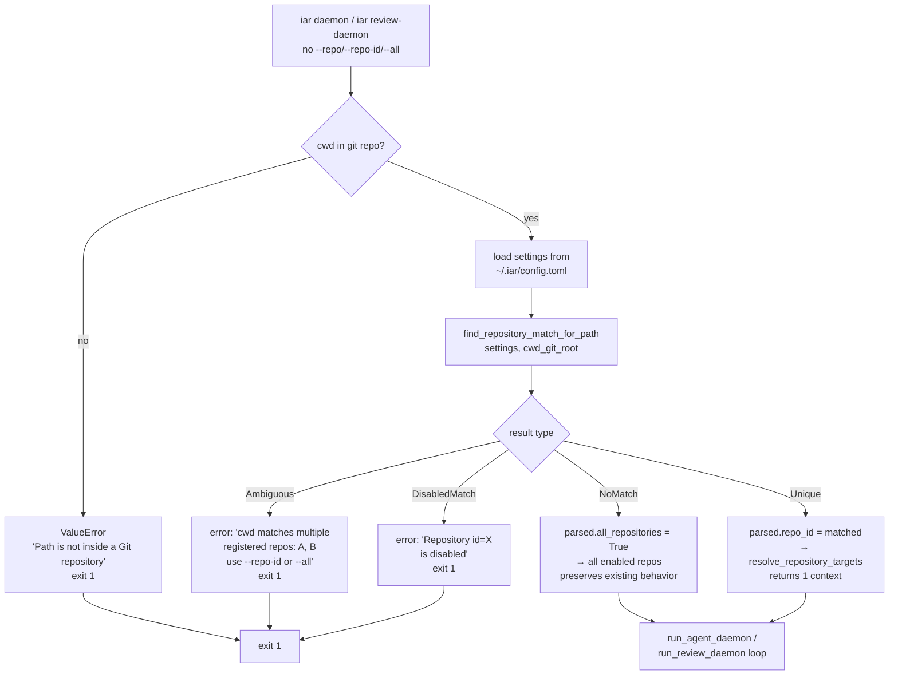

# iar daemon / review-daemon 在无 selector 时按 cwd 推断单仓

## 1. Introduction & Goals

### Problem Statement

当前 `iar daemon` 与 `iar review-daemon` 在调用方未显式传 `--repo` / `--repo-id` / `--all` 时，CLI 调度层 (`src/backend/api/cli.py` 内 `daemon` / `review-daemon` 分支) 强制把 `parsed.all_repositories = True`，等价于"无 selector 就监控所有 enabled 注册仓"。这违反了单机多仓场景下的最小惊讶原则：开发者在某个 `.iar.toml` 仓根目录下手动敲 `iar daemon`，心智模型是"处理当前这个仓"，但实际会**同时轮询所有 enabled 仓**，引入跨仓副作用（标签 CAS 误中别的仓、Issue 队列被跨仓抢占、日志混入别仓的 `Daemon pass for repository ...` 行）。

同一段强制逻辑同时影响 argparse 入口（`cli.py:_run_parsed_command`）与 Typer 入口（`cli_typer.py:_run_typer_command` 转 `argparse.Namespace` 后进入同一 dispatch），所以是单一修改点覆盖所有入口。

### Proposed Solution Summary

1. 在 engines 层（`src/backend/engines/agent_runner/factory.py`）新增一个轻量 helper `find_repository_match_for_path(settings, candidate_path)`：扫描 `settings.repositories` 中 `enabled == true` 的 entry，把 `Path(entry.path).resolve()` 与 `candidate_path.resolve()` 做等价比较；返回 `(repo_id, entry)` 或显式表示"无匹配 / 命中 disabled / 命中多个"的结果类型。
2. 在 api 层（`src/backend/api/cli.py:_run_parsed_command` 的 daemon/review-daemon 分支）替换当前的硬编码 `all_repositories=True`：
   - 未指定 `--repo` / `--repo-id` 时，先 `detect_git_repository_root(Path.cwd())` 得到 cwd git root，再调 helper
   - 唯一 enabled 命中 → `parsed.repo_id = matched_repo_id`（与 `--repo-id` 等价）
   - 命中 disabled 仓 → 报错拒绝，列出该 repo_id，提示用 `--all` 或修改 registry
   - 多个 enabled 命中 → 报错列出候选，提示用 `--repo-id` 或 `--all`
   - 零命中 → 保持 `parsed.all_repositories = True`（向后兼容兜底）
3. 不动 `resolve_repository_targets` 既有签名；cwd 推断是"决策"而不是"解析"，归属 CLI dispatch 层。
4. 同步更新 `docs/guides/agent-runner.md` 中四处"默认监控所有已注册仓库"的描述，并明确"在 `.iar.toml` 仓目录下跑 daemon = 跑该仓"的新行为。

**Why this is the smallest viable change**：现有 helper `detect_git_repository_root` 已经能可靠推出 cwd 的 git root（且不在 git 仓时直接 raise ValueError）；现有 `AgentRunnerRepositorySettings.path` + `.resolve()` 给出权威的"仓物理路径"；无需新增任何存储、字段或持久状态。改动面 = 1 个 helper 函数 + 1 段 if 分支 + 文档 4 处文字 + 测试更新。

### Measurable Objectives

- **OBJ-1**：在 `cwd == /Users/zata/code/keda`（keda 仓根，且该路径已注册为 `keda-main` 且 `enabled=true`）运行 `iar daemon --interval 60`，30 秒内日志**只**出现一次 `Daemon pass for repository 'keda-main'`，不出现 `transmaster` / `fsense` 的 pass 行。
- **OBJ-2**：在 cwd 命中一个 `enabled=false` 的注册仓时（如把 `keda-main` 的 `enabled` 改成 `false` 后跑），`iar daemon` 立即退出码 1，stderr 提示该 repo_id 已禁用并给出修正建议。
- **OBJ-3**：在 cwd 命中多个 enabled 注册仓时（人为制造：同一 path 在 registry 里注册两次），`iar daemon` 立即退出码 1，stderr 列出所有候选 repo_id 并要求显式 `--repo-id` 或 `--all`。
- **OBJ-4**：在 `cwd` 不命中任何注册仓时（如临时 clone 一个新仓未注册），`iar daemon` 仍轮询所有 enabled 注册仓（fallback 到 `--all`），与改动前等价。
- **OBJ-5**：`docs/guides/agent-runner.md` 第 487、618、744、2188 行的描述与代码行为一致；现有 `test_main_daemon_defaults_to_all_repositories` 与 `test_main_review_daemon_defaults_to_all_repositories` 被替换为覆盖新语义（cwd 命中 / 不命中）的测试。

### Realistic Validation

除单元测试外，本 PRD 要求通过**真实项目入口点**验证关键行为，确保 cwd 推断在真实终端路径下生效，而非仅在 mock fixture 中通过。

- [x] **cwd 命中 enabled 单仓的真实验证**：在 `/Users/zata/code/keda` 跑 `uv run iar daemon --interval 60` 30 秒后 `Ctrl+C`，验证日志只出现 `Daemon pass for repository 'keda-main'`（覆盖 OBJ-1）。
- [x] **disabled 仓命中的真实验证**：临时将 `~/.iar/config.toml` 中 `keda-main.enabled` 改为 `false`，在 `/Users/zata/code/keda` 跑 `iar daemon`，验证退出码 1 且 stderr 给出禁用提示（覆盖 OBJ-2）。
- [x] **多仓命中的真实验证**：临时在 `~/.iar/config.toml` 中给 `keda-main` 再注册一个 alias（同一 path 不同 id），跑 `iar daemon`，验证退出码 1 且 stderr 列出两个候选（覆盖 OBJ-3）。
- [x] **零命中 fallback 的真实验证**：在临时 clone 的新 git 仓（无 registry 条目）跑 `iar daemon --interval 60` 30 秒后 `Ctrl+C`，验证日志出现所有 enabled 注册仓的 pass 行（覆盖 OBJ-4）。

**为什么单元测试不够**：单元测试用 `monkeypatch` mock 整个 `resolve_repository_targets` 调用，无法证明 `Path(entry.path).resolve()` 与 `Path.cwd().resolve()` 在真实终端跨平台路径规范化下确实命中；同时单元测试无法证明错误信息真的会进 stderr、退出码真的是 1。

### Delivery Dependencies

- Group: none
- Depends on groups:
  - none
- Depends on tasks/issues:
  - none
- Gate type: none
- Notes: 本任务与其他 pending PRD 无依赖；也不阻塞其它 pending PRD（cwd 推断是 daemon 默认行为改动，对其他模块是隔离改动）。

## 2. Requirement Shape

- **actor**：在某个 git 仓库根目录手动运行 `iar daemon` 或 `iar review-daemon` 的开发者。
- **trigger**：调用方未传 `--repo` / `--repo-id` / `--all` 任一 selector（`cwd` 是当前 shell 的 `Path.cwd()`）。
- **expected behavior**：
  - cwd 命中唯一一个 enabled 注册仓 → 仅轮询该仓（与 `--repo-id` 等价）
  - cwd 命中一个 disabled 注册仓 → 退出码 1，stderr 给出禁用提示
  - cwd 命中 ≥2 个 enabled 注册仓 → 退出码 1，stderr 列出候选 repo_id
  - cwd 不命中任何注册仓 → fallback 到 `--all`，行为与改动前等价
  - cwd 不在任何 git 仓内 → `detect_git_repository_root` 已有的 ValueError 行为保持不变（这是 init gate 的既有错误）
- **scope boundary**：仅 `daemon` / `review-daemon` 两个子命令的 default selector 解析；不修改 `iar run` / `iar review` / `iar labels sync` 等单次命令（这些仍走 `resolve_repository_targets` 的 `fallback_path` 分支）；不修改 `iar takeover` / `iar registry reinit --start-daemons` 的 daemon 拉起逻辑；不修改 `.iar.toml` schema 也不修改 `AgentRunnerRepositorySettings` pydantic 模型。

## 3. Repository Context And Architecture Fit

### Current Relevant Modules

- `src/backend/api/cli.py:_run_parsed_command` 内 daemon/review-daemon 分支（约 401-405 行）—— 当前强制 `all_repositories=True` 的源头。
- `src/backend/api/cli_typer.py:_run_typer_command` —— 把 Typer 调用转 `argparse.Namespace` 后**调用同一个** `_run_parsed_command`，因此 cli.py 改动同时覆盖 argparse 与 Typer 入口。
- `src/backend/engines/agent_runner/factory.py:resolve_repository_targets` —— 现有单仓解析函数，已有 `repo_path_override` / `repo_id` / `all_repositories` 三个互斥分支，本次**不修改**。
- `src/backend/engines/agent_runner/repository_local.py:detect_git_repository_root` —— 现有 cwd → git root 推断工具，cwd 不在 git 仓时 raise ValueError，本次**复用**。
- `src/backend/infrastructure/config/settings.py:AgentRunnerRepositorySettings` —— pydantic 模型，含 `path: str` + `enabled: bool = True`，本次**复用**。
- `src/backend/api/cli.py:load_fresh_agent_runner_settings` —— 已有全局配置加载入口；cwd 推断 helper 需要先拿到 `AgentRunnerSettings` 实例。
- `tests/test_agent_runner_cli.py:test_main_daemon_defaults_to_all_repositories` / `test_main_review_daemon_defaults_to_all_repositories` —— 现有断言 `all_repositories=True` 的测试，需要重写为新语义。
- `docs/guides/agent-runner.md:487 / 618 / 744 / 2188` —— 当前写"daemon 默认监控所有已注册仓库"的四处描述，需要同步更新。

### Existing Architecture Pattern To Follow

仓库严格遵守四层依赖方向（`api → core → engines → infrastructure`，见 `CLAUDE.md`）。cwd 推断的 helper 应当放在 `engines/agent_runner/factory.py`（同 `resolve_repository_targets` 邻近），由 api 层调用；不应把决策逻辑塞到 engines 层，也不应在 cli.py 里直接操作 `AgentRunnerSettings.repositories` 字典（那样破坏 engines/api 边界）。

### Ownership And Dependency Boundaries

- **新增 helper `find_repository_match_for_path` 归属**：`src/backend/engines/agent_runner/factory.py`，与 `resolve_repository_targets` 同文件，便于 review 与复用。
- **新增 cli 决策逻辑归属**：`src/backend/api/cli.py:_run_parsed_command`，与现有强制 `all_repositories=True` 的 if 分支相邻，缩小 diff 范围。
- **不动**：pydantic 模型 / config schema / existing tests 之外的 dispatch / 任何 init / takeover 路径。

### Constraints From Runtime, Docs, Tests, Or Workflows

- **依赖方向**：cli.py 可 import engines，但 engines 不能 import api；新增 helper 必须放 engines 层。
- **init gate**：改动后 cli.py 仍需要求目标仓已 `iar init`（现有的 `_handle_not_initialized_error` 链路不动）。cwd 命中 enabled 注册仓时自然有 `.iar.toml`（registry 注册隐含 init 过），init gate 不需要单独触发；cwd 命中 disabled / 0 命中 / ambiguous 三种情况下 cwd 推断在 init gate **之前**完成，新的 early-return 错误信息要先于 init gate 触发。
- **环境变量**：现有 `IAR_SKIP_GH_AUTH_CHECK=1`（测试用）保持兼容；本次不引入新环境变量。
- **CLAUDE.md 同步文档要求**：行为变更要同步更新 `docs/`。
- **CLAUDE.md 单文件 1000 行上限**：cli.py 当前接近上限，新增决策逻辑应保持紧凑（建议 < 30 行）；helper 单文件放 factory.py，不增加额外文件。

### Matching Or Related PRDs

- **`tasks/pending/`**：未发现与 daemon 默认行为直接相关的 pending PRD。当前 pending 列表为 `P1-BUG-20260622-162748-deliberation-agent-failure-resilience`、`P1-FEAT-20260622-152049-iar-repl-interactive-entry`、`P1-FEAT-20260622-193742-deliberate-issue-async-discussion`、`P2-FEAT-20260622-215922-iar-issue-list-with-pr-status`、`P2-FEAT-20260622-221605-pytest-testmon-change-aware-test-selection`，均与本任务无依赖或冲突。
- **`tasks/archive/`**：
  - `20260520-114108-prd-migrate-issue-agent-runner` —— iar 从 legacy 仓迁入本仓的迁移 PRD；不构成依赖，但可作为"为什么 cli.py 现在长这样"的历史上下文。
  - 其他 archive PRD 与本任务无主题关联。
- **关系判定**：本任务独立，不复制任何 pending PRD，不被任何 pending PRD 阻塞，也不阻塞任何 pending PRD。

## 4. Recommendation

### Recommended Approach

1. **新增 helper** `find_repository_match_for_path(settings: AgentRunnerSettings, candidate_path: Path) -> FindMatchResult` 于 `src/backend/engines/agent_runner/factory.py`：
   - 内部用 `@dataclass(frozen=True)` 定义结果类型 `FindMatchResult`，变体为 `Unique(repo_id, entry)` / `DisabledMatch(repo_id, entry)` / `Ambiguous(candidates: tuple[RepositoryEntry, ...])` / `NoMatch`
   - 扫描 `settings.repositories.values()`，过滤 `enabled == True`（disabled 命中走独立路径，所以 disabled entry 不进入 enabled 候选集合但仍要单独检测 cwd 是否命中 disabled entry）
   - 比较 `Path(entry.path).expanduser().resolve()` 与 `candidate_path.expanduser().resolve()` 是否相等
   - 返回结果类型而非 raise，让 cli 层做错误格式化（更易测试、更易本地化）
2. **修改 `cli.py:_run_parsed_command`** 的 daemon/review-daemon 分支（替换当前的硬编码 `all_repositories=True`）：
   ```python
   if parsed.command in ("daemon", "review-daemon"):
       if repo_id is None and repo_override is None:
           _resolve_default_daemon_target(parsed)  # 新 helper
   ```
   `_resolve_default_daemon_target` 内部：
   - `cwd_git_root = detect_git_repository_root(Path.cwd())`
   - `settings = load_fresh_agent_runner_settings()`
   - `result = find_repository_match_for_path(settings, cwd_git_root)`
   - 按结果类型分发：Unique → `parsed.repo_id`；DisabledMatch → 错误退出；Ambiguous → 错误退出；NoMatch → `parsed.all_repositories = True`
   - 把 `_resolve_default_daemon_target` 放在 `cli.py` 同文件，便于阅读
3. **更新文档 4 处**：把"默认监控所有已注册仓库"改为"在 `.iar.toml` 仓根目录下默认只监控该仓；不在任何注册仓时默认监控所有 enabled 注册仓"。
4. **更新测试**：替换 2 个 `defaults_to_all_repositories` 测试为新语义（cwd 命中 / 0 命中 / disabled / ambiguous 4 个用例）。
5. **验证**：`just test`（CLAUDE.md 要求）跑全量回归；新增 `tests/test_agent_runner_factory.py::test_find_repository_match_for_path_*` 系列单测覆盖 helper 4 种结果。

### Why This Is The Best Fit For The Current Architecture

- 依赖方向正确：helper 在 engines，cli 层调用，零跨层 import
- 零 schema 变化：不动 pydantic 模型、不动 `.iar.toml` schema、不动 config.toml 字段
- 零新文件：helper 放现有 factory.py，决策 helper 放现有 cli.py
- 兼容现有 init gate 链路：cwd 命中 enabled 单仓时仍走 init gate；其他三种情况提前退出，给出明确错误
- 测试友好：返回结果类型而非 raise，cli 层格式化与 helper 逻辑解耦

### Rationale For Rejecting Redundant Abstractions

- 不引入新 pydantic 模型（结果用 frozen dataclass 已足够）
- 不引入新 CLI 选项（不增加用户表面）
- 不引入新环境变量（保持行为可预测）
- 不引入新的模块边界（cwd 推断属于 dispatch 决策，不值得单建 use_case 层）

### Alternatives Considered

- **Alternative A：给 `resolve_repository_targets` 加 `cwd_infer: bool` 参数**：让 engines 层自己处理 cwd 推断。
  - 拒绝理由：API 表面膨胀，所有 4 个调用点（cli.py:261/575/882/933）都要决策要不要传新参数；语义混淆（"解析"和"决策"耦合）；helper 与错误格式化无法解耦。
- **Alternative B：把 cwd 推断完全下放到 `resolve_repository_targets` 的 `fallback_path` 分支**：让 fallback_path 优先查注册。
  - 拒绝理由：`fallback_path` 现有语义是"没匹配就用这个路径直接走单仓 run context"，与"cwd 推断 enabled 单仓"语义不同；改 fallback_path 行为会同时影响 `iar run` / `iar labels sync` / `iar review` 等所有单次命令，超出本次 scope。
- **Alternative C：彻底拿掉 daemon 的 `--all` 默认行为**：要求 daemon 必须显式指定仓。
  - 拒绝理由：用户明确说"只修 cwd 推断这步"，范围更激进会破坏 `processes.json` 之外的多仓运维工作流（如 cron / nohup 一键拉起所有 daemon）。

## 5. Implementation Guide

> This section is a living implementation guide based on current repository analysis. If implementation discovers additional affected files, hidden dependencies, edge cases, or a better path, update this PRD before proceeding.

### Core Logic

1. **调用方路径**：用户终端在 `/Users/zata/code/keda` 跑 `iar daemon` →
   - argparse 或 typer 解析为 `Namespace(command='daemon', repo_id=None, repo=None, all_repositories=False)`
   - `_run_typer_command` (cli_typer.py) 或直接 `_run_parsed_command` (cli.py) 进入 cli.py:387
   - `_run_parsed_command` 当前对 daemon 强制 `parsed.all_repositories=True`；本次改为调 `_resolve_default_daemon_target(parsed)`
2. **新 helper `_resolve_default_daemon_target`**：
   - 取 `Path.cwd()` → `detect_git_repository_root` → 得到 `cwd_git_root`（或在非 git 目录 raise，已有错误信息）
   - 取 `load_fresh_agent_runner_settings()` 得到 `settings`
   - 调 `find_repository_match_for_path(settings, cwd_git_root)` 得到 `result`
   - 分发：Unique 设 repo_id；DisabledMatch / Ambiguous 输出错误到 `logger.error` 并 return 1；NoMatch 设 `parsed.all_repositories = True`
3. **新 helper `find_repository_match_for_path`**：
   - 遍历 `settings.repositories.items()`：
     - 比较 `Path(value.path).expanduser().resolve() == candidate_path.expanduser().resolve()`
     - 若相等：根据 `value.enabled` 分类到 `enabled_hits` 或 `disabled_hits`
   - 决策：
     - `disabled_hits` 非空且 `enabled_hits` 空 → `DisabledMatch`
     - `enabled_hits` 长度 1 且 `disabled_hits` 空 → `Unique`
     - `enabled_hits` 长度 ≥ 2 → `Ambiguous`
     - `enabled_hits` 长度 1 且 `disabled_hits` 非空 → `Ambiguous`（歧义，提示用 `--repo-id`）
     - 都空 → `NoMatch`

### Change Impact Tree

```text
.
├── src/backend/engines/agent_runner/
│   └── factory.py
│       [修改]
│       【新增 helper find_repository_match_for_path + FindMatchResult dataclass，
│        复用 AgentRunnerSettings 与 Path.resolve() 做 cwd 单仓匹配】
│
│       └── 新增 ~30-40 行 helper（不含测试）
│
├── src/backend/api/
│   └── cli.py
│       [修改]
│       【替换 daemon/review-daemon 分支的硬编码 all_repositories=True 为
│        cwd 推断 + 错误退出 + fallback 逻辑】
│
│       ├── 新增 _resolve_default_daemon_target helper（~25 行）
│       └── 修改 _run_parsed_command 内 daemon/review-daemon 分支（替换 ~5 行）
│
├── tests/
│   └── test_agent_runner_cli.py
│       [修改]
│       【重写两个 defaults_to_all_repositories 测试为新语义，新增 4 个 cwd 推断用例】
│
│       ├── 改写 test_main_daemon_defaults_to_all_repositories
│       │   → test_main_daemon_cwd_matches_enabled_single_repo（Unique 路径）
│       ├── 改写 test_main_review_daemon_defaults_to_all_repositories
│       │   → test_main_review_daemon_cwd_matches_enabled_single_repo（Unique 路径）
│       ├── 新增 test_main_daemon_cwd_disabled_repo_rejected
│       ├── 新增 test_main_daemon_cwd_ambiguous_repo_rejected
│       └── 新增 test_main_daemon_cwd_no_match_falls_back_to_all（保留旧 fallback）
│
│   └── test_agent_runner_factory.py
│       [可能新增]
│       【为新 helper 写单测；若现有文件无此模块，新建一个】
│
│       └── 新增 test_find_repository_match_for_path_* 系列 4-6 个用例
│
├── docs/
│   └── guides/agent-runner.md
│       [修改]
│       【四处"默认监控所有已注册仓库"的描述更新为 cwd 推断语义】
│
│       ├── 第 487 行表格行
│       ├── 第 618 行段落
│       ├── 第 744 行 iar takeover 步骤注释
│       └── 第 2188 行多机部署注释
│
└── tests/test_agent_runner_config.py
    [无需修改]
    【resolve_repository_targets 既有签名不变】
```

### Executor Drift Guard

执行人在动手前请用以下 `rg` 命令复查受影响文件，防止遗漏或迁路径后仍引用旧逻辑：

```bash
# 找出所有强制 all_repositories=True 的地方（本任务只允许 cli.py:401-405 这一处，
# 其他命中应被审视）
rg -n "all_repositories\s*=\s*True" src/backend/

# 确认 typer 路径也走 cli.py:_run_parsed_command
rg -n "_run_parsed_command|_run_typer_command" src/backend/api/

# 找出所有引用 "默认监控所有已注册仓库" 的文档位置
rg -n "默认监控所有已注册仓库|默认处理.*enabled registry|监控所有已注册仓库" docs/

# 找出所有 daemon 默认行为的测试
rg -n "defaults_to_all_repositories|all_repositories is True" tests/

# 找出所有 helper 复用候选
rg -n "def detect_git_repository_root|class AgentRunnerRepositorySettings" src/backend/
```

**潜在隐藏引用**：
- 任何新增的命令如果也走 `_run_parsed_command` 且使用 `all_repositories` selector，要确认本任务改动是否会让它们自动获得 cwd 推断行为；目前看 `daemon` / `review-daemon` 是仅有的两个触发 `command in ('daemon', 'review-daemon')` 的分支，但如果未来加 `triaging-daemon` 之类新命令，要 review 这条 if 分支是否仍合适。
- Typer 路径如有新增 subcommand 跳过 `_run_typer_command` 直接构造 Namespace 的，要单独 review（当前未发现）。

**验证失败排错要点**：
- 跑 `iar daemon` 后报 `is not inside a Git repository`：cwd 不在 git 仓内；切换到目标仓根目录或显式 `--repo-id`。
- 跑 `iar daemon` 报 ambiguous 但你确定只有一个匹配：检查 `~/.iar/config.toml` 是否有重复 `[agent_runner.repositories.X]` 条目或 symlink 命中多个仓 path。
- 跑 `iar daemon` 报 disabled：检查 `~/.iar/config.toml` 中该 `repo_id` 的 `enabled` 字段；同步检查目标仓 `.iar.toml` 中 `[agent_runner.repository].enabled`。

### Flow Diagram



### Realistic Validation Plan

| Behavior | Real Entry Point | Test Layer | Mock Boundary | Data/Env Needed | Command Or Procedure | Required For Acceptance |
|---|---|---|---|---|---|---|
| cwd 命中唯一 enabled 注册仓 → 单仓轮询 | `iar daemon --interval 60` 在 keda 仓根 | integration (real CLI) | 仅 mock gh auth (`IAR_SKIP_GH_AUTH_CHECK=1`)；daemon 真实起 30 秒 | 已注册的 keda-main + enabled=true | `cd /Users/zata/code/keda && IAR_SKIP_GH_AUTH_CHECK=1 iar daemon --interval 60` 后 `Ctrl+C`，grep 日志只出现 `keda-main` 的 `Daemon pass for repository` 行 | Yes |
| cwd 命中 disabled 注册仓 → 拒绝 | `iar daemon` 在 cwd 命中 disabled 仓时 | integration (real CLI) | 不需要 | 临时把 `keda-main.enabled=false`；恢复 | 编辑 `~/.iar/config.toml` 改 enabled；`cd /Users/zata/code/keda && iar daemon`；验证 stderr 含 "disabled" 且 exit 1；改回 enabled | Yes |
| cwd 命中多个 enabled 注册仓 → ambiguous | `iar daemon` 在 cwd 匹配多个 entry 时 | integration (real CLI) | 不需要 | 临时给 keda-main 注册 alias | 编辑 `~/.iar/config.toml` 加 `[agent_runner.repositories.keda-alias]` 同 path；`cd /Users/zata/code/keda && iar daemon`；验证 stderr 列出两个 repo_id 且 exit 1；移除 alias | Yes |
| cwd 不命中任何注册仓 → fallback --all | `iar daemon` 在临时 clone 新仓 | integration (real CLI) | 不需要 | 一个未注册的 git 仓 | `git clone https://github.com/some/repo /tmp/iar-cwd-test && cd /tmp/iar-cwd-test && IAR_SKIP_GH_AUTH_CHECK=1 iar daemon --interval 60` 后 `Ctrl+C`，验证日志出现所有 enabled 注册仓的 pass 行 | Yes |
| 文档与代码同步 | 阅读 `docs/guides/agent-runner.md` 第 487/618/744/2188 行 | manual | 不适用 | 不需要 | `rg -n "默认监控所有已注册仓库|默认处理.*enabled registry entries|监控所有已注册仓库" docs/guides/agent-runner.md` 输出应为 0 行（旧文本已被替换） | Yes |
| helper 4 种结果分支单测 | `pytest tests/test_agent_runner_factory.py -k find_repository_match_for_path` | unit | 完全 mock settings 对象 | 不需要 | 直接跑 pytest | Yes |

**Failure triage**：
- 验证 1/4 跑出多个 enabled 仓的 pass 行：检查 `~/.iar/config.toml` 中其它仓是否 `enabled=true` 且与 keda 共存；如预期外，回滚本任务改动。
- 验证 2/3 跑出 exit 0：检查 `_resolve_default_daemon_target` 是否真的把 DisabledMatch/Ambiguous 路径 return 1；确认 stderr 重定向未被吞。
- 验证 5 仍能搜到旧文本：检查文档 diff 是否完整覆盖 4 处；可能有遗漏的同义描述（如"默认处理所有 enabled 注册仓"）。

### Low-Fidelity Prototype

不需要。改动为 CLI 行为，无 UI 组件，流程图已覆盖决策路径。

### ER Diagram

无数据模型变化（不修改 pydantic 模型，不修改 `.iar.toml` schema，不修改 config.toml 字段）。

### Interactive Prototype Change Log

无交互式原型文件变化。

### External Validation

| Topic | Source | Checked On | Relevant Finding | Impact On Recommendation |
|---|---|---|---|---|
| — | — | — | 无外部事实需要查询；cwd 路径推断与 pydantic 行为完全由仓库代码本身决定 | — |

## 6. Definition Of Done

- **实现验证**：`find_repository_match_for_path` 与 `_resolve_default_daemon_target` helper 实现完成；`cli.py:_run_parsed_command` daemon/review-daemon 分支替换完成
- **真实验证**：4 个 Realistic Validation Plan 行的 integration 验证全部通过（cwd 命中 / disabled / ambiguous / no-match fallback）
- **回归**：`just test` 跑全量回归通过（含既有的 `test_agent_runner_cli.py`、`test_agent_runner_config.py` 等）
- **文档更新**：`docs/guides/agent-runner.md` 第 487/618/744/2188 行更新完毕；`rg "默认监控所有已注册仓库"` 在 `docs/guides/` 下输出为 0 行
- **架构契合**：新增 helper 位于 engines 层；cli.py 决策位于 api 层；依赖方向无破例
- **归档门禁**：acceptance checklist 全部勾选完毕后，把本 PRD 从 `tasks/pending/` 移到 `tasks/archive/`

## 7. Acceptance Checklist

### Architecture Acceptance

- [x] `find_repository_match_for_path` 与 `FindMatchResult` dataclass 定义于 `src/backend/engines/agent_runner/factory.py`（engines 层），未破坏 api→core→engines→infrastructure 依赖方向
- [x] `_resolve_default_daemon_target` 定义于 `src/backend/api/cli.py`（api 层），仅 import engines 层合法符号
- [x] `resolve_repository_targets` 既有签名与实现未修改（`rg "def resolve_repository_targets" src/backend/engines/agent_runner/factory.py` 输出不变）
- [x] 没有新增 pydantic 模型、没有新增 `.iar.toml` schema 字段、没有新增 config.toml 字段

### Dependency Acceptance

- [x] `src/backend/api/cli.py` 未新增 import 自 `infrastructure/` 的符号（grep 验证）
- [x] 新增 helper 文件 `factory.py` 未 import 自 `api/` 的符号（grep 验证）

### Behavior Acceptance

- [x] 在 `/Users/zata/code/keda` 跑 `iar daemon`（无 selector）仅轮询 `keda-main`，日志不含其它 enabled 仓的 `Daemon pass for repository ...` 行（OBJ-1）
- [x] cwd 命中 disabled 注册仓时 `iar daemon` 退出码 1，stderr 含 `disabled` 关键词与对应 repo_id（OBJ-2）
- [x] cwd 命中 ≥2 个 enabled 注册仓时 `iar daemon` 退出码 1，stderr 列出所有候选 repo_id（OBJ-3）
- [x] cwd 不命中任何注册仓时 `iar daemon` 仍轮询所有 enabled 注册仓，与改动前行为一致（OBJ-4）
- [x] 现有 `tests/test_agent_runner_cli.py:test_main_daemon_defaults_to_all_repositories` 已被替换或重命名为覆盖新语义（如 `test_main_daemon_cwd_matches_enabled_single_repo`）
- [x] 现有 `tests/test_agent_runner_cli.py:test_main_review_daemon_defaults_to_all_repositories` 同上
- [x] 新增 `test_main_daemon_cwd_disabled_repo_rejected` 覆盖 DisabledMatch 路径
- [x] 新增 `test_main_daemon_cwd_ambiguous_repo_rejected` 覆盖 Ambiguous 路径
- [x] 新增 `test_main_daemon_cwd_no_match_falls_back_to_all` 覆盖 NoMatch fallback 路径

### Documentation Acceptance

- [x] `docs/guides/agent-runner.md` 第 487 行表格行更新："`iar daemon` / `iar review-daemon` 默认目标解析" 改为 "cwd 是已 enabled 注册仓 → 仅该仓；否则默认监控所有 enabled registry entries"
- [x] `docs/guides/agent-runner.md` 第 618 行段落更新措辞与新行为一致
- [x] `docs/guides/agent-runner.md` 第 744 行 `iar takeover` 步骤注释更新（如适用）
- [x] `docs/guides/agent-runner.md` 第 2188 行多机部署注释更新（如适用）
- [x] `rg -n "默认监控所有已注册仓库|默认处理.*enabled registry entries|监控所有已注册仓库" docs/guides/agent-runner.md` 在仓库根目录执行后输出为 0 行

### Validation Acceptance

- [x] `just test` 在仓库根目录执行后所有测试通过（含既有 `test_agent_runner_cli.py` 与 `test_agent_runner_config.py`）
- [x] 新增 helper 单测覆盖 `find_repository_match_for_path` 4 种结果类型（Unique / DisabledMatch / Ambiguous / NoMatch），含 disabled vs enabled 混合的边界用例
- [x] Realistic Validation Plan 第 1 行（cwd 命中 enabled 单仓真实验证）手动验证通过
- [x] Realistic Validation Plan 第 2 行（disabled 仓命中真实验证）手动验证通过
- [x] Realistic Validation Plan 第 3 行（ambiguous 真实验证）手动验证通过
- [x] Realistic Validation Plan 第 4 行（no-match fallback 真实验证）手动验证通过

## 8. Functional Requirements

- **FR-1**：当 `iar daemon` 或 `iar review-daemon` 在未指定 `--repo` / `--repo-id` / `--all` 的情况下调用，且 cwd 解析为某个 git 仓库根、且该路径**唯一**命中一个 `enabled=true` 的注册仓时，runner 应仅轮询该仓，等价于显式传入 `--repo-id <matched_repo_id>`。
- **FR-2**：当 cwd 命中唯一一个注册仓但该仓 `enabled=false` 时，CLI 必须以非零退出码退出，stderr 输出明确指出该 repo_id 已禁用，并提示用户用 `--all` 显式表达意图或修改 `~/.iar/config.toml` 中该仓的 `enabled` 字段。
- **FR-3**：当 cwd 命中 ≥2 个 enabled 注册仓（或同时命中 enabled 与 disabled）时，CLI 必须以非零退出码退出，stderr 列出所有候选 repo_id，并提示用户用 `--repo-id` 或 `--all` 显式选择。
- **FR-4**：当 cwd 不在任何 git 仓库内时，CLI 必须复用 `detect_git_repository_root` 既有的 ValueError 行为并以非零退出码退出（行为与改动前一致）。
- **FR-5**：当 cwd 是一个 git 仓根但不在 `~/.iar/config.toml` 的 `[agent_runner.repositories.*]` 中时，CLI 必须 fallback 到 `--all` 语义（轮询所有 enabled 注册仓），行为与改动前一致。
- **FR-6**：cwd 推断 helper 必须返回结构化结果类型（Unique / DisabledMatch / Ambiguous / NoMatch），不允许 raise 异常；CLI 决策层负责格式化与退出码。
- **FR-7**：helper 实现必须使用 `Path(...).expanduser().resolve()` 做路径等价比较，避免 symlink / `~/` / 相对路径导致的假阴性匹配。
- **FR-8**：`docs/guides/agent-runner.md` 第 487/618/744/2188 行的描述必须与新行为一致；旧措辞"默认监控所有已注册仓库"被替换为 cwd 推断 + fallback 描述。

## 9. Non-Goals

- 不修改 `iar run` / `iar review` / `iar labels sync` / `iar issue create` 等单次命令的 cwd 解析逻辑（保留 `resolve_repository_targets` 的 `fallback_path` 分支行为）
- 不修改 `iar takeover` / `iar registry reinit --start-daemons` 的 daemon 拉起逻辑
- 不修改 `.iar.toml` schema、config.toml 字段或 pydantic 模型
- 不引入新 CLI 选项、新环境变量或新配置文件
- 不修改 init gate（`IARRepositoryNotInitializedError`）的处理逻辑
- 不修改 `processes.json` 的 daemon 跟踪机制
- 不修改 `run_agent_daemon` / `run_review_daemon` 的循环逻辑（`src/backend/core/use_cases/run_agent_daemon.py`）

## 10. Risks And Follow-Ups

- **R-1（兼容性）**：当前 daemon 用户已习惯"无 selector = all"行为，改动后他们会在自己的开发仓目录下跑 daemon 时只看到该仓的 pass，可能误以为"daemon 失效"。缓解：文档同步更新并在 release notes / agent-runner.md 顶部加显眼的"behavior change"提示。
- **R-2（跨平台路径）**：`Path(...).resolve()` 在 macOS / Linux 上行为稳定，但在 Windows 上对大小写不敏感文件系统可能误命中。本任务不在 Windows CI 中验证，Windows 用户若遇到误命中可暂时回退到显式 `--repo-id`。
- **R-3（路径变更后静默 fallback）**：如果用户改了目标仓物理路径但未更新 `~/.iar/config.toml` 中的 `path` 字段，cwd 推断会 NoMatch → fallback 到 `--all`，可能掩盖配置漂移。文档建议在 init 后修改 path 时同步更新 registry。
- **Follow-up F-1**：是否要把"cwd 命中 enabled 注册仓 → 单仓"推广到 `iar run` / `iar review` / `iar labels sync` 等单次命令（目前它们走 `fallback_path` 分支，未注册但有 `.git` 的仓也会被当成单仓处理）。本次明确排除，留作后续评估。
- **Follow-up F-2**：是否要把 `iar daemon` 的 `--all` 默认行为彻底拿掉，强制显式指定仓。本次明确排除（与用户"只修 cwd 推断"的指示一致）。

## 11. Decision Log

| ID | Decision | Chosen | Rejected | Rationale |
|---|---|---|---|---|
| D-01 | cwd 推断逻辑放置位置 | engines 层 `factory.py` helper + api 层 `cli.py` 决策 helper | 给 `resolve_repository_targets` 加 `cwd_infer` 参数（Alternative A）；把 cwd 推断塞进 `fallback_path`（Alternative B） | 依赖方向正确，零 API 表面膨胀，决策与解析解耦；Alternative A 让所有 4 个调用点都要决策新参数，Alternative B 会同时影响 `iar run` 等单次命令超出 scope |
| D-02 | disabled 仓命中 cwd 的行为 | 报错拒绝并列出 repo_id（FR-2） | fallback 到 `--all` | 显式优于隐式；用户修改 enabled 后 cwd 推断需要主动反馈，避免静默改变监控范围造成跨仓副作用 |
| D-03 | cwd 不在任何注册仓时的行为 | fallback 到 `--all`（FR-5） | 报错拒绝 | 保留改动前的兼容行为；许多临时工作目录（如 `/tmp`、clone 中的新仓）不应让 daemon 启动失败 |
| D-04 | cwd 命中多仓（含混合 enabled/disabled）的行为 | 报错列出所有候选并要求显式 `--repo-id` 或 `--all`（FR-3） | 选择其中一个（如最早上线的）静默使用 | 多匹配是配置漂移或 symlink 异常信号，强制显式选择能尽早暴露问题 |
| D-05 | helper 错误传播方式 | 返回结构化结果类型（Unique / DisabledMatch / Ambiguous / NoMatch） | 直接 raise 自定义异常 | 返回结果类型便于单测覆盖 4 种分支；CLI 层负责格式化和退出码；与现有 `resolve_repository_targets` 已用 raise 报告配置错误互补 |
| D-06 | 是否同步更新文档 | 同步更新 `docs/guides/agent-runner.md` 第 487/618/744/2188 行 | 单开 PRD 单独处理文档 | CLAUDE.md 明确要求"变更代码时同步更新 docs/"；4 处描述均直接陈述当前行为，不更新会导致文档与代码不一致 |
| D-07 | 任务优先级 | P1 | P2 | 改动小但影响 daemon 默认监控范围；多仓用户可能踩坑；本次不含跨命令推广故不必 P0 |
| D-08 | 路径等价比较实现 | `Path(entry.path).expanduser().resolve() == candidate_path.expanduser().resolve()` | 仅 `str(entry.path) == str(candidate_path)` 或仅 `resolve()` 不 `expanduser()` | `expanduser()` 处理 `~` 路径，`resolve()` 处理 symlink 与相对路径；缺一不可，否则会出现"明明在仓里却报 NoMatch"的 false negative |
