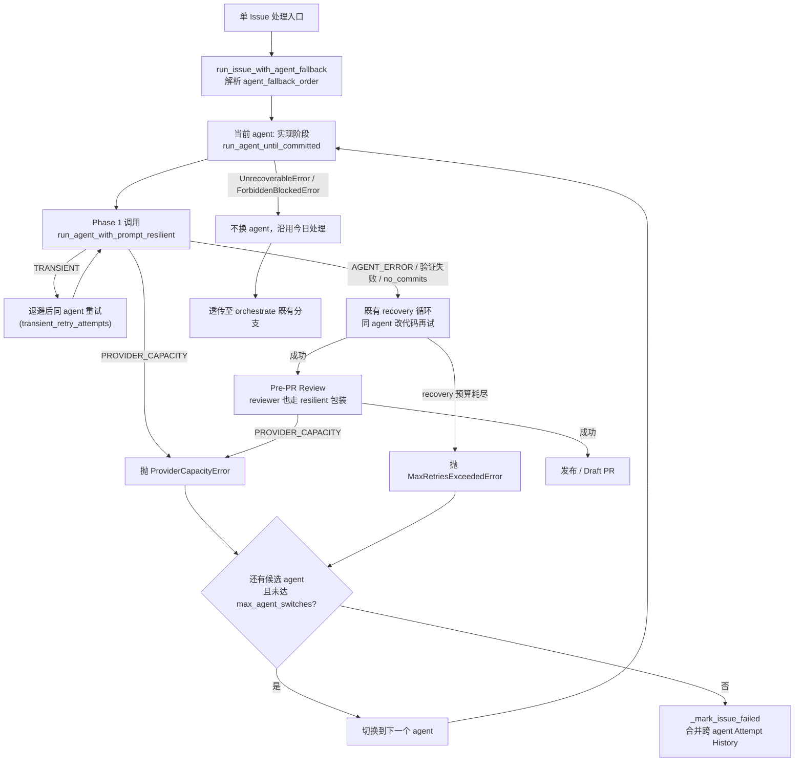

# P1-FEAT Agent 执行错误分级与 Fallback 链（Escalation Ladder）

- Priority: P1
- Type: FEAT
- Slug: agent-runner-error-escalation-fallback-chain
- Created: 2026-06-24 14:29:05 (local)

## 1. Introduction & Goals

### Problem Statement

iar agent runner 在执行一个 Issue 时，对「agent 子进程调用失败」的处理存在两类缺陷：

1. **同一阶段内不区分错误性质**。实现阶段（`run_agent_until_committed`）有一套 recovery 重试循环，但它把所有 `RuntimeError / OSError / CalledProcessError` 一律当作「让 agent 改代码再试」。可瞬时网络错误（如 `The socket connection was closed unexpectedly`）本质上无需改代码，重发原请求即可；而供应商容量错误（429 usage limit、529 overloaded）则无论同一 agent 重试多少次都必然继续失败。
2. **Pre-PR Review 阶段完全没有重试**。`run_pre_pr_review` 在 `agent_review.py` 第 660 行裸调用 `run_agent_with_prompt`，没有任何 try/except 包裹。一次瞬时网络抖动导致 reviewer 子进程非零退出，异常直接冒泡到 orchestrate 顶层 `except Exception`（`agent_runner_orchestrate.py` 第 1039 行），Issue 被直接标 `agent/failed`。Issue #15 即因此失败：实现阶段第 3 次尝试已成功并通过 `just test`，但 review 阶段 socket 断开一次就判负。

此外，当前 `selected_agent` 在 orchestrate 每个 Issue 开局只解析一次（`agent_runner_orchestrate.py` 第 925 行），整个 implement→review 管道锁定单一 agent。即使某 agent 反复修不好、或其供应商持续不可用，runner 也不会换用另一个已配置的 agent（codex / kimi）。

### Proposed Solution Summary

引入**一条统一的执行错误 escalation ladder**，建立在一个**错误分类层**之上，分两级：

- **错误分类层（地基）**：扩展 `classify_failure` / `FailureType`，从 agent 子进程异常（含 `CommandFailedError` 的 stdout/stderr）中识别两类新错误——`TRANSIENT`（socket/connection reset/timeout/5xx 网络层）与 `PROVIDER_CAPACITY`（429 usage-limit / 529 overloaded）。其余请求级错误（含 400 bad request / context 超窗）仍归 `AGENT_ERROR`，按「可由 agent 改代码恢复」处理。供应方在 `config.toml` 中显式声明 fallback agent 顺序，系统**只消费显式配置**，不自动推断要换哪个 agent。
- **Level 1 — 同 agent 瞬时重试**：新增薄包装 `run_agent_with_prompt_resilient`，只对 `TRANSIENT` 错误就地重试 N 次（带退避），其它错误原样抛出。实现阶段与 review 阶段**共用同一个包装**，直接补上 review 的重试缺口。
- **Level 2 — 跨 agent fallback**：在 orchestrate 的「单 Issue 处理」边界新增 `run_issue_with_agent_fallback`，按配置的 `agent_fallback_order` 依次尝试 agent。触发换 agent 的条件：①`PROVIDER_CAPACITY`（立即换）；②`MaxRetriesExceededError`（同 agent 把 recovery 预算用尽仍失败，含连续 400/context 类——换个 agent 可能成功）；③瞬时重试耗尽仍失败。**不换 agent** 的条件：`UnrecoverableError` / `ForbiddenBlockedError`（换谁都失败），以及全局上限 `max_agent_switches` 触顶。

它插入在既有边界上，不新增第二套执行状态机：分类层落在现有 `agent_runner_failure.classify_failure`；Level 1 包装现有 `run_agent_with_prompt`；Level 2 包装现有 `_process_ready_issue` 等单 Issue 入口；attempt 历史复用现有 `AttemptResult` + `format_attempt_history`（仅新增 `agent` 列）。

主要系统状态变化：原本「单 agent 失败即 `agent/failed`」变为「按错误性质就地重试 / 换 agent / 封顶才 `agent/failed`」；失败评论的 Attempt History 表新增 Agent 列，标明每次尝试由哪个 agent 执行。

刻意避免的复杂度：不引入新的存储/表；不新建并行的重试框架；不改 GitHub 标签状态机；fallback 默认关闭（`agent_fallback_order` 为空时行为与今日完全一致），属显式 opt-in。

### Measurable Objectives

- 瞬时网络错误（socket closed / connection reset / timeout）在实现阶段与 review 阶段都能就地重试，单次抖动不再导致 `agent/failed`。
- 供应商容量错误（429 / 529）不再对同一 agent 无效重试；在配置了 fallback 时切换到下一个 agent。
- 同一 agent 把 recovery 预算用尽（含连续 400 / context 超窗）后，在配置了 fallback 时切换到下一个 agent，而非直接失败。
- 全局 `max_agent_switches` 封顶，坏 PRD / 不可恢复错误不会把所有供应商 × 完整 recovery 预算烧穿。
- 失败评论的 Attempt History 能区分每次尝试所用 agent。

### Realistic Validation

除单元测试外，本 PRD 要求通过 runner 真实执行入口（注入 fake `IProcessRunner` 模拟子进程返回码与输出，agent CLI 子进程是合法的可 mock 外部边界）验证关键行为，证明真实控制流生效，而非仅在隔离 fixture 中通过。

- [x] **瞬时重试真实验证（实现阶段）**：通过 `run_agent_until_committed`，fake runner 首次返回 socket-closed 的 `CommandFailedError`、二次成功，断言同一 agent 重试后成功且不消耗换 agent 配额。
- [x] **瞬时重试真实验证（review 阶段）**：通过 `run_pre_pr_review`，fake runner 首次 reviewer 调用 socket-closed、二次正常返回 verdict，断言 review 不再一次抖动即失败。
- [x] **供应商容量换 agent 真实验证**：通过单 Issue 处理入口，fake runner 让首个 agent 持续返回 429/usage-limit，断言切换到 `agent_fallback_order` 下一个 agent。
- [x] **recovery 耗尽换 agent 真实验证**：fake runner 让首个 agent 连续返回 400/verification 失败直至 `MaxRetriesExceededError`，断言切换到下一个 agent；并断言 `UnrecoverableError` 不触发换 agent。
- [x] **封顶真实验证**：所有 fallback agent 都失败时，断言最终 `agent/failed` 且评论含跨 agent 合并的 Attempt History（带 Agent 列）。

**为什么单元测试不够**：错误分类、瞬时重试与 recovery 预算的边界、换 agent 的触发/抑制条件、跨阶段（实现 vs review）复用、attempt 历史跨 agent 合并，都依赖真实控制流串联，纯函数单测无法证明这些路径被正确编排。

### Delivery Dependencies

- Group: agent-runner-resilience
- Depends on groups:
  - none
- Depends on tasks/issues:
  - none
- Gate type: none
- Notes: 复用 archive 的 `surgical-failure-recovery`（recovery 循环来源）与 `recovery-code-review-and-default-agent`（review/default-agent 约定）已有结构，无阻塞前置。与 `multi-agent-debate`（deliberation 独立功能）不冲突：本 PRD 只改 runner 主执行/审查路径，不触碰 deliberation。

## 2. Requirement Shape

- **Actor**：本地 iar agent runner（`iar run` / `iar daemon` 触发的单 Issue 执行流程）；间接受益者是观察 GitHub Issue 失败评论的维护者。
- **Trigger**：执行某个 Issue 的实现阶段或 Pre-PR Review 阶段时，agent 子进程调用失败（非零退出 / 抛异常）。
- **Expected behavior**：
  - 瞬时错误 → 同 agent 就地重试（实现与 review 一致）。
  - 供应商容量错误 → 配置了 fallback 时换下一个 agent；否则按既有逻辑失败并在评论标注 root cause。
  - 同 agent recovery 耗尽 → 配置了 fallback 时换下一个 agent。
  - 不可恢复 / forbidden → 不换 agent，沿用今日行为（`agent/blocked` 或 `agent/failed`）。
  - 所有候选 agent 用尽或换 agent 次数触顶 → `agent/failed`，评论含跨 agent 合并的 Attempt History。
- **Scope boundary**：仅改 runner 的错误分级、重试与 agent 选择编排，以及失败评论渲染。不改 GitHub workflow 标签集合、不改 worktree/commit/push 机制、不改 deliberation、不新增持久化。`agent_fallback_order` 默认空 = 关闭跨 agent fallback。

## 3. Repository Context And Architecture Fit

### 相关模块 / 文件

- `src/backend/core/use_cases/run_agent_once.py`
  - `run_agent_with_prompt`（第 411 行）：所有 agent 子进程调用的唯一底层入口（实现与 review 共用）。
  - `run_agent_until_committed`（第 555 行）：实现阶段 recovery 重试循环（`for attempt_index in range(max_recovery_attempts + 1)`，第 601 行）。
  - `choose_agent`（第 201 行）：override → label → default 解析单一 agent。
  - `wait_before_recovery_attempt`（第 535 行）：可复用的退避函数。
- `src/backend/core/use_cases/agent_review.py`
  - `run_pre_pr_review`（reviewer 裸调用在第 660 行；reviewer agent 解析在第 608–610 行，受 `allow_same_agent` / `review_agent` 控制）。
- `src/backend/core/use_cases/agent_runner_failure.py`
  - `classify_failure`（第 119 行）：现按优先级返回 `FailureType`，`exc` 非特殊情形落 `AGENT_ERROR`（第 158 行）。
  - `detect_usage_limit_root_cause`（第 232 行）、`_USAGE_LIMIT_HINT_PATTERN`（第 178 行）：已识别 429/usage-limit 文案。
  - `format_attempt_history`（第 278 行）：渲染 Attempt History 表。
  - 错误类 `MaxRetriesExceededError` / `UnrecoverableError` / `ForbiddenBlockedError`（第 52/62/73 行），基类 `AgentRunnerAttemptError` 携带 `attempt_results`。
- `src/backend/core/shared/models/agent_runner.py`
  - `FailureType`（第 34 行，7 个枚举值）、`AttemptResult`（第 46 行，无 `agent` 字段）。
- `src/backend/core/use_cases/agent_runner_orchestrate.py`
  - 单 Issue 处理循环（第 924 行起），`_process_ready_issue`（第 379 行）、`_process_running_rework`、`_process_blocked_resolution`、`_process_running_publish_recovery`；顶层 `except Exception` → `_mark_issue_failed`（第 1039–1046 行）。
- `src/backend/core/use_cases/agent_runner_publication.py`
  - `run_pre_pr_review` 调用点（第 483、666 行）。
- `src/backend/core/use_cases/agent_runner_failure_marking.py`
  - `_mark_issue_failed`（第 14 行）：切 `config.labels.failed` + 写评论。
- `src/backend/infrastructure/config/settings.py`
  - `AgentRunnerRunnerSettings`（第 396 行）、`AgentRunnerPrePrReviewSettings`（第 470 行）、`agent_labels`（第 363 行）。
- `src/backend/infrastructure/process_runner.py`
  - `CommandFailedError(subprocess.CalledProcessError)`（第 74 行）：携带 `returncode`/`output`/`stderr`，是分类层的主要输入。

### 现有架构模式

四层依赖 `api -> core -> engines -> infrastructure`。本改动全部落在 `core/use_cases`、`core/shared/models` 与 `infrastructure/config`，沿用现有「use case 函数 + 注入 `IProcessRunner` / `IGitHubClient`」风格，不破坏依赖方向。错误分类、重试、agent 编排都属 `core` 职责，配置属 `infrastructure`。

### 所有权与依赖边界

- 错误「是什么类型」归 `agent_runner_failure.classify_failure` 单一来源；其它模块只消费分类结果，不各自正则判定。
- 「用哪个 agent / 何时换」归 orchestrate 层（agent 身份的所有者）；`run_agent_until_committed` / `run_pre_pr_review` 不自己决定换 agent，只抛出携带分类信息的类型化异常。
- 瞬时重试归薄包装 `run_agent_with_prompt_resilient`，被实现与 review 两处复用，避免重复实现。

### Frontend Impact

**No frontend impact** —— 本改动是 runner 内部执行/审查编排，唯一对外可见产物是发给 GitHub Issue 的失败评论 Markdown（经 GitHub API，不属本仓任何前端 app；仓库的 operations console 不展示 runner 内部重试编排）。失败评论新增 Agent 列通过 review/实现真实路径验证。

### 运行时 / 文档 / 测试约束

- Python 项目用 `uv` / `just`；公共 API 用 Google Style Docstrings；文本 I/O 显式 `encoding="utf-8"`。
- 单文件非空行 ≤ 1000，`just lint` 会告警——新增逻辑优先放入已有相关模块或新建小模块，避免把 `run_agent_once.py` / `agent_runner_orchestrate.py` 撑爆。
- 测试用 fake `IProcessRunner`，现成样例在 `tests/test_run_agent.py`、`tests/test_agent_review.py`、`tests/test_agent_runner_orchestrate.py`。
- 同步更新 `docs/` 与 `mkdocs.yml`（`docs/guides/agent-runner.md` 已有「失败重跑」章节，应补 escalation/fallback 说明）。

### 现有 PRD 关系

- `tasks/pending/` 现有 2 个 PRD（`iar-cli-logs-view-...`、`iar-github-repo-owner-name-resolution`）均与本需求**无关**，无重复/前置/阻塞。
- archive 相关：`surgical-failure-recovery`（recovery 循环的设计来源）、`recovery-code-review-and-default-agent`（review 与 default-agent 约定）、`runner-verification-error-feedback`（verification 反馈）、`deliberation-agent-failure-resilience`（deliberation 的失败韧性，独立功能）。本 PRD **独立运行**，在它们建立的结构上扩展，不替代任何一个。

## 4. Recommendation

### Recommended Approach

**两级 escalation ladder + 单一错误分类层**，按「最小新增、最大复用」落在既有边界：

1. **分类层**：在 `classify_failure` 增加对 `exc` 文本（含 `CommandFailedError.output`/`.stderr`）的瞬时与容量识别，新增 `FailureType.TRANSIENT` 与 `FailureType.PROVIDER_CAPACITY`；新增纯函数谓词 `is_transient_failure(exc)` / `is_provider_capacity_failure(exc)` 供包装层快速判定。容量识别复用既有 `_USAGE_LIMIT_HINT_PATTERN` 并补 `overloaded` / `529`；瞬时识别匹配 `socket connection was closed` / `connection reset` / `timed out` / `502|503|504`。**400 / context 超窗保持 `AGENT_ERROR`**，走「同 agent recovery，耗尽后由 Level 2 换 agent」路径。
2. **Level 1 薄包装** `run_agent_with_prompt_resilient(...)`：循环调用 `run_agent_with_prompt`，仅当 `is_transient_failure(exc)` 且未达 `transient_retry_attempts` 时退避重试（复用 `wait_before_recovery_attempt`），否则原样抛出。`run_agent_until_committed` 的 Phase 1 调用与 `run_pre_pr_review` 第 660 行调用都改用它——**一处包装，补齐 review 缺口**。
3. **Level 2 跨 agent fallback** `run_issue_with_agent_fallback(...)`：包裹单 Issue 的 implement→review 管道（`_process_ready_issue` 等当前直接调用的主体）。按 `resolve_agent_fallback_order(issue, config, agent)`（首个 = 现 `choose_agent` 结果，其后 = 配置 `agent_fallback_order` 去重）依次尝试；捕获 `ProviderCapacityError`（新增，承载 `PROVIDER_CAPACITY`）与 `MaxRetriesExceededError` 时换下一个 agent，遇 `UnrecoverableError` / `ForbiddenBlockedError` 立即停止不换；候选用尽或换 agent 次数达 `max_agent_switches` 则把跨 agent 合并的 `attempt_results` 交给 `_mark_issue_failed`。agent 子进程根本无法启动（`FileNotFoundError`/命令不存在，如未安装 kimi）归类为 agent 不可用，跳过该 agent 继续下一个。
4. **`AttemptResult` 加 `agent: str = ""` 字段**，每次记录填入当前 agent；`format_attempt_history` 增 Agent 列。
5. **配置**：`AgentRunnerRunnerSettings` 新增 `agent_fallback_order: list[str] = []`、`max_agent_switches: int = 2`、`transient_retry_attempts: int = 2`、`transient_retry_delay_seconds: int = 10`。`agent_fallback_order` 为空 = 跨 agent fallback 关闭（向后兼容）。

### 为什么最契合当前架构

- 复用单一底层入口 `run_agent_with_prompt`：包装一次即同时覆盖实现与 review，天然消除「两套重试」的风险。
- 复用单一分类来源 `classify_failure`：重试与换 agent 的判定共享同一套语义，不在多处重复正则。
- 换 agent 放在 orchestrate（agent 身份所有者）层：worktree/文件已是天然交接点，新 agent 进入看到上一个 agent 留下的半成品 + recovery 历史，无需传递对话上下文。
- 默认关闭 + 显式配置：零行为回归风险，符合「系统只消费显式声明」。

### 拒绝冗余抽象的理由

- **不**新建独立 retry 框架/装饰器库：现有 recovery 循环 + 一个薄包装已覆盖两级需求，独立框架会与既有 `AttemptResult`/`FailureType` 语义重叠。
- **不**为 fallback 新增持久化/表：agent 尝试历史已由 `attempt_results` 在内存内串联并渲染进评论，无需落库。
- **不**改 deliberation 的多 agent 辩论路径：那是面向「质量对比」的独立功能，与「失败兜底换 agent」目标不同，强行合并会耦合两个无关状态机。

### Alternatives Considered

- **只在 review 阶段加 try/except 重试（最小补丁）**：能修 Issue #15，但留下「实现阶段不分瞬时/容量」「无法换 agent」两个用户明确要的能力缺口，且分类逻辑会与实现阶段分叉。否决——治标不治本。
- **立即对 400 也换 agent（用户初始设想）**：400 多为请求级问题（常见 context 超窗），换 agent 不一定有效且可能掩盖「应收敛 prompt」的真因。改为「400 走同 agent recovery，耗尽再换」，既保留换 agent 的兜底又不盲目跨供应商烧 token。

## 5. Implementation Guide

> This section is a living implementation guide based on current repository analysis. If implementation discovers additional affected files, hidden dependencies, edge cases, or a better path, update this PRD before proceeding.

### Core Logic

控制流（实现阶段）：单 Issue 入口 → `run_issue_with_agent_fallback` 选定首个 agent → `run_agent_until_committed`（内部 Phase 1 用 `run_agent_with_prompt_resilient` 吸收瞬时抖动；verification/no-commits/可恢复 AGENT_ERROR 走既有 recovery 再试；遇 `PROVIDER_CAPACITY` 立即抛 `ProviderCapacityError`，recovery 耗尽抛 `MaxRetriesExceededError`）→ 成功则进入 review；review 内 reviewer 调用同样经 `run_agent_with_prompt_resilient`。Level 2 捕获 `ProviderCapacityError` / `MaxRetriesExceededError` → 若仍有候选 agent 且未达 `max_agent_switches` → 换 agent 重跑管道；`UnrecoverableError`/`ForbiddenBlockedError` → 透传不换；全部用尽 → `_mark_issue_failed`（合并各 agent 的 `attempt_results`）。

分类层数据流：子进程非零 → `CommandFailedError` → `classify_failure(..., exc=...)` 先查 `is_provider_capacity_failure` → `is_transient_failure` → 既有特殊 RuntimeError 分支 → 落 `AGENT_ERROR`。

### Change Impact Tree

```text
.
├── src/backend/core/shared/models/
│   └── agent_runner.py
│       [修改]
│       【总结】FailureType 增枚举，AttemptResult 增 agent 字段，RunnerConfig 增 fallback 字段
│
│       ├── FailureType 枚举新增 TRANSIENT = "transient"
│       ├── FailureType 枚举新增 PROVIDER_CAPACITY = "provider_capacity"
│       ├── AttemptResult 新增 agent: str = "" 字段（向后兼容默认空）
│       └── RunnerConfig（domain）新增 agent_fallback_order/max_agent_switches/
│           transient_retry_attempts/transient_retry_delay_seconds
│           （config.runner.* 运行时实际读取的就是这个 dataclass）
│
├── src/backend/core/use_cases/
│   ├── agent_runner_failure.py
│   │   [修改]
│   │   【总结】分类层识别瞬时/容量错误，新增谓词与 ProviderCapacityError，attempt 历史加 Agent 列
│   │
│   │   ├── classify_failure 加 detect_provider_errors 开关，落 AGENT_ERROR 前判 provider/transient
│   │   ├── 新增 is_transient_failure(exc) / is_provider_capacity_failure(exc) 纯函数
│   │   ├── 新增 _TRANSIENT_HINT_PATTERN / _PROVIDER_CAPACITY_HINT_PATTERN（含 overloaded/529）
│   │   ├── 新增 ProviderCapacityError / AgentUnavailableError(AgentRunnerAttemptError)
│   │   ├── format_attempt_history 增加 Agent 列
│   │   └── 抽 build_publish_failure_comment_body（与 recover_publish 去重，lint jscpd 要求）
│   │
│   ├── run_agent_once.py
│   │   [修改]
│   │   【总结】新增瞬时重试薄包装，实现阶段改用之，attempt 记录写入 agent
│   │
│   │   ├── 新增 run_agent_with_prompt_resilient(...)：仅对 transient 重试 + 退避；
│   │   │   FileNotFoundError → AgentUnavailableError
│   │   ├── run_agent / Phase 1（首跑+recovery）改调 run_agent_with_prompt_resilient
│   │   ├── Phase 1 遇 PROVIDER_CAPACITY 抛 ProviderCapacityError；AgentUnavailableError 透传
│   │   └── 新增 resolve_agent_fallback_order(issue, config, override_agent)
│   │       （注：attempt 的 agent 字段不在此构造时填，改由 orchestrate fallback 层统一盖戳）
│   │
│   ├── recover_publish.py
│   │   [修改]
│   │   【总结】发布恢复失败评论改用共享 build_publish_failure_comment_body（消除复制粘贴）
│   │
│   ├── agent_review.py
│   │   [修改]
│   │   【总结】reviewer 子进程调用改用瞬时重试包装，容量错误向上抛以便换 agent
│   │
│   │   ├── run_pre_pr_review 内层循环里对 reviewer 的 run_agent_with_prompt 调用 → run_agent_with_prompt_resilient
│   │   └── reviewer 调用遇 PROVIDER_CAPACITY 抛 ProviderCapacityError
│   │
│   └── agent_runner_orchestrate.py
│       [修改]
│       【总结】单 Issue 处理包进跨 agent fallback，触发条件下切换 agent
│
│       ├── 新增 run_issue_with_agent_fallback(...)，用 functools.partial 包裹 _process_* 入口
│       ├── 新增 _stamp_attempts_with_agent(...) 给每批 attempt 盖 agent 戳
│       ├── 捕获 ProviderCapacityError / MaxRetriesExceededError → 换下一个 agent
│       ├── AgentUnavailableError → 该 agent 不可用，跳过
│       ├── UnrecoverableError / ForbiddenBlockedError → 透传不换
│       ├── _process_ready_issue checkpoint catch 扩到 (MaxRetries, ProviderCapacity)
│       └── 候选用尽/达 max_agent_switches → 抛合并 attempt 的 MaxRetriesExceededError（保留 root cause）
│
├── src/backend/engines/agent_runner/
│   └── factory.py
│       [修改]
│       【总结】把新增 runner_settings 字段映射进 domain RunnerConfig（含 merge_repository_config 透传）
│
├── src/backend/infrastructure/config/
│   └── settings.py
│       [修改]
│       【总结】AgentRunnerRunnerSettings 增 fallback 顺序、换 agent 上限与瞬时重试参数
│
│       ├── agent_fallback_order: list[str] = []（空 = 关闭）
│       ├── max_agent_switches: int = 2
│       ├── transient_retry_attempts: int = 2
│       └── transient_retry_delay_seconds: int = 10
│
├── tests/
│   ├── test_run_agent.py            [修改] 瞬时重试 / 容量抛错 / attempt agent 字段
│   ├── test_agent_review.py         [修改] reviewer 瞬时重试
│   ├── test_agent_runner_orchestrate.py [修改] 跨 agent fallback 触发与抑制、封顶
│   └── test_agent_runner_config.py  [修改] 新配置默认值与解析
│
└── docs/
    ├── guides/agent-runner.md       [修改] 新增 escalation ladder / fallback 配置说明
    └── (mkdocs.yml)                 [修改] 如新增页面则同步 nav；仅改现有页可不动
```

### Executor Drift Guard

行号会漂移，按符号锚点定位；落地前用以下检索确认范围并查漏：

```bash
# Level 1 包装的两个改造点（实现 + review）
rg -n "run_agent_with_prompt\(" src/backend/core/use_cases

# 分类层与枚举的全部引用，确认新增枚举值无遗漏处理
rg -n "FailureType\.|classify_failure\(" src/backend tests

# AttemptResult 构造点（都要补 agent=）
rg -n "AttemptResult\(" src/backend tests

# 单 Issue 处理入口（Level 2 需要包裹的对象）
rg -n "_process_ready_issue|_process_running_rework|_process_blocked_resolution|_process_running_publish_recovery" src/backend/core/use_cases/agent_runner_orchestrate.py

# choose_agent 调用点，确认 fallback 顺序解析不破坏既有单 agent 路径
rg -n "choose_agent\(" src/backend

# 现有容量识别文案，避免重复实现
rg -n "_USAGE_LIMIT_HINT_PATTERN|detect_usage_limit_root_cause" src/backend

# 配置消费点
rg -n "max_recovery_attempts|recovery_retry_delay_seconds|AgentRunnerRunnerSettings" src/backend
```

列出的文件是起点而非穷举；以上检索结果为准。

### Flow / Architecture Diagram



### Realistic Validation Plan

| Behavior | Real Entry Point | Test Layer | Mock Boundary | Data/Env Needed | Command Or Procedure | Required For Acceptance |
|---|---|---|---|---|---|---|
| 实现阶段瞬时重试 | `run_agent_until_committed` | integration（注入 fake runner） | agent CLI 子进程（fake `IProcessRunner`） | fake runner：第1次 socket-closed `CommandFailedError`、第2次成功 | `uv run pytest tests/test_run_agent.py -q` | Yes |
| review 阶段瞬时重试 | `run_pre_pr_review` | integration | agent CLI 子进程（fake runner）+ push 回调 fake | fake runner：reviewer 第1次 socket-closed、第2次返回 verdict | `uv run pytest tests/test_agent_review.py -q` | Yes |
| 容量错误换 agent | 单 Issue 处理入口 `run_issue_with_agent_fallback` | integration | agent CLI + GitHub client（fake） | `agent_fallback_order=["claude","codex"]`；fake runner 让 claude 持续 429 | `uv run pytest tests/test_agent_runner_orchestrate.py -q` | Yes |
| recovery 耗尽换 agent + 不可恢复不换 | 单 Issue 处理入口 | integration | agent CLI + GitHub client（fake） | fake runner：claude 连续 400/验证失败至 MaxRetries；另一用例返回 forbidden | `uv run pytest tests/test_agent_runner_orchestrate.py -q` | Yes |
| 封顶后失败 + 跨 agent Attempt History | `_mark_issue_failed` 经 orchestrate | integration | agent CLI + GitHub client（fake，捕获评论文本） | 所有 fallback agent 失败 | `uv run pytest tests/test_agent_runner_orchestrate.py -q` | Yes |
| 新配置默认值与解析 | 配置加载 | unit | 无（纯配置） | `config.toml` 含/不含 `agent_fallback_order` | `uv run pytest tests/test_agent_runner_config.py -q` | Yes |
| 全量回归 + lint + docs | `just test` / `just lint` / mkdocs | smoke | 既有 fake | 无 | `just lint --reuse && just lint --full && just test && uv run mkdocs build --strict` | Yes |
| 真机可选验证 | `iar run` 重跑 Issue #15 | manual（opt-in） | 真实 agent CLI | relabel `agent/ready`；触发一次真实 review 抖动观察日志重试 | `gh issue edit 15 --add-label agent/ready --remove-label agent/failed`（后人工观察 runner 日志） | No |

失败排查提示：若 fallback 不触发，先查 `agent_fallback_order` 是否为空（默认关闭）、`resolve_agent_fallback_order` 是否正确去重首个 agent；若瞬时重试未生效，确认改造点确实改到 `run_agent_with_prompt_resilient` 而非仍调 `run_agent_with_prompt`（用上面 `rg` 检索）。

### Low-Fidelity Prototype

Not required —— 无 UI / 多步交互，行为通过 CLI/函数入口与日志可验证。

### ER Diagram

No data model changes in this PRD.（仅内存内 `AttemptResult` 增字段，无持久化结构变化。）

### Interactive Prototype Change Log

No interactive prototype file changes in this PRD.

### External Validation

No external validation required; repository evidence was sufficient.（瞬时/容量错误文案以 runner 实际遇到的 `claude` CLI 输出为准，由分类层正则匹配，不依赖外部规范。）

## 6. Definition Of Done

- 实现：分类层、Level 1 包装、Level 2 fallback、配置、`AttemptResult.agent` 与 Attempt History Agent 列全部落地，`agent_fallback_order` 为空时行为与改动前一致。
- 真实验证：Realistic Validation Plan 中所有 `Required For Acceptance = Yes` 的命令通过。
- 文档：`docs/guides/agent-runner.md` 补充 escalation ladder 与 fallback 配置；如新增页面同步 `mkdocs.yml` nav；`uv run mkdocs build --strict` 通过。
- 无回归：`just test` 通过；`just lint --reuse` 与 `just lint --full` 通过。
- 架构契合：改动仅在 `core` / `infrastructure/config`，未违反四层依赖方向；分类来源唯一、agent 选择归 orchestrate。

## 7. Acceptance Checklist

### Architecture Acceptance
- [x] 错误「类型」判定唯一来源在 `classify_failure`；`agent_review.py` / `run_agent_once.py` / orchestrate 不各自正则判定瞬时/容量错误（`rg -n "socket connection|connection reset|overloaded" src/backend` 仅命中 `agent_runner_failure.py`）。
- [x] 「换哪个 agent / 何时换」仅在 orchestrate 层（`run_issue_with_agent_fallback`）；`run_agent_until_committed` / `run_pre_pr_review` 不直接换 agent。
- [x] 改动落在 `core/**`、`infrastructure/config/**` 与 `engines/agent_runner/factory.py`（config→domain 映射归 engines），未引入 `core -> infrastructure` 直接依赖。

### Dependency Acceptance
- [x] `agent_fallback_order` 默认 `[]`；为空时 `run_issue_with_agent_fallback` 行为等价于今日单 agent 路径（有专门测试断言不换 agent）。
- [x] `resolve_agent_fallback_order` 以 `choose_agent` 结果为首项并对其后顺序去重，未配置时仅返回单元素列表。

### Behavior Acceptance
- [x] `FailureType` 含 `TRANSIENT` 与 `PROVIDER_CAPACITY`；`is_transient_failure` / `is_provider_capacity_failure` 对代表性文案返回预期值。
- [x] 实现阶段瞬时错误就地重试至多 `transient_retry_attempts` 次后成功，不消耗换 agent 配额。
- [x] review 阶段 reviewer 子进程瞬时错误就地重试（Issue #15 类场景不再一次抖动即 `agent/failed`）。
- [x] `PROVIDER_CAPACITY` 在配置 fallback 时立即换 agent，不在同 agent 上无效重试。
- [x] 同 agent `MaxRetriesExceededError`（含连续 400/context）在配置 fallback 时换下一个 agent。
- [x] `UnrecoverableError` / `ForbiddenBlockedError` 不触发换 agent。
- [x] 候选 agent 用尽或达 `max_agent_switches` 时 `agent/failed`，评论 Attempt History 含 Agent 列且跨 agent 合并。
- [x] agent CLI 不可用（命令不存在）时跳过该 agent 继续下一个，不计为业务失败。

### Documentation Acceptance
- [x] `docs/guides/agent-runner.md` 新增 escalation ladder 与 fallback 配置（`agent_fallback_order` / `max_agent_switches` / `transient_retry_*`）说明。
- [x] `uv run mkdocs build --strict` 通过；若新增页面则 `mkdocs.yml` nav 已更新。

### Validation Acceptance
- [x] `uv run pytest tests/test_run_agent.py -q` 通过（瞬时重试 / 容量抛错 / attempt agent 字段）。
- [x] `uv run pytest tests/test_agent_review.py -q` 通过（reviewer 瞬时重试）。
- [x] `uv run pytest tests/test_agent_runner_orchestrate.py -q` 通过（fallback 触发/抑制/封顶/合并历史）。
- [x] `uv run pytest tests/test_agent_runner_config.py -q` 通过（新配置默认与解析）。
- [x] `just lint --reuse`、`just lint --full`、`just test` 全部通过。

## 8. Functional Requirements

- **FR-1**：`classify_failure` 在返回 `AGENT_ERROR` 兜底前，先识别供应商容量错误（429/usage-limit/529/overloaded）返回 `PROVIDER_CAPACITY`，再识别瞬时网络错误（socket closed/connection reset/timeout/502-504）返回 `TRANSIENT`；识别需检查异常消息及 `CommandFailedError` 的 stdout/stderr。
- **FR-2**：提供 `is_transient_failure(exc)` 与 `is_provider_capacity_failure(exc)` 纯函数谓词，供重试与换 agent 判定共用。
- **FR-3**：`run_agent_with_prompt_resilient` 仅对 `TRANSIENT` 错误就地重试，至多 `transient_retry_attempts` 次，每次间隔 `transient_retry_delay_seconds`（复用 `wait_before_recovery_attempt`），非瞬时错误立即抛出。
- **FR-4**：实现阶段（`run_agent_until_committed` Phase 1）与 review 阶段（`run_pre_pr_review` reviewer 调用）均改用 `run_agent_with_prompt_resilient`。
- **FR-5**：实现阶段与 review 阶段遇 `PROVIDER_CAPACITY` 抛 `ProviderCapacityError`（携带已累积 `attempt_results`），不在同 agent 继续 recovery。
- **FR-6**：`run_issue_with_agent_fallback` 按 `resolve_agent_fallback_order` 顺序尝试 agent；捕获 `ProviderCapacityError` 或 `MaxRetriesExceededError` 时换下一个 agent，遇 `UnrecoverableError` / `ForbiddenBlockedError` 立即停止且不换。
- **FR-7**：换 agent 次数受 `max_agent_switches` 封顶；候选用尽或触顶时调用 `_mark_issue_failed`，传入跨 agent 合并的 `attempt_results`。
- **FR-8**：agent 子进程因命令不存在（`FileNotFoundError`）而无法启动时，视为该 agent 不可用，跳到下一个候选，不计入业务失败、不触发 `agent/failed`（除非已是最后一个候选）。
- **FR-9**：`AttemptResult` 增 `agent` 字段并在每次构造时填入当前 agent；`format_attempt_history` 渲染 Agent 列。
- **FR-10**：`AgentRunnerRunnerSettings` 新增 `agent_fallback_order`（默认 `[]`）、`max_agent_switches`（默认 2）、`transient_retry_attempts`（默认 2）、`transient_retry_delay_seconds`（默认 10）；`agent_fallback_order` 为空时跨 agent fallback 关闭、行为与改动前一致。

## 9. Non-Goals

- 不改 deliberation / multi-agent debate 路径。
- 不新增持久化表或落库 agent 尝试历史。
- 不改 GitHub workflow 标签集合或状态机语义（仍是 ready/running/failed/blocked 等既有标签）。
- 不实现 agent 健康度探活/预检服务；仅在实际调用失败（含命令不存在）时被动判定。
- 不改 worktree / commit / push / PR 创建机制。
- 不为 `PROVIDER_CAPACITY` 实现「等待 reset 后重试同 agent」（已有 root-cause 提示；本 PRD 选择换 agent，而非等待）。

## 10. Risks And Follow-Ups

- **误判风险**：瞬时/容量正则可能误分类某些 agent CLI 文案。缓解：谓词集中单测覆盖代表性文案；未知文案保守落 `AGENT_ERROR`（走同 agent recovery，不会错误地无限重发）。
- **fallback agent 不可用**：配置了 kimi 但本机未安装会导致换过去即失败。缓解：FR-8 命令不存在即跳过；文档提示 `agent_fallback_order` 只填本机可用 agent。
- **成本风险**：换 agent 会让坏 PRD 跨多个供应商重跑。缓解：`max_agent_switches` 封顶 + 不可恢复错误不换 agent。
- **Follow-up（非阻塞）**：未来可考虑对 `PROVIDER_CAPACITY` 增加「按 reset 时间等待后重试同 agent」作为换 agent 的替代策略开关；本 PRD 不实现。

## 11. Decision Log

| ID | 决策问题 | Chosen | Rejected | Rationale |
|----|----------|--------|----------|-----------|
| D-01 | 重试/换 agent 的判定地基 | 扩展单一 `classify_failure` + 新增谓词 | 在各调用点分别正则判定 | 让实现与 review 共享同一套错误语义，避免分类逻辑在多处分叉漂移 |
| D-02 | 修 review 重试缺口的方式 | 抽 `run_agent_with_prompt_resilient` 薄包装，两处复用 | 仅在 review 局部加 try/except | 两阶段共用唯一底层入口，一处包装即覆盖实现与 review，杜绝两套重试 |
| D-03 | 换 agent 的归属层 | orchestrate 单 Issue 边界 `run_issue_with_agent_fallback` | 在 `run_agent_until_committed` 内部换 agent | orchestrate 是 agent 身份所有者；worktree 是天然交接点，新 agent 无需对话上下文 |
| D-04 | 连续 400 / context 错误如何处理 | 归 `AGENT_ERROR`，同 agent recovery，耗尽后由 Level 2 换 agent | 命中 400 立即换 agent | 400 多为请求级问题（常见 context 超窗），立即换 agent 不一定有效且掩盖真因；先 recovery 再换更稳健 |
| D-05 | fallback 默认开关 | `agent_fallback_order` 默认空 = 关闭（显式 opt-in） | 默认开启并内置 [claude,codex,kimi] | 零回归风险且系统只消费显式声明，避免把未安装的 agent（如 kimi）当默认兜底 |
| D-06 | 容量错误是否等待 reset | 换 agent；等待 reset 列为非阻塞 follow-up | 直接实现按 reset 时间等待重试 | 换 agent 能在当前供应商受限时继续推进；等待策略复杂度高且非本次核心目标 |
| D-07 | agent 不可用（命令不存在）处理 | 跳过该 agent 继续下一个候选 | 视为业务失败直接 `agent/failed` | 配置中列出但本机未装的 agent 不应让整个 Issue 失败，应优雅降级到可用 agent |
