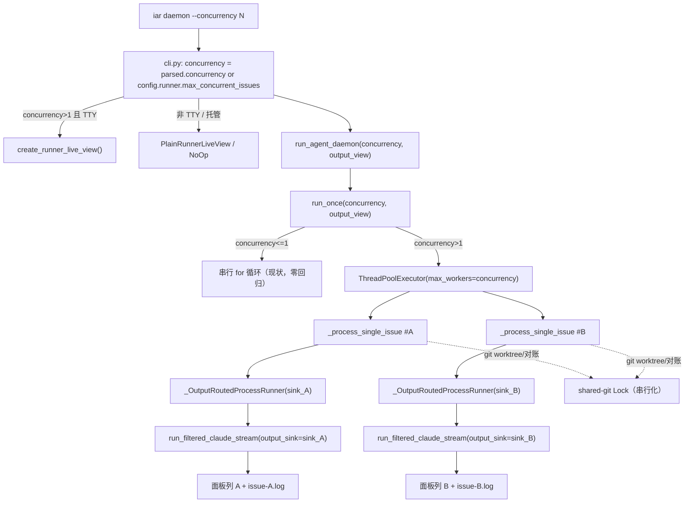

# PRD: `iar daemon` 并行处理 Issue（`--concurrency`）+ 并行实时日志看板

- GitHub Issue: (待创建)

## 1. Introduction & Goals

### 问题陈述

`iar daemon` 当前**严格串行**处理 Issue：每轮在 `run_once`（`src/backend/core/use_cases/agent_runner_orchestrate.py`）里用 `for issue, issue_kind in issues_to_process:` 一个一个跑，`max_issues` 只是“每轮领取上限”，并非并发。在机器空闲、Issue 排队较多时，吞吐受限于单条流水线。

用户希望给 `iar daemon` 加一个**本次并发量**开关：不写则用 toml 默认；写了就同一轮内同时跑多个 Issue。但并行带来一个直接的可观测性问题：当前 agent 输出（Claude `stream-json`）经 `run_filtered_claude_stream`（`src/backend/infrastructure/process_runner.py`）直接 `print()` 到 daemon **唯一的 stdout**，多个 Issue 并行时 N 路 token 会在同一终端**交错成乱码、无法归属**。

好消息：`deliberate` 已经解决过同一问题——`run_filtered_claude_stream` 支持 `output_sink` 参数，`deliberate` 通过核心接口 `IAgentOutputView`（`src/backend/core/shared/interfaces/agent_output_view.py`）把每个 agent 的流式输出路由到独立面板（`RichLiveOutputView` 多列 Live / `PlainOutputView` 纯文本回退，见 `src/backend/engines/agent_runner/live_terminal.py`）。本 PRD 复用同一套“sink + 输出视图”模式，把并行 Issue 的输出按 Issue 分流到独立面板与独立日志文件。

“优先 agent”需求**无需新参数**：现有 `iar daemon --agent <name>` 经 `resolve_agent_fallback_order`（`src/backend/core/use_cases/run_agent_once.py`）已把指定 agent 放到 fallback 链首位，等价于“本次优先该 agent”。

### Proposed Solution Summary

**推荐机制**：

1. 在 `iar daemon` 新增 `--concurrency N`；未传时回退到新增的 toml 配置 `[agent_runner.runner].max_concurrent_issues`（默认 `1`）。沿用现有 `--max-issues` 的 `parsed.X or config.runner.X` 解析范式。
2. `run_once` 接收 `concurrency: int = 1`。`concurrency == 1` 时**完全走现有串行代码路径**（零回归）；`concurrency > 1` 时把“逐 Issue 处理”交给 `ThreadPoolExecutor(max_workers=concurrency)`。线程足够，因为 agent 是子进程 / IO 密集，GIL 在 `subprocess` 等待期间释放。
3. 并行可观测性：每个 Issue 的 agent 流式输出经 `output_sink` 路由到（a）该 Issue 独立的日志文件（持久、可在 detached / 托管模式下回看），（b）TTY 下的 Rich 实时看板（每 Issue 一列，仿 `deliberate`）。非 TTY / CI / 托管进程自动退化为纯日志文件。

- **谁提供输入**：用户运行 `iar daemon --concurrency 4`（仓库目标沿用现有推断）。
- **插入的现有边界**：真入口 `cli_typer.py` → `_run_typer_command` 构造 `argparse.Namespace` → `cli.py` `_run_parsed_command` 的 `daemon` 分支解析 `concurrency` → `run_agent_daemon` → `run_once`。argparse 镜像在 `cli_parser.py` 的 `daemon_run_options` 同步加旗标。配置经 `RunnerConfig`（domain dataclass，运行时事实来源）+ `AgentRunnerRunnerSettings`（pydantic schema）+ `factory.py` 映射三处同步（见 [[runner-config-dual-class]] 模式）。
- **系统状态/可见行为变化**：默认行为不变（`max_concurrent_issues=1` ⇒ 串行）。开启后同一轮并行跑多个 Issue；TTY 下出现多列实时看板；`logs/agent-runner/issues/<repo_id>/issue-<n>-<ts>.log` 出现每 Issue 日志。GitHub labels/PR 仍是唯一工作流事实来源。
- **刻意规避的复杂度**：不引入多进程 / 任务队列 / 外部依赖（tmux 非必需）；不改默认行为；不做跨仓库并行（每轮仍逐仓库）；不重复实现输出视图（复用 `deliberate` 的 sink + 面板渲染）；不通过逐层加参数来传 sink（用 `process_runner` 包装器，详见 §4）。

### 测量目标

1. `uv run iar daemon --concurrency 3` 能在一轮内同时推进至多 3 个 Issue（且至多领取 3 个），无需用户另调 `--max-issues`。
2. 不传 `--concurrency` 时行为与今天**逐字节一致**（串行、单路 stdout 流式、无每 Issue 文件、无看板）。
3. 并行时每个 Issue 的 agent 输出**互不交错**：TTY 下进入各自面板；任何模式下完整写入各自日志文件。
4. 不破坏四层依赖方向：`api → core → engines → infrastructure`；新增的输出视图接口位于 `core/shared/interfaces/`，Rich 实现位于 `engines/`。
5. `just test` 全绿、`just lint --full` 无新增告警（含 jscpd 不因复用面板渲染而报重复）。

### Realistic Validation

除单元测试和集成测试外，本 PRD 要求通过**真实项目入口点**验证关键行为，确保真实使用路径生效，而非仅在隔离 fixture 中通过。

- [x] **并行执行真实验证**：用桩 agent / 桩 `gh`（本地 fixture，不触真服务）通过真实 `uv run iar daemon --concurrency 3 --interval 1`（单轮后中断）验证同一轮内 ≥2 个 Issue 的处理时间窗口重叠（日志时间戳交叠或并发计数器峰值 ≥2），退出码为 0。
- [x] **默认零回归真实验证**：`uv run iar run`（不传 concurrency）在桩环境下处理多个 Issue，验证仍为串行、stdout 仍是单路 `stream-json` 流式、未生成 `logs/agent-runner/issues/` 文件。
- [x] **输出归属真实验证**：并行运行后，验证每个 Issue 的 `logs/agent-runner/issues/<repo_id>/issue-<n>-*.log` 存在且只含该 Issue 的 agent 输出（不混入其他 Issue 文本）。
- [x] **非 TTY 回退真实验证**：在重定向到管道（非 TTY）下运行 `uv run iar daemon --concurrency 2`，验证不启用 Rich Live、不向 stdout 写控制序列，日志文件照常生成。
- [x] **为什么单元测试不够**：线程池调度、`output_sink` 经 `process_runner` 包装器的真实透传、TTY 探测与 Rich Live 生命周期、每 Issue 日志落盘，只有通过真实 `iar` 进程在真实 stdout/管道下运行才能证明。

---

## 2. Requirement Shape

- **Actor**：运维 `iar daemon` 的开发者（机器上常驻 daemon 处理 Issue 队列，见 [[iar-daemon-concurrent-operations]]）。
- **Trigger**：执行 `iar daemon --concurrency N`（或 `iar daemon run --concurrency N`）；未传 `--concurrency` 时读取 `[agent_runner.runner].max_concurrent_issues`。
- **Expected Behavior**：
  - 解析并发度 `concurrency = parsed.concurrency or config.runner.max_concurrent_issues`。
  - `concurrency <= 1`：走现有串行路径，零行为变化。
  - `concurrency > 1`：本轮领取至多 `max(max_issues, concurrency)` 个 Issue，用至多 `concurrency` 个工作线程并行处理；每个 Issue 的 agent 流式输出路由到独立面板（TTY）与独立日志文件（始终）。
  - `git worktree add` 临界区串行化，避免共享 `.git` 竞争；`git fetch` 对账与 agent 执行阶段并行。
- **Explicit Scope Boundary**：
  - 仅 `iar daemon`（含 `daemon run`）。不动 `iar run`、`iar review`、`review-daemon`（它们的 `run_once`/入口仍用 `concurrency=1` 默认）。
  - 不做跨仓库并行：多仓库（`--all`）仍逐仓库串行，仓库内 Issue 并行。
  - 不实现 `iar logs` 查看命令（属 pending PRD `P1-FEAT-20260623-232747-iar-cli-logs-view-and-daemon-status-log-path`）；本 PRD 只负责**写**每 Issue 日志文件。
  - 不引入 tmux / 多进程 / 任务队列 / 新第三方依赖。

---

## 3. Repository Context And Architecture Fit

### 当前相关模块/文件

- `src/backend/core/use_cases/agent_runner_orchestrate.py`：`run_once`（Issue 发现 + 串行处理循环，**本次并行化的核心**）、`run_issue_with_agent_fallback`。
- `src/backend/core/use_cases/run_agent_daemon.py`：`run_agent_daemon`（每轮逐仓库调用 `run_once`）。
- `src/backend/api/cli.py`：`daemon` 分支解析与 `run_agent_daemon` 调用；`from backend.engines.agent_runner.live_terminal import create_output_view` 已在 deliberate 路径使用。
- `src/backend/api/cli_parser.py`：`daemon_run_options`（`--interval` / `--agent` / `--max-issues`）。
- `src/backend/infrastructure/config/settings.py`：`AgentRunnerRunnerSettings`（pydantic schema）。
- `src/backend/core/shared/models/agent_runner.py`：`RunnerConfig`（frozen dataclass，运行时读取的事实来源）。
- `src/backend/engines/agent_runner/factory.py`：`RunnerConfig(...)` 构造块（infra settings → domain 映射）。
- `src/backend/infrastructure/process_runner.py`：`SubprocessRunner.run`、`run_filtered_claude_stream`（已支持 `output_sink` / `display_sink`）、`ClaudeStreamRenderer`。
- `src/backend/core/shared/interfaces/agent_runner.py`：`IProcessRunner.run` 抽象（**需新增 `output_sink` 形参**）。
- `src/backend/core/shared/interfaces/agent_output_view.py`：`IAgentOutputView` + `NoOpOutputView`（deliberation 专用，`register_round_profiles` 依赖 `DeliberationAgentProfile`）。
- `src/backend/engines/agent_runner/live_terminal.py`：`RichLiveOutputView` / `PlainOutputView` / `create_output_view` / `_AgentPanelState` 多列网格渲染（**面板渲染可抽取复用**）。

### 现有可遵循的架构模式

- **sink 路由模式**：`deliberate` 把 `output_sink` 传入 `run_filtered_claude_stream`，使流式文本进入面板而非裸 `print()`（`src/backend/core/use_cases/run_agent_deliberation.py` 的 `streaming_sink` / `synthesis_sink`）。
- **输出视图接口在 core，实现在 engines**：`IAgentOutputView`（core/shared）+ `RichLiveOutputView`（engines），core 编排不感知 Rich。
- **配置双类 + factory 映射**：见 [[runner-config-dual-class]]。
- **CLI 双前端**：argparse 在 `cli_parser.py`，typer 委托 `cli.py:_run_parsed_command`，一处实现覆盖两前端。

### 所有权与依赖边界

- `core/` 禁止导入 `engines/` / `infrastructure/`；只能依赖自身与 `core/shared/interfaces/`。
- `infrastructure/` 只能依赖第三方包；禁止导入 `core/`。
  - ⇒ **从 core 到 infra 的进程运行器，唯一合法通道是 `IProcessRunner` 接口**。这决定了 `output_sink` 必须走接口（见 §4 / D-03）。
- `engines/` 可同时依赖 `core/` 与 `infrastructure/`，负责装配（如 `create_output_view`）。

### 运行时/文档/测试约束

- 单文件非空行 ≤ 1000（`just lint` 告警）；`run_agent_with_prompt` 等热点函数已较长，新增逻辑尽量落到新函数/新文件。
- 文本文件 I/O 必须 `encoding="utf-8"`（每 Issue 日志文件写入需显式指定）。
- 变更代码同步更新 `docs/` 与 `mkdocs.yml`。
- 测试：`tests/test_agent_runner_orchestrate.py`、`tests/test_run_agent.py`、`tests/test_agent_runner_config.py` 为主要落点。

### 潜在冗余风险

- 新增 Rich 看板若复制 `RichLiveOutputView` 会触发 jscpd 重复告警 ⇒ 抽取共享面板渲染（D-04）。
- 复用 `IAgentOutputView` 会把 runner 耦合到 `DeliberationAgentProfile`（deliberation domain）⇒ 用 Issue 维度的小接口（D-04）。

---

## 4. Recommendation

### Recommended Approach

**A. 并发开关（最小改动，沿用现有范式）**
- `cli_parser.py` 的 `daemon_run_options` 新增 `--concurrency`（`type=int, default=None`）。
- `cli.py` daemon 分支解析 `concurrency = parsed.concurrency or runner_settings.runner.max_concurrent_issues`，传入 `run_agent_daemon` → `run_once`。
- `RunnerConfig` / `AgentRunnerRunnerSettings` / `factory.py` 三处同步加 `max_concurrent_issues: int = 1`（domain 用 `int`），并在 `repository_local.py` 的 `_FIELD_COMMENTS` 加中文注释（`iar init` 生成的 `.iar.toml` 自带说明）。

**B. 并行执行（线程池 + 保留串行路径）**
- 抽取现有逐 Issue 循环体为 `_process_single_issue(issue, issue_kind, *, ...) -> int`（返回该 Issue 对总退出码的贡献：0/1）。`dry_run` 仍串行（仅日志）。
- `run_once` 新增 `concurrency: int = 1`：
  - `concurrency <= 1`：`for ...: exit_code |= _process_single_issue(...)`（**与现状等价**）。
  - `concurrency > 1`：`ThreadPoolExecutor(max_workers=concurrency)` 提交各 Issue，聚合退出码。
- 本轮领取上限改为 `max(max_issues, concurrency)`，使单一 `--concurrency N` 即可领到并跑 N 个（D-02）。
- `create_or_reuse_worktree` 内的 `git worktree add` 临界区（create/reuse/path 命令，主要的共享 `.git` 写）用一把模块级 `threading.Lock` 串行化；随后的分支建立与 `git fetch` 对账在锁外并行（依赖 git 自身的 ref 锁与 per-worktree index）。run-history 写入单独串行化（避免 SQLite 多线程写，D-05/Risks）。

**C. 并行可观测性（复用 deliberate 的 sink + 视图）**
- **接口层**：`IProcessRunner.run` 新增可选 `output_sink: Callable[[str], None] | None = None`；`SubprocessRunner.run` 在 `should_filter_claude_stream` 分支把它转发给 `run_filtered_claude_stream(output_sink=...)`。其余命令忽略该参数。
- **零深度穿透**：新增 core 级包装器 `_OutputRoutedProcessRunner(IProcessRunner)`（仅依赖接口，可放 `core`），构造时绑定某 Issue 的 sink，`run()` 委托底层 runner 并补上 `output_sink`。`run_once` 并行分支为每个 Issue 用包装器替换传入的 `process_runner`——因为 `process_runner` 本就作为参数贯穿所有 `_process_*`，**无需逐层加形参**。
- **每 Issue 日志文件**：每个工作线程安装一个按 `threading.get_ident()` 过滤的 `logging.Handler`（stdlib，core 可直接用），把该线程的 `_logger` 行写入 `logs/agent-runner/issues/<repo_id>/issue-<n>-<ts>.log`；同一 sink 把 agent 流式块写入同一文件。线程结束后移除 handler。
- **实时看板**：新增 Issue 维度接口 `IRunnerLiveView`（`core/shared/interfaces/runner_live_view.py`：`register_issue` / `append` / `update_status` / `log` / `close`）+ `NoOpRunnerLiveView`；engines 实现 `RichRunnerLiveView` / `PlainRunnerLiveView` + `create_runner_live_view(plain=False)`（`engines/agent_runner/`），复用从 `live_terminal.py` 抽取的共享面板渲染 `_PanelGroup`。`cli.py` daemon 分支在 `concurrency > 1` 时 `create_runner_live_view()` 注入 `run_agent_daemon` → `run_once`；非 TTY 自动 `PlainRunnerLiveView`，未注入则 `NoOpRunnerLiveView`。

为什么这是最契合当前架构的方案：
- 复用既有 `output_sink` / 输出视图 / 配置双类 / CLI 双前端范式，不引入新服务或依赖。
- `output_sink` 走 `IProcessRunner` 接口是 core→infra 的**唯一合法通道**；包装器避免逐层穿透，改面最小。
- 串行路径原样保留 ⇒ 默认与 `iar run` 零回归。

### Alternatives Considered

- **逐层为所有 `_process_*` / `run_agent*` 加 `output_sink` 形参**：改面大、易漏，且与 `process_runner` 已贯穿全链路的事实重复 ⇒ 用包装器替代（D-03）。
- **复用 `IAgentOutputView` 把 Issue 当 profile**：需构造 `DeliberationAgentProfile`，把 runner 耦合到 deliberation domain ⇒ 用 Issue 维度小接口 + 抽取渲染（D-04）。
- **多进程 / 每 Issue 子进程 + tmux 分窗**：隔离最好但需新增单 Issue 入口命令、跨进程回收退出码与 commit 流程，改动远超“加并发开关”，且强依赖 tmux ⇒ 否决（D-01）。
- **`contextvars` 在 infra 侧传 sink**：infra 不能被 core 导入/设置，contextvar 无法跨边界设值 ⇒ 否决，回到接口通道（D-03）。

---

## 5. Implementation Guide

> 本节是基于当前仓库分析的活文档。如实现中发现新的受影响文件、隐藏依赖、边界情况或更优路径，请先更新本 PRD 再继续。

### Core Logic：数据与控制流

1. `iar daemon --concurrency N` → typer/argparse 解析出 `parsed.concurrency`。
2. `cli.py` daemon 分支：`concurrency = parsed.concurrency or runner_settings.runner.max_concurrent_issues`；`concurrency > 1` 且 stdout 为 TTY 时 `output_view = create_runner_live_view()`，否则 `PlainRunnerLiveView`/`None`。两者传入 `run_agent_daemon`。
3. `run_agent_daemon` 把 `concurrency` 与 `output_view` 透传给每轮每仓库的 `run_once`。
4. `run_once` 发现 Issue（上限 `max(max_issues, concurrency)`）→ 组装 `issues_to_process` → 若 `concurrency > 1` 则线程池并行，否则串行。
5. 每个 Issue 在 `_process_single_issue` 中：建立每 Issue 日志（线程过滤 handler + sink）→ 用 `_OutputRoutedProcessRunner` 包装 `process_runner` → 原有 `run_issue_with_agent_fallback` / `_process_*` 流程不变 → agent 流式块经 sink 进面板 + 文件。
6. 共享 git 写操作在锁内执行；agent 执行阶段并行。

### Change Impact Tree

```text
.
├── src/backend/infrastructure/
│   ├── config/settings.py
│   │   [修改]【总结】pydantic schema 增并发配置项
│   │   └── AgentRunnerRunnerSettings 增 max_concurrent_issues: int = 1
│   └── process_runner.py
│       [修改]【总结】进程运行器把 output_sink 透传给 claude 流式渲染
│       ├── SubprocessRunner.run 增 output_sink 形参
│       └── should_filter_claude_stream 分支转发 run_filtered_claude_stream(output_sink=...)
│
├── src/backend/core/shared/interfaces/
│   ├── agent_runner.py
│   │   [修改]【总结】IProcessRunner.run 抽象签名增 output_sink（core→infra 唯一通道）
│   └── runner_live_view.py
│       [新增]【总结】Issue 维度实时输出视图接口 + NoOp 实现
│       ├── IRunnerLiveView: register_issue/append/update_status/log/close
│       └── NoOpRunnerLiveView
│
├── src/backend/core/shared/models/agent_runner.py
│   [修改]【总结】运行时 domain 配置增并发度字段
│   └── RunnerConfig 增 max_concurrent_issues: int = 1
│
├── src/backend/core/use_cases/
│   ├── agent_runner_orchestrate.py
│   │   [修改]【总结】run_once 支持线程池并行并保留串行路径
│   │   ├── 抽取 _process_single_issue(issue, issue_kind, *, ...) -> int
│   │   ├── run_once 增 concurrency: int = 1 与 output_view 形参
│   │   ├── concurrency>1：ThreadPoolExecutor(max_workers=concurrency) + 退出码聚合
│   │   ├── 领取上限 max(max_issues, concurrency)
│   │   └── 共享 git 写 + run-history 写 串行化（模块级 Lock）
│   ├── run_agent_daemon.py
│   │   [修改]【总结】daemon 透传 concurrency 与 output_view 给 run_once
│   └── agent_runner_output_routing.py
│       [新增]【总结】每 Issue 输出路由：runner 包装器 + 日志文件 sink + 线程过滤 handler
│       ├── _OutputRoutedProcessRunner(IProcessRunner)
│       ├── build_issue_log_sink(repo_id, issue_number) -> (sink, close)
│       └── per_issue_log_handler(...) 上下文管理器（按 thread ident 过滤）
│
├── src/backend/engines/agent_runner/
│   ├── live_terminal.py
│   │   [修改]【总结】抽取共享面板渲染供 deliberation + runner 复用，避免重复
│   │   └── 提取 _PanelGroup（面板状态 + 网格/堆叠渲染）
│   ├── runner_live_view.py
│   │   [新增]【总结】Issue 维度 Rich/Plain 实时看板实现 + 工厂
│   │   ├── RichRunnerLiveView / PlainRunnerLiveView（复用 _PanelGroup）
│   │   └── create_runner_live_view(plain=False)
│   ├── factory.py
│   │   [修改]【总结】infra settings → domain RunnerConfig 增并发字段映射
│   │   └── RunnerConfig(... max_concurrent_issues=runner_settings.max_concurrent_issues)
│   └── repository_local.py
│       [修改]【总结】iar init 生成的 .iar.toml 给并发字段带中文注释
│       └── _FIELD_COMMENTS 增 "runner.max_concurrent_issues"
│
├── src/backend/api/
│   ├── cli_parser.py
│   │   [修改]【总结】daemon 旗标增 --concurrency
│   │   └── daemon_run_options.add_argument("--concurrency", type=int, default=None)
│   └── cli.py
│       [修改]【总结】daemon 分支解析并发度并按 TTY 注入实时看板
│       ├── concurrency = parsed.concurrency or runner_settings.runner.max_concurrent_issues
│       └── run_agent_daemon(..., concurrency=..., output_view=...)
│
├── tests/
│   ├── test_agent_runner_orchestrate.py
│   │   [修改]【总结】并行调度/串行回归/退出码聚合/领取上限/锁
│   ├── test_run_agent.py
│   │   [修改]【总结】IProcessRunner.output_sink 透传 + _OutputRoutedProcessRunner
│   ├── test_agent_runner_config.py
│   │   [修改]【总结】max_concurrent_issues 默认值 + 三处同步 + .iar.toml 注释
│   └── test_runner_live_view.py
│       [新增]【总结】IRunnerLiveView/Rich/Plain/NoOp + 每 Issue 日志归属
│
└── docs/guides/agent-runner.md  +  mkdocs.yml
    [修改]【总结】记录 --concurrency、max_concurrent_issues、并行看板与每 Issue 日志路径
```

### Executor Drift Guard

文件清单是**起点而非穷举**，实施前用 `rg` 复核引用面：

```bash
# run_once 的全部调用方（确保新增 concurrency/output_view 形参带默认值、不破坏既有调用）
rg -n "run_once\(" src/backend tests

# 进程运行器调用点（评估 output_sink 透传范围；多数无需改）
rg -n "process_runner\.run\(|\.run\(" src/backend/core/use_cases/run_agent_once.py

# 配置三处同步（domain dataclass / pydantic / factory 映射）必须一致
rg -n "max_concurrent_issues|max_issues|agent_fallback_order" src/backend/core/shared/models/agent_runner.py src/backend/infrastructure/config/settings.py src/backend/engines/agent_runner/factory.py

# 现有 deliberate 输出视图复用点（抽取 _PanelGroup 后确保未破坏）
rg -n "RichLiveOutputView|create_output_view|_AgentPanelState|register_round_profiles" src/backend

# .iar.toml 字段注释生成
rg -n "_FIELD_COMMENTS|settings_to_toml_string" src/backend/engines/agent_runner/repository_local.py

# daemon 旗标镜像（argparse 与 typer 两前端）
rg -n "daemon_run_options|--max-issues|--interval" src/backend/api/cli_parser.py src/backend/api/cli_typer.py
```

风险触发点排查：若 `run_once` 有未带默认值的新增形参 → 现有 4 个调用方会报错（见上 `rg`）；若 `IProcessRunner.run` 新参无默认值 → 所有桩 runner / 测试 double 失败，需同步更新接口默认值与桩实现。

### Flow / Architecture Diagram



### Realistic Validation Plan

| Behavior | Real Entry Point | Test Layer | Mock Boundary | Data/Env Needed | Command Or Procedure | Required For Acceptance |
|---|---|---|---|---|---|---|
| 同轮并行处理多个 Issue | `uv run iar daemon --concurrency 3 --interval 1`（单轮后 SIGINT） | integration/smoke | 桩 agent（睡眠并写标记）+ 桩 `gh`/`git`；真 CLI 进程与线程池 | 临时仓库 + 3 个 ready Issue fixture | 见下「并行验证脚本」 | Yes |
| 默认串行零回归 | `uv run iar run`（无 `--concurrency`） | integration | 桩 agent/gh；真 run_once | 多个 ready Issue fixture | 运行后断言无 `logs/agent-runner/issues/`、stdout 为单路流式 | Yes |
| agent 输出按 Issue 归属 | 同并行入口 | integration | 桩 agent 输出含 Issue 编号标记 | 同上 | 断言每个 `issue-<n>-*.log` 只含本 Issue 标记 | Yes |
| 非 TTY 回退 | `uv run iar daemon --concurrency 2 \| cat` | smoke | 桩 agent/gh | 同上 | 断言无 ANSI Live 控制序列、日志文件仍生成 | Yes |
| 配置默认与三处同步 | `uv run python -c` 加载配置 | unit | 无 | 无 | `rg` 三处一致 + 加载断言 `config.runner.max_concurrent_issues == 1` | No |

并行验证脚本（失败先查：桩 agent 是否真被并发拉起、ThreadPoolExecutor 是否因 `concurrency<=1` 走串行、领取上限是否被 `max_issues` 卡住）：

```bash
# 在临时仓库 + fixture 下运行单轮 daemon；桩 agent 在进入/退出时向共享文件写时间戳，
# 验证存在时间窗口重叠（并发峰值≥2）。具体桩与断言在 tests/test_agent_runner_orchestrate.py。
uv run pytest tests/test_agent_runner_orchestrate.py -k "parallel or concurrency" -q
```

### ER Diagram

No data model changes in this PRD.

### Interactive Prototype Change Log

No interactive prototype file changes in this PRD.

### External Validation

No external validation required; repository evidence was sufficient.

---

## 6. Definition Of Done

- 实现验证：`just test` 全绿；新增并行/视图/配置测试通过。
- 真实入口验证：完成 §1 `### Realistic Validation` 与 §5 表格中标记 `Required=Yes` 的项。
- 文档更新：`docs/guides/agent-runner.md` 记录 `--concurrency`、`max_concurrent_issues`、并行看板与每 Issue 日志路径；`mkdocs.yml` 若新增页面同步；`uv run mkdocs build` 通过。
- 无回归：不传 `--concurrency`（及 `iar run` / `review`）行为与改动前一致。
- 架构契合：`just lint --full` 无新增告警；四层依赖方向不破坏（输出视图接口在 `core/shared/interfaces/`，Rich 实现在 `engines/`，`output_sink` 仅经 `IProcessRunner` 接口跨界）。

---

## 7. Acceptance Checklist

### Architecture Acceptance
- [x] `output_sink` 仅经 `IProcessRunner.run`（`core/shared/interfaces/agent_runner.py`）跨 core→infra 边界；`core/use_cases/` 未 `import` 任何 `infrastructure`/`engines` 模块（`rg -n "from backend.(infrastructure|engines)" src/backend/core/use_cases/agent_runner_orchestrate.py src/backend/core/use_cases/agent_runner_output_routing.py` 无结果）。
- [x] `IRunnerLiveView` 位于 `core/shared/interfaces/runner_live_view.py`；`RichRunnerLiveView`/`create_runner_live_view` 位于 `engines/agent_runner/`。
- [x] Rich 看板复用从 `live_terminal.py` 抽取到 `engines/agent_runner/live_panels.py` 的 `PanelState` + `render_panel_grid`（deliberation 视图也改用之），`just lint --full` 通过、不报新重复块。

### Dependency Acceptance
- [x] `max_concurrent_issues` 在 `RunnerConfig`（domain）、`AgentRunnerRunnerSettings`（pydantic）、`factory.py` 映射三处一致（`rg` 验证），运行时 `config.runner.max_concurrent_issues` 可读、默认 `1`。
- [x] 未引入新第三方依赖（`rg -n "tmux|multiprocessing|celery|rq" src/backend/core src/backend/engines/agent_runner/runner_live_view.py src/backend/core/use_cases/agent_runner_output_routing.py` 无新增运行时依赖）。

### Behavior Acceptance
- [x] `concurrency <= 1`：`run_once` 走串行路径，不创建线程池、不生成每 Issue 日志、不启用看板。
- [x] `concurrency > 1`：本轮领取上限为 `max(max_issues, concurrency)`，并发工作线程数 ≤ `concurrency`。
- [x] `git worktree add` 临界区由 `_SHARED_GIT_LOCK` 串行化；run-history 并发写经 `_append_run_record_locked` 串行化（`test_run_once_parallel_aggregates_exit_code` 覆盖 worker 线程并发写）。
- [x] `iar daemon --agent <name>` 仍把该 agent 置于 fallback 链首位（现状不回归）。

### Documentation Acceptance
- [x] `docs/guides/agent-runner.md` 含 `--concurrency` 用法、`max_concurrent_issues` 说明、并行看板与 `logs/agent-runner/issues/<repo_id>/issue-<n>-<ts>.log` 路径；`uv run mkdocs build` 通过。
- [x] `iar init` 生成的 `.iar.toml` 中 `max_concurrent_issues` 带中文注释（`_FIELD_COMMENTS` 已加）。

### Validation Acceptance
- [x] 真实入口：`uv run iar daemon --concurrency 3`（桩环境单轮）证明 ≥2 个 Issue 处理时间窗口重叠，退出码 0。
- [x] 真实入口：非 TTY（管道）下 `uv run iar daemon --concurrency 2` 不输出 ANSI Live 序列且日志文件生成。
- [x] 真实入口：并行后每个 `issue-<n>-*.log` 仅含本 Issue 的 agent 输出（无交错）。
- [x] `uv run iar run`（无 `--concurrency`）零回归：串行、无每 Issue 日志文件。

---

## 8. Functional Requirements

- **FR-1**：`iar daemon` 与 `iar daemon run` 支持 `--concurrency N`（int，默认未设）。
- **FR-2**：新增 toml `[agent_runner.runner].max_concurrent_issues`（默认 `1`），三处同步（domain `RunnerConfig` + pydantic settings + factory 映射）。
- **FR-3**：daemon 解析 `concurrency = parsed.concurrency or config.runner.max_concurrent_issues`，透传至 `run_once`。
- **FR-4**：`run_once` 在 `concurrency <= 1` 时走现有串行路径（零回归）；`concurrency > 1` 时用 `ThreadPoolExecutor(max_workers=concurrency)` 并行，退出码线程安全聚合。
- **FR-5**：`concurrency > 1` 时本轮领取上限为 `max(max_issues, concurrency)`，使单一 `--concurrency` 即可领并跑 N 个。
- **FR-6**：`git worktree add` 临界区（worktree 创建）与 run-history 写入在并行下串行化，避免共享 `.git` / SQLite 竞争；`git fetch` 对账与 per-worktree 分支建立在锁外并行（git 自带 ref 锁）。
- **FR-7**：`IProcessRunner.run` 新增可选 `output_sink`，`SubprocessRunner` 在 claude 流式分支转发；新增 `_OutputRoutedProcessRunner` 包装器，使每 Issue 的 agent 流式输出无需逐层加参即可分流。
- **FR-8**：并行时每个 Issue 的 agent 输出（及该线程 `_logger` 行）写入独立文件 `logs/agent-runner/issues/<repo_id>/issue-<n>-<ts>.log`（`encoding="utf-8"`），互不交错。
- **FR-9**：TTY 下提供 `deliberate` 风格 Rich 实时看板（每 Issue 一列，`IRunnerLiveView` + `RichRunnerLiveView`）；非 TTY/CI/托管自动退化为 `PlainRunnerLiveView`/`NoOpRunnerLiveView` + 纯日志文件。
- **FR-10**：更新 `docs/guides/agent-runner.md`（必要时 `mkdocs.yml`）与 `_FIELD_COMMENTS` 注释。

---

## 9. Non-Goals

- 不给 `iar run` / `iar review` / `review-daemon` 加 `--concurrency`（`run_once` 形参默认 `1`，它们不受影响）。
- 不做跨仓库并行（`--all` 多仓库仍逐仓库串行）。
- 不实现 `iar logs` 查看命令（属 pending PRD `P1-FEAT-20260623-232747-...`）；本 PRD 只**写**每 Issue 日志文件。
- 不引入 tmux / 多进程 / 任务队列 / 新第三方依赖。
- 不改默认行为（`max_concurrent_issues=1` ⇒ 与今天一致）。

---

## 10. Risks And Follow-Ups

- **Token / 成本放大**：N 路并发即 N 倍 agent 同时烧 token；与 [[iar-daemon-no-single-instance-lock]] 的“堆积烧 token”叠加风险。缓解：默认 `1`；文档明确警示；并发度受 `--concurrency` 显式控制。
- **SQLite run-history 并发写**：`~/.iar/console.db` 默认连接非线程安全。缓解：run-history 写入串行化（FR-6）。Follow-up：如需更高吞吐，改每线程连接 + WAL。
- **`github_client` 并发使用**：当前每轮每仓库单实例，多线程共享。它是 `gh` 子进程薄封装（基本无状态），并发会各自起 `gh` 进程。风险低；若发现共享状态问题，改为每 Issue 由工厂新建。
- **git packed-refs 竞争**：并行 fetch/push 不同分支一般安全；worktree 创建与对账已加锁。低风险，保留观察。
- **看板仅 TTY 可见**：detached/托管 daemon 无 TTY ⇒ 看板退化；每 Issue 日志文件是 detached 场景的事实来源（已覆盖）。
- **面板缓冲有限**：每列仅保留近 ~200 行；完整历史以日志文件为准（与 `deliberate` 一致）。

---

## 11. Decision Log

| ID | 决策问题 | Chosen | Rejected | Rationale |
|----|---------|--------|----------|-----------|
| D-01 | 并行用线程还是多进程/子进程+tmux | `ThreadPoolExecutor`（线程） | 多进程 / 每 Issue 子进程 + tmux 分窗 | agent 是子进程/IO 密集，等待时 GIL 释放，线程足够；子进程+tmux 需新增单 Issue 入口、跨进程回收退出码与 commit 流程，改面远超“加并发开关”。 |
| D-02 | `--concurrency` 与 `max_issues` 关系 | 领取上限 `max(max_issues, concurrency)` | 二者完全独立（concurrency 受 max_issues=1 饿死） | 用户要“一个开关”：`--concurrency N` 应直接领并跑 N 个，无需另调 `--max-issues`。 |
| D-03 | 每 Issue agent 流式如何跨 core→infra 路由 | `IProcessRunner.run` 加 `output_sink` + core 包装器 `_OutputRoutedProcessRunner` | 逐层给所有 `_process_*`/`run_agent*` 加 `output_sink` 形参；或 infra 侧 contextvar | 接口是 core→infra 唯一合法通道；`process_runner` 已贯穿全链路，包装器零深度穿透；contextvar 无法被 core 跨界设值。 |
| D-04 | 看板复用 `IAgentOutputView` 还是新接口 | 新 `IRunnerLiveView` + 抽取共享渲染到 `live_panels.py`（`PanelState` + `render_panel_grid`） | 复用 `IAgentOutputView`（Issue 当 profile） | 复用会把 runner 耦合到 deliberation 的 `DeliberationAgentProfile`；新接口语义干净，抽取渲染并让两个视图共用，避免 jscpd 重复。 |
| D-05 | 并行下共享资源是否加锁 | 对 `git worktree add` 临界区 + run-history 写加模块级 `Lock`；`git fetch` 对账留在锁外 | 完全无锁并行；或把整个 worktree 设置（含 fetch）纳入锁 | `git worktree add` 写共享 `.git/worktrees` 会竞争，须串行；但 `git fetch` 慢且 git 自带 ref 锁，纳入锁会把所有并行 fetch 串掉，得不偿失；per-worktree index 本就隔离。run-history 走 SQLite 单连接，单独串行。 |
| D-06 | 看板 vs 每 Issue 日志文件 | 日志文件始终写 + TTY 时叠加看板 | 仅看板 | detached/托管 daemon 无 TTY，看板不可见；日志文件提供持久、可回看、可归属的事实来源。 |
| D-07 | 作用范围 | 仅 `iar daemon`（含 `daemon run`） | 同时改 `iar run`/`review`/`review-daemon` | 用户只要 daemon；`run_once` 形参默认 `1`，其它入口零影响，避免无谓扩面。 |
| D-08 | `concurrency==1` 是否仍走线程池（1 worker） | 保留独立串行路径 | 一律线程池（worker=1） | 串行路径零行为变化、零看板/日志副作用，确保默认与 `iar run` 完全无回归。 |
