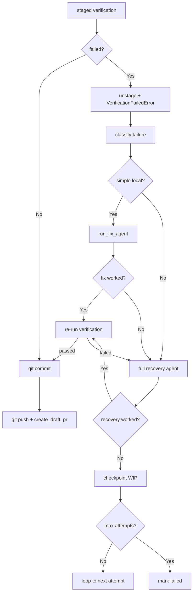

# PRD: Agent Runner Recovery Friction Reduction: Fix Agent and Timeout Layering

- GitHub Issue: (待创建，关联 freshai #23 runner 多次失败复盘)


## 1. Introduction & Goals

### 问题陈述

freshai issue #23 在 keda Agent Runner 上连续 6 次尝试失败。复盘失败链：

1. Agent 新增文件出现 ruff `F821 Undefined name`（漏 import `Sequence`、`AgentModel`）。
2. 这类错误**无法被 ruff `--fix` 自动修复**，runner 进入 `run_agent_until_committed` 的 recovery loop。
3. Recovery 触发前 runner 已通过 `checkpoint_uncommitted_progress` 生成 `[Agent][WIP] Issue #23 checkpoint` commit，用于跨 claim 续作。
4. Recovery agent 在 1200s 窗口内需同时处理：修代码、重跑 verification、整理 evidence、写 `commit-request.json`。
5. 最终 recovery 超时退出，Issue 被标为 `agent/failed`。

当前 keda runner 已有较完善的 recovery 架构（surgical failure recovery、commit proxy、format-hook autofix、WIP checkpoint），但面对**非自动修复型 lint 错误**和**Recovery Agent 一次性处理所有事务**时仍显笨重。本 PRD 在现有架构上做最小增量，降低这类 recovery 摩擦。

### Proposed Solution Summary

**推荐机制**：在 runner 内部建立两层修复 escalator，把 recovery 从“一启动就要处理所有事”拆成“简单判断的 Fix Agent 修 → 复杂全局的 Recovery Agent 修”。

1. **Fix Agent for simple local failures**
   - 新增 `build_fix_prompt()` 与 `run_fix_agent()`。
   - 当失败属于“简单局部代码/测试问题”时（如 `F821` import 错误、ruff 逻辑错误、单测失败、非 `F821` 的 lint 错误），启动一个**轻量 Fix Agent**。
   - Fix Agent 的 prompt 包含当前 verification 失败输出，并附带完整的 `verification_commands` 列表，让 agent 知道完整的交付门禁；prompt 同时明确要求不处理 evidence、PRD checklist、commit request 等全局交付物。
   - Fix Agent 成功修复后，runner 继续走 commit proxy；失败后再升级到完整 Recovery Agent。

2. **Verification context in every prompt**
   - 首次实现 prompt（`build_prompt`）列出 runner 将要执行的完整 `verification_commands`，让 agent 在编码阶段就了解最终要通过哪些检查。
   - Recovery Agent prompt（`build_recovery_prompt`）在 failure summary 之外附加原始 verification 失败输出（命令、exit code、stdout/stderr）。
   - 跨 claim 续作 prompt（`build_progress_continuation_prompt`）附带上一次失败的 failure summary 和 verification 输出，让续作 agent 直接针对未通过的检查继续修复。

3. **Recovery timeout 分层**
   - 在 `AppConfig.runner` 中区分 `timeout_seconds`（正常 agent 执行）、`fix_timeout_seconds`（Fix Agent 执行）与 `recovery_timeout_seconds`（完整 Recovery Agent 执行）。
   - Fix Agent 和 Recovery Agent 阶段通常只需局部修复，给予更短但更可控的超时，避免单次长 recovery 把整轮时间耗尽。

**刻意规避的复杂度**：不取消任何质量门；不将 commit 权交给 agent（commit proxy 机制不变）；不新增数据库/队列/持久状态；不改动 WIP checkpoint 机制（checkpoint 保留到合并时由 GitHub/GitLab squash 收敛）；Fix Agent 只处理简单局部代码/测试失败，不扩大为全能修复者；透传 verification 上下文不扩大 prompt 中其他全局交付物的范围；代码层面默认值保持最小（仅 `git diff --check`），完整命令仍由 `iar init` 按仓库探测生成。

### 测量目标

1. 面对 `F821 Undefined name` 类简单 import 错误，Fix Agent 在 1-2 轮内完成，不升级到完整 Recovery Agent。
2. 面对简单非确定性 lint/测试失败，Fix Agent 在 1-2 轮内完成，不升级到完整 Recovery Agent。
3. recovery agent 因 timeout 导致整轮失败的概率下降。
4. 现有成功路径无任何额外开销。

### Realistic Validation

除单元测试外，本 PRD 要求通过**真实 runner 流程**验证关键行为：

- [ ] **Fix Agent 真实验证**：在临时 worktree 中构造一个简单局部 verification 失败（如 `F821 Undefined name` 漏 import `typing.Sequence`、ruff 逻辑错误或单测失败），验证 runner 启动 Fix Agent 并在 1-2 轮内修复，不升级到完整 Recovery Agent。
- [ ] **Fix/Recovery timeout 分层真实验证**：配置 `fix_timeout_seconds < timeout_seconds` 与 `recovery_timeout_seconds < timeout_seconds`，分别构造 Fix Agent 和 Recovery Agent 场景，验证各自使用对应的超时并被正确中断。

**为什么单元测试不够**：Fix Agent 涉及真实 agent 调用与 prompt 边界；ruff 输出解析、git worktree 文件修改、pre-commit 重跑发生在真实 runner 流程中；timeout 涉及真实子进程调度。这些行为在单测中会被大量 mock 掉，无法证明真实 runner 流程中的时序和副作用。

> **归档注记（2026-07-03）**：实现已于 2026-06-26 随 commit `6d96266` 全部落地，第 7 节 Acceptance Checklist 全部完成。上方两项人工构造的真实验证未执行，如实保留未勾状态；以生产观测补充：`~/.iar/console.db`（2026-06-29 至 2026-07-03，freshai / keda-main / kimi-ppt）显示 staged 验证失败仅出现 1 次（kimi-ppt #12，`just test` 全量失败），Fix Agent 触发后未修复成功，由完整 Recovery Agent 在下一轮收敛。据此于 2026-07-03 追加 `fix_agent_enabled` 开关与 Fix Agent 启动/成功/失败/跳过日志（属后续增量，不在本 PRD 范围内）。另注：实现为 Fix Agent 无条件拦截 staged 验证失败，未实现 FR-3/FR-4 所述的 classify 门控；简单/复杂失败的区分由"Fix Agent 失败后升级 Recovery Agent"的两级结构隐式承担。

### Delivery Dependencies

- Group: agent-runner-recovery-friction
- Depends on groups:
  - none
- Depends on tasks/issues:
  - none（与 freshai #23 为复盘关系，#23 已完成）
- Gate type: none
- Notes: 本 PRD 只修改 keda runner 内部逻辑，不依赖外部 IAR 工具发版。


## 2. Requirement Shape

### Actor

- **AI agent**：产出代码，可能引入 `F821` 等简单错误；作为 Fix Agent 修复简单局部失败；作为 Recovery Agent 处理复杂全局失败。
- **Agent Runner**：在 commit proxy 后按 escalator 选择修复策略（Fix Agent → Recovery Agent）；按阶段使用不同超时。
- **开发者/维护者**：复盘中查看更干净的 branch 历史和更少的 recovery 轮次。

### Trigger

1. `commit_requested_changes` 阶段 staged verification 返回 lint/test 错误。
2. `run_agent_until_committed` 首次调用 agent 时，需要把 `verification_commands` 写入实现 prompt。
3. `run_agent_until_committed` 某轮尝试失败，且失败被 classify 为简单局部问题。
4. `run_agent_until_committed` 某轮尝试失败，调用 `checkpoint_uncommitted_progress` 生成 WIP commit；后续 claim 续作时需要把失败 verification 上下文写入 continuation prompt。
5. Fix Agent 或 Recovery Agent 被启动，使用默认 `timeout_seconds` 可能导致长耗时任务超时。

### Expected Behavior

1. 当失败属于简单局部代码/测试问题（包括 `F821` import 错误、ruff 逻辑错误、单测失败等）时，runner 启动 **Fix Agent**。Fix Agent 的 prompt 包含当前 verification 失败输出和完整 `verification_commands` 列表，只负责修当前 verification 失败，不处理 evidence/PRD checklist/commit request 等全局事务。
2. 当 Fix Agent 成功修复，本轮尝试继续走 commit proxy；当 Fix Agent 失败或失败属于全局交付物问题，升级到完整 **Recovery Agent**。Recovery Agent 的 prompt 包含 failure summary 和原始 verification 失败输出。
3. 首次实现 prompt 会列出完整的 `verification_commands`，并提醒 agent 在请求 commit 前检查项目规范（AGENTS.md、命名、依赖方向、文件编码、行长度限制等）。
4. Fix Agent、Recovery Agent 和跨 claim 续作 prompt 均包含项目规范检查提醒。
5. 跨 claim 续作 prompt 附带上一次失败的 failure summary 和 verification 输出。
6. Fix Agent 使用 `fix_timeout_seconds`，Recovery Agent 使用 `recovery_timeout_seconds`，均默认小于正常 agent 超时。

### Explicit Scope Boundary

- 不取消、不弱化任何现有 pre-commit hook 或 verification 命令。
- Fix Agent 仅处理简单局部代码/测试失败，不替代 Recovery Agent 处理全局交付物。
- 不将 commit 执行权交给 agent；commit proxy 机制保持不变。
- 不新增数据库、队列、外部依赖。


## 3. Repository Context And Architecture Fit

### 当前相关模块/文件

| 关注点 | 位置 | 说明 |
|---|---|---|
| Runner 核心编排 | `src/backend/core/use_cases/run_agent_once.py` | 含 `run_agent_until_committed` recovery loop。 |
| Commit proxy | `src/backend/core/use_cases/agent_runner_commit.py` | 含 `commit_requested_changes`、`_commit_with_autofix_recovery`、`checkpoint_uncommitted_progress`。 |
| 失败分类与 recovery/fix prompt | `src/backend/core/use_cases/agent_runner_failure.py` / `agent_runner_feedback.py` | 含 `classify_failure`、`build_recovery_prompt`、`build_fix_prompt`。 |
| 领域模型 | `src/backend/core/shared/models/agent_runner.py` | 含 `FailureType`、`AttemptResult`、`AppConfig`。 |
| 配置模型 | `src/backend/infrastructure/config/settings.py` | `AgentRunnerRunnerSettings`。 |
| 配置映射 | `src/backend/engines/agent_runner/factory.py` | Settings → AppConfig 映射。 |
| 现有 format-hook autofix | `src/backend/core/use_cases/agent_runner_commit.py::_commit_with_autofix_recovery` | 只处理 format hook 自动改写文件后的重试。 |

### 既有架构模式（需遵循）

- 失败分类、recovery/fix prompt 属于 `core` 层纯业务规则；Fix Agent 作为 commit proxy 的辅助能力，同样放在 `core` 层。
- `process_runner` 是唯一的命令执行抽象；runner 逻辑不直接 `subprocess.run`。
- 依赖方向保持 `api → core → engines/infra`。
- 单文件非空行 ≤ 1000；新增函数优先复用现有模块。

### 所有权与依赖边界

| 关注点 | 责任归属 |
|---|---|
| Fix Agent prompt/调用 | `src/backend/core/use_cases/agent_runner_feedback.py::build_fix_prompt` + `src/backend/core/use_cases/run_agent_once.py::run_fix_agent` |
| fix/recovery timeout 配置 | `src/backend/core/shared/models/agent_runner.py` + `src/backend/infrastructure/config/settings.py` |
| recovery loop 调用 | `src/backend/core/use_cases/run_agent_once.py` |

### 运行时/测试/工作流约束

- Python ≥ 3.11，`uv` + `just`；测试命令 `just test`。
- 文本 I/O 必须显式 `encoding="utf-8"`。
- 公共 API 使用 Google Style Docstrings。
- 变更代码同步更新 `docs/` 与 `mkdocs.yml`。

### Existing PRD Relationship（必填）

检索 `tasks/pending/` 与 `tasks/archive/`：

- **未发现重复 PRD**：没有 pending/archive PRD 以“Fix Agent 局部修复”或“agent runner recovery timeout 分层”为目标。
- **密切相关（已归档）**：
  - `tasks/archive/20260521-143000-prd-surgical-failure-recovery.md` —— 已落地 failure classification + recovery loop，本 PRD 在其基础上增加 Fix Agent 修复层。
  - `tasks/archive/20260521-134944-prd-agent-commit-handoff.md` —— 已落地 agent commit handoff，后因 sandbox 问题由下方 PRD 改为 commit proxy。
  - `tasks/archive/20260521-154300-prd-runner-auto-commit-fallback.md` —— 已落地 commit-request.json + commit proxy，本 PRD 在 commit proxy 路径上增加 Fix Agent 辅助修复。
  - `tasks/archive/P1-FEAT-20260618-000726-rework-prd-worktree-pr-and-skill-source.md` —— 已落地 `checkpoint_uncommitted_progress` 与 `commit_runner_authored_paths`，本 PRD 解决 checkpoint 历史污染问题。
- **结论**：本 PRD 是上述已落地能力的增量优化，独立可执行，无硬门禁。

### Potential Redundancy Risks

- 风险：Fix Agent 与 ruff `--fix` 能力重叠。规避：Fix Agent 处理 ruff `--fix` 无法自动修复的 `F821` 类错误及需要判断的局部逻辑错误。


## 4. Recommendation

### Recommended Approach（最小改动路径）

1. **新增 Fix Agent 层**
   - 在 `agent_runner_feedback.py` 新增 `build_fix_prompt(...)`：prompt 只包含当前 verification 失败输出、相关文件路径、修复约束（不碰 evidence/PRD/commit request，只修代码/测试）。
   - 在 `run_agent_once.py` 新增 `run_fix_agent(...)`：调用 `run_agent_with_prompt_resilient` 执行 Fix Agent，使用 `fix_timeout_seconds`。
   - 在 `run_agent_until_committed` 中，当某轮 verification 失败且被 classify 为简单局部失败时，先启动 Fix Agent；Fix Agent 成功修复后继续本轮回合并 commit；Fix Agent 失败或失败属于全局交付物时，再构建完整 recovery prompt 进入 Recovery Agent。

2. **新增 `fix_timeout_seconds` 与 `recovery_timeout_seconds` 配置**
   - `AgentRunnerRunnerSettings` 新增 `fix_timeout_seconds: int | None = None` 与 `recovery_timeout_seconds: int | None = None`。
   - `AppConfig.runner` 同步新增字段。
   - `run_fix_agent` 使用 `fix_timeout_seconds or timeout_seconds`。
   - `run_agent_until_committed` 中，Recovery Agent 阶段（`attempt_index > 0` 且 Fix Agent 已失败或失败为全局问题）使用 `recovery_timeout_seconds or timeout_seconds`。

### 为什么最适合当前架构

- 完全复用现有 commit proxy、recovery loop、WIP checkpoint 机制，只增加 Fix Agent 一个辅助能力。
- Fix Agent 放在 `core` 层，与 failure classification 同一层，不破坏依赖方向。
- Fix Agent 只承担局部修复，不替代 Recovery Agent，避免单个 agent 上下文过载。
- 不改动 agent CLI 调用方式或 prompt 禁令（agent 仍不直接 commit）。

### Alternatives Considered

| 方案 | 说明 | 拒绝原因 |
|---|---|---|
| 让 Recovery Agent 处理所有失败（包括 F821） | 维持现状 | 这正是 #23 反复失败的原因；简单局部错误不需要让 Recovery Agent 同时处理 evidence/PRD/commit request |
| Runner 自动 commit 并绕过 pre-commit | `--no-verify` | 会提交未通过质量门的代码，违背设计 |
| 完全删除 WIP checkpoint 机制 | 取消 checkpoint | checkpoint 对跨 claim 续作有价值；历史噪音在合并时由 GitHub/GitLab squash 收敛，无需 runner 内部处理 |
| 让 runner 在 publish 前 squash WIP checkpoint | runner 执行 `git reset --soft` 压平历史 | 正常流程中 final commit 位于 checkpoint 之上，该机制实际上无法触发；强行实现会引入历史重写风险，收益有限 |
| 所有简单失败都直接走 Recovery Agent，不做 Fix Agent | 去掉 Fix Agent 层 | 会消耗不必要的 LLM token 和时间；简单局部修复应在进入完整 recovery 前快速收敛 |


## 5. Implementation Guide

> 本节是基于当前仓库分析的“活”实现指南。如实现过程中发现新增受影响文件、隐藏依赖、边界情况或更优路径，请先更新本 PRD 再继续。

### Core Logic（数据与控制流）

```
commit_requested_changes:
  ...
  run verification after staging
  if verification failed:
      unstage_changes(...)
      raise VerificationFailedError(...)

run_agent_until_committed:
  for attempt in range(max_attempts):
      ...
      # 首次实现 prompt 包含 verification_commands 列表
      if attempt == 0:
          run agent with prompt including verification_commands
      else:
          run recovery prompt including failure_summary + verification_results
      run verification
      if verification failed:
          classify failure
          if simple local failure:
              # Fix Agent prompt 包含当前失败 + 完整 verification_commands
              run_fix_agent(issue, worktree_path, verification_results)
              re-run verification
              if passed: continue to commit
          build full recovery_prompt (with verification_results) and continue loop
      ...

publish_changes (before push):
  git push
  create_draft_pr
  # WIP checkpoint 保留在本地分支，合并时由 GitHub/GitLab squash 收敛为干净历史。
```

### Change Impact Tree

```text
.
├── src/backend/core/use_cases/
│   ├── agent_runner_commit.py
│   │   [修改]
│   │   【总结】commit proxy 失败后抛出 VerificationFailedError，驱动 recovery loop。
│   │   └── commit_requested_changes()
│   │       └── 失败时抛 VerificationFailedError，由 recovery loop 驱动 Fix/Recovery Agent
│   │
│   ├── agent_runner_feedback.py
│   │   [修改]
│   │   【总结】各阶段 prompt 均透传 verification 上下文。
│   │   ├── build_prompt(...)
│   │   │   └── 首次实现 prompt 包含 verification_commands 列表
│   │   ├── build_fix_prompt(...)
│   │   │   └── 包含当前 verification 失败输出和完整 verification_commands 列表
│   │   ├── build_recovery_prompt(...)
│   │   │   └── 包含 failure_summary 和原始 verification_results
│   │   └── build_progress_continuation_prompt(...)
│   │       └── 跨 claim 续作 prompt 包含 failure_summary 和 verification_results
│   │
│   ├── agent_runner_orchestrate.py
│   │   [修改]
│   │   【总结】跨 claim 续作时从 VerificationFailedError 提取 verification_results。
│   │   └── _run_single_issue()
│   │       └── 调用 build_progress_continuation_prompt 传入 failure_summary + verification_results
│   │
│   └── run_agent_once.py
│       [修改]
│       【总结】在 verification 失败后插入 Fix Agent 层；区分 fix/recovery 超时；首次/修复/恢复 prompt 均附带 verification 上下文。
│       ├── run_agent(...)
│       │   └── 调用 build_prompt 传入 verification_commands_summary
│       ├── run_fix_agent(...)
│       │   └── 使用 fix_timeout_seconds 调用 agent；prompt 附带 verification_results + commands
│       └── run_agent_until_committed()
│           ├── 简单局部失败时启动 Fix Agent
│           └── Fix Agent 失败或全局失败时启动 Recovery Agent（带 verification_results）
│
├── src/backend/core/shared/models/agent_runner.py
│   [修改]
│   【总结】RunnerSettings 新增 fix_timeout_seconds 与 recovery_timeout_seconds 字段。
│   └── RunnerSettings
│       ├── fix_timeout_seconds: int | None
│       └── recovery_timeout_seconds: int | None
│
├── src/backend/infrastructure/config/settings.py
│   [修改]
│   【总结】Pydantic Settings 新增 fix_timeout_seconds 与 recovery_timeout_seconds 配置项。
│   └── AgentRunnerRunnerSettings
│       ├── fix_timeout_seconds: int | None = None
│       └── recovery_timeout_seconds: int | None = None
│
├── src/backend/engines/agent_runner/factory.py
│   [修改]
│   【总结】将 settings 的 fix_timeout_seconds 与 recovery_timeout_seconds 映射到 AppConfig。
│
├── tests/
│   ├── test_agent_runner_commit.py
│   │   [修改]
│   │   【总结】覆盖 commit proxy 失败路径与 VerificationFailedError。
│   │
│   ├── test_agent_runner_feedback.py
│   │   [修改]
│   │   【总结】覆盖 build_fix_prompt 的 prompt 边界与上下文。
│   │
│   ├── test_run_agent.py
│   │   [修改]
│   │   【总结】覆盖 Fix Agent 调用、fix/recovery timeout 独立使用、Fix Agent 失败后升级到 Recovery Agent。
│   │
│   └── test_agent_runner_failure.py
│       [修改]
│       【总结】覆盖 failure classification 对简单局部失败与复杂全局失败的区分。
│
└── docs/guides/agent-runner.md
    [修改]
    【总结】补充 Fix Agent、fix/recovery timeout 说明。
```

### Executor Drift Guard

实现前/后用以下 `rg` 命令定位锚点与校验最终状态：

```bash
# 1. 定位 commit proxy 和 WIP checkpoint
rg -n "commit_requested_changes|checkpoint_uncommitted_progress|_commit_with_autofix_recovery" src/backend/core/use_cases/agent_runner_commit.py

# 2. 定位 recovery loop 和 timeout 使用
rg -n "run_agent_until_committed|timeout_seconds|run_agent_with_prompt_resilient|run_fix_agent" src/backend/core/use_cases/run_agent_once.py

# 3. 定位 RunnerSettings
rg -n "class RunnerSettings|timeout_seconds|max_recovery_attempts|fix_timeout_seconds|recovery_timeout_seconds" src/backend/core/shared/models/agent_runner.py src/backend/infrastructure/config/settings.py

# 4. 确认 Fix Agent prompt 存在
rg -n "build_fix_prompt|run_fix_agent" src/backend/core/use_cases/agent_runner_feedback.py src/backend/core/use_cases/run_agent_once.py


# 6. 确认 failure classification 被使用
rg -n "classify_failure|FailureType" src/backend/core/use_cases/run_agent_once.py src/backend/core/use_cases/agent_runner_failure.py
```

校验失败三角排查：若 Fix Agent 未触发 → 检查 `run_agent_until_committed` 是否在简单局部失败后调用 `run_fix_agent`；若 Fix Agent 处理 evidence/PRD → 检查 `build_fix_prompt` 是否过滤了全局交付物；若 fix/recovery timeout 未生效 → 检查 `run_agent_with_prompt_resilient` 的 `timeout_seconds` 参数是否被正确覆盖。

### Flow / Architecture Diagram



### Realistic Validation Plan

| Behavior | Real Entry Point | Test Layer | Mock Boundary | Data/Env Needed | Command Or Procedure | Required For Acceptance |
|---|---|---|---|---|---|---|
| Fix Agent 修复简单失败（含 F821） | `run_fix_agent` / `run_agent_until_committed` 在临时 worktree 中调用 | integration | process_runner 用真实实现 | 临时 git 仓库 + `F821` 漏 import 或 ruff 逻辑错误 | `python -m pytest tests/test_run_agent.py -k fix_agent` + 手动在临时仓库跑通 | Yes |
| Fix/Recovery timeout 分层 | `run_agent_until_committed` | integration | FakeProcessRunner 模拟 fix/recovery agent 耗时 | AppConfig 设 `fix_timeout_seconds=30`、`recovery_timeout_seconds=60` | `uv run pytest tests/test_run_agent.py -k timeout` | Yes |
| 回归 | — | suite | — | — | `just test` | Yes |

**Failure Triage Notes**

- 若 Fix Agent 未触发 → 检查 `run_agent_until_committed` 是否在简单局部失败后调用 `run_fix_agent`。
- 若 Fix Agent 跑去改 evidence/PRD checklist → 检查 `build_fix_prompt` 是否明确禁止全局交付物修改。
- 若 fix/recovery timeout 比正常 timeout 长 → 检查配置映射是否把 `fix_timeout_seconds`/`recovery_timeout_seconds` 和 `timeout_seconds` 搞反。

### Low-Fidelity Prototype

不需要（无 UI 或多步交互）。

### ER Diagram

No data model changes beyond adding `fix_timeout_seconds` and `recovery_timeout_seconds` to settings.

### Interactive Prototype Change Log

No interactive prototype file changes in this PRD.

### External Validation

No external validation required; repository evidence was sufficient.


## 6. Definition Of Done

- `build_fix_prompt` 与 `run_fix_agent` 实现，并在简单局部 verification 失败后插入修复 escalator。
- `commit_requested_changes` 失败时抛出 `VerificationFailedError`，由 recovery loop 驱动 Fix/Recovery Agent。
- `fix_timeout_seconds` 与 `recovery_timeout_seconds` 配置落地，Fix/Recovery Agent 阶段使用独立超时。
- `docs/guides/agent-runner.md` 同步更新。
- `just test` 全绿。
- `just lint --full` 通过。


## 7. Acceptance Checklist

### Architecture Acceptance
- [x] `src/backend/core/use_cases/agent_runner_feedback.py::build_fix_prompt` 存在，且不依赖 API 层。
- [x] `src/backend/core/use_cases/agent_runner_feedback.py::build_prompt` 支持传入 `verification_commands_summary`。
- [x] `src/backend/core/use_cases/agent_runner_feedback.py::build_recovery_prompt` 支持传入 `verification_results`。
- [x] `src/backend/core/use_cases/agent_runner_feedback.py::build_progress_continuation_prompt` 支持传入 `failure_summary` 与 `verification_results`。
- [x] `src/backend/core/use_cases/run_agent_once.py::run_agent` 调用 `build_prompt` 时传入 `verification_commands_summary`。
- [x] `src/backend/core/use_cases/run_agent_once.py::run_fix_agent` 存在，且使用 `fix_timeout_seconds`。
- [x] `src/backend/core/shared/models/agent_runner.py::RunnerSettings` 含 `fix_timeout_seconds` 与 `recovery_timeout_seconds`。
- [x] 依赖方向未被破坏：`run_agent_once.py` 不直接导入 `engines/` 或 `infrastructure/` 层。

### Behavior Acceptance
- [x] 当失败属于简单局部问题（含 `F821` import 错误）时，runner 启动 Fix Agent。
- [x] Fix Agent 的 prompt 不包含 evidence/PRD checklist/commit request 等全局交付物要求。
- [x] Fix Agent 的 prompt 包含完整 `verification_commands` 列表。
- [x] Recovery Agent 的 prompt 包含原始 `verification_results`。
- [x] 跨 claim 续作 prompt 包含上一次失败的 `failure_summary` 和 `verification_results`。
- [x] 当 Fix Agent 成功修复，本轮继续走 commit proxy；当 Fix Agent 失败或失败为全局问题，升级到 Recovery Agent。
- [x] Fix Agent 使用 `fix_timeout_seconds`，Recovery Agent 使用 `recovery_timeout_seconds`，默认均小于正常 agent 超时。
- [x] 成功路径无额外开销（Fix Agent 只在 verification 失败且被 classify 为简单局部问题时调用）。

### Documentation Acceptance
- [x] `docs/guides/agent-runner.md` 含 Fix Agent、verification 上下文透传、fix/recovery timeout 说明。
- [x] `mkdocs.yml` 无需改导航（已有 agent-runner 页面）。

### Validation Acceptance
- [x] `uv run pytest tests/test_agent_runner_commit.py -v` 覆盖 commit proxy 失败路径。
- [x] `uv run pytest tests/test_agent_runner_feedback.py -v` 覆盖 `build_fix_prompt`、`build_prompt`、`build_recovery_prompt`、`build_progress_continuation_prompt` 的 verification 上下文行为。
- [x] `uv run pytest tests/test_run_agent.py -v` 覆盖 Fix Agent 调用与 fix/recovery timeout。
- [x] `uv run pytest tests/test_agent_runner_failure.py -v` 覆盖 failure classification。
- [x] `just test` 全绿。
- [x] `just lint --full` 通过。


## 8. Functional Requirements

- **FR-1**: `build_fix_prompt` 必须生成仅聚焦当前 verification 失败的 prompt，不得要求 agent 处理 evidence、PRD checklist 或 commit request。
- **FR-2**: `run_fix_agent` 必须使用 `fix_timeout_seconds or timeout_seconds` 作为 agent 调用超时。
- **FR-3**: `run_agent_until_committed` 必须对 verification 失败调用 `classify_failure`，区分简单局部失败与复杂全局失败。
- **FR-4**: 当失败被 classify 为简单局部失败时，`run_agent_until_committed` 必须先调用 `run_fix_agent`。
- **FR-5**: 当 `run_fix_agent` 成功修复并重新通过 verification 时，本轮必须继续走 commit proxy。
- **FR-6**: 当 `run_fix_agent` 失败或失败被 classify 为复杂全局失败时，必须升级到完整 Recovery Agent。
- **FR-7**: `build_prompt` 必须将 `verification_commands` 列表渲染到首次实现 prompt 中，并提醒 agent 检查项目规范。
- **FR-8**: `build_fix_prompt` 必须包含当前 verification 失败输出以及完整 `verification_commands` 列表，并提醒 agent 检查项目规范。
- **FR-9**: `build_recovery_prompt` 必须包含 `failure_summary` 和原始 `verification_results`（失败命令、exit code、stdout/stderr），并提醒 agent 检查项目规范。
- **FR-10**: `build_progress_continuation_prompt` 必须能够接收并渲染上一次失败的 `failure_summary` 和 `verification_results`，并提醒 agent 检查项目规范。
- **FR-11**: `run_agent` 必须调用 `build_prompt` 并传入 `verification_commands_summary`。
- **FR-12**: `run_fix_agent` 必须调用 `build_fix_prompt` 并传入 `verification_results` 和 `verification_commands_summary`。
- **FR-13**: `run_agent_until_committed` 调用 `build_recovery_prompt` 时必须传入 `final_verification_results`。
- **FR-14**: `RunnerSettings` 默认 `verification_commands` 至少包含 `git diff --check`，不应默认依赖项目可能未安装的工具（如 mkdocs）。
- **FR-15**: `RunnerSettings` 必须包含 `fix_timeout_seconds: int | None` 与 `recovery_timeout_seconds: int | None`，默认 `None` 表示复用 `timeout_seconds`。
- **FR-16**: `run_fix_agent` 必须使用 `fix_timeout_seconds or timeout_seconds`。
- **FR-17**: `run_agent_until_committed` 在 Recovery Agent 阶段必须使用 `recovery_timeout_seconds or timeout_seconds`。


## 9. Non-Goals

- Fix Agent 不处理 evidence、PRD checklist、commit request 等全局交付物问题。
- 不将 commit 执行权交给 agent；commit proxy 机制保持不变。
- 不取消任何 pre-commit hook 或 verification 命令。
- 不引入外部模板引擎或 AST 库依赖。
- 不修改 agent CLI 调用命令格式。
- 不简单局部失败直接跳过 Fix Agent 进入 Recovery Agent（避免 Recovery Agent 上下文过载）。


## 10. Risks And Follow-Ups

| 风险 | 影响 | 缓解措施 | Follow-Up |
|---|---|---|---|
| Fix Agent 越界修改全局交付物 | 中 | prompt 明确禁止 evidence/PRD/commit request 修改；验证失败后升级 Recovery Agent | 监控 Fix Agent 后的 verification 结果 |
| Fix Agent 对 `F821` import 错误添加错误 import | 中 | prompt 要求仅添加确定性、无歧义的 import；无法确定时保留错误让 verification 失败 | 根据实际 runner 日志持续扩展 common-import 上下文示例 |

| fix/recovery timeout 过短导致修复未完成 | 中 | 默认 `fix_timeout_seconds` 为 `timeout_seconds` 的 1/2，`recovery_timeout_seconds` 为 2/3，均可配置 | 监控 Fix/Recovery 超时失败率 |


## 11. Decision Log

| ID | 决策问题 | Chosen | Rejected | Rationale |
|---|---|---|---|
| D-01 | 简单 import 错误由谁修复 | Fix Agent（轻量、局部） | 每次都走完整 Recovery Agent | `F821` 类错误是局部机械问题，不需要 Recovery Agent 同时处理 evidence/PRD；用 Fix Agent 快速收敛 |
| D-02 | Fix Agent 范围 | 简单局部代码/测试失败（含 `F821` import 错误、lint 逻辑错误、单测失败） | 尝试修复所有 ruff 错误或所有失败 | 避免 Fix Agent 理解业务逻辑；降低误修复风险；全局交付物交给 Recovery Agent |
| D-03 | 非确定性简单失败由谁修复 | Fix Agent（轻量、局部） | 直接升级到完整 Recovery Agent | 简单但需判断的失败（如 lint 逻辑错误、单测失败）需要 LLM 上下文，但不需要处理全局交付物 |
| D-04 | Fix Agent 与 Recovery Agent 边界 | Fix Agent 只修 verification 失败；Recovery Agent 处理全局交付物 | Fix Agent 处理一切 | 避免 Fix Agent 上下文过载；保持 Recovery Agent 处理 evidence/PRD checklist 等复杂事务 |
| D-05 | WIP checkpoint 历史噪音处理方式 | 保留 checkpoint，由 GitHub/GitLab 合并时 squash | runner 在 publish 前 squash 或禁止 checkpoint | checkpoint 对跨 claim 续作有价值；runner 内部 squash 在正常流程中无法触发，强行实现会引入历史重写风险；合并时 squash 是更自然、无风险的收敛方式 |
| D-06 | timeout 策略 | 独立 `fix_timeout_seconds` 与 `recovery_timeout_seconds` | 统一使用更长 timeout | Fix/Recovery 阶段通常只需局部修复，独立超时更可控 |
| D-07 | Fix Agent 所在层级 | `core` 层 | `engines` 或 `infrastructure` | Fix Agent prompt 是 commit proxy 的业务辅助规则，与 failure classification 同层 |
| D-08 | Verification 上下文是否透传给所有 agent 阶段 | 透传：首次实现 prompt 列 commands；Fix/Recovery/Continuation prompt 带失败输出 | 只在 recovery 阶段给 summary；只在 Fix Agent 阶段给失败输出 | 让 agent 在编码阶段就了解交付门禁，减少重复犯错；续作时直接继承上次失败上下文，避免重复摸索 |
