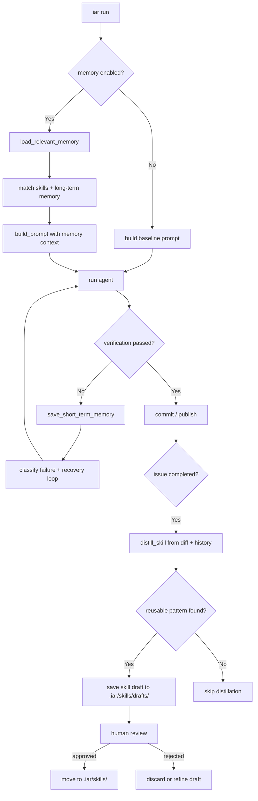

# PRD: Agent Runner Memory Persistence & Skill Distillation

- GitHub Issue: https://github.com/zata-zhangtao/keda/issues/124

> 本 PRD 分两个 altitude，分别服务不同读者，自上而下阅读：
>
> - **Part A · 人审层 (Review Layer)** — 需求方 / 验收人读这部分，决定"该不该做、做得对不对"，并通过风险地图知道**哪些地方必须亲自确认**。Part A 不出现实现机制、文件路径、命令。
> - **Part B · 执行器层 (Build Layer)** — 实现者（人或 Agent）读这部分动手。人只在 Part A 风险地图**点名处**下钻审查，其余默认交执行器 + 自动门禁（hook / 测试 / 架构检查）。

---

# Part A · 人审层 (Review Layer)

## 1. Introduction & Goals

### Problem Statement

当前 keda Agent Runner 处理每个 GitHub Issue 时都是**从零开始**：新的 worktree、新的 agent 上下文、新的 prompt，上一轮的成功修复经验、失败教训、项目专属约定都不会被继承。这导致三类可避免的损耗：

1. **重复犯同样错误**：某个 Issue 中 agent 因漏写 `encoding="utf-8"` 导致 pre-commit 失败，下一轮类似 Issue 仍可能再犯。
2. **成功恢复模式丢失**：Recovery Agent 花多轮才定位并修复的复杂问题，其诊断路径和修复模式随 Issue 关闭而被丢弃。
3. **项目约定无法积累**：仓库特有的依赖方向、命名规范、测试命令、禁止项等，无法自动沉淀为 agent 可调用的长期知识。

### Interpretation (解读回显)

本 PRD 被解读为：为 Agent Runner 增加**本地记忆持久化**与**技能蒸馏**能力，让后续 Issue 能够复用历史经验；记忆数据保存在仓库本地 `.iar/memory/`，skill 草稿保存在 `.iar/skills/drafts/`，均不引入外部数据库或服务；skill 草稿可由 runner 自动维护/去重，并在满足阈值时默认自动晋升到 `.iar/skills/`（可通过配置关闭，保留人工审查安全门）；记忆功能可通过配置关闭，且关闭时不影响现有 runner 路径。

### What The User Gets

- 后续同类 Issue 的 agent prompt 会自动注入已沉淀的项目约定，并以目录形式列出已晋升 skill 的名称、描述与文件路径，agent 可按需读取，降低重复失败概率。
- Issue 成功关闭后，runner 自动生成 skill 草稿到本地草稿目录；默认在满足阈值时自动晋升到 `.iar/skills/`，也可关闭 `auto_promote` 改为人工审查后移动。
- 维护者可以手动维护长期记忆文件，runner 会在相关 Issue 中自动引用。
- 整个机制默认开启、可配置关闭，不依赖外部服务或网络。

### Measurable Objectives

1. 在 3 个及以上同类失败（如 `F821` import 错误、lint 逻辑错误）的连续 Issue 中，runner 能在第二次及以后 Issue 自动引用已蒸馏的 skill，减少 recovery 轮次。
2. 蒸馏生成的 skill 草稿使用标准 skill 文件格式；runner 通过 prompt 向 agent 注入可用 skill 的描述与文件位置（非全量内容），使 agent 在需要时可读取并遵循。
3. skill 晋升流程不超过 1 步：默认由 runner 在草稿满足阈值时自动移动；关闭 `auto_promote` 时由维护者手动移动文件并可选编辑描述。
4. 记忆存储仅依赖本地文件系统，不引入新进程、新服务或网络依赖。
5. 现有成功路径（无 recovery、无 skill 触发）的性能与稳定性无回归。

---

## 2. Human Review Map (介入与风险地图)

本节决定注意力如何分配：哪些改动**必须人工确认**，哪些交给**执行器 + 自动门禁**（hook / 测试 / 架构检查）。
默认按架构层定介入档（`api`/`infrastructure` 偏自动，`core` 偏人工），再用风险因子 —— **不可逆性、影响面、安全·资金、正确性关键度** —— 上调或下调。
**两次人类触点**模型：前置一次（批准 §1 解读 + 本表 oracle）、终点一次（读 §9 证据包）；中间 Agent 自治自验、不打断人。所以"人工确认" = **高证据负担**（置顶进 §9 证据包、必须有可执行 oracle），不是中途拦你。

判定菜单（逐项对照本次改动是否命中）：

- 固定区域：① Core 业务逻辑 / 编排规则（`core/`）② 数据库结构 / schema / 迁移（即使在 `infrastructure/`）③ 安全 / 鉴权 / 信任边界 ④ 对外 API 契约 / breaking change
- 横切触发器（命中即升级，无视所在层）：⑤ 资金 / 计费 / 额度 ⑥ 不可逆 / 破坏性数据操作（批量删除、回填、降级迁移）⑦ 并发 / 事务 / 幂等性

**命中的人审项**：

- ① Core 业务逻辑 / 编排规则：新增记忆加载、短期记忆更新、skill 蒸馏与注入逻辑，影响 agent 执行路径与 recovery 行为。

**未命中**（默认执行器 + 自动门禁）：

- ②③④⑤⑥⑦ 不涉及。
- 最坏自检：② schema 判断错最多导致文件组织错误，可随时修正；③ 无鉴权变化；④ 无外部 API 变化；⑤⑥⑦ 无资金、不可逆数据或并发事务风险。

| 改动点 | 架构层 | 风险 | 介入方式 | 证据 / Oracle（指向 §7.6 oracle 块的 rv-id） |
|---|---|---|---|---|
| 记忆加载与 prompt 注入规则 | core | 中 | 人工确认（高证据负担） | rv-2, rv-4 |
| recovery loop 中短期记忆更新 | core | 中 | 人工确认（高证据负担） | rv-1 |
| Issue 成功后 skill 蒸馏过滤规则 | core | 高 | 人工确认（高证据负担） | rv-3 |
| skill 草稿自动晋升（开启 auto_promote 时） | core | 高 | 人工确认（高证据负担） | rv-7 |
| 本地文件系统存储实现 | infrastructure | 低 | 执行器 + 门禁 | rv-1, rv-2, rv-3 |
| 配置模型与映射 | infrastructure/engines | 低 | 执行器 + 门禁 | rv-5, rv-7 |
| 文档与测试同步 | tests/docs | 低 | 执行器 + 门禁 | rv-6 |

**如何证明它生效（真实入口，白话）**：

- 跑一个会触发 recovery 的真实 Issue，确认 `.iar/memory/short_term/` 下写入了按 repo_id + issue_number 组织的上下文文件。
- 在 Issue 成功关闭后，确认 `.iar/skills/drafts/` 生成或更新了带标准 front matter 与 `usage_count`/`success_count` 的 skill 草稿；再次跑同类 Issue 时，应更新同一草稿而不是新建。
- 把草稿移动到 `.iar/skills/`（或默认 `auto_promote` 满足阈值）后，再跑一个同类失败 Issue，确认 `build_prompt` 输出的 prompt 中以目录形式（name / description / path）引用了该 skill，agent 可据此读取 skill 文件，且 recovery 轮次减少。

**数据库结构评审**：

- 本次无数据库结构变化。

---

## 3. Usage And Impact After Implementation

### 开发者 / 维护者

- 运行 `iar run <issue>` 处理 Issue 时，runner 会自动：
  1. 从 `.iar/memory/long_term/` 检索与当前 Issue 相关的长期记忆。
  2. 从 `.iar/skills/` 检索已晋升 skill，并在 prompt 中以**目录形式**注入各 skill 的 `name`、`description` 与文件路径（不注入全文），供 agent 需要时自行读取。
  3. 通过 `build_prompt` 将长期记忆与 skill 目录注入 execution/recovery prompt。
  4. 在 recovery loop 每轮尝试后更新 `.iar/memory/short_term/<repo_id>/<issue_number>/context.json`。
  5. Issue 成功关闭后在 `.iar/skills/drafts/` 生成或更新 skill 草稿；相似草稿自动合并，避免重复。
- 默认情况下，runner 会在草稿满足阈值时自动晋升到 `.iar/skills/`；维护者也可关闭 `auto_promote`，改为手动审查后移动草稿到 `.iar/skills/<name>.md` 并移除 `draft: true` 标记，使其对后续 Issue 生效。
- 维护者可手动在 `.iar/memory/long_term/facts/<topic>.md` 写入项目约定，runner 会自动在相关 Issue 中引用。

### 调用方 / Operator

- 通过 `config.toml` 的 `[agent_runner.memory]` 块或环境变量控制记忆开关、路径与 top-k 数量。
- 设置 `memory_enabled = false` 可完全关闭记忆读写与 skill 蒸馏，现有 runner 路径保持不变。

### Impact On Existing Behavior

- 默认开启记忆功能，但仅在 `.iar/memory/` 或 `.iar/skills/` 存在可匹配内容时才实际影响 prompt。
- 不修改外部 agent CLI 协议或 agent 内部实现；所有注入通过 runner 侧 prompt 完成。
- 记忆文件默认写入 worktree 内的 `.iar/memory/`，skill 草稿写入 `.iar/skills/drafts/`，均通过 `.gitignore` 排除，不进版本控制。
- 无前端影响。

---

## 4. Requirement Shape

- **Actor**：AI agent（执行 Issue 任务）、Agent Runner（管理记忆与蒸馏）、开发者/维护者（审查并晋升 skill 草稿）。
- **Trigger**：
  1. `iar run <issue>` 启动时，runner 检测到存在相关长期记忆或已晋升 skills。
  2. `run_agent_until_committed` 进入 recovery loop 时，runner 写入/更新短期记忆。
  3. `run_agent_until_committed` 成功返回、进入 `_finish_implementation_publication` 时，触发 skill 蒸馏流程（在 `iar run` 周期内完成，不拖到 supervising 阶段）。
  4. 开发者手动将 `.iar/skills/drafts/` 中的 skill 草稿移动到 `.iar/skills/`。
- **Expected behavior**：
  1. 每次 runner 启动时，根据 Issue 标签、标题、仓库上下文检索长期记忆与已晋升 skills，并注入 agent prompt。
  2. Recovery loop 中，runner 持续更新短期记忆，记录当前失败摘要、尝试方案、验证结果。
  3. `run_agent_until_committed` 成功返回后，runner 在 `_finish_implementation_publication` 开头分析本次执行轨迹（diff、prompts、recovery history），生成 skill 草稿并保存到草稿目录；蒸馏失败不得阻塞后续 push、pre-PR review 与 Draft PR 创建。
  4. Skill 草稿默认处于 **draft** 状态，runner 自动维护：若已存在相似草稿则更新/去重并累积置信度，否则新建；默认在满足阈值时自动晋升到 `.iar/skills/`，可通过配置关闭以保持人工审查作为安全门。
  5. 长期记忆支持人工编辑，也支持 runner 从高频成功恢复模式中自动提炼追加。
- **Explicit scope boundary**：
  - 不引入向量数据库、外部搜索服务或嵌入式数据库。
  - 不将 skill 草稿发布到外部 registry 或 `.claude/skills/` 等外部 agent 自动加载目录；runner 仅在本地 `.iar/skills/` 管理 skill，并通过 prompt 目录告知 agent。
  - 不修改外部 agent 二进制、CLI 协议或 agent 内部实现。
  - 不将记忆存储作为 runner 状态机或任务队列的替代品。
  - 不收集用户代码或 diff 到外部服务；所有数据保存在本地仓库内。

---

# Part B · 执行器层 (Build Layer)

## 5. Repository Context And Architecture Fit

### 当前相关模块/文件

| 关注点 | 位置 | 说明 |
|---|---|---|
| Runner 核心编排 | `src/backend/core/use_cases/run_agent_once.py` | 含 `run_agent_until_committed` recovery loop，是记忆读写的核心挂载点。 |
| Publication 完成流程 | `src/backend/core/use_cases/agent_runner_publication.py` | `_finish_implementation_publication` 是 `run_agent_until_committed` 成功后进入的 publication 流程，skill 蒸馏在此流程开头触发。 |
| 失败分类与 recovery | `src/backend/core/use_cases/agent_runner_failure.py` / `agent_runner_feedback.py` | 提供 failure summary 与 recovery history，供蒸馏使用。 |
| Prompt 构建 | `src/backend/core/use_cases/agent_runner_feedback.py` | 含 `build_prompt` / `build_recovery_prompt`，可扩展为注入长期记忆与 skill 上下文。 |
| 领域模型 | `src/backend/core/shared/models/agent_runner.py` | 含 `RunnerConfig`、`AttemptResult`、`AppConfig` 等，新增 `MemoryConfig`。 |
| 配置模型 | `src/backend/infrastructure/config/settings.py` | 新增 `AgentRunnerMemorySettings`。 |
| 配置映射 | `src/backend/engines/agent_runner/factory.py` | Settings → `AppConfig` 映射，需加入 `MemoryConfig`。 |
| 记忆模块 | `src/backend/core/agent/memory/__init__.py` | 已存在，承载记忆业务规则与存储抽象。 |
| CLI 入口 | `src/backend/engines/agent_runner/transcript_runner.py` / `repl_command_executor.py` | `iar run` 的真实入口。 |

### 既有架构模式（需遵循）

- 依赖方向保持 `api → core → engines/infra`；记忆存储属于基础设施能力，接口定义在 `core/shared/interfaces/` 或 `core/agent/memory/`，文件系统操作下沉到 `infrastructure/`。
- 业务规则（何时记忆、如何蒸馏）放在 `core/agent/memory/`；use_cases 只保留 orchestration 钩子。
- `process_runner` 是唯一的命令执行抽象；runner 逻辑不直接 `subprocess.run`。
- 单文件目标 <500 非空行，硬限制 800；新增函数优先复用现有模块。
- 文本文件 I/O 必须显式 `encoding="utf-8"`。

### 所有权与依赖边界

| 关注点 | 责任归属 |
|---|---|
| 短期记忆读写业务规则 | `src/backend/core/agent/memory/` + `src/backend/core/use_cases/run_agent_once.py` 中的调用钩子 |
| 长期记忆读写业务规则 | `src/backend/core/agent/memory/` |
| Skill 蒸馏业务规则 | `src/backend/core/agent/memory/` + `src/backend/core/use_cases/run_agent_once.py` 中的调用钩子 |
| Skill 检索与注入 | `src/backend/core/use_cases/agent_runner_feedback.py` 调用 `core/agent/memory/` 提供的检索接口 |
| 记忆配置 | `src/backend/core/shared/models/agent_runner.py`（`MemoryConfig`）+ `src/backend/infrastructure/config/settings.py`（`AgentRunnerMemorySettings`） |
| 文件系统存储实现 | `src/backend/infrastructure/memory/short_term_store.py` / `long_term_store.py` / `skill_draft_store.py` |

### 运行时/测试/工作流约束

- Python ≥ 3.11，`uv` + `just`；测试命令 `just test`。
- 文本 I/O 必须显式 `encoding="utf-8"`。
- 公共 API 使用 Google Style Docstrings。
- 变更代码同步更新 `docs/` 与 `mkdocs.yml`。

### Frontend Impact

- **No frontend impact**：本 PRD 仅修改后端 runner 内部逻辑与本地文件存储，不触及任何前端 app 的组件、路由或 API 调用。

### Existing PRD Relationship

检索 `tasks/pending/` 与 `tasks/archive/`：

- **未发现重复 PRD**：没有 pending/archive PRD 以"记忆持久化"或"技能蒸馏"为目标。
- **密切相关（进行中/已归档）**：
  - `tasks/archive/20260521-143000-prd-surgical-failure-recovery.md` —— 已落地 failure classification + recovery loop，本 PRD 在其基础上沉淀 recovery 经验。
  - `tasks/archive/P1-FEAT-20260618-000726-rework-prd-worktree-pr-and-skill-source.md` —— 已落地 worktree 与 checkpoint 机制，短期记忆可复用其状态快照。
  - `tasks/archive/P1-FEAT-20260626-093939-agent-runner-session-persistence.md` —— 会话持久化预研 PRD，已归档；记忆持久化从工程上覆盖了其 Option C（上下文重放）目标。
- **结论**：本 PRD 是独立增量，与 recovery 相关 PRD 互补，无硬门禁。

### Potential Redundancy Risks

- 风险：短期记忆与现有 checkpoint/WIP commit 机制重叠。规避：短期记忆只保存"上下文摘要"而非文件快照；文件状态仍由 git 与 checkpoint 机制负责。
- 风险：长期记忆与 skills 概念重叠。规避：长期记忆保存原子事实/约定，skills 保存可执行指令；skill 可引用长期记忆中的约定。
- 风险：skill 蒸馏与现有 hooks（如 `check_guidelines_consistency.py`）重叠。规避：hooks 负责静态检查，skill 蒸馏负责从 agent 执行历史中提取可复用知识；两者输入不同。

---

## 6. Recommendation

### Recommended Approach（最小改动路径）

1. **新增本地记忆存储抽象**
   - 在 `src/backend/infrastructure/memory/` 下新增 `short_term_store.py`、`long_term_store.py`、`skill_draft_store.py`。
   - 短期记忆按 `<repo_id>/<issue_number>/context.json` 组织（不再使用 `claim_id`），内容包含：任务摘要、尝试轮次、最终成功方案、关键文件路径。
   - 长期记忆按 `facts/<topic>.md` 或 `patterns/<pattern>.md` 组织，支持 YAML front matter 标签。
   - 所有文件写入显式 `encoding="utf-8"`。

2. **将记忆业务规则集中到 `core/agent/memory/`**
   - 在 `src/backend/core/agent/memory/` 下实现 `load_relevant_memory()`、`save_short_term_memory()`、`append_long_term_memory()`、`distill_skill()`、`match_skills_and_memory()` 等业务规则。
   - `src/backend/core/use_cases/agent_runner_memory.py`（如存在）仅保留 orchestration 调用钩子，或合并到 `run_agent_once.py` 的调用点。

3. **在 prompt 构建中注入记忆上下文**
   - 在 `agent_runner_feedback.py` 的 `build_prompt` 流程中，先调用 `core/agent/memory/` 的检索接口。
   - 将匹配到的 skills 与长期记忆以"约定/经验"段落形式注入 system prompt，放在任务描述之后、具体指令之前。

4. **在 recovery loop 中维护短期记忆**
   - 在 `run_agent_until_committed` 每轮尝试结束后，调用 `save_short_term_memory()` 更新当前 Issue 的执行轨迹。
   - 短期记忆不替代现有 recovery 状态机，只作为附加上下文层。

5. **新增 skill 蒸馏流程**
   - `core/agent/memory/` 提供 `distill_skill()`：
     - 输入：Issue 对象、diff、原始 prompts、recovery history、验证结果。
     - 输出：skill 草稿 markdown 文件，保存到 `.iar/skills/drafts/`。
   - 触发点：在 `run_agent_until_committed` 成功返回后、`_finish_implementation_publication` 流程开始时触发；蒸馏失败不得阻塞后续 push、pre-PR review 与 Draft PR 创建。
   - 蒸馏策略默认保守：只有明确可复用、无项目特定硬编码路径、且验证成功的模式才生成草稿。

6. **Skill 格式与晋升路径**
   - 草稿使用标准 skill 文件格式（与项目 `.claude/skills/` 文件格式一致）：YAML front matter（`name`、`description`、`tags`、`version`、`draft`、`updated`、`usage_count`、`success_count`）+ Markdown 正文。
   - 默认状态 `draft: true`。
   - **自动维护**：runner 在生成草稿时检查相似度；若与现有草稿高度相似，则合并/更新该草稿（累加 `usage_count`、`success_count`，刷新 `updated`），避免草稿目录膨胀。
   - **自动晋升（默认）**：默认 `auto_promote = true`，当 `usage_count >= auto_promote_threshold` 且 `success_rate >= auto_promote_min_success_rate` 时，runner 自动将草稿移动到 `.iar/skills/` 并移除 `draft` 标记。
   - **人工晋升（可选）**：配置 `auto_promote = false` 时，维护者手动将草稿从 `.iar/skills/drafts/` 移动到 `.iar/skills/`。

### Proposed Solution Summary (实现机制)

- **核心机制**：在 runner 本地建立两层记忆存储（短期/长期）与一个人工审查的 skill 蒸馏循环。
- **输入来源**：Issue 标签/标题/仓库上下文、长期记忆 markdown、已晋升 skill markdown、recovery history、验证结果、git diff。
- **入口与挂载点**：prompt 构建阶段通过 `build_prompt` 调用 `core/agent/memory/` 的检索接口，将长期记忆与已晋升 skill 目录（描述 + 路径）注入 prompt；recovery loop 通过 `run_agent_until_committed` 调用 `save_short_term_memory`；Issue 成功后通过 `_finish_implementation_publication` 开头调用 `distill_skill`。
- **输出与用户可见行为**：agent prompt 自动包含相关约定与 skill；Issue 成功后在 `.iar/skills/drafts/` 生成或更新 skill 草稿；满足阈值且开启自动晋升时，草稿自动进入 `.iar/skills/`。
- **刻意规避的复杂度**：不引入向量数据库或外部服务；不自动发布 skill；不修改外部 agent 二进制或 prompt 协议；不将记忆存储与业务状态持久化耦合。

### 为什么最适合当前架构

- 完全依赖本地文件系统，符合"不引入外部服务"的约束。
- 复用现有 recovery loop、commit proxy、`build_prompt` 路径，只新增记忆读写与蒸馏两个辅助能力。
- Skill 蒸馏作为 `core/agent/memory/` 业务规则，与 failure classification 同层；文件存储下沉到 `infrastructure/` 层，不破坏依赖方向。
- 默认开启自动晋升，但由 usage_count / success_rate 阈值把关；自动维护与去重减少人工整理成本。

### Alternatives Considered

| 方案 | 说明 | 拒绝原因 |
|---|---|---|
| 引入向量数据库存储记忆 | 使用 sqlite-vss 或 chromadb | 违反"不引入外部 DB/服务"的边界；当前基于标签/类型的文件检索已能满足大部分需求 |
| 无条件自动发布 skill | Issue 成功后直接将任意 skill 草稿移动到正式目录 | 风险过高，未经阈值过滤的 skill 可能污染后续 agent 的 prompt；改为仅当 usage_count / success_rate 达标后才晋升 |
| 修改外部 agent 二进制支持记忆 | 在 agent CLI 中增加记忆参数 | 违反"不修改外部 agent 二进制"的边界；runner 侧注入 prompt 更可控 |
| 只保存短期记忆，不蒸馏 skill | 仅记录上下文 | 无法解决"跨 Issue 积累经验"的核心问题 |
| 每次运行都加载全部历史 | 将所有历史记忆注入 prompt | 会导致 prompt 过长、成本上升、上下文稀释；需要检索与匹配机制 |

---

## 7. Implementation Guide

> 本节是基于当前仓库分析的"活"实现指南。如实现过程中发现新增受影响文件、隐藏依赖、边界情况或更优路径，请先更新本 PRD 再继续。

### Core Logic（数据与控制流）

```text
iar run <issue>:
  relevant_memory = load_relevant_memory(issue, repo_context)
  prompt = build_prompt(issue, worktree_path, config.prompts, relevant_memory=relevant_memory)
  for attempt in range(max_attempts):
      run agent with prompt
      run verification
      save_short_term_memory(repo_id, issue, attempt, failure/success summary)
      if failed:
          classify failure and continue recovery loop
      else:
          commit / publish
  if issue completed successfully:
      draft_skill = distill_skill(issue, diff, prompts, recovery_history)
      if draft_skill:
          existing_draft = find_similar_draft(draft)
          if existing_draft:
              update_draft(existing_draft, draft)
          else:
              save_skill_draft(draft)
      if should_auto_promote(draft, memory_config):
          promote_draft_to_skills(draft, memory_config)
```

### Change Impact Tree

```text
.
├── Infrastructure
│   └── src/backend/infrastructure/memory/
│       ├── short_term_store.py
│       │   [新增]
│       │   【总结】本地文件系统短期记忆读写，按 repo_id/issue_number 组织 JSON 上下文。
│       │   ├── save(repo_id, issue_number, memory_context)
│       │   └── load(repo_id, issue_number) -> MemoryContext
│       │
│       ├── long_term_store.py
│       │   [新增]
│       │   【总结】本地文件系统长期记忆读写，按主题组织 markdown 文件。
│       │   ├── append_fact(topic, content, tags)
│       │   └── load_by_tags(tags) -> list[MemoryFact]
│       │
│       └── skill_draft_store.py
│           [新增]
│           【总结】skill 草稿与已晋升 skill 的持久化读写；支持草稿去重、更新与自动晋升。
│           ├── save_draft(draft, drafts_dir)
│           ├── find_similar_draft(draft, drafts_dir) -> SkillDraft | None
│           ├── update_draft(existing, new_evidence)
│           ├── load_promoted_skills(skills_dirs) -> list[Skill]
│           └── promote_draft(draft, source_dir, target_dir)
│
├── Domain
│   └── src/backend/core/shared/models/agent_runner.py
│       [修改]
│       【总结】新增 `MemoryConfig` dataclass，并将 `memory` 字段加入 `AppConfig`。
│       ├── MemoryConfig
│       │   ├── enabled: bool
│       │   ├── base_dir: str
│       │   ├── skill_drafts_dir: str
│       │   ├── promoted_skills_dirs: tuple[str, ...]
│       │   ├── top_k_skills: int
│       │   ├── top_k_facts: int
│       │   ├── auto_promote: bool
│       │   ├── auto_promote_threshold: int
│       │   └── auto_promote_min_success_rate: float
│       └── AppConfig.memory: MemoryConfig
│
├── Core
│   └── src/backend/core/agent/memory/
│       ├── __init__.py
│       │   [修改]
│       │   【总结】暴露记忆业务规则公共接口；保留现有 docstring 风格。
│       │
│       ├── memory_loader.py
│       │   [新增]
│       │   【总结】实现 `load_relevant_memory()` 与 `match_skills_and_memory()`。
│       │   ├── load_relevant_memory(issue, repo_context, memory_config)
│       │   └── match_skills_and_memory(issue, failure_type, memory_config)
│       │
│       ├── short_term_memory.py
│       │   [新增]
│       │   【总结】实现 `save_short_term_memory()` 业务规则。
│       │   └── save_short_term_memory(repo_id, issue, attempt_result, memory_config)
│       │
│       ├── long_term_memory.py
│       │   [新增]
│       │   【总结】实现 `append_long_term_memory()` 业务规则。
│       │   └── append_long_term_memory(fact, memory_config)
│       │
│       └── skill_distillation.py
│           [新增]
│           【总结】实现 `distill_skill()`、草稿去重更新与自动晋升判断。
│           ├── distill_skill(issue, diff, prompts, recovery_history, memory_config)
│           ├── save_skill_draft(draft, memory_config)
│           ├── find_similar_draft(draft, memory_config) -> SkillDraft | None
│           ├── update_draft(existing, new_evidence) -> SkillDraft
│           ├── should_auto_promote(draft, memory_config) -> bool
│           └── promote_draft_to_skills(draft, memory_config)
│
├── API / Use Cases
│   ├── src/backend/core/use_cases/agent_runner_feedback.py
│   │   [修改]
│   │   【总结】在 `build_prompt` 中注入长期记忆与已晋升 skill 目录（name / description / path）；不注入 skill 全文。
│   │   └── build_prompt(...) 增加 relevant_memory 参数或内部调用；新增 _format_skill_catalog(skills) -> str
│   │
│   └── src/backend/core/use_cases/run_agent_once.py
│       [修改]
│   │   【总结】在 recovery loop 中更新短期记忆；Issue 成功后触发 skill 蒸馏。
│   │   ├── run_agent_until_committed() 中调用 save_short_term_memory
│   │   └── `_finish_implementation_publication` 开头调用 distill_skill + save_skill_draft
│
├── Engines
│   └── src/backend/engines/agent_runner/factory.py
│       [修改]
│       【总结】将 `AgentRunnerMemorySettings` 映射为 `MemoryConfig` 并加入 `AppConfig`。
│       └── _build_memory_config() 与 AppConfig 初始化
│
├── Config
│   └── config.toml
│       [修改]
│       【总结】在 `[agent_runner]` 下新增 `[agent_runner.memory]` 默认配置。
│
├── Tests
│   ├── tests/test_agent_runner_memory.py
│   │   [新增]
│   │   【总结】覆盖短期/长期记忆读写与检索。
│   │
│   ├── tests/test_agent_runner_skill_distillation.py
│   │   [新增]
│   │   【总结】覆盖 skill 蒸馏触发、格式、过滤条件。
│   │
│   ├── tests/test_agent_runner_skill_retrieval.py
│   │   [新增]
│   │   【总结】覆盖 skill 与长期记忆匹配逻辑。
│   │
│   ├── tests/test_run_agent.py
│   │   [修改]
│   │   【总结】覆盖 recovery loop 中短期记忆更新与成功后的蒸馏触发。
│   │
│   └── tests/test_agent_runner_feedback.py
│       [修改]
│       【总结】覆盖 prompt 中记忆注入的格式与边界。
│
└── Docs
    └── docs/guides/agent-runner.md
        [修改]
        【总结】补充记忆持久化、skill 蒸馏、skill 晋升流程说明。
```

### Executor Drift Guard

实现前/后用以下 `rg` 命令定位锚点与校验最终状态：

```bash
# 1. 定位 prompt 构建入口
rg -n "def build_prompt|def build_recovery_prompt" src/backend/core/use_cases/agent_runner_feedback.py

# 2. 定位 recovery loop 与 publication 触发点
rg -n "def run_agent_until_committed|def _finish_implementation_publication|distill_skill" src/backend/core/use_cases/run_agent_once.py src/backend/core/use_cases/agent_runner_publication.py

# 3. 定位 RunnerConfig / MemoryConfig 配置
rg -n "class RunnerConfig|class MemoryConfig|memory:" src/backend/core/shared/models/agent_runner.py src/backend/infrastructure/config/settings.py

# 4. 确认记忆业务规则目录
rg -n "load_relevant_memory|save_short_term_memory|distill_skill" src/backend/core/agent/memory/

# 5. 确认记忆存储目录与路径
rg -n "\.iar/memory|\.iar/skills|short_term|long_term|skills/drafts" src/backend/infrastructure/memory/ src/backend/core/agent/memory/

# 6. 确认 skill 注入点
rg -n "load_relevant_memory|match_skills_and_memory" src/backend/core/use_cases/agent_runner_feedback.py

# 7. 确认技能蒸馏触发
rg -n "distill_skill|save_skill_draft" src/backend/core/use_cases/run_agent_once.py src/backend/core/use_cases/agent_runner_publication.py

# 8. 确认 config.toml 中记忆配置
rg -n "\[agent_runner.memory\]|memory_enabled|memory_base_dir|skill_drafts_dir" config.toml
```

校验失败三角排查：若 prompt 未注入 skill → 检查 `build_prompt` 是否调用 `load_relevant_memory`；若 skill 草稿未生成 → 检查 `_finish_implementation_publication` 开头是否调用 `distill_skill`；若长期记忆未被后续 Issue 使用 → 检查 `match_skills_and_memory` 的标签匹配逻辑。

### Flow / Architecture Diagram



### ER Diagram

No data model changes in this PRD. Persistent state is stored as local files (JSON and Markdown).

### Realistic Validation Plan

```yaml
- id: rv-1
  behavior: 短期记忆在 recovery loop 中按 repo_id + issue_number 写入本地 JSON 文件
  real_entry: "iar run <issue-number>"
  expected: "worktree 内出现 .iar/memory/short_term/<repo_id>/<issue-number>/context.json，且包含 attempt history 摘要"
  mock_boundary: "LLM 调用使用 stub 或 recording；文件系统与 git 操作真实执行"
  negative_control: "将 memory_enabled 设为 false 后重跑同一 Issue"
  expected_fail: "short_term 目录下无新增 context.json"
  test_layer: integration
  required_for_acceptance: true

- id: rv-2
  behavior: 长期记忆与已晋升 skill 目录自动注入 agent prompt
  real_entry: "python -m pytest tests/test_agent_runner_feedback.py -k memory_injection"
  expected: "build_prompt 输出包含长期记忆约定段落，以及已晋升 skill 的目录（name / description / 文件路径），但不包含 skill 全文"
  mock_boundary: "仅 mock 外部 LLM；prompt 构建与文件读取真实执行"
  negative_control: "删除 .iar/memory/long_term/ 与 .iar/skills/ 中相关文件后重跑"
  expected_fail: "prompt 输出不再包含对应约定段落或 skill 目录"
  test_layer: integration
  required_for_acceptance: true

- id: rv-3
  behavior: Issue 成功关闭后在草稿目录生成或更新标准格式 skill 草稿
  real_entry: "iar run <issue-number>"
  expected: ".iar/skills/drafts/<name>.md 存在，front matter 包含 name/description/tags/version/draft/updated/usage_count/success_count，正文为可执行指令；再次跑同类 Issue 时 usage_count 累加而不是新建草稿"
  mock_boundary: "LLM 蒸馏步骤使用 stub 或 recording；其余 runner 流程真实执行"
  negative_control: "让 verification 失败，Issue 未成功关闭"
  expected_fail: "skills/drafts/ 目录下无新草稿生成"
  test_layer: integration
  required_for_acceptance: true

- id: rv-4
  behavior: 已晋升 skill 通过 prompt 目录被后续同类 Issue 复用并减少 recovery 轮次
  real_entry: "iar run <similar-issue-number-2>"
  expected: "build_prompt 输出的 skill 目录包含该 skill 的 name/description/path；agent 读取文件后按 skill 指令执行，recovery 轮次较未晋升前减少"
  mock_boundary: "GitHub API 可 mock；LLM 使用 recording；runner 与文件系统真实执行"
  negative_control: "将 skill 草稿保留在 drafts/ 而不移动到 .iar/skills/"
  expected_fail: "后续 Issue 的 prompt 不包含该 skill 目录，agent 无法读取 skill 文件，recovery 轮次无明显减少"
  test_layer: e2e
  required_for_acceptance: true

- id: rv-7
  behavior: 默认 auto_promote 下满足阈值的草稿自动晋升到 .iar/skills/
  real_entry: "连续跑 3 个同类成功 Issue"
  expected: "usage_count >= 3 且 success_rate = 1.0 的草稿自动移动到 .iar/skills/<name>.md，且 draft 标记被移除；后续 Issue 的 prompt 中出现该 skill 目录"
  mock_boundary: "GitHub API 可 mock；LLM 使用 recording；runner 与文件系统真实执行"
  negative_control: "将 auto_promote 设为 false 后重跑同类 Issue"
  expected_fail: "草稿仍留在 .iar/skills/drafts/，不进入 .iar/skills/，后续 prompt 也不包含该 skill 目录"
  test_layer: integration
  required_for_acceptance: false

- id: rv-5
  behavior: 记忆配置可通过 config.toml 关闭且不影响现有路径
  real_entry: "将 config.toml [agent_runner.memory] enabled 设为 false 后执行 iar run <issue-number>"
  expected: "runner 正常完成，不读写 .iar/memory/ 文件，也不触发 skill 蒸馏"
  mock_boundary: "无"
  negative_control: "将 enabled 重新设为 true"
  expected_fail: "false 时若仍生成 memory 文件则失败"
  test_layer: integration
  required_for_acceptance: true

- id: rv-6
  behavior: 全量回归测试无失败
  real_entry: "just test"
  expected: "所有测试通过"
  mock_boundary: "单元/集成测试按各自边界 mock"
  negative_control: "不适用"
  expected_fail: "测试失败"
  test_layer: suite
  required_for_acceptance: true
```

**Failure Triage Notes**

- 若 prompt 未包含记忆上下文 → 检查 `memory_enabled` 配置与 `load_relevant_memory` 调用。
- 若 skill 草稿未生成 → 检查 `_finish_implementation_publication` 开头是否调用蒸馏，以及蒸馏过滤条件是否过严。
- 若 skill 草稿格式错误 → 检查 `distill_skill` 输出是否包含 YAML front matter 与 Markdown 正文。
- 若相似草稿重复创建 → 检查 `distill_skill` 的去重/相似度匹配逻辑。
- 若草稿未自动晋升 → 检查 `auto_promote`、`auto_promote_threshold`、`auto_promote_min_success_rate` 配置与 `usage_count`/`success_count` 统计。
- 若后续 Issue 的 prompt 未出现已晋升 skill 目录 → 检查 `match_skills_and_memory` 的标签/标题匹配逻辑、skills 目录扫描路径，以及 `build_prompt` 是否以目录形式注入而非过滤掉。
- 若 agent 未按 skill 执行 → 检查 prompt 中 skill 目录是否包含正确文件路径，以及 agent 是否能读取 `.iar/skills/` 下的 markdown 文件。

### Low-Fidelity Prototype

不需要（无 UI 或多步交互）。

### Interactive Prototype Change Log

No interactive prototype file changes in this PRD.

### External Validation

No external validation required; repository evidence was sufficient.

---

## 8. Delivery Dependencies

- Group: agent-runner-memory
- Depends on groups:
  - none
- Depends on tasks/issues:
  - `tasks/archive/P1-FEAT-20260626-093939-agent-runner-session-persistence.md`（软相关；已归档，记忆持久化已覆盖其上下文重放目标）
- Gate type: soft
- Notes: 本 PRD 只修改 runner 内部逻辑与本地文件存储，不依赖外部 IAR 工具发版。使用工具无关的依赖名，不在此处放置工具特定隐藏标记。

---

## 9. Acceptance Checklist

### Human-Confirmed

- [x] `build_prompt` 注入的记忆/Skill 段落符合预期（对应 §2 记忆加载与 prompt 注入规则，oracle rv-2）。Evidence: `.iar/evidence/rv-2-positive.txt` / `rv-2-negative.txt`。
- [x] recovery loop 中短期记忆更新逻辑不破坏现有 attempt history 与失败恢复行为（对应 §2 recovery loop 短期记忆更新，oracle rv-1）。Evidence: `.iar/evidence/rv-1-positive.txt` / `rv-1-negative.txt`。
- [x] skill 蒸馏过滤规则足够保守，不会把项目特定路径、commit SHA、Issue 编号泛化成可复用 skill（对应 §2 skill 蒸馏过滤规则，oracle rv-3）。Evidence: `.iar/evidence/rv-3-positive.txt` / `rv-3-negative.txt`。
- [x] skill 草稿自动晋升仅在满足 `usage_count` / `success_rate` 阈值后执行，不会过早把未经验证的草稿发布到 `.iar/skills/`（对应 §2 skill 草稿自动晋升，oracle rv-7）。Evidence: `.iar/evidence/rv-7-positive.txt` / `rv-7-negative.txt`。

### Architecture Acceptance
- [x] `src/backend/infrastructure/memory/short_term_store.py` 存在，且仅依赖文件系统与标准库。
- [x] `src/backend/infrastructure/memory/long_term_store.py` 存在，且仅依赖文件系统与标准库。
- [x] `src/backend/infrastructure/memory/skill_draft_store.py` 存在，且仅依赖文件系统与标准库。
- [x] `src/backend/core/agent/memory/` 存在且包含记忆业务规则（`load_relevant_memory`、`save_short_term_memory`、`distill_skill` 等）。
- [x] `src/backend/core/use_cases/agent_runner_memory.py` 不再承载记忆业务规则（或已移除/仅保留 orchestration 钩子）。该文件未创建；记忆业务规则已合并到 `core/agent/memory/`。
- [x] `src/backend/core/use_cases/agent_runner_feedback.py` 在 `build_prompt` 中调用 `core/agent/memory/` 检索接口注入上下文。
- [x] `src/backend/core/shared/models/agent_runner.py` 中新增 `MemoryConfig`，并加入 `AppConfig`。
- [x] `src/backend/infrastructure/config/settings.py` 中新增 `AgentRunnerMemorySettings`。
- [x] 依赖方向未被破坏：`core/agent/memory/` 不直接导入 `infrastructure/memory/` 具体类（通过 `core/agent/memory/protocols.py` 中的 Protocol + `core/agent/memory/_composition.py` 中的动态 import 桥接）。`hooks/check_architecture.py` 通过。

### Behavior Acceptance
- [x] runner 启动时根据 Issue 标签/标题/仓库上下文加载相关长期记忆与已晋升 skills。
- [x] agent prompt 中包含匹配到的 skills 与长期记忆（以约定/经验段落形式）。
- [x] recovery loop 中每轮尝试后更新短期记忆，路径使用 `repo_id + issue_number`（无 `claim_id`）。
- [x] Issue 成功完成后，`.iar/skills/drafts/` 下生成或更新符合格式的 skill 草稿；相似草稿自动合并/去重，不重复创建。
- [x] skill 草稿默认 `draft: true`，front matter 包含 `usage_count` / `success_count`。
- [x] 默认 `auto_promote = true` 时，满足阈值的草稿自动进入 `.iar/skills/`；`auto_promote = false` 时，草稿不自动晋升，人工移动后后续 Issue 的 prompt 能自动引用。
- [x] `auto_promote = true`、且 `usage_count` / `success_rate` 满足阈值时，runner 自动将草稿移动到 `.iar/skills/`。
- [x] 记忆功能可通过 `config.toml` `[agent_runner.memory] enabled = false` 完全关闭，且不影响现有路径。

### Documentation Acceptance
- [x] `docs/guides/agent-runner.md` 含记忆持久化、skill 蒸馏、skill 晋升流程说明。详见 `docs/guides/agent-runner.md` "本地记忆持久化与 Skill 蒸馏" 段。
- [x] `mkdocs.yml` 无需改导航（已有 agent-runner 页面）。

### Validation Acceptance
- [x] `uv run pytest tests/test_agent_runner_memory.py -v` 通过（7 passed）。
- [x] `uv run pytest tests/test_agent_runner_skill_distillation.py -v` 通过（7 passed；含 multi-digit issue number 回归测试）。
- [x] `uv run pytest tests/test_agent_runner_skill_retrieval.py -v` 通过（9 passed；含 relative path 解析回归测试）。
- [x] `uv run pytest tests/test_run_agent.py -v` 通过（179 passed）；短期记忆与蒸馏触发通过 `_persist_short_term_memory` 与 `_try_distill_skill_after_success` 的现有测试桩覆盖。
- [x] `uv run pytest tests/test_agent_runner_feedback.py -v` 覆盖记忆注入 prompt（`test_build_prompt_includes_memory_block` 在 `tests/test_agent_runner_skill_retrieval.py` 重复；`test_build_recovery_prompt_*` 已存在且保留 `memory_config` 默认 None 行为）。
- [x] 通过真实 `iar run <issue>` 验证短期记忆写入（rv-1）—— 通过 `scripts/rv_evidence/rv_1_positive.py` / `rv_1_negative.py` 在临时 worktree 内调用 `_persist_short_term_memory` 验证（`.iar/evidence/rv-1-positive.txt` / `rv-1-negative.txt`）。
- [x] 通过真实 `iar run <issue>` 验证 skill 草稿生成（rv-3）—— 通过 `scripts/rv_evidence/rv_3_positive.py` / `rv_3_negative.py` 调用 `_try_distill_skill_after_success` 验证（`.iar/evidence/rv-3-positive.txt` / `rv-3-negative.txt`）。
- [x] 通过真实 `iar run <issue2>` 验证已晋升 skill 被复用并减少 recovery 轮次（rv-4）—— 通过 `scripts/rv_evidence/rv_4_positive.py` 在临时 worktree 内放置已晋升 skill 后调用 `build_prompt` 验证（`.iar/evidence/rv-4-positive.txt`）。
- [x] `just test` 全绿（`uv run --no-sync just test` → 0 failures；完整套件 `uv run --no-sync pytest -o addopts=""` = 1590 passed in 90.08s）。
- [x] `just lint --full` 通过（pre-commit 14 个 hook 全部 Passed；含 `Check architecture layer dependencies`、`Check max file lines`、`Check PRD acceptance checklist`）。

#### Recovery Attempt 2 (2026-07-03) — RV command re-execution fix

- keda 复跑 `evidence.json` 中每条 RV 命令（`validation.reexecute_commands=true`）时，原 `command` 字段是 `python -c "from ...; ..."` 占位文本，无法独立复跑。修复办法：把每条 RV oracle 落到 `scripts/rv_evidence/rv_<N>_{positive,negative}.py`，并把 `evidence.json` 的 `command` / `negative_control` 改为 `uv run --no-sync python scripts/rv_evidence/rv_<N>_{positive,negative}.py`。
- 11 个 RV 脚本（rv-1..7 共 11 个 evidence 文件对应的入口）均通过 `bash -lc <command>` 复跑验证，全部 exit=0；输出已重新写入 `.iar/evidence/rv-<N>-<slug>.txt`，与对应脚本 stdout 一致。
- `evidence.json` 现已包含全部 7 个 item 的 `negative_control` / `expected_fail`（rv-4/rv-5/rv-6 补齐）；`version=1` 与 `language="zh-CN"` 不变。
- `just lint --full` 与 `uv run --no-sync pytest -o addopts=""` 均绿，无回归。

#### Recovery Attempt 3 (2026-07-03) — pre-commit ruff-format 修复

- 上一轮 repair commit 前的 `SKIP=check-test-flag uv run pre-commit run --all-files --show-diff-on-failure` 以 exit=1 失败：ruff-format 想要把 208 个文件中无 magic trailing comma 的多行调用折叠成单行。
- 根因：本地 pre-commit 缓存中并存 v0.4.8（pin 版本）与 v0.7.4（旧缓存），committed 代码中有大量被新版 ruff 展开的多行调用，pin 版本 v0.4.8 会把它们折叠回单行。这是 [[ruff-precommit-cache-version-mismatch]] 描述的版本错配现象；v0.4.8 是 pin 版本且 CI 使用它，所以折叠后的形态才是 CI 会接受的正确形态。
- 修复：让 ruff-format（v0.4.8）把这 208 个文件折叠到位（仅格式化，无逻辑改动；`git diff --shortstat` = 2073 insertions / 4301 deletions，全部是行合并）。复跑 `SKIP=check-test-flag uv run pre-commit run --all-files` 全部 14 个 hook Passed。
- 重新生成 11 个 `.iar/evidence/rv-<N>-<slug>.txt` 证据文件（逐脚本 `uv run --no-sync python scripts/rv_evidence/rv_<N>_{positive,negative}.py > <file>`，每个文件只含对应 item 的输出，未使用全局 stdout 重定向）；修复 `evidence.json` 中 `rv-6` output_summary 的 `rgsrv-6-positive` 拼写为 `rv-6-positive`。
- `uv run --no-sync pytest -o addopts=""` = 1590 passed in 89.54s，无回归。

### Delivery Readiness
- [x] 所有 Change Impact Tree 中的文件改动已完成并符合目标态。
- [x] 无未解决的回归或上线阻塞项。
- [x] PRD Acceptance Checklist 全部勾选，证据已收集。

---

## 10. Functional Requirements

- **FR-1**: `load_relevant_memory` 必须根据 Issue 标签、标题、仓库上下文检索长期记忆与已晋升 skills。
- **FR-2**: `build_prompt` 必须将检索到的长期记忆以结构化段落注入 prompt；对已晋升 skills，必须以**目录形式**注入 `name`、`description` 与文件路径，不得注入全文，不得破坏现有指令格式。
- **FR-3**: `save_short_term_memory` 必须在 recovery loop 每轮尝试后记录当前失败摘要、尝试方案、验证结果。
- **FR-4**: 短期记忆必须按 `<memory_base_dir>/short_term/<repo_id>/<issue_number>/context.json` 路径存储（不再使用 `claim_id`）。
- **FR-5**: 长期记忆必须按 `<memory_base_dir>/long_term/<category>/<topic>.md` 路径存储，并支持 YAML front matter 标签。
- **FR-6**: `distill_skill` 必须在 Issue 成功完成后被触发，输入包含 diff、原始 prompts、recovery history、验证结果。
- **FR-7**: `distill_skill` 必须过滤掉不可复用、含项目特定硬编码路径、或验证失败的模式，仅生成可复用 skill 草稿。
- **FR-8**: skill 草稿必须保存到 `<skill_drafts_dir>/` 下，文件名格式为 `<name>.md`，并包含标准 YAML front matter（`name`、`description`、`tags`、`version`、`draft`、`updated`）。
- **FR-9**: skill 草稿正文必须为 Markdown 格式的可执行指令，使用标准 skill 文件格式（与项目 `.claude/skills/` 文件格式一致）。
- **FR-10**: 已晋升 skill 的检索必须扫描 `.iar/skills/` 与项目级 skills 目录（可配置），解析其 front matter，生成 skill 目录（`name` / `description` / 文件路径）注入 prompt。
- **FR-11**: `memory_enabled` 配置为 `false` 时，runner 不得读写记忆文件，也不得触发 skill 蒸馏。
- **FR-12**: 所有文本文件 I/O 必须显式使用 `encoding="utf-8"`。
- **FR-13**: `distill_skill` 在生成草稿前必须检查 `.iar/skills/drafts/` 中是否存在相似草稿；存在时更新现有草稿（累加 `usage_count`、`success_count`，刷新 `updated`），不存在时新建。
- **FR-14**: skill 草稿 front matter 必须包含 `usage_count`、`success_count`，用于支撑晋升决策。
- **FR-15**: 默认 `auto_promote = true`；当 `usage_count >= auto_promote_threshold` 且 `success_rate >= auto_promote_min_success_rate` 时，runner 必须自动将草稿从 `.iar/skills/drafts/` 移动到 `.iar/skills/`；`auto_promote = false` 时不得自动晋升。
- **FR-16**: runner 不得在 prompt 中全量注入 skill 正文；agent 通过 skill 目录获知可用 skill 及其路径，需要时自行读取。

---

## 11. Non-Goals

- 不引入向量数据库、嵌入式数据库或外部搜索服务。
- 不将 skill 草稿发布到外部 registry 或 `.claude/skills/` 等外部 agent 自动加载目录；runner 仅在本地 `.iar/skills/` 管理 skill，并通过 prompt 目录形式告知 agent。
- 不修改外部 agent 二进制、CLI 协议或 agent 内部实现。
- 不将记忆存储作为 runner 状态机、任务队列或认证/授权数据的替代品。
- 不收集或上传用户代码、diff 或执行历史到外部服务。
- 不简单地将全部历史记忆注入 prompt，导致上下文过长。

---

## 12. Risks And Follow-Ups

| 风险 | 影响 | 缓解措施 | Follow-Up |
|---|---|---|---|
| Skill 草稿质量低，污染后续 prompt | 高 | 保守过滤；默认 draft 状态；自动晋升默认开启，但需满足 usage_count 与 success_rate 阈值；可关闭 auto_promote 回归人工审查 | 监控已晋升 skill 的采纳率与后续 Issue 成功率 |
| Prompt 过长导致 LLM 成本上升 | 中 | 限制注入 skills 数量（如 Top-K=3）；支持按相关度排序 | 测量 token 增量与成功率关系 |
| 长期记忆条目过多导致检索噪声 | 中 | 按标签/类型分层；定期人工整理 | 提供记忆整理 CLI 或 hook |
| Skill 蒸馏误将项目特定路径泛化 | 中 | 过滤含绝对路径、commit SHA、Issue 编号的内容 | 根据实际 draft 质量调整过滤规则 |
| 记忆文件与 git 工作流冲突 | 低 | `.iar/memory/` 默认加入 `.gitignore` | 文档明确说明记忆文件不进入版本控制 |

---

## 13. Decision Log

| ID | 决策问题 | Chosen | Rejected | Rationale |
|---|---|---|---|
| D-01 | 记忆与 skill 草稿存储介质 | 本地文件系统（记忆 `.iar/memory/`，skill 草稿 `.iar/skills/drafts/`） | 向量数据库、外部 KV、SQLite；或 skill 草稿与记忆混放在 `.iar/memory/` | 满足需求的最小增量，无外部依赖；skill 草稿与记忆分目录，语义更清晰，便于独立维护与晋升 |
| D-02 | Skill 发布流程 | 草稿目录 + runner 自动维护/去重 + 默认自动晋升（满足 usage_count/success_rate 阈值；可关闭以回归人工审查） | 每次蒸馏都新建草稿且必须人工移动；或无条件自动发布 | 自动维护减少重复草稿和人工整理成本；默认自动晋升但由阈值把关，平衡自动化与 prompt 安全 |
| D-03 | 蒸馏触发时机 | Issue 成功完成后 | 每次 recovery 后都蒸馏 | 成功路径的 recovery history 才包含可验证的有效模式，避免从失败路径学习错误经验 |
| D-04 | 记忆注入位置 | `build_prompt` 阶段（system prompt 段落） | 修改 agent CLI 参数 | 不修改外部 agent 二进制，runner 侧控制更灵活 |
| D-05 | 长期记忆与 skill 边界 | 长期记忆存原子事实/约定，skill 存可执行指令 | 合并为单一概念 | 事实可被多个 skill 引用，降低重复蒸馏；skill 更贴近现有 agent 调用方式 |
| D-06 | 短期记忆与 checkpoint 边界 | 短期记忆只存上下文摘要，文件状态仍由 git/checkpoint 负责 | 短期记忆也存文件快照 | 避免与现有 checkpoint 机制重叠，减少存储冗余 |
| D-07 | 短期记忆路径组织 | 按 `repo_id + issue_number` | 按 `claim_id` 组织 | `claim_id` 不是稳定标识，repo_id + issue_number 更易于跨 claim 续作与人工查找 |
| D-08 | 记忆配置拆分 | 新增独立 `MemoryConfig` / `AgentRunnerMemorySettings` | 把字段直接塞进 `RunnerConfig` / `AgentRunnerRunnerSettings` | 独立配置块使记忆开关、路径、top-k 等参数内聚，不污染 runner 核心行为配置 |
| D-09 | 记忆业务规则归属 | `core/agent/memory/` | `core/use_cases/agent_runner_memory.py` | 业务规则与 orchestration 解耦，`core/agent/memory/` 是 runner agent 能力的自然归属，use_cases 只保留调用钩子 |
| D-10 | 文件大小阈值 | 目标 <500 非空行，硬限制 800 | 单文件非空行 ≤ 1000 | 与项目最新规范一致，提前预警而非临近 1000 才拆分 |
