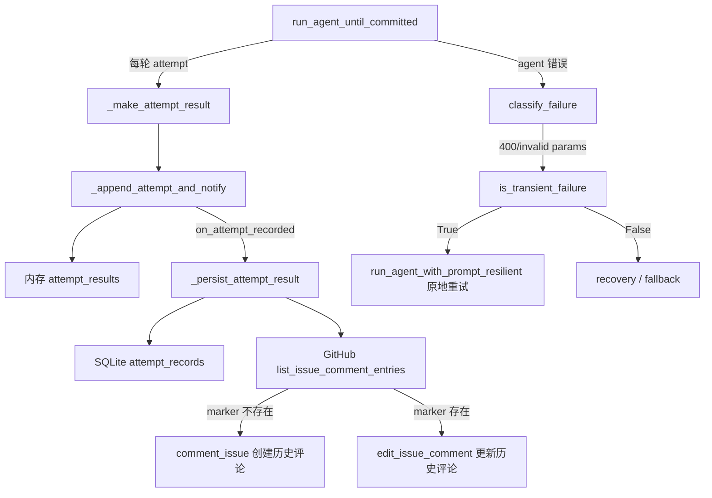
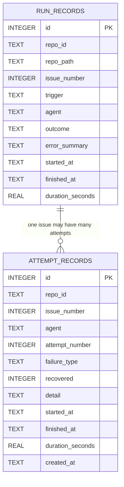

# PRD: Agent Runner Attempt History Persistence & 400 Retry Behavior

- GitHub Issue: （待创建，关联 IAR runner 多次失败无明确 agent/time 记录及 400 重试问题）


## 1. Introduction & Goals

### 问题陈述

当前 keda Agent Runner 在执行 GitHub Issue 时存在三类可观测性/恢复问题：

1. **Attempt History 缺少 agent 与耗时信息**。`AttemptResult` 没有 `agent`、`started_at`、`finished_at`、`duration_seconds`，失败评论里 Agent 列显示为 `-`，无法快速判断是哪一轮、哪个 agent、花了多久失败。
2. **Attempt History 只在最终失败时一次性写入**。中间每轮尝试的结果只存在内存，runner 被 kill 或中途异常时历史丢失，且 GitHub Issue 上看不到实时进展。
3. **`400 invalid params` 类错误被当成普通 `AGENT_ERROR` 烧完 recovery 次数**。同一 agent 对确定性参数错误反复 recovery，浪费 token 和时间，而不是像网络错误一样先原地重试、再换 agent。

### Proposed Solution Summary

**推荐机制**：扩展 `AttemptResult` 模型并建立每轮 attempt 的实时旁路持久化，同时把 400/invalid-parameter 类错误纳入 transient 重试签名。

1. **AttemptResult 增强**：在 `src/backend/core/shared/models/agent_runner.py` 的 `AttemptResult` 中增加 `agent`、`started_at`、`finished_at`、`duration_seconds`；`run_agent_until_committed` 每次 append attempt 时自动填充。
2. **实时持久化**：每次 attempt 结束后同步写入 SQLite `attempt_records` 表，并更新 GitHub Issue 上一条带 `<!-- iar-attempt-history -->` marker 的增量评论；第一次创建，后续编辑，不刷屏。
3. **400 走网络错误同款重试**：在 `agent_runner_failure.py` 的 `_TRANSIENT_HINT_PATTERN` 中加入 `400`、`invalid params`、`InvalidParameter`、`BadRequest`、`input should be a valid dictionary` 等签名，使其先在同 agent 内原地重试，耗尽后再进入 recovery / 换 agent。
4. **表格展示耗时**：`format_attempt_history` 增加 `Duration` 列。

**刻意规避的复杂度**：不改 GitHub Issue 主描述；不发多条评论刷屏；不引入新外部服务；不改动 runner 状态机主流程；持久化为旁路存储，失败不阻断主流程。

### 测量目标

1. 失败评论中 Attempt History 表格的 Agent 列不再出现 `-`（除非该 attempt 确实未调用 agent，如复用本地 commit）。
2. 每轮 attempt 结束后，SQLite `attempt_records` 表和 GitHub 评论在 1 秒内同步更新。
3. `400 invalid params` 类错误触发 `run_agent_with_prompt_resilient` 的 transient 原地重试，而不是直接消耗 `max_recovery_attempts`。
4. `format_attempt_history` 渲染的表格包含 `Duration` 列，精度到 0.1s。

### Realistic Validation

除单元测试和集成测试外，本 PRD 要求通过**真实项目入口点**验证关键行为：

- [ ] **Attempt 实时持久化真实验证**：通过 `iar run` 或 `iar run --issue <n>` 触发一个会失败的 Issue，验证 SQLite `attempt_records` 表在每次 attempt 后都有新行，且 GitHub Issue 上出现/更新了 `<!-- iar-attempt-history -->` 评论。
- [ ] **400 类错误重试行为真实验证**：构造一个 agent 返回 `400 invalid params` 的失败，验证同 agent 原地重试 `transient_retry_attempts` 次后才进入 recovery 或换 agent。
- [ ] **Attempt History 表格真实验证**：查看最终失败评论或增量评论，验证表格包含 Agent、Duration 列，且 agent 名正确。

**为什么单元测试不够**：持久化涉及真实 SQLite 写入、GitHub CLI 评论创建/编辑、以及真实 runner 循环中的时序；400 重试行为涉及真实 `run_agent_with_prompt_resilient` 的异常分类和重试路径。这些在单测中会被 mock 掉，无法证明真实入口行为。

### Delivery Dependencies

- Group: agent-runner-observability
- Depends on groups:
  - none
- Depends on tasks/issues:
  - none
- Gate type: none
- Notes: 本 PRD 只修改 keda runner 内部逻辑与本地旁路存储，不依赖外部 IAR 工具发版。


## 2. Usage And Impact After Implementation

### 开发者/维护者视角

处理失败 Issue 后，打开 GitHub Issue 会看到一条实时更新的 `Attempt History (live)` 评论：

```markdown
<!-- iar-attempt-history -->
### Attempt History (live)

| Attempt | Agent | Failure Type | Recovered | Duration | Detail |
|---------|-------|-------------|-----------|----------|--------|
| 1 | claude | transient | No | 12.3s | API Error: 400 invalid params |
| 2 | claude | no_commits | No | 45.2s | Agent produced no git commits. |
| 3 | kimi | no_commits | No | 38.7s | Agent produced no git commits. |
```

同时在 `.iar/` 所在目录的 SQLite 运行历史库中可查询到每轮 attempt 的详细记录。

### 运维/控制台视角

管理终端读取 `attempt_records` 表即可展示每轮 attempt 的 agent、耗时、失败类型，无需解析 GitHub Issue 评论。

### 对现有行为的影响

- 现有成功路径：无额外开销；只有失败路径才会写入 attempt 记录和评论。
- 现有 GitHub 评论：新增一条增量 attempt history 评论，不修改 Issue 描述。
- 现有 SQLite 运行历史：新增 `attempt_records` 表，不影响 `run_records`。
- 现有重试行为：仅 400/invalid-parameter 类错误从 `AGENT_ERROR` 改为 `TRANSIENT`，其他错误不变。


## 3. Requirement Shape

### Actor

- **AI agent**：被 runner 调用，可能因网络/参数错误失败。
- **Agent Runner**：调用 agent，分类失败，记录每轮 attempt 的元数据。
- **开发者/维护者**：通过 GitHub Issue 或 SQLite 查看 attempt 历史。

### Trigger

1. `run_agent_until_committed` 中任意 phase（agent 执行、verification、PRD 交付、证据检查、commit proxy）产生一次失败或成功。
2. Agent CLI 返回包含 `400 invalid params` / `InvalidParameter` / `BadRequest` / `input should be a valid dictionary` 的错误。

### Expected Behavior

1. 每次 attempt 结束后，`AttemptResult` 包含实际 agent 名、起止时间、耗时。
2. 每次 attempt 结束后，SQLite `attempt_records` 表追加一行。
3. 每次 attempt 结束后，GitHub Issue 上存在一条带 `<!-- iar-attempt-history -->` marker 的评论，内容包含当前完整 attempt history 表格；不存在则创建，存在则编辑。
4. `400 invalid params` 类错误在 `run_agent_with_prompt_resilient` 中触发 transient 原地重试，不计为一次 recovery attempt。
5. `format_attempt_history` 输出包含 `Duration` 列。

### Explicit Scope Boundary

- 不修改 GitHub Issue 描述正文。
- 不修改 runner 主状态机（ready/running/blocked/failed 等标签流转）。
- 不引入外部数据库/队列/服务。
- 持久化为旁路，失败不阻断主流程。
- 不改其他错误分类（429 usage limit 仍走 `PROVIDER_CAPACITY`，网络超时仍走 `TRANSIENT`）。


## 4. Repository Context And Architecture Fit

### 当前相关模块/文件

| 关注点 | 位置 | 说明 |
|---|---|---|
| Runner 核心执行循环 | `src/backend/core/use_cases/run_agent_once.py` | 含 `run_agent_until_committed`、`_make_attempt_result`、`_append_attempt_and_notify`。 |
| 失败分类 | `src/backend/core/use_cases/agent_runner_failure.py` | 含 `FailureType`、`classify_failure`、`is_transient_failure`、`format_attempt_history`。 |
| 编排层 | `src/backend/core/use_cases/agent_runner_orchestrate.py` | 含 `run_issue_with_agent_fallback`、`_process_ready_issue`、`_process_blocked_resolution`、`_persist_attempt_result`。 |
| 领域模型 | `src/backend/core/shared/models/agent_runner.py` | 含 `AttemptResult`。 |
| GitHub 端口 | `src/backend/core/shared/interfaces/agent_runner.py` | 含 `IGitHubClient`。 |
| SQLite 运行历史 | `src/backend/infrastructure/persistence/console_store.py` | 含 `SqliteConsoleStore`、`RunRecord`。 |
| GitHub CLI 实现 | `src/backend/infrastructure/github_client.py` | 含 `GitHubCliClient`。 |
| 运行历史端口 | `src/backend/core/shared/interfaces/runner_console.py` | 含 `IRunHistoryStore`。 |

### 既有架构模式（需遵循）

- 依赖方向保持 `api → core → engines/infra`；`core` 不直接依赖 `infrastructure`。
- `IGitHubClient` 与 `IRunHistoryStore` 是 core 依赖的端口，具体实现分别在 `infrastructure/`。
- 旁路存储失败必须吞掉异常，不阻断 runner 主流程。
- 单文件非空行 ≤ 1000。

### Frontend Impact

**No frontend impact。** 本改动完全在 Agent Runner CLI/后端内部，用户可见的变化仅在 GitHub Issue 评论和本地 SQLite 运行历史；仓库现有 frontend（`frontend/`、`frontend-public/`、`frontend-admin/`）均不修改。

### Existing PRD Relationship

- `tasks/pending/P1-FEAT-20260626-015233-agent-runner-recovery-friction-reduction.md`：关注 Fix Agent 与 timeout 分层，与本 PRD 独立。
- `tasks/pending/P1-FEAT-20260626-093933-agent-runner-memory-persistence.md`：关注长期记忆与 skill 蒸馏，与本 PRD 独立。
- `tasks/archive/P1-FEAT-20260626-093939-agent-runner-session-persistence.md`：研究性 PRD，关注 agent 会话延续，与本 PRD 独立；已归档。
- 本 PRD 不重复、不依赖、不阻塞上述 PRD。


## 5. Recommendation

### Recommended Approach

采用**最小增量路径**：

1. 扩展 `AttemptResult` 字段并在 `run_agent_until_committed` 构造时填充。
2. 新增 `IRunHistoryStore.append_attempt` 与 SQLite `attempt_records` 表。
3. 新增 `IGitHubClient.list_issue_comment_entries` / `edit_issue_comment`，在 orchestration 层实现 marker-based 增量评论。
4. 把 400/invalid-parameter 加入 `_TRANSIENT_HINT_PATTERN`。

### Why This Fits

- 直接复用现有 `AttemptResult` / `format_attempt_history` / `IRunHistoryStore` / `IGitHubClient` 扩展点，不新建平行抽象。
- SQLite 旁路存储与现有 `run_records` 同库同实现模式，运维一致。
- GitHub 评论编辑基于已有 `comment_issue` 能力，不引入新 API 客户端。
- transient 重试复用现有 `run_agent_with_prompt_resilient` 逻辑，无需新重试层。

### Alternatives Considered

- **替代 A：把 attempt 历史写入 GitHub Issue 描述正文**。拒绝：会污染 Issue 原始需求描述，且编辑正文风险更高。
- **替代 B：为 attempt 历史新建独立数据库/文件**。拒绝：现有 SQLite 运行历史库已存在，新增表即可，无需引入新存储。
- **替代 C：对 400 错误直接切换 agent（不重试）**。拒绝：400 有时由 provider 端临时参数解析问题引起，与网络错误类似，先原地重试更经济；且用户明确要求“和网络一样的方式”。


## 6. Implementation Guide

> This section is a living implementation guide based on current repository analysis. If implementation discovers additional affected files, hidden dependencies, edge cases, or a better path, update this PRD before proceeding.

### Core Logic

1. `run_agent_until_committed` 每轮 attempt 开始时记录 `time.monotonic()` 和 ISO 时间戳。
2. 无论成功或失败，构造 `AttemptResult` 时传入 `agent=selected_agent` 和上述时间。
3. 通过 `_append_attempt_and_notify` 把结果追加到内存列表，并调用 `on_attempt_recorded` 回调。
4. 回调 `_persist_attempt_result` 同时写入 SQLite `attempt_records` 和 GitHub 评论。
5. GitHub 评论使用 `list_issue_comment_entries` 查找 marker，找到则 `edit_issue_comment`，否则 `comment_issue`。
6. `run_agent_with_prompt_resilient`  catch 到 400/invalid-parameter 错误时，`is_transient_failure` 返回 True，触发原地重试。

### Change Impact Tree

```text
.
├── src/backend/core/shared/models/agent_runner.py
│   [修改]
│   【总结】给 AttemptResult 增加 agent/started_at/finished_at/duration_seconds。
│   ├── AttemptResult 字段扩展
│   └── 默认值保持向后兼容（agent="", started_at="", finished_at="", duration_seconds=0.0）
│
├── src/backend/core/use_cases/agent_runner_failure.py
│   [修改]
│   【总结】把 400/invalid-parameter 类错误加入 transient 签名，并在 attempt history 表格增加 Duration 列。
│   ├── _TRANSIENT_HINT_PATTERN 增加 400 / invalid params / InvalidParameter / BadRequest / malformed request / input should be a valid dictionary
│   ├── is_transient_failure docstring 更新
│   └── format_attempt_history 输出增加 Duration 列
│
├── src/backend/core/use_cases/run_agent_once.py
│   [修改]
│   【总结】每次 attempt 自动记录 agent 名和耗时，并通过回调持久化。
│   ├── 新增 _make_attempt_result 辅助函数
│   ├── 新增 _append_attempt_and_notify 辅助函数
│   ├── run_agent_until_committed 增加 on_attempt_recorded 参数
│   └── 所有 attempt 构造点替换为 _make_attempt_result + _append_attempt_and_notify
│
├── src/backend/core/use_cases/agent_runner_orchestrate.py
│   [修改]
│   【总结】把 attempt 持久化回调接入 ready 和 blocked_resolution 路径，实现 GitHub 增量 attempt history 评论。
│   ├── 新增 _build_attempt_history_comment
│   ├── 新增 _persist_attempt_result
│   ├── _stamp_attempts_with_agent docstring 更新（agent 已预填）
│   ├── run_issue_with_agent_fallback 增加 on_attempt_recorded 参数并透传
│   ├── _process_ready_issue / _process_blocked_resolution 接收并透传 on_attempt_recorded
│   ├── _process_running_rework / _process_running_publish_recovery 增加 **kwargs 以兼容透传
│   └── _process_single_issue 创建闭包回调并传入 run_issue_with_agent_fallback
│
├── src/backend/core/shared/interfaces/runner_console.py
│   [修改]
│   【总结】新增 AttemptRecord 模型与 IRunHistoryStore.append_attempt 端口。
│   ├── 新增 AttemptRecord dataclass
│   └── IRunHistoryStore 新增 append_attempt 抽象方法
│
├── src/backend/infrastructure/persistence/console_store.py
│   [修改]
│   【总结】新增 attempt_records 表（schema v3）及 append_attempt 实现。
│   ├── _SCHEMA_VERSION 升级为 3
│   ├── 新增 _CREATE_ATTEMPT_RECORDS DDL
│   ├── _migrate 增加 v2→v3 迁移
│   ├── 新增 AttemptRecord dataclass（与 core 同构）
│   └── 新增 SqliteConsoleStore.append_attempt
│
├── src/backend/core/shared/interfaces/agent_runner.py
│   [修改]
│   【总结】IGitHubClient 新增 list_issue_comment_entries 与 edit_issue_comment。
│   ├── 新增 list_issue_comment_entries 抽象方法
│   └── 新增 edit_issue_comment 抽象方法
│
├── src/backend/infrastructure/github_client.py
│   [修改]
│   【总结】实现评论条目查询与编辑，并新增 URL 解析辅助函数。
│   ├── 新增 _COMMENT_ID_URL_PATTERN 与 _extract_comment_id_from_url
│   ├── list_issue_comments 恢复直接解析 bodies（与旧行为一致）
│   ├── 新增 list_issue_comment_entries
│   ├── 新增 edit_issue_comment
│   └── 新增 _get_owner_repo 辅助函数
│
├── tests/conftest.py
│   [修改]
│   【总结】FakeGitHubClient 实现新的 list_issue_comment_entries 与 edit_issue_comment。
│   ├── 新增 _issue_comment_entries / _next_comment_id
│   ├── comment_issue 同时维护 entries
│   ├── 新增 list_issue_comment_entries
│   └── 新增 edit_issue_comment
│
├── tests/test_run_agent.py
│   [修改]
│   【总结】更新 format_attempt_history 断言，新增 400 transient 测试，更新失败评论断言以区分增量历史评论。
│   ├── test_format_attempt_history_table 断言增加 Duration 列
│   ├── test_format_attempt_history_includes_agent_column 断言增加 Duration 列
│   ├── test_run_once_recovers_after_agent_command_failure 改用非 400 错误以验证 recovery
│   ├── 多个失败评论断言区分 history_comment_calls / failure_comment_calls
│   └── 新增 test_is_transient_failure_matches_400_invalid_params / test_is_transient_failure_still_excludes_provider_capacity
│
└── tests/test_agent_runner_orchestrate.py
    [修改]
    【总结】新增 attempt 持久化到 SQLite 和 GitHub 的测试，调整 process_for_agent 接受额外 kwargs。
    ├── _agent_outcomes 的 process_for_agent 增加 **kwargs
    ├── 新增 test_persist_attempt_result_writes_to_sqlite_and_github
    └── 新增 test_persist_attempt_result_updates_existing_github_comment
```

### Executor Drift Guard

- 新增/修改的方法签名变化可能影响实现 `IGitHubClient` 或 `IRunHistoryStore` 的其他地方。实现后应运行：
  ```bash
  rg -n "class .*\(IGitHubClient\)" src/ tests/
  rg -n "class .*\(IRunHistoryStore\)" src/ tests/
  ```
- `AttemptResult` 字段增加后，所有直接构造点应检查。实现后应运行：
  ```bash
  rg -n "AttemptResult\(" src/ tests/
  ```
- `_TRANSIENT_HINT_PATTERN` 是正则，新增 400 签名时注意避免误匹配正常输出中的 "400" 数字（当前仅用于异常文本，风险较低）。

### Flow / Architecture Diagram



### Realistic Validation Plan

| Behavior | Real Entry Point | Test Layer | Mock Boundary | Data/Env Needed | Command Or Procedure | Required For Acceptance |
|---|---|---|---|---|---|---|
| Attempt 实时写入 SQLite | `iar run` 处理失败 Issue | manual / integration | GitHub 评论可 mock | 本地 SQLite 运行历史库 | `sqlite3 <db> "SELECT * FROM attempt_records WHERE issue_number=<n>"` | Yes |
| GitHub 增量 attempt history 评论 | `iar run` 处理失败 Issue | manual / integration | SQLite 可 mock | gh CLI 认证、目标仓库 | 查看 Issue 评论是否出现 `<!-- iar-attempt-history -->` 并随轮次更新 | Yes |
| 400 走 transient 重试 | `iar run` 或单测 | unit + integration | agent CLI 返回 400 | 配置 `transient_retry_attempts=2` | 观察日志出现 `Transient error from agent ... retrying (1/2)` | Yes |
| Duration 列展示 | 失败评论渲染 | unit | 无 | 构造带 duration 的 AttemptResult | `format_attempt_history(results)` 输出包含 `Duration` | Yes |

### ER Diagram



### External Validation

No external validation required; repository evidence was sufficient.


## 7. Acceptance Checklist

### Architecture Acceptance

- [x] `AttemptResult` 字段扩展位于 `src/backend/core/shared/models/agent_runner.py`，且不破坏现有调用点。
- [x] `IRunHistoryStore.append_attempt` 与 `IGitHubClient.list_issue_comment_entries` / `edit_issue_comment` 已添加到对应端口文件。
- [x] 依赖方向保持 `api → core → engines/infra`；core 层未直接导入 infrastructure。

### Behavior Acceptance

- [x] `run_agent_until_committed` 每次 attempt 都记录 agent 名、起止时间、耗时。
- [x] `_persist_attempt_result` 在 attempt 结束后写入 SQLite `attempt_records`。
- [x] `_persist_attempt_result` 在 attempt 结束后创建或编辑 GitHub attempt history 评论（带 `<!-- iar-attempt-history -->` marker）。
- [x] `format_attempt_history` 渲染的表格包含 `Duration` 列。
- [x] `is_transient_failure` 对 `400 invalid params` / `InvalidParameter` / `BadRequest` / `input should be a valid dictionary` 返回 True。
- [x] `is_transient_failure` 对 `429 usage limit` 仍返回 False。

### Dependency Acceptance

- [x] `SqliteConsoleStore` schema 升级到 v3，`attempt_records` 表已创建。
- [x] `FakeGitHubClient` 已实现 `list_issue_comment_entries` 与 `edit_issue_comment`。
- [x] 所有实现 `IGitHubClient` 或 `IRunHistoryStore` 的类均已同步新方法。

### Validation Acceptance

- [x] 完整 pytest 通过：`uv run pytest tests/ --testmon-noselect`。
- [x] lint 通过：`just lint --full`。
- [x] 新增单元测试覆盖：400 transient 检测、SQLite attempt 持久化、GitHub 增量评论编辑。

### Delivery Readiness

- [x] 推荐路径已全部实现，无开放回归或 rollout 阻塞。
- [x] 未引入营销页、新后端 API、新数据表（仅新增旁路 SQLite 表）。


## 8. Functional Requirements

- **FR-1**：`AttemptResult` 必须包含 `agent`、`started_at`、`finished_at`、`duration_seconds` 字段，用于后续展示与持久化。
- **FR-2**：`run_agent_until_committed` 必须在每轮 attempt 开始时记录时间，append 结果时自动填充 agent 与耗时。
- **FR-3**：每次 attempt 结束后必须通过回调持久化到 SQLite `attempt_records` 表，失败不阻断主流程。
- **FR-4**：每次 attempt 结束后必须在 GitHub Issue 上创建或编辑一条带 `<!-- iar-attempt-history -->` marker 的增量评论，失败不阻断主流程。
- **FR-5**：`format_attempt_history` 必须在表格中渲染 `Duration` 列，格式为 `<seconds>s`。
- **FR-6**：`is_transient_failure` 必须将 `400 invalid params` / `InvalidParameter` / `BadRequest` / `malformed request` / `input should be a valid dictionary` 识别为 transient 错误。
- **FR-7**：`400 invalid params` 类错误必须走 `run_agent_with_prompt_resilient` 的原地重试逻辑，而不是直接消耗 recovery attempt。
- **FR-8**：`429 usage limit` / `rate limit` / `overloaded` / `529` 仍必须识别为 provider capacity 错误，触发换 agent 而非原地重试。


## 9. Non-Goals

- 不修改 GitHub Issue 描述正文。
- 不修改 runner 主状态机或标签流转逻辑。
- 不引入向量数据库、消息队列、外部监控服务等新依赖。
- 不改变 400 以外的其他错误分类。
- 不为 attempt history 评论增加评论折叠、React 投票等交互功能。
- 不将 attempt 记录用于 runner 运行时决策（仅用于观测与复盘）。


## 10. Risks And Follow-Ups

- **风险 1：GitHub 评论编辑依赖 `gh api`**。如果 `gh` 版本或 token 权限不足，编辑可能失败；实现已吞掉异常并记录日志，不阻断 runner。
- **风险 2：`_get_owner_repo` 调用 `gh repo view`**。在 CI 或裸仓库中可能失败；目前仅用于评论编辑路径，失败会被捕获。
- **风险 3：400 误识别**。某些 provider 的 400 可能是真正确定性错误，原地重试会浪费 token；但重试次数受 `transient_retry_attempts` 限制，耗尽后仍会进入 recovery / 换 agent。
- **后续可选**：在管理终端中展示 `attempt_records` 表的每轮耗时趋势图。


## 11. Decision Log

| ID | Decision | Chosen | Rejected | Rationale |
|---|---|---|---|---|
| D-01 | 400 错误处理方式 | 加入 transient 签名，先原地重试再 recovery/换 agent | 直接切换 agent 或保持 AGENT_ERROR | 400 与网络错误类似，有时 provider 端临时参数解析失败，原地重试更经济；且符合用户“和网络一样的方式”的要求。 |
| D-02 | Attempt 持久化位置 | SQLite 旁路表 + GitHub 评论 | 写入 Issue 描述正文或独立数据库 | 旁路表与现有运行历史同库，运维一致；GitHub 评论不污染 Issue 原始需求。 |
| D-03 | GitHub 评论策略 | 单条带 marker 的评论，首次创建后续编辑 | 每轮 attempt 发一条新评论 | 避免刷屏，保持 Issue 评论列表整洁。 |
| D-04 | AttemptResult 字段默认值 | agent/started_at/finished_at/duration_seconds 给默认值 | 全部必填 | 默认值保持测试与复用本地 commit 路径的向后兼容，生产代码始终显式填充。 |
