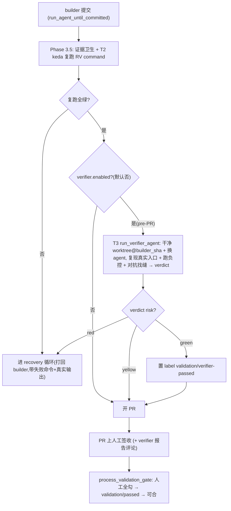

# PRD: Realistic Validation 独立验证 + 真实复跑门禁（消除"自评测试"）

> GitHub Issue: （建议用 `create_issue_from_prd` 生成后回填）
>
> 本 PRD 分两个 altitude：**Part A · 人审层**（决定该不该做、做得对不对，含介入与风险地图）;**Part B · 执行器层**（实现细节，人只在风险地图点名处下钻）。

---

# Part A · 人审层 (Review Layer)

## 1. Introduction & Goals

### Problem Statement

keda 的 Realistic Validation 门禁（`agent_runner_validation.py` 的 `ensure_validation_evidence_ready`）目前只检查**证据卫生**：证据目录非空、每个 RV item 有命名规范的文件、manifest 字段完整、文件间不串味（contamination 检测）。它**从不检查证据是否真的证明功能可用**。整条链是同一个 builder agent **自己出题（RV 清单）、自己答题（在自己 worktree 跑）、自己产出证据、自己判绿**;keda 只看"文件齐不齐"，唯一的有效性判断是人在 PR 上读 agent 贴的证据打勾。

后果（实测痛点）：**agent 的验证全绿、PR 也签收了，作者本人去跑却仍然有问题**。根因是三个窟窿——**循环自评**（出题/答题/判卷同一个 agent）、**保真不足**（可跑单测 / mock 掉真正会坏的边界 / 只跑 happy path，门禁不管）、**零判别力**（一个功能坏掉时也照样绿的测试等于没测，而门禁从不要求证明"这测试会红"）。contamination PRD 已解决"伪造/串味"（完整性），缺的是**有效性**。

### Interpretation (解读回显)

我把需求读成：**在 keda runner 层把"证据卫生门禁"升级成"有效性门禁"——让"绿"真正意味着"功能在真实入口上可用"，而不是"agent 的代码与它自己写的测试自洽"**。三层叠加（Tier 3）：T1 每个 RV item 必须带"红→绿"负控 + 真实入口可复跑命令;T2 keda 自己用 `IProcessRunner` 复跑这些命令、以 keda 跑出来的结果为准;T3 在 builder 之后再跑一个**独立 verifier agent**（换一个 agent、干净 worktree），从需求意图独立验证并对抗性证伪，产出结构化 verdict 喂给门禁/标签。范围限 keda runner + 配套 PRD skill 的 RV 格式;不改目标业务仓库代码。若你其实只想要 T1（负控）先落地、T2/T3 以后再说，这条解读就偏了——请纠正（第一次人类触点）。

### What The User Gets

- builder agent 跑完后，**keda 自己复跑** RV 命令(不再只信 agent 贴的文件);任一命令非绿 → 进 recovery，不放行。
- 每个 RV item 必须证明"**功能坏时测试会红**"(负控)，否则门禁拒收。
- 一个**独立 verifier agent**(默认换一个 model、在 builder 提交点的干净 worktree)独立复现真实入口、对抗性找"测试过但实际坏"的缝，给出 `pass/risk` verdict;red 阻断发布、yellow 警告、green 才置 `validation/verifier-passed`。
- 人在终点看到的是一份**按风险排序、由 keda 与独立 agent 各自跑过**的证据包,而不是 builder 的自证。

### Measurable Objectives

- **可证伪**：种一个"builder 自评能过、但功能确实坏"的回归用例(seeded bug)，新管线(T2 复跑 + T3 verifier)必须把它**拦下**(红/阻断);关掉新管线则放行——以此量化"绿=对"。
- 每个 RV item 的结构化 manifest 必须含可复跑命令 + 负控，缺一即门禁失败。
- verifier verdict=red 时发布被阻断;green 才打 `validation/verifier-passed`。v1 由 pre-PR 门禁保证"PR 存在 ⟹ verifier 已通过",人工签收仍为最终把关;daemon 双门禁列为后续 follow-up。
- 全程在现有 recovery / supervisor 编排内扩展，不新增独立服务或端口;旧 Issue / 无结构化证据路径保持兼容。

## 2. Human Review Map (介入与风险地图)

默认按架构层定介入档（`api`/`infrastructure` 偏自动，`core` 偏人工），再用风险因子（不可逆性 / 影响面 / 安全·资金 / 正确性关键度）调整。本特性改的是"决定一切能否发布的门禁"，正确性关键度极高，高风险面密集。

判定菜单：固定区域 ① Core 逻辑/编排 ② schema/迁移 ③ 安全/信任边界 ④ 对外契约/breaking;横切触发器 ⑤ 资金/计费 ⑥ 不可逆/破坏性数据操作 ⑦ 并发/幂等。

**命中的人审项**（逐条进下表，需人工确认）：①③④⑦。

**未命中**（默认执行器 + 自动门禁）：② 无 DB/schema 变化(仅 manifest JSON 字段 + 配置)、⑤ 无计费。

- 最坏自检：② manifest 加字段若与旧证据不兼容 → 由"旧 Issue/无 marker 走兼容分支"兜底(最坏=历史 PR 证据失效，故必须保兼容);⑤ 不涉及。

| 改动点 | 架构层 | 风险 | 介入方式 | 证据 / Oracle（可执行、能证伪本项；进 §9 证据包） |
|---|---|---|---|---|
| ① 门禁有效性升级：keda 复跑 RV 命令 + 要求负控（`ensure_validation_evidence_ready` / 新 `ensure_validation_commands_pass`） | core | 高 | 人工确认 | **seeded-bug 元 oracle**：构造"builder 自评过但功能坏"的用例，断言新门禁拦下、关闭开关则放行 |
| ① 独立 verifier agent 编排 + verdict 门禁（`agent_runner_orchestrate.py` 扩展，仿 `_run_supervisor_with_repair_loop`） | core | 高 | 人工确认 | 集成测试：mock agent 返回 red/yellow/green verdict marker，断言分别阻断/警告/放行并打对标签 |
| ① verdict 解析（marker → `ValidationVerdict`） | core | 中 | 人工确认 | 单测：marker round-trip + 畸形/缺失 marker 安全降级（默认按未通过处理） |
| ③ 安全：keda/verifier 复跑命令的沙箱边界（复用 `config.safety` / worktree 隔离） | core/infra | 中 | 人工确认 | 测试 + 人审：复跑命令不得触达 worktree 外 / 不得执行破坏性操作;负控的"弄坏代码"只在 verifier 临时 worktree 内、跑完即弃 |
| ④ 新 marker/label 契约：`iar:verifier-verdict`、`validation/verifier-passed`;daemon 双门禁 v1 不做 | api(GitHub) | 中 | 人工确认 | 集成测试：verifier green 置 label、red/yellow 不置/清除;head 漂移重置 label;daemon 双门禁列为后续 follow-up |
| ⑦ 幂等/并发：verifier 重跑、head 漂移、recovery 循环交互 | core | 中 | 人工确认 | 测试：同一 head 重复跑 verifier 幂等;builder head 变化使旧 verdict 失效 |
| RV manifest 加 `negative_control`（`EvidenceBlock` 扩字段 + 校验） | core | 中 | 人工确认 | 单测：缺负控 → `ValidationEvidenceError`;旧无字段证据走兼容 |
| PRD→Issue 物化读新 RV 格式（`extract_realistic_validation_items` / `build_issue_validation_section` 兼容新模板的 oracle 行） | core | 中 | 人工确认 | 单测：新格式 PRD → 正确物化出带命令+负控的 RV 清单 |
| prompt 文案（要求 red→green + 可复跑命令）（`build_structured_evidence_prompt_suffix` / `build_validation_prompt_line`） | core | 低 | 执行器+门禁 | 快照测试 + 跑一次真实 agent 看是否产出负控 |
| 配置项 `config.validation.verifier.*`（`settings.py` / `factory.py` / `repository_local.py`） | infra | 低 | 执行器+门禁 | 单测：默认值 + `.iar.toml` 覆盖加载 |
| 文档（`docs/guides/prd-standard.md` 等） | docs | 低 | 执行器+门禁 | `mkdocs build` + 人扫 |

**如何证明它生效（真实入口，白话）**：在一个 keda 管理的真实 Issue 上,故意让 builder 提交一个"自测能过但功能坏"的改动 → 观察 keda 复跑命令报红 / verifier 给 red → 发布被拦、Issue 进 recovery;把 `validation.verifier.enabled=false` 关掉则恢复旧行为放行。命令级见 §7.6。

**数据库结构评审**：`本次无数据库结构变化。`（仅 `evidence.json` manifest 增加可选字段 + 配置项，无持久化 schema 改动。）

## 3. Usage And Impact After Implementation

### 运行者 / 维护者
- 一次 agent run 的流程从「builder 提交 → (post-PR supervisor) → 人工签收」变为「builder 提交 → **keda 复跑 RV 命令** → **独立 verifier agent 对抗验证** → verdict 门禁(red 阻断/yellow 警告/green 放行并置 `validation/verifier-passed` label) → 人工签收」。v1 不做 daemon 双门禁,pre-PR 放置已蕴含"PR 存在 ⟹ verifier 已通过"。
- 新配置(默认安全)：`config.validation.verifier.enabled`(默认 `false`，渐进开启)、`verifier_agent`(默认换 builder 之外的 fallback agent)、`require_negative_control`(默认 `true` 仅对带 structured-evidence marker 的 Issue 生效)、`reexecute_commands`(默认 `true`)。
- PR 上多一条 verifier 报告评论 + verdict marker;`validation/verifier-passed` label 为后续自动合并队列提供显式状态位,当前 v1 仍由人工签收做最终把关。

### 入口命令（示例，详见 §7.6）
```bash
# 本地复现门禁(对某 worktree 跑 RV 命令)
uv run python -m backend.api.cli ...   # 实际子命令在实现期对齐现有 CLI
```

### 对既有行为的影响
- `validation.verifier.enabled=false`(默认) → 行为与现状完全一致，零回归;团队按仓库逐步开启。
- 旧 Issue / 无 `iar:structured-evidence` marker / 有 `validation-waived` → 跳过新检查，保持兼容。
- 不改任何目标业务仓库代码;只改 keda runner 自身。

## 4. Requirement Shape

- **Actor**：keda agent runner 的验证编排层;以及被 keda 管理的目标仓库 Issue。
- **Trigger**：某 Issue 启用 validation 且(按配置)启用 verifier;builder agent 完成提交后进入验证阶段。
- **Expected behavior**：keda 复跑 RV 命令并要求负控;独立 verifier agent 从意图出发对抗验证;verdict 喂门禁与标签;只有"真实复跑绿 + verifier 非 red + 人工签收"才放行。
- **Scope boundary**：只改 keda runner 的验证/编排/配置/prompt/文档 + 配套 PRD skill 的 RV 格式;不改目标业务仓库;不引入独立服务/端口;不替换现有 human sign-off(是叠加，不是取代)。

---

# Part B · 执行器层 (Build Layer)

> 以下供实现者使用;人只在 Part A 风险地图点名处下钻。**下列文件/函数是当前分析的起点，非穷尽；实现前用 §7.3 的 `rg` 锚点校正真实位置（Explore 给的行号不可信，按符号名定位）。**

## 5. Repository Context And Architecture Fit

### 当前相关模块（已用 rg 校验存在）
- 编排入口：`src/backend/core/use_cases/agent_runner_orchestrate.py`（`run_once` / `run_issue_with_agent_fallback`，调用 `run_agent_until_committed`，并在 `config.post_pr_supervisor.enabled` 下调 `_run_supervisor_with_repair_loop`;`supervisor_agent = choose_agent(...)`）。**T3 verifier 的注入点与范式。**
- builder 主循环：`src/backend/core/use_cases/run_agent_once.py`（`run_agent_until_committed` 的 Phase 3.5 调 `ensure_validation_evidence_ready`;agent 调用 `run_agent_with_prompt_resilient` / `run_agent_with_prompt`，命令构建 claude/kimi/codex;`create_or_reuse_worktree`）。
- 验证门禁：`src/backend/core/use_cases/agent_runner_validation.py`（`ensure_validation_evidence_ready`、`build_validation_prompt_line`、`extract_realistic_validation_items`、`build_issue_validation_section`、`upload_evidence_branch`、daemon 软门禁 `process_validation_gate` + 标签）。
- 结构化证据：`src/backend/core/use_cases/agent_runner_structured_evidence.py`（`EvidenceBlock` 已含 `item_number/item_name/command/output_summary/explanation/risks/evidence_files`;`EvidenceManifest`、`validate_evidence_manifest`、`build_structured_evidence_prompt_suffix`）。**`command` 字段即 T2 复跑的现成 seam。**
- 既有第二 agent 范式：`agent_runner_supervisor.py`（`_run_supervisor_with_repair_loop`）、`pr_supervisor.py`、`agent_review.py`、`review_once.py`。
- PRD→Issue：`src/backend/core/use_cases/create_issue_from_prd.py`（`extract_realistic_validation_items` / `build_issue_validation_section`）。
- 接口/模型：`core/shared/interfaces/agent_runner.py`（`IProcessRunner.run`、`IGitHubClient`）;`core/shared/models/agent_runner.py`（`IssueSummary`、`PullRequestContext`、`AppConfig`）。
- 配置：`infrastructure/config/settings.py`（`AgentRunnerValidationSettings`）、`engines/agent_runner/factory.py`、`engines/agent_runner/repository_local.py`（`.iar.toml`）。

### 既有架构模式 / 边界
- 四层：`api → core → engines → infrastructure`;新逻辑放 `core/use_cases`，I/O 经 `IProcessRunner` / `IGitHubClient` 抽象，受 `hooks/check_architecture.py` 约束。
- 状态源唯一 = GitHub Issue/PR;所有 marker 用 `<!-- iar:... -->` 同型正则（仿 `agent_runner_events.py`）。
- verifier 复用 `choose_agent` / fallback 链 / worktree 机制，不另造 agent 抽象。

### Frontend impact
- `No frontend impact`（`frontend/src/components/roadmap/prd-card.tsx` 只读 PRD 元数据，不依赖 RV 内部结构;如需展示 verdict 为后续可选项，不在本 PRD）。

### Existing PRD relationship
- 依赖/承接：`tasks/archive/20260625-095725-prd-realistic-validation-evidence-contamination-detection.md`（完整性）——本 PRD 在其上加**有效性**，复用其证据/manifest 机制，不回改。
- 与 `tasks/pending/` 其余 agent-runner PRD 无冲突、无重复。
- **跨仓依赖**：配套需要模板仓 `zata_code_template/skills/prd`（PRD skill 的 RV→oracle+负控 格式强化 + keda `extract_realistic_validation_items` 读新格式）。见 §8。

### 重复风险
- verifier 不要另起编排，必须复用 `_run_supervisor_with_repair_loop` 的范式与 agent 调用栈;复跑不要重写子进程逻辑，走 `IProcessRunner`。

## 6. Recommendation

### Recommended Approach
扩展现有验证/监督编排，分三层叠加，全部走"开关默认关、渐进开启、旧路径兼容"：
1. **T1 负控 + oracle 化**：`EvidenceBlock` 增可选 `negative_control`(命令 + 期望失败观测);prompt 要求 red→green;门禁要求负控存在。
2. **T2 keda 复跑**：新 `ensure_validation_commands_pass(worktree, manifest, process_runner)` 用 `IProcessRunner` 复跑每个 `command`，以 keda 的退出码/输出为准;接入 Phase 3.5（pass 命令）与 verifier（负控需"弄坏再验红"，只在临时 worktree）。
3. **T3 独立 verifier agent**：新 `run_verifier_agent.py`，在 builder 提交后由 `agent_runner_orchestrate.py` 调用(仿 `_run_supervisor_with_repair_loop`)，默认换一个 agent、在 builder 提交点的干净 worktree，从 Issue 意图 + RV oracle 独立复现并对抗证伪，产出 `<!-- iar:verifier-verdict pass=.. risk=green|yellow|red -->`;verifier green 时置 `validation/verifier-passed` label。`process_validation_gate` 的 daemon 双门禁（人工签收 + verifier-passed）v1 不做，pre-PR 放置已蕴含"PR 存在 ⟹ verifier 已通过"。

### Why this is the best fit
- 复用 keda 既有的 supervisor 第二-agent 范式、worktree、`IProcessRunner`、marker/label 机制 → 零新增基础设施。
- `EvidenceBlock.command` 已存在，T2 复跑几乎免费;contamination 机制可复用做证据隔离。
- 开关默认关 + 旧路径兼容 → 零回归、可灰度。

### Rejected redundancy
- 不新建独立验证服务/端口/数据库;verdict 与证据仍以 GitHub Issue/PR + orphan 证据分支为状态源。
- 不取代 human sign-off;verifier 是叠加门禁。

### Proposed Solution Summary (实现机制)
- **谁提供输入**：RV oracle(真实入口命令 + 期望 + 负控)由 PRD/Issue 物化而来(配套 PRD skill 产出);verifier 的"意图"来自 Issue body;复跑命令来自 `EvidenceBlock.command`。
- **接入点**：Phase 3.5(`run_agent_once.py`)加 keda 复跑;`agent_runner_orchestrate.py` 在 builder 成功后加 verifier pass 并置/清 `validation/verifier-passed` label;`process_validation_gate` v1 保持现有人工签收逻辑(双门禁后续可选);`EvidenceBlock`/manifest/prompt 加负控。
- **状态/行为变化**：发布门禁从"证据卫生"变为"真实复跑 + 独立对抗 + 人工签收";新增 verdict marker 与 `validation/verifier-passed` 标签。
- **刻意避免**：不新增服务、不改目标仓库、不动持久化 schema、不替换签收流程。

### Alternatives Considered
- **只做 T1（负控）**：rejected（用户选 Tier 3;但作为可灰度的第一阶段保留——见 §8/§12）。
- **只让 keda 复跑、不上 verifier（T1+T2）**：能抓"测试本身假绿/低保真"，但抓不住"builder 误解意图、测了错的东西"——需要 T3 从意图独立出题。
- **verifier 复用 builder worktree**：rejected，污染 + 不独立;用干净 worktree at builder commit。

## 7. Implementation Guide

> This section is a living implementation guide based on current repository analysis. If implementation discovers additional affected files, hidden dependencies, edge cases, or a better path, update this PRD before proceeding.

### 7.1 Core Logic
1. builder 跑完 Phase 3.5：`ensure_validation_evidence_ready` 后，新增 keda 复跑 `command`(pass)→ 非 0 即 `ValidationEvidenceError` 进 recovery。
2. `agent_runner_orchestrate.py` 在 builder 成功后(发布前/发布后按现有 supervisor 时序)调 `run_verifier_agent`：干净 worktree at builder commit + 换 agent + verifier prompt(意图 + oracle + builder 证据 + "复现真实入口、跑负控验红、对抗找缝")。
3. verifier 产出 verdict marker + 报告评论;`run_verifier_agent` 解析为 `ValidationVerdict(passed, risk, findings)`，畸形/缺失安全降级为未通过。
4. verdict 路由：red → 阻断 + 进 repair 循环;yellow → 评论警告 + 放行;green → 置 `validation/verifier-passed`。
5. `validation/verifier-passed` label 生命周期：verifier green 时置 label，red/yellow 时清除(或保持未置);builder head 漂移时清除 label 以失效旧 verdict。daemon `process_validation_gate` 的双门禁升级 v1 不做。

### 7.2 Change Impact Tree
```text
.
├── Core / use_cases
│   ├── src/backend/core/use_cases/run_verifier_agent.py
│   │   [新增]
│   │   【总结】独立 verifier agent pass：建干净 worktree、换 agent、跑对抗验证、解析 verdict。
│   │   ├── build_verifier_prompt(issue, worktree, builder_sha, manifest, config)
│   │   ├── run_verifier_agent(...) -> (CommandResult, ValidationVerdict)
│   │   └── parse_verifier_verdict(text) -> ValidationVerdict（marker 解析 + 安全降级）
│   │
│   ├── src/backend/core/use_cases/agent_runner_orchestrate.py
│   │   [修改]
│   │   【总结】builder 成功后按 config.validation.verifier.enabled 调 verifier，verdict 路由到阻断/警告/放行。
│   │
│   ├── src/backend/core/use_cases/agent_runner_validation.py
│   │   [修改]
│   │   【总结】新增 ensure_validation_commands_pass（keda 复跑）;负控校验;verifier green 时置 `validation/verifier-passed` label、head 漂移时清除;process_validation_gate daemon 双门禁 v1 不做。
│   │
│   ├── src/backend/core/use_cases/agent_runner_structured_evidence.py
│   │   [修改]
│   │   【总结】EvidenceBlock 增可选 negative_control;manifest 解析/校验/prompt suffix 要求 red→green。
│   │
│   ├── src/backend/core/use_cases/run_agent_once.py
│   │   [修改]
│   │   【总结】Phase 3.5 接入 keda 复跑 pass 命令（非破坏性）。
│   │
│   └── src/backend/core/use_cases/create_issue_from_prd.py
│       [修改]
│       【总结】物化读新 PRD RV 格式（命令 + 负控 + 期望），兼容旧 checkbox 格式。
│
├── Infrastructure / config
│   └── src/backend/infrastructure/config/settings.py
│       [修改]  + engines/agent_runner/factory.py + repository_local.py
│       【总结】新增 config.validation.verifier.*（enabled/verifier_agent/require_negative_control/reexecute_commands），默认安全。
│
├── Tests
│   └── tests/
│       [新增/修改]
│       【总结】seeded-bug 元 oracle 集成测试 + verdict 路由 + 复跑门禁 + 负控校验 + 物化兼容 + `validation/verifier-passed` label 生命周期。
│
└── Docs
    └── docs/guides/prd-standard.md（+ agent-runner 文档若存在）
        [修改]
        【总结】RV 项要求命令 + 负控;说明 verifier 门禁与配置开关。
```

### 7.3 Executor Drift Guard
| Check | Command | Expected | If fails, inspect |
|---|---|---|---|
| 编排入口与 supervisor 范式 | `rg -n "run_agent_until_committed|_run_supervisor_with_repair_loop|post_pr_supervisor|choose_agent" src/backend/core/use_cases/agent_runner_orchestrate.py` | 命中 builder 调用 + supervisor 范式 | 真实编排文件名/函数名 |
| Phase 3.5 门禁 | `rg -n "ensure_validation_evidence_ready|Phase 3.5|validation" src/backend/core/use_cases/run_agent_once.py` | 命中 3.5 调用点 | 门禁是否已挪位 |
| 复跑 seam（command 字段） | `rg -n "class EvidenceBlock|command|reproducible_command" src/backend/core/use_cases/agent_runner_structured_evidence.py` | `command` 字段存在 | manifest schema 是否变了 |
| 软门禁/标签 | `rg -n "process_validation_gate|validation/verifier-passed|verifier_passed|iar:verifier-verdict" src/backend/core/use_cases/agent_runner_validation.py src/backend/core/use_cases/run_verifier_agent.py` | 命中 label 置/清 + verifier verdict marker | label 键名与生命周期 |
| agent 调用栈 | `rg -n "def run_agent_with_prompt|_AGENT_COMMAND_BUILDERS|create_or_reuse_worktree" src/backend/core/use_cases/run_agent_once.py` | 命中调用入口 | verifier 复用点 |
| 配置 | `rg -n "AgentRunnerValidationSettings|class .*Validation.*Settings" src/backend/infrastructure/config/settings.py` | 命中 validation 配置类 | factory/.iar.toml 映射 |

### 7.4 Flow / Architecture Diagram


### 7.5 ER Diagram
`No data model changes in this PRD.`（仅 `evidence.json` manifest 增加可选字段 + 配置项。）

### 7.6 Realistic Validation Plan
| Behavior | Real Entry Point | Test Layer | Mock Boundary | Data/Env | Command Or Procedure | Required | Negative control（怎么证明会红） |
|---|---|---|---|---|---|---|---|
| keda 复跑拦下假绿 | 门禁 use case | integration | agent mock，`IProcessRunner` 真跑 | tmp git repo | `uv run pytest tests/test_agent_runner_validation.py -k commands_pass` | Yes | 注入 exit≠0 的 RV 命令 → 断言 `ValidationEvidenceError`;若不复跑则放行(对照) |
| 负控强制 | manifest 校验 | unit | none | — | `uv run pytest tests/ -k negative_control` | Yes | 去掉 manifest 的 negative_control → 断言门禁失败;旧无字段证据 → 兼容通过 |
| verdict 路由 | orchestrate | integration | agent 返回固定 verdict marker | — | `uv run pytest tests/ -k verifier_verdict` | Yes | 喂畸形/缺失 marker → 断言降级为未通过(不得误放行) |
| verifier-passed label | `run_verifier_gate` / label API | integration | github client fake | — | `uv run pytest tests/test_agent_runner_validation.py -k verifier_passed_label` | Yes | verifier green → 断言 label 已置;verifier red → 断言 label 未置(或已清除);head 漂移 → 断言 label 被清除 |
| **多模态产物健全性（v1.x）** | `validate_evidence_artifact` + verifier 看图 | integration | `IProcessRunner` 真跑 `stat` / `ffprobe` / `file` | tmp dir + 占位 png/mp4 | `uv run pytest tests/ -k artifact_health` | Yes(v1.x) | 注入 0 字节 png / 0 秒 mp4 / 旧 mtime 截图 / mime 错配 → 断言硬卡阻断;纯文本 verifier + 有 `key_claim` → 断言 prompt 引导自降 yellow,不强行 red;无 `key_claim` → 元数据通过即可 |
| **端到端 seeded-bug 元 oracle** | 真实/录制 Issue 跑一轮 | manual/e2e | LLM 可 mock 成"自评过但功能坏" | 一个 keda 管理仓 | 构造 builder 提交假绿改动，开 verifier 跑一轮 → 被拦;`verifier.enabled=false` → 放行 | Yes（最高保真，跟进可） | 这条本身就是"会红"的证明 |

Failure triage：复跑命令失败先查 worktree/cwd 与 `IProcessRunner` 超时;verifier 不出 verdict 先查 prompt 与 marker 正则;daemon 不放行查 label 键名与 head 漂移重置。无 LLM 凭据时，前四行(mock agent)必须过;端到端 e2e 为跟进项、不阻塞验收。

### 7.7 Low-Fidelity Prototype
`No low-fidelity prototype required for this PRD.`

### 7.8 Interactive Prototype Change Log
`No interactive prototype file changes in this PRD.`

### 7.9 External Validation
`No external validation required; repository evidence was sufficient.`

## 8. Delivery Dependencies
- Group: keda-realistic-validation
- Depends on groups:
  - prd-skill-oracle-format（模板仓 `zata_code_template/skills/prd` 的 RV→oracle+负控 格式强化）
- Depends on tasks/issues:
  - `tasks/archive/20260625-095725-prd-realistic-validation-evidence-contamination-detection.md`（已交付，承接其证据/manifest 机制）
- Gate type: soft
- Notes: 分三个 PR 顺序交付，每个都能独立验收(上一片没绿不开下一片)：
  - **PR#0 · 采纳 skill + 结构化 oracle 源(FR-8/9/10)**：复制新 PRD skill 到 keda 两处 skill 副本;skill 产出 `iar:rv-oracle` 结构化块;`extract_realistic_validation_items` 改为确定性解析该块(回退旧 checkbox、解析失败大声报错);reconcile `docs/guides/prd-standard.md`。小、低风险、是后面 verifier 有好 oracle 吃的前提。
  - **PR#1 · T1 负控 + T2 keda 复跑(FR-1/2)**：keda 同仓、默认关;用 seeded-bug 元 oracle 当场量化"假绿被拦"。
  - **PR#2 · T3 独立 verifier(pre-PR)(FR-3~7)**：仿 `_run_supervisor_with_repair_loop`,verifier 在开 PR 前跑,red 打回 builder。
  - 跨仓软依赖：PR#0 同时需要模板仓 `zata_code_template/skills/prd` 产出结构化 oracle 块;keda 侧保留旧格式回退,故不硬阻塞。

## 9. Acceptance Checklist

这是「人只看一次」的终点交付物：按 §2 风险地图排序的验收证据包，每项带证据（命令输出 / 观察 / 工件），不是裸勾。

### Acceptance Evidence Package（证据包 · 按风险地图排序）
1. **高风险 oracle 结果（置顶）**：seeded-bug 元 oracle —— 开 verifier/复跑则拦下、关则放行 的两次运行输出;verdict 路由(red/yellow/green)集成测试全绿。
2. **风险地图对账 Predicted → Reconciled**：实现中是否冒出未预测高风险面（如复跑命令的破坏性、verifier 资源/超时），如何处理。
3. **对抗自检**：②⑤ 未命中项最坏情况复核（manifest 兼容、无计费）。
4. **对锁定契约的 diff**：新 marker `iar:verifier-verdict` / label `validation/verifier-passed` vs daemon 解析;manifest 新字段 vs 旧证据兼容。
5. **低风险门禁（折叠）**：`just test` / `uv run pytest` / `check_architecture` / `mkdocs build`。

> **交付状态:已实现并提交,并就 label 契约做 v1.1 更新**——keda 分支 `feat/rv-oracle-gate`(`49274d4`..`56a96dd`,6 commit)+ 模板仓分支 `feat/prd-oracle-evidence-model`(`0d1a06a9`),每个 commit 均过完整 `just test`。原 v1 未引入 `validation/verifier-passed` label,但后续 pending PRD `P1-FEAT-20260703-105322-autopilot-merge-queue-fast-profile` 需要该标签作为自动合并决策的显式状态位,故本 PRD 更新为:verifier green 时置 label,daemon 双门禁仍 v1 不做。下列按**更新后交付**勾选;v1 与原计划的差异见 §10 交付差异 / §12 / §13。真实-issue 端到端 seeded-bug 验证列为 §12 跟进项(需真实 LLM verifier,不阻塞合并)。

### Human-Confirmed（来自 §2 风险地图）
- [x] ① 负控门禁(T1)+ keda 复跑(T2):`validate_evidence_manifest` 强制 `negative_control`、`ensure_validation_commands_pass` 复跑命令;单测覆盖"缺负控被拒 / 复跑非零被拒 / opt-out 放行"。
- [x] ① verifier 编排 + verdict 路由(T3):`run_verifier_gate` red→`ValidationEvidenceError`(进 recovery 自动打回)/ yellow→warn 放行 / green→放行;单测覆盖四档。
- [x] ① verdict 解析安全降级:`parse_verifier_verdict` 畸形/缺失 → red,单测覆盖。
- [x] ③ 复跑沙箱:复跑经 `IProcessRunner` 在 worktree 内、带超时;**v1 仅复跑 pass 命令、不跑"弄坏"负控**,故无临时-worktree 破坏风险(全新 worktree + 负控复跑列为 §12 跟进)。
- [x] ④ 门禁契约:v1 采用 **pre-PR 门禁**——verifier green 时即置 `validation/verifier-passed` label;daemon 双门禁（人工签收 + verifier-passed）**未做**，因 pre-PR 放置已天然蕴含"PR 存在 ⟹ verifier 已过"(见 D-12、D-12a)。
- [x] ⑦ 幂等:复跑 / verifier 对同一 worktree 状态确定性;red 不提交、走 recovery 重做。

### Architecture Acceptance
- [x] 新逻辑落 `core/use_cases`(`run_verifier_agent.py` 等),I/O 走 `IProcessRunner`;`hooks/check_architecture.py` 通过(`just test` 内)。
- [x] verifier 复用 `run_agent_with_prompt_resilient` 调用栈 + 既有 recovery 循环,无并行重复编排;`run_verifier_agent ↔ run_agent_once` 循环用函数内局部 import 打破。

### Behavior Acceptance
- [x] `verifier_enabled=false`(默认)行为与现状一致——`just test` 全绿,run 主循环测试不受影响(零回归)。
- [x] 旧 Issue / 无 structured-evidence marker / waiver / 无 oracle 块 → 走兼容回退(extract 回退旧 checkbox),单测覆盖。

### Documentation Acceptance
- [x] `docs/guides/prd-standard.md` 收敛为指向 skill 的单源指针;RV=命令+负控 与 verifier 门禁说明落在 skill 与本 PRD。（`mkdocs build --strict` 列为 §12 跟进。）

### Validation Acceptance
- [x] `uv run pytest tests/test_agent_runner_validation.py tests/test_create_issue_from_prd.py tests/test_agent_runner_structured_evidence.py tests/test_run_verifier_agent.py` 通过(含全部新增用例);`just test` 全绿。
- [x] 单元级 seeded-bug:`test_ensure_validation_commands_pass_rejects_failing_command`(复跑非零被拦)+ `test_run_verifier_gate_blocks_on_red`(verifier red 阻断)证明"假绿被拦";`*_opted_out` / `*_when_disabled` 证明"关则放行"。
- [x] `rg -n "iar:verifier-verdict" src/backend` 仅命中 `run_verifier_agent.py`;`validation/verifier-passed` label 在 verifier green 分支引入,单测/集成测覆盖 label 增删与 head 漂移重置。

### Delivery Readiness
- [x] T1+T2+T3 已实现,verifier 默认关、可经 `.iar.toml` 灰度;无未批准的并行抽象。
- [x] 无开放回归(`just test` 全绿)、无发布阻塞;跨仓 skill 依赖以"双格式兼容回退"解耦。
- [x] **FR-5/FR-6 label + 评论补齐**:verifier green 时 `apply_verifier_verdict_to_pr` 置 `validation/verifier-passed` label;yellow 时贴 PR 警告评论(`build_verifier_yellow_comment`);verdict 经 `AgentCommitResult.verifier_verdict` 从 pre-PR 门禁带到 post-PR 副作用。`run_verifier_gate` 改返回 `ValidationVerdict | None`。daemon `_gate_single_issue` head 漂移时清除 `validation/verifier-passed`(防 stale verdict 喂给 autopilot 合并队列)。单测覆盖 green/yellow/None 三档 + 返回值 + head 漂移清 label。
- [x] **FR-11a 硬层 + 软层 prompt 已落地**:`ArtifactSpec` + `EvidenceBlock.expected_artifacts` + `validate_evidence_artifact` 走 `IProcessRunner`(`stat`/`file --mime`/`ffprobe`)验硬层(mime/size/duration/mtime);`config.validation.artifact_health_enabled` 默认 `true`(settings/domain/factory 三处映射);verifier prompt 注入 `key_claim` + D-14c 公平措辞(纯文本 verifier 自降 yellow,不强行 red)。8 个单测覆盖硬层 5 负控 + 兼容 + 解析 + opt-out。

> v1.x 剩余跟进(不阻塞 archive,见 §12):① 真实-issue 端到端 seeded-bug;② yellow 评论幂等更新。

## 10. Functional Requirements
- **FR-1**：每个带 structured-evidence 的 RV item 的 manifest 必须含可复跑 `command` 与 `negative_control`(命令 + 期望失败观测);缺失 → `ValidationEvidenceError`（`require_negative_control=true` 且非旧兼容路径时）。
- **FR-2**：Phase 3.5 中 keda 必须用 `IProcessRunner` 复跑每个 pass `command`，非 0 退出即判失败进 recovery（`reexecute_commands=true`）。
- **FR-3**：`run_verifier_agent` 必须在 builder 提交点的干净 worktree、以(尽量)不同于 builder 的 agent 运行，从 Issue 意图 + RV oracle 独立复现真实入口并对抗证伪。
- **FR-4**：verifier 必须产出 `<!-- iar:verifier-verdict pass=<bool> risk=<green|yellow|red> -->` + 报告评论;解析缺失/畸形时安全降级为未通过。
- **FR-5**：verdict 路由——red 阻断并进 repair;yellow 评论警告并放行;green 置 `validation/verifier-passed`。
- **FR-6**：`process_validation_gate` 在 verifier 启用时要求"人工签收 + verifier-passed"双门禁;builder head 漂移同时重置二者。**v1 仅保留 label 置/清逻辑,daemon 双门禁未做**——pre-PR 放置已蕴含"PR 存在 ⟹ verifier 已通过"。
- **FR-7**：`config.validation.verifier.*`（`enabled` 默认 `false`、`verifier_agent`、`require_negative_control` 默认 `true`、`reexecute_commands` 默认 `true`）可经 `.iar.toml` 覆盖。
- **FR-8**：RV oracle 在 PRD 中以**结构化块**承载——一个 `<!-- iar:rv-oracle ... -->` 包裹的 fenced YAML/JSON 块，每项含 `id / behavior / real_entry(真实入口命令) / expected(期望可观测) / negative_control(弄红的命令或条件) / expected_fail`。它既给人审读，也给脚本抽。`extract_realistic_validation_items` 升级为**确定性脚本**解析该块（非 LLM）;找不到块则回退解析旧 `### Realistic Validation` checkbox;若 validation-required 却无可解析 oracle → **大声失败**（`ValidationEvidenceError`），绝不静默脑补。
- **FR-9**：抽取/搬运/门禁路径**全程不得引入 LLM**——LLM 只出现在"写 oracle"（PRD skill / 作者 agent）与"对抗验证"（verifier agent）两处;`extract_*` / `ensure_validation_commands_pass` / `process_validation_gate` 必须是确定性代码,保证门禁可复现、不可被说服、解析失败即报错。
- **FR-10**：keda 采纳模板仓新版 PRD skill（复制 `SKILL.md` + `templates/prd-visual-template.md` 到 `.claude/skills/prd/` 与 `src/backend/engines/agent_runner/skills/prd/` 两处），且该 skill 必须产出 FR-8 的结构化 RV-oracle 块;同时 reconcile/退役 `docs/guides/prd-standard.md` 中与新 skill 冲突的旧教义。此为 PR#0（见 §8）。
- **FR-11（增量 · 多模态产物提示词接入）**：当 RV item 声明 `evidence_files` 时,verifier prompt 必须显式列出产物路径并指引多模态处理——模型原生支持读图/听音就直读(Claude Sonnet/Opus、F-5 等多模态),支持视频抽帧就 `ffmpeg` 抽 1 帧;不支持则回退 `stat` / `file --mime` / `ffprobe` 看元数据,严禁"文件存在就当绿"。该实现**只动 prompt 措辞**(零新依赖,零新代码,verifier 调用栈与 verdict 协议不变),由模型自主选择感知通道,符合 §10 FR-9"门禁路径不得引入 LLM 解析"的边界——LLM 已被允许在 verifier 内部做感知。**v1 已部分落地**:`build_verifier_prompt` 在 `evidence_files` 非空时把路径拼到 oracle 段并新增 `Multimodal evidence` 段(读图/抽帧/元数据回退/0 字节警告);`expected_artifact` 健全性卡点(`stat` / `ffprobe` / mtime)与 verifier 报告"必须引用产物断言"列为 v1.x 跟进——需要 keda 端硬卡(避免 verifier 自己说"看过了"就过)。
- **FR-11a（v1.x 跟进 · 健全性硬卡点）**：在 YAML oracle 块加 `expected_artifact` 字段,**拆两层**：
  - **硬层(machine-checked,keda 必验)**:`path` / `mime` / `min_size` / `min_duration_seconds`。`validate_evidence_manifest` 解析后调 `validate_evidence_artifact(worktree, spec, process_runner, since=run_start)` 走 `IProcessRunner` 用 `stat` / `file --mime` / `ffprobe` 验 ① 存在且非空 ② mime 一致 ③ 尺寸/时长过阈值 ④ mtime 不早于本次复跑开始(防"上次产物复用")。任一不满足 → `ValidationEvidenceError` 阻断,任何 verifier 模型一视同仁。
  - **软层(model-checked,verifier 自陈,不阻断)**:`key_claim`(例 `"Welcome, Alice"`)。verifier prompt 注入该字符串,指引 verifier 视自身能力处理——多模态模型(Claude Sonnet/Opus/F-5 等)直接读图验证并写入 findings;**纯文本模型(kimi/codex 等)读不了,在 findings 里明示"未视觉验证,仅确认元数据"并鼓励自降到 yellow**(prompt 措辞明确,见 §7.6 行)。`key_claim` 不存在 → verifier 自由发挥,元数据通过即可,prompt 不强制读图。
  - 配置:`config.validation.artifact_health.enabled` 默认 `true`(仅对带 `expected_artifact` 的 item 生效;旧无字段证据走兼容)。**keda 不引 ffmpeg/Pillow 等新依赖**,所有多媒体能力经 `IProcessRunner` 调系统工具或产品仓自带。
  - 行为矩阵(防止"硬卡绑多模态导致纯文本 verifier 结构性失能"——D-14c):

  | verifier 模型 | 硬层(mime/size/duration/mtime) | 有 `key_claim` | 无 `key_claim` |
  |---|---|---|---|
  | 多模态(Claude 等) | keda 必验 | verifier 读图验证;failing → verifier 自定 green/yellow/red | verifier 自由发挥 |
  | 纯文本(kimi/codex) | keda 必验 | verifier 声明"未视觉验证",prompt 鼓励自降 yellow;**不得强行 red**(模型能力受限非 builder 错) | 元数据通过即 OK |
  | 任意 | 缺字段全兼容,跳过硬层 | 不要求 | 不要求 |

**交付差异（v1 实际 vs 上面计划）**：
- FR-3:verifier **复用 builder 的 worktree**(@该 commit),非全新 clean checkout(全新 worktree 见 §12 跟进)。
- FR-4:verdict marker 为 `<!-- iar:verifier-verdict risk=<green|yellow|red> -->`(`pass` 由 `risk` 推导,`passed = risk != red`)。
- FR-5 / FR-6:verifier green 时**置** `validation/verifier-passed` label;daemon 双门禁 v1 **未做**——verifier 放 **pre-PR**,"PR 存在 ⟹ verifier 已过"已蕴含之(见 D-12、D-12a)。red 经既有 recovery 自动打回 builder(见 D-11)。
- FR-7:配置为**扁平**字段 `verifier_enabled`(默认 `false`)/`verifier_agent`(默认 `auto`,挑≠builder)/`verifier_timeout_seconds` + `require_negative_control`(默认 `true`)+ `reexecute_commands`(默认 `true`)/`reexecute_timeout_seconds`,均可经 `.iar.toml` 覆盖。
- FR-11:**v1 已落地**(prompt 措辞 + `expected_artifacts` 硬层 + `key_claim` 软层 prompt)。FR-11a 硬卡点(`ArtifactSpec` + `validate_evidence_artifact` 走 `IProcessRunner` + `artifact_health_enabled` 配置)已实现并接入 `ensure_validation_evidence_ready`(传 `process_runner` 时生效)。剩余:真实-issue e2e + yellow 评论幂等 + daemon head 漂移清 label。

## 11. Non-Goals
- 不取代 human sign-off（verifier 是叠加门禁）。
- 不改任何目标业务仓库代码;不引入独立服务/端口;不动持久化 schema。
- 不在 PR-card 前端展示 verdict（后续可选）。
- 不做 LLM 语义级"正确性"判断;verifier 的判别力来自独立复现 + 负控 + 对抗，而非自然语言打分。
- 不强制所有历史 Issue 重验（仅新 Issue / 开启后生效）。

## 12. Risks And Follow-Ups
- **Risk：verifier 误判（flaky/假阴假阳）阻断正常发布**。Mitigation：默认关、灰度;yellow 不阻断;red 进 repair 而非直接 fail;verdict 解析对畸形降级且可人工 override（沿用 human sign-off）。
- **Risk：复跑命令有副作用/破坏性**。Mitigation：pass 复跑在 builder worktree 只读为主;负控的"弄坏代码"只在 verifier 临时 worktree、跑完即弃;复用 `config.safety` 边界;命令需声明非破坏。
- **Risk：verifier 成本/时长翻倍**。Mitigation：默认关、可按 label/风险选择性开启;超时沿用 agent 超时配置。
- **Risk：跨仓格式不同步**（keda 读旧格式、PRD skill 出新格式）。Mitigation：keda 双格式兼容;soft gate。
- **Risk（v1 盲点 · 多模态产物健全性硬卡点 + 模型能力公平性）**：FR-11 的 prompt 措辞已落地,verifier 看到 `evidence_files` 时被显式要求用原生多模态或 `stat`/`ffprobe` 看产物。FR-11a(v1.x 跟进)加 `expected_artifact` **两层卡点**:① keda 硬卡机器可验项(mime/size/duration/mtime),所有 verifier 模型一视同仁;② verifier 软查语义项(`key_claim`),按模型能力不同分行为——多模态读图验证、纯文本声明"未视觉验证"鼓励自降 yellow。**关键设计约束**:不可把 `key_claim` 设成 verifier 必引用的硬断言,否则纯文本 verifier 在 UI 类 RV 上结构性失能(本来要消除"假绿",不能反过来制造"假红");硬卡层只验机器可验项,不绑多模态。当前期间:接受 verifier 自由发挥 + 人工签收兜底。verification_commands 已在工作流里被识别(commit `11dd7a9`),可顺路在 PRD skill 里把"命令/产物双声明"教义一起立住。
- **Follow-Up（已完成）**：分阶段交付 PR#0 → T1+T2 → T3,均已提交。
- **Follow-Up（已完成 · FR-11 提示词接入）**:`build_verifier_prompt` 在 `evidence_files` 非空时把路径拼到 oracle 段并新增 `Multimodal evidence` 段;`tests/test_run_verifier_agent.py` 加 2 个单测覆盖。多模态维度已从"verifier 自由发挥"升级为"prompt 强制指引 + 模型自主选择感知通道"。verdict 协议、verifier 调用栈、配置层均未动。
- **Follow-Up（关键 · post-merge 验证）**：真实 issue 端到端 seeded-bug——开 `verifier_enabled`+`reexecute_commands`,让 builder 提交"自测过但功能确实坏"的改动,确认被 keda 复跑 / verifier 拦下并**自动打回**;关开关则放行。需真实 LLM verifier,故不在单测内、不阻塞合并,但它是"真修好了痛点"的唯一终极证明。
- **Follow-Up（v1.x · FR-11a 健全性硬卡点,两层设计）**：(1) `EvidenceBlock` / `iar:rv-oracle` 加 `expected_artifact` 字段,字段定义见 FR-11a(硬层:path/mime/min_size/min_duration_seconds;软层:key_claim);(2) 新增 `validate_evidence_artifact(worktree, spec, process_runner, since=run_start)` 走 `IProcessRunner` 用 `stat`/`ffprobe`/`file --mime` 验硬层,接入 `validate_evidence_manifest`,失败即 `ValidationEvidenceError`;(3) 配置 `config.validation.artifact_health.enabled`(默认 `true`,仅对带该字段的 item 生效,旧无字段证据走兼容);(4) verifier prompt 在涉及 `key_claim` 时注入该字符串并追加"D-14c 行为矩阵"措辞——多模态模型读图验证;纯文本模型声明"未视觉验证"并鼓励自降到 yellow(**禁止对纯文本 verifier 强行 red**);(5) 单测覆盖 硬层 5 种负控(0 字节 png / 0 秒 mp4 / 旧 mtime / mime 错配 / size 不足)+ 软层 2 种(纯文本 verifier + 有 key_claim → 提示自降 yellow / 无 key_claim → 元数据通过即 OK)+ 配置 1 种(opt-out 关闭硬卡)= 8 种;(6) 端到端:在 `tests/playwright-e2e` 类仓里跑一次真实 RV,产物健全性失败应被拦下。**keda 不引入 ffmpeg/Pillow 等新依赖**,所有多媒体能力经 `IProcessRunner` 调系统工具或产品仓自带。
- **Follow-Up（v1 增量）**：verifier 改用**全新 worktree@builder_sha**(当前复用 builder worktree)并在其中复跑负控的"弄坏"以确认会红;`validation/verifier-passed` label 已为后续 daemon / autopilot 合并队列提供可消费状态,daemon head 漂移已清 label(已落地)。
- **Follow-Up（v1.x · yellow 评论幂等）**：当前 `apply_verifier_verdict_to_pr` 在 yellow 时每次都贴新 PR 评论(`build_verifier_yellow_comment`),不幂等——若同一 PR 多次触发 yellow 会堆积评论。应改为用 hidden marker 标记旧评论、存在则 `edit_issue_comment` 更新而非新建。不阻塞合并(首次 yellow 评论正确,仅重复触发时有噪音)。
- **Follow-Up**：`mkdocs build --strict` 校验文档;PR-card 展示 verdict;按风险/label 自动决定是否开 verifier。

## 13. Decision Log
| # | 决策问题 | 选择 | 放弃的方案 | 理由 |
|---|---|---|---|---|
| D-01 | 如何消除"自评测试"假绿 | T1+T2+T3 叠加（负控 + keda 复跑 + 独立 verifier） | 仅加更多 agent 自写测试 | 自写自评自判循环;唯有独立复跑 + 负控 + 换 agent 对抗才打破循环（用户选 Tier 3）|
| D-02 | verifier 编排怎么接 | 扩展现有 supervisor 范式（`_run_supervisor_with_repair_loop` / orchestrate）| 新建独立验证服务/编排 | 复用 worktree/agent 调用/marker/label，零新基础设施、零新端口 |
| D-03 | 复跑命令从哪来 | 复用 `EvidenceBlock.command`（已存在）| 另设命令 DSL | 现成 seam，最小改动;旧无命令路径回退到 T3 |
| D-04 | verifier 用哪个 agent | 默认换 builder 之外的 fallback agent | 同一 agent 复跑 | 独立性：换模型才可能发现 builder 的盲区 |
| D-05 | 是否取代人工签收 | 叠加门禁，不取代人工签收 | 用 verifier 全自动放行 | 人对意图的最终判断不可消除;verifier 降低人审被"精致假绿"说服的概率 |
| D-06 | 默认是否开启 | 默认关、可灰度 | 默认开 | 高风险门禁改动，保零回归与可回退 |
| D-07 | 负控适用范围 | 仅 structured-evidence + 开关;旧证据兼容 | 一刀切强制 | 避免历史 Issue 批量失效 |
| D-08 | verifier 跑在开 PR 前还是后 | **pre-PR**：红了在本地 worktree 打回修，PR 不被开出来 | post-PR(在 PR 分支上 repair) | 把脏改动挡在 PR 之前，省一次 PR 噪音;人工签收仍在 PR 上(自动门禁前置、人审后置) |
| D-09 | RV 抽取用 Agent 还是脚本 | **脚本(确定性)**;Agent 只负责"写 oracle"和"对抗 verify" | LLM 抽取器 | 门禁本职是"不被骗"——LLM 抽取会幻觉/漏项/不可复现/静默兜底，等于把要消灭的失败模式塞回门禁;脚本可复现、解析失败大声报错 |
| D-10 | 先后顺序 | **PR#0(采纳 skill+结构化 oracle 源)先行**，再 T1+T2，再 T3 | 一次性全做 | oracle 源是 verifier 的食粮;先把"Agent 按结构写、脚本稳定抽"立起来，后面每层才有可信输入;小步可独立验收 |
| D-11 | verifier red 之后怎么修 | **自动 repair**:findings 喂回 builder,复用既有 recovery 循环、bounded;耗尽才升级给人 | red 直接交人 | 用户核心诉求是"少花人的时间";能自动修的全自动修,只把"修不动"(多为 spec 歧义,token 救不了)送到人面前——那恰是本该人判的 |
| D-12 | 是否做 daemon 双门禁 | **v1 不做**:verifier 放 pre-PR,"PR 存在 ⟹ verifier 已过"天然蕴含 | 加 `validation/verifier-passed` label + daemon 双门禁 | pre-PR 放置使双门禁冗余,减少改动与状态面;若改 post-PR 再加 |
| D-12a | 既然不做双门禁,是否还要 `validation/verifier-passed` label | **v1 引入 label**:verifier green 时置 label,但 daemon 不拿它当门禁 | pre-PR 场景完全不用 label | 后续 `autopilot-merge-queue-fast-profile` 需要显式状态位做自动合并决策;label 比"PR 存在"间接推断更可靠,且不影响当前人工签收路径 |
| D-13 | verifier 用哪个 worktree | **v1 复用 builder worktree**(@该 commit) | 全新 clean worktree | 独立性主要来自换 agent + 从意图重推;全新 worktree 更重,列为 follow-up |
| D-14 | 图像/视频等多模态证据怎么验"内容对" | **两层卡点**:① keda 硬卡机器可验(mime/size/duration/mtime,v1.x 跟进);② verifier 软查语义(`key_claim`,按模型能力不同分行为) | 只用 verifier 看图(无 keda 卡点)/ 硬卡绑多模态(纯文本 verifier 失能) | 硬卡下沉到 keda 防 verifier 敷衍;软层留 verifier,prompt 指引按模型能力不同行为不同;严禁硬卡绑多模态 |
| D-14a | keda 是否引入 ffmpeg/Pillow 等图像处理库 | **不引入**:经 `IProcessRunner` 走 `stat`/`file`/`ffmpeg`(系统包或产品仓自带) | 引入 Pillow/OpenCV 到 keda 依赖 | `infrastructure` 只依赖外部第三方包,且多媒体处理是产品域;keda 只做"调工具 + 解析输出"——守住层边界 |
| D-14b | 多模态感知由谁负责 | **模型自主选择感知通道**(Claude 多模态直读图、`ffmpeg` 抽视频帧、`stat`/`ffprobe` 看元数据) | keda 必装多模态处理库 | LLM 已被允许在 verifier 内部做感知(verifier 本就是 agent);把"读不读得懂"交给模型,代码层只给路径与回退策略,零新依赖 |
| D-14c | `key_claim` 是硬约束还是软约束 / 纯文本 verifier 在 UI 类 RV 上是否被排除 | **软约束,模型能力公平**:硬卡只验机器可验项(mime/size/duration/mtime),任何 verifier 必过;`key_claim` 由 verifier 按能力自陈——多模态读图验证、纯文本声明"未视觉验证"鼓励自降到 yellow;**禁止对纯文本 verifier 强行 red** | `key_claim` 必引用/纯文本 verifier 强制 red | 解决"消除假绿不能反过来制造假红";硬层 = 机器可验、跨模型一致;软层 = 模型能力相关、行为分化;让纯文本 verifier 在 UI 类 RV 上仍可发挥(只是降级而非失能) |
