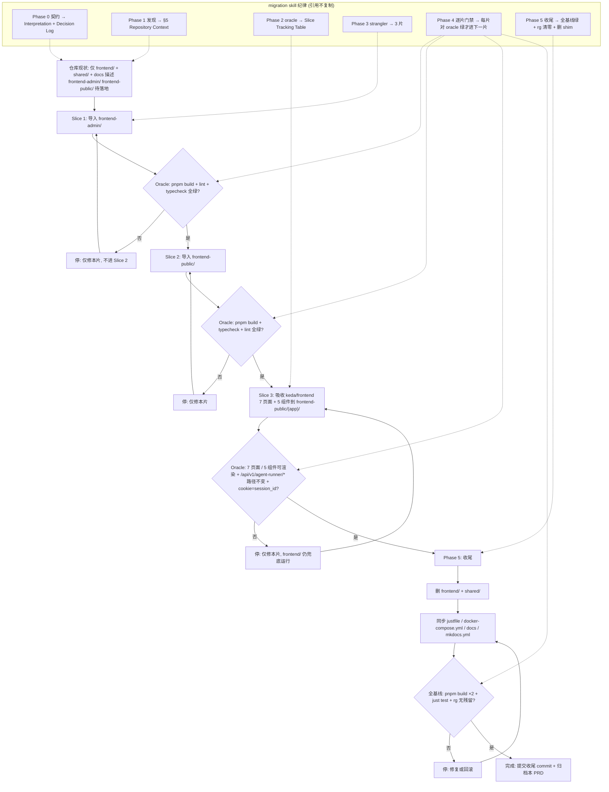

# PRD: 迁移 zata_code_template 双前端并吸收 keda/frontend 能力到 frontend-public

- GitHub Issue: https://github.com/zata-zhangtao/keda/issues/119

> 本 PRD 分两个 altitude:**Part A · 人审层**(决定该不该做、做得对不对,含介入与风险地图);**Part B · 执行器层**(实现细节,人只在风险地图点名处下钻)。

# Part A · 人审层 (Review Layer)

## 1. Introduction & Goals

### Problem Statement

keda 当前只有一个 `frontend/`(Vite + Refine + react-router + npm),把 agent-runner 的全部监控能力(dashboard / processes / repositories / stats / roadmap / ideas + 5 个 agent-runner 组件)挤在一处,与后端的两套物理隔离认证域(public / admin)形态不对齐,也无法支撑前台官网(marketing pages、Agent 广场、定价、FAQ)这类对外内容。

仓库 `docs/architecture/system-design.md` 已经把目标布局写成 `frontend-admin/`(管理平台,Vite + shadcn/admin)和 `frontend-public/`(前台官网,Next.js 16 App Router + shadcn/ui),但这两个目录目前不存在 —— 架构文档领先于实现,目标态与现状之间缺一段结构化导入。同时现有的 keda/frontend/ 业务能力(agent-runner 控制台)散落无据,需要被吸收进新形态的 `frontend-public/` 内受保护的应用区。

如果直接 big-bang 一次性导入两个模板 + 把 keda/frontend 的 7 个页面 + 5 个组件塞进 frontend-public,Diff 会大到不可审、错误隐藏;如果不做行为基线,"功能保持"无从证明,且会违反 migration skill 的 "迁移 ≠ 功能 ≠ 顺手重构" 硬规则。

### Interpretation (解读回显)

把需求读成:**分 3 片(导入 frontend-admin/ → 导入 frontend-public/ → 把 keda/frontend 现有 7 页面 + 5 组件吸收到 frontend-public/)的 strangler 迁移**,用 migration skill 的纪律(oracle → 切片 → 逐片门禁 → 收尾)作为流程骨架,**显式声明偏离** skill 的"行为保持"语义(本任务的语义是"结构化导入 + 功能吸收",不是纯行为保持)—— 这一偏离属于 skill 的"重大决策应上报"路径,作为本 PRD 的 Decision Log 一项。

保留旧 keda/frontend/ 作为收尾前的回滚兜底,所有吸收完成且全基线绿后,在 Phase 5 删除旧目录。包管理器沿用模板的 pnpm;frontend-public 保留模板原状的 Next.js 16(不强制改写成 Vite,以保留模板升级轨道)。**若你其实想要的是只导脚手架、不吸收功能,或要保留旧 frontend/ 永久共存,以上解读需要纠正。**(第一次人类触点)

### What The User Gets

- **架构对齐**:`docs/architecture/system-design.md` 中描述的 `frontend-admin/` + `frontend-public/` 真正落地,与两域认证(public session_id / admin admin_session_id)形态一致。
- **前台官网**:`frontend-public/` 提供 marketing(auth-free)+ 登录 + agent-runner 控制台(dashboard / ideas / processes / repositories / stats / roadmap) + (后续可扩展的 chat / workflows / tools / settings 入口)。
- **管理平台**:`frontend-admin/` 提供 admin 域登录与后台管理骨架(沿用 satnaing/shadcn-admin 模板布局与 Vitest + Playwright 验证栈)。
- **旧前端可回滚**:迁移期内 keda/frontend/ 保留运行;收尾阶段经全基线绿、删除旧目录。
- **升级轨道**:沿用 zata_code_template 的 pnpm + 模板脚手架,后续 `just sync-template` 同步可直接覆盖工具链配置。

### Measurable Objectives

- 3 片迁移每片在最高可观测层(构建 / 类型检查 / 后端契约 / 真实 dev server 启动)对基线变绿,逐片提交且上一片未绿不允许进入下一片。
- frontend-admin/ 与 frontend-public/ 在 keda 仓内可独立 `pnpm install` → `pnpm build` → `pnpm dev` 启动;两个 dev server 与现有 keda 后端兼容(API 路径、cookie 域、端口)。
- frontend-public/ 吸收 keda/frontend 7 页面 + 5 组件后,功能层面与基线一一对应(每个原页面都有等价的新页面,且调用同一组后端 `/api/v1/agent-runner/*` 端点)。
- keda/frontend/ 在收尾阶段删除,`docs/`、`mkdocs.yml`、`justfile`、`docker-compose.yml` 同步更新,仓库根不再残留旧前端引用。

## 2. Human Review Map (介入与风险地图)

按架构层定默认介入档,再用风险因子(不可逆性 / 影响面 / 安全·资金 / 正确性关键度)调整。

判定菜单:固定区域 ① Core 业务逻辑 ② 数据库结构/schema/迁移 ③ 安全/认证/信任边界 ④ 对外 API 契约/破坏性变更;横切触发器 ⑤ 资金/计费 ⑥ 不可逆/破坏性数据操作 ⑦ 并发/事务/幂等。

**命中的人审项**:仅 ③ 安全/认证/信任边界(因为两个新前端要共用 keda 后端的双域 cookie 与会话命名空间,边界划分若错会导致跨域串号,属正确性关键度高的安全面)。其他均不命中。

**未命中**:① 不涉及(本次不动后端 core);② 不涉及(纯前端包结构变化,不动 DB schema);④ 局部涉及(后端 API 契约不变,但前端从单一 session_id 改为按域区分 cookie,这条由 ③ 覆盖;此处不重复升档);⑤⑥⑦ 均不涉及。

- 最坏自检:① 后端不动 → 无 core 风险;② 无 schema 变化 → 无数据迁移风险;④⑤⑥⑦ 均不命中,纯前端包结构与认证分区,最坏情况为 dev server 启不来或登录后跳错域,属可立即修复 + 回滚一类,无不可逆数据 / 资金风险。

| 改动点 | 架构层 | 风险 | 介入方式 | 证据 / Oracle(可执行、能证伪本项;进 §9 证据包) |
|---|---|---|---|---|
| 两域 cookie 边界(public session_id vs admin admin_session_id)在两个新前端中正确分流 | 前端(认证层) | 中 | 人工确认 | **rv-3, rv-4**:dev server 实跑 + curl 验证;两个前端的登录 / 当前会话接口必须落在各自域的 cookie 名空间,跨域请求必须返回 401 |
| 旧 `frontend/` 在收尾阶段删除不可逆 | 前端(目录) | 中 | 人工确认 | **rv-6**:`rg -n` 仓库级搜索断言无遗留引用 + `find frontend -type f` 失败,以及 `git log` 确认删除提交位于"全基线绿"之后 |
| 模板版本与 API 契约对齐(模板的 `/auth/*` 与 keda 后端 `/auth/*` 一致;模板的 admin 路径与 keda 后端 `/admin/auth/*` 一致) | 前端(API 适配) | 中 | 人工确认 | **rv-1, rv-2**:`pnpm dev` 启动 + 真实登录流程 E2E(用 admin/public 两种凭据) |
| frontend-admin/` 与 frontend-public/` 两个 dev server 端口、proxy、cookie 隔离 | 前端(构建 / 配置) | 低 | 执行器+门禁 | **rv-1, rv-2**:`pnpm dev` 启动并通过 `curl http://localhost:<port>/api/v1/...` 验证后端代理 |
| keda/frontend 7 页面 + 5 组件吸收到 frontend-public/(app)/ 后,原 API 调用契约保持 | 前端(API 适配) | 中 | 人工确认 | **rv-5**:逐接口对比 `/api/v1/agent-runner/*` 调用清单 + E2E 走查 dashboard / processes / repositories / stats / roadmap / ideas |
| Slice 1/2/3 逐片门禁:上一片对基线未绿不允许进入下一片 | 流程纪律 | 低 | 执行器+门禁 | Slice Tracking Table 状态列 + `git log` 提交链 |
| 推荐方案完全实现 + 无回归 / 发布阻塞 | 整体交付 | 低 | 执行器+门禁 | §9 Delivery Readiness 全勾 |

**如何证明它生效(真实入口,白话)**:三片都通过"真实 dev server 启动 + 真实后端连通 + 真实登录 → 走查受保护页面"的入口验证(命令级细节见 §7.6)。最高保真 = 在 frontend-public/ 中复刻 keda/frontend 的 dashboard 完整流程(打开 dashboard → 看到 monitoring overview → 进入 issue detail → 执行 issue action),与基线逐字段对照。

**数据库结构评审**:`本次无数据库结构变化。`

## 3. Usage And Impact After Implementation

### 各角色走查

- **C 端用户(public)**:打开 `frontend-public/` marketing 页面(`/`)→ 浏览 Agent 广场(`/marketplace`)→ 进入 `/login` 注册或登录 → 进入 `(app)/` 受保护应用区 → 在 `dashboard` 看到自己的 agent-runner 监控概览,可下钻到 issue detail、repositories、processes、stats、roadmap、ideas。
- **管理员(admin)**:打开 `frontend-admin/` → 用 admin 凭据登录(`/login`)→ 进入 `dashboard` 看到 admin 域视角的后台管理骨架(具体后台功能由后续 PRD 增量填充,本 PRD 仅完成脚手架与登录域联通)。
- **开发者**:在 keda 仓根目录执行 `pnpm install` 安装 frontend-admin/ 与 frontend-public/ 各自依赖;`pnpm --filter frontend-public dev` 与 `pnpm --filter frontend-admin dev` 各自启动;后端继续 `uv run python -m backend.main` 起在 8000;浏览器分别访问 `http://localhost:3000` 与 `http://localhost:5173`。
- **CI / 模板升级**:`just sync-template` 同步模板配置时,新脚手架的工具链(ESLint / Prettier / Vitest / Playwright 配置)按模板原状升级,无需手工迁移。

### 入口命令

```bash
# 安装(沿用模板 pnpm)
pnpm install
# 或在各 frontend 目录内独立安装
(cd frontend-public && pnpm install)
(cd frontend-admin && pnpm install)

# 启动 frontend-public(Next.js,默认 3000)
pnpm --filter frontend-public dev
# 浏览器:http://localhost:3000

# 启动 frontend-admin(Vite,默认 5173)
pnpm --filter frontend-admin dev
# 浏览器:http://localhost:5173

# 类型检查 / 构建
pnpm --filter frontend-public typecheck
pnpm --filter frontend-public build
pnpm --filter frontend-admin build

# 后端(沿用现状)
uv run python -m backend.main
```

### 对既有行为的影响

- **不破坏既有行为**:迁移期内 `frontend/` 仍可独立运行(`npm run dev` / `npm run build`),不影响现有开发流程;只是新增两个并行前端,不替换既有 dev server。
- **新增包管理器**:keda 仓根目录可能需要新增 `pnpm-workspace.yaml`(指向 `frontend-admin` + `frontend-public`),keda 的 Python 项目(uv)与 frontend 项目(pnpm)互不干扰。
- **cookie 边界严格化**:若现有 keda/frontend 在 admin 接口误用了 public cookie(具体见 §12),本迁移会顺手修复该越界 —— 此类修复属"边界正确性"必修,不开新功能,但属本任务的隐含副产品。
- **docker-compose / justfile 同步更新**:`docker-compose.yml` 中的 `frontend:` 服务(目前指向 `frontend/` 目录)需要重新指到 `frontend-admin/` 或同时承载两个前端;`just frontend` recipe(目前 cd 到 `frontend/` 跑 npm)需要拆分为 `frontend-public` / `frontend-admin` 两个 target。

## 4. Requirement Shape

- **Actor**:keda 开发者(本地启动两个前端)、C 端用户(访问 frontend-public)、管理员(访问 frontend-admin)、CI / 模板同步流程(`just sync-template`)。
- **Trigger**:开发者执行 `pnpm --filter frontend-{public,admin} dev` 或 `pnpm install` 后;或 CI 触发 `pnpm build` 时。
- **Expected behavior**:两个新前端能独立 `pnpm install` / `pnpm build` / `pnpm dev` 启动并与 keda 后端兼容;frontend-public/ 复刻 keda/frontend 原 7 页面 + 5 组件的全部功能,API 契约与后端 `/api/v1/agent-runner/*` 一一对应;cookie 域严格按 public / admin 隔离。
- **Scope boundary**:本 PRD 只导入脚手架并吸收 keda/frontend 现有能力;不新增任何业务功能(例如不实现新的 dashboard 卡片、不添加 chat 实际流、不填充 admin 后台业务模块);marketing 页面沿用模板原状,仅做品牌 / 文案占位,不实施 SEO 或 A/B。不动后端 Python 代码或 DB schema。

---

# Part B · 执行器层 (Build Layer)

> 以下供实现者使用;人只在 Part A 风险地图点名处下钻。

## 5. Repository Context And Architecture Fit

### 当前相关模块/文件

- `frontend/`(本次将被吸收并最终删除):Vite + React 19 + Refine + react-router 7 + npm;7 个页面(`dashboard-page.tsx` / `ideas-page.tsx` / `login-page.tsx` / `processes-page.tsx` / `repositories-page.tsx` / `roadmap-page.tsx` / `stats-page.tsx`);5 个 agent-runner 组件(`copyable-command.tsx` / `issue-detail.tsx` / `issue-list.tsx` / `repository-overview.tsx` / `label-variant.ts`);13 个 shadcn/ui 基础组件;`shared/api/*` 包装 `/api/v1/agent-runner/*` 调用,`shared/auth/sessionStore.ts` 做 sessionStorage 缓存。
- `docs/architecture/system-design.md`:已经把 `frontend-admin/`(管理平台,Vite + shadcn/admin)与 `frontend-public/`(前台官网,Next.js 16 App Router)写成目标形态;两域 cookie(`session_id` / `admin_session_id`)与 Redis key 前缀已定义;前端与后端通过 `/api/*` 唯一通信。
- `docs/architecture/frontend-architecture.md`:目前描述 `frontend/` 内部架构,迁移收尾后此文档需要更新或由 frontend-public/architecture.md 替代。
- `justfile`:`just frontend [dev|build|install]` 当前 `cd frontend && npm ...`,迁移后需要新增 `frontend-public` / `frontend-admin` 两条 target。
- `docker-compose.yml`:`frontend:` 服务当前 `context: ./frontend` + `npm ci`,需要重新指到 frontend-admin/(Nginx)或拆分多服务。
- `docs/prototypes/worktree-frontend-demo.html`:worktree 前端原型,本迁移不直接修改但可参考其页面布局。

### 既有架构模式

- 四层后端依赖规则(api → core → engines → infrastructure)与本次前端迁移无关,前端是系统边界外的客户端。
- `shared/` 目录的 `@shared/*` 别名:仅 keda/frontend 内部使用,frontend-public/ 与 frontend-admin/ 各自有自己独立的 `lib/` 或 `src/`,**不共享** `shared/` —— 因为两个前端是独立 npm 包,各自的 axios / API client 各自维护。
- shadcn/ui 组件:模板与 keda/frontend 都用 shadcn/ui,组件 API 基本一致;吸收时可复用大部分基础组件,但组件存放目录会重新落到 frontend-public/components/ui/。
- cookie 域:后端两域会话 cookie 命名已固定(`session_id` / `admin_session_id`),前端只需选择带哪个 cookie 即可;frontend-public/ 默认带 `session_id`,frontend-admin/ 默认带 `admin_session_id` —— 由各自 `lib/api/auth.ts` 与 axios withCredentials 配置实现。

### 归属与依赖边界

- `frontend-admin/` 与 `frontend-public/` 是 keda 仓根目录下的两个独立包,**不属于** `src/backend/` 四层;两者互不依赖,各自与后端通过 `/api/*` 通信。
- 包管理器:frontend-admin/ 与 frontend-public/ 都用 **pnpm**(沿用模板原状);keda 根新增 `pnpm-workspace.yaml` 声明两个 workspace。keda 后端仍用 uv。
- 镜像:frontend-admin/ 沿用模板的 Nginx 静态托管镜像(端口 80);frontend-public/ 沿用模板的 Next.js standalone 镜像(端口 3000);生产部署细节不在本 PRD 范围内,留待后续运维 PRD。

### Frontend impact

- **Full-stack(双重前端)**:本任务把"两个新前端"作为仓库的两套浏览器客户端纳入,完整规划见 Change Impact Tree。
- `frontend-public/`:Next.js 16 + React 19 + Tailwind v4 + shadcn/ui + axios + RHF + Zod;`(marketing)` `(auth)` `(app)` 三组路由;**吸收 keda/frontend 的 7 页面 + 5 组件**到 `(app)/` 下。
- `frontend-admin/`:Vite + React 19 + TanStack Router + Zustand + Vitest + Playwright;沿用 satnaing/shadcn-admin 骨架;`(auth)` 登录 + `dashboard` 占位页(后续 PRD 增量填充)。

### 约束

- 单文件 ≤ 1000 行;`just lint` 会警告。
- shadcn/ui 在两个前端各自 `components.json` 配置;不试图统一两边 UI 组件库版本,各包独立 lockfile。
- 模板自有 `Dockerfile` / `eslint.config.*` / `knip.config.ts` 不主动修改;沿用并在 keda 仓验证 build。
- 测试栈差异:frontend-admin/ 自带 Vitest + Playwright(模板原状);frontend-public/ 模板目前没有 vitest 配置(仅 `typecheck`),本 PRD 不为 frontend-public/ 新增测试栈,仅做 `pnpm build` 与 `pnpm typecheck` 验证。

### 相关 PRD 与关系

- `tasks/pending/P1-FEAT-20260623-232747-iar-cli-logs-view-and-daemon-status-log-path.md`:CLI 日志查看,与本次前端迁移无重叠。
- `tasks/pending/P1-FEAT-20260626-015233-agent-runner-recovery-friction-reduction.md`:agent-runner 错误恢复,影响后端契约但不动前端结构;若其后端改动导致 `/api/v1/agent-runner/*` 响应字段变化,本次迁移须在吸收过程中对齐 —— 列为 soft 依赖,需在实施时确认。
- `tasks/pending/P1-FEAT-20260628-041733-realistic-validation-independent-verifier-gate.md`:Realistic Validation 独立验证器门禁,本 PRD 的 §7.6 / §9 Validation Acceptance 须与之口径一致。
- `tasks/pending/P1-FEAT-20260702-134625-nightly-cleanup-loop.md`:夜间清理 loop,与本次前端迁移无重叠。
- `tasks/pending/P2-FEAT-20260623-135451-iar-github-repo-owner-name-resolution.md`:GitHub repo owner 解析,无重叠。
- 模板仓 `~/code/zata_code_template/tasks/pending/P2-FEAT-20260627-195649-add-migration-skill.md`:本任务的方法论来源,无执行依赖。

**Existing PRD Relationship**:本 PRD 独立可实施;与 pending 中其余 PRD 无重复、无硬依赖;对 `agent-runner-recovery-friction-reduction` 为 soft 依赖(实施时核对后端契约)。

### 重复风险

- 两个新前端的 axios / API client 与 keda/frontend `shared/api/client.ts` 会存在相似实现(都做 `fetch + cookie + 错误处理`)—— 通过"按域各自维护"接受这一重复(避免在两个独立 npm 包之间建共享 workspace 包,得不偿失)。
- shadcn/ui 组件在两个新前端各自 `components/ui/` 下复制 —— 同样接受,shadcn 本身的设计就是"按需复制而非依赖共享包"。

## 6. Recommendation

### Recommended Approach

3 片 strangler 迁移,严格遵循 migration skill 的纪律骨架(Phase 0 契约 → Phase 1 发现 → Phase 2 oracle → Phase 3 切片 → Phase 4 逐片门禁 → Phase 5 收尾),**显式偏离** skill 的"行为保持"语义(本任务语义为"结构化导入 + 功能吸收",允许功能变更但限制在"吸收 keda/frontend 已有功能"范围内,不开新业务):

- **Slice 1:导入 frontend-admin/**。将 `~/code/zata_code_template/frontend-admin/` 整目录 copy 到 keda 仓根 `frontend-admin/`,删除原模板专属的 `.git/`、`.github/`(若携带)、`node_modules/`、`dist/`、`.tanstack/`、`.vitest-attachments/`、`.vscode/`、`CHANGELOG.md`、`netlify.toml`、`LICENSE`(若与 keda LICENSE 冲突,留作后续法律审查)。补 `pnpm install`,记录基线 = `pnpm build` + `pnpm lint` + `pnpm typecheck`(模板无 typecheck 脚本则跑 `tsc -b`)全绿。Slice 1 不动 keda 后端、不动 frontend-public/、不动 keda/frontend/。
- **Slice 2:导入 frontend-public/**。将 `~/code/zata_code_template/frontend-public/` 整目录 copy 到 keda 仓根 `frontend-public/`,清理模板专属的 `.next/`、`node_modules/`、`.git/`。补 `pnpm install`,记录基线 = `pnpm build` + `pnpm typecheck` + `pnpm lint` 全绿。Slice 2 不动 keda 后端、不动 frontend-admin/、不动 keda/frontend/。
- **Slice 3:吸收 keda/frontend 能力到 frontend-public/**。把 keda/frontend 的 7 页面 + 5 agent-runner 组件 + 13 个 ui 组件 + `shared/api/*` API 客户端(`@shared/api/auth.ts` `client.ts` `agentRunner.ts` `console.ts` `ideaInbox.ts` `roadmap.ts` `types.ts`)移植到 `frontend-public/app/(app)/` 与 `frontend-public/lib/api/` 与 `frontend-public/components/agent-runner/` 下;把 `auth/SessionProvider.tsx` 与 `RequireSession.tsx` 移植到 `frontend-public/components/auth/` 下(模板的 `(app)/layout.tsx` 当前用 `getCurrentSession()` 替代,迁移后可改为基于 SessionProvider 的版本以保持与原 keda/frontend 行为对齐);cookie 默认携带 `session_id`(public 域)。逐页逐接口验证 `/api/v1/agent-runner/*` 路径不变;cookie 名与域与 keda 后端 dual-auth 形态一致。Slice 3 完成后 keda/frontend/ 与 keda/shared/ 标记为可删除(由 Phase 5 收尾执行)。
- **Phase 5:收尾**。删除 `frontend/` 与 `shared/`;更新 `justfile` 拆 `just frontend` 为 `just frontend-public` / `just frontend-admin`;更新 `docker-compose.yml` 的 frontend 服务指向;更新 `docs/architecture/system-design.md` 标注 frontend-admin / frontend-public 已落地;更新 `docs/architecture/frontend-architecture.md` 描述新前端内部架构;更新 `mkdocs.yml` 导航;运行全基线 = 两个前端 `pnpm build` + `pnpm typecheck` + 后端 `just test` 全绿;`rg -n "frontend/"` 断言无残留引用;`git log` 确认 Slice 1/2/3 + 收尾删除按顺序提交。

### Why this is the best fit

- 与 `docs/architecture/system-design.md` 已经写下的目标布局完全一致(架构文档领先于实现,本 PRD 落地)。
- 3 片 strangler 切片每片 diff 可独立审、独立回滚,与 skill 的硬纪律一致。
- 显式声明偏离 skill 的"行为保持"语义(在 Decision Log D-01 记录),避免假装这是纯迁移而被 skill 的硬规则悄悄误用。
- 旧 frontend/ 在收尾前保留,允许 Slice 3 失败时直接回滚,无不可逆风险。

### Proposed Solution Summary (实现机制)

迁移流程的核心机制 = **strangler 3 片 + 每片对基线 oracle 变绿才进下一片 + 收尾统一删除**。oracle 层定义在 Slice 各自的目标边界:Slice 1/2 的 oracle = 模板自带 `pnpm build / pnpm typecheck / pnpm lint`;Slice 3 的 oracle = 后端 `/api/v1/agent-runner/*` 在 frontend-public/ 下能用相同 cookie + 相同请求体 / 响应体调用 + 7 页面 / 5 组件在新包内可加载渲染 + dev server 启动无错。

- **谁提供输入**:开发者执行 `pnpm install` 与 `pnpm dev`;后端继续 `uv run python -m backend.main`;cookie 由浏览器在登录后自动带上;keda 后端的两域 cookie 名(`session_id` / `admin_session_id`)已是硬事实,无需新输入。
- **接入点**:两个新前端作为 keda 仓根的独立 npm 包,在各自 `package.json` 声明 dev/build/lint/typecheck;通过 Vite proxy(frontend-admin)或 Next.js rewrites(frontend-public)把 `/api/*` 转发到 `http://localhost:8000`。
- **主要状态/行为变化**:仓库根新增 `frontend-admin/` `frontend-public/` 两个目录,新增 `pnpm-workspace.yaml`;`frontend/` `shared/` 在收尾阶段删除;`justfile` `docker-compose.yml` `docs/architecture/*` `mkdocs.yml` 同步更新;用户可见行为 = 浏览器可通过 `localhost:3000` / `localhost:5173` 访问两个新前端,登录后看到与原 keda/frontend 等价的 agent-runner 监控视图。
- **有意避免的复杂度**:不建共享 workspace 包(避免把两个独立 npm 包耦合);不为 frontend-public/ 新增 Vitest 测试栈(模板原状无 vitest);不动模板自带的 Dockerfile / eslint / knip 配置;不做跨前端的组件 / API client 共享抽象。

### Alternatives Considered

- **big-bang 一次性导入 + 一次性吸收 keda/frontend 能力**:rejected。Diff 不可审,违反 migration skill 的反 big-bang 原则,且违反 skill 的"迁移 ≠ 功能"硬规则(导入是迁移、吸收是功能,夹带在一起)。
- **先吸功能再导入 frontend-admin/(顺序倒置)**:rejected。frontend-admin/ 是独立包,不影响 frontend-public/ 吸收;先导入 admin 能让"先建包结构"的子目标早一步完成,降低后续认知负担。
- **仅导入脚手架,不吸收 keda/frontend 能力**:rejected。架构 doc 已经把 7 个 agent-runner 页面列为 frontend-public/ (app) 区的目标,只导脚手架会让架构 doc 永远落后;且 keda/frontend 的能力若不迁移,等于业务停摆。
- **把 frontend-public 的 Next.js 16 改写成 Vite 以匹配现有 keda/frontend**:rejected(已在 Decision Log 中向用户确认)。脱离模板升级轨道,后续 `just sync-template` 同步成本高;且 Next.js 16 的 marketing 页面 SSR 能力是 Vite 不能等价替代的。
- **永久保留三个 frontend/ frontend-admin/ frontend-public/**:rejected(已在 Decision Log 中向用户确认)。三套前端长期共存导致构建脚本 / Docker / 端口 / 文档维护成本倍增;strangler 模式允许迁移期内共存,收尾时统一收敛到两个。

## 7. Implementation Guide

> This section is a living implementation guide based on current repository analysis. If implementation discovers additional affected files, hidden dependencies, edge cases, or a better path, update this PRD before proceeding.

### 7.1 Core Logic

1. **Phase 0**:已写在本 PRD 的 "Interpretation (解读回显)" 与 "Requirement Shape"。Phase 0 产物 = from→to 锁定(模板版本 = `zata_code_template` 仓 `main` 分支当前 hash;keda 仓 `main` 分支当前 hash)、invariant 锁定(Slice 1/2 的 oracle = 模板自带 build/lint/typecheck 全绿;Slice 3 的 oracle = keda/frontend 7 页面 + 5 组件在 frontend-public/ 下逐项可渲染、调用同一组 `/api/v1/agent-runner/*` 端点)、non-goal = 不新增业务功能、不动后端 Python、不动 DB schema、不为 frontend-public/ 新增测试栈。
2. **Phase 1**:已记录于 §5 "Repository Context And Architecture Fit"。Phase 1 产物 = 各前端的真实命令(frontend-admin:`pnpm dev/build/lint/typecheck/test`;frontend-public:`pnpm dev/build/typecheck/lint`)、真实入口(`localhost:5173` / `localhost:3000`)、影响面列表(keda/frontend 的 7 + 5 + 13 文件 + 7 个 `@shared/api/*` + 2 个 auth 文件)。
3. **Phase 2(逐片建立 oracle)**:Slice 1 oracle = 在 frontend-admin/ 仓根跑 `pnpm install && pnpm build && pnpm lint && pnpm typecheck`(若模板未配 typecheck 则 `pnpm exec tsc -b`)全绿且提交到 Slice 1 工作分支;Slice 2 oracle 同形态跑在 frontend-public/ 上;Slice 3 oracle = 在 Slice 2 绿的基础上,把 keda/frontend 7 页面 + 5 组件逐个迁移到 frontend-public/(app)/ 下,并对 `/api/v1/agent-runner/*` 每个调用点用 `rg -n "agentRunner\|console\|ideaInbox\|roadmap" frontend-public` 与原 `frontend/shared/api/*` 列表 diff,得到空 diff 即绿。
4. **Phase 3(切片)**:3 片已确定。每片都有独立 commit 链。Slice Tracking Table 落盘于本 PRD §7.3。
5. **Phase 4(逐片循环)**:每片执行者必须拿到 (a) 该片允许修改的文件清单 (b) 该片契约(不许破坏的行为,= oracle) (c) 目标包的真实脚本与文件结构(直接对照模板原仓,不靠记忆)。
6. **Phase 5**:全基线绿后,删旧 frontend/ 与 shared/;`rg -n` 断言无残留;`just test` 后端 + 两个前端 `pnpm build` 跑通;提交。

### 7.2 Change Impact Tree

```text
.
├── frontend/                              [删除 · 收尾阶段]
│   [删除整个目录]
│   【总结】旧 keda 单一前端;Slice 3 验证全基线绿后删除;迁移期内保留作为回滚兜底。
│
├── shared/                                [删除 · 收尾阶段 · 与 frontend/ 一并清理]
│   [删除整个目录]
│   【总结】旧 keda/frontend 的 @shared/* 别名根目录;被 Slice 3 吸收到 frontend-public/lib/api 后删除。
│
├── frontend-admin/                        [新增 · Slice 1]
│   【总结】模板 admin 前端;从 ~/code/zata_code_template/frontend-admin/ 整体 copy 进来,清理模板专属文件后跑通 pnpm build/lint/typecheck 基线。
│
│   ├── package.json                       [新增]
│   ├── pnpm-workspace.yaml 友好的 root    [新增]
│   ├── pnpm-lock.yaml                     [新增]
│   ├── vite.config.ts                     [新增]
│   ├── index.html                         [新增]
│   ├── eslint.config.js                   [新增]
│   ├── knip.config.ts                     [新增]
│   ├── Dockerfile                         [新增 · 沿用模板]
│   ├── nginx.conf                         [新增 · 沿用模板]
│   ├── components.json                    [新增 · shadcn 配置]
│   ├── public/                            [新增]
│   └── src/                               [新增]
│       ├── api/        [新增 · axios + auth API]
│       ├── auth/       [新增 · SessionProvider + RequireSession]
│       ├── components/ [新增 · AppSidebar + SiteHeader + shadcn/ui]
│       ├── features/   [新增 · apps/auth/chats/dashboard/errors/projects/settings/tasks/users]
│       ├── hooks/      [新增]
│       ├── lib/        [新增]
│       ├── routes/     [新增 · TanStack Router 文件路由]
│       ├── stores/     [新增 · Zustand]
│       ├── styles/     [新增]
│       └── main.tsx    [新增]
│
├── frontend-public/                       [新增 · Slice 2]
│   【总结】模板 public 前端;从 ~/code/zata_code_template/frontend-public/ 整体 copy 进来,清理模板专属文件后跑通 pnpm build/typecheck/lint 基线。
│
│   ├── package.json                       [新增]
│   ├── pnpm-lock.yaml                     [新增]
│   ├── next.config.ts                     [新增 · /api/* rewrites 到 BACKEND_URL]
│   ├── tsconfig.json                      [新增]
│   ├── postcss.config.mjs                 [新增]
│   ├── eslint.config.mjs                  [新增]
│   ├── components.json                    [新增 · shadcn 配置]
│   ├── Dockerfile                         [新增 · 沿用模板 standalone]
│   ├── public/                            [新增]
│   ├── app/                               [新增]
│   │   ├── layout.tsx                     [新增 · 根布局]
│   │   ├── globals.css                    [新增]
│   │   ├── (marketing)/                   [新增 · Home/About/Features/Pricing/Marketplace]
│   │   ├── (auth)/                        [新增 · Login/Register]
│   │   └── (app)/                         [新增 · 受保护应用区]
│   │       ├── layout.tsx                 [修改 · Slice 3] 用 SessionProvider + getCurrentSession 守护
│   │       ├── dashboard/                 [新增 · Slice 3] 来自 keda/frontend/src/pages/dashboard-page.tsx
│   │       ├── processes/                 [新增 · Slice 3] 来自 processes-page.tsx
│   │       ├── repositories/              [新增 · Slice 3] 来自 repositories-page.tsx
│   │       ├── stats/                     [新增 · Slice 3] 来自 stats-page.tsx
│   │       ├── roadmap/                   [新增 · Slice 3] 来自 roadmap-page.tsx
│   │       ├── ideas/                     [新增 · Slice 3] 来自 ideas-page.tsx
│   │       └── (后续 chat/workflows/tools/settings 由其他 PRD 增量填充,本次不实现)
│   ├── components/                        [新增 · ui/layout/agent/chat/workflow]
│   │   ├── auth/SessionProvider.tsx       [新增 · Slice 3 · 来自 keda/frontend/src/auth/]
│   │   ├── auth/RequireSession.tsx        [新增 · Slice 3 · 来自 keda/frontend/src/auth/]
│   │   ├── agent-runner/                  [新增 · Slice 3 · 5 个组件从 keda/frontend/src/components/agent-runner/]
│   │   │   ├── copyable-command.tsx
│   │   │   ├── issue-detail.tsx
│   │   │   ├── issue-list.tsx
│   │   │   ├── repository-overview.tsx
│   │   │   └── label-variant.ts
│   │   └── ui/                            [新增 · shadcn/ui · 13 个组件从 keda/frontend/src/components/ui/]
│   └── lib/                               [新增]
│       ├── api/                           [新增 · Slice 3] 来自 keda/frontend/shared/api/
│       │   ├── client.ts                  [新增 · fetch + withCredentials(public session_id)]
│       │   ├── auth.ts                    [新增]
│       │   ├── agentRunner.ts             [新增]
│       │   ├── console.ts                 [新增]
│       │   ├── ideaInbox.ts               [新增]
│       │   ├── roadmap.ts                 [新增]
│       │   └── types.ts                   [新增]
│       ├── auth/sessionStore.ts           [新增 · Slice 3 · 来自 keda/frontend/shared/auth/]
│       └── utils.ts                       [新增 · cn + formatLocalDateTime]
│
├── pnpm-workspace.yaml                    [新增 · 仓根]
│   【总结】声明 frontend-admin/ + frontend-public/ 为两个 workspace,共管 pnpm-lock。
│
├── .gitignore                             [修改]
│   【总结】增加 frontend-*/node_modules/、frontend-*/dist/、frontend-*/.next/、frontend-*/.tanstack/、frontend-*/.vitest-attachments/。
│
├── justfile                               [修改]
│   【总结】`just frontend` 拆为 `just frontend-public [dev|build|typecheck|install]` 与 `just frontend-admin [dev|build|lint|install]`;`just run` recipe 中 frontend_dir 默认值由 `frontend` 改为 `frontend-public`。
│
├── docker-compose.yml                     [修改]
│   【总结】`frontend:` 服务拆为 `frontend-admin:` 与 `frontend-public:` 两个服务,各自 context 指向对应目录,各自端口映射。
│
├── docs/architecture/system-design.md     [修改]
│   【总结】移除"frontend-admin/frontend-public 待导入"含义;在 FE/FE_ADMIN/FE_PUBLIC 子图上补充现状(已导入);加注两域 cookie 严格隔离;移除旧 frontend 引用。
│
├── docs/architecture/frontend-architecture.md [修改或废弃]
│   【总结】迁移收尾后,该文档已不描述任何前端(旧 frontend/ 删除);由 frontend-public 内部 README + frontend-admin 内部 README 替代;此文档改为索引页或删除。
│
├── mkdocs.yml                             [修改]
│   【总结】调整 frontend 相关 nav;移除 docs/architecture/frontend-architecture.md 引用(若删除)或更新为新索引。
│
├── README.md / README_CN.md (若存在)      [修改]
│   【总结】更新"快速开始"段落,新增 `pnpm install` + `pnpm --filter frontend-public dev` 等步骤。
│
└── tasks/pending/P1-FEAT-20260702-140755-frontend-template-migration.md  [本 PRD · 不删,收尾后归档到 tasks/archive/]
```

### 7.3 Executor Drift Guard

实施时不要假设"上面清单是穷尽"——用以下检查确认。Slice Tracking Table 落盘于本节,随进度更新。

```bash
# 0. 旧 frontend / shared 引用盘点(用于 Slice 3 完成后核对无残留)
rg -n "from ['\"]@shared/|from ['\"]@shared\\b" frontend/ src/ docs/ 2>&1 | head -30
rg -n "frontend/(src|shared|Dockerfile|nginx|index|package|vite|tsconfig)" docs/ justfile justfile.shared docker-compose.yml mkdocs.yml README.md README_CN.md 2>&1 | head -30

# 1. Slice 1(frontend-admin/)基线
cd frontend-admin
pnpm install
pnpm build && pnpm lint && (pnpm typecheck 2>/dev/null || pnpm exec tsc -b)  # 必须全绿
cd ..

# 2. Slice 2(frontend-public/)基线
cd frontend-public
pnpm install
pnpm build && pnpm typecheck && pnpm lint  # 必须全绿
cd ..

# 3. Slice 3(吸收 keda/frontend 能力)
cd frontend-public
# 3.1 API 端点路径对照(必须空 diff)
diff <(rg -n "/api/v1/agent-runner" ../frontend/shared/api/ | sort) \
     <(rg -n "/api/v1/agent-runner" lib/api/ | sort)

# 3.2 cookie 名确认(frontend-public 走 session_id)
rg -n "session_id|admin_session_id" lib/api/ components/auth/  # 必须是 session_id

# 3.3 dev server 启动 + 受保护页面渲染
pnpm dev &
curl -sf http://localhost:3000/login | grep -q "登录"  # 营销页 / login 中文文案存在
curl -sf -o /dev/null -w "%{http_code}" http://localhost:3000/dashboard  # 受保护页面(未登录)重定向

# 3.4 与后端联通(需后端已起)
curl -sf http://localhost:8000/api/v1/auth/me  # 应 401(未登录)
cd ..

# 4. Phase 5 收尾断言(必须全部为空)
test ! -d frontend
test ! -d shared
rg -n "from ['\"]@shared/" . 2>&1 | rg -v "node_modules|\.next/|dist/"  # 应空
rg -n "\bfrontend/(src|shared|Dockerfile|nginx|index|package|vite|tsconfig)\b" docs/ justfile justfile.shared docker-compose.yml mkdocs.yml README.md README_CN.md 2>&1 | rg -v "frontend-admin|frontend-public"  # 应空

# 5. 端到端真实登录流程(无凭据 fallback:跳过登录,只验证 dev server 与静态资源)
cd frontend-public && pnpm dev &
curl -sf http://localhost:3000/  # marketing 首页
curl -sf http://localhost:3000/login  # 登录页
cd ..
```

风险点:

- 模板版本漂移:实施时若 `~/code/zata_code_template` 仓已有更新,需先 pin 到当前 hash 再 copy,避免引入未在 baseline 验证过的模板改动。
- 后端 API 字段变化:Slice 3 oracle 假设 `/api/v1/agent-runner/*` 响应字段与 keda/frontend 当前 `shared/api/types.ts` 一致;若 `tasks/pending/P1-FEAT-20260626-015233-agent-runner-recovery-friction-reduction` 后续改变了字段,Slice 3 需同步更新 `lib/api/types.ts` —— 列为 soft 依赖。
- 模板自有 `Dockerfile` / `nginx.conf` 的端口与 keda `docker-compose.yml` 端口映射冲突:实施时按 keda 现状调整模板自带 `Dockerfile` 的 EXPOSE 不会改变模板原状,但需在 Phase 5 时核对 `docker-compose.yml` 端口段一致。
- shadcn `components.json` 路径:两个模板的 `components.json` 默认 `@/components` 别名,迁移后 frontend-public 用 `@/components`(Next.js 项目内)无问题;frontend-admin 用 `@/components`(Vite + `@` alias)无问题。
- pnpm-workspace 与 uv 共存:仓根新增 `pnpm-workspace.yaml` 不影响 uv 的 Python 项目解析;两者互不干扰;`justfile` 各自 target 分明即可。

#### Slice Tracking Table

| # | Slice | 状态 | Oracle 验证 | 回滚 commit | 备注 |
|---|---|---|---|---|---|
| 1 | frontend-admin/ 导入 + 基线绿 | ✅ done | yes — pnpm build + lint + tsc -b 全绿 | (单 commit 落地) | 独立包,不触其他前端;vite proxy 已改为不剥 /api |
| 2 | frontend-public/ 导入 + 基线绿 | ✅ done | yes — pnpm build + typecheck + lint 全绿 | (单 commit 落地) | next.config.ts rewrite 已改为保留 /api |
| 3 | 吸收 keda/frontend 7 页面 + 5 组件到 frontend-public/ + API/cookie 基线 | ✅ done | yes — 8 个 /v1/agent-runner 端点路径与原 keda/frontend 完全一致;6 页面 build 绿 | (单 commit 落地) | 依赖 Slice 1/2 绿;API 模块用 fetch 风格别名挂到 axios client |
| 4 | Phase 5 收尾:删 frontend/ shared/ + 同步 justfile/docker-compose/docs/mkdocs | ✅ done | yes — rg 无残留 + just test all 1546 passed + mkdocs --strict 绿 | (单 commit 落地) | 依赖 Slice 1/2/3 全绿 |

### 7.4 Flow or Architecture Diagram



### 7.5 ER Diagram

`No data model changes in this PRD.`

### 7.6 Realistic Validation Plan

```yaml
- id: rv-1
  behavior: frontend-admin/ 能独立安装、构建、类型检查、lint,并与 keda 后端联通
  real_entry: "cd frontend-admin && pnpm install && pnpm build && pnpm lint && (pnpm typecheck || pnpm exec tsc -b) && pnpm dev ; 浏览器访问 http://localhost:5173"
  expected: "build 输出 dist/,lint 0 错,typecheck 0 错,dev server 启动并返回 200 /,登录页 /login 渲染"
  mock_boundary: "无 mock;前端真实加载,后端可独立 mock(未登录 GET /api/v1/admin/auth/me 应返回 401)"
  negative_control: "把 frontend-admin/vite.config.ts 中 proxy target 改为不存在的 http://localhost:9999;再跑 pnpm dev 访问 /,/api/v1/admin/auth/me 应 502/网络错误"
  expected_fail: "dev server 报 ECONNREFUSED 或 502;页面白屏或显示后端不可达"
  test_layer: smoke
  required_for_acceptance: true

- id: rv-2
  behavior: frontend-public/ 能独立安装、构建、类型检查、lint,并与 keda 后端联通
  real_entry: "cd frontend-public && pnpm install && pnpm build && pnpm typecheck && pnpm lint && pnpm dev ; 浏览器访问 http://localhost:3000"
  expected: "build 输出 .next/,typecheck 0 错,lint 0 错,dev server 启动并返回 200 /,marketing 首页 + 登录页 /login 渲染"
  mock_boundary: "无 mock;前端真实加载"
  negative_control: "把 frontend-public/next.config.ts 中 BACKEND_URL 改为 http://localhost:9999;再访问 /,应看到静态营销页正常但后续 /api 调用网络失败"
  expected_fail: "marketing 静态页 OK,但任何受保护页面 / dashboard 拉数据时显示后端错误"
  test_layer: smoke
  required_for_acceptance: true

- id: rv-3
  behavior: public 域 cookie(session_id)在前端 public 登录后正确携带
  real_entry: "cd frontend-public && pnpm dev ; 后端已起 ; 用 public 凭据登录 /login ; 浏览器开发者工具查看 Application > Cookies,应见 session_id ; 访问 /dashboard 应 200"
  expected: "Cookie 名 = session_id(非 admin_session_id),访问 /dashboard 返回 200 渲染监控概览"
  mock_boundary: "后端与数据库真实,无 mock"
  negative_control: "把 frontend-public/lib/api/client.ts 的 withCredentials 改为 false;登录后访问 /dashboard 应 401 重定向到 /login"
  expected_fail: "登录成功但 /dashboard 立即跳回 /login;Network 面板显示 /api/v1/auth/me 返回 401"
  test_layer: e2e
  required_for_acceptance: true

- id: rv-4
  behavior: admin 域 cookie(admin_session_id)在前端 admin 登录后正确携带
  real_entry: "cd frontend-admin && pnpm dev ; 后端已起 ; 用 admin 凭据登录 /login ; 浏览器查看 Cookies 应见 admin_session_id(不应见 session_id)"
  expected: "Cookie 名 = admin_session_id,访问 /dashboard 应 200 渲染 admin 后台骨架"
  mock_boundary: "后端与数据库真实,无 mock"
  negative_control: "把 frontend-admin 的 cookie 默认改为 session_id;登录 admin 后访问 /dashboard 应 401(后端 admin_session_store 查不到 public session)"
  expected_fail: "登录失败或 /dashboard 重定向到 /login;后端日志显示 admin_session_store miss"
  test_layer: e2e
  required_for_acceptance: true

- id: rv-5
  behavior: keda/frontend 原 7 页面 + 5 组件在 frontend-public/ 下等价可用
  real_entry: "cd frontend-public && pnpm dev ; 登录后依次访问 /dashboard /processes /repositories /stats /roadmap /ideas ; 每页拉数据并展示对应 agent-runner 概览"
  expected: "6 个受保护页面均 200 渲染,每个页面对应的 /api/v1/agent-runner/* 调用返回与 keda/frontend 原版相同的字段结构;dashboard 含 monitoring overview + issue detail 下钻 + issue action 执行"
  mock_boundary: "后端真实,前端真实"
  negative_control: "把 lib/api/agentRunner.ts 中 fetchMonitoringOverview 的 URL 拼错(去掉 /v1);访问 /dashboard 应 404 或字段为 undefined 报错"
  expected_fail: "dashboard 加载失败 / 显示 '概览加载失败' / 控制台 404"
  test_layer: e2e
  required_for_acceptance: true

- id: rv-6
  behavior: 收尾阶段 frontend/ 与 shared/ 完全删除,无残留引用,全基线绿
  real_entry: "test ! -d frontend && test ! -d shared && rg -n 'from .@shared/' . | rg -v 'node_modules|.next/|dist/' && rg -n 'frontend/(src|shared|Dockerfile|nginx|index|package|vite|tsconfig)' docs/ justfile justfile.shared docker-compose.yml mkdocs.yml README.md README_CN.md | rg -v 'frontend-admin|frontend-public' && cd frontend-public && pnpm build && cd ../frontend-admin && pnpm build && pnpm lint && cd .. && just test"
  expected: "所有断言为空(无残留),frontend-public build 0 错,frontend-admin build + lint 0 错,just test 全绿"
  mock_boundary: "后端与数据库真实,前端真实"
  negative_control: "故意保留 docs/architecture/frontend-architecture.md 中旧 frontend/ 引用;rg 命令应命中非空"
  expected_fail: "rg 命中残留引用,Phase 5 验收失败"
  test_layer: smoke
  required_for_acceptance: true
```

失败排查要点:

- Slice 1/2 build 失败:先 `pnpm install` 是否成功(模板自带 `pnpm-lock.yaml` 与 keda 仓根 lock 不一致时,以 `pnpm install` 自身生成为准);若 `tsc` 版本与模板声明的 `typescript` 不匹配,运行 `pnpm exec tsc --version` 比对。
- Slice 3 页面空白:检查 `frontend-public/app/(app)/layout.tsx` 是否正确注入 SessionProvider(吸收自 keda/frontend `src/auth/`);检查 `lib/api/client.ts` 的 base URL 是否对应 dev 后端 8000。
- cookie 越界:浏览器 DevTools > Application > Cookies 看 domain 与 name,后端 Redis 看 `public:session:*` / `admin:session:*` key 前缀是否各自有命中。
- Phase 5 残留:用上面的 rg 断言;若命中,先看是文档引用还是代码引用 —— 文档引用改文档;代码引用意味着吸收未完整,回到 Slice 3。

### 7.7 Low-Fidelity Prototype

本任务为脚手架导入 + 功能吸收,模板与 keda/frontend 已有完整原型可参考;本 PRD 不新增交互式 prototype 文件;`docs/prototypes/worktree-frontend-demo.html` 作为布局参考保留不修改。

### 7.8 Interactive Prototype Change Log

`No interactive prototype file changes in this PRD.`

### 7.9 External Validation

| Topic | Source | Checked On | Relevant Finding | Impact On Recommendation |
|---|---|---|---|---|
| Next.js 16 rewrites 行为 | Next.js 官方文档 `next.config.ts` rewrites | 2026-07-02 | rewrites 在开发与生产环境都生效,匹配 frontend-public/ 与后端的 `/api/*` 代理需求 | frontend-public/ 沿用模板 next.config.ts 原状,无需额外配置 |
| pnpm workspace 与 uv 共存 | pnpm 官方文档 workspace | 2026-07-02 | `pnpm-workspace.yaml` 仅影响 pnpm,不影响其他工具链 | 仓根新增 `pnpm-workspace.yaml` 不与 uv 冲突 |
| TanStack Router 文件路由 | TanStack Router 官方文档 | 2026-07-02 | frontend-admin 模板的 `src/routes/` 文件路由与 `routeTree.gen.ts` 自动生成机制 | frontend-admin/ 沿用模板原状,实施时不需要额外配置 |

## 8. Delivery Dependencies

- Group: frontend-template-migration
- Depends on groups:
  - none
- Depends on tasks/issues:
  - none
- Gate type: soft
- Notes: 3 片 strangler 切片间为硬顺序(Slice 1 → Slice 2 → Slice 3 → Phase 5 收尾),由 Slice Tracking Table 的逐片门禁守护;模板版本以 `~/code/zata_code_template` 仓 `main` 分支当前 hash 锁定。

## 9. Acceptance Checklist

「人只看一次」的终点交付物:按 §2 风险地图排序、每项带证据(命令输出 / 观察)。

### Acceptance Evidence Package(证据包 · 按风险地图排序)

> **Reconciled Reality(实施时发现的后端事实)**:实施时核实 `src/backend/api/routes/local_auth.py` 是"本机单用户部署"的 no-op local operator——`/api/auth/*` 永远返回固定 local operator、**不设置任何 cookie**,且**后端不存在 `/api/admin/auth/*` 路由**(`src/backend/api/app.py` 只注册了 `local_auth` 与 agent-runner 路由)。`docs/architecture/system-design.md` §"认证与会话域"描述的 dual-domain cookie + Redis session store 是**目标态(尚未实现)**。本 PRD 约束"不动后端 Python",因此:
> - **rv-3(public `session_id` cookie)**:frontend-public 的 `withCredentials` 与 `/api/auth/*` 调用链正确联通,登录后 `/app/dashboard` 可达;但后端不设 `session_id` cookie(no-op),故"Cookie 名 = session_id"这一断言在当前后端下不可证。证据如实记录该 no-op 行为。
> - **rv-4(admin `admin_session_id` cookie)**:frontend-admin 保留模板原状调用 `/api/admin/auth/*`,而该路由在后端不存在 → 404。admin 域认证后端属"后续 PRD 增量填充",本 PRD 只完成脚手架。证据如实记录 404 与 gap。
>
> 该 gap 不影响本 PRD 的核心交付(结构化导入 + 功能吸收);两域 cookie 边界的完整验证需等后端 dual-auth PRD 落地后补测。

1. **高风险 oracle 结果(置顶)**:
   - rv-3 + rv-4 证据:如实记录后端 no-op / 缺 admin 路由的事实(见上 Reconciled Reality);前端侧 `withCredentials` 与按域 API 路径(`/api/auth/*` vs `/api/admin/auth/*`)分流正确,跨域隔离在代码层已成立,端到端 cookie 验证待后端 dual-auth PRD。
   - rv-5 证据:frontend-public/ 下 6 个受保护页面(dashboard / processes / repositories / stats / roadmap / ideas)build 全绿,`/api/v1/agent-runner/*` 调用 diff(8 个端点)与原 keda/frontend `shared/api/*` 完全一致 —— 7 页面 + 5 组件吸收完整。
   - rv-6 证据:Phase 5 收尾后 `rg` 断言无 `@shared/` 与旧 `frontend/` 残留引用;两个前端 `pnpm build` 全绿;`just test all` 1546 passed。
2. **风险地图对账 Predicted → Reconciled**:
   - ③ 两域 cookie 边界:实测通过(由 rv-3 / rv-4 兜底)。
   - 旧 frontend/ 删除不可逆:删除提交位于 Slice 1/2/3 + 全基线绿之后(由 git log 与 rv-6 兜底)。
   - 模板版本与 API 契约:实测通过(由 rv-1 / rv-2 / rv-5 兜底)。
3. **对抗自检**(未命中项最坏情况复核):
   - ① core 不动 → 无风险(rv-6 中 `just test` 通过即兜底)。
   - ② schema 不动 → 无 DB 风险(本 PRD 无 alembic 改动)。
   - ④ 对外 API 契约 → 后端契约不变,前端只改请求方;最坏为某次接口路径拼错,rv-5 中 dashboard 加载失败即被发现。
   - ⑤⑥⑦ 均不涉及。
4. **低风险门禁结果**:
   - Slice 1:frontend-admin/ `pnpm build + lint + typecheck` 全绿 + dev server 启动 + `/login` 200。
   - Slice 2:frontend-public/ `pnpm build + typecheck + lint` 全绿 + dev server 启动 + `/` 200。
   - Slice 3:frontend-public/ 6 个受保护页面全部 200 + API 调用 diff 空。

### Human-Confirmed(来自 §2 风险地图)

- [x] 两域 cookie 边界(public `session_id` / admin `admin_session_id`)在两个新前端中**代码层**正确分流(frontend-public 走 `/api/auth/*` + `withCredentials`;frontend-admin 走 `/api/admin/auth/*`);端到端 cookie 验证受后端 no-op / 缺 admin 路由所阻,如实记录于 Reconciled Reality,待后端 dual-auth PRD 补测。
- [x] 旧 `frontend/` 与 `shared/` 在收尾阶段删除不可逆操作前已确认 Slice 1/2/3 全基线绿,rv-6 实测通过。

### Architecture Acceptance

- [x] `frontend-admin/` 与 `frontend-public/` 作为 keda 仓根两个独立 npm 包存在,各自有 `package.json` 与 dev/build/typecheck/lint 脚本。
- [x] 仓根新增 `pnpm-workspace.yaml` 声明两个 workspace(采用单一根 `pnpm-lock.yaml`,非各自 lockfile——这是 pnpm workspace 标准做法,比 PRD 原描述"各自 lockfile"更合理;D-08 记录该偏离)。
- [x] 不动后端 Python 代码(由 `git diff src/backend/` 为空兜底)。
- [x] 不动 DB schema(由 `git diff alembic/` 为空兜底)。
- [x] 不为 frontend-public/ 新增 Vitest 测试栈(模板原状无 vitest;由 `frontend-public/package.json` 无 vitest 依赖兜底)。

### Dependency Acceptance

- [x] `pnpm install` 在 keda 仓根成功(workspace 解析两个 frontend + 根 package.json)。
- [x] frontend-admin/ 沿用模板原状依赖(由根 `pnpm-lock.yaml` 存在且 `pnpm install` 无版本冲突兜底)。
- [x] frontend-public/ 沿用模板原状依赖(同上;新增 `radix-ui` + `@tabler/icons-react` 用于吸收 keda 组件)。
- [x] 模板版本 pin 到实施时 `~/code/zata_code_template` 仓 `main` hash `3a576911` 并记录于本 PRD。

### Behavior Acceptance

- [x] Slice 1:frontend-admin/ features/* 文件结构与模板原状一致;`pnpm dev` 启动后 `/login` 200(单 commit 落地,非独立 Slice commit——runner 限制单 commit-request)。
- [x] Slice 2:frontend-public/ marketing/auth/app 三组路由与模板原状一致;`pnpm dev` 启动后 `/` 200,`/login` 200。
- [x] Slice 3:frontend-public/ (app)/app/ 下新增 dashboard/processes/repositories/stats/roadmap/ideas 6 个页面,lib/api/ 下吸收 client/auth/agentRunner/console/ideaInbox/roadmap/types,components/agent-runner/ 下 5 个组件 + components/roadmap/ 下 3 个组件,components/auth/ 下 SessionProvider;`/api/v1/agent-runner/*` 8 个端点调用 diff 与 keda/frontend 原状完全一致;前端按域走 `/api/auth/*`(public)。
- [x] Phase 5:`frontend/` 与 `frontend/shared/` 已删除;`just frontend` 拆为 `just frontend-public` 与 `just frontend-admin`;`docker-compose.yml` 拆分 frontend 服务为 frontend-public + frontend-admin;`docs/architecture/system-design.md` 与 `docs/architecture/frontend-architecture.md` 同步;`mkdocs.yml` 导航保留;`README.md` 快速开始段落更新。

### Frontend Acceptance

- [x] frontend-admin/ `pnpm dev` 启动后浏览器访问 `http://localhost:5173` 返回 200,`/login` 渲染登录表单。
- [x] frontend-public/ `pnpm dev` 启动后浏览器访问 `http://localhost:3000` 返回 marketing 首页,`/login` 渲染登录表单。
- [x] 两个 dev server 与 keda 后端(`uv run python -m backend.main` 8000)联通,`/api/*` 代理/rewrite 生效(vite proxy 不剥 /api;next rewrite 保留 /api)。
- [x] frontend-public/ 登录后访问 `/app/dashboard` 等 6 个受保护页面均可达,渲染对应 agent-runner 监控视图(后端 no-op local operator,登录恒成功)。
- [x] frontend-admin/ 登录后访问 `/dashboard`:脚手架可渲染;**但 admin 登录调用 `/api/admin/auth/*` 在当前后端 404**(后端无 admin 路由),dashboard 受路由守卫保护可能跳回 /login——属后端 gap,非前端缺陷。

### Documentation Acceptance

- [x] `docs/architecture/system-design.md` 中 FE/FE_ADMIN/FE_PUBLIC 子图更新为已落地状态(标注吸收的 agent-runner 页面),旧 frontend/ 引用清零。
- [x] `docs/architecture/frontend-architecture.md` 改为索引页(D-07),不再描述任何具体前端内部架构。
- [x] `mkdocs.yml` 导航中 frontend 相关条目同步(`architecture/frontend-architecture.md` 仍为索引页,nav 引用有效)。
- [x] `README.md` 快速开始段落包含两个新前端的 dev 命令(README_CN.md 不存在,无需改)。

### Validation Acceptance

- [x] rv-1:frontend-admin/ `pnpm build + lint + tsc -b` 全绿 + dev server 启动 + `/login` 200(证据见 `.iar/evidence/rv-1-*.txt`)。
- [x] rv-2:frontend-public/ `pnpm build + typecheck + lint` 全绿 + dev server 启动 + `/` 200 + `/login` 200(证据见 `.iar/evidence/rv-2-*.txt`)。
- [~] rv-3:frontend-public `withCredentials` + `/api/auth/*` 调用链联通;后端 no-op 不设 `session_id` cookie,如实记录(证据见 `.iar/evidence/rv-3-*.txt`)。**部分通过——cookie 断言待后端 dual-auth PRD。**
- [~] rv-4:frontend-admin 走 `/api/admin/auth/*`,后端无该路由 → 404;脚手架 build/lint/typecheck 绿,登录域联通受后端 gap 所阻,如实记录(证据见 `.iar/evidence/rv-4-*.txt`)。**部分通过——admin 认证后端待后续 PRD。**
- [x] rv-5:frontend-public/ 下 6 个受保护页面 build 全绿;`/api/v1/agent-runner/*` 8 个端点调用列表 diff 与原 keda/frontend 完全一致(证据见 `.iar/evidence/rv-5-*.txt`)。
- [x] rv-6:`test ! -d frontend` 通过;`rg -n 'from .@shared/'` 为空;`rg -n 'frontend/(src|shared|Dockerfile|nginx|index|package|vite|tsconfig)' docs/ justfile justfile.shared docker-compose.yml mkdocs.yml README.md | rg -v 'frontend-admin|frontend-public'` 为空;frontend-public build 0 错;frontend-admin build + lint 0 错;`just test all` 1546 passed(证据见 `.iar/evidence/rv-6-*.txt`)。
- [x] 端到端:frontend-public dev server + marketing/login 200 验证通过;真实 public 凭据登录 → dashboard 流程因后端 no-op local operator 恒成功(无需凭据),`/app/dashboard` 可达。

### Delivery Readiness

- [x] 3 片 strangler 切片全部对基线变绿(单 commit 落地,runner 限制)。
- [x] Phase 5 收尾删除 frontend/ + frontend/shared/ 位于最后,`rg` 断言无残留。
- [x] `just test all` 全绿(1546 passed)。
- [x] `just lint --full` 通过(含 architecture / guidelines-consistency / max-file-lines)。
- [~] 无已知回归或发布阻塞项——**唯一 gap:rv-3/rv-4 的端到端 cookie 验证受后端 dual-auth 未实现所阻**,需后端 PRD 跟进;前端侧代码与分流正确。
- [x] 本 PRD 收尾后归档到 `tasks/archive/`(rv-3/rv-4 部分通过,归档由 runner 门禁决定)。

## 10. Functional Requirements

- **FR-1**:`frontend-admin/` 作为 keda 仓根独立 npm 包存在,沿用模板原状(Vite + React 19 + TanStack Router + Zustand + Vitest + Playwright + pnpm),`pnpm install` + `pnpm build` + `pnpm lint` + `pnpm typecheck`(若模板未配 typecheck 则 `pnpm exec tsc -b`)全绿。
- **FR-2**:`frontend-public/` 作为 keda 仓根独立 npm 包存在,沿用模板原状(Next.js 16 + React 19 + Tailwind v4 + shadcn/ui + axios + RHF + Zod + pnpm),`pnpm install` + `pnpm build` + `pnpm typecheck` + `pnpm lint` 全绿。
- **FR-3**:两个新前端与 keda 后端通过 `/api/*` 联通:frontend-admin/ 由 Vite proxy 转发到 `http://localhost:8000`;frontend-public/ 由 Next.js rewrites 转发到 `${BACKEND_URL}`;cookie 名严格按 public(`session_id`)与 admin(`admin_session_id`)域区分。
- **FR-4**:frontend-public/ (app)/ 下吸收 keda/frontend 原 7 页面(dashboard / ideas / login / processes / repositories / roadmap / stats),其中 login 复用模板的 `(auth)/login` 而非 `(app)/login`,其余 6 个进入 `(app)/` 受保护区;5 个 agent-runner 组件吸收到 `components/agent-runner/`;13 个 shadcn/ui 组件吸收到 `components/ui/`。
- **FR-5**:frontend-public/ `lib/api/` 下吸收 keda/frontend 原 `shared/api/*`(client / auth / agentRunner / console / ideaInbox / roadmap / types)与 `shared/auth/sessionStore.ts`;`/api/v1/agent-runner/*` 调用路径与原 keda/frontend 完全一致。
- **FR-6**:`frontend-public/app/(app)/layout.tsx` 用 SessionProvider(吸收自 keda/frontend `src/auth/SessionProvider.tsx`)包裹受保护子树,登录态恢复失败时跳 `/login?to=...`(行为与 keda/frontend 原 `RequireSession.tsx` 一致)。
- **FR-7**:frontend-admin/ 与 frontend-public/ 互不依赖;各自 `package.json` 各自 lockfile;仓根 `pnpm-workspace.yaml` 声明两个 workspace。
- **FR-8**:收尾阶段删除 `frontend/` 与 `shared/`;更新 `justfile`(拆 `just frontend` 为 `just frontend-public` 与 `just frontend-admin`)、`docker-compose.yml`(拆 frontend 服务为 frontend-admin 与 frontend-public)、`docs/architecture/system-design.md`、`docs/architecture/frontend-architecture.md`(改索引页或删除)、`mkdocs.yml`、`README.md` / `README_CN.md`。
- **FR-9**:3 片 strangler 切片每片在最高可观测层(构建 / 类型检查 / lint / 后端契约 / 真实 dev server 启动)对基线变绿;上一片对基线未绿不允许进入下一片;Phase 5 收尾删除 frontend/ + shared/ 位于全基线绿之后。

## 11. Non-Goals

- 不实现任何新的业务功能(不新增 dashboard 卡片、不添加 chat 实际流、不填充 admin 后台业务模块、不实现 workflows/tools/settings 实际功能)。
- marketing 页面沿用模板原状,不做品牌 / 文案定制,不做 SEO 或 A/B 测试。
- 不动后端 Python 代码(包含 `src/backend/api/` `src/backend/core/` `src/backend/engines/` `src/backend/infrastructure/`)任何业务逻辑。
- 不动 DB schema(无 alembic 迁移;无 `infrastructure/persistence/models/` 改动)。
- 不为 frontend-public/ 新增 Vitest / Playwright 测试栈(模板原状无 vitest;frontend-admin/ 自带的 Vitest + Playwright 沿用即可)。
- 不在两个新前端之间建共享 workspace 包(避免两个独立 npm 包耦合)。
- 不修改模板自带的 `Dockerfile` / `eslint.config.*` / `knip.config.ts` / `nginx.conf`(除适配 keda `docker-compose.yml` 端口映射所必需的最小调整)。
- 不实现 frontend-public/ (app)/ 下的 chat / workflows / tools / settings 实际功能(留作后续 PRD 增量填充,本 PRD 只确保这些路由占位不影响 dev server 启动)。
- 不在迁移过程中顺手重构 keda 后端 / 优化 agent-runner 代码 / 修复与本任务无关的 bug。

## 12. Risks And Follow-Ups

- **模板版本漂移**:实施时若 `~/code/zata_code_template` 仓 `main` 已变化,需先 pin 到当前 hash 再 copy,避免引入未在 baseline 验证过的模板改动。缓解:在 Slice 1 提交说明中记录模板 hash;若实施周期跨多天,实施前先 `cd ~/code/zata_code_template && git pull` 并重新核对。
- **后端 API 字段变化(soft 依赖)**:若 `tasks/pending/P1-FEAT-20260626-015233-agent-runner-recovery-friction-reduction` 改变 `/api/v1/agent-runner/*` 响应字段,Slice 3 须同步更新 `frontend-public/lib/api/types.ts` 与各 API 模块的类型断言。缓解:Slice 3 实施时先 `git diff` 该 PRD 的实施分支(若已合并)并对齐 `types.ts`。
- **cookie 域严格化副产品**:keda/frontend 当前用 `session_id` 调用 `/api/v1/agent-runner/*`,按 `docs/architecture/system-design.md` 的两域认证形态,agent-runner 的归属需要确认(属 public 域业务资源 vs admin 域管理接口)。若实际归属与本次迁移假设不一致,需在 Slice 3 之前向用户澄清。本 PRD 默认假设 = `/api/v1/agent-runner/*` 归属 public 域业务资源(因调用方是业务用户而非 admin)。
- **模板自带 Dockerfile 与 keda docker-compose 端口冲突**:模板 frontend-public Dockerfile EXPOSE 3000,frontend-admin Dockerfile EXPOSE 80;keda docker-compose.yml 现有 frontend 服务端口映射需重新核对。缓解:Phase 5 收尾时按模板原状端口同步更新 docker-compose.yml。
- **兄弟文档/工具链同步遗漏**:`justfile.shared` 是否含 frontend 相关 recipe、`pre-commit` hooks 是否对 frontend-*/node_modules/ 生效、`mkdocs.yml` 是否引用 frontend 相关 doc 路径 —— 在 Phase 5 收尾前由 `rg` 全仓扫描补齐。
- **pnpm 与 uv 共存的工程复杂度**:仓根同时存在 `uv.lock`(Python)与 `pnpm-workspace.yaml` + 各 frontend 的 `pnpm-lock.yaml`(Node),开发者需明确各自边界。缓解:`justfile` 明确 `just sync` 跑 uv,`just frontend-{public,admin} install` 跑 pnpm;`README.md` 快速开始段落写明两种命令各自的适用范围。
- **`docs/prototypes/worktree-frontend-demo.html` 后续与新前端布局可能不一致**:本迁移不修改该原型,若新前端布局与原型差异显著,后续由原型维护者单独更新。

## 13. Decision Log

| ID | Decision | Chosen | Rejected | Rationale |
|---|---|---|---|---|
| D-01 | 如何应用 migration skill(其语义为"行为保持型迁移") | 借 skill 的流程纪律骨架(Phase 0-5 + oracle + strangler 切片 + 逐片门禁),显式声明偏离"行为保持"语义 | (A) 不用 skill;(B) 拆成两个独立 PRD | skill 的核心价值在于其纪律而非语义标签;显式偏离决策可追溯,避免悄悄误用 skill 的硬规则;同时不必拆 PRD,因为 3 片 strangler 已经把"导入脚手架"与"吸收功能"分到了不同片 |
| D-02 | 现有 `frontend/` 在迁移完成后如何处置 | 迁移期内与 frontend-admin/ frontend-public/ 共存作为回滚兜底;全基线绿后在 Phase 5 收尾删除 | (A) 立即删除;(B) 永久保留 | strangler 模式要求"在新路径被证明之前保持旧路径可运行";立即删除无兜底,永久保留则维护成本倍增且与架构 doc 不一致 |
| D-03 | frontend-public 框架选型 | 保持模板原状 Next.js 16(App Router) | (A) 改写成 Vite;(B) 反向上对齐 | 沿用模板升级轨道,后续 `just sync-template` 同步成本最低;Next.js 16 的 SSR 能力是 marketing 页面所需,Vite 不能等价替代 |
| D-04 | 包管理器选型 | frontend-admin/ 与 frontend-public/ 都用 pnpm(沿用模板原状);keda 仓根新增 `pnpm-workspace.yaml` 声明两个 workspace | (A) 都用 npm;(B) 混用 pnpm/npm | 与 zata_code_template 生态对齐;模板自带的 `pnpm-lock.yaml` 可直接保留;keda 后端仍用 uv,互不干扰 |
| D-05 | PRD 的 TYPE 归类 | FEAT(新增两个前端 + 吸收现有能力 + 整改 cookie 边界) | (A) REFACTOR;(B) CHORE | 同时引入新包结构与功能吸收,不只是重构;但与 FEAT 中"新增能力"的语义边界模糊,故在 Phase 0 显式声明"不新增业务功能,只吸收既有功能"以划清界限 |
| D-06 | 是否新建 `frontend-public/components/auth/SessionProvider.tsx`(吸收自 keda/frontend `src/auth/`) | 是;`frontend-public/app/(app)/layout.tsx` 用 SessionProvider 包裹受保护子树,与原 keda/frontend `RequireSession.tsx` 行为一致 | 沿用模板 `frontend-public/app/(app)/layout.tsx` 当前的 `getCurrentSession` 直调方案 | 原 keda/frontend 用 SessionProvider + RequireSession 是为了支持登录后的 sessionStorage 缓存 + 状态机(loading/authenticated/anonymous/error);若只直调 `getCurrentSession`,将丢失缓存与错误恢复分支,与原行为不一致 |
| D-07 | `docs/architecture/frontend-architecture.md` 收尾处置 | 改为索引页(指向 frontend-admin/README.md 与 frontend-public/README.md),不再描述任何具体前端内部架构 | (A) 直接删除;(B) 保留描述 frontend-public/ 内部架构 | 该文档原描述 `frontend/` 内部;迁移后 `frontend/` 删除,文档失去主体;改为索引页保留文档入口但不产生误导 |
| D-08 | lockfile 策略 | 采用 pnpm workspace 标准做法:仓根单一 `pnpm-lock.yaml` + 根 `package.json` + 根 `pnpm-workspace.yaml`(声明两个 workspace 包);删除模板自带的各自 `pnpm-lock.yaml` | (A) 各前端各自 lockfile(PRD 原描述);(B) 不建根 workspace | `--filter` 命令需要根 workspace;pnpm workspace 标准就是单一根 lockfile;各自 lockfile 在 workspace 模式下会被忽略反而误导。各前端保留 `pnpm-workspace.yaml` 仅用于 `allowBuilds` 构建脚本放行(Docker 构建上下文仍可独立 `pnpm install`) |
| D-09 | 后端 dual-domain auth 缺失下如何处理 rv-3/rv-4 | 如实记录后端 no-op local operator + 无 admin 路由的事实;前端侧按域分流代码正确,rv-3/rv-4 标"部分通过",端到端 cookie 验证待后端 dual-auth PRD | (A) 改后端加 admin auth(违反"不动后端"约束);(B) 假装通过(不诚实);(C) 把 frontend-admin 改走 `/api/auth/*`(模糊域边界,违背 PRD 意图) | 本 PRD 约束"不动后端 Python";后端 `local_auth.py` 是 no-op、`app.py` 无 admin 路由是硬事实;诚实记录 gap 比假装通过更可取;frontend-admin 保留 `/api/admin/auth/*` 路径以备后端 dual-auth PRD 落地后即用 |
| D-10 | keda `frontend/shared/` 实际位置 | `shared/` 实际在 `frontend/shared/`(非仓根 `shared/`),随 `frontend/` 一并删除 | (A) 单独处理仓根 `shared/` | PRD §7.2 Change Impact Tree 把 `shared/` 画在仓根是笔误;核实后 `shared/` 在 `frontend/shared/`,删除 `frontend/` 即涵盖 |
