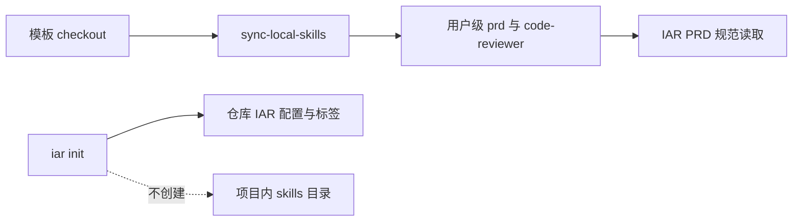

# PRD: 迁移 IAR 技能到模板驱动的用户级安装

> 本 PRD 分两个 altitude，分别服务不同读者，自上而下阅读：
>
> - **Part A · 人审层 (Review Layer)** — 决定要交付什么，以及如何验收；不包含文件路径、实现机制或命令。
> - **Part B · 执行器层 (Build Layer)** — 记录最小实现路径、影响面和可执行验证。

# Part A · 人审层 (Review Layer)

## 1. Introduction & Goals

### Problem Statement

`iar init` 目前把随 wheel 打包的 `prd` 与 `code-reviewer` 副本写入每个目标仓库。这会让同一台机器产生多个漂移副本，且这些副本不跟随权威模板仓库的 skill 更新；用户已经改用模板仓库维护的用户级安装器，当前产品链路却仍在制造项目级副本。

### Interpretation (解读回显)

我把需求读成：**完全移除 IAR 的 bundled-skill 打包、复制、选项与验证；`iar init` 只初始化 IAR 本地配置、gitignore、注册表和标签，不再创建或修改任何项目内 skill；`prd` 的运行时读取遵循模板安装器的用户级目录优先级，使模板安装的 `prd` 可被 IAR 直接使用；文档只引导用户从本机的 `zata_code_template` 运行该安装器，并只选择 `prd` 与 `code-reviewer`。** 不读成：在 Keda 中再实现一份用户级复制器、从运行中的 `iar` 自动修改用户 home 目录、或保留项目内复制作为兼容回退。

### What The User Gets

- 每台机器只维护一套由模板安装器管理的 `prd` 和 `code-reviewer`，不再因 `iar init` 在各项目留下副本。
- `iar init` 的职责收敛为仓库初始化；重复运行不触碰 `.claude/skills/`、`.codex/skills/` 或其他 project-local skill 目录。
- Agent 模式生成 PRD 时能读取模板安装器放在用户级目录中的 `prd` skill；显式路径和既有环境变量覆盖仍可用。

### Measurable Objectives

1. Keda 的 wheel、源树和 CI 不再含 bundled `prd` / `code-reviewer` 分发代码或引用。
2. 在真实临时 Git 仓库运行 `iar init` 后，只产生既有 IAR 初始化产物；任何 project-local skill 目录都不存在。
3. 当模板安装器默认的用户级目录存在 `prd/SKILL.md` 时，IAR 能读取其内容；显式路径与 `IAR_PRD_SKILL_PATH` 的优先级不变。
4. README、安装文档和运行器指南都把模板安装器描述为两个 skill 的唯一安装方式。

## 2. Human Review Map

### 固定区域与跨切面菜单

① core 业务逻辑 / 编排；② 数据库结构 / 迁移；③ 安全 / 鉴权 / 信任边界；④ 对外 API 破坏性契约；⑤ 金钱 / 配额；⑥ 不可逆数据操作；⑦ 并发 / 事务 / 幂等。

### 命中的人审项

- ① `prd` skill 的用户级解析顺序：它决定 Agent 模式的规范输入，必须以真实用户级文件读取结果作为 oracle。
- ④ `iar init` CLI 契约移除两个公开选项并停止项目内副作用，必须以真实 CLI 入口与帮助输出锁定。

### 未命中

②/③/⑤/⑥/⑦ 由执行器与自动门禁处理；若错误，最坏结果是安装/初始化失败或仍有陈旧文件引用，不涉及数据损失、权限扩大或并发状态损坏。

| 改动点 | 架构层 | 风险 | 介入方式（人工确认=高证据负担 / 执行器+门禁=兜底） | 证据 / Oracle |
|---|---|---:|---|---|
| `prd` skill 用户级解析优先级 | core | 中 | 人工确认 | rv-2 |
| `iar init` 停止复制及选项清理 | api / engines | 中 | 人工确认 | rv-1, rv-3 |
| wheel、CI、源码删除 bundled 分发物 | packaging / CI | 低 | 执行器 + 自动门禁 | rv-3, `rg` legacy search, `uv build` |
| 文档迁移为模板安装说明 | docs | 低 | 执行器 + 自动门禁 | rv-4, `uv run mkdocs build --strict` |

**如何证明它生效（真实入口，白话）**：在新建 Git 仓库中运行真正的 `iar init`，确认它写入 IAR 配置但不生成任何项目级 skill；再让 IAR 按用户级路径实际读取模板安装的 `prd/SKILL.md`，并构建 wheel 证明其中没有 bundled skills。

**数据库结构评审**：本次无数据库结构变化。

## 3. Usage And Impact After Implementation

### 开发者 / 运营者

先在本机模板 checkout 中运行 `just sync-local-skills`，在交互列表中只选择 `prd` 与 `code-reviewer`。模板安装器将它们写入 cc-switch、Codex 或 Claude 的用户级 skill 目录；随后在任意目标 Git 仓库运行 `iar init`，该命令仅生成 IAR 所需的仓库配置和标签。

### Agent Runner

Agent 模式读取 PRD 规范时，显式路径优先，其次是 `IAR_PRD_SKILL_PATH`；未提供覆盖时，遵循模板安装器的用户级目标顺序寻找 `prd/SKILL.md`。找不到时仍回退到既有 prompt 模板，保持 runner 可用。

### Impact On Existing Behavior

- `iar init --copy-skills`、`--no-copy-skills` 和 `--skip-skills` 被移除；调用这些遗留选项会由 CLI 标准参数校验拒绝。
- 已存在的项目内 `.claude/skills/` 不会被自动删除，以免破坏用户自定义内容；后续 `iar init` 也不会再更新它们。
- 无前端使用方式或 HTTP 契约变化。

## 4. Requirement Shape

- **Actor**：使用 IAR 和模板 skills 的开发者、Agent Runner 运营者。
- **Trigger**：安装/更新 `prd` 与 `code-reviewer`，或在新仓库执行 `iar init` 与 Agent 模式 PRD 生成。
- **Expected behavior**：模板安装器是唯一的 skill 安装来源；IAR 消费用户级 `prd`，但不写任何项目级 skill。
- **Scope boundary**：不修改模板安装器的交互界面、不自动清理遗留项目目录、不新增远程下载、配置项或后台服务。

# Part B · 执行器层 (Build Layer)

## 5. Repository Context And Architecture Fit

- Existing path: `backend.api.cli_init._run_init_command` 调用 `engines.agent_runner.init_flow.copy_bundled_skills`，而 `pyproject.toml`、release workflow、install smoke 与文档围绕该副作用构建。
- Reuse candidates: 模板仓库已有 `just sync-local-skills` 和 `scripts/shared/template/sync_template.sh --local-skills`，负责目标目录选择、差异检测和只选指定 skills；Keda 不复制这套实现。
- Runtime reuse: `core.use_cases.generated_content.resolve_prd_skill_path` 已有显式路径和 `IAR_PRD_SKILL_PATH` 覆盖，扩展它的默认候选目录即可。
- Architecture constraints: 删除 API 到 engines 的直接导入，且不引入替代的跨层依赖；用户级路径解析保持在既有 core PRD 规范读取路径内，不引入 I/O 服务或存储。
- Frontend impact: No frontend impact——命令行初始化与 agent prompt 规范读取不经由两个 Web 客户端。
- Existing PRD relationship: 与 `P1-REFACTOR-20260703-184226-api-engines-layer-migration` 有交集（该 PRD 列出 `init_flow` 作为 API→engines 迁移能力）；本任务删除该能力而非迁移，独立可执行。实施后应让后续执行者重新运行其 drift search，避免把已删除模块重新引入。
- Redundancy risks: 在 Keda 增加第二个全局安装器、在 wheel 保留只为同步而存在的 skill 目录、或把模板绝对路径硬编码进发布包都会重建同一问题，全部禁止。

## 6. Recommendation

### Recommended Approach

删除 Keda 内 bundled-skill 分发的完整闭环，并让文档委托给本机模板 checkout 的 `sync-local-skills` recipe；同时令 PRD 规范读取识别模板安装器的用户级目录优先级。

### Why This Is The Best Fit

模板已经拥有维护中的选择、覆盖和用户目录决策逻辑。删除 Keda 的复制器与 wheel 资源比再次封装或调用外部绝对路径更小、更可靠，也消除了 API 对 engines 的这条遗留直连。

### Proposed Solution Summary (实现机制)

`iar init` 保留本地配置、gitignore、注册表和标签步骤，移除 skill plan、复制与输出；两个 CLI 前端删除 skill-copy flags。删除随 wheel 打包的 skills 目录、同步脚本和专项单测，并改写 release/install smoke 为实际初始化无 project-local skill 产物、wheel 无 bundled-skill 文件。`resolve_prd_skill_path` 在既有显式和环境变量优先级之后，按模板安装器目标规则寻找用户级 `prd/SKILL.md`，找不到仍返回稳定候选并让 loader 走现有 fallback。文档指向模板 recipe 与两项选择，不复制安装实现或硬编码个人绝对路径。

### Alternatives Considered

- 保留 bundled skill 作为 project-local compatibility fallback：拒绝；会继续制造漂移副本，且与“彻底改掉”矛盾。
- `iar init` 直接执行模板仓库的绝对路径脚本：拒绝；发布给其他机器时路径不存在，并让初始化命令隐式修改用户级状态。
- 在 Keda 新建自动化的全局 installer：拒绝；重复模板已有职责。

## 7. Implementation Guide

This section is a living implementation guide based on current repository analysis. If implementation discovers additional affected files, hidden dependencies, edge cases, or a better path, update this PRD before proceeding.

### 7.1 Core Logic

1. 从 `cli_init`、argparse 和 Typer 入口移除所有 bundled-skill 复制调用和 flags；`--dry-run` 仅打印现有 IAR 配置与 gitignore 计划。
2. 删除 `init_flow.py`、wheel 内 skills 目录、从模板回填 bundled 内容的脚本和相关专项 tests；同步删除 package-data 与 release wheel 内容断言。
3. 调整 install smoke：在临时真实 Git 仓库跑 `iar init --dry-run` 和 `iar init`，断言 `.iar.toml` 存在且 `.claude/skills`、`.codex/skills` 没有被该入口创建。
4. 在 `generated_content` 复用现有 override 入口，按 `CC_SWITCH_SKILLS_DIR`、`~/.cc-switch/skills`、`~/.codex/skills`、`~/.claude/skills` 的模板安装器目标顺序解析第一个存在的 `prd/SKILL.md`；没有任何候选时保留最后候选给现有不可达 fallback。

### 7.2 Change Impact Tree

```text
.
├── src/backend/api/
│   ├── cli_init.py
│   │   【修改】让 iar init 停止计划、复制和展示 bundled skills。
│   ├── cli_parser.py
│   │   【修改】删除 argparse 的 skill-copy 选项。
│   └── cli_typer_init.py
│       【修改】删除 Typer 的相同公开选项。
├── src/backend/core/use_cases/generated_content.py
│   【修改】按模板安装器的用户级目标顺序解析 prd skill。
├── src/backend/engines/agent_runner/
│   ├── init_flow.py
│   │   【删除】移除项目级 bundled-skill 复制器。
│   └── skills/
│       【删除】不再把 prd 与 code-reviewer 打入 wheel。
├── scripts/sync_skills_from_template.py
│   【删除】移除只服务于 bundled tree 的同步脚本。
├── pyproject.toml
│   【修改】取消 skills package-data。
├── .github/workflows/
│   ├── install-smoke.yml
│   │   【修改】验证真实 init 不写项目级 skills。
│   └── release.yml
│       【修改】断言 wheel 与 sdist 不会重新包含已移除资源。
├── tests/
│   ├── test_agent_runner_init_flow.py
│   │   【删除】移除已删除模块的测试。
│   └── test_generated_content.py
│       【修改】覆盖用户级目录候选与 override 优先级。
└── README.md, docs/, config.toml
    【修改】只说明模板安装器与用户级 skill 解析，不再宣称 iar init 会复制 skills。
```

### 7.3 Executor Drift Guard

实施前后运行：

```bash
rg -n -i 'bundled.?skill|copy.?skills|skip.?skills|agent_runner\.skills|\.claude/skills' \
  src tests docs README.md config.toml pyproject.toml .github scripts
rg -n 'IAR_PRD_SKILL_PATH|resolve_prd_skill_path|load_prd_skill_spec' src tests docs config.toml
rg -n 'init_flow|copy_bundled_skills' src tests
```

预期是前两条只保留用户级解析/模板安装说明，第三条无命中。若 release build 仍出现 `agent_runner/skills`，先检查 `pyproject.toml` package-data 和残余目录；若 Agent 模式未读取 skill，先检查 `IAR_PRD_SKILL_PATH` 与 `CC_SWITCH_SKILLS_DIR`。

### 7.4 Flow / Architecture Diagram



### 7.5 ER Diagram

No data model changes in this PRD.

### 7.6 Realistic Validation Plan

```yaml
- id: rv-1
  behavior: "iar init 初始化真实 Git 仓库但不创建或修改项目级 skills"
  real_entry: "tmp_repo=$(mktemp -d) && git -C \"$tmp_repo\" init -q && git -C \"$tmp_repo\" checkout -q -b main && mkdir -p \"$tmp_repo/.claude/skills\" && touch \"$tmp_repo/.claude/skills/sentinel\" && (cd \"$tmp_repo\" && uv run --project /Users/zata/code/keda iar init) && test -f \"$tmp_repo/.iar.toml\" && test -f \"$tmp_repo/.claude/skills/sentinel\" && test ! -e \"$tmp_repo/.claude/skills/prd/SKILL.md\" && test ! -e \"$tmp_repo/.codex/skills\""
  expected: "仓库有 .iar.toml；预存 sentinel 保留，且不新增 .claude/skills/prd/SKILL.md 或 .codex/skills"
  mock_boundary: "Git、文件系统和 CLI parser 必须真实；GitHub label 同步可因无凭据产生既有非致命告警"
  negative_control: "对同一临时仓库反向断言 test -f .claude/skills/prd/SKILL.md"
  expected_fail: "当前实现不创建该旧 bundled 路径，反向断言以非零退出；若旧复制逻辑回归则该断言错误通过"
  test_layer: smoke
  required_for_acceptance: true
- id: rv-2
  behavior: "Agent 模式能从模板安装器目标的用户级目录读取 prd skill"
  real_entry: "uv run pytest -o addopts='' tests/test_generated_content.py -k 'resolve_prd_skill_path'"
  expected: "临时 home 下 cc-switch、Codex、Claude 候选及显式/环境变量覆盖的优先级断言全部通过"
  mock_boundary: "路径候选和 SKILL.md 文件真实创建；不调用外部 agent 或 GitHub"
  negative_control: "删除最高优先级候选后断言解析切换至下一个存在候选"
  expected_fail: "候选顺序或 fallback 错误时返回路径与预期不一致"
  test_layer: integration
  required_for_acceptance: true
- id: rv-3
  behavior: "发布 wheel 不含已删除 bundled skill 资源，仓库没有复制器引用"
  real_entry: "uv build && ! uv run python -m zipfile -l dist/*.whl | rg 'agent_runner/skills/(prd|code-reviewer)/SKILL\\.md' && ! rg -n 'copy_bundled_skills|init_flow' src tests"
  expected: "构建成功，wheel 清单和源码搜索均没有 legacy bundled-skill 路径"
  mock_boundary: "真实构建、wheel 和源码树；不 mock package metadata"
  negative_control: "恢复 package-data 或旧资源目录后，wheel 搜索必须命中并使断言失败"
  expected_fail: "命中 legacy wheel 路径或源码引用时命令非零"
  test_layer: smoke
  required_for_acceptance: true
- id: rv-4
  behavior: "公开文档只引导模板用户级安装，不再声称 iar init 复制 skill"
  real_entry: "uv run mkdocs build --strict && ! rg -n '从 wheel 包内复制|自动.*复制.*(prd|code-reviewer)|Copy bundled skills|--skip-skills|--copy-skills' README.md docs config.toml"
  expected: "文档构建成功且没有陈旧项目级安装说明"
  mock_boundary: "真实 Markdown 与 MkDocs 配置"
  negative_control: "向 README 加回旧 copy-skills 文本后，搜索断言失败"
  expected_fail: "legacy 文本命中时命令非零"
  test_layer: integration
  required_for_acceptance: true
```

Failure triage: `rv-1` 失败先看 `cli_init` 是否仍导入 engine；`rv-2` 失败先看用户级候选和环境变量；`rv-3` 失败先看 package-data/残余资源；`rv-4` 失败先以 legacy `rg` 命中反查文档。

### 7.7 Low-Fidelity Prototype

No low-fidelity prototype required for this PRD.

### 7.8 Interactive Prototype Change Log

No interactive prototype file changes in this PRD.

### 7.9 External Validation

No external validation required; repository evidence was sufficient.

## 8. Delivery Dependencies

- Group: skill-distribution-cleanup
- Depends on tasks/issues:
  - none
- Gate type: none
- Notes: Independent from the pending API-to-engines migration; its future executor must refresh the affected-import inventory after this deletion.

## 9. Acceptance Checklist

### Acceptance Evidence Package（证据包 · 按风险地图排序，终点人审入口）

1. **高风险 oracle 结果**：`rv-1`、`rv-2` 的真实 CLI 与用户级解析输出。
2. **风险地图对账 Predicted → Reconciled**：删除模块后确认没有新的 core/API 风险面。
3. **对抗自检**：`rv-1` 旧 prd 路径的反向断言、`rv-2` 候选降级、`rv-3` legacy wheel 的反向验证结果。
4. **对锁定契约的 diff**：`iar init --help` 不含 copy options，`--help` 与文档均不承诺项目级 skill。
5. **低风险门禁结果（折叠）**：targeted pytest、`uv build`、`just lint --reuse`、`just lint --full`、MkDocs。

### Human-Confirmed (来自 Part A 风险地图)

- [x] `rv-2` 证明用户级 `prd` 读取顺序符合模板安装器目标；保留显式路径与 `IAR_PRD_SKILL_PATH` 覆盖。
- [x] `rv-1` 与 `iar init --help` 证明 CLI 不再创建项目级 skills 且遗留选项已移除。

### Architecture Acceptance

- [x] `src/backend/api/cli_init.py` 不再导入 `backend.engines.agent_runner.init_flow`；该模块和 bundled skills 目录均已删除。
- [x] `rg -n 'copy_bundled_skills|init_flow|backend\.engines\.agent_runner\.skills' src tests` 无命中。

### Behavior Acceptance

- [x] `iar init` 在真实临时 Git 仓库写入 `.iar.toml`，但不创建 `.claude/skills` 或 `.codex/skills`（`rv-1` 证据）。
- [x] argparse 与 Typer 帮助均不暴露 `--copy-skills` / `--skip-skills`，传入时由标准参数校验拒绝。
- [x] `resolve_prd_skill_path` 保持显式路径和 `IAR_PRD_SKILL_PATH` 优先，并支持模板安装器的用户级目标（`rv-2` 证据）。

### Packaging Acceptance

- [x] `uv build` 成功，`uv run python -m zipfile -l dist/*.whl` 不含 `agent_runner/skills/prd` 或 `code-reviewer`（`rv-3` 证据）。
- [x] `.github/workflows/install-smoke.yml` 验证 init 的无 project-local skill 行为，`.github/workflows/release.yml` 断言发行物不含已删除资源。

### Documentation Acceptance

- [x] README、`docs/getting-started/installation.md`、`docs/guides/agent-runner.md` 与 `config.toml` 仅引用模板用户级安装/解析策略。
- [x] `uv run mkdocs build --strict` 通过，且 `rv-4` legacy 搜索无命中。

### Validation Acceptance

- [x] `uv run pytest -o addopts='' tests/test_generated_content.py` 通过。
- [x] `uv run pytest -o addopts='' tests/test_agent_runner_cli.py` 或等价 `iar init` CLI 测试通过。
- [x] `rv-1`、`rv-3` 和 `rv-4` 均以真实 CLI/build/documentation 入口通过。

### Delivery Readiness

- [x] 推荐路径完整实现；Keda 未新增第二套用户级 skill 安装器。
- [x] 无未解释的 bundled-skill 引用、文档漂移或发布门禁缺口。

## 10. Functional Requirements

- FR-1: `iar init` 不得创建、复制、覆盖或同步任何项目内 skill。
- FR-2: `iar init` 不得暴露 bundled-skill copy/skip 选项。
- FR-3: Keda wheel 不得包含 `prd` 或 `code-reviewer` bundled skill 资源。
- FR-4: PRD agent mode 必须按模板安装器的用户级目标读取 `prd`，同时保留显式路径和 `IAR_PRD_SKILL_PATH` 覆盖。
- FR-5: Keda 文档必须把 `prd` 与 `code-reviewer` 的安装委托给 `zata_code_template` 的用户级安装器，并明确只选择这两个 skills。

## 11. Non-Goals

- 不改变模板安装器的交互选择、目标目录算法或其它 skill 的分发。
- 不自动删除用户已有的项目内 `.claude/skills/`。
- 不新增网络下载、配置 schema、HTTP 端点或前端界面。

## 12. Risks And Follow-Ups

- 已经依赖项目内 skill 的机器需要先运行模板安装器；找不到 `prd` 时 runner 仍会使用现有 fallback prompt 并记录告警。
- `code-reviewer` 由 Agent 宿主发现而非 IAR 代码读取；本 PRD 仅确保它不再被 Keda 分发或复制。

## 13. Decision Log

| # | 决策问题 | 选择 | 放弃的方案 | 理由 |
|---|---|---|---|---|
| D-01 | skill 安装权威来源 | `zata_code_template` 的用户级安装器 | Keda wheel + `iar init` 项目级复制 | 模板已提供更新/选择/目标目录治理，唯一来源可消除多副本漂移。 |
| D-02 | `iar init` 的技能行为 | 完全移除 | 兼容性 fallback 继续复制 | fallback 会继续制造项目副本，与用户要求矛盾。 |
| D-03 | IAR 的 `prd` 读取方式 | 识别模板安装器用户级候选 | 硬编码模板 checkout 路径 | 用户安装目录可不同，发布包不能依赖开发者机器路径。 |
