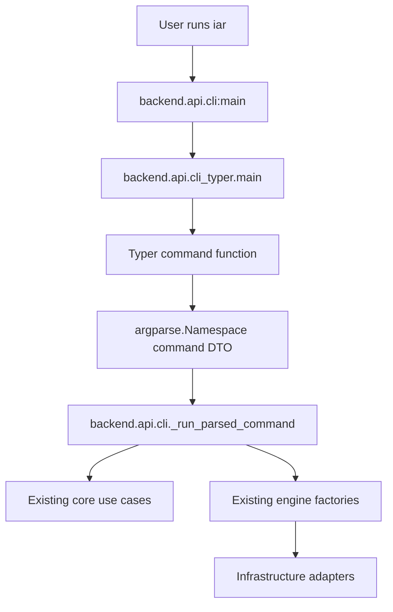
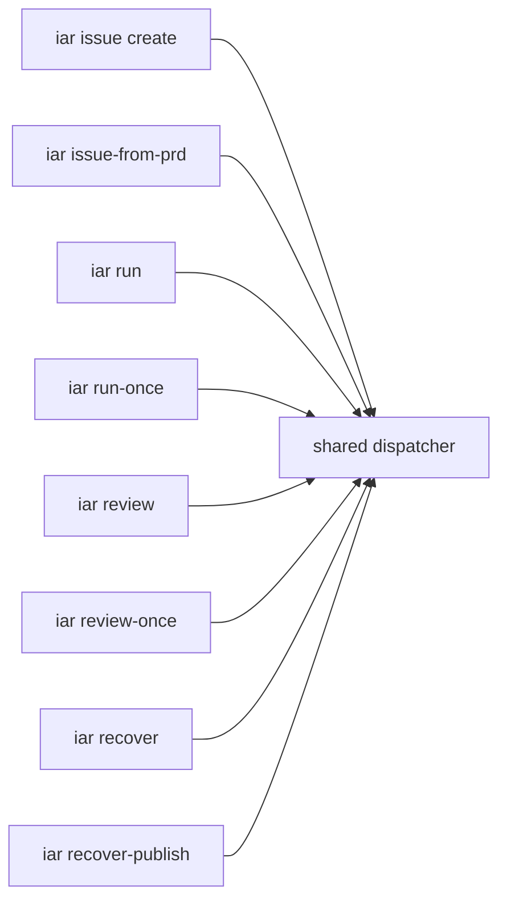

# PRD: iAR Typer/Rich CLI Interaction Migration

## 1. Introduction & Goals

当前 `iar` CLI 已从纯 `argparse` 子命令入口迁移为 Typer/Rich 驱动的人类友好入口，同时保留既有脚本命令兼容。此次变更的目标是一次性改善 CLI 交互方式，而不是只在旧 parser 上追加零散命令。

目标：

- 用 Typer 承载真实 `iar` 命令树，提供分组 help、类型化参数和现代别名。
- 用 Rich 改善人读提示、成功信息和错误信息。
- 提供显式 shell completion 管理入口，支持 `iar completion show/install --shell ...`。
- 保留 `backend.api.cli:main` 作为 `pyproject.toml` console script 入口。
- 保留旧命令 `issue-from-prd`、`run-once`、`review-once`、`recover-publish`，避免破坏脚本和已有文档引用。
- 新增推荐入口 `issue create`、`run`、`review`、`recover`。
- 保持业务逻辑仍走现有 use case，不把状态机或 GitHub 操作复制到 CLI 框架层。

### Realistic Validation

除单元测试和集成测试外，本 PRD 已通过真实项目入口点验证关键行为：

- [x] **Typer help 真实验证**：通过 `uv run python - <<'PY' ... main(["run", "--help"]) ... PY` 验证新命令 help 能由 Typer/Rich 正常渲染。
- [x] **CLI 行为真实验证**：通过 `uv run pytest tests/test_agent_runner_cli.py tests/test_agent_runner_init.py tests/test_worktree_cli.py -q` 验证旧命令、新别名、completion、真实 `uv run iar init --dry-run` 和 worktree CLI 入口均可用。
- [x] **Shell 补全真实验证**：通过 `env _IAR_COMPLETE=complete_bash COMP_WORDS='iar is' COMP_CWORD=1 uv run iar` 验证 `iar is<Tab>` 的底层补全协议返回 `issue` 和 `issue-from-prd`。
- [x] **文档构建验证**：通过 `uv run mkdocs build --strict` 验证 README/guide 相关文档更新不破坏站点构建。
- [x] **仓库总入口验证**：通过 `just test` 验证 full lint、架构检查、最大文件行数检查和 396 个 pytest 全部通过。
- [x] **为什么单元测试不够**：本变更横跨 console script 入口、Typer 参数解析、旧命令兼容、Rich 输出、真实 subprocess CLI 初始化和文档；真实入口验证能证明这些边界按生产路径连接。

## 2. Requirement Shape

**Actor**：本地运行 `iar` 的开发者、Agent Runner operator，以及依赖旧命令的脚本。

**Trigger**：

- 用户执行 `iar --help`、`iar run --dry-run`、`iar issue create ...`、`iar review` 等新入口。
- 既有脚本继续执行 `iar run-once`、`iar issue-from-prd ...` 等旧入口。

**Expected Behavior**：

- `iar --help` 展示 Typer/Rich 风格命令树。
- `iar` 无参数时展示 help 并返回 0，不泄露 `NoArgsIsHelpError` traceback。
- `iar completion show --shell zsh` 输出可 source 的 zsh completion 脚本。
- `iar completion install --shell zsh` 写入用户级 zsh completion 文件，并更新 `~/.zshrc`。
- 新别名和旧命令调用同一套 `_run_parsed_command(...)` 调度逻辑。
- 旧命令行为保持兼容，不改变 ready gating、worktree path 输出、`init --dry-run` TOML 输出等脚本可读输出。
- 人类可读成功/失败信息使用 Rich 统一展示。
- `build_parser()` 继续存在，作为测试和潜在调用方的旧 parser facade。

**Explicit Scope Boundary**：

- 不实现 `iar ask` 自然语言入口。
- 不删除旧命令。
- 不重写 core use case、GitHub client、worktree manager 或 runner 状态机。
- 不新增数据库、daemon 机制、配置项或 Web UI。
- 不要求 live GitHub 凭据验证。

## 3. Repository Context And Architecture Fit

### Existing Path

变更前最接近路径：

```text
pyproject.toml [project.scripts]
  -> backend.api.cli:main
     -> build_parser().parse_args(argv)
     -> main(...) 内部直接按 parsed.command 分支调用 use case
```

变更后路径：

```text
pyproject.toml [project.scripts]
  -> backend.api.cli:main
     -> backend.api.cli_typer.main(argv)
        -> Typer command function
           -> argparse.Namespace(...)
           -> backend.api.cli._run_parsed_command(...)
              -> existing use cases/adapters
```

### Current Relevant Modules And Files

| Path | Current Role | Final State |
|---|---|---|
| `src/backend/api/cli.py` | Console script entry, legacy parser facade, parsed-command dispatcher | 保留入口和业务调度；`main()` 委托 Typer app；`build_parser()` 继续兼容测试 |
| `src/backend/api/cli_typer.py` | 新增 Typer command tree | 注册旧命令、新别名和 completion 管理命令，并把业务命令参数转换为 dispatch namespace |
| `tests/test_agent_runner_cli.py` | CLI parser 和 dispatch tests | 增加 Typer 新别名、顶层 selector、completion、旧命令兼容覆盖 |
| `README.md` | 快速开始 | 推荐新命令，说明旧命令兼容，并记录 shell completion 安装方式 |
| `docs/guides/agent-runner.md` | Agent Runner 操作指南 | 推荐新命令，补充 Typer/Rich、completion 和兼容边界 |
| `pyproject.toml` / `uv.lock` | Python dependency and lock | 增加 `typer>=0.26.7` |

### Architecture Constraints

- `src/backend/api/` 仍只做 CLI 参数解析、DTO/namespace 转换和 use case 调用。
- CLI 框架迁移不改变 `src/backend/core/` 的业务编排职责。
- `api/cli.py` 不直接导入 infrastructure 模块，继续通过 `engines/agent_runner/factory.py` 组装 adapter。
- 新文件保持在 API 层，不新增跨层依赖。
- 单文件非空行数必须低于 1000 行，因此 Typer command tree 拆到 `cli_typer.py`。

### Reuse Candidates

- 复用 `_run_parsed_command(...)` 保证新旧入口不产生平行状态机。
- 复用原 `build_parser()` 锁住旧参数默认值和测试入口。
- 复用现有 `tests/test_agent_runner_cli.py` 的 patch 边界和 fake context。
- 复用现有 README/guide 章节，不新增文档导航。

### Potential Redundancy Risks

- 如果 Typer 命令函数直接调用 use case，会复制 `cli.py` 里的 selector、ready gating、review aggregation 等逻辑；已通过 namespace 转换避免。
- 如果删除 `build_parser()`，会破坏既有 parser-level tests 和潜在内部调用；已保留 facade。
- 如果 Rich 输出污染脚本输出，会破坏 `worktree path`、`init --dry-run` 等管道场景；已保留这些输出为纯文本。

## 4. Options And Recommendation

### Option A: Typer App + Shared Dispatcher + Legacy Parser Facade (Implemented)

新增 `cli_typer.py` 承载 Typer command tree，`cli.py` 保留原 `build_parser()` 和 `_run_parsed_command(...)`。所有 Typer 命令只把 typed 参数转换为 `argparse.Namespace`，再调用共享 dispatcher。

**Pros**：

- 一步到位切换真实 CLI 框架。
- 新旧命令共享同一业务路径。
- 旧测试和脚本兼容。
- 文件大小和职责边界可控。

**Cons**：

- 短期存在 Typer app 与 legacy parser facade 两套解析定义。
- 后续删除旧命令前，需要继续同步参数变更。

### Option B: Full Typer Rewrite Without Parser Facade

删除 `build_parser()` 和旧 parser tests，所有命令只通过 Typer 定义。

**Rejected**：会提高一次性迁移风险，破坏现有 parser-level 测试，并让兼容性回归更难定位。

### Option C: Rich Only, Keep Argparse

只改善输出，不迁移命令框架。

**Rejected**：无法满足“一步到位”改变交互方式的目标，也不利于后续 `issue create`、`run`、`review` 等分组入口。

### Recommendation

采用并已完成 **Option A**。它是当前仓库下最小风险的一步到位方案：真实入口切换到 Typer，同时不复制业务逻辑、不删除旧命令、不破坏脚本输出。

## 5. Implementation Guide

This section is a living implementation guide based on current repository analysis. If implementation discovers additional affected files, hidden dependencies, edge cases, or a better path, update this PRD before proceeding.

### Core Logic

Search anchors:

```bash
rg -n "def _run_parsed_command|def build_parser|Typer|issue create|run_alias|review_alias" src/backend/api tests README.md docs/guides/agent-runner.md
```

Implemented behavior:

- `src/backend/api/cli.py`
  - `_run_parsed_command(parsed)` contains the former command dispatch logic.
  - `main(argv)` imports and delegates to `backend.api.cli_typer.main(argv)`.
  - `build_parser()` remains for legacy parser tests and compatibility.
  - Rich console is used for human-readable success/error output.
- `src/backend/api/cli_typer.py`
  - Defines Typer app, sub-apps, enum choices and command functions.
  - Registers old commands and new aliases.
  - Registers `completion show/install` for explicit shell completion management.
  - Handles no-argument help without leaking Typer internals.
  - Converts Typer options into `argparse.Namespace` and calls `_run_parsed_command(...)`.
- `tests/test_agent_runner_cli.py`
  - Verifies old parser behavior.
  - Verifies new aliases: `run`, `review`, `issue create`.
  - Verifies top-level selector placement: `iar --repo /tmp/repo run --dry-run`.
  - Verifies completion script output, zsh completion installation and `iar is` prefix completion.
- `README.md` and `docs/guides/agent-runner.md`
  - Recommend new command names.
  - Document shell completion installation.
  - Document old command compatibility.

### Change Impact Tree

```text
API
├── src/backend/api/cli.py
│   [修改]
│   【总结】保留 console script 入口、legacy parser facade 和共享 dispatch 逻辑
│
│   ├── main(argv) 委托 cli_typer.main(argv)
│   ├── 原 main 分支逻辑抽为 _run_parsed_command(parsed)
│   └── Rich console 用于人读成功/错误信息，脚本输出保持纯文本
│
├── src/backend/api/cli_typer.py
│   [新增]
│   【总结】新增 Typer/Rich 命令树和现代命令别名
│
│   ├── 注册 labels / issue / worktree 子命令组
│   ├── 注册 issue create / run / review / recover 别名
│   ├── 注册 completion show / completion install 子命令
│   ├── 无参数调用展示 help 并返回成功，不泄露 NoArgsIsHelpError
│   └── 业务命令转为 argparse.Namespace 后调用共享 dispatcher
│
Tests
├── tests/test_agent_runner_cli.py
│   [修改]
│   【总结】覆盖 Typer 新入口、shell completion 和旧命令兼容
│
│   ├── test_main_no_args_shows_help_without_traceback
│   ├── test_main_completion_show_zsh_outputs_script
│   ├── test_main_completion_install_zsh_writes_user_files
│   ├── test_main_completion_protocol_matches_issue_prefix
│   ├── test_main_run_alias_passes_all_repositories_selector
│   ├── test_main_typer_top_level_repo_selector_is_honored
│   ├── test_main_issue_create_alias_matches_issue_from_prd
│   └── test_main_review_alias_dispatches_review_once
│
Docs
├── README.md
│   [修改]
│   【总结】快速开始推荐新命令、标明旧命令兼容并说明 completion 安装
│
├── docs/guides/agent-runner.md
│   [修改]
│   【总结】操作指南记录 Typer/Rich 入口、新别名、completion 和兼容边界
│
Dependencies
├── pyproject.toml
│   [修改]
│   【总结】新增 typer 运行时依赖
│
└── uv.lock
    [修改]
    【总结】锁定 typer 及其 transitive dependency shellingham
```

### Architecture Diagram



### Command Compatibility Flow



### Realistic Validation Plan

| Behavior | Real Entry Point | Dependencies | Command | Expected Result |
|---|---|---|---|---|
| Typer help renders for new aliases | `backend.api.cli.main(["run", "--help"])` | Real Typer/Rich, no GitHub | `uv run python - <<'PY'\nfrom backend.api.cli import main\nraise SystemExit(main([\"run\", \"--help\"]))\nPY` | Exit 0, Rich help includes run options |
| No-argument help is clean | `backend.api.cli.main([])` | Real Typer/Rich, no GitHub | `uv run pytest tests/test_agent_runner_cli.py -q` | Help displays, exit 0, no traceback |
| Completion commands work | `iar completion show/install` and shell completion protocol | Real Typer completion, temp HOME for install test | `uv run pytest tests/test_agent_runner_cli.py -q` | zsh script renders, install writes files, `iar is` returns issue candidates |
| Shell prefix completion works | Console script completion protocol | Real Typer completion, no GitHub | `env _IAR_COMPLETE=complete_bash COMP_WORDS='iar is' COMP_CWORD=1 uv run iar` | Output includes `issue` and `issue-from-prd` |
| Old and new CLI dispatch works | pytest CLI tests | Mock GitHub/client boundaries, real parser/app | `uv run pytest tests/test_agent_runner_cli.py -q` | Old parser, new aliases and completion pass |
| Real `iar init` entry remains valid | Console script through `uv run iar` | Real subprocess, temporary Git repo | `uv run pytest tests/test_agent_runner_init.py -q` | `uv run iar init --dry-run` prints TOML |
| Worktree script output remains script-safe | In-process `main(["worktree", "path", ...])` and real Git tests | Real Git temp repo | `uv run pytest tests/test_worktree_cli.py -q` | `worktree path` prints plain absolute path |
| Docs and full repository remain green | MkDocs and just test | Real repo tooling | `uv run mkdocs build --strict && just test` | Docs build; full lint and 396 tests pass |

### Validation Executed

| Command | Result |
|---|---|
| `uv run pytest tests/test_agent_runner_cli.py -q` | Passed: 30 tests |
| `env _IAR_COMPLETE=complete_bash COMP_WORDS='iar is' COMP_CWORD=1 uv run iar` | Passed: output includes `issue-from-prd` and `issue` |
| `uv run pytest tests/test_agent_runner_cli.py tests/test_agent_runner_init.py tests/test_worktree_cli.py -q` | Passed: CLI, init and worktree tests |
| `uv run mkdocs build --strict` | Passed |
| `just test` | Passed: full lint and 396 pytest tests |

## 6. Functional Requirements

- **FR-1**: `iar` must use a Typer-powered command tree for the real console script entry.
- **FR-2**: `backend.api.cli:main` must remain the console script entry point.
- **FR-3**: `iar issue create` must behave like `iar issue-from-prd`.
- **FR-4**: `iar run` must behave like `iar run-once`.
- **FR-5**: `iar review` must behave like `iar review-once`.
- **FR-6**: `iar recover` must behave like `iar recover-publish`.
- **FR-7**: Existing old commands must remain callable.
- **FR-8**: Top-level `--repo`, `--repo-id` and command-level selectors must both be supported where applicable.
- **FR-9**: Script-readable outputs such as `iar worktree path` and `iar init --dry-run` must remain plain text.
- **FR-10**: CLI business behavior must continue through existing use cases and adapter factories, not duplicate logic in Typer command functions.
- **FR-11**: `iar completion show --shell zsh` must print a zsh completion script for the `iar` executable.
- **FR-12**: `iar completion install --shell zsh` must install user-level zsh completion without requiring project-specific shell snippets.
- **FR-13**: Shell completion for `iar is<Tab>` must include `issue` and the retained legacy `issue-from-prd` command while legacy commands remain supported.

## 7. Non-Goals

- No natural-language `iar ask` implementation.
- No removal of old commands in this PRD.
- No changes to GitHub label state machine.
- No changes to worktree layout.
- No new persistent configuration.
- No Web UI or ops console changes.

## 8. Risks And Follow-Ups

| Risk | Impact | Mitigation |
|---|---|---|
| New Typer app and legacy parser facade can drift | Future option changes might be added to only one surface | Keep tests for both old parser defaults and new Typer aliases; remove facade only after legacy command deprecation PRD |
| Rich output may pollute script output | Shell scripts parsing stdout could fail | Preserve pure `print(...)` output for `init --dry-run` and `worktree path`; use Rich for human-readable status only |
| Shell completion profile edits may differ across local setups | A user may need to reload the shell or inspect their profile order | Provide `completion show` for manual install and test install behavior with temp HOME |
| Old commands may persist indefinitely | CLI surface remains larger than desired | Follow-up PRD created in `tasks/pending/` to remove old commands after stability window |

## 9. Decision Log

| ID | Decision | Rationale |
|---|---|---|
| D-01 | Use Typer as real CLI framework | Meets one-step interaction migration and improves help/typed options |
| D-02 | Keep `backend.api.cli:main` as console script | Avoids pyproject entry churn and preserves external invocation path |
| D-03 | Split Typer command tree into `cli_typer.py` | Keeps `cli.py` under file-size guideline and separates command registration from dispatch |
| D-04 | Keep legacy parser facade | Protects existing tests and gives a stable compatibility bridge |
| D-05 | Keep old commands for now | Avoids breaking scripts; removal is tracked by a separate pending PRD |
| D-06 | Add explicit `completion show/install` commands | Makes shell completion discoverable without relying only on Typer's hidden global options |

## 10. Acceptance Checklist

### Architecture Acceptance

- [x] `src/backend/api/cli_typer.py` exists and owns Typer command registration.
- [x] `src/backend/api/cli.py` remains the console script entry and shared dispatch adapter.
- [x] Typer command functions delegate through `_run_parsed_command(...)` instead of duplicating use case logic.
- [x] Both `src/backend/api/cli.py` and `src/backend/api/cli_typer.py` remain under the 1000 non-empty line limit.

### Behavior Acceptance

- [x] `iar issue create` dispatches to the existing PRD-to-Issue workflow.
- [x] `iar run` dispatches to the existing `run-once` workflow.
- [x] `iar review` dispatches to the existing `review-once` workflow.
- [x] `iar recover` dispatches to the existing `recover-publish` workflow.
- [x] Old commands remain available.
- [x] Top-level repository selectors are honored.
- [x] `iar` with no arguments displays help and does not leak a traceback.
- [x] `iar completion show --shell zsh` prints a zsh completion script.
- [x] `iar completion install --shell zsh` writes user-level completion files.
- [x] Shell completion protocol for `iar is<Tab>` returns `issue` and `issue-from-prd`.

### Documentation Acceptance

- [x] `README.md` recommends new commands and shows old command compatibility.
- [x] `README.md` documents shell completion installation.
- [x] `docs/guides/agent-runner.md` documents Typer/Rich entry behavior, shell completion, new aliases and old command compatibility.
- [x] `uv run mkdocs build --strict` passes.

### Validation Acceptance

- [x] `uv run pytest tests/test_agent_runner_cli.py -q` passes.
- [x] `env _IAR_COMPLETE=complete_bash COMP_WORDS='iar is' COMP_CWORD=1 uv run iar` returns `issue` candidates.
- [x] `uv run pytest tests/test_agent_runner_cli.py tests/test_agent_runner_init.py tests/test_worktree_cli.py -q` passes.
- [x] `uv run mkdocs build --strict` passes.
- [x] `just test` passes.
