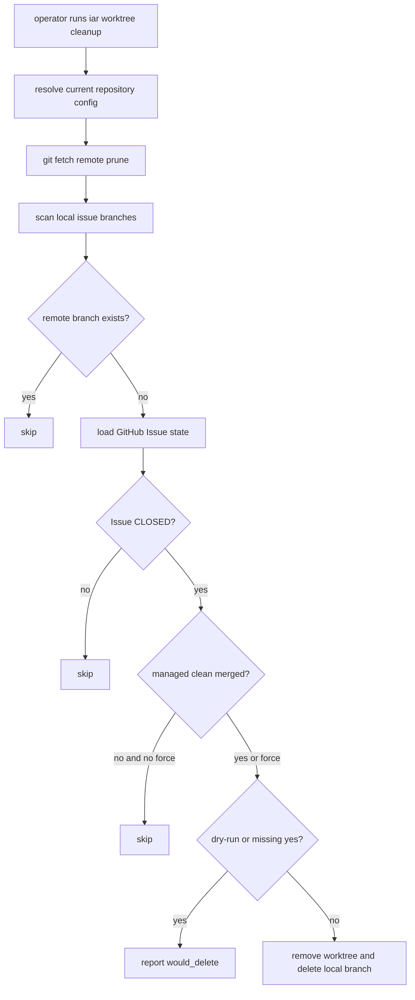

# PRD: iar worktree cleanup stale issue branches

Status: completed
Owner: iAR core
Created: 2026-06-10

## 1. Introduction & Goals

### Problem Statement

`iar` 会为 GitHub Issue 创建本地 `issue-<number>` 分支和
`.iar-worktrees/issue-<number>` worktree。PR 合并后，GitHub Issue 通常已关闭，
远端同名分支也会被删除，但本地分支和 worktree 可能长期残留。操作者目前只能手工
比对本地 Git 状态、远端分支和 GitHub Issue 状态，再逐个删除，容易遗漏，也容易误删
还在开发中的本地 worktree。

### Proposed Solution Summary

新增 `iar worktree cleanup` 子命令，沿用现有 `iar worktree` 命令组和四层架构：

- `api/cli_typer.py` 暴露 `iar worktree cleanup`，再复用 `api/cli.py`
  的 shared dispatcher。
- `core/use_cases/worktree_cleanup.py` 承担清理判定与编排，通过 `IProcessRunner`
  和 `IGitHubClient` 端口读取 Git/GitHub 状态，不直接依赖 infrastructure。
- GitHub CLI adapter 在 Issue summary 中补 `state`，用于确认 Issue 已关闭。
- 命令默认只预览；只有传入 `--yes` 才执行删除。
- 默认只删除同时满足这些条件的本地 `issue-<number>` 分支：Issue 已关闭、远端同名
  branch 已不存在、worktree 位于 `.iar-worktrees/` 下、worktree 干净、分支已合入远端
  base branch。

本方案不引入数据库、不新增后台清理 daemon、不改变 runner 状态机，也不依赖目标仓库的
`just worktree` 脚本。

### Measurable Objectives

- `iar worktree cleanup --dry-run` 能列出将被删除、被跳过和失败的本地 issue 分支。
- `iar worktree cleanup --yes` 能删除符合条件的本地分支及 iAR-managed worktree。
- 默认不会删除 dirty worktree、未合入远端 base branch 的本地分支、当前分支、远端仍存在的同名分支。
- `--force` 只绕过 dirty 和 merged 检查，仍要求 Issue 已关闭且远端同名分支不存在。
- README 和 Agent Runner guide 说明新命令、默认 dry-run 行为和安全边界。

### Realistic Validation

除单元测试和集成测试外，本 PRD 要求通过**真实项目入口点**验证关键行为，确保真实使用路径生效，而非仅在隔离 fixture 中通过。

- [x] **cleanup CLI 真实验证**：通过 `uv run pytest tests/test_worktree_cleanup.py::test_iar_worktree_cleanup_yes_deletes_eligible_branch -q` 验证 Typer/CLI 入口会在真实临时 Git 仓库中删除符合条件的 worktree 和本地分支。
- [x] **安全跳过真实验证**：通过 `uv run pytest tests/test_worktree_cleanup.py -q` 验证 dirty worktree、远端 branch 仍存在、未合入远端 base branch 时不会删除。
- [x] **全量回归验证**：通过 `just test` 验证 full lint、架构边界和现有 runner/worktree 行为没有回归。
- [x] **为什么单元测试不够**：清理行为依赖真实 `git fetch --prune`、remote-tracking ref、`git worktree remove` 和本地分支删除副作用；必须用真实 Git 仓库验证，单纯 mock 命令序列无法证明删除路径安全。

### Delivery Dependencies

- Group: iar-worktree-cleanup
- Depends on groups:
  - none
- Depends on tasks/issues:
  - none
- Gate type: none
- Notes: 与 `P1-FEAT-20260610-143013-validation-evidence-gate` 都涉及关闭后清理分支，但该 PRD 清理的是 `iar-evidence/*` 远端证据分支；本 PRD 清理的是本地 `issue-<number>` worktree/branch，入口和实现路径独立。

## 2. Requirement Shape

- **Actor**：本地运行 `iar` 的开发者或 Agent Runner operator。
- **Trigger**：operator 在目标 Git 仓库中执行 `iar worktree cleanup --dry-run` 或 `iar worktree cleanup --yes`。
- **Expected Behavior**：
  - 命令先同步并 prune 配置 remote。
  - 扫描本地 `issue-<number>` 分支。
  - 对每个候选分支查询 GitHub Issue 状态，并检查远端同名分支、worktree 所属路径、dirty 状态和是否已合入远端 base branch。
  - dry-run 只打印结果；`--yes` 删除符合条件的 `.iar-worktrees` managed worktree 和本地分支。
  - 不符合条件的分支保留，并输出可理解的 skip reason。
- **Explicit Scope Boundary**：
  - In scope：新增 `iar worktree cleanup`，新增 core cleanup use case，扩展 Issue summary state，补 CLI/docs/tests。
  - Out of scope：自动定期清理、删除远端分支、删除非 `issue-<number>` 分支、关闭 GitHub Issue、合并或 rebase 分支。

## 3. Repository Context And Architecture Fit

### Existing Path

当前最接近的路径是 `iar worktree` 命令组：

```text
backend.api.cli:main
  -> backend.api.cli_typer.main
     -> worktree command group
        -> backend.api.cli._run_parsed_command
           -> WorktreeManager for create/path/remove
```

本 PRD 继续复用该入口，但清理规则不是单纯 infrastructure 操作，因此判定逻辑放入
`core/use_cases/worktree_cleanup.py`，具体 Git/GitHub 访问通过端口注入。

### Current Relevant Modules And Files

| Path | Current Role | Planned Relationship |
|---|---|---|
| `src/backend/api/cli_typer.py` | Typer command tree | 新增 `worktree cleanup` 子命令 |
| `src/backend/api/cli.py` | Shared CLI dispatcher | 新增 argparse 兼容 parser、cleanup dispatch 和结果打印 |
| `src/backend/core/use_cases/worktree_cleanup.py` | New use case | 编排 stale issue branch 判定和删除 |
| `src/backend/core/shared/models/agent_runner.py` | Core `IssueSummary` | 增加默认 `state` 字段，保持既有构造调用兼容 |
| `src/backend/infrastructure/github_client.py` | GitHub CLI adapter | `gh issue ... --json` 增加 `state` 并填充 Issue summary |
| `tests/test_worktree_cleanup.py` | New behavior tests | 用真实 Git 仓库覆盖 dry-run/delete/skip/CLI dispatch |
| `tests/conftest.py` | Fake GitHub client | 支持测试设置 Issue state |
| `README.md` and `docs/guides/agent-runner.md` | User docs | 记录命令、默认 dry-run 和安全边界 |

### Architecture Constraints

- `api/` 只做参数接入、依赖装配和输出格式化。
- `core/` 可依赖 `core/shared/interfaces/` 和 core models，不得 import `infrastructure/`。
- `infrastructure/` 的 GitHub adapter 不 import core model；保持当前 duck-typing 风格。
- Python 文本 I/O 必须显式 `encoding="utf-8"`。
- 单个代码文件非空行保持在仓库限制内。

### Existing PRD Relationship

- No duplicate pending PRD found for `iar worktree cleanup` or local stale issue branch cleanup.
- `tasks/archive/20260602-193717-prd-iar-worktree-builtin.md` is a prior completed dependency in the broad sense: it established `.iar-worktrees/<branch>` as the iAR-owned layout and `iar worktree` as the command group.
- `tasks/archive/20260521-145500-prd-issue-worktree-default-tasks-subdir.md` established the historical `<repo>-worktrees/tasks/issue-<number>` layout. This PRD intentionally does not make cleanup auto-delete that legacy/manual layout.
- `tasks/pending/20260527-112400-prd-worktree-sync.md` concerns preparing/reconciling active worktrees before agent work; it is independent from post-close cleanup.
- `tasks/pending/P1-FEAT-20260610-143013-validation-evidence-gate.md` contains remote evidence branch cleanup, but it does not duplicate this local worktree cleanup feature.

### Potential Redundancy Risks

- Do not add a second worktree manager path layout; cleanup must consume only the existing `.iar-worktrees/` convention.
- Do not put cleanup safety rules in `infrastructure/git/worktree.py`; those rules depend on GitHub Issue state and belong in a core use case.
- Do not create a daemon-only cleanup path; operator-triggered CLI is enough for the requested one-click cleanup.

## 4. Recommendation

### Recommended Approach

Implement `iar worktree cleanup` as a conservative CLI-driven core use case:

1. `api/cli_typer.py` registers `worktree cleanup` with `--dry-run`, `--yes`, and `--force`.
2. `api/cli.py` resolves the current repository context, reads configured `git.remote` and `git.base_branch`, creates the GitHub client/process runner, and calls `cleanup_iar_worktrees(...)`.
3. `cleanup_iar_worktrees(...)` performs:
   - `git fetch <remote> --prune`
   - local branch scan for `issue-<number>`
   - remote-tracking ref absence check
   - GitHub Issue `state == CLOSED` check
   - managed worktree path guard for `.iar-worktrees/`
   - dirty guard unless `--force`
   - merged-into-remote-base guard unless `--force`
   - dry-run report or `git worktree remove` plus `git branch -d/-D`
4. CLI prints one line per branch plus a summary count.

### Why This Fits The Current Architecture

- It extends the existing `iar worktree` surface instead of adding a new top-level command.
- It keeps deletion safety in core while all subprocess work still goes through `IProcessRunner`.
- It reuses the current `.iar.toml` repository resolution path so custom remotes and base branches are honored.
- It preserves the existing `WorktreeManager.remove` behavior for explicit single-branch deletion and adds a safer multi-branch cleanup path.

### Alternatives Considered

- **Automatic cleanup during `iar run` or daemon cycles**：Rejected. The request is one-click operator cleanup; automatic deletion during runner cycles increases blast radius and makes failures harder to attribute.
- **Infrastructure-only `WorktreeManager.cleanup`**：Rejected. The decision requires GitHub Issue state and remote branch semantics, not just filesystem/Git worktree operations.
- **Delete every local `issue-<number>` whose Issue is closed**：Rejected. Requiring remote branch absence, clean worktree, and merged status prevents accidental loss of local work.

## 5. Implementation Guide

This section is a living implementation guide based on current repository analysis. If implementation discovers additional affected files, hidden dependencies, edge cases, or a better path, update this PRD before proceeding.

### Core Logic

```text
iar worktree cleanup
  -> cli_typer.worktree_cleanup_command
  -> cli._run_parsed_command(command="worktree", worktree_command="cleanup")
  -> resolve current repository context
  -> create GitHub client and process runner
  -> cleanup_iar_worktrees(request, github_client, process_runner)
     -> git fetch <remote> --prune
     -> list local issue-<number> branches
     -> parse git worktree list --porcelain
     -> for each branch:
        -> skip current branch
        -> skip when refs/remotes/<remote>/<branch> still exists
        -> skip when GitHub Issue is not CLOSED or cannot be queried
        -> skip worktree checked out outside .iar-worktrees/
        -> skip dirty worktree unless --force
        -> skip branch not merged into <remote>/<base_branch> unless --force
        -> dry-run: report would_delete
        -> execute: git worktree remove, git worktree prune, git branch -d/-D
```

### Change Impact Tree

```text
.
├── Domain
│   ├── src/backend/core/use_cases/worktree_cleanup.py
│   │   [新增]
│   │   【总结】新增 stale issue branch cleanup 用例，集中判定删除资格并通过 Git 端口执行清理
│   │   ├── WorktreeCleanupRequest / WorktreeCleanupResult / WorktreeCleanupStatus
│   │   ├── 本地 issue branch 扫描和 worktree porcelain 解析
│   │   ├── Issue closed、remote branch absent、dirty、merged、managed path 等安全检查
│   │   └── dry-run、delete、skip、failed 四类结果输出
│   └── src/backend/core/shared/models/agent_runner.py
│       [修改]
│       【总结】IssueSummary 增加向后兼容的 state 字段，供 cleanup 判断 Issue 是否关闭
│
├── Infrastructure
│   └── src/backend/infrastructure/github_client.py
│       [修改]
│       【总结】GitHub Issue 查询带上 state 字段，并填充到 adapter 侧 IssueSummary
│
├── API
│   ├── src/backend/api/cli_typer.py
│   │   [修改]
│   │   【总结】Typer worktree 命令组新增 cleanup 子命令和 --dry-run/--yes/--force 选项
│   └── src/backend/api/cli.py
│       [修改]
│       【总结】argparse facade 与 shared dispatcher 接入 cleanup use case，并打印清理汇总
│
├── Tests
│   ├── tests/test_worktree_cleanup.py
│   │   [新增]
│   │   【总结】用真实 Git 临时仓库覆盖 dry-run、删除、dirty skip、remote exists skip、unmerged skip 和 CLI dispatch
│   ├── tests/test_agent_runner_cli.py
│   │   [修改]
│   │   【总结】CLI parser 增加 worktree cleanup flag 覆盖
│   ├── tests/test_github_client.py
│   │   [修改]
│   │   【总结】验证 GitHub adapter 查询 issue state
│   └── tests/conftest.py
│       [修改]
│       【总结】FakeGitHubClient 支持 Issue state，并补齐接口方法以保持测试替身可实例化
│
└── Docs
    ├── README.md
    │   [修改]
    │   【总结】快速开始文档新增 cleanup 用法和安全条件
    └── docs/guides/agent-runner.md
        [修改]
        【总结】Agent Runner guide 新增 stale issue worktree cleanup 操作说明
```

### Executor Drift Guard

Use these searches before and after implementation:

```bash
rg -n "worktree cleanup|cleanup_iar_worktrees|WorktreeCleanup" src tests README.md docs
rg -n "IssueSummary\\(" src tests
rg -n "number,title,url,labels,body" src tests
rg -n "worktree_app.command\\(\"cleanup\"\\)|worktree_command == \"cleanup\"" src/backend/api
```

If additional `IGitHubClient` test doubles or Issue summary constructors appear, update them to preserve the default `state="OPEN"` compatibility contract.

### Flow Diagram



### Realistic Validation Plan

| Behavior | Real Entry Point | Test Layer | Mock Boundary | Data/Env Needed | Command Or Procedure | Required For Acceptance |
|---|---|---|---|---|---|---|
| `--yes` deletes eligible local issue branch and managed worktree | `iar worktree cleanup --yes` through `backend.api.cli.main` | integration | Mock GitHub client only; real Git repo, bare remote, worktree, branch deletion | Local temp repo, local bare remote, fake CLOSED Issue | `uv run pytest tests/test_worktree_cleanup.py::test_iar_worktree_cleanup_yes_deletes_eligible_branch -q` | Yes |
| Dry-run reports eligible branch without deleting | `cleanup_iar_worktrees` via real Git repo | integration | Mock GitHub client only; real Git operations | Local temp repo and fake CLOSED Issue | `uv run pytest tests/test_worktree_cleanup.py::test_cleanup_dry_run_reports_closed_issue_with_deleted_remote_branch -q` | Yes |
| Safety guards preserve dirty, remote-existing, and unmerged branches | `cleanup_iar_worktrees` via real Git repo | integration | Mock GitHub client only; real Git operations | Local temp repo variants for dirty, pushed remote branch, local-only commit | `uv run pytest tests/test_worktree_cleanup.py -q` | Yes |
| CLI parser exposes cleanup flags | `build_parser()` | unit | No external dependencies | None | `uv run pytest tests/test_agent_runner_cli.py::test_cli_parser_worktree_cleanup -q` | Yes |
| GitHub adapter returns Issue state | `GitHubCliClient.get_issue` | unit | Fake process runner; no live GitHub | JSON fixture with state field | `uv run pytest tests/test_github_client.py::test_get_issue_requests_state -q` | Yes |
| Repository regression | `just test` | regression | Existing test suite boundaries | Local dev environment | `just test` | Yes |

Failure triage:

- If cleanup uses the wrong remote, inspect `.iar.toml` and `resolve_repository_targets(...)`.
- If deletion fails after worktree removal, inspect `git branch -d` output and merged-state check in `worktree_cleanup.py`.
- If tests cannot instantiate fake clients, run `rg -n "class .*GitHubClient|IGitHubClient" tests src` and update all test doubles.

### Low-Fidelity Prototype

No UI changes in this PRD.

### ER Diagram

No data model changes in this PRD.

### Interactive Prototype Change Log

No interactive prototype file changes in this PRD.

### External Validation

No external validation required; repository evidence was sufficient.

## 6. Definition Of Done

- `iar worktree cleanup --dry-run`, `--yes`, and `--yes --force` are available from the Typer command tree.
- Cleanup decisions are made in a core use case and do not break architecture dependency direction.
- GitHub Issue state is available through the existing GitHub client abstraction.
- Real Git integration tests cover deletion and safety skip cases.
- README and Agent Runner guide document operator usage and safeguards.
- `just test` passes.

## 7. Acceptance Checklist

### Architecture Acceptance

- [x] `src/backend/core/use_cases/worktree_cleanup.py` contains cleanup business rules and imports only core interfaces/models plus standard library.
- [x] `src/backend/api/cli.py` and `src/backend/api/cli_typer.py` only handle command wiring, repository resolution, dependency construction, and output formatting.
- [x] `src/backend/infrastructure/github_client.py` only adapts `gh` output and does not import core modules.

### Behavior Acceptance

- [x] `iar worktree cleanup` without `--yes` behaves as dry-run.
- [x] `iar worktree cleanup --yes` deletes eligible `.iar-worktrees/issue-<number>` worktrees and the matching local branch.
- [x] Cleanup skips branches when the remote branch still exists.
- [x] Cleanup skips open or unqueryable Issues.
- [x] Cleanup skips dirty worktrees and unmerged branches unless `--force` is passed.
- [x] Cleanup skips branches checked out outside `.iar-worktrees/`.
- [x] CLI output includes per-branch status and aggregate counts.

### Documentation Acceptance

- [x] `README.md` documents `iar worktree cleanup --dry-run`, `--yes`, and `--yes --force`.
- [x] `docs/guides/agent-runner.md` documents cleanup conditions and default dry-run behavior.
- [x] No `mkdocs.yml` change is required because no new documentation page is added.

### Validation Acceptance

- [x] `uv run pytest tests/test_worktree_cleanup.py -q` passes.
- [x] `uv run pytest tests/test_github_client.py tests/test_agent_runner_cli.py -q` passes.
- [x] `uv run python hooks/check_architecture.py` passes.
- [x] `just test` passes.

## 8. Functional Requirements

- **FR-1**: The CLI must expose `iar worktree cleanup`.
- **FR-2**: The command must default to preview mode unless `--yes` is supplied.
- **FR-3**: Cleanup must run `git fetch <remote> --prune` before deciding whether a remote branch exists.
- **FR-4**: Cleanup must only consider local branches matching `issue-<number>` by default.
- **FR-5**: Cleanup must require the corresponding GitHub Issue state to be `CLOSED`.
- **FR-6**: Cleanup must require the remote-tracking ref for the same branch to be absent.
- **FR-7**: Cleanup must skip dirty managed worktrees unless `--force` is supplied.
- **FR-8**: Cleanup must skip branches not merged into `<remote>/<base_branch>` unless `--force` is supplied.
- **FR-9**: Cleanup must not delete the currently checked-out branch.
- **FR-10**: Cleanup must not delete branches checked out outside `.iar-worktrees/`.
- **FR-11**: Cleanup must print actionable skip/failure reasons and return non-zero only for deletion failures.

## 9. Non-Goals

- No automatic cleanup inside `iar run`, `iar daemon`, or review cycles.
- No deletion of remote branches.
- No deletion of non-issue branches or custom branch naming schemes beyond the default `issue-<number>`.
- No GitHub Issue closing or label mutation.
- No migration or automatic deletion of legacy worktree directories outside `.iar-worktrees/`.

## 10. Risks And Follow-Ups

- A branch that was never pushed has no remote-tracking branch; if the Issue is closed and the branch is merged, cleanup may delete it. This is acceptable under the safe defaults but should be called out in docs if users expect "remote branch once existed" proof.
- Live GitHub validation is not required for local acceptance because tests mock only the GitHub boundary; optional operator smoke can run against a disposable Issue if credentials and a test repository are available.
- If future work introduces custom issue branch patterns, add a config-driven branch pattern rather than broadening deletion to arbitrary branches.

## 11. Decision Log

| ID | Decision | Chosen | Rejected | Rationale |
|---|---|---|---|---|
| D-01 | Cleanup entry point | `iar worktree cleanup` under the existing worktree command group | New top-level `iar cleanup` command | The behavior is specifically about iAR-managed worktrees and local branches, so the existing command group is the clearest surface. |
| D-02 | Default deletion behavior | Dry-run unless `--yes` is supplied | Delete by default | Branch deletion is destructive; requiring `--yes` gives a safe one-click path without surprising first runs. |
| D-03 | Safety owner | Core use case with injected Git/GitHub ports | Infrastructure-only WorktreeManager cleanup | Eligibility depends on GitHub Issue state and workflow semantics, which are business rules rather than pure Git filesystem operations. |
| D-04 | Merge safety | Require merged into configured remote base unless `--force` | Delete any closed Issue branch with missing remote branch | Closed Issues may include abandoned or unmerged work; merged-state protects local commits by default. |
